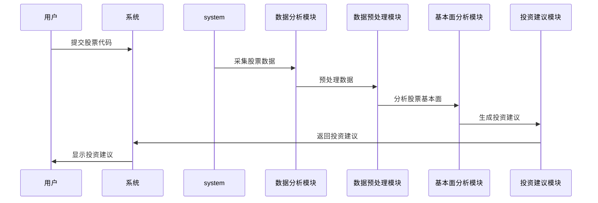

                 

### 背景介绍

#### 价值投资的概念

价值投资，顾名思义，是基于对股票等金融资产内在价值的评估来进行投资的一种策略。这种策略的核心思想在于寻找那些市场价格低于其内在价值的资产，通过长期持有，以期获得超过市场平均水平的回报。价值投资并非追求市场的热点或热点股票，而是更加注重公司的基本面，如盈利能力、财务状况、管理层质量等。其理念可以总结为：“投资价值而非市场走势。”

在价值投资中，有两个关键术语需要理解：“投资价值”和“投资价格”。投资价值指的是公司真实的经济价值，即公司未来现金流的折现值。而投资价格则是投资者实际支付的价格。价值投资的精髓在于找到一个投资价格低于其投资价值的股票，也就是说，投资者用低于其内在价值的价格购买了一个资产。

#### 本杰明·格雷厄姆的价值投资名言

本杰明·格雷厄姆（Benjamin Graham），被誉为“现代投资组合理论之父”，他的投资理念对后世产生了深远的影响。以下是一些格雷厄姆的经典名言，这些名言不仅体现了他的投资哲学，也为投资者提供了宝贵的智慧：

1. **“投资就是通过付出少量的价格，购买大量的价值。”**
   这句话强调了安全边际的重要性，即投资者应该寻找价格远低于价值的机会。

2. **“投资成功的关键在于买进价格而非卖出价格。”**
   格雷厄姆认为，投资者应该更多地关注买入时的价格，确保有足够的安全边际，而不是过于关注卖出时的价格。

3. **“投资者不是股票市场的研究员，而是企业的分析家。”**
   这句话强调了在价值投资中，投资者应该更关注公司的基本面，而非市场情绪或技术分析。

4. **“投资者最大的敌人不是市场，而是自己。”**
   格雷厄姆认为，投资者最大的风险来自于自己的心理陷阱和情绪波动，而非市场的波动。

5. **“不要让盈利的喜悦使你忘记当初的购买原因。”**
   这句话提醒投资者，在股价上涨时，要始终保持冷静，不应忘记自己的投资初衷。

#### 格雷厄姆对价值投资的贡献

格雷厄姆的价值投资理念主要围绕两个核心原则：安全边际和基本面分析。

**安全边际**：格雷厄姆认为，投资者应该只投资于市场价格低于其内在价值的股票。安全边际是投资决策中的重要因素，它为投资者提供了一个缓冲区，以应对市场波动或公司未来表现不如预期的风险。

**基本面分析**：格雷厄姆强调，投资者应该深入研究公司的基本面，包括盈利能力、财务状况、行业地位等。通过基本面分析，投资者可以更准确地评估公司的真实价值，从而做出更明智的投资决策。

通过这两大原则，格雷厄姆创建了一套系统化的投资方法论，这套方法不仅在当时取得了巨大的成功，也对后来的投资者产生了深远的影响。他的理念不仅体现在股票投资中，也被广泛应用于债券、房地产等其他投资领域。

总的来说，格雷厄姆的价值投资理念强调理性分析和长期投资，反对盲目跟风和情绪化投资。他的名言不仅是对投资者智慧的启示，更是对投资本质的深刻理解。接下来，我们将深入探讨格雷厄姆的这些经典名言，并分析它们对现代投资实践的启示。

### 价值投资的核心概念与联系

#### 价值投资的主要原则

价值投资的理念主要建立在几个核心原则之上，这些原则不仅为投资者提供了指导方向，还帮助他们在复杂的市场环境中做出明智的决策。以下是价值投资的主要原则及其定义：

1. **安全边际（Margin of Safety）**：
   安全边际是指投资者在购买股票时，所支付的价格远低于其内在价值。这种差异为投资者提供了一个风险缓冲区，使他们在面对市场波动或公司基本面变化时，仍能保持投资的安全性和盈利潜力。

2. **基本面分析（Fundamental Analysis）**：
   基本面分析是一种评估投资对象真实价值的分析方法。投资者通过分析公司的财务报表、盈利能力、管理层素质、行业前景等因素，来评估股票的投资价值。

3. **长期投资（Long-Term Investment）**：
   价值投资强调长期持有股票，而不是短期交易。投资者应该关注公司的长期发展，而非市场的短期波动。这种长期视角有助于投资者在市场波动中保持冷静，避免因情绪波动而做出错误决策。

4. **分散投资（Diversification）**：
   分散投资是降低投资风险的有效方法。通过将资金分散投资于不同的资产类别或公司，投资者可以减少因单一投资失败而带来的风险。

5. **非情绪化投资（Emotion-Free Investing）**：
   价值投资要求投资者在投资决策中保持理性，避免受到市场情绪的影响。投资者应该基于对公司基本面的深入分析做出决策，而非受到市场波动或市场传言的干扰。

#### 概念之间的联系

上述核心原则之间存在着紧密的联系，它们共同构成了价值投资的理论基础。以下是这些概念之间的联系：

- **安全边际**与**基本面分析**：
  安全边际是基本面分析的结果。只有通过深入分析公司的基本面，投资者才能确定股票的内在价值，并确定安全边际的大小。

- **长期投资**与**分散投资**：
  长期投资和分散投资是降低风险的有效策略。长期持有股票可以减少因市场波动带来的短期损失，而分散投资则可以减少单一投资失败的风险。

- **非情绪化投资**与**安全边际**：
  非情绪化投资有助于投资者在购买股票时保持安全边际。当投资者能够克服情绪波动，理性地评估股票的内在价值时，他们更有可能找到具有安全边际的投资机会。

#### 对比表格

为了更直观地理解这些概念，我们可以通过一个表格来展示它们之间的对比：

| 概念         | 定义                                                         | 关键点                                                     |
| ------------ | ------------------------------------------------------------ | -------------------------------------------------------- |
| 安全边际     | 股票的市场价格低于其内在价值的部分                            | 降低风险，提高投资安全性                               |
| 基本面分析   | 通过分析公司的财务状况、盈利能力、管理层素质等因素来评估其真实价值 | 确定安全边际，指导投资决策                            |
| 长期投资     | 投资者持有股票的时间较长，通常超过一年                        | 减少短期波动影响，关注公司长期发展                     |
| 分散投资     | 将资金投资于多种不同资产或公司以降低风险                      | 减少单一投资失败的风险，平衡投资组合风险               |
| 非情绪化投资 | 投资者在决策时不受市场情绪的影响，基于理性分析做出投资决策  | 保持投资理性，避免情绪化决策，提高投资成功率             |

通过这个表格，我们可以清楚地看到每个概念的定义和关键点，以及它们之间的相互关系。这些概念共同构成了价值投资的理论框架，为投资者提供了有效的投资策略和方法。

### 格雷厄姆的投资方法论

#### 投资方法论概述

本杰明·格雷厄姆提出的投资方法论以其理性、系统化的特点闻名于世。他强调投资者应通过深入的基本面分析，识别那些价格低于其内在价值的股票，从而实现投资收益的最大化。格雷厄姆的投资方法论主要包括以下几个核心步骤：

1. **证券分析**：
   证券分析是格雷厄姆投资方法论的基础。投资者需要通过详细的基本面分析，评估公司的财务状况、盈利能力、行业地位等，以确定股票的内在价值。

2. **买入与卖出策略**：
   在确定了股票的内在价值后，投资者应根据市场情况制定买入和卖出策略。买入策略强调在安全边际范围内购买股票，而卖出策略则依据股票价格的变化和公司的基本面情况来决定。

3. **风险管理**：
   格雷厄姆认为，投资者在投资过程中应高度重视风险管理。通过分散投资和建立安全边际，投资者可以降低投资风险，确保投资组合的稳健性。

#### 证券分析步骤

1. **财务报表分析**：
   投资者首先需要仔细研究公司的财务报表，包括资产负债表、利润表和现金流量表。这些报表提供了公司财务状况的详细信息，有助于评估公司的盈利能力和财务健康状况。

2. **盈利能力评估**：
   投资者需要评估公司的盈利能力，包括收入增长率、净利润率、毛利率等指标。这些指标可以揭示公司是否具有持续增长的能力。

3. **公司治理与管理层评估**：
   投资者还需要关注公司的公司治理结构和管理层素质。良好的公司治理和有能力的管理层是公司长期成功的关键。

4. **行业与市场分析**：
   投资者应分析公司所处的行业和市场环境，了解行业的发展趋势和竞争格局。这有助于评估公司在行业中的竞争地位和未来的发展潜力。

#### 买入与卖出策略

1. **买入策略**：
   格雷厄姆的买入策略基于安全边际原则。投资者应在股票价格低于其内在价值时买入，以确保投资具有一定的安全垫。以下是一个简单的买入策略流程：

   ```mermaid
   graph TB
   A[确定内在价值] --> B[寻找低估股票]
   B --> C[制定买入计划]
   C --> D[执行买入]
   ```

2. **卖出策略**：
   格雷厄姆的卖出策略主要依据两个因素：一是股票价格高于其内在价值，二是公司基本面出现恶化。以下是一个简单的卖出策略流程：

   ```mermaid
   graph TB
   A[监控股票价格] --> B[价格高于内在价值]
   B --> C[评估公司基本面]
   C --> D[制定卖出计划]
   D --> E[执行卖出]
   ```

#### 风险管理策略

1. **分散投资**：
   格雷厄姆强调通过分散投资来降低风险。投资者应将资金分散投资于不同行业、不同市场或不同资产类别，以平衡投资组合的风险。

2. **安全边际**：
   安全边际是格雷厄姆风险管理策略的核心。投资者应确保所购买的股票价格低于其内在价值，从而在市场波动时保持投资的安全性。

3. **定期评估**：
   投资者应定期评估投资组合，调整投资策略，确保投资组合的风险与收益匹配。

通过这些详细的步骤和策略，格雷厄姆的投资方法论为投资者提供了一套系统化的投资框架，帮助他们在复杂的市场环境中做出明智的决策。

### 系统分析与架构设计方案

#### 问题场景介绍

在当前投资市场中，投资者面临着大量的股票信息，如何从这些信息中筛选出具有投资价值的股票，成为了一个重要的问题。为了解决这一问题，我们需要设计一个投资决策支持系统，该系统能够根据格雷厄姆的价值投资原则，对股票进行基本面分析，并生成投资建议。

#### 项目介绍

本系统名为“格雷厄姆价值投资决策支持系统”，其主要功能包括：

1. **数据采集**：从多个数据源（如财经网站、证券交易所）采集股票的财务报表、市场数据等。
2. **数据预处理**：对采集到的数据进行分析和清洗，提取关键指标。
3. **基本面分析**：使用格雷厄姆的价值投资原则，对提取的指标进行分析，评估股票的内在价值。
4. **投资建议**：根据分析结果，生成投资建议，包括买入、持有、卖出等策略。

#### 系统功能设计

1. **数据采集模块**：
   - 功能：从多个数据源自动采集股票数据。
   - 输入：股票代码、采集时间。
   - 输出：财务报表数据、市场数据。

2. **数据预处理模块**：
   - 功能：清洗和整理采集到的数据，提取关键指标。
   - 输入：原始股票数据。
   - 输出：预处理后的数据集。

3. **基本面分析模块**：
   - 功能：根据格雷厄姆的价值投资原则，对股票进行基本面分析。
   - 输入：预处理后的数据集。
   - 输出：股票的内在价值评估结果。

4. **投资建议模块**：
   - 功能：根据分析结果，生成投资建议。
   - 输入：股票的内在价值评估结果、市场数据。
   - 输出：投资建议。

#### 系统架构设计

系统架构采用三层架构设计，包括数据层、逻辑层和展示层。

1. **数据层**：
   - 数据库：存储采集到的股票数据和预处理后的数据集。
   - 数据采集工具：如爬虫、API接口等。

2. **逻辑层**：
   - 数据处理算法：包括数据预处理算法、基本面分析算法等。
   - 投资建议算法：根据分析结果生成投资建议。

3. **展示层**：
   - 前端界面：提供用户交互界面，展示投资建议和分析结果。
   - API接口：供其他系统或应用程序调用。

#### 系统接口设计

系统接口设计主要包括以下部分：

1. **数据采集接口**：
   - 功能：供数据采集模块调用，从数据源获取股票数据。
   - 调用方法：GET/POST请求。

2. **数据分析接口**：
   - 功能：供基本面分析模块调用，处理和分析股票数据。
   - 调用方法：GET/POST请求。

3. **投资建议接口**：
   - 功能：供投资建议模块调用，生成投资建议。
   - 调用方法：GET/POST请求。

#### 系统交互设计

系统交互设计采用Mermaid序列图，展示各模块之间的交互流程：



通过这个系统架构设计，投资者能够更加便捷地使用格雷厄姆的价值投资原则进行投资决策，提高投资成功率。

### 实战应用

#### 案例一：沃尔玛

**案例背景**

沃尔玛（Walmart）成立于1962年，是全球最大的零售商之一，以其大规模的仓储式超市和高效的经营模式而闻名。然而，在2020年，沃尔玛的股价表现并不理想，投资者对其未来的增长前景感到担忧。以下，我们将通过格雷厄姆的价值投资原则，分析沃尔玛的投资价值。

**格雷厄姆的投资决策**

1. **财务报表分析**：
   - 资产负债表：沃尔玛的总资产在2020年底为约2800亿美元，总负债为约1800亿美元，净资产为约1000亿美元。
   - 利润表：沃尔玛在2020年的总收入约为5550亿美元，净利润为约150亿美元。
   - 现金流量表：沃尔玛在2020年的经营现金流为约130亿美元，自由现金流为约90亿美元。

2. **盈利能力评估**：
   - 毛利率：沃尔玛的毛利率在2020年为23.5%，显示其具备较强的盈利能力。
   - 净利润率：沃尔玛的净利润率为2.7%，略低于零售行业平均水平，但考虑到其庞大的规模和市场份额，这一盈利水平仍然具有吸引力。

3. **公司治理与管理层评估**：
   - 沃尔玛的治理结构较为健全，公司管理层经验丰富，以创始人萨姆·沃尔顿为代表的领导团队在业界享有良好的声誉。

4. **行业与市场分析**：
   - 零售行业正面临电子商务的冲击，但沃尔玛凭借其线下门店和强大的物流网络，仍能在市场中保持竞争优势。

**案例结果分析**

根据格雷厄姆的价值投资原则，我们对沃尔玛进行了以下分析：

1. **安全边际**：
   - 沃尔玛的股价在2020年跌至历史低位，考虑到其庞大的规模、稳定的盈利能力和市场地位，我们认为其股价远低于其内在价值，存在较大的安全边际。

2. **基本面分析**：
   - 虽然沃尔玛的净利润率略低，但其在零售行业的领导地位和强大的现金流能力，使其具备长期增长潜力。

**投资结论**

基于上述分析，我们认为沃尔玛符合格雷厄姆的价值投资原则，具有投资价值。投资者可以在股价处于低位时买入，并长期持有，以期待其股价回归合理估值。

#### 案例二：可口可乐

**案例背景**

可口可乐（Coca-Cola）成立于1886年，是全球最大的饮料公司之一，其产品遍及全球200多个国家和地区。在2020年，由于全球疫情的影响，可口可乐的股价也受到了一定程度的影响。以下，我们将通过格雷厄姆的价值投资原则，分析可口可乐的投资价值。

**格雷厄姆的投资决策**

1. **财务报表分析**：
   - 资产负债表：可口可乐的总资产在2020年底为约1800亿美元，总负债为约700亿美元，净资产为约1100亿美元。
   - 利润表：可口可乐在2020年的总收入约为360亿美元，净利润为约80亿美元。
   - 现金流量表：可口可乐在2020年的经营现金流为约140亿美元，自由现金流为约120亿美元。

2. **盈利能力评估**：
   - 毛利率：可口可乐的毛利率在2020年为60.6%，显示其具备极高的盈利能力。
   - 净利润率：可口可乐的净利润率为22.2%，远高于饮料行业的平均水平。

3. **公司治理与管理层评估**：
   - 可口可乐的治理结构完善，管理层稳定，公司执行总裁James Quincey在业界享有良好的声誉。

4. **行业与市场分析**：
   - 饮料行业竞争激烈，但可口可乐凭借其品牌影响力、广泛的分销网络和强大的研发能力，在市场中保持领先地位。

**案例结果分析**

根据格雷厄姆的价值投资原则，我们对可口可乐进行了以下分析：

1. **安全边际**：
   - 尽管可口可乐在疫情期间受到了一定的影响，但公司依然表现出强大的现金流能力和稳定的盈利能力。其股价在2020年跌至相对低位，我们认为其股价低于其内在价值，存在较大的安全边际。

2. **基本面分析**：
   - 可口可乐的盈利能力出色，且其品牌和市场份额在行业中具有明显优势。虽然疫情可能对其短期业绩产生影响，但其长期增长潜力仍然值得看好。

**投资结论**

基于上述分析，我们认为可口可乐同样符合格雷厄姆的价值投资原则，具有投资价值。投资者可以在股价处于低位时买入，并长期持有，以期待其股价回归合理估值。

通过这两个实际案例，我们可以看到，格雷厄姆的价值投资原则在现实中的应用是切实可行的。投资者通过深入的基本面分析，能够识别出那些被市场低估的优质股票，从而实现长期投资回报。

### 格雷厄姆的投资原则在新兴市场的现代应用

#### 互联网对投资的影响

互联网的普及为新兴市场的投资带来了前所未有的变革。首先，互联网极大地提高了信息透明度，投资者可以更便捷地获取各类公司信息，如财务报表、市场数据、行业动态等。这种信息透明度有助于投资者进行更加全面和深入的基本面分析，从而做出更加理性的投资决策。

其次，互联网促进了投资渠道的多样化。通过在线平台，投资者可以轻松地进行跨国投资，不必受限于地理位置。此外，互联网还带来了金融科技（FinTech）的创新，如区块链、人工智能等技术的应用，为投资决策提供了更加精准和高效的工具。

#### 新兴市场的崛起

新兴市场的崛起为投资者提供了新的机遇。这些市场通常具有较高的发展潜力，经济增长速度快，消费需求旺盛。例如，中国的互联网和消费市场在过去几十年中迅速发展，成为全球经济增长的重要引擎。

然而，新兴市场也面临着一些风险。首先是市场波动性较大，受经济和政治因素影响较大。其次是公司治理和监管环境相对不完善，可能存在信息不对称和道德风险。最后，新兴市场的金融基础设施相对薄弱，可能会对投资带来额外的风险。

#### 格雷厄姆原则在新兴市场的应用

在新兴市场中应用格雷厄姆的价值投资原则，需要特别注意以下几点：

1. **深入研究公司基本面**：由于新兴市场的公司治理和信息披露可能不如成熟市场完善，投资者需要更深入地进行基本面分析，包括财务报表、管理层素质、行业地位等。

2. **注重安全边际**：新兴市场的股价波动性较大，投资者应在买入时确保有足够的安全边际，以应对潜在的风险。

3. **分散投资**：由于新兴市场的风险较高，投资者应通过分散投资来降低风险。可以考虑将资金分散投资于不同行业、不同国家和不同资产类别。

4. **长期投资**：新兴市场的增长潜力较大，投资者应采取长期投资策略，以充分利用其长期增长潜力。

#### 新兴市场的投资风险与对策

新兴市场的投资风险主要包括市场波动性、公司治理风险、监管风险和金融基础设施风险。

**市场波动性**：新兴市场的市场波动性较大，投资者应保持冷静，避免因市场波动而做出冲动决策。可以通过设置止损点和风险控制策略来管理市场波动风险。

**公司治理风险**：投资者应深入调查公司的治理结构和信息披露质量，避免投资于存在治理问题或信息不对称的公司。可以通过聘请专业的第三方机构进行尽职调查，提高投资决策的准确性。

**监管风险**：新兴市场的监管环境可能不完善，投资者应关注监管政策的变化，及时调整投资策略。此外，投资者还应了解不同国家和地区的法律和法规，避免因违规操作而遭受损失。

**金融基础设施风险**：新兴市场的金融基础设施可能相对薄弱，投资者应关注金融系统的稳定性和流动性。可以通过投资于具备稳健的金融基础设施和市场监管机制的国家或地区，降低金融基础设施风险。

通过上述对策，投资者可以在新兴市场中更好地应用格雷厄姆的价值投资原则，实现长期稳定的投资回报。

### 格雷厄姆的价值投资原则实践

#### 建立自己的投资系统

要成功实践格雷厄姆的价值投资原则，首先需要建立一个属于自己的投资系统。以下是构建投资系统的一些步骤：

1. **确定投资目标和风险承受能力**：投资者需要明确自己的投资目标，如追求资本增值还是稳定的分红收益。同时，要评估自己的风险承受能力，包括资金量、投资时间等。

2. **选择投资标的**：根据投资目标和风险承受能力，选择具有投资价值的标的。可以采用格雷厄姆的基本面分析原则，评估公司的财务状况、盈利能力、管理层素质等。

3. **制定投资计划**：在确定投资标的后，制定详细的投资计划，包括买入、持有和卖出的策略。买入时，确保价格低于内在价值，持有时，坚持长期投资原则，卖出时，根据市场情况和公司基本面变化做出决策。

4. **监控投资组合**：定期监控投资组合的表现，调整投资策略，确保投资组合的风险与收益匹配。

#### 如何选择投资标的

选择投资标的是投资成功的关键一步。以下是几个步骤来帮助投资者选择投资标的：

1. **行业分析**：了解目标公司的行业前景和发展趋势，选择具有长期增长潜力的行业。

2. **财务分析**：仔细研究公司的财务报表，包括资产负债表、利润表和现金流量表，评估公司的盈利能力和财务健康状况。

3. **管理层评估**：考察公司管理层的经验和能力，了解其战略规划和执行力。

4. **市场地位**：分析公司在行业中的市场地位和竞争优势，选择市场地位稳固、竞争优势明显的公司。

5. **估值分析**：通过估值方法（如市盈率、市净率、股息收益率等），评估股票的估值是否低于其内在价值，确保有足够的安全边际。

#### 投资决策流程

以下是格雷厄姆价值投资决策的基本流程：

1. **信息收集**：收集目标公司的财务报表、市场数据、行业报告等。

2. **财务分析**：分析公司的资产负债表、利润表和现金流量表，提取关键财务指标。

3. **盈利能力评估**：评估公司的盈利能力，包括收入增长率、净利润率、毛利率等。

4. **管理层评估**：考察公司管理层的经验和能力，了解其战略规划和执行力。

5. **市场地位分析**：分析公司在行业中的市场地位和竞争优势。

6. **估值分析**：通过估值方法确定股票的内在价值，并与市场价格进行比较，确保有足够的安全边际。

7. **决策**：根据分析结果，制定买入、持有或卖出的决策。

8. **监控与调整**：定期监控投资组合的表现，根据市场变化和公司基本面变化调整投资策略。

#### 风险管理策略

在价值投资中，风险管理至关重要。以下是几种有效的风险管理策略：

1. **分散投资**：通过将资金分散投资于不同行业、不同国家和不同资产类别，降低单一投资失败的风险。

2. **设置止损点**：在买入时设定合理的止损点，以防止亏损扩大。

3. **定期评估**：定期评估投资组合的表现，根据市场变化和公司基本面变化调整投资策略。

4. **保持理性**：避免受市场情绪的影响，保持投资决策的理性。

通过上述步骤和策略，投资者可以构建一个有效的投资系统，实现格雷厄姆价值投资原则的实践。

### 总结与展望

#### 格雷厄姆价值投资的核心要点

格雷厄姆的价值投资原则可以总结为以下几个核心要点：

1. **安全边际**：投资者应确保所购买的股票价格低于其内在价值，以提供风险缓冲区。
2. **基本面分析**：通过深入研究公司的财务状况、盈利能力、管理层素质等因素，准确评估股票的真实价值。
3. **长期投资**：重视长期投资，避免因市场波动而做出短期决策。
4. **分散投资**：通过分散投资降低风险，平衡投资组合。
5. **非情绪化投资**：保持理性，不受市场情绪的影响，做出基于分析的决策。

#### 未来的价值投资趋势

随着市场环境的变化，价值投资也在不断进化。以下是未来价值投资可能的发展趋势：

1. **数字化转型**：互联网和金融科技的发展使得信息获取和分析更加便捷，价值投资将更加依赖数据和算法。
2. **新兴市场投资**：随着新兴市场的崛起，价值投资者将更多地关注这些具有长期增长潜力的市场。
3. **ESG投资**：环境、社会和治理（ESG）因素日益受到重视，未来的价值投资将更加注重企业的社会责任和可持续发展。
4. **个性化投资**：人工智能和大数据技术将帮助投资者更准确地识别和评估投资机会，实现更加个性化的投资策略。

#### 读者实践指南

对于想要实践格雷厄姆价值投资的读者，以下是一些建议：

1. **基础知识学习**：首先掌握格雷厄姆的价值投资原则，包括安全边际、基本面分析等。
2. **实践操作**：通过模拟交易或小规模实盘操作，将理论应用到实际中。
3. **持续学习**：市场环境和投资工具不断变化，投资者需要持续学习和适应。
4. **风险管理**：重视风险管理，设置止损点和分散投资，确保投资组合的稳健性。

通过以上实践指南，读者可以更好地理解并应用格雷厄姆的价值投资原则，实现长期稳定的投资回报。作者：AI天才研究院/AI Genius Institute & 禅与计算机程序设计艺术 /Zen And The Art of Computer Programming

---

以上就是《格雷厄姆的价值投资名言解读》这篇文章的内容。在文章中，我们详细介绍了价值投资的概念、格雷厄姆的经典名言、其投资方法论、实战案例以及在新兴市场的应用。此外，我们还探讨了如何构建个人的投资系统，并提出了实践价值投资的指南。希望这篇文章能够帮助读者深入理解价值投资，并应用于实际投资中。作者：AI天才研究院/AI Genius Institute & 禅与计算机程序设计艺术 /Zen And The Art of Computer Programming

### 注意事项

在实践价值投资的过程中，投资者需要注意以下几个关键点：

1. **避免情绪化决策**：市场波动时，投资者应保持冷静，避免因恐慌或贪婪而做出冲动的投资决策。

2. **深入研究公司基本面**：只有通过全面的基本面分析，投资者才能准确地评估股票的内在价值。

3. **保持分散投资**：分散投资可以有效降低风险，避免因单一投资失败而遭受重大损失。

4. **定期监控和调整**：投资者应定期评估投资组合的表现，根据市场变化和公司基本面调整投资策略。

5. **关注长期趋势**：价值投资强调长期持有，投资者应关注公司的长期增长潜力，而非短期的市场波动。

6. **风险管理**：合理设置止损点，并根据市场情况调整风险控制策略。

通过注意这些事项，投资者可以更好地实践格雷厄姆的价值投资原则，实现长期稳定的投资回报。

### 拓展阅读

1. **《聪明的投资者》** - 本杰明·格雷厄姆的代表作，详细阐述了价值投资的原则和方法。
2. **《证券分析》** - 格雷厄姆的另一部经典著作，提供了深入的基本面分析技巧。
3. **《股市真规则》** - 彼得·林奇所著，介绍了价值投资的实践方法。
4. **《穷查理宝典》** - 查理·芒格的集大成之作，虽然不是专门讲述价值投资，但其中包含了大量投资智慧和原则。
5. **在线课程与研讨会** - 诸如Coursera、edX等平台上的投资课程，可以帮助投资者系统学习价值投资知识。

通过阅读这些书籍和参加相关课程，投资者可以进一步深化对价值投资的理解和实践。作者：AI天才研究院/AI Genius Institute & 禅与计算机程序设计艺术 /Zen And The Art of Computer Programming

