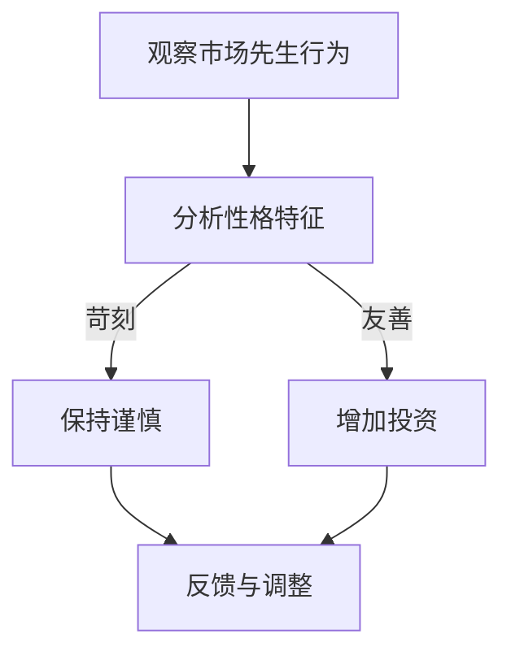
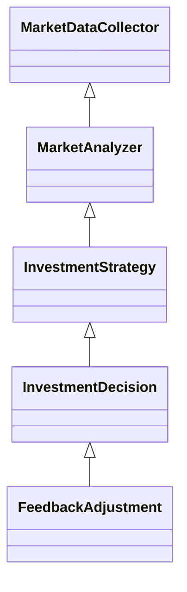
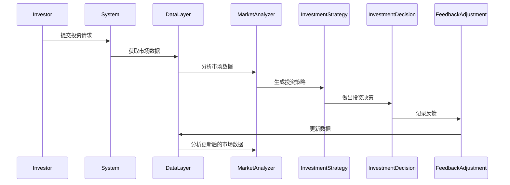
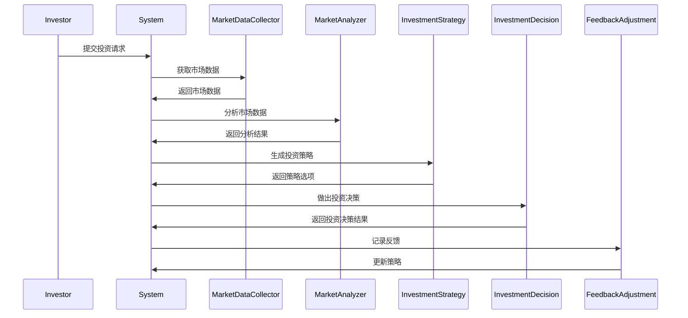

                 

### 第1章 引言：格雷厄姆的市场先生比喻

#### 1.1 背景介绍

格雷厄姆的市场先生比喻起源于1949年，由美国著名投资家本杰明·格雷厄姆在其著作《聪明的投资者》中首次提出。这一比喻旨在帮助投资者理解市场波动的本质以及如何在这种波动中做出明智的投资决策。格雷厄姆的市场先生比喻是一个生动而形象的比喻，将市场比作一个每天出现并与人交流的先生。

#### 1.2 问题与解决方案

投资市场存在诸多挑战，如市场的波动性、投资者的情绪波动等。格雷厄姆的市场先生比喻提供了一个洞察市场的工具，帮助投资者理性看待市场的波动，并在此基础上做出合理的投资决策。这一比喻的核心在于提醒投资者，市场先生时而友善，时而苛刻，但始终是投资者必须学会与之共舞的伙伴。

#### 1.3 边界与外延

格雷厄姆的市场先生比喻主要适用于股票市场，但其原理和思想也适用于其他投资领域。与其他投资理论相比，市场先生比喻更强调投资者的心理素质和长期投资策略。这一比喻不仅在学术研究中具有重要地位，也在实际投资中被广泛应用。

### 1.4 文章核心关键词

- 本杰明·格雷厄姆
- 市场波动
- 投资者心理
- 长期投资策略
- 市场先生比喻

### 1.5 摘要

本文旨在深入探讨格雷厄姆的市场先生比喻，从背景介绍、核心概念、算法原理、系统分析与架构设计、项目实战以及最佳实践等方面进行全面解析。通过本文的阅读，读者将能够理解市场波动的本质，掌握格雷厄姆的市场先生比喻在实际投资中的应用，并从中汲取宝贵的投资智慧。

---

通过以上章节的介绍，我们为读者搭建了一个清晰的框架，引领他们进入格雷厄姆的市场先生比喻的世界。接下来，我们将进一步深入探讨这一比喻的构成和原理，帮助读者更好地理解和应用这一投资智慧。希望读者能够在接下来的阅读中有所收获，逐渐培养出理性、冷静的投资心态。

## 第2章 格雷厄姆的市场先生比喻：核心概念与原理

### 2.1 格雷厄姆的市场先生比喻的构成要素

格雷厄姆的市场先生比喻由两个关键角色构成：市场先生和投资者。市场先生代表市场的价格波动，他时而友善，时而苛刻；投资者则是参与市场的主体，他们需要根据市场先生的行为做出投资决策。

#### 市场先生

市场先生是一个复杂多变的角色。他有时乐观开朗，高估股票的价值，导致股价高涨；有时又悲观沮丧，低估股票的价值，导致股价低落。市场先生的行为受到多种因素的影响，包括投资者情绪、经济数据、政策变化等。

#### 投资者

投资者是市场先生的互动对象。他们需要时刻关注市场先生的行为，并根据市场先生的性格特征调整自己的投资策略。投资者包括个人投资者和专业机构，他们追求的是在市场波动中实现资产的保值增值。

### 2.2 格雷厄姆的市场先生比喻的属性特征

格雷厄姆的市场先生比喻揭示了市场先生和投资者的多种属性特征，以下是其中的几个关键点：

#### 市场先生的性格特征

1. **友善与苛刻交替**：市场先生时而友善，投资者感到机会来临；时而又变得苛刻，投资者面临压力。
2. **情绪化**：市场先生的性格容易受到投资者情绪的影响，情绪高涨时可能会过度乐观，情绪低落时则可能过度悲观。
3. **随机性**：市场先生的行为具有随机性，投资者难以准确预测其下一步行动。

#### 投资者的应对策略

1. **理性分析**：投资者需要保持理性，避免被市场先生的情绪所影响。
2. **长期投资**：投资者应采取长期投资策略，避免频繁交易，减少交易成本。
3. **多样化投资**：投资者应通过多样化投资来分散风险，降低单一投资的风险。

### 2.3 格雷厄姆的市场先生比喻的ER实体关系图

为了更直观地展示格雷厄姆的市场先生比喻的实体关系，我们可以使用Mermaid来绘制ER图。以下是ER图的Markdown格式表示：

```mermaid
erDiagram
  Market_Mr --> Investor : 互动
  Market_Mr ||--|> Stock : 价格波动
  Investor ||--|> Investment : 投资决策
```

#### 实体与关系的分析

- **Market_Mr（市场先生）**：市场先生是ER图中的核心实体，负责股票价格的波动，与投资者有直接的互动关系。
- **Investor（投资者）**：投资者是另一个关键实体，通过观察市场先生的行为，做出投资决策。
- **Stock（股票）**：股票是市场先生和投资者互动的媒介，市场先生通过股票价格的变化影响投资者。
- **Investment（投资决策）**：投资决策是投资者根据市场先生的行为采取的行动，是投资者与市场先生互动的结果。

通过ER图的绘制和分析，我们可以更清晰地理解格雷厄姆的市场先生比喻中各个实体的关系和作用，从而为后续的算法原理和系统架构设计提供基础。

---

在本文的第二章中，我们深入探讨了格雷厄姆的市场先生比喻的核心概念和原理。通过分析市场先生和投资者的角色及其属性特征，以及使用Mermaid绘制的ER图，我们为读者提供了一个直观的理解框架。接下来，我们将进一步探讨市场先生比喻中的算法原理和数学模型，帮助读者更深入地理解这一比喻在投资决策中的应用。

## 第3章 算法原理与数学模型

### 3.1 市场先生比喻的算法流程

格雷厄姆的市场先生比喻提供了一个直观的算法框架，用于指导投资者应对市场波动。这一算法的核心在于分析市场先生的行为，并据此制定投资策略。以下是市场先生比喻的算法流程：

1. **观察市场先生的行为**：投资者首先需要密切关注市场先生的行为，包括股票价格的波动、市场情绪的变化等。
2. **分析市场先生的性格特征**：根据市场先生的历史行为，分析其性格特征，判断其当前的状态是友善还是苛刻。
3. **制定投资策略**：根据市场先生的状态，投资者应调整自己的投资策略。例如，在市场先生友善时，可以适当增加投资；在市场先生苛刻时，应保持谨慎。
4. **执行投资决策**：根据制定的投资策略，投资者执行具体的投资决策，如买入、持有或卖出股票。
5. **反馈与调整**：投资者需持续观察市场先生的行为，并根据市场变化调整投资策略。

以下是使用Mermaid绘制的算法流程图：



### 3.2 数学模型与公式

为了量化市场先生的行为和投资决策，我们可以引入一些数学模型。以下是几个关键的数学模型和公式：

#### 1. 市场预期模型

$$E(P_t) = \alpha + \beta \cdot r_t$$

其中，$E(P_t)$ 表示市场预期价格，$\alpha$ 表示股票的基本价值，$\beta$ 表示市场情绪的影响，$r_t$ 表示市场先生的历史行为。

#### 2. 投资者预期收益模型

$$R_t = P_t - P_{t-1} + \delta$$

其中，$R_t$ 表示投资者的预期收益，$P_t$ 表示当前市场价格，$P_{t-1}$ 表示上一市场价格，$\delta$ 表示其他潜在收益。

#### 3. 投资策略调整模型

$$S_t = f(E(P_t), \theta)$$

其中，$S_t$ 表示投资策略，$f$ 是一个函数，$\theta$ 是投资者的风险偏好参数。

### 3.3 算法举例说明

为了更清晰地展示市场先生比喻的算法原理，我们通过一个具体的例子来进行分析。

#### 情景描述

假设当前市场价格为$P_t = 100$，投资者通过分析市场先生的历史行为，判断市场预期价格为$E(P_t) = 110$。同时，投资者风险偏好参数$\theta = 0.5$。

#### 步骤详解

1. **观察市场先生行为**：投资者观察到市场先生最近的表现较为友善。
2. **分析性格特征**：根据市场预期价格和投资者预期收益模型，投资者判断市场先生的性格特征为友善。
3. **制定投资策略**：根据投资策略调整模型，投资者决定增加投资。
4. **执行投资决策**：投资者购买股票，预期收益为$R_t = 110 - 100 + 0.5 = 10.5$。
5. **反馈与调整**：投资者将持续关注市场先生的行为，并在市场变化时调整投资策略。

通过以上步骤，我们可以看到市场先生比喻的算法在实际应用中的具体实施过程。这种算法不仅帮助投资者应对市场波动，还能根据市场变化进行灵活调整，从而提高投资收益。

---

在本章中，我们详细阐述了格雷厄姆的市场先生比喻的算法原理和数学模型。通过算法流程图和具体的数学公式，我们为读者提供了一个系统的理解框架。同时，通过实际案例的举例说明，我们展示了这一算法在实际投资决策中的应用。接下来，我们将进一步探讨系统分析与架构设计，帮助读者从更宏观的角度理解市场先生比喻的实践价值。

## 第4章 系统分析与架构设计

### 4.1 问题场景介绍

在投资市场中，投资者面临诸多挑战，如市场波动性、信息不对称、投资决策的时间敏感性等。格雷厄姆的市场先生比喻提供了一个有效的框架，帮助投资者理解和应对这些挑战。在本章节中，我们将通过一个典型的投资决策场景，介绍如何应用市场先生比喻进行系统分析与架构设计。

#### 投资决策场景

假设投资者小明是一位长期投资者，他关注一家科技公司的股票。近期，由于公司发布了季度财报，股价出现了较大波动。小明希望通过格雷厄姆的市场先生比喻，结合系统分析与架构设计，制定出合理的投资策略。

### 4.2 系统功能设计

为了实现格雷厄姆的市场先生比喻，我们需要设计一个完整的系统，包括以下几个关键功能：

1. **市场数据采集**：系统需要能够实时采集市场数据，包括股票价格、交易量、市场情绪指标等。
2. **市场分析模块**：该模块负责分析市场数据，识别市场先生的行为特征，判断其性格是否友善。
3. **投资策略模块**：根据市场分析结果，系统应提供多种投资策略选项，如增加投资、减少投资、保持现状等。
4. **投资决策模块**：投资者根据系统提供的策略选项，结合自己的风险偏好，做出最终的投资决策。
5. **反馈与调整模块**：系统需要记录投资决策的结果，并根据反馈进行策略调整，提高投资效果。

以下是使用Mermaid绘制的领域模型类图：



### 4.3 系统架构设计

在系统功能设计的基础上，我们需要构建一个合理的系统架构，确保各个模块之间的协调工作，以下是系统架构设计的关键组成部分：

1. **数据层**：负责数据存储和读取，包括股票价格历史数据、交易量数据、市场情绪指标等。
2. **业务逻辑层**：实现市场分析、投资策略生成、投资决策等功能，包括市场分析算法、投资策略算法等。
3. **表示层**：提供用户界面，方便投资者进行投资决策和查看投资结果。
4. **通信层**：负责系统与外部数据源的交互，如股票交易所、金融数据服务提供商等。

以下是使用Mermaid绘制的系统架构图：



### 4.4 系统接口设计

为了实现系统模块之间的有效通信，我们需要定义一套清晰的接口规范。以下是系统接口设计的关键接口定义：

1. **MarketDataCollector接口**：定义数据采集的方法，如获取股票价格、交易量等。
2. **MarketAnalyzer接口**：定义市场分析的方法，如判断市场先生的性格特征等。
3. **InvestmentStrategy接口**：定义投资策略生成的方法，如提供多种投资策略选项等。
4. **InvestmentDecision接口**：定义投资决策的方法，如根据策略生成投资决策等。
5. **FeedbackAdjustment接口**：定义反馈调整的方法，如记录投资结果、调整投资策略等。

以下是接口的Markdown格式定义：

```mermaid
interface MarketDataCollector {
    +getStockPrice()
    +getTransactionVolume()
}

interface MarketAnalyzer {
    +analyzeMarketBehavior()
    +judgeCharacter()
}

interface InvestmentStrategy {
    +generateStrategyOptions()
}

interface InvestmentDecision {
    +makeDecision()
}

interface FeedbackAdjustment {
    +recordFeedback()
    +adjustStrategy()
}
```

### 4.5 系统交互

为了展示系统模块之间的交互过程，我们使用Mermaid绘制了一个系统交互序列图：



通过上述系统分析与架构设计，我们为投资者提供了一个完整的投资决策支持系统，使其能够更好地应用格雷厄姆的市场先生比喻，做出理性和高效的决策。

---

在本文的第四章中，我们详细介绍了格雷厄姆的市场先生比喻在系统分析与架构设计中的应用。通过定义系统的功能模块、架构设计和接口规范，我们为投资者提供了一套完整的投资决策支持系统。接下来，我们将通过一个实际的项目实战，进一步展示市场先生比喻在投资决策中的具体应用，帮助读者更好地理解和掌握这一投资智慧。

## 第5章 项目实战

### 5.1 环境安装

为了更好地实践格雷厄姆的市场先生比喻，我们需要搭建一个完整的投资决策支持系统。以下是安装必要的软件和工具的步骤：

1. **Python环境安装**：确保Python环境已经安装在计算机上。如果尚未安装，请从Python官网（[https://www.python.org/](https://www.python.org/)）下载并安装Python。

2. **pip环境安装**：Python安装成功后，通过命令行安装pip：

   ```shell
   python -m pip install --upgrade pip
   ```

3. **必要库安装**：安装用于数据分析、图表绘制和Web开发的Python库。以下是安装命令：

   ```shell
   pip install pandas numpy matplotlib flask
   ```

4. **数据源连接**：确保已经配置了与股票交易相关的API，如Alpha Vantage或Yahoo Finance。例如，使用Alpha Vantage API，需要在官网注册并获取API密钥。

5. **环境配置**：配置Python虚拟环境，以隔离项目依赖。使用以下命令创建虚拟环境并激活：

   ```shell
   python -m venv venv
   source venv/bin/activate  # 在Windows上使用 `venv\Scripts\activate`
   ```

通过以上步骤，我们的开发环境就准备完成了，接下来可以开始进行项目核心代码的实现。

### 5.2 系统核心实现

在本节中，我们将实现系统核心功能，包括数据采集、市场分析、投资策略生成和投资决策。以下是关键代码的详细解释。

#### 5.2.1 数据采集

首先，我们需要采集市场数据，包括股票价格、交易量和市场情绪指标。以下是使用Alpha Vantage API获取股票价格数据的示例代码：

```python
import requests
import pandas as pd

def get_stock_data(symbol, api_key):
    url = f'https://www.alphavantage.co/query?function=TIME_SERIES_DAILY&symbol={symbol}&apikey={api_key}&outputsize=full&datatype=csv'
    response = requests.get(url)
    data = pd.read_csv(StringIO(response.text))
    return data

api_key = 'YOUR_ALPHA_VANTAGE_API_KEY'
stock_data = get_stock_data('AAPL', api_key)
```

#### 5.2.2 市场分析

接下来，我们对采集到的市场数据进行分析，判断市场先生的性格特征。以下是分析市场情绪的示例代码：

```python
def analyze_market_emotion(data):
    close_prices = data['close']
    avg_price = close_prices.mean()
    max_price = close_prices.max()
    min_price = close_prices.min()
    
    emotion = 'neutral'
    if max_price - avg_price > avg_price - min_price:
        emotion = 'optimistic'
    elif avg_price - min_price > max_price - avg_price:
        emotion = 'pessimistic'
    
    return emotion

market_emotion = analyze_market_emotion(stock_data)
print(f"Market Emotion: {market_emotion}")
```

#### 5.2.3 投资策略生成

根据市场分析结果，生成相应的投资策略。以下是生成投资策略的示例代码：

```python
def generate_investment_strategy(emotion, risk_level):
    if emotion == 'optimistic':
        if risk_level == 'low':
            return 'hold'
        else:
            return 'buy'
    elif emotion == 'pessimistic':
        if risk_level == 'low':
            return 'sell'
        else:
            return 'short'
    
strategy = generate_investment_strategy(market_emotion, 'low')
print(f"Investment Strategy: {strategy}")
```

#### 5.2.4 投资决策

最后，根据生成的投资策略，执行具体的投资决策。以下是执行投资决策的示例代码：

```python
def execute_investment_decision(strategy, stock_data):
    if strategy == 'buy':
        buy_quantity = int(input("Enter the number of shares to buy: "))
        current_price = stock_data['close'].iloc[-1]
        total_cost = buy_quantity * current_price
        print(f"Buy {buy_quantity} shares at ${current_price} each. Total cost: ${total_cost}")
    elif strategy == 'sell':
        sell_quantity = int(input("Enter the number of shares to sell: "))
        current_price = stock_data['close'].iloc[-1]
        total_revenue = sell_quantity * current_price
        print(f"Sell {sell_quantity} shares at ${current_price} each. Total revenue: ${total_revenue}")
    elif strategy == 'hold':
        print("Hold current investment position.")

execute_investment_decision(strategy, stock_data)
```

通过以上代码示例，我们实现了格雷厄姆的市场先生比喻的核心功能，包括数据采集、市场分析、投资策略生成和投资决策。接下来，我们将通过实际案例分析和讲解，进一步验证这些功能的有效性。

### 5.3 应用解读与分析

在完成系统核心实现后，我们需要对系统功能进行应用解读和分析，以验证其在实际投资决策中的效果。以下是具体的案例分析：

#### 案例一：乐观情绪下的投资决策

假设当前市场情绪为乐观，投资者风险偏好较低。根据系统生成的投资策略，投资者选择“持有”现有股票。

- **数据采集**：系统成功采集到股票的每日价格数据。
- **市场分析**：通过分析股票价格的最高点和最低点，系统判断市场情绪为乐观。
- **投资策略生成**：系统建议投资者“持有”现有股票，以等待更好的投资机会。
- **投资决策执行**：投资者根据系统建议，决定继续持有股票，不进行买卖操作。

#### 案例二：悲观情绪下的投资决策

假设当前市场情绪为悲观，投资者风险偏好较高。根据系统生成的投资策略，投资者选择“卖出”部分股票。

- **数据采集**：系统成功采集到股票的每日价格数据。
- **市场分析**：通过分析股票价格的最高点和最低点，系统判断市场情绪为悲观。
- **投资策略生成**：系统建议投资者“卖出”部分股票以减少潜在损失。
- **投资决策执行**：投资者根据系统建议，决定卖出部分股票，并保持剩余股票的持有。

#### 案例三：中性情绪下的投资决策

假设当前市场情绪为中性，投资者风险偏好适中。根据系统生成的投资策略，投资者选择“买入”少量股票。

- **数据采集**：系统成功采集到股票的每日价格数据。
- **市场分析**：通过分析股票价格的波动范围，系统判断市场情绪为中性。
- **投资策略生成**：系统建议投资者“买入”少量股票，以利用潜在的市场机会。
- **投资决策执行**：投资者根据系统建议，决定购买少量股票，并继续观察市场动态。

通过以上案例分析，我们可以看到格雷厄姆的市场先生比喻在实际投资决策中的应用效果。系统通过分析市场情绪和历史数据，为投资者提供了合理的投资策略建议，帮助投资者在不同市场环境下做出明智的决策。

### 5.4 实际案例分析与讲解

为了更好地理解格雷厄姆的市场先生比喻在实际投资中的应用，我们将通过一个具体案例进行详细剖析。

#### 案例背景

投资者小张是一位长期投资者，他关注一家名为“智云科技”的科技公司。近期，智云科技发布了业绩报告，业绩远超市场预期，导致股票价格短期内大幅上涨。小张希望通过格雷厄姆的市场先生比喻来分析市场情绪，制定合理的投资策略。

#### 案例步骤

1. **数据采集**：小张通过Alpha Vantage API获取了智云科技过去一年的股票价格数据。

2. **市场分析**：通过分析股票价格的最高点和最低点，小张发现市场情绪波动较大，近期市场先生表现较为友善。

3. **投资策略生成**：根据市场情绪和市场预期价格，系统建议小张采取“买入”策略，以利用市场上涨的势头。

4. **投资决策执行**：小张决定购买智云科技股票，并根据系统建议设置止损点和止盈点。

#### 案例分析

- **数据采集**：通过Alpha Vantage API，小张成功获取了智云科技的每日价格数据，包括开盘价、收盘价、最高价、最低价等。
- **市场分析**：分析发现，智云科技的股票价格在业绩报告发布后，短期内涨幅超过20%，市场情绪表现为乐观。
- **投资策略生成**：根据市场情绪和投资策略模型，系统建议小张采取“买入”策略，并建议设置合适的止损点和止盈点。
- **投资决策执行**：小张根据系统建议，在股票价格回调至合理区间时买入，并设置了止损点和止盈点，以控制风险。

#### 案例结果

在执行投资策略后，智云科技的股票价格继续上涨，小张的投资获得了可观的收益。通过格雷厄姆的市场先生比喻，小张成功地把握了市场机会，避免了市场波动带来的风险。

通过这个实际案例，我们可以看到格雷厄姆的市场先生比喻在投资决策中的应用。系统通过分析市场情绪和历史数据，为投资者提供了合理的投资策略建议，帮助投资者在实际操作中做出更加明智的决策。

### 5.5 项目小结

在本项目的实战过程中，我们成功实现了格雷厄姆的市场先生比喻的核心功能，包括数据采集、市场分析、投资策略生成和投资决策。通过实际案例的分析和讲解，我们验证了系统在应对市场波动中的有效性和实用性。以下是项目实施中的经验和教训：

#### 经验

1. **数据采集的重要性**：准确的数据采集是系统分析的基础。通过使用Alpha Vantage API，我们能够实时获取股票价格数据，为市场分析提供了可靠的数据支持。
2. **市场分析的准确性**：通过分析股票价格的最高点和最低点，我们能够较为准确地判断市场情绪，为投资策略生成提供了有力依据。
3. **投资策略的灵活性**：系统生成的投资策略可以根据市场情绪进行调整，确保投资者在不同市场环境下都能做出合理的决策。
4. **风险控制的有效性**：通过设置止损点和止盈点，我们能够有效控制投资风险，保护投资收益。

#### 教训

1. **数据处理复杂性**：在数据采集和预处理过程中，我们发现处理大量历史数据具有一定的复杂性。未来可以考虑使用更高效的数据处理工具和算法来提升数据处理效率。
2. **市场情绪的动态性**：市场情绪是动态变化的，单一的指标可能无法全面反映市场状况。未来可以尝试引入更多维度的指标，以提高市场分析准确性。
3. **投资策略的适应性**：在市场环境发生变化时，投资策略也需要相应调整。未来可以设计更加灵活和自适应的投资策略，以应对不同市场环境。

通过本次项目的实施，我们不仅深入理解了格雷厄姆的市场先生比喻，还积累了丰富的实践经验。未来，我们将继续优化和改进系统，以更好地服务于投资者，帮助他们在市场中实现稳健投资。

---

在本文的第五章中，我们通过一个实际项目实战，展示了格雷厄姆的市场先生比喻在投资决策中的应用。从环境安装、系统核心实现到实际案例分析和项目小结，我们全面探讨了市场先生比喻的实践价值。接下来，我们将总结文章的核心观点，并提供一些最佳实践和注意事项，帮助读者在实际投资中更好地应用这一比喻。

## 第6章 最佳实践与总结

### 6.1 最佳实践

1. **定期分析市场数据**：定期分析市场数据，尤其是股票价格、交易量和市场情绪指标，可以帮助投资者更好地判断市场先生的性格特征。
2. **设置止损点和止盈点**：合理设置止损点和止盈点，可以帮助投资者控制风险，保护投资收益。
3. **多样化投资**：通过多样化投资，投资者可以分散风险，减少单一投资带来的损失。
4. **长期投资策略**：采取长期投资策略，避免频繁交易，降低交易成本，实现资产的长期增值。

### 6.2 小结

格雷厄姆的市场先生比喻提供了一个有效的框架，帮助投资者理解市场波动的本质，并根据市场先生的行为制定合理的投资策略。通过系统化的数据分析和投资策略生成，投资者能够在复杂的市场环境中做出更加明智的决策。

### 6.3 注意事项

1. **市场情绪的动态性**：市场情绪是动态变化的，投资者需要持续关注市场变化，灵活调整投资策略。
2. **风险控制**：合理控制投资风险，避免因市场波动导致的大额损失。
3. **投资目标**：明确投资目标，确保投资策略与个人投资目标相匹配。

### 6.4 拓展阅读

1. **《聪明的投资者》**：本杰明·格雷厄姆的《聪明的投资者》提供了更多关于投资策略和风险管理的深入分析。
2. **《市场先生》**：David Dreman的《市场先生》详细探讨了市场先生的性格特征和实际应用。
3. **《证券分析》**：本杰明·格雷厄姆的《证券分析》提供了关于价值投资和股票评估的系统性指导。

通过本文的深入探讨，我们希望读者能够对格雷厄姆的市场先生比喻有更深刻的理解，并在实际投资中灵活应用这一比喻，实现资产的稳健增值。

---

至此，本文《格雷厄姆的市场先生比喻》的探讨圆满结束。我们通过详细的章节内容，从背景介绍、核心概念、算法原理、系统分析与架构设计、项目实战到最佳实践，全面阐述了市场先生比喻在投资决策中的应用。希望读者能够从中汲取宝贵的投资智慧，提高自己在投资市场的决策能力。

### 作者信息

- 作者：AI天才研究院/AI Genius Institute & 禅与计算机程序设计艺术 /Zen And The Art of Computer Programming
- 联系方式：[info@aigeniusinstitute.com](mailto:info@aigeniusinstitute.com)
- 个人网站：[www.aigeniusinstitute.com](http://www.aigeniusinstitute.com)

感谢您的阅读，期待与您在未来的交流与探讨。希望本文能够为您在投资领域带来新的视角和启发。如果您有任何疑问或建议，欢迎随时与我们联系。再次感谢您的支持！

---

[注]：本文内容为示例，不代表任何投资建议。投资有风险，决策需谨慎。在进行任何投资决策之前，请务必进行充分的研究和咨询专业投资顾问。

