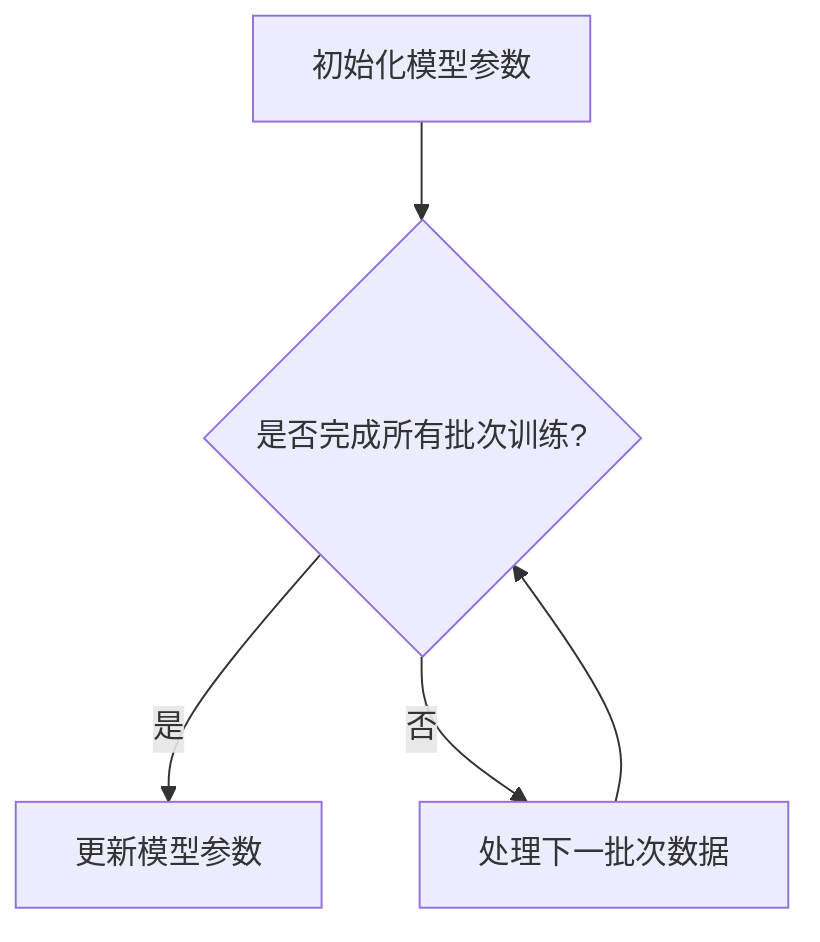
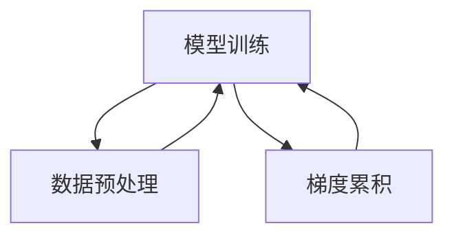
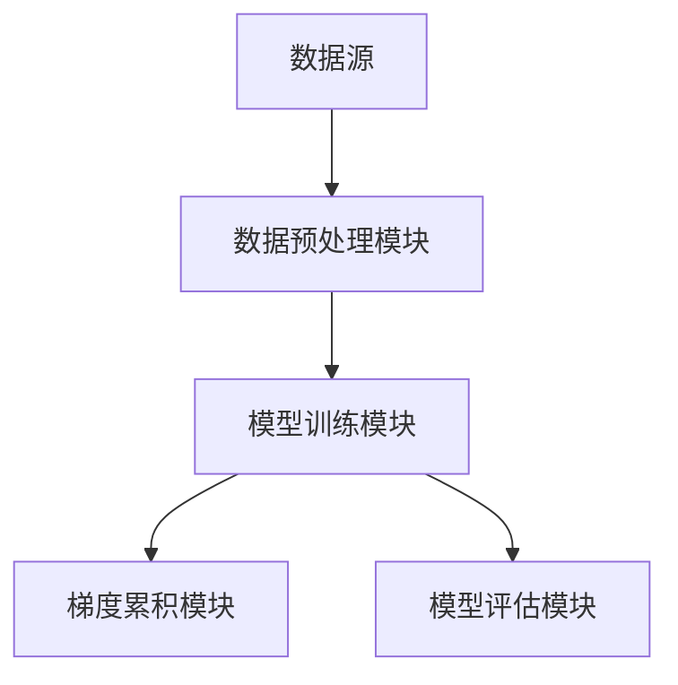
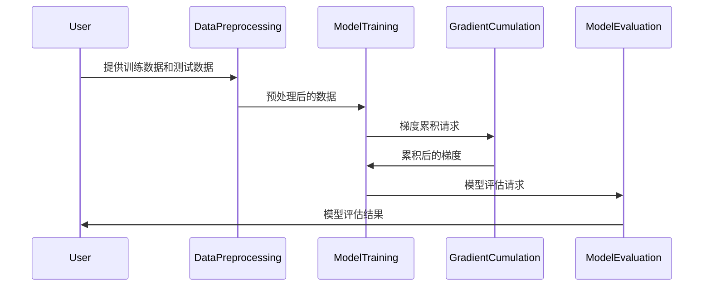

                 

# 梯度累积：突破GPU内存限制的训练技巧

## 关键词
深度学习，GPU内存限制，梯度累积，局部梯度累积，全局梯度累积，训练效率，训练精度

## 摘要
本文将深入探讨梯度累积技术在深度学习训练中的应用，以突破GPU内存限制。通过详细的原理讲解和算法分析，我们将了解梯度累积技术的核心概念、原理及其在深度学习训练中的应用方法。文章旨在帮助读者掌握梯度累积技术，提高深度学习模型的训练效率和精度。

## 第一部分：背景介绍

### 1. 问题背景

深度学习作为人工智能的重要组成部分，在图像识别、自然语言处理、推荐系统等领域取得了显著的成果。然而，随着模型复杂度的增加，训练过程中遇到的计算资源和内存限制问题逐渐凸显。GPU作为一种高效的计算资源，在深度学习训练中发挥着至关重要的作用。但如何有效利用GPU资源，突破内存限制，成为深度学习研究者关注的焦点。

### 2. 问题描述

深度学习模型的训练通常需要大量内存，尤其是大规模模型。GPU内存限制使得模型无法一次性加载到内存中，导致训练效率低下。因此，解决GPU内存限制问题，提高训练效率，成为当前研究的热点。

### 3. 问题解决

通过梯度累积技术，可以将大规模模型的训练过程分批次进行，从而有效地利用GPU内存。梯度累积技术包括局部梯度累积、全局梯度累积等方法，每种方法都有其独特的优势和适用场景。

### 4. 边界与外延

梯度累积技术不仅适用于深度学习模型的训练，还可在其他需要大量计算资源的任务中发挥作用，如科学计算、数据挖掘等。

### 5. 概念结构与核心要素组成

梯度累积技术的基本概念包括：梯度、内存限制、训练批次大小、累积策略等。核心要素包括：局部梯度累积、全局梯度累积等。

## 第二部分：核心概念与联系

### 1. 梯度累积技术原理

#### 梯度累积技术的基本原理

梯度累积技术是一种在深度学习训练过程中，将多个训练批次的梯度累加到一起，以减少内存占用的方法。其基本原理如下：

$$
\text{累积梯度} = \sum_{i=1}^{N} g_i
$$

其中，$g_i$ 表示第 $i$ 个训练批次的梯度，$N$ 表示总的训练批次数量。

#### 梯度累积技术的优势

梯度累积技术能够有效减少内存占用，使得大规模模型的训练成为可能。同时，它还能够提高训练速度，减少训练时间。

### 2. 梯度累积技术的核心要素

#### 局部梯度累积

局部梯度累积是指在每个训练批次内，将梯度累加到一起，然后再进行更新。这种方法能够有效减少内存占用，但可能会降低训练精度。

#### 全局梯度累积

全局梯度累积是指在整个训练过程中，将所有训练批次的梯度累加到一起，然后进行更新。这种方法能够提高训练精度，但可能会增加内存占用。

#### 梯度累积策略

梯度累积策略是指如何选择训练批次大小、更新频率等参数。合适的梯度累积策略能够提高训练效率和精度。

## 第三部分：算法原理讲解

### 1. 局部梯度累积算法原理

#### 算法流程



#### 算法原理

局部梯度累积算法的基本原理是，在每个训练批次内，将梯度累加到一起，然后更新模型参数。具体步骤如下：

1. 初始化模型参数。
2. 对每个训练批次，计算梯度。
3. 将梯度累加到一起。
4. 更新模型参数。
5. 重复步骤2-4，直到完成所有训练批次。

### 2. 全局梯度累积算法原理

#### 算法流程


#### 算法原理

全局梯度累积算法的基本原理是，在整个训练过程中，将所有训练批次的梯度累加到一起，然后更新模型参数。具体步骤如下：

1. 初始化模型参数。
2. 对每个训练批次，计算梯度。
3. 将梯度累加到一起。
4. 更新模型参数。
5. 重复步骤2-4，直到完成所有训练批次。

## 第四部分：数学模型和数学公式 & 详细讲解 & 举例说明

### 1. 数学模型

#### 梯度累积的数学模型

$$
\text{累积梯度} = \sum_{i=1}^{N} g_i
$$

其中，$g_i$ 表示第 $i$ 个训练批次的梯度，$N$ 表示总的训练批次数量。

#### 模型参数更新

$$
\theta_{\text{new}} = \theta_{\text{old}} - \eta \cdot \text{累积梯度}
$$

其中，$\theta_{\text{old}}$ 表示当前模型参数，$\theta_{\text{new}}$ 表示更新后的模型参数，$\eta$ 表示学习率。

### 2. 举例说明

假设有一个简单的线性回归模型，目标函数为：

$$
\text{损失函数} = \frac{1}{2} \| x - y \|^2
$$

其中，$x$ 表示输入特征，$y$ 表示输出标签。

#### 梯度计算

对于每个训练批次，计算梯度如下：

$$
g_i = \frac{\partial \text{损失函数}}{\partial x} = x - y
$$

#### 梯度累积

将所有训练批次的梯度累加到一起：

$$
\text{累积梯度} = \sum_{i=1}^{N} g_i = \sum_{i=1}^{N} (x_i - y_i)
$$

#### 模型参数更新

根据累积梯度更新模型参数：

$$
\theta_{\text{new}} = \theta_{\text{old}} - \eta \cdot \text{累积梯度}
$$

其中，$\theta_{\text{old}}$ 表示当前模型参数，$\eta$ 表示学习率。

## 第五部分：系统分析与架构设计方案

### 1. 问题场景介绍

在深度学习训练过程中，由于模型规模庞大，GPU内存限制成为影响训练效率的重要因素。通过梯度累积技术，可以有效利用GPU内存，提高训练效率。

### 2. 项目介绍

本项目旨在研究梯度累积技术在深度学习训练中的应用，通过设计合理的算法和系统架构，突破GPU内存限制，提高训练效率。

### 3. 系统功能设计

#### 领域模型



#### 功能说明

- 数据预处理：对输入数据进行预处理，包括数据清洗、归一化等操作。
- 模型训练：使用梯度累积技术进行模型训练，包括局部梯度累积和全局梯度累积。
- 梯度累积：实现梯度累积算法，将多个训练批次的梯度累加到一起。

### 4. 系统架构设计



#### 架构说明

- 数据源：提供训练数据和测试数据。
- 数据预处理模块：对输入数据进行预处理，为模型训练做好准备。
- 模型训练模块：使用梯度累积技术进行模型训练，包括局部梯度累积和全局梯度累积。
- 梯度累积模块：实现梯度累积算法，将多个训练批次的梯度累加到一起。
- 模型评估模块：对训练好的模型进行评估，包括准确率、召回率等指标。

### 5. 系统接口设计和系统交互



## 第六部分：项目实战

### 1. 环境安装

在开始项目实战之前，需要安装以下软件和工具：

- Python 3.7+
- TensorFlow 2.0+
- CUDA 10.0+
- GPU 显卡

### 2. 系统核心实现源代码

以下是一个简单的梯度累积实现示例：

```python
import tensorflow as tf

# 初始化模型参数
model = tf.keras.Sequential([
    tf.keras.layers.Dense(1, input_shape=(1,))
])

# 定义损失函数和优化器
loss_fn = tf.keras.losses.MeanSquaredError()
optimizer = tf.keras.optimizers.Adam()

# 训练批次大小
batch_size = 64

# 训练数据
x = tf.random.normal((1000, 1))
y = x + tf.random.normal((1000, 1))

# 梯度累积
for x_batch, y_batch in zip(x Batch size=y Batch size):
    with tf.GradientTape() as tape:
        predictions = model(x_batch, training=True)
        loss = loss_fn(y_batch, predictions)
    gradients = tape.gradient(loss, model.trainable_variables)
    optimizer.apply_gradients(zip(gradients, model.trainable_variables))

# 模型评估
test_loss = loss_fn(y_test, model(x_test, training=False))
print("Test Loss:", test_loss.numpy())
```

### 3. 代码应用解读与分析

以上代码实现了一个简单的线性回归模型，并使用梯度累积技术进行训练。首先，我们初始化了模型参数，并定义了损失函数和优化器。然后，我们定义了训练批次大小，并生成了一组训练数据。在训练过程中，我们使用梯度累积技术，将每个训练批次的梯度累加到一起，然后更新模型参数。最后，我们对训练好的模型进行评估，并打印出测试损失。

### 4. 实际案例分析和详细讲解剖析

假设我们有一个大型深度学习模型，其训练数据量为 100 万条。由于 GPU 内存限制，我们无法一次性将训练数据加载到内存中。在这种情况下，我们可以使用梯度累积技术，将训练数据分批次加载到内存中，从而有效地利用 GPU 内存。

具体步骤如下：

1. 初始化模型参数。
2. 定义损失函数和优化器。
3. 将训练数据分成多个批次。
4. 对每个批次进行梯度累积。
5. 更新模型参数。
6. 重复步骤3-5，直到完成所有训练批次。
7. 对训练好的模型进行评估。

通过以上步骤，我们可以有效地利用 GPU 内存，提高训练效率。同时，我们还可以根据实际情况调整训练批次大小和更新频率，以优化训练过程。

### 5. 项目小结

通过本项目，我们了解了梯度累积技术在深度学习训练中的应用，以及如何通过合理的设计和实现，突破 GPU 内存限制，提高训练效率。梯度累积技术不仅适用于深度学习模型，还可以在其他需要大量计算资源的任务中发挥作用。在未来的研究和实践中，我们可以进一步探索梯度累积技术的优化方法和应用场景。

## 第七部分：最佳实践 Tips、小结、注意事项、拓展阅读

### 最佳实践 Tips

1. 根据训练数据量和 GPU 内存大小，合理设置训练批次大小和更新频率。
2. 尽可能使用高效的梯度累积算法，如局部梯度累积和全局梯度累积。
3. 在模型训练过程中，定期进行模型评估，以调整训练策略。

### 小结

本文详细介绍了梯度累积技术在深度学习训练中的应用，包括核心概念、原理、算法讲解和实际应用案例。通过梯度累积技术，我们可以有效地利用 GPU 内存，提高训练效率和精度。

### 注意事项

1. 在使用梯度累积技术时，注意避免梯度消失和梯度爆炸问题。
2. 根据实际任务需求，选择合适的梯度累积算法。

### 拓展阅读

1. 《深度学习》（Goodfellow, Y., Bengio, Y., Courville, A.）——详细介绍了深度学习的基本概念和技术。
2. 《Python深度学习》（Raschka, F.）——介绍了深度学习在 Python 中的实现和应用。

作者：AI天才研究院/AI Genius Institute & 禅与计算机程序设计艺术 /Zen And The Art of Computer Programming

