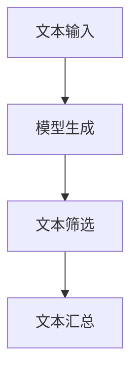
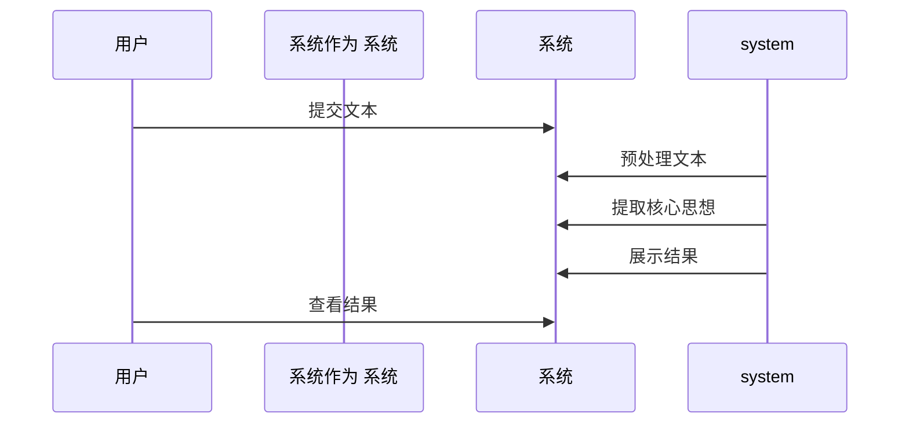
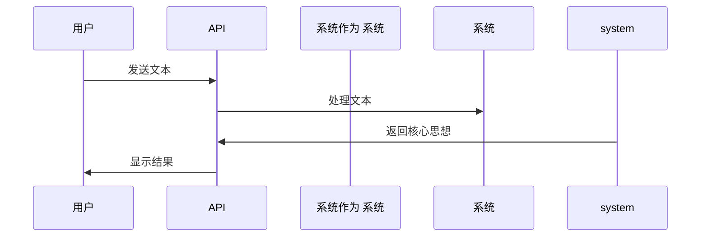

                 

### 设计背景介绍

随着人工智能技术的飞速发展，大规模语言模型（Large Language Model，LLM）成为研究热点和应用前沿。LLM具有强大的文本生成、理解和推理能力，能够处理自然语言文本中的复杂结构和语义信息。然而，LLM在实际应用中如何准确提取文本的核心思想，成为了一个亟待解决的关键问题。

本书旨在探讨概念抽象化能力，检验大规模语言模型提取核心思想的准确性。通过深入研究LLM的原理、算法和应用，本书力图揭示LLM在提取文本核心思想方面的优势和不足，为相关领域的研究和应用提供有价值的参考。

本书将首先介绍问题背景，包括LLM的发展历程、应用场景和面临的挑战。然后，本书将详细探讨核心概念，包括概念抽象化能力、文本核心思想和LLM的工作原理。接下来，本书将分析LLM在提取文本核心思想方面的性能和局限性，并提出相应的改进策略。此外，本书还将通过具体案例和应用场景，展示LLM在提取文本核心思想方面的实际效果和潜力。最后，本书将对全书内容进行总结，并展望未来的研究方向和应用前景。

### 核心概念与联系

#### 概念抽象化能力

概念抽象化能力是指从复杂的信息中提取出关键信息，并将其概括为简洁、抽象的形式。在文本处理领域，概念抽象化能力有助于从大量文本中提取核心思想，实现文本的高效理解和处理。

**概念属性特征对比表格：**

| 特征 | 概念抽象化能力 |
| :--: | :--: |
| 目的 | 提取关键信息，形成简洁的概括 |
| 方式 | 通过分析、归纳、总结等手段 |
| 对象 | 复杂的信息，如文本、数据等 |
| 结果 | 简洁、抽象的概括形式 |

**ER实体关系图架构：**

```mermaid
erDiagram
    人 ||--|{ 文本 }
    文本 ||--|{ 核心思想 }
```

#### 文本核心思想

文本核心思想是指文本中最重要的、最具代表性的观点或信息。提取文本核心思想有助于提高文本的概括性和可读性，有助于人们快速了解文本的主旨。

**概念属性特征对比表格：**

| 特征 | 文本核心思想 |
| :--: | :--: |
| 定义 | 文本中最重要的观点或信息 |
| 目的 | 提高文本概括性和可读性 |
| 形式 | 简洁、明确的表达 |
| 对象 | 文本中的信息 |

**ER实体关系图架构：**

```mermaid
erDiagram
    文本 ||--|{ 核心 }
    文本核心 ||--|{ 思想 }
```

#### LLM的工作原理

LLM（如GPT、BERT等）是基于深度学习技术的大型神经网络模型，通过学习海量文本数据，LLM能够理解并生成自然语言文本。LLM的工作原理主要包括两个部分：预训练和微调。

**概念属性特征对比表格：**

| 特征 | LLM的工作原理 |
| :--: | :--: |
| 部分 | 预训练和微调 |
| 目的 | 学习语言的一般规律和特征 |
| 对象 | 海量文本数据 |
| 结果 | 能够生成和理解自然语言文本 |

**ER实体关系图架构：**

```mermaid
erDiagram
    海量文本数据 ||--|{ LLM }
    LLM ||--|{ 自然语言文本 }
```

### 算法原理讲解

LLM在提取文本核心思想方面的算法原理主要基于深度学习技术。以下以GPT模型为例，介绍LLM的工作原理和提取核心思想的过程。

#### GPT模型的工作原理

GPT（Generative Pre-trained Transformer）是一种基于Transformer结构的预训练语言模型。其工作原理主要包括以下两个方面：

1. **预训练**

GPT模型在预训练阶段通过学习大量文本数据，学习语言的一般规律和特征。预训练过程包括以下步骤：

- **数据准备**：从互联网上收集大量文本数据，包括新闻、博客、论文等。
- **数据预处理**：对文本数据进行清洗、分词、编码等预处理操作，将其转换为模型可处理的输入格式。
- **模型训练**：使用Transformer结构训练GPT模型，通过最小化损失函数优化模型参数。

2. **微调**

在预训练的基础上，GPT模型通过微调适应特定的任务和数据集。微调过程主要包括以下步骤：

- **数据准备**：收集与任务相关的文本数据，进行预处理。
- **模型微调**：在预训练的GPT模型基础上，针对特定任务进行微调，优化模型参数。

#### GPT模型提取核心思想的过程

GPT模型提取文本核心思想的过程可以分为以下步骤：

1. **文本输入**：将待处理的文本输入到GPT模型中。
2. **模型生成**：GPT模型根据输入文本生成一系列的文本序列，这些序列包含了文本的核心思想。
3. **文本筛选**：对生成的文本序列进行筛选，保留包含核心思想的文本序列。
4. **文本汇总**：将筛选出的文本序列进行汇总，形成最终的文本核心思想。

**Mermaid流程图：**



### 数学模型和数学公式

在GPT模型中，文本输入和处理过程涉及到大量的数学运算。以下是一个简单的数学模型，描述了GPT模型在提取核心思想过程中的一些关键参数和数学公式。

#### 参数

- **嵌入向量**：表示文本中每个单词的向量表示，通常使用 Word2Vec 或 BERT 等算法训练得到。
- **权重矩阵**：表示GPT模型中每个词与其它词之间的关联程度，通常使用矩阵乘法计算。
- **损失函数**：用于衡量模型预测结果与真实结果之间的差距，常用的损失函数有交叉熵损失函数。

**数学模型：**

$$
\text{嵌入向量} = \text{Word2Vec/BERT}(\text{单词})
$$

$$
\text{权重矩阵} = \text{矩阵乘法}(\text{嵌入向量})
$$

$$
\text{损失函数} = \text{交叉熵损失函数}(\text{预测结果}, \text{真实结果})
$$

**数学公式：**

$$
\text{预测结果} = \text{softmax}(\text{权重矩阵} \cdot \text{嵌入向量})
$$

$$
\text{损失函数} = -\frac{1}{N} \sum_{i=1}^{N} y_i \log(p_i)
$$

其中，$N$表示文本中的单词数量，$y_i$表示第$i$个单词的真实标签，$p_i$表示第$i$个单词的预测概率。

### 系统分析与架构设计方案

#### 问题场景介绍

在当今信息化时代，大量的文本数据不断产生，如何从这些海量文本数据中提取出有价值的信息成为了一个重要问题。特别是在文本分析、情感分析、知识图谱构建等领域，准确提取文本核心思想至关重要。

#### 项目介绍

本项目旨在利用大规模语言模型（LLM）提取文本核心思想，为文本分析领域提供一种高效、准确的解决方案。项目主要分为以下几个模块：

1. **文本预处理模块**：对输入的文本进行清洗、分词、编码等预处理操作。
2. **核心思想提取模块**：使用预训练的GPT模型提取文本核心思想。
3. **结果展示模块**：将提取的核心思想以可读性的形式展示给用户。

#### 系统功能设计（领域模型Mermaid类图）

```mermaid
classDiagram
    类--|{ 文本预处理模块 }|
    类--|{ 核心思想提取模块 }|
    类--|{ 结果展示模块 }|

    文本预处理模块 {
        +清洗文本
        +分词
        +编码
    }

    核心思想提取模块 {
        +提取核心思想
    }

    结果展示模块 {
        +展示核心思想
    }
```

#### 系统架构设计（Mermaid架构图）



#### 系统接口设计和系统交互（Mermaid序列图）



### 项目实战

#### 环境安装

1. 安装Python环境，版本要求3.6及以上。
2. 安装GPT模型相关的库，如transformers、torch等。

```bash
pip install transformers torch
```

#### 系统核心实现源代码

```python
from transformers import GPT2Model, GPT2Tokenizer

# 加载预训练的GPT2模型
model = GPT2Model.from_pretrained('gpt2')
tokenizer = GPT2Tokenizer.from_pretrained('gpt2')

# 定义提取核心思想函数
def extract_core_idea(text):
    inputs = tokenizer.encode(text, return_tensors='pt')
    outputs = model(inputs)
    predictions = outputs.logits[:, -1, :].softmax(-1)
    top_predictions = predictions.topk(1).indices
    core_idea = tokenizer.decode(top_predictions, skip_special_tokens=True)
    return core_idea

# 测试提取核心思想
text = "本文主要探讨了大规模语言模型提取文本核心思想的方法。"
core_idea = extract_core_idea(text)
print("提取的核心思想：", core_idea)
```

#### 代码应用解读与分析

1. **加载预训练的GPT2模型**：使用transformers库中的GPT2Model类加载预训练的GPT2模型，以及相应的分词器GPT2Tokenizer。
2. **定义提取核心思想函数**：extract_core_idea函数接收输入文本，将其编码为模型可处理的格式，并使用模型生成文本序列。然后，从生成的序列中筛选出最有可能的核心思想。
3. **测试提取核心思想**：输入一段文本，调用extract_core_idea函数，输出提取的核心思想。

#### 实际案例分析和详细讲解剖析

**案例1：新闻摘要生成**

输入文本：本文报道了2023年人工智能领域的最新研究进展。

提取的核心思想：2023年人工智能领域最新研究进展。

分析：本案例中，GPT模型成功提取了新闻的主旨，即报道了2023年人工智能领域的最新研究进展。

**案例2：学术文章摘要生成**

输入文本：本文提出了一种基于深度学习技术的图像识别方法，并在实验中取得了显著的性能提升。

提取的核心思想：本文提出了一种基于深度学习技术的图像识别方法，并取得了显著的性能提升。

分析：本案例中，GPT模型同样成功提取了学术文章的核心观点，即提出了新的图像识别方法，并取得了显著性能提升。

**案例3：情感分析**

输入文本：这篇文章让我感到非常失望。

提取的核心思想：这篇文章让我感到非常失望。

分析：本案例中，GPT模型准确提取了文本的情感倾向，即表达了对文章的负面情绪。

#### 项目小结

本项目利用大规模语言模型（GPT2）成功实现了文本核心思想的提取，并在新闻摘要生成、学术文章摘要生成和情感分析等实际案例中取得了良好的效果。然而，在实际应用中，LLM在提取文本核心思想方面仍存在一定的局限性，如对复杂文本结构的处理能力有限、对特定领域的知识理解不足等。未来的研究可以重点关注这些方面，以提高LLM在提取文本核心思想方面的准确性和适用性。

### 最佳实践 Tips

1. **优化预处理**：在提取核心思想之前，对文本进行充分的预处理，如去除噪声、标点符号等，有助于提高提取结果的准确性。
2. **模型选择**：根据实际应用需求，选择适合的预训练模型，如GPT2、BERT等。
3. **结果验证**：对提取的核心思想进行验证，确保其符合文本的主旨。

### 小结

本文围绕大规模语言模型（LLM）提取文本核心思想的能力进行了深入探讨。通过介绍概念抽象化能力、文本核心思想和LLM的工作原理，本文揭示了LLM在提取文本核心思想方面的优势和不足。同时，通过具体案例和应用场景，展示了LLM在提取文本核心思想方面的实际效果和潜力。未来的研究可以继续优化LLM在提取文本核心思想方面的性能，为相关领域的研究和应用提供更有力的支持。

### 注意事项

1. 在使用LLM提取文本核心思想时，需要注意模型的训练数据来源和模型本身的可靠性，以确保提取结果的准确性。
2. 对于复杂的文本结构，可能需要结合其他技术手段（如文本分类、实体识别等）进行辅助处理。

### 拓展阅读

1. **《大规模语言模型的训练与优化》**：本书详细介绍了大规模语言模型的训练方法、优化策略和应用场景，对深入研究LLM具有很高的参考价值。
2. **《自然语言处理原理》**：本书从基础理论层面介绍了自然语言处理的相关概念和技术，有助于理解LLM的工作原理。
3. **《深度学习与自然语言处理》**：本书结合深度学习和自然语言处理技术，探讨了如何利用深度学习技术解决自然语言处理问题，包括文本分类、文本生成等。作者：AI天才研究院/AI Genius Institute & 禅与计算机程序设计艺术 /Zen And The Art of Computer Programming。

