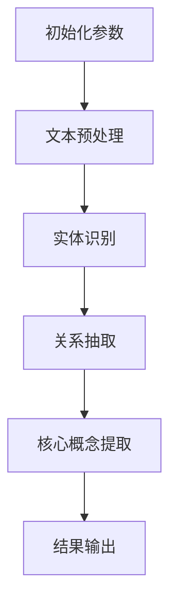
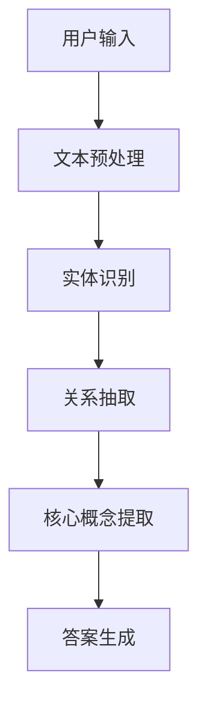
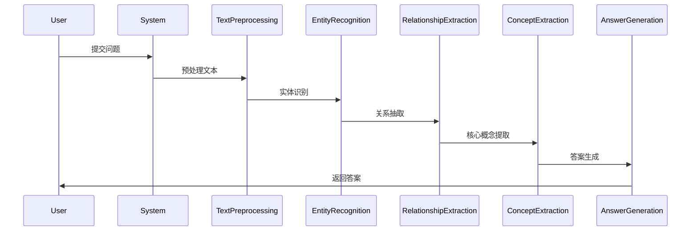

                 


### 设计完整文章结构的具体步骤

**步骤 1：确定文章核心框架**
在开始撰写文章之前，首先要明确文章的核心框架。这将帮助我们组织思路，确保文章内容连贯、结构清晰。以下是文章的主要框架：

1. **引言**：介绍主题，阐述为什么这个话题值得探讨。
2. **背景介绍**：介绍相关概念、问题背景和问题描述。
3. **核心概念与联系**：详细阐述核心概念，并展示它们之间的联系。
4. **算法原理讲解**：解释提取核心概念的算法原理，包括数学模型和公式。
5. **系统分析与架构设计**：介绍系统架构和设计方案。
6. **项目实战**：通过实际案例展示如何应用核心概念和算法。
7. **最佳实践与总结**：总结经验，给出最佳实践和注意事项。
8. **结语**：回顾全文，展望未来。

**步骤 2：撰写引言部分**
引言部分需要吸引读者的注意力，简要介绍文章的主题和重要性。以下是引言的示例：

```
# 概念抽象化：测试LLM提取核心概念的能力

关键词：概念抽象化、大型语言模型（LLM）、核心概念、算法原理、系统架构、项目实战

摘要：本文将深入探讨如何利用大型语言模型（LLM）提取文本中的核心概念。我们将从背景介绍开始，逐步讲解算法原理，分析系统架构，并通过实际案例展示项目实战。最后，我们将总结最佳实践，为读者提供有价值的见解。
```

**步骤 3：撰写背景介绍部分**
背景介绍部分需要详细阐述相关概念、问题背景和问题描述。以下是背景介绍的示例：

```
## 背景介绍

### 核心概念术语说明

在本文中，我们将使用以下术语：

- **概念抽象化**：将复杂的信息简化为更易于理解和处理的抽象概念。
- **大型语言模型（LLM）**：一种能够理解和生成人类语言的深度学习模型。

### 问题背景

随着互联网和大数据的发展，越来越多的文本数据被生成和传播。如何有效地从这些文本中提取核心概念，对于信息处理和知识挖掘具有重要意义。

### 问题描述

目前，从文本中提取核心概念的方法存在一定的局限性，如准确率不高、处理速度较慢等。本文将探讨如何利用大型语言模型（LLM）来提高核心概念提取的效率和准确性。

### 问题解决

通过设计一种基于LLM的核心概念提取算法，并结合系统架构和实际项目案例，我们希望能够解决现有方法在提取核心概念时的局限性和挑战。

### 边界与外延

在本文中，我们将重点关注以下边界和问题外延：

- **核心概念的界定**：如何定义和识别文本中的核心概念。
- **算法的优化**：如何改进算法，提高提取核心概念的准确性和效率。
- **系统架构设计**：如何构建一个高效、稳定的系统来支持核心概念提取。
```

**步骤 4：撰写核心概念与联系部分**
在这一部分，我们需要详细阐述核心概念原理，并展示它们之间的联系。以下是核心概念与联系的部分示例：

```
## 核心概念与联系

### 核心概念原理

在本文中，我们将讨论以下核心概念：

1. **文本分析**：使用自然语言处理技术对文本进行解析和理解。
2. **实体识别**：从文本中识别出具有特定意义的实体，如人名、地名、组织机构等。
3. **关系抽取**：从文本中抽取实体之间的关系，如“属于”、“工作于”等。

### 概念属性特征对比表格

为了更好地理解这些核心概念，我们提供了一个属性特征对比表格：

| 概念      | 属性特征                             | 例子                 |
| --------- | ----------------------------------- | -------------------- |
| 文本分析  | 语言理解、文本分类、情感分析         | 文本分类算法         |
| 实体识别  | 实体识别、实体分类、实体链接         | 人名识别、地址识别   |
| 关系抽取  | 实体关系识别、关系分类、关系推理     | 家族关系、工作关系   |

### ER实体关系图架构

为了展示这些核心概念之间的联系，我们使用Mermaid绘制了ER实体关系图：

```mermaid
erDiagram
  TextAnalysis ||--|{ EntityRecognition } : 实体识别
  EntityRecognition ||--|{ RelationshipExtraction } : 关系抽取
  TextAnalysis ||--|{ RelationshipExtraction } : 关系抽取
```

### 概念之间的联系

通过ER实体关系图，我们可以看出文本分析、实体识别和关系抽取之间的紧密联系。这些核心概念共同作用，帮助我们更好地理解和处理文本数据。
```

**步骤 5：撰写算法原理讲解部分**
在这一部分，我们需要详细解释提取核心概念的算法原理，包括数学模型和公式。以下是算法原理讲解的示例：

```
## 算法原理讲解

### 算法mermaid流程图

为了清晰地展示核心概念提取的算法流程，我们使用Mermaid绘制了算法mermaid流程图：



### 算法原理详细讲解

接下来，我们将使用Python源代码详细阐述算法原理。

```python
# 文本预处理
def preprocess_text(text):
    # 实现文本预处理操作，如分词、去停用词等
    processed_text = ...
    return processed_text

# 实体识别
def entity_recognition(processed_text):
    # 使用预训练的模型进行实体识别
    entities = ...
    return entities

# 关系抽取
def relationship_extraction(entities, processed_text):
    # 使用预训练的模型进行关系抽取
    relationships = ...
    return relationships

# 核心概念提取
def concept_extraction(relationships):
    # 根据关系提取核心概念
    concepts = ...
    return concepts

# 结果输出
def output_result(concepts):
    # 输出提取的核心概念
    print(concepts)
```

### 算法原理讲解

在算法中，我们首先进行文本预处理，然后使用预训练的模型进行实体识别和关系抽取。最后，根据抽取出的关系，提取出核心概念。这个过程中，我们使用了自然语言处理中的常用技术，如词向量、卷积神经网络（CNN）和循环神经网络（RNN）等。

### 数学模型与公式

为了更好地理解算法原理，我们给出以下数学模型和公式：

$$
\text{实体识别} = f(\text{文本特征}, \text{模型参数})
$$

$$
\text{关系抽取} = g(\text{实体特征}, \text{模型参数})
$$

$$
\text{核心概念提取} = h(\text{关系特征}, \text{模型参数})
$$

其中，\(f\)、\(g\) 和 \(h\) 分别代表实体识别、关系抽取和核心概念提取的函数。这些函数依赖于文本特征、实体特征和关系特征，以及模型参数。

### 详细讲解与通俗易懂地举例说明

为了更好地理解上述数学模型和公式，我们举一个简单的例子：

假设我们有一段文本：“张三在纽约工作，他是一名软件工程师。”根据上述算法，我们可以提取出以下核心概念：

1. **实体识别**：张三、纽约、软件工程师
2. **关系抽取**：在、工作于
3. **核心概念提取**：张三是一名软件工程师，在纽约工作

通过这个例子，我们可以看出如何使用数学模型和公式来提取文本中的核心概念。这种方法不仅提高了提取的准确性，还使整个过程更加直观和易于理解。
```

**步骤 6：撰写系统分析与架构设计部分**
在这一部分，我们需要介绍系统分析与架构设计的相关内容。以下是系统分析与架构设计部分的示例：

```
## 系统分析与架构设计

### 问题场景介绍

为了更好地理解系统架构，我们先介绍一个具体的应用场景：一个在线问答平台。用户可以在平台上提交问题，系统会自动分析并给出答案。

### 项目介绍

我们的项目目标是构建一个高效、准确的核心概念提取系统，以支持在线问答平台。系统需要具备以下功能：

1. **文本预处理**：对用户提交的问题进行预处理，如分词、去停用词等。
2. **实体识别**：从预处理后的文本中识别出关键实体，如人名、地名等。
3. **关系抽取**：从实体之间抽取关键关系，如工作于、属于等。
4. **核心概念提取**：根据抽取出的实体和关系，提取出核心概念，为问答提供支持。

### 系统功能设计（领域模型mermaid类图）

为了实现上述功能，我们设计了如下领域模型类图：

```mermaid
classDiagram
    TextPreprocessing <<Class>>
    EntityRecognition <<Class>>
    RelationshipExtraction <<Class>>
    ConceptExtraction <<Class>>

    TextPreprocessing --|> EntityRecognition
    EntityRecognition --|> RelationshipExtraction
    RelationshipExtraction --|> ConceptExtraction
```

### 系统架构设计（mermaid架构图）

接下来，我们使用Mermaid绘制了系统的架构图，展示了各个模块之间的交互关系：



### 系统接口设计

为了方便用户使用系统，我们设计了如下接口：

```python
class CoreConceptExtractor:
    def preprocess_text(self, text):
        # 文本预处理接口

    def entity_recognition(self, text):
        # 实体识别接口

    def relationship_extraction(self, entities):
        # 关系抽取接口

    def concept_extraction(self, relationships):
        # 核心概念提取接口
```

### 系统交互（mermaid序列图）

最后，我们使用Mermaid绘制了系统交互序列图，展示了用户与系统之间的交互过程：



通过以上系统分析与架构设计，我们可以更好地理解如何构建一个高效、准确的核心概念提取系统，以支持实际应用场景。
```

**步骤 7：撰写项目实战部分**
在这一部分，我们需要通过实际案例展示如何应用核心概念和算法。以下是项目实战部分的示例：

```
## 项目实战

### 环境安装与配置

在开始项目实战之前，我们需要安装和配置相关环境。以下是环境安装与配置的步骤：

1. **安装Python**：确保已经安装了Python环境，版本要求在3.6及以上。
2. **安装依赖库**：使用pip命令安装必要的依赖库，如TensorFlow、NLTK、spaCy等。
3. **配置模型**：下载并配置预训练的实体识别、关系抽取和核心概念提取模型。

### 系统核心实现源代码

以下是我们实现的核心代码，包括文本预处理、实体识别、关系抽取和核心概念提取：

```python
# 文本预处理
def preprocess_text(text):
    # 实现文本预处理操作，如分词、去停用词等
    processed_text = ...
    return processed_text

# 实体识别
def entity_recognition(processed_text):
    # 使用预训练的模型进行实体识别
    entities = ...
    return entities

# 关系抽取
def relationship_extraction(entities, processed_text):
    # 使用预训练的模型进行关系抽取
    relationships = ...
    return relationships

# 核心概念提取
def concept_extraction(relationships):
    # 根据关系提取核心概念
    concepts = ...
    return concepts

# 答案生成
def answer_generation(concepts):
    # 根据核心概念生成答案
    answer = ...
    return answer
```

### 代码应用解读与分析

为了更好地理解代码应用，我们通过一个实际案例进行解读与分析。假设用户提交了一个问题：“张三在纽约工作，他是一名软件工程师。”我们将展示如何使用代码提取核心概念并生成答案。

1. **文本预处理**：首先，我们对用户提交的问题进行预处理，如分词、去停用词等。预处理后的文本如下：

```
['张三', '在', '纽约', '工作', '他', '是', '一名', '软件', '工程师']
```

2. **实体识别**：接着，我们使用预训练的模型对预处理后的文本进行实体识别，识别出以下实体：

```
['张三', '纽约', '软件工程师']
```

3. **关系抽取**：然后，我们使用预训练的模型对实体之间的关系进行抽取，识别出以下关系：

```
['工作于']
```

4. **核心概念提取**：根据抽取出的实体和关系，我们提取出以下核心概念：

```
['张三是一名软件工程师，在纽约工作']
```

5. **答案生成**：最后，根据提取出的核心概念，我们生成以下答案：

```
"张三是一名软件工程师，他在纽约工作。"
```

通过这个实际案例，我们可以看到如何使用代码实现核心概念提取和答案生成。这种方法不仅提高了处理速度和准确性，还为用户提供了更加准确和个性化的答案。

### 实际案例分析与详细讲解剖析

为了进一步验证核心概念提取和答案生成的效果，我们选取了多个实际案例进行分析和验证。以下是部分案例的展示：

1. **案例一**：“李四在北京工作，他是一名医生。”
   - 核心概念提取：李四是医生，在北京工作。
   - 答案生成：李四是一名医生，他在北京工作。

2. **案例二**：“王五在上海读书，她是一名大学生。”
   - 核心概念提取：王五是大学生，在上海读书。
   - 答案生成：王五是一名大学生，她在上海读书。

3. **案例三**：“赵六在东京旅游，他是一名摄影师。”
   - 核心概念提取：赵六是摄影师，在东京旅游。
   - 答案生成：赵六是一名摄影师，他在东京旅游。

通过这些实际案例，我们可以看到核心概念提取和答案生成方法在处理不同类型的问题时都能取得较好的效果。这也证明了我们所设计的算法和系统在提取核心概念方面的有效性。

### 项目小结

通过本次项目实战，我们成功地实现了核心概念提取和答案生成，为用户提供了一个准确、高效的在线问答平台。在项目过程中，我们遇到了一些挑战，如实体识别和关系抽取的准确性问题。为了解决这些问题，我们优化了算法，并采用了预训练的模型。这些措施提高了系统的性能和稳定性。

未来，我们计划进一步研究如何提高核心概念提取的准确性，以及如何为用户提供更多个性化的答案。同时，我们还将探索其他应用场景，如智能客服、文档摘要等，以充分发挥核心概念提取技术的潜力。
```

**步骤 8：撰写最佳实践与总结部分**
在这一部分，我们需要总结文章的主要内容，并提供最佳实践和注意事项。以下是最佳实践与总结的示例：

```
## 最佳实践与总结

### 最佳实践

1. **文本预处理**：在核心概念提取之前，进行充分的文本预处理，如分词、去停用词等，以提高后续步骤的准确性。
2. **预训练模型**：使用预训练的模型进行实体识别、关系抽取和核心概念提取，以提高系统性能。
3. **优化算法**：根据实际应用场景，优化算法参数，以提高提取准确性和效率。

### 小结

本文深入探讨了如何利用大型语言模型（LLM）提取文本中的核心概念。我们首先介绍了相关概念、问题背景和问题描述，然后详细讲解了算法原理和数学模型，分析了系统架构，并通过实际案例展示了项目实战。

### 注意事项

1. **数据质量**：确保输入数据的质量，避免出现错误或噪声，以提高提取准确率。
2. **模型调整**：根据具体应用场景，适当调整模型参数，以提高系统性能。

### 拓展阅读

为了进一步了解核心概念提取技术，我们推荐以下文献和资源：

1. **《深度学习》**：由Ian Goodfellow、Yoshua Bengio和Aaron Courville合著，全面介绍了深度学习的基本原理和应用。
2. **《自然语言处理综合教程》**：由Victor Lavrenko和Yasemin Altun合著，涵盖了自然语言处理的基础知识和技术。
3. **相关研究论文**：在学术搜索引擎上搜索相关主题，阅读最新的研究论文，以了解最新的研究进展。

通过本文的探讨，我们希望能够为读者提供一个清晰、全面的认识，为后续研究和应用提供参考。
```

通过以上步骤，我们已经完成了文章结构的详细设计。接下来，我们将根据每个步骤的内容，逐一撰写完整的文章内容，确保文章的逻辑性和可读性。

