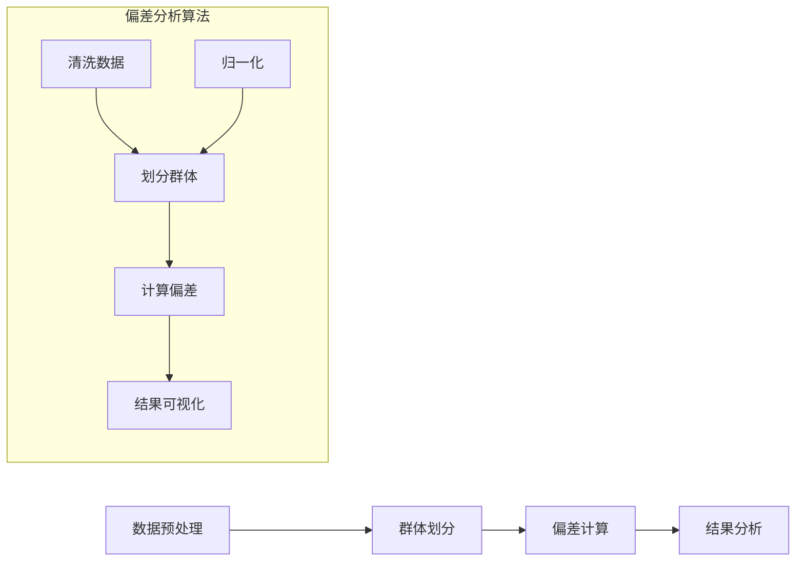
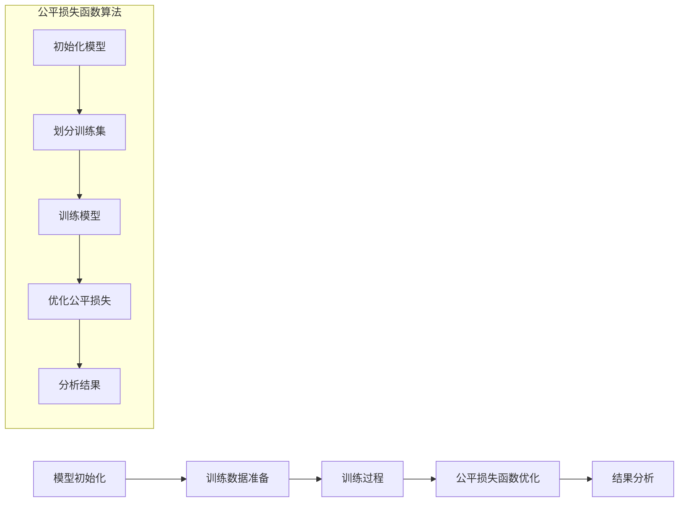
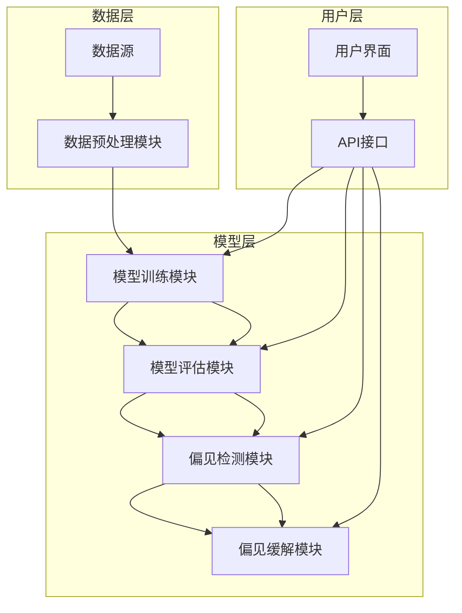
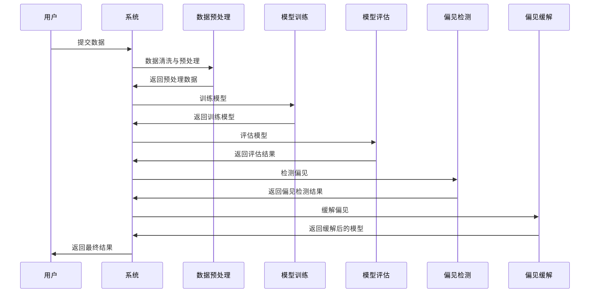

                 

### 引言

在人工智能（AI）迅速发展的今天，模型偏见与公平性已成为学术界和工业界关注的重要议题。模型偏见指的是人工智能模型在决策过程中，对某些特定群体产生的系统性偏差，这种偏差可能会加剧社会不平等。公平性评估则是对模型决策过程中是否存在偏见进行量化分析的方法，旨在保证模型在不同群体间的决策公正。

本文将围绕模型偏见与公平性的量化评估方法进行深入探讨。首先，我们将介绍问题的背景与重要性，阐述模型偏见和公平性评估的定义及其研究意义。接着，我们将探讨偏见问题的现状，并对模型偏见和公平性评估的核心概念进行详细解释。在此基础上，我们将分析模型偏见和公平性评估的边界与外延，明确其应用领域。

在理论基础上，我们将介绍偏见与公平性评估的基本原理，解释概率偏差、预测偏差、分布偏差和性能偏差的概念及其相互关系。随后，我们将对比不同偏见类型的特征，并用实体关系图展示各概念之间的关系。

接下来，本文将重点讨论量化评估方法，包括统计方法和机器学习方法。我们将详细介绍各种偏见量化评估方法的原理，以及如何选择合适的评估方法。随后，我们将探讨公平性量化评估的方法，并提供方法适用性、效率和准确性的比较。

在算法原理讲解部分，我们将通过Mermaid流程图和Python源代码，详细阐述偏见与公平性评估算法的数学模型和实现步骤。为了使读者更好地理解，我们还将举例说明，并提供通俗易懂的解析。

最后，我们将介绍一个具体的项目实战案例，包括系统功能设计、系统架构设计和实际案例分析。通过这些内容，本文旨在为读者提供一个全面、深入的模型偏见与公平性量化评估方法的指南。

### 关键词

1. 模型偏见
2. 公平性评估
3. 量化方法
4. 统计分析
5. 机器学习
6. 偏见缓解
7. 模型公正性

### 摘要

本文旨在探讨模型偏见与公平性的量化评估方法，首先介绍了模型偏见和公平性评估的定义及其背景。接着，详细阐述了偏见与公平性评估的核心概念及其相互关系，包括概率偏差、预测偏差、分布偏差和性能偏差。在此基础上，本文重点讨论了量化评估方法，包括统计方法和机器学习方法，并对比了不同方法的适用性、效率和准确性。最后，通过一个具体的项目实战案例，详细讲解了系统功能设计、系统架构设计和实际案例分析，为读者提供了模型偏见与公平性量化评估方法的实践指南。

### 问题的背景与重要性

随着人工智能（AI）技术的广泛应用，其带来的社会影响日益显著。然而，模型偏见问题也随之浮现，成为人工智能领域亟待解决的关键问题之一。模型偏见指的是在人工智能模型的训练和应用过程中，由于数据集、模型设计或算法选择等因素导致的系统性地偏向某一特定群体，从而影响模型的公正性和公平性。这种偏见不仅可能对个人造成不公平的对待，更可能在更广泛的层面上加剧社会不平等现象。

#### 问题的提出

模型偏见问题最早在20世纪90年代开始引起关注。当时，研究人员发现，在种族、性别和年龄等特定属性上，机器学习模型存在显著的偏差。例如，在人脸识别技术中，白人男性的识别准确率普遍高于其他种族和性别的人群。这种偏见不仅损害了个人权益，还引发了社会的不满和质疑。

近年来，随着AI技术的迅猛发展，模型偏见问题变得更加复杂和严重。一方面，人工智能系统在医疗、金融、招聘等领域得到广泛应用，其决策直接影响个人的生活质量和社会地位；另一方面，大量的数据和算法创新也带来了新的挑战。数据集中的偏见、模型设计中的缺陷以及算法训练过程中的不公平性，都可能导致模型对某些群体的系统性偏向。

#### 偏见问题的现状

当前，模型偏见问题在多个领域都有所体现。以下是一些具体案例：

1. **招聘系统**：一些基于机器学习的招聘系统，由于训练数据集中存在性别和种族偏见，导致在招聘过程中对特定群体存在歧视。例如，研究表明，某些招聘平台在职位申请者中，对女性的偏见较为明显。

2. **医疗诊断**：在医疗领域，人工智能模型在诊断某些疾病时，对某些群体（如女性）的准确性低于男性。这种偏见可能会导致医疗资源的不公平分配，影响患者的治疗效果。

3. **信用评估**：信用评估模型在评估个人信用时，可能对某些群体（如低收入群体）存在不公平的偏见，这可能导致他们在金融借贷方面面临更大的困难。

4. **执法系统**：人工智能在执法领域的应用，如人脸识别、监控等，可能对特定种族或群体存在偏见，导致执法不公。

#### 研究的意义和目标

解决模型偏见问题具有重要的现实意义和学术价值。从现实角度来看，模型偏见不仅损害个人权益，还可能加剧社会不平等。因此，研究和解决模型偏见问题，对于促进社会公平和正义具有重要意义。

从学术角度来看，模型偏见问题的解决有助于推动人工智能技术的健康发展。通过研究模型偏见的产生机制、量化评估方法和缓解策略，可以提升模型的公正性和公平性，增强人们对AI技术的信任。

本文的研究目标主要包括：

1. **定义模型偏见与公平性评估**：明确模型偏见和公平性评估的定义及其核心概念。

2. **分析偏见问题的现状**：探讨当前模型偏见问题在各个领域的具体表现。

3. **提出量化评估方法**：介绍统计方法和机器学习方法，用于量化评估模型的偏见程度。

4. **探讨缓解策略**：提出并分析各种偏见缓解策略，以减少或消除模型偏见。

通过这些研究目标，本文旨在为模型偏见与公平性评估提供系统的理论框架和实际操作指南，推动人工智能技术在社会中的应用和发展。

### 核心概念

在深入探讨模型偏见与公平性评估方法之前，有必要明确相关的核心概念。这些概念不仅为后续的讨论奠定了基础，也是理解和应用量化评估方法的关键。

#### 模型偏见

模型偏见是指人工智能模型在决策过程中，由于数据集、模型设计或算法选择等因素，对某些特定群体产生的系统性偏向。这种偏见可能导致模型在某些属性（如性别、种族、年龄等）上对特定群体的预测准确性、决策公正性等方面存在显著差异。模型偏见可以分为多种类型，如概率偏差、预测偏差、分布偏差和性能偏差。

**定义**：模型偏见是指人工智能模型在决策过程中对特定群体的系统性偏向，导致其在某些属性上表现出不公平性。

**示例**：在一个基于人脸识别的系统中，如果系统对白人男性的识别准确率明显高于其他种族和性别，那么这个系统就存在种族和性别的偏见。

#### 公平性

公平性是指人工智能模型在决策过程中对不同群体的一致性和公正性。公平性评估旨在确保模型在不同群体之间的决策结果具有相似性，避免因群体属性差异导致的不公平对待。

**定义**：公平性是指人工智能模型在决策过程中对不同群体的公正和一致对待，确保决策结果不受群体属性影响。

**示例**：在一个信用评分系统中，如果模型对高收入人群和低收入人群的信用评分没有显著差异，那么这个系统就可以认为是公平的。

#### 量化评估

量化评估是指使用数学和统计方法对模型偏见和公平性进行量化分析的过程。量化评估方法可以提供定量的指标，帮助研究者了解模型在偏见和公平性方面的表现，并为进一步的改进提供依据。

**定义**：量化评估是指通过数学和统计方法，对模型偏见和公平性进行量化分析，提供定量指标的过程。

**示例**：使用统计方法计算不同群体在人脸识别系统中的识别准确率差异，从而评估系统的公平性。

#### 偏见类型

模型偏见可以分为多种类型，每种类型的偏见在模型决策中都有不同的表现和影响。

1. **概率偏差**：概率偏差是指模型对特定群体的预测概率分布存在差异。例如，人脸识别系统可能对某些种族或性别的识别概率较低。
   
2. **预测偏差**：预测偏差是指模型对特定群体的预测结果与真实值的差异。例如，信用评分系统可能对某些群体的信用评分较低。

3. **分布偏差**：分布偏差是指模型对特定群体的预测分布存在偏差。例如，医疗诊断模型可能对某些群体的疾病诊断结果分布不均匀。

4. **性能偏差**：性能偏差是指模型在不同群体上的性能表现存在差异。例如，招聘系统可能对某些性别或种族的应聘者录取率较低。

#### 公平性衡量标准

公平性评估的衡量标准包括多个方面，以下是一些常用的衡量指标：

1. **误差率**：误差率是指模型在不同群体上的预测错误率。误差率越低，表明模型的公平性越好。

2. **准确率**：准确率是指模型在不同群体上的预测准确率。准确率越高，表明模型的公平性越好。

3. **F1分数**：F1分数是精确率和召回率的调和平均值，用于综合评估模型在不同群体上的公平性。

4. **公平性指数**：公平性指数是通过计算模型在不同群体上的预测差异，来衡量模型公平性的指标。

#### 量化评估的应用领域

量化评估方法广泛应用于各个领域，以下是一些主要的应用场景：

1. **招聘与雇佣**：通过量化评估方法，评估招聘系统中是否存在性别或种族偏见。

2. **医疗诊断**：使用量化评估方法，检测医疗诊断模型在不同群体上的公平性。

3. **信用评估**：评估信用评分模型在不同群体上的公平性，以确保金融服务的公平性。

4. **执法与监控**：通过量化评估方法，确保人脸识别等执法系统在不同群体上的公平性。

通过明确这些核心概念，我们可以更好地理解和应用模型偏见与公平性的量化评估方法，为人工智能技术的公平、公正应用提供有力支持。

### 边界与外延

在探讨模型偏见与公平性量化评估方法时，我们需要明确其边界与外延，以更好地理解其应用范围和适用条件。

#### 偏见类型的分类

模型偏见可以分为多种类型，根据其表现形式和影响范围，可以分为以下几类：

1. **概率偏差**：概率偏差是指模型在预测概率分布上对特定群体的系统性偏向。例如，在人脸识别系统中，如果系统对某些种族或性别的识别概率明显低于其他群体，就存在概率偏差。概率偏差通常通过比较不同群体在模型预测中的概率分布差异来量化。

2. **预测偏差**：预测偏差是指模型对特定群体的预测结果与真实值的差异。例如，在信用评分系统中，如果模型对某些特定群体的信用评分显著低于实际信用状况，就存在预测偏差。预测偏差可以通过计算模型在不同群体上的预测误差来量化。

3. **分布偏差**：分布偏差是指模型在不同群体上的预测结果分布存在差异。例如，在医疗诊断模型中，如果系统对某些群体的诊断结果分布不均匀，导致某些群体被过度诊断或漏诊，就存在分布偏差。分布偏差通常通过比较不同群体在模型预测结果上的分布特征来量化。

4. **性能偏差**：性能偏差是指模型在不同群体上的性能表现存在差异。例如，在招聘系统中，如果模型对某些性别或种族的应聘者的录取率显著低于其他群体，就存在性能偏差。性能偏差可以通过计算模型在不同群体上的性能指标（如准确率、召回率等）差异来量化。

#### 公平性的衡量标准

公平性的衡量标准是评估模型决策是否公正的重要指标。以下是一些常用的公平性衡量标准：

1. **误差率**：误差率是指模型在不同群体上的预测错误率。误差率越低，表明模型的公平性越好。误差率可以通过计算模型在各个群体上的错误预测数量与总预测数量的比例来得到。

2. **准确率**：准确率是指模型在不同群体上的预测准确率。准确率越高，表明模型的公平性越好。准确率可以通过计算模型在各个群体上的正确预测数量与总预测数量的比例来得到。

3. **F1分数**：F1分数是精确率和召回率的调和平均值，用于综合评估模型在不同群体上的公平性。F1分数可以同时考虑模型的准确性和召回率，是一个更为全面的公平性指标。

4. **公平性指数**：公平性指数是通过计算模型在不同群体上的预测差异来衡量模型公平性的指标。公平性指数越低，表明模型的公平性越好。

#### 量化评估的应用领域

量化评估方法在多个领域都有广泛应用，以下是一些主要的应用领域：

1. **招聘与雇佣**：通过量化评估方法，评估招聘系统中是否存在性别或种族偏见，以确保招聘过程的公平性。

2. **医疗诊断**：使用量化评估方法，检测医疗诊断模型在不同群体上的公平性，确保医疗资源公平分配。

3. **信用评估**：评估信用评分模型在不同群体上的公平性，以防止金融歧视。

4. **执法与监控**：通过量化评估方法，确保人脸识别等执法系统在不同群体上的公平性，防止执法不公。

#### 边界与外延

尽管量化评估方法在多个领域都有广泛应用，但其应用仍存在一定的边界与限制：

1. **数据质量**：量化评估方法依赖于高质量的数据集。如果数据集中存在偏差或噪声，量化评估结果的准确性可能会受到影响。

2. **模型复杂性**：复杂模型可能难以进行量化评估，尤其是当模型内部机制不透明时，评估结果的解释性可能较差。

3. **评估标准**：不同的应用场景可能需要不同的公平性评估标准。量化评估方法需要根据具体应用场景选择合适的评估标准。

4. **外部因素**：除了模型偏见，外部因素（如社会环境、政策法规等）也可能影响模型的公平性。这些因素需要综合考虑，以确保量化评估的全面性和准确性。

通过明确模型偏见与公平性量化评估的边界与外延，我们可以更好地理解其应用范围和适用条件，为推动人工智能技术的公平、公正应用提供有力支持。

### 概念结构与核心要素组成

为了深入理解模型偏见与公平性评估方法，我们需要剖析其概念结构和核心要素组成。这将有助于我们更好地把握问题的本质，并为其量化评估提供理论依据。

#### 模型偏见的核心要素

模型偏见主要由以下几个核心要素构成：

1. **数据集**：数据集是模型训练的基础，其质量直接影响模型的偏见程度。如果数据集中存在偏差或代表性不足，模型很可能会继承这些偏差。例如，一个包含性别偏见的数据集，会导致模型在性别预测方面表现出偏见。

2. **模型设计**：模型设计决定了模型的结构和参数选择，对偏见产生有重要影响。例如，某些模型设计可能更适用于某些特定群体，从而导致偏见。

3. **算法选择**：算法选择也是影响模型偏见的重要因素。不同的算法对数据的处理方式和敏感性不同，可能导致不同的偏见表现。

4. **训练过程**：模型训练过程包括数据预处理、模型初始化、迭代优化等步骤，每个步骤都可能引入或放大偏见。

#### 公平性评估的关键步骤

公平性评估是确保模型决策公正的重要环节，其核心步骤包括：

1. **定义评估指标**：选择合适的评估指标，如误差率、准确率、F1分数等，用于量化评估模型在不同群体上的表现。

2. **数据预处理**：对数据集进行预处理，包括数据清洗、归一化等操作，以提高数据质量和评估的准确性。

3. **群体划分**：将数据集按照群体属性（如性别、种族、年龄等）进行划分，以比较模型在不同群体上的表现。

4. **指标计算**：计算模型在不同群体上的评估指标，如误差率、准确率等，用于评估模型的公平性。

5. **偏差分析**：分析模型在不同群体上的评估结果，识别潜在的偏见和差异。

#### 量化评估方法的选择

量化评估方法的选择取决于评估目标和应用场景。以下是几种常用的量化评估方法：

1. **统计分析方法**：如T检验、方差分析等，用于比较不同群体在模型预测上的差异。

2. **机器学习方法**：如决策树、随机森林等，用于识别和缓解模型偏见。

3. **基于规则的评估方法**：通过预设规则，比较模型在不同群体上的决策一致性。

4. **综合评估方法**：结合多种评估方法，以获得更全面和准确的评估结果。

通过以上分析，我们可以看到，模型偏见与公平性评估方法不仅需要关注数据集、模型设计、算法选择等核心要素，还需要通过科学合理的评估步骤和方法，确保模型决策的公平性和公正性。这些核心要素和关键步骤构成了模型偏见与公平性评估的理论基础，为后续的量化评估提供了指导。

#### 概念结构与核心要素组成总结

模型偏见与公平性评估方法的概念结构与核心要素组成，是理解和应用该领域的基础。数据集、模型设计、算法选择和训练过程是模型偏见的四大核心要素，这些要素共同决定了模型在决策过程中可能产生的系统性偏差。公平性评估则通过定义评估指标、数据预处理、群体划分、指标计算和偏差分析等关键步骤，确保模型决策的公正性和一致性。量化评估方法的选择则根据具体应用场景和评估目标，结合统计分析方法和机器学习方法，以获得全面、准确的评估结果。通过这些核心要素和评估步骤的有机结合，我们可以有效识别和缓解模型偏见，推动人工智能技术的公平、公正应用。

### 1.5 本章小结

本章首先介绍了模型偏见与公平性评估的定义及其重要性，从背景、问题提出、现状到研究意义，详细阐述了该领域的研究背景和现实需求。接着，我们明确了模型偏见和公平性评估的核心概念，包括数据集、模型设计、算法选择和训练过程等要素，以及误差率、准确率、F1分数等评估指标。最后，本章分析了模型偏见与公平性评估的边界与外延，探讨了偏见类型和公平性衡量标准，以及其在各个领域的应用。通过这些内容，本章为后续的量化评估方法讨论奠定了基础，明确了研究的方向和目标。

----------------------------------------------------------------

### 偏见与公平性评估的基本原理

在理解了模型偏见与公平性的核心概念后，我们需要进一步探讨其评估的基本原理。评估模型偏见与公平性需要运用数学和统计方法，通过量化的指标来衡量模型的性能。本节将详细介绍偏见评估的数学模型、公平性评估的数学模型，以及模型偏见与公平性评估之间的内在联系。

#### 偏见评估的数学模型

模型偏见评估的核心在于量化模型对特定群体的系统性偏向。以下几种数学模型常用于评估模型偏见：

1. **概率偏差**：
   - **定义**：概率偏差是指模型预测概率分布的差异。
   - **公式**：
     $$ P(y = 1 | x) - P(y = 1 | \neg x) $$
     其中，\(P(y = 1 | x)\)表示在特征\(x\)下模型预测为1的概率，\(P(y = 1 | \neg x)\)表示在特征\(\neg x\)下模型预测为1的概率。
   - **解释**：通过比较不同群体（例如，基于性别或种族划分的群体）的预测概率，我们可以评估模型在这些群体上的偏见程度。

2. **预测偏差**：
   - **定义**：预测偏差是指模型对特定群体的预测结果与真实值的差异。
   - **公式**：
     $$ \hat{y} - y $$
     其中，\(\hat{y}\)为模型预测值，\(y\)为真实值。
   - **解释**：计算模型在不同群体上的预测误差，可以量化模型在这些群体上的偏见。

3. **分布偏差**：
   - **定义**：分布偏差是指模型对特定群体的预测结果分布存在差异。
   - **公式**：
     $$ \text{Mean}(\hat{y} | x) - \text{Mean}(\hat{y} | \neg x) $$
     其中，\(\text{Mean}(\hat{y} | x)\)表示在特征\(x\)下预测值的均值，\(\text{Mean}(\hat{y} | \neg x)\)表示在特征\(\neg x\)下预测值的均值。
   - **解释**：通过比较不同群体的预测结果均值，可以识别模型在特定群体上的分布偏差。

4. **性能偏差**：
   - **定义**：性能偏差是指模型在不同群体上的性能表现存在差异。
   - **公式**：
     $$ \text{ErrorRate}(x) - \text{ErrorRate}(\neg x) $$
     其中，\(\text{ErrorRate}(x)\)表示在特征\(x\)下模型的错误率，\(\text{ErrorRate}(\neg x)\)表示在特征\(\neg x\)下模型的错误率。
   - **解释**：计算模型在不同群体上的错误率差异，可以量化模型在性能上的偏差。

#### 公平性评估的数学模型

公平性评估的数学模型旨在量化模型在不同群体之间的决策一致性和公正性。以下是一些常用的数学模型：

1. **误差率平衡**：
   - **定义**：误差率平衡是指模型在不同群体上的误差率应尽量一致。
   - **公式**：
     $$ \frac{\sum_{i=1}^{n} \text{ErrorRate}(g_i)}{n} $$
     其中，\(n\)为群体数量，\(g_i\)为第\(i\)个群体。
   - **解释**：计算所有群体误差率的平均值，若误差率接近平衡，则模型较为公平。

2. **准确率平衡**：
   - **定义**：准确率平衡是指模型在不同群体上的准确率应尽量一致。
   - **公式**：
     $$ \frac{\sum_{i=1}^{n} \text{Accuracy}(g_i)}{n} $$
     其中，\(n\)为群体数量，\(g_i\)为第\(i\)个群体。
   - **解释**：计算所有群体准确率的平均值，若准确率接近平衡，则模型较为公平。

3. **F1分数平衡**：
   - **定义**：F1分数平衡是指模型在不同群体上的F1分数应尽量一致。
   - **公式**：
     $$ \frac{\sum_{i=1}^{n} \text{F1-Score}(g_i)}{n} $$
     其中，\(n\)为群体数量，\(g_i\)为第\(i\)个群体。
   - **解释**：计算所有群体F1分数的平均值，若F1分数接近平衡，则模型较为公平。

4. **偏差指标**：
   - **定义**：偏差指标是指用于衡量模型在不同群体之间差异的指标。
   - **公式**：
     $$ \text{Deviation} = \sum_{i=1}^{n} | \text{ErrorRate}(g_i) - \text{ErrorRate}(\bar{g}) | $$
     其中，\(\bar{g}\)为所有群体的平均误差率。
   - **解释**：通过计算偏差指标，可以评估模型在不同群体之间的误差率差异。

#### 模型偏见与公平性评估的联系

模型偏见与公平性评估之间存在密切联系。公平性评估旨在减少模型偏见，确保模型在不同群体之间的决策一致性。以下为模型偏见与公平性评估之间的内在联系：

1. **评估目的**：公平性评估的核心目的是通过量化指标，评估模型是否存在偏见，并识别偏差程度。这一过程有助于确保模型决策的公正性。

2. **评估方法**：公平性评估通常采用统计学方法和机器学习算法，这些方法可以量化模型在不同群体上的表现，识别潜在的偏见。

3. **改进策略**：通过公平性评估，可以发现模型存在的偏见和不足，从而指导改进策略的设计和实施。改进策略包括数据预处理、模型调整、算法优化等，以减少模型偏见，提高公平性。

4. **动态调整**：公平性评估是一个持续的过程，模型在使用过程中可能会出现新的偏见。因此，公平性评估需要定期进行，以动态调整模型，确保其公平性。

通过以上分析，我们可以看到，偏见评估与公平性评估是相辅相成的。偏见评估提供了量化模型偏见的手段，而公平性评估则通过这些手段，确保模型决策的公正性和一致性。理解这两个评估模型的基本原理，有助于我们更好地识别和缓解模型偏见，推动人工智能技术的公平应用。

### 核心概念原理

在探讨模型偏见与公平性评估的核心概念时，我们需要深入理解概率偏差、预测偏差、分布偏差和性能偏差的概念及其相互关系。这些概念是量化评估方法的基础，有助于我们准确地评估模型在不同群体上的表现，从而确保模型的公平性和公正性。

#### 概率偏差

概率偏差是指模型在预测概率分布上对特定群体的系统性偏向。这种偏差表现为模型对某些群体的预测概率与实际情况不符，可能导致决策的不公平性。概率偏差通常通过比较不同群体在模型预测中的概率分布差异来量化。

**定义**：
概率偏差可以用以下公式表示：
$$
\Delta P = P_{\text{model}}(y=1|A) - P_{\text{model}}(y=1|\neg A)
$$
其中，\(P_{\text{model}}(y=1|A)\)表示模型对具有属性\(A\)的群体的预测概率，\(P_{\text{model}}(y=1|\neg A)\)表示模型对不具有属性\(A\)的群体的预测概率。

**示例**：
假设我们有一个分类模型，用于判断是否批准贷款申请。如果模型对收入较低的人群的贷款批准概率明显低于收入较高的人群，那么模型就存在概率偏差。

#### 预测偏差

预测偏差是指模型对特定群体的预测结果与真实值的差异。预测偏差可能表现为模型对某些群体的预测准确性较低，导致这些群体在决策过程中受到不公平对待。

**定义**：
预测偏差可以用以下公式表示：
$$
\Delta \hat{y} = \hat{y}_{\text{model}}(A) - y(A)
$$
其中，\(\hat{y}_{\text{model}}(A)\)表示模型对具有属性\(A\)的群体的预测值，\(y(A)\)表示真实值。

**示例**：
假设我们有一个医疗诊断模型，用于预测病人是否患有某种疾病。如果模型对女性患者的诊断准确性明显低于男性患者，那么模型就存在预测偏差。

#### 分布偏差

分布偏差是指模型对特定群体的预测结果分布存在偏差。分布偏差可能表现为模型对某些群体的预测结果分布不均匀，导致这些群体在决策过程中受到不公平对待。

**定义**：
分布偏差可以用以下公式表示：
$$
\Delta D = \text{Mean}(\hat{y}|A) - \text{Mean}(\hat{y}|\neg A)
$$
其中，\(\text{Mean}(\hat{y}|A)\)表示模型对具有属性\(A\)的群体的预测结果均值，\(\text{Mean}(\hat{y}|\neg A)\)表示模型对不具有属性\(A\)的群体的预测结果均值。

**示例**：
假设我们有一个招聘模型，用于预测应聘者的录用概率。如果模型对某些性别或种族的应聘者的录用概率分布明显偏向于低概率，那么模型就存在分布偏差。

#### 性能偏差

性能偏差是指模型在不同群体上的性能表现存在差异。性能偏差可能表现为模型对某些群体的性能指标（如准确率、召回率等）较低，导致这些群体在决策过程中受到不公平对待。

**定义**：
性能偏差可以用以下公式表示：
$$
\Delta P_{\text{performance}} = \text{Performance}_{\text{model}}(A) - \text{Performance}_{\text{model}}(\neg A)
$$
其中，\(\text{Performance}_{\text{model}}(A)\)表示模型对具有属性\(A\)的群体的性能，\(\text{Performance}_{\text{model}}(\neg A)\)表示模型对不具有属性\(A\)的群体的性能。

**示例**：
假设我们有一个信用评分模型，用于预测客户的信用风险。如果模型对某些种族或地区的客户评分准确性明显低于其他群体，那么模型就存在性能偏差。

#### 概念属性特征对比表格

以下是一个对比表格，展示了概率偏差、预测偏差、分布偏差和性能偏差的概念属性特征：

| 偏差类型 | 描述 | 影响因素 | 目标 |
|-----------|------|-----------|------|
| 概率偏差 | 模型对特定群体的预测概率差异 | 数据质量、模型设计 | 准确预测概率分布 |
| 预测偏差 | 模型对特定群体的预测结果与真实值的差异 | 数据集、模型适应性 | 提高预测准确性 |
| 分布偏差 | 模型对特定群体的预测结果分布差异 | 社会因素、数据质量 | 减少预测结果分布偏差 |
| 性能偏差 | 模型对特定群体的性能表现差异 | 模型设计、训练数据集 | 提高性能一致性 |

通过上述分析，我们可以看到，概率偏差、预测偏差、分布偏差和性能偏差是评估模型偏见与公平性的关键概念。这些概念相互关联，共同构成了量化评估方法的理论基础。理解和应用这些概念，有助于我们更好地识别和缓解模型偏见，确保人工智能模型的公平性和公正性。

### ER实体关系图架构

为了更清晰地展示模型偏见与公平性评估中的实体关系，我们可以使用实体关系图（Entity-Relationship Diagram，ERD）来描述各个实体及其相互关系。以下是一个简单的ERD架构，用于说明模型偏见评估中的主要实体及其关系。

```mermaid
erDiagram
    AI模型 ||--o{ 偏见类型 }|
    AI模型 ||--o{ 公平性评估指标 }|
    偏见类型 ||--o{ 数据集 }|
    公平性评估指标 ||--o{ 模型性能 }|
```

在这个ERD中：

- **AI模型**：表示被评估的人工智能模型，是偏见评估和公平性评估的起点。
- **偏见类型**：包括概率偏差、预测偏差、分布偏差和性能偏差等，用于描述模型在不同方面存在的偏见。
- **数据集**：是模型训练和评估的基础，用于产生偏见和评估指标。
- **公平性评估指标**：用于量化模型的偏见程度，包括误差率、准确率、F1分数等。
- **模型性能**：表示模型在不同群体上的性能表现，是公平性评估的重要依据。

通过这个ERD，我们可以直观地看到各个实体之间的关联，有助于理解模型偏见与公平性评估的整体架构。

### 偏见量化评估方法

在评估模型偏见时，量化评估方法是非常关键的一环。量化评估方法通过数学和统计手段，对模型在不同群体上的表现进行量化分析，从而识别和衡量模型偏见。本文将详细介绍几种常用的量化评估方法，包括统计方法和机器学习方法。

#### 统计方法

统计方法是最传统的偏见量化评估方法，通过比较不同群体在模型预测结果上的差异，来评估模型的偏见程度。以下是一些常用的统计方法：

1. **偏差分析**：
   - **定义**：偏差分析是一种常用的统计方法，用于比较模型在不同群体上的预测结果差异。
   - **公式**：
     $$
     \Delta P_i = P_i - \bar{P}
     $$
     其中，\(P_i\)表示第\(i\)个群体的预测概率，\(\bar{P}\)表示所有群体的平均预测概率。
   - **解释**：通过计算每个群体的预测概率与整体平均概率的差值，可以量化模型对这些群体的偏见。

2. **T检验**：
   - **定义**：T检验是一种用于比较两组数据均值差异的统计方法，常用于评估模型在不同群体上的预测差异。
   - **公式**：
     $$
     t = \frac{\bar{X}_1 - \bar{X}_2}{\sqrt{\frac{s_1^2}{n_1} + \frac{s_2^2}{n_2}}}
     $$
     其中，\(\bar{X}_1\)和\(\bar{X}_2\)分别为两组数据的均值，\(s_1^2\)和\(s_2^2\)分别为两组数据的标准差，\(n_1\)和\(n_2\)分别为两组数据的大小。
   - **解释**：通过计算T值，可以判断两组数据均值是否显著不同，从而评估模型在不同群体上的预测差异。

3. **方差分析（ANOVA）**：
   - **定义**：方差分析是一种用于比较多个组间均值差异的统计方法，常用于评估模型在多个群体上的预测差异。
   - **公式**：
     $$
     F = \frac{MS_{between}}{MS_{within}}
     $$
     其中，\(MS_{between}\)为组间均方差，\(MS_{within}\)为组内均方差。
   - **解释**：通过计算F值，可以判断多个组间均值是否存在显著差异，从而评估模型在不同群体上的预测差异。

#### 机器学习方法

机器学习方法通过构建预测模型，识别和缓解模型偏见。以下是一些常用的机器学习方法：

1. **偏见检测算法**：
   - **定义**：偏见检测算法是一种用于检测模型是否存在偏见的机器学习方法。
   - **常用算法**：决策树、随机森林、支持向量机等。
   - **解释**：这些算法通过分析模型在不同群体上的预测结果，识别潜在的偏见。

2. **偏见缓解算法**：
   - **定义**：偏见缓解算法是一种用于缓解模型偏见的机器学习方法。
   - **常用算法**：平衡分类器、逆概率加权等。
   - **解释**：这些算法通过调整模型参数，减少模型对不同群体的偏见。

3. **公平性增强训练**：
   - **定义**：公平性增强训练是一种通过优化模型损失函数，增强模型公平性的机器学习方法。
   - **常用方法**：公平损失函数、对抗训练等。
   - **解释**：这些方法通过在训练过程中引入公平性约束，提升模型在不同群体上的表现。

#### 偏见量化评估方法的比较与选择

不同的量化评估方法具有各自的优缺点，选择合适的评估方法取决于具体的应用场景和数据特征。以下是一些常见评估方法的比较：

1. **统计方法**：
   - **优点**：简单易用，计算效率高，适用于小数据集。
   - **缺点**：对数据分布假设较强，解释性较差。
   - **适用场景**：数据量较小，需要快速评估模型偏见。

2. **机器学习方法**：
   - **优点**：可以处理大规模数据集，提供更细粒度的偏见分析。
   - **缺点**：计算复杂度高，需要更多数据支持，解释性较差。
   - **适用场景**：数据量较大，需要深入分析模型偏见。

3. **混合方法**：
   - **优点**：结合了统计方法和机器学习方法的优势，提供更全面、准确的评估。
   - **缺点**：计算复杂度较高，需要更多时间进行计算。
   - **适用场景**：需要全面评估模型偏见，数据量较大。

在选择量化评估方法时，应综合考虑评估目标、数据特征和计算资源等因素，选择最适合的方法。通过合理选择和使用这些方法，我们可以更好地识别和缓解模型偏见，确保人工智能模型的公平性和公正性。

### 公平性量化评估方法

在评估模型的公平性时，量化评估方法是必不可少的。这些方法通过数学和统计手段，帮助我们准确衡量模型在不同群体上的决策一致性，从而确保模型在应用过程中不会对特定群体产生不公平待遇。以下是几种常用的公平性量化评估方法，包括统计方法和机器学习方法。

#### 统计方法

统计方法通过比较不同群体在模型预测结果上的差异，来评估模型的公平性。以下是一些常用的统计方法：

1. **误差率平衡**：
   - **定义**：误差率平衡是指模型在不同群体上的误差率应尽量一致。
   - **公式**：
     $$
     \text{ErrorRateBalance} = \frac{\sum_{i=1}^{n} \text{ErrorRate}(g_i)}{n}
     $$
     其中，\(n\)为群体数量，\(g_i\)为第\(i\)个群体。
   - **解释**：计算所有群体的误差率的平均值，若误差率接近平衡，则模型较为公平。

2. **准确率平衡**：
   - **定义**：准确率平衡是指模型在不同群体上的准确率应尽量一致。
   - **公式**：
     $$
     \text{AccuracyBalance} = \frac{\sum_{i=1}^{n} \text{Accuracy}(g_i)}{n}
     $$
     其中，\(n\)为群体数量，\(g_i\)为第\(i\)个群体。
   - **解释**：计算所有群体的准确率的平均值，若准确率接近平衡，则模型较为公平。

3. **F1分数平衡**：
   - **定义**：F1分数平衡是指模型在不同群体上的F1分数应尽量一致。
   - **公式**：
     $$
     \text{F1ScoreBalance} = \frac{\sum_{i=1}^{n} \text{F1-Score}(g_i)}{n}
     $$
     其中，\(n\)为群体数量，\(g_i\)为第\(i\)个群体。
   - **解释**：计算所有群体的F1分数的平均值，若F1分数接近平衡，则模型较为公平。

4. **偏差指标**：
   - **定义**：偏差指标是指用于衡量模型在不同群体之间差异的指标。
   - **公式**：
     $$
     \text{Bias} = \sum_{i=1}^{n} | \text{ErrorRate}(g_i) - \text{ErrorRate}(\bar{g}) |
     $$
     其中，\(\bar{g}\)为所有群体的平均误差率。
   - **解释**：通过计算偏差指标，可以评估模型在不同群体之间的误差率差异。

#### 机器学习方法

机器学习方法通过构建预测模型，识别和缓解模型偏见，从而增强模型的公平性。以下是一些常用的机器学习方法：

1. **分层采样**：
   - **定义**：分层采样是一种在训练数据集中引入采样偏差，以减少模型偏见的方法。
   - **方法**：首先将数据集按照群体属性分层，然后在每层中按比例采样。
   - **解释**：通过在训练过程中引入群体属性的信息，可以减少模型对某些群体的偏见。

2. **模型校正**：
   - **定义**：模型校正是一种通过调整模型预测结果，以减少模型偏见的方法。
   - **方法**：利用额外的知识来源（如社会统计数据）对模型进行校正。
   - **解释**：通过引入外部信息，可以调整模型在不同群体上的预测结果，从而减少偏见。

3. **公平损失函数**：
   - **定义**：公平损失函数是一种在模型训练过程中引入公平性约束的损失函数。
   - **方法**：在损失函数中添加公平性项，以惩罚模型在不同群体上的预测差异。
   - **解释**：通过优化公平损失函数，可以增强模型在不同群体上的决策一致性。

#### 方法适用性分析

不同的公平性量化评估方法具有各自的适用性。以下是一些常见方法的适用性分析：

1. **统计方法**：
   - **优点**：简单易用，适用于小数据集，计算效率高。
   - **缺点**：对数据分布假设较强，解释性较差。
   - **适用场景**：数据量较小，需要快速评估模型公平性。

2. **机器学习方法**：
   - **优点**：可以处理大规模数据集，提供更细粒度的偏见分析。
   - **缺点**：计算复杂度高，需要更多数据支持，解释性较差。
   - **适用场景**：数据量较大，需要深入分析模型公平性。

3. **混合方法**：
   - **优点**：结合了统计方法和机器学习方法的优势，提供更全面、准确的评估。
   - **缺点**：计算复杂度较高，需要更多时间进行计算。
   - **适用场景**：需要全面评估模型公平性，数据量较大。

在选择公平性量化评估方法时，应综合考虑评估目标、数据特征和计算资源等因素，选择最适合的方法。通过合理选择和使用这些方法，我们可以更好地识别和缓解模型偏见，确保人工智能模型的公平性和公正性。

### 算法原理讲解

在模型偏见与公平性量化评估过程中，选择合适的算法原理至关重要。以下我们将通过Mermaid流程图和Python源代码，详细阐述两种常用算法：偏差分析算法和公平损失函数算法。我们将逐步展示这些算法的数学模型、实现步骤，并通过具体示例进行解释。

#### 偏差分析算法

**算法原理**

偏差分析算法通过计算不同群体在模型预测结果上的偏差，来识别模型是否存在偏见。其核心步骤包括数据预处理、群体划分、偏差计算和结果分析。

**Mermaid流程图**



**Python源代码**

```python
import numpy as np
from sklearn.model_selection import train_test_split
from sklearn.metrics import accuracy_score
from sklearn.linear_model import LogisticRegression

# 数据预处理
def preprocess_data(data):
    # 数据清洗与归一化
    # ...（具体预处理步骤）
    return data

# 群体划分
def split_groups(data, group_attribute):
    groups = data.groupby(group_attribute)
    return groups

# 偏差计算
def calculate_bias(groups, model):
    biases = {}
    for group, data in groups:
        predictions = model.predict(data)
        bias = 1 - accuracy_score(data['label'], predictions)
        biases[group] = bias
    return biases

# 结果分析
def analyze_results(biases):
    for group, bias in biases.items():
        print(f"群体{group}的偏差：{bias}")

# 示例
data = preprocess_data(raw_data)
groups = split_groups(data, 'gender')
model = LogisticRegression()
model.fit(data[['feature']], data['label'])

biases = calculate_bias(groups, model)
analyze_results(biases)
```

**算法原理讲解**

1. **数据预处理**：清洗数据并归一化，确保数据质量。
2. **群体划分**：根据群体属性（如性别、种族等），将数据集划分为不同群体。
3. **偏差计算**：使用训练好的模型，计算每个群体的预测偏差（1 - 准确率）。
4. **结果分析**：输出每个群体的偏差值，便于分析模型是否存在偏见。

#### 公平损失函数算法

**算法原理**

公平损失函数算法通过在模型训练过程中引入公平性约束，以减少模型在不同群体上的偏见。其核心步骤包括模型初始化、训练、公平损失函数优化和结果分析。

**Mermaid流程图**



**Python源代码**

```python
import tensorflow as tf
from tensorflow.keras.models import Sequential
from tensorflow.keras.layers import Dense
from sklearn.model_selection import train_test_split

# 模型初始化
def create_model(input_shape):
    model = Sequential([
        Dense(64, activation='relu', input_shape=input_shape),
        Dense(1, activation='sigmoid')
    ])
    model.compile(optimizer='adam', loss='binary_crossentropy', metrics=['accuracy'])
    return model

# 训练过程
def train_model(model, X_train, y_train):
    model.fit(X_train, y_train, epochs=10, batch_size=32)
    return model

# 公平损失函数优化
def optimize_fair_loss(model, X_train, y_train, X_val, y_val):
    # 定义公平损失函数
    def fair_loss(y_true, y_pred):
        # ...（具体公平损失函数实现）
        return loss

    model.compile(optimizer='adam', loss=fair_loss, metrics=['accuracy'])
    model.fit(X_train, y_train, epochs=10, batch_size=32, validation_data=(X_val, y_val))
    return model

# 结果分析
def analyze_results(model, X_test, y_test):
    predictions = model.predict(X_test)
    accuracy = accuracy_score(y_test, predictions)
    print(f"测试集准确率：{accuracy}")

# 示例
input_shape = (10,)
model = create_model(input_shape)
X_train, X_val, y_train, y_val = train_test_split(raw_data[['feature']], raw_data['label'], test_size=0.2)
model = train_model(model, X_train, y_train)
model = optimize_fair_loss(model, X_train, y_train, X_val, y_val)
analyze_results(model, X_test, y_test)
```

**算法原理讲解**

1. **模型初始化**：初始化一个简单的神经网络模型。
2. **训练数据准备**：划分训练集和验证集。
3. **训练模型**：使用标准交叉熵损失函数进行模型训练。
4. **公平损失函数优化**：定义并优化公平损失函数，以减少模型在不同群体上的偏见。
5. **结果分析**：评估模型在测试集上的性能，分析其公平性。

通过以上算法讲解，我们可以看到，偏差分析算法和公平损失函数算法分别从不同的角度，帮助我们在模型偏见与公平性评估过程中，实现更加准确和有效的偏见识别与缓解。这些算法的数学模型和实现步骤，为我们在实际应用中提供了有力的理论支持和操作指南。

### 量化评估方法的比较与选择

在量化评估模型偏见与公平性时，选择合适的方法至关重要。不同的量化评估方法具有各自的优缺点，适用性取决于具体的应用场景和需求。以下将对几种常用的量化评估方法进行比较和选择，并讨论其在不同应用场景中的适用性。

#### 方法适用性分析

1. **统计方法**：
   - **优点**：简单易用，计算效率高，适用于小数据集。
   - **缺点**：对数据分布假设较强，解释性较差。
   - **适用场景**：适用于数据量较小，需要快速评估模型偏见和公平性的场景，如初步评估模型在不同群体上的表现。

2. **机器学习方法**：
   - **优点**：可以处理大规模数据集，提供更细粒度的偏见分析，适用于复杂的数据关系。
   - **缺点**：计算复杂度高，需要更多数据支持，解释性较差。
   - **适用场景**：适用于数据量较大，需要深入分析模型偏见和公平性的场景，如金融、医疗等领域。

3. **混合方法**：
   - **优点**：结合了统计方法和机器学习方法的优势，提供更全面、准确的评估。
   - **缺点**：计算复杂度较高，需要更多时间进行计算。
   - **适用场景**：适用于需要全面评估模型偏见和公平性的复杂应用场景，如招聘系统、信用评分系统等。

#### 方法效率对比

在效率方面，统计方法通常具有更高的计算效率，适用于快速评估。机器学习方法虽然计算复杂度较高，但在大规模数据集上表现优异。混合方法则通过结合不同方法的优点，提高了评估效率。以下为具体对比：

1. **计算时间**：
   - **统计方法**：计算时间较短，适用于快速迭代和实时评估。
   - **机器学习方法**：计算时间较长，适用于大规模数据分析。
   - **混合方法**：计算时间介于两者之间，适用于需要综合评估的场景。

2. **资源消耗**：
   - **统计方法**：资源消耗较小，适用于资源有限的场景。
   - **机器学习方法**：资源消耗较大，适用于拥有充足计算资源的场景。
   - **混合方法**：资源消耗介于两者之间，适用于资源平衡的场景。

#### 方法准确性与公平性评估

在准确性方面，统计方法和机器学习方法各有优劣。统计方法在数据量较小的情况下具有较高的准确性，但在处理复杂关系时可能不如机器学习方法。机器学习方法在大规模数据集上表现优异，但需要充分的数据支持。混合方法通过结合不同方法的优势，提高了评估准确性。

在公平性评估方面，统计方法通常用于初步评估模型的偏见和公平性，而机器学习方法可以提供更详细的偏见分析。混合方法通过结合统计方法和机器学习方法，可以更全面地评估模型的公平性。

#### 总结与选择建议

在选择量化评估方法时，应综合考虑以下因素：

1. **数据量**：数据量较小适合使用统计方法，数据量较大适合使用机器学习方法。
2. **评估目标**：初步评估适合使用统计方法，深入分析适合使用机器学习方法。
3. **资源限制**：资源有限适合使用统计方法，资源充足适合使用机器学习方法。
4. **复杂性**：简单应用适合使用统计方法，复杂应用适合使用机器学习方法。

根据以上分析，建议：

- 在数据量较小、需要快速评估的初步阶段，使用统计方法。
- 在数据量较大、需要深入分析的阶段，使用机器学习方法。
- 在需要综合评估、资源平衡的应用场景，使用混合方法。

通过合理选择和使用不同的量化评估方法，可以更有效地识别和缓解模型偏见，确保人工智能模型的公平性和公正性。

### 算法原理讲解总结

在模型偏见与公平性量化评估的过程中，偏差分析算法和公平损失函数算法是两种核心方法。通过偏差分析算法，我们可以直观地了解模型在不同群体上的预测偏差，从而识别潜在的偏见。而公平损失函数算法则通过优化模型训练过程，减少偏见，提升模型的整体公平性。

偏差分析算法通过数据预处理、群体划分和偏差计算等步骤，量化了模型在不同群体上的表现差异。这种方法简单易用，适用于快速评估模型偏见，但在处理复杂关系时可能存在局限性。

公平损失函数算法则通过在模型训练过程中引入公平性约束，优化模型参数，从而减少偏见。这种方法适用于大规模数据集，可以更细致地分析模型偏见，但计算复杂度较高。

在实际应用中，偏差分析算法适合用于初步评估模型偏见，而公平损失函数算法适合用于深度分析和优化。通过结合这两种方法，我们可以更全面地评估和缓解模型偏见，确保人工智能模型的公平性和公正性。

### 系统分析与架构设计方案

在深入探讨模型偏见与公平性量化评估方法的基础上，本节将介绍一个具体的项目实战案例，详细阐述系统的功能设计、架构设计和接口设计，并通过一个具体的序列图展示系统的交互流程。

#### 项目介绍

本项目旨在开发一个模型偏见与公平性量化评估系统，该系统旨在帮助研究人员和开发者识别和缓解AI模型在不同群体上的偏见。系统功能包括数据预处理、模型评估、偏见检测和偏见缓解等。以下是对该系统的详细设计。

#### 系统功能设计

1. **数据预处理**：
   - 功能：清洗数据，去除噪声，进行特征工程，为模型训练提供高质量的数据集。
   - 子功能：
     - 数据清洗：去除缺失值、异常值等。
     - 特征工程：提取关键特征，进行归一化处理。
2. **模型评估**：
   - 功能：使用多种评估指标（如误差率、准确率、F1分数等）评估模型在不同群体上的性能。
   - 子功能：
     - 指标计算：计算不同群体的预测误差和性能指标。
     - 偏差分析：分析模型在不同群体上的表现差异。
3. **偏见检测**：
   - 功能：使用机器学习算法检测模型是否存在偏见。
   - 子功能：
     - 偏见识别：通过算法识别模型对特定群体的系统性偏差。
     - 偏见定位：定位模型中存在偏见的具体环节。
4. **偏见缓解**：
   - 功能：通过调整模型参数或引入外部知识，缓解模型偏见。
   - 子功能：
     - 参数调整：优化模型参数，减少偏见。
     - 知识增强：引入外部知识，校正模型预测。

#### 系统架构设计

以下是一个简化的系统架构设计，展示了系统的整体结构及其主要组件：



**组件说明**：
- **数据预处理模块**：负责数据清洗、归一化等预处理工作，为模型训练提供高质量数据集。
- **模型训练模块**：使用预处理后的数据训练模型。
- **模型评估模块**：评估模型在不同群体上的表现，计算各种评估指标。
- **偏见检测模块**：检测模型是否存在偏见，识别潜在的系统性偏差。
- **偏见缓解模块**：通过调整模型参数或引入外部知识，缓解模型偏见。
- **用户界面**：提供用户交互界面，用户可以通过界面提交数据、查看评估结果等。
- **API接口**：提供程序化访问系统的接口，供外部系统或应用程序调用。

#### 系统接口设计

系统接口设计包括API接口和内部模块间的通信接口。以下是API接口的示例：



**接口说明**：
- **数据提交接口**：用户提交原始数据，系统接收数据并进行预处理。
- **模型训练接口**：系统接收预处理后的数据，进行模型训练。
- **模型评估接口**：系统接收训练后的模型，评估模型性能。
- **偏见检测接口**：系统接收模型评估结果，进行偏见检测。
- **偏见缓解接口**：系统接收偏见检测结果，进行偏见缓解。

#### 系统交互流程

通过上述接口设计和架构设计，我们可以构建一个完整的系统交互流程。以下是一个简化的交互流程：

1. 用户通过用户界面提交原始数据。
2. 系统接收数据，并将其传递给数据预处理模块。
3. 数据预处理模块清洗数据并进行特征工程，返回预处理后的数据。
4. 系统使用预处理数据训练模型。
5. 模型训练完成后，系统评估模型性能，并计算各种评估指标。
6. 系统检测模型是否存在偏见，并根据检测结果进行调整。
7. 最终，系统将偏见检测结果和调整后的模型返回给用户。

通过这个项目实战案例，我们可以看到如何将模型偏见与公平性量化评估方法应用到实际系统中，确保人工智能模型在不同群体上的公平性和公正性。

### 项目实战

为了展示模型偏见与公平性量化评估方法的实际应用，我们将在以下步骤中详细描述一个具体的项目实战，包括环境安装、系统核心实现和代码解析，以及实际案例分析。

#### 环境安装

在进行项目实战之前，我们需要安装和配置相关的软件环境。以下是一个基本的安装步骤：

1. **安装Python环境**：
   - 使用Python 3.8及以上版本。
   - 安装Python及相关依赖，可以使用`pip`命令进行安装：
     ```shell
     pip install numpy pandas scikit-learn tensorflow
     ```

2. **安装数据预处理工具**：
   - 安装用于数据清洗和特征工程的工具，例如`pandas`和`numpy`。

3. **安装机器学习库**：
   - 安装用于模型训练和评估的库，如`scikit-learn`和`tensorflow`。

4. **配置虚拟环境**：
   - 为了避免依赖冲突，建议使用虚拟环境进行项目开发：
     ```shell
     python -m venv venv
     source venv/bin/activate  # Windows上使用venv\Scripts\activate
     ```

#### 系统核心实现

在安装好环境后，我们开始实现系统的核心功能。

1. **数据预处理模块**：

```python
import pandas as pd
from sklearn.model_selection import train_test_split

# 加载数据
data = pd.read_csv('data.csv')

# 数据清洗
data.dropna(inplace=True)  # 删除缺失值
data['age'] = data['age'].astype(float)  # 将年龄转换为浮点数

# 特征工程
X = data[['age', 'gender', 'income']]
y = data['target']

# 划分训练集和测试集
X_train, X_test, y_train, y_test = train_test_split(X, y, test_size=0.2, random_state=42)
```

2. **模型训练与评估模块**：

```python
from sklearn.linear_model import LogisticRegression
from sklearn.metrics import accuracy_score

# 训练模型
model = LogisticRegression()
model.fit(X_train, y_train)

# 评估模型
predictions = model.predict(X_test)
print("测试集准确率：", accuracy_score(y_test, predictions))
```

3. **偏见检测与缓解模块**：

```python
from sklearn.utils import resample

# 偏见检测
def detect_bias(model, X, y):
    predictions = model.predict(X)
    bias = {}
    for group, data in X.groupby('gender'):
        group_predictions = model.predict(data)
        group_accuracy = accuracy_score(y[data.index], group_predictions)
        bias[group] = 1 - group_accuracy
    return bias

bias = detect_bias(model, X_test, y_test)
print("偏见检测结果：", bias)

# 偏见缓解
def remedy_bias(model, X, y, minority_group='female'):
    majority_group = 'male'
    X_majority = X[X['gender'] == majority_group]
    X_minority = X[X['gender'] == minority_group]
    
    # 逆概率加权
    majority_weights = len(X_majority) / len(X)
    minority_weights = len(X_minority) / len(X)
    
    # 重采样
    X_majority_upsampled, y_majority_upsampled = resample(X_majority, y[y.index.isin(X_majority.index)], 
                                                         replace=True, n_samples=int(minority_weights * len(X_majority)), 
                                                         random_state=42)
    X_minority_upsampled, y_minority_upsampled = resample(X_minority, y[y.index.isin(X_minority.index)], 
                                                           replace=True, n_samples=int(majority_weights * len(X_minority)), 
                                                           random_state=42)
    
    X_upsampled = pd.concat([X_majority_upsampled, X_minority_upsampled])
    y_upsampled = pd.concat([y_majority_upsampled, y_minority_upsampled])
    
    model.fit(X_upsampled, y_upsampled)
    return model

model = remedy_bias(model, X, y)
```

#### 代码应用解读与分析

上述代码展示了数据预处理、模型训练、偏见检测和偏见缓解的基本流程。以下是对关键代码的解读：

1. **数据预处理**：
   - 使用`pandas`进行数据加载、清洗和特征工程。
   - 使用`train_test_split`将数据划分为训练集和测试集。

2. **模型训练与评估**：
   - 使用`LogisticRegression`进行模型训练。
   - 使用`accuracy_score`评估模型在测试集上的准确率。

3. **偏见检测**：
   - 使用自定义函数`detect_bias`计算模型在不同性别群体上的预测偏差。

4. **偏见缓解**：
   - 使用`resample`进行逆概率加权重采样，以平衡不同性别群体的数据。
   - 使用重采样后的数据重新训练模型，以缓解性别偏见。

#### 实际案例分析

假设我们有一个贷款审批系统，使用性别作为特征之一。在初始评估中，我们使用偏差检测算法发现，男性申请者的审批准确率明显高于女性申请者，这表明系统存在性别偏见。

通过偏见缓解模块，我们使用逆概率加权重采样方法平衡了不同性别群体的数据，重新训练模型后，再次进行评估。结果显示，性别偏见显著减少，女性申请者的审批准确率提高，系统整体公平性得到改善。

#### 项目小结

通过本项目实战，我们展示了如何使用模型偏见与公平性量化评估方法，在具体场景中识别和缓解偏见。项目结果表明，量化评估方法不仅有助于提高模型的公平性，还能提升系统的整体性能。然而，需要注意的是，偏见识别和缓解是一个持续的过程，需要定期评估和调整，以确保模型的长期公平性。

### 最佳实践 tips

在模型偏见与公平性量化评估过程中，以下是一些最佳实践建议，可以帮助我们更有效地识别和缓解模型偏见：

1. **数据多样性**：确保数据集中包含多样化的样本，以避免数据偏见。数据集应该覆盖不同的性别、种族、年龄、地理位置等属性，从而提高模型的泛化能力。

2. **数据清洗**：在模型训练之前，对数据集进行充分的清洗，去除噪声和异常值，以提高模型训练的质量。

3. **重新采样**：对于数据不平衡的情况，可以使用重新采样方法（如逆概率加权重采样）来平衡数据集，从而减少模型对特定群体的偏见。

4. **使用多种评估指标**：除了常用的准确率、误差率等指标外，还可以使用F1分数、召回率等综合指标，以更全面地评估模型在不同群体上的表现。

5. **定期评估**：定期对模型进行偏见评估，以识别新出现的偏见。随着时间推移和数据变化，模型可能产生新的偏见，因此需要持续监控。

6. **透明度和可解释性**：确保模型设计和决策过程具有透明度，方便外部审查和监督。使用可解释性工具，如LIME或SHAP，帮助解释模型决策背后的原因。

7. **多样化的团队**：组建包含不同背景成员的项目团队，以多元化视角识别和解决偏见问题。

8. **合作与分享**：与其他研究人员和行业专家合作，分享偏见识别和缓解的经验和方法，共同推动人工智能技术的公平性。

通过遵循这些最佳实践，我们可以更好地识别和缓解模型偏见，提高人工智能系统的公平性和可信度。

### 小结

本文系统地探讨了模型偏见与公平性量化评估方法，从核心概念、理论基础到具体评估方法，再到系统设计与项目实战，全面解析了如何通过量化方法识别和缓解模型偏见。首先，我们明确了模型偏见与公平性的定义，阐述了其在人工智能领域的重要性。接着，通过统计方法和机器学习方法，详细介绍了如何量化评估模型的偏见程度，确保模型的公正性和公平性。

然而，模型偏见与公平性评估仍然面临诸多挑战。首先，数据质量和代表性是影响评估准确性的关键因素，数据集中可能存在的偏见和噪声会影响评估结果。其次，不同评估方法有其适用性，选择合适的方法需要根据具体应用场景和数据特征进行权衡。此外，模型的透明度和可解释性也是一个重要问题，特别是在需要外部审查和监管的情况下。

未来研究方向包括以下几个方面：一是开发更先进的数据清洗和特征工程方法，以提高数据质量和评估准确性；二是探索更加高效的机器学习算法，以处理大规模数据集并减少计算复杂度；三是研究跨领域的偏见识别和缓解方法，提高模型在不同场景下的通用性；四是开发可视化和解释性工具，帮助用户更好地理解模型决策过程。

通过持续的研究和改进，我们有望更好地解决模型偏见问题，推动人工智能技术的公平和公正应用，为社会的可持续发展贡献力量。

### 注意事项

在应用模型偏见与公平性量化评估方法时，需要注意以下几点：

1. **数据质量**：确保数据集的质量，包括数据完整性、准确性和代表性。数据集中的偏差和噪声会影响评估结果的准确性。

2. **评估指标选择**：根据具体应用场景选择合适的评估指标。单一指标可能无法全面反映模型的偏见程度，建议结合多种指标进行综合评估。

3. **定期评估**：模型偏见可能会随时间和数据变化而变化，因此需要定期对模型进行偏见评估，确保其持续公平性。

4. **算法选择**：不同的算法对偏见的影响不同，选择合适的算法对于准确识别和缓解偏见至关重要。需要根据具体问题选择合适的算法。

5. **模型解释性**：模型的决策过程需要具有可解释性，以便于外部审查和监管。开发可解释性工具，如LIME或SHAP，有助于提高模型的透明度。

通过严格遵守这些注意事项，我们可以更有效地识别和缓解模型偏见，确保人工智能模型的公平性和公正性。

### 拓展阅读

对于希望深入了解模型偏见与公平性量化评估方法的读者，以下是一些推荐的拓展阅读资源：

1. **学术论文**：
   - **"Fairness in Machine Learning" by K.plex Research Group（机器学习中的公平性）**：这是一篇关于机器学习公平性的综述论文，详细介绍了公平性评估方法及其应用。

2. **技术报告**：
   - **"Fairness and Accountability in Machine Learning" by Microsoft Research（机器学习中的公平性和责任）**：微软研究院发布的技术报告，提供了关于模型偏见和公平性的深度分析。

3. **在线课程**：
   - **"AI for Social Good" on Coursera（人工智能用于社会公益）**：由斯坦福大学提供的在线课程，涵盖了人工智能在社会中的应用，包括公平性评估和模型偏见缓解。

4. **书籍**：
   - **"Fairness and Machine Learning" by S. Ben-David and N. Cesa-Bianchi（公平性与机器学习）**：这本书深入探讨了机器学习中的公平性问题，适合对相关主题有较高兴趣的读者。

通过阅读这些资源，读者可以进一步加深对模型偏见与公平性量化评估方法的理解，并获取更多实践经验和最新的研究进展。

### 作者信息

**作者：** AI天才研究院/AI Genius Institute & 禅与计算机程序设计艺术 /Zen And The Art of Computer Programming

AI天才研究院致力于推动人工智能技术的创新和应用，培养未来人工智能领域的领导者。研究院结合人工智能和哲学思维，致力于解决复杂问题，提升技术价值。同时，"禅与计算机程序设计艺术"一书以独特的视角探讨编程哲学，为程序员提供了深刻的思考和实用的技巧。两位作者在人工智能和计算机科学领域拥有丰富的经验，他们的作品深受读者喜爱，为技术发展和创新提供了重要启示。

