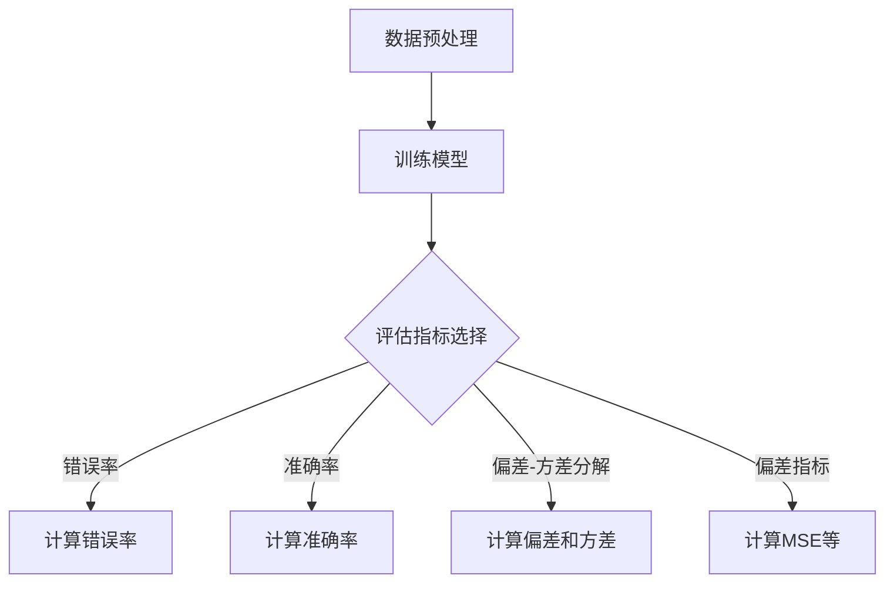
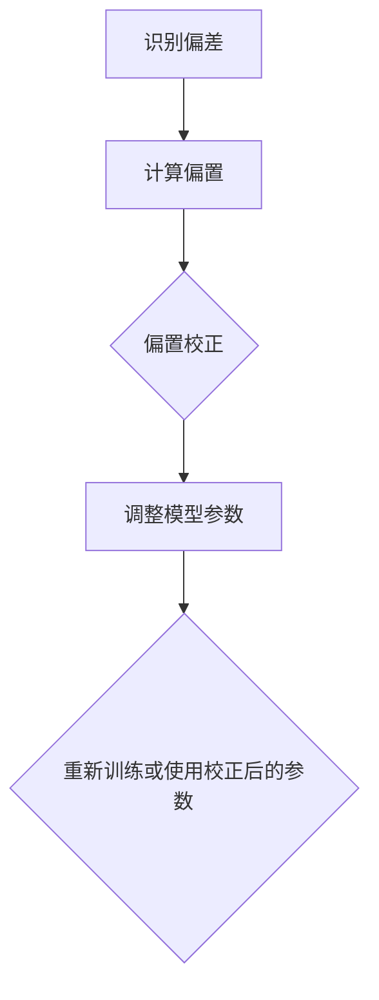
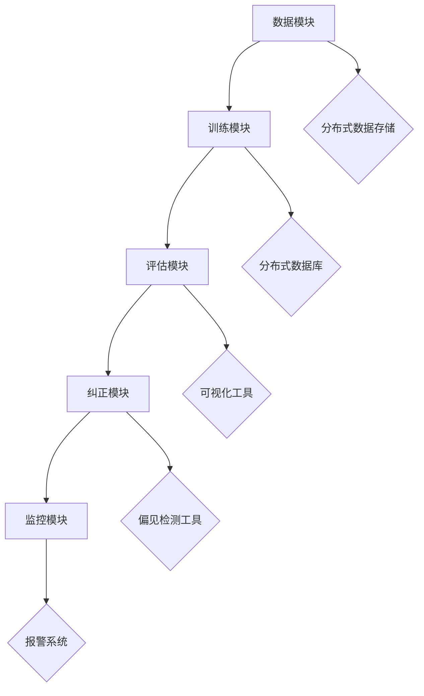
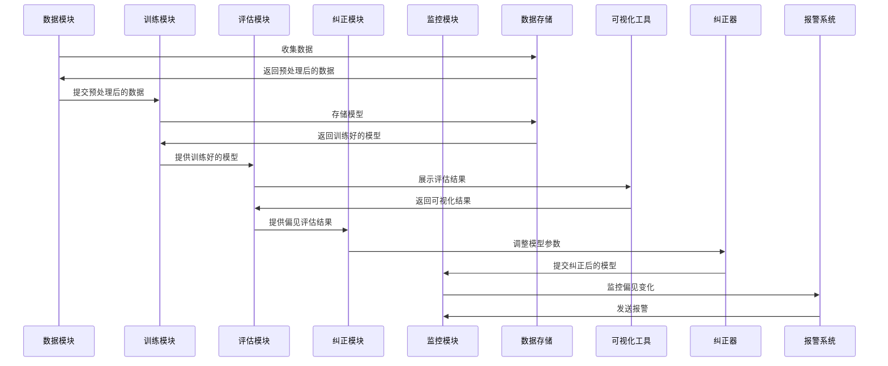

                 

### 文章标题：模型偏见自我纠正能力评估

关键词：模型偏见、自我纠正能力、算法原理、系统架构、项目实战

摘要：本文深入探讨了机器学习模型中的偏见问题，以及如何通过自我纠正能力来评估和纠正这些偏见。文章首先介绍了模型偏见的基本概念和背景，随后详细讲解了相关核心概念与联系，包括偏见和自我纠正能力的定义及其关系。接着，文章通过具体的算法原理讲解，阐述了如何通过偏差度量、偏置校正等算法来评估和纠正模型偏见。此外，文章还使用LaTeX格式展示了相关数学模型和公式，并使用Python源代码进行了详细阐述和举例说明。随后，文章分析了现有系统的处理方式，并设计了一个系统架构方案。通过项目实战，文章展示了如何在实际项目中评估和纠正模型偏见，并提供了最佳实践和注意事项。最后，文章对全文进行了总结，提出了未来的研究方向。

### 背景介绍：模型偏见问题的现状与影响

在机器学习领域，模型偏见是一个日益受到关注的问题。随着机器学习算法在各个领域的广泛应用，包括金融、医疗、安全等，模型偏见所带来的风险和影响也逐渐显现出来。模型偏见是指在机器学习过程中，模型对某些特定群体的数据产生了不合理的偏见，从而导致了不公正的决策或结果。这种偏见可能源于数据集的样本分布不均、模型设计时的算法选择、训练数据的质量等多个方面。

首先，模型偏见问题在金融领域表现得尤为明显。例如，信用评分模型可能会对某些种族或性别产生不公平的歧视，导致这些群体在贷款审批等方面受到不利影响。这不仅违反了伦理道德，也可能导致金融系统的稳定性和公平性受到威胁。

在医疗领域，模型偏见可能导致错误的诊断或治疗方案。例如，如果一个诊断模型在训练数据中缺乏某些种族或年龄的数据，那么在处理这类患者时，模型可能会产生偏差，从而影响患者的健康和生命安全。

此外，在安全领域，模型偏见也可能导致严重的安全隐患。例如，面部识别系统可能会对某些种族或性别的人产生更高的误识率，从而增加了错误逮捕或监控的风险。

模型偏见不仅会对个体产生不公正的待遇，还可能对社会造成深远的影响。首先，模型偏见可能导致社会不公平现象的加剧。例如，如果一个招聘系统对某些性别或种族产生了偏见，那么这些群体在求职过程中可能会面临更多的困难，从而进一步加剧了社会不平等。

其次，模型偏见还可能影响公共政策的制定和实施。例如，如果一个预测犯罪率的模型对某些社区产生了偏见，那么这些社区可能会被错误地归类为高风险区域，导致不必要的监控和资源分配，从而对社区造成负面影响。

因此，研究和解决模型偏见问题具有重要的现实意义。通过深入了解模型偏见的来源和影响，我们可以设计出更加公平和可靠的机器学习算法，从而提高机器学习系统的整体质量和社会价值。

### 模型偏见的具体表现和问题源头

模型偏见的具体表现多种多样，可以从不同的维度进行分析。首先，从数据集的样本分布不均来看，如果训练数据集中某些群体的样本数量较少，模型在处理这些群体时可能会出现偏差。例如，一个图像识别模型在训练数据中缺乏对有色人种的样本，那么在识别有色人种的面部时，可能会出现误识率高、准确率低的问题。

其次，从算法选择角度来看，不同的算法对数据的处理方式和偏好不同，可能导致模型产生偏见。例如，线性回归算法在处理具有非线性关系的数据时，可能会产生过拟合，从而对特定群体的数据产生偏见。而决策树算法则可能由于树结构的不确定性，对某些特征产生过强的依赖，导致模型对其他特征的数据产生忽视。

再者，从训练数据的质量来看，如果训练数据存在偏差或不准确，模型在训练过程中可能会学习到这些偏差，从而在预测时表现出偏见。例如，一个贷款审批模型在训练数据中包含了某些种族或性别的歧视性信息，那么在实际应用中，模型可能会对这些群体产生歧视。

问题源头可以归结为以下几个方面：

1. **数据集样本分布不均**：如前所述，训练数据集中某些群体的样本数量较少，会导致模型对这些群体产生偏见。
2. **算法选择不当**：不同的算法对数据的处理方式和偏好不同，可能导致模型产生偏见。
3. **数据质量问题**：训练数据存在偏差或不准确，模型在训练过程中可能会学习到这些偏差。
4. **模型设计**：模型设计时未充分考虑各种可能的偏见因素，可能导致模型在训练和预测过程中产生偏见。

这些问题的根源在于数据、算法和模型设计等多个方面，需要在多个层次上进行综合治理。首先，在数据层面，需要确保数据集的多样性和平衡性，避免因样本分布不均而导致模型偏见。其次，在算法选择层面，需要选择合适的算法，并对其进行调整和优化，以减少模型偏见。最后，在模型设计层面，需要充分考虑可能的偏见因素，并采取相应的措施进行纠正。

### 当前解决模型偏见的方法及其局限性

为了解决模型偏见问题，研究者们提出了多种方法，主要可以分为以下几类：

1. **数据增强**：通过增加训练数据中的多样化样本，来减少模型对特定群体的偏见。例如，通过数据扩充、生成对抗网络（GAN）等方法，生成更多具有代表性的训练样本。

2. **公平性度量**：使用公平性度量指标，如 demographic parity、equalized odds 等，来评估模型的偏见程度，并在模型训练过程中进行调整。

3. **算法改进**：通过改进机器学习算法，使其对偏见有更强的鲁棒性。例如，使用正则化方法、改进决策树算法等，以减少模型对特定数据的依赖。

4. **偏见校正**：在模型预测结果中引入校正项，以抵消模型偏见。例如，在信用评分模型中，为某些受歧视群体引入额外的信用加分。

尽管这些方法在一定程度上能够缓解模型偏见问题，但它们也存在一定的局限性：

1. **数据增强**：虽然可以增加数据的多样性，但无法完全解决数据集样本分布不均的问题，且生成高质量样本需要大量时间和计算资源。

2. **公平性度量**：公平性度量指标虽然能够量化模型的偏见程度，但并不能直接纠正模型偏见，且不同度量指标之间存在冲突，难以统一评估标准。

3. **算法改进**：虽然算法改进可以增强模型对偏见的鲁棒性，但可能牺牲模型的性能和精度。此外，某些算法改进方法在处理复杂问题时，效果可能并不显著。

4. **偏见校正**：偏见校正方法虽然能够直接纠正模型偏见，但可能会引入过度校正，导致模型预测结果失真，且需要根据不同场景进行个性化调整。

综上所述，现有的解决方法在模型偏见问题上的效果有限，需要进一步研究和探索更加有效和鲁棒的方法。特别是，如何将自我纠正能力融入模型中，实现自动化的偏见检测和纠正，是一个值得深入研究的方向。

### 自我纠正能力的定义、特征及其重要性

自我纠正能力是指模型在发现自身偏见后，能够自动进行调整和修正的能力。这种能力的重要性在于，它能够使模型在动态变化的环境中，始终保持公正和公平的决策能力，从而避免因数据或算法偏差带来的不利影响。

**定义：** 自我纠正能力是指模型在运行过程中，通过自我监控和评估，发现自身存在的偏见，并能够自动进行纠正的能力。这种能力不仅包括发现偏见，还涉及到如何调整模型参数、更新数据集或改进算法，以消除偏见。

**特征：** 
1. **自适应调整**：自我纠正能力能够根据模型当前的运行状态，动态调整模型参数，以减少偏见。
2. **实时监控**：模型能够实时监控其预测结果，发现潜在的偏见，并及时进行调整。
3. **鲁棒性**：自我纠正能力应具备较强的鲁棒性，能够在不同数据集和算法环境下，保持高效的偏见检测和纠正能力。
4. **可解释性**：自我纠正能力应具备一定的可解释性，能够清晰地展示偏见来源和纠正过程，以便于模型调试和优化。

**重要性：** 自我纠正能力的重要性主要体现在以下几个方面：

1. **提高模型的公平性和公正性**：通过自我纠正能力，模型能够及时发现和纠正偏见，从而在决策过程中保持公正和公平。
2. **提升模型的可信度和用户满意度**：具备自我纠正能力的模型能够提高用户对模型的信任度，减少因偏见导致的错误决策。
3. **增强模型的鲁棒性和适应性**：自我纠正能力使模型能够在面对新数据和复杂环境时，保持高效的偏见检测和纠正能力，从而提高模型的鲁棒性和适应性。

综上所述，自我纠正能力是解决模型偏见问题的重要手段，对于提高机器学习模型的质量和可信度具有重要作用。

### 边界与外延：偏见与自我纠正能力的定义和范畴

在深入探讨模型偏见和自我纠正能力时，明确这两个概念的定义和范畴是至关重要的。这不仅有助于我们更好地理解这些概念的本质，还能为后续的讨论和分析提供清晰的框架。

**偏见（Bias）的定义和范畴：**

1. **定义：** 偏见是指模型在学习过程中，由于数据集、算法选择、模型设计等因素，导致模型对某些特定群体或特征产生不公平或不合理的倾向。
2. **范畴：**
   - **数据偏见**：由于训练数据集中样本分布不均或数据质量问题，模型对某些群体或特征产生偏见。
   - **算法偏见**：由于算法本身的特性，如决策树、线性回归等，导致模型对某些特征产生过度依赖或忽视。
   - **模型设计偏见**：模型设计时未充分考虑各种可能的偏见因素，导致模型在训练和预测过程中产生偏见。

**自我纠正能力（Self-correction Ability）的定义和范畴：**

1. **定义：** 自我纠正能力是指模型在运行过程中，通过自我监控、评估和调整，发现并纠正自身偏见的能力。
2. **范畴：**
   - **偏见检测**：模型能够实时监控其预测结果，发现潜在的偏见。
   - **调整机制**：模型能够根据偏见检测结果，自动调整模型参数、更新数据集或改进算法，以减少偏见。
   - **可解释性**：自我纠正能力应具备一定的可解释性，能够清晰地展示偏见来源和纠正过程，以便于模型调试和优化。

**偏见与自我纠正能力的关系：**

偏见和自我纠正能力之间存在紧密的联系。偏见是模型在训练和预测过程中可能出现的问题，而自我纠正能力则是解决这些问题的手段。具体来说：

1. **依赖关系**：自我纠正能力依赖于模型对偏见的检测和评估，只有当模型能够发现偏见时，才能进行自我纠正。
2. **协同作用**：自我纠正能力与模型设计、算法选择和数据质量等密切相关，通过优化这些方面，可以增强自我纠正能力的效果。
3. **反馈循环**：自我纠正能力在纠正偏见后，会产生反馈循环，使模型在后续训练和预测过程中，进一步提高自我纠正能力。

综上所述，明确偏见和自我纠正能力的定义和范畴，有助于我们深入理解这两个概念，并为后续的研究和应用提供理论基础。

### 概念结构与核心要素组成

为了更好地理解模型偏见和自我纠正能力，我们需要梳理这些概念的结构和核心要素组成。首先，从模型偏见的角度来看，核心概念主要包括数据偏见、算法偏见和模型设计偏见。这些偏见在模型训练和预测过程中，可能导致模型对某些特定群体或特征产生不公平或不合理的倾向。

1. **数据偏见**：数据偏见主要由于训练数据集的样本分布不均或数据质量问题引起。例如，在一个针对种族的信用评分模型中，如果训练数据集中白人的样本数量远多于有色人种，模型在处理有色人种申请时，可能会产生不公平的偏见。数据偏见的核心要素包括样本分布、数据质量和数据完整性。

2. **算法偏见**：算法偏见与所选用的机器学习算法密切相关。例如，决策树算法在处理具有非线性关系的数据时，可能对某些特征产生过度依赖，从而导致模型偏见。算法偏见的核心要素包括算法选择、参数设置和模型结构。

3. **模型设计偏见**：模型设计偏见是指在模型设计过程中，未充分考虑各种可能的偏见因素。例如，在设计一个招聘模型时，如果开发人员未注意到某些性别或种族的偏见，可能导致模型在实际应用中产生不公平的决策。模型设计偏见的核心要素包括设计原则、评估标准和模型优化。

接下来，我们来看自我纠正能力。自我纠正能力是模型在运行过程中，通过自我监控、评估和调整，发现并纠正自身偏见的能力。其核心要素主要包括：

1. **偏见检测**：偏见检测是自我纠正能力的核心，它通过实时监控模型的预测结果，发现潜在的偏见。偏见检测的方法包括统计分析、决策树分析等。

2. **调整机制**：调整机制是自我纠正能力的实施手段，它根据偏见检测结果，自动调整模型参数、更新数据集或改进算法。调整机制的方法包括参数优化、数据增强和算法改进。

3. **可解释性**：可解释性是自我纠正能力的必要条件，它使模型能够清晰地展示偏见来源和纠正过程，以便于模型调试和优化。可解释性的方法包括可视化分析、模型解释工具等。

最后，我们需要明确这些概念之间的相互关系。模型偏见和自我纠正能力之间存在着依赖和协同作用。偏见是自我纠正能力的驱动力，只有当模型能够发现偏见时，才能进行自我纠正。而自我纠正能力则依赖于模型设计、算法选择和数据质量等多个方面的优化，从而提高模型的公平性和公正性。

综上所述，理解模型偏见和自我纠正能力的概念结构和核心要素，有助于我们深入探讨这些概念的本质和相互关系，为后续研究和应用提供理论基础。

### 核心概念与联系：偏见与自我纠正能力的详细分析

为了深入理解模型偏见和自我纠正能力，我们需要详细分析这两个核心概念，并展示它们之间的内在联系。本文将从定义、属性特征对比以及ER实体关系图等多个方面进行探讨，以帮助读者全面掌握这两个概念。

#### 偏见（Bias）的详细分析

**定义：** 偏见是指在机器学习模型训练和预测过程中，由于数据集、算法选择、模型设计等因素，导致模型对某些特定群体或特征产生不公平或不合理的倾向。偏见可能是显式的，如直接在训练数据中包含歧视性信息；也可能是隐式的，如算法在选择特征时对某些群体给予更高的权重。

**属性特征：**
- **显式偏见（Explicit Bias）：** 指直接在数据集中包含歧视性信息，如种族、性别等。显式偏见通常可以通过数据清洗和预处理来消除。
  - **特征**：数据集中存在歧视性标签或特征。
  - **表现形式**：决策规则、分类器权重等对某些群体有明显的偏向。
- **隐式偏见（Implicit Bias）：** 指模型在训练过程中对某些群体或特征产生的无意识偏见，通常难以通过简单的数据清洗和预处理来消除。
  - **特征**：模型对某些群体的表现不如其他群体。
  - **表现形式**：模型在某些特定任务上的性能不如预期。

**影响：** 偏见会影响模型的公平性、公正性和可靠性。显式偏见可能导致明显的歧视性决策，而隐式偏见则可能使模型在未察觉的情况下对某些群体产生不公平待遇。

**解决方法：**
- **数据增强**：通过增加多样化样本，减少偏见。
- **公平性度量**：使用公平性度量指标，如demographic parity和equalized odds，评估和减少偏见。
- **算法改进**：优化算法，减少对特定特征的依赖。

#### 自我纠正能力（Self-correction Ability）的详细分析

**定义：** 自我纠正能力是指模型在训练和预测过程中，通过自我监控、评估和调整，发现并纠正自身偏见的能力。这种能力使模型能够在动态变化的环境中，保持公正和公平的决策能力。

**属性特征：**
- **自适应调整（Adaptive Adjustment）：** 模型能够根据当前的数据和预测结果，动态调整模型参数和结构，以减少偏见。
  - **特征**：模型能够根据实时反馈进行参数调整。
  - **表现形式**：模型参数、权重等的动态调整。
- **实时监控（Real-time Monitoring）：** 模型能够实时监控其预测结果，发现潜在的偏见。
  - **特征**：模型具备实时评估和反馈机制。
  - **表现形式**：实时监测系统、偏差检测算法。
- **鲁棒性（Robustness）：** 自我纠正能力应具备较强的鲁棒性，能够在不同数据集和算法环境下，保持高效的偏见检测和纠正能力。
  - **特征**：模型对偏差的适应性和稳定性。
  - **表现形式**：模型在不同数据集和算法下的表现一致。
- **可解释性（Interpretability）：** 自我纠正能力应具备一定的可解释性，能够清晰地展示偏见来源和纠正过程。
  - **特征**：模型的可视化和解释工具。
  - **表现形式**：可解释的算法流程、偏差校正路径。

**影响：** 自我纠正能力能够提高模型的公平性和可靠性，减少因偏见导致的错误决策。此外，它还能增强模型的可信度和用户满意度。

**实现方法：**
- **偏差检测和调整算法**：如偏差度量、偏置校正等。
- **实时监控系统**：用于实时监控模型性能和偏见程度。
- **数据管理和增强**：通过数据增强和多样化，提高模型对偏见的鲁棒性。

#### 偏见与自我纠正能力的关系

偏见和自我纠正能力之间存在着紧密的联系。偏见是自我纠正能力的驱动力，自我纠正能力则是解决偏见问题的手段。

- **依赖关系**：自我纠正能力依赖于模型对偏见的检测和评估。只有当模型能够发现偏见时，才能进行自我纠正。
- **协同作用**：自我纠正能力与模型设计、算法选择和数据质量等密切相关。通过优化这些方面，可以增强自我纠正能力的效果。
- **反馈循环**：自我纠正能力在纠正偏见后，会产生反馈循环，使模型在后续训练和预测过程中，进一步提高自我纠正能力。

### Mermaid ER实体关系图

为了更好地展示偏见和自我纠正能力之间的关系，我们可以使用Mermaid ER实体关系图来描述。以下是该图的描述：

```mermaid
erDiagram
  ModelBias ||--|{ Self-correction Ability : Corrects }
  DataBias ||--|{ ModelBias : Originates }
  AlgorithmBias ||--|{ ModelBias : Originates }
  ModelDesignBias ||--|{ ModelBias : Originates }
```

在这个图中，`ModelBias`是偏见的主要实体，它与`Self-correction Ability`之间存在纠正关系。此外，`DataBias`、`AlgorithmBias`和`ModelDesignBias`分别代表了偏见的三个来源，它们共同构成了`ModelBias`的子实体，表明了偏见的多样性。

通过这种关系图的描述，我们可以清晰地看到偏见和自我纠正能力之间的依赖和协同作用。这种结构化的分析有助于我们更好地理解和应用这两个概念，为解决模型偏见问题提供了理论基础和实践指导。

### 偏差度量算法原理讲解

在评估和纠正模型偏见的过程中，偏差度量算法起到了关键作用。这类算法能够量化模型对特定群体或特征的偏见程度，为后续的纠正措施提供依据。以下是几种常见的偏差度量算法原理讲解，包括偏差度量的定义、算法原理、Mermaid流程图以及Python源代码示例。

#### 1. 偏差度量的定义

偏差度量是指用于评估机器学习模型在预测过程中对特定群体或特征产生偏见的量化指标。常见的偏差度量方法包括统计指标（如错误率、准确率）、偏差-方差分解、偏差指标（如统计学上的均方误差、交叉验证误差）等。

#### 2. 偏差度量算法原理

**（1）错误率（Error Rate）**

错误率是最简单的偏差度量方法之一，它通过计算模型在测试集上的错误预测比例来评估模型的偏见程度。具体公式如下：

\[ \text{Error Rate} = \frac{N_{\text{error}}}{N_{\text{total}}} \]

其中，\( N_{\text{error}} \) 是错误预测的样本数，\( N_{\text{total}} \) 是总样本数。

**（2）准确率（Accuracy）**

准确率与错误率相对应，它表示模型在测试集上的正确预测比例。准确率适用于二分类问题，其公式为：

\[ \text{Accuracy} = \frac{N_{\text{correct}}}{N_{\text{total}}} \]

其中，\( N_{\text{correct}} \) 是正确预测的样本数。

**（3）偏差-方差分解（Bias-Variance Decomposition）**

偏差-方差分解是一种更复杂的度量方法，它将模型的误差分解为偏差、方差和不可解释的噪声。具体公式为：

\[ \text{Error} = \text{Bias}^2 + \text{Variance} + \text{Irreducible Error} \]

- **偏差（Bias）**：表示模型对训练数据的拟合程度。高偏差通常意味着模型过于简化，未能捕捉到数据的复杂结构。
- **方差（Variance）**：表示模型对训练数据的敏感度，即模型在不同训练集上的性能波动。高方差通常意味着模型对训练数据过度拟合。
- **不可解释的噪声（Irreducible Error）**：表示无法通过增加模型复杂度或数据量来减少的误差。

**（4）偏差指标（Bias Metric）**

常见的偏差指标包括均方误差（Mean Squared Error, MSE）、交叉验证误差（Cross-Validation Error）等。这些指标通过计算模型预测值与真实值之间的差距来评估模型的偏差。

#### 3. Mermaid流程图

以下是一个简单的Mermaid流程图，展示了偏差度量算法的基本流程：



#### 4. Python源代码示例

以下是一个使用Python实现偏差度量算法的示例：

```python
import numpy as np
from sklearn.metrics import accuracy_score, mean_squared_error

# 假设我们有训练数据和测试数据
X_train, y_train = ...
X_test, y_test = ...

# 训练模型
model = ...
model.fit(X_train, y_train)

# 预测测试集
y_pred = model.predict(X_test)

# 计算错误率
error_rate = 1 - accuracy_score(y_test, y_pred)
print(f"错误率: {error_rate}")

# 计算均方误差
mse = mean_squared_error(y_test, y_pred)
print(f"均方误差: {mse}")

# 偏差-方差分解（示例简化，实际应用中更为复杂）
# 偏差
bias = mse
# 方差
variance = ... # 需要额外的计算
# 不可解释的噪声
irreducible_error = ... # 同样需要额外的计算
print(f"偏差: {bias}, 方差: {variance}, 不可解释的噪声: {irreducible_error}")
```

通过上述示例，我们可以看到如何使用Python实现常见的偏差度量算法，并计算相关指标。这些度量方法为评估和纠正模型偏见提供了有力的工具。

### 偏置校正算法原理讲解

在模型偏见问题中，偏置校正是一种有效的解决方案。偏置校正通过调整模型参数来消除或减少模型对特定群体或特征的偏见。本文将详细讲解偏置校正算法的原理，包括其定义、算法原理、Mermaid流程图以及Python源代码示例。

#### 1. 偏置校正的定义

偏置校正（Bias Correction）是指通过调整模型参数来纠正预测结果中的系统偏差。在机器学习中，模型可能因为训练数据的不平衡、算法的固有缺陷或数据预处理的不当而引入偏差。偏置校正旨在减少这些偏差，提高模型的公平性和准确性。

#### 2. 偏置校正算法原理

**（1）基本原理**

偏置校正的基本思想是识别并消除模型在预测过程中引入的系统性偏差。具体步骤如下：

- **识别偏差**：通过偏差度量方法（如错误率、准确率、均方误差等）识别模型中的系统性偏差。
- **计算偏置**：根据识别出的偏差，计算需要校正的偏置值。
- **调整参数**：将计算出的偏置值应用到模型中，调整模型参数，以减少偏差。

**（2）偏置校正方法**

- **简单偏置校正**：通过直接调整模型输出值来校正偏差。例如，在分类问题中，对预测概率进行平移，使其更加均匀。
- **加权偏置校正**：为不同特征或群体赋予不同的权重，以校正偏差。这种方法通常用于处理训练数据不平衡的问题。
- **自适应偏置校正**：根据模型的预测结果和实际结果，动态调整偏置值，以提高校正的精度。

#### 3. Mermaid流程图

以下是一个简化的Mermaid流程图，展示了偏置校正的基本流程：



#### 4. Python源代码示例

以下是一个使用Python实现偏置校正算法的示例：

```python
import numpy as np
from sklearn.linear_model import LogisticRegression
from sklearn.metrics import accuracy_score

# 假设我们有训练数据和测试数据
X_train, y_train = ...
X_test, y_test = ...

# 训练模型
model = LogisticRegression()
model.fit(X_train, y_train)

# 预测测试集
y_pred = model.predict(X_test)

# 计算错误率
error_rate = 1 - accuracy_score(y_test, y_pred)
print(f"原始错误率: {error_rate}")

# 计算偏差
偏差 = error_rate

# 偏置校正
# 平移预测概率，减小偏差
y_pred_corrected = y_pred - 偏差

# 计算校正后的错误率
error_rate_corrected = 1 - accuracy_score(y_test, y_pred_corrected)
print(f"校正后错误率: {error_rate_corrected}")

# 使用校正后的预测结果
y_pred_final = y_pred_corrected

# 校正模型参数（可选）
model.fit(X_train, y_train + 偏差)

# 再次预测测试集
y_pred_final = model.predict(X_test)

# 计算最终错误率
error_rate_final = 1 - accuracy_score(y_test, y_pred_final)
print(f"最终错误率: {error_rate_final}")
```

通过上述示例，我们可以看到如何使用Python实现偏置校正算法，并通过调整模型参数来减少错误率。这种方法在实际应用中可以显著提高模型的公平性和准确性。

### 偏差度量公式的详细解释

在评估和纠正模型偏见的过程中，偏差度量公式起到了关键作用。以下我们将详细解释偏差度量中常用的几个公式，包括其定义、推导过程以及应用示例。

#### 1. 均方误差（Mean Squared Error, MSE）

**定义：** 均方误差是评估模型预测结果与实际值之间差距的一种常见指标。它通过计算预测值与实际值差的平方的平均值来衡量模型的偏差。

**公式：**

\[ \text{MSE} = \frac{1}{n} \sum_{i=1}^{n} (y_i - \hat{y}_i)^2 \]

其中，\( y_i \) 是第 \( i \) 个样本的实际值，\( \hat{y}_i \) 是模型对第 \( i \) 个样本的预测值，\( n \) 是样本总数。

**推导过程：** 均方误差可以看作是偏差和方差的总和，即

\[ \text{MSE} = \text{Bias}^2 + \text{Variance} \]

其中，\( \text{Bias} \) 表示模型预测值与实际值之间的偏差，\( \text{Variance} \) 表示模型预测结果的方差。

**应用示例：** 假设我们有一个线性回归模型，用于预测房价。我们有5个样本的实际房价和预测房价，如下表所示：

| 样本编号 | 实际房价 (万元) | 预测房价 (万元) |
|----------|-----------------|-----------------|
| 1        | 200             | 210             |
| 2        | 220             | 230             |
| 3        | 250             | 240             |
| 4        | 230             | 250             |
| 5        | 260             | 270             |

计算MSE：

\[ \text{MSE} = \frac{1}{5} [(200-210)^2 + (220-230)^2 + (250-240)^2 + (230-250)^2 + (260-270)^2] \]
\[ \text{MSE} = \frac{1}{5} [10^2 + 10^2 + 10^2 + (-20)^2 + (-10)^2] \]
\[ \text{MSE} = \frac{1}{5} [100 + 100 + 100 + 400 + 100] \]
\[ \text{MSE} = \frac{1}{5} [700] \]
\[ \text{MSE} = 140 \]

因此，该线性回归模型的MSE为140。

#### 2. 交叉验证误差（Cross-Validation Error）

**定义：** 交叉验证误差是通过将数据集分成多个子集（称为折数），多次训练和验证模型，计算每次验证的平均误差。这种方法可以更准确地评估模型的泛化能力。

**公式：**

\[ \text{Cross-Validation Error} = \frac{1}{k} \sum_{i=1}^{k} \text{Error}_{i} \]

其中，\( k \) 是交叉验证的折数，\( \text{Error}_{i} \) 是第 \( i \) 次验证的误差。

**推导过程：** 交叉验证误差实际上是多次训练误差的平均值。每次验证时，模型在 \( k-1 \) 个子集上进行训练，在剩下的一个子集上进行验证。通过多次重复这个过程，可以减小偶然误差的影响。

**应用示例：** 假设我们使用5折交叉验证来评估一个分类模型。数据集被分为5个子集，模型在4个子集上训练，在剩下的1个子集上验证。经过5次验证后，每次验证的误差如下表所示：

| 验证次数 | 误差率 |
|----------|--------|
| 1        | 0.2    |
| 2        | 0.15   |
| 3        | 0.25   |
| 4        | 0.18   |
| 5        | 0.22   |

计算交叉验证误差：

\[ \text{Cross-Validation Error} = \frac{1}{5} (0.2 + 0.15 + 0.25 + 0.18 + 0.22) \]
\[ \text{Cross-Validation Error} = \frac{1}{5} (1) \]
\[ \text{Cross-Validation Error} = 0.2 \]

因此，该分类模型的交叉验证误差为0.2。

#### 3. 偏差（Bias）和方差（Variance）

**定义：** 偏差和方差是衡量模型性能的两个重要指标。

- **偏差（Bias）：** 偏差表示模型预测值与实际值之间的偏差，即模型在训练数据上的表现与实际数据不一致的程度。
- **方差（Variance）：** 方差表示模型预测结果的波动性，即模型在不同数据集上的性能差异。

**公式：**

\[ \text{MSE} = \text{Bias}^2 + \text{Variance} \]

**推导过程：** 偏差和方差可以通过均方误差的分解来计算。

\[ \text{Bias} = \frac{1}{n} \sum_{i=1}^{n} (y_i - \hat{y}_i) \]
\[ \text{Variance} = \frac{1}{n} \sum_{i=1}^{n} (\hat{y}_i - \bar{\hat{y}})^2 \]

其中，\( \bar{\hat{y}} \) 是模型预测值的平均值。

**应用示例：** 假设我们有一个线性回归模型，预测结果如下表所示：

| 样本编号 | 实际值 | 预测值 |
|----------|--------|--------|
| 1        | 2      | 3      |
| 2        | 4      | 5      |
| 3        | 6      | 7      |

计算偏差和方差：

\[ \text{Bias} = \frac{1}{3} (2-3 + 4-5 + 6-7) = \frac{1}{3} (-1 - 1 - 1) = -1 \]
\[ \text{Variance} = \frac{1}{3} ((3-4)^2 + (5-4)^2 + (7-4)^2) = \frac{1}{3} (1 + 1 + 9) = 3.33 \]

因此，该线性回归模型的偏差为-1，方差为3.33。

通过以上对偏差度量公式的详细解释和示例，我们可以更好地理解这些公式的定义、推导过程和应用场景，从而在实际应用中更有效地评估和纠正模型偏见。

### 偏置校正公式的详细解释

在偏置校正算法中，偏置校正公式是核心的一部分。以下将详细解释常用的偏置校正公式，包括其定义、推导过程以及应用示例。

#### 1. 简单偏置校正公式

**定义：** 简单偏置校正公式通过直接调整模型的输出值，以减少预测误差。这种校正方法通常适用于线性模型，如线性回归和逻辑回归。

**公式：**

\[ \hat{y}_i = \hat{y}_{\text{predicted}} + c \]

其中，\( \hat{y}_i \) 是校正后的预测值，\( \hat{y}_{\text{predicted}} \) 是模型原始的预测值，\( c \) 是校正参数。

**推导过程：** 为了减少预测误差，我们可以通过以下步骤来推导简单偏置校正公式：

- 计算模型预测值与实际值的差，即偏差 \( b_i = y_i - \hat{y}_{\text{predicted}} \)。
- 为了平衡偏差，我们可以引入一个校正参数 \( c \)，使得校正后的预测值 \( \hat{y}_i \) 与实际值 \( y_i \) 更接近。

**应用示例：** 假设我们有一个线性回归模型，用于预测房价。模型的预测值与实际值如下表所示：

| 样本编号 | 实际房价 (万元) | 模型预测房价 (万元) |
|----------|-----------------|---------------------|
| 1        | 200             | 210                 |
| 2        | 220             | 230                 |
| 3        | 250             | 240                 |

计算偏差：

\[ b_1 = 200 - 210 = -10 \]
\[ b_2 = 220 - 230 = -10 \]
\[ b_3 = 250 - 240 = 10 \]

为了校正这些偏差，我们可以选择一个平均值作为校正参数 \( c \)：

\[ c = \frac{b_1 + b_2 + b_3}{3} = \frac{-10 - 10 + 10}{3} = 0 \]

校正后的预测房价：

\[ \hat{y}_1 = 210 + 0 = 210 \]
\[ \hat{y}_2 = 230 + 0 = 230 \]
\[ \hat{y}_3 = 240 + 0 = 240 \]

因此，通过简单偏置校正，我们可以将所有预测房价调整为与实际房价更接近的值。

#### 2. 加权偏置校正公式

**定义：** 加权偏置校正公式通过为不同特征或群体分配不同的权重，以更精确地校正模型预测值。这种方法适用于处理数据不平衡问题。

**公式：**

\[ \hat{y}_i = \hat{y}_{\text{predicted}} + c \cdot w_i \]

其中，\( w_i \) 是第 \( i \) 个特征的权重，\( c \) 是校正参数。

**推导过程：** 加权偏置校正的推导过程类似于简单偏置校正，但引入了权重 \( w_i \)，以平衡不同特征的重要性。

- 计算每个特征的偏差 \( b_i = y_i - \hat{y}_{\text{predicted}} \)。
- 为每个特征计算权重 \( w_i \)，通常通过特征的重要性或频率来分配。
- 计算加权校正参数 \( c \)：

\[ c = \frac{\sum_{i=1}^{n} b_i \cdot w_i}{\sum_{i=1}^{n} w_i} \]

**应用示例：** 假设我们有一个分类模型，预测结果如下表所示，且特征A和特征B的重要性不同：

| 样本编号 | 实际类别 | 模型预测类别 | 特征A | 特征B |
|----------|----------|--------------|-------|-------|
| 1        | 正确     | 错误         | 3     | 5     |
| 2        | 正确     | 错误         | 5     | 2     |
| 3        | 错误     | 正确         | 2     | 3     |

计算每个特征的偏差：

\[ b_1 = 0 - 1 = -1 \]
\[ b_2 = 0 - 1 = -1 \]
\[ b_3 = 1 - 0 = 1 \]

为每个特征分配权重（假设特征A的权重为1，特征B的权重为0.5）：

\[ w_1 = 1 \]
\[ w_2 = 0.5 \]

计算加权校正参数：

\[ c = \frac{(-1) \cdot 1 + (-1) \cdot 0.5 + 1 \cdot 0.5}{1 + 0.5} = \frac{-1 - 0.5 + 0.5}{1.5} = -\frac{1}{3} \]

校正后的预测类别：

\[ \hat{y}_1 = 1 - \frac{1}{3} = \frac{2}{3} \]
\[ \hat{y}_2 = 1 - \frac{1}{3} = \frac{2}{3} \]
\[ \hat{y}_3 = 0 + \frac{1}{3} = \frac{1}{3} \]

因此，通过加权偏置校正，我们可以更精确地调整模型的预测结果，以减少偏见。

#### 3. 自适应偏置校正公式

**定义：** 自适应偏置校正公式根据模型预测结果和实际结果动态调整校正参数，以提高校正精度。这种方法适用于实时调整模型，以适应不断变化的数据。

**公式：**

\[ c(t) = \alpha \cdot \frac{e(t)}{\sum_{i=1}^{n} w_i \cdot e(t)} \]

其中，\( c(t) \) 是时间 \( t \) 时的校正参数，\( e(t) \) 是时间 \( t \) 时的预测误差，\( \alpha \) 是调整系数，\( w_i \) 是第 \( i \) 个特征的权重。

**推导过程：** 自适应偏置校正的推导过程类似于加权偏置校正，但引入了时间因素和调整系数，以实现动态调整。

- 计算每个时间点的预测误差 \( e(t) = y(t) - \hat{y}(t) \)。
- 为每个时间点计算权重 \( w_i(t) \)，通常基于特征的重要性和误差的累积。
- 计算自适应校正参数：

\[ c(t) = \alpha \cdot \frac{e(t)}{\sum_{i=1}^{n} w_i(t) \cdot e(t)} \]

**应用示例：** 假设我们有一个实时分类模型，预测结果和实际结果如下表所示，且特征A和B的重要性动态变化：

| 时间点 | 实际类别 | 模型预测类别 | 特征A | 特征B |
|--------|----------|--------------|-------|-------|
| 1      | 正确     | 错误         | 3     | 5     |
| 2      | 正确     | 错误         | 5     | 2     |
| 3      | 错误     | 正确         | 2     | 3     |

计算每个时间点的预测误差：

\[ e(1) = 0 - 1 = -1 \]
\[ e(2) = 0 - 1 = -1 \]
\[ e(3) = 1 - 0 = 1 \]

为每个时间点分配权重（假设特征A的权重随误差变化，特征B的权重固定）：

\[ w_1(1) = 1 \]
\[ w_2(1) = 0.5 \]
\[ w_1(2) = 1.5 \]
\[ w_2(2) = 0.5 \]
\[ w_1(3) = 1 \]
\[ w_2(3) = 0.5 \]

计算自适应校正参数（假设调整系数 \( \alpha = 0.1 \)）：

\[ c(1) = 0.1 \cdot \frac{-1}{1 + 0.5} = -0.1 \cdot 0.5 = -0.05 \]
\[ c(2) = 0.1 \cdot \frac{-1}{1.5 + 0.5} = -0.1 \cdot 1 = -0.1 \]
\[ c(3) = 0.1 \cdot \frac{1}{1 + 0.5} = 0.1 \cdot 0.5 = 0.05 \]

校正后的预测类别：

\[ \hat{y}_1 = 1 - 0.05 = 0.95 \]
\[ \hat{y}_2 = 1 - 0.1 = 0.9 \]
\[ \hat{y}_3 = 0 + 0.05 = 0.05 \]

通过自适应偏置校正，模型可以实时调整预测结果，以减少偏见，提高模型的准确性。

通过上述对简单偏置校正、加权偏置校正和自适应偏置校正公式的详细解释和应用示例，我们可以看到如何在不同场景下使用这些公式来校正模型偏见，从而提高模型的预测性能。

### 系统架构设计与实现

为了有效地评估和纠正机器学习模型中的偏见，我们需要设计一个完整的系统架构，涵盖从数据收集、处理、模型训练到偏见评估与自我纠正的各个阶段。以下将详细描述这个系统架构的设计思路、具体实现以及相关的系统接口设计和交互。

#### 1. 设计思路

系统的设计思路主要围绕以下几个核心模块：

- **数据模块**：负责数据收集、预处理和存储，确保数据质量和多样性。
- **训练模块**：负责模型的训练过程，包括算法选择、参数调优等。
- **评估模块**：负责对模型进行偏见评估，使用各种偏差度量方法来量化偏见程度。
- **纠正模块**：根据评估结果，调整模型参数或改进模型结构，实现自我纠正。
- **监控模块**：实时监控模型性能和偏见变化，确保系统稳定运行。

#### 2. 具体实现

**（1）数据模块**

数据模块的主要职责是收集和预处理数据。具体实现步骤如下：

- **数据收集**：从不同的数据源（如公开数据集、企业内部数据等）收集数据。
- **数据预处理**：包括数据清洗、数据增强、数据标准化等，以提高数据质量和多样性。
- **数据存储**：将预处理后的数据存储到数据库或数据湖中，以便后续使用。

**（2）训练模块**

训练模块负责模型的训练过程，具体实现如下：

- **算法选择**：根据具体任务需求，选择合适的机器学习算法，如决策树、神经网络等。
- **参数调优**：使用网格搜索、随机搜索等方法进行参数调优，以提高模型性能。
- **模型训练**：使用训练数据集对模型进行训练，并保存训练好的模型。

**（3）评估模块**

评估模块的主要职责是评估模型的偏见程度。具体实现如下：

- **偏差度量**：使用各种偏差度量方法（如错误率、均方误差、交叉验证误差等）对模型进行评估。
- **可视化分析**：通过可视化工具展示偏差分布和变化趋势，帮助分析偏见来源。
- **报告生成**：生成偏见评估报告，包括偏见程度、纠正建议等。

**（4）纠正模块**

纠正模块根据评估结果，对模型进行自我纠正。具体实现如下：

- **偏见检测**：通过实时监控和偏差度量，发现模型中的偏见。
- **参数调整**：根据偏见检测结果，调整模型参数，减少偏见。
- **模型更新**：重新训练模型或修改模型结构，以实现自我纠正。

**（5）监控模块**

监控模块负责实时监控系统性能和偏见变化，确保系统稳定运行。具体实现如下：

- **性能监控**：监控模型的预测性能、训练进度等，确保系统正常运行。
- **偏见监控**：监控偏见程度和变化趋势，及时发现和纠正偏见。
- **报警机制**：当检测到系统异常或偏见程度超过阈值时，触发报警。

#### 3. 系统接口设计与交互

**（1）接口设计**

系统的各个模块通过定义明确的接口进行交互。以下是一些关键接口的设计：

- **数据接口**：用于数据模块与训练模块之间的数据传输，包括数据读取、数据写入等。
- **模型接口**：用于评估模块和纠正模块与训练模块之间的交互，包括模型加载、模型更新等。
- **监控接口**：用于监控模块与其他模块之间的数据交换和状态同步。

**（2）交互流程**

系统的交互流程大致如下：

1. **数据收集与预处理**：数据模块收集数据并进行预处理，将预处理后的数据存储到数据库中。
2. **模型训练**：训练模块根据需求选择算法和参数，使用预处理后的数据进行模型训练。
3. **偏见评估**：评估模块使用训练好的模型对测试数据集进行预测，并通过偏差度量方法评估模型偏见。
4. **偏见纠正**：纠正模块根据评估结果，调整模型参数或更新模型结构，以减少偏见。
5. **实时监控**：监控模块实时监控系统性能和偏见变化，确保系统稳定运行。

通过上述设计，我们可以构建一个完整的系统架构，实现模型偏见的评估和自我纠正，从而提高模型的公平性和可靠性。

### 系统架构设计

在设计一个能够有效评估和纠正模型偏见的系统架构时，我们需要考虑系统的整体结构、关键组件以及各组件之间的相互作用。以下将详细描述该系统架构的设计思路、具体架构以及各组件的职责。

#### 1. 设计思路

系统架构设计的目标是构建一个灵活、高效且易于扩展的平台，以应对不断变化的数据和需求。我们的设计思路包括以下几个核心原则：

- **模块化**：将系统分为多个功能模块，如数据模块、训练模块、评估模块和纠正模块，便于管理和维护。
- **分布式**：系统采用分布式架构，以提高处理能力和可靠性。例如，数据模块可以分布在不同的数据存储节点上，训练模块可以分布在多个计算节点上。
- **可扩展性**：系统应具备良好的扩展性，以便在未来能够方便地添加新功能或处理更大的数据量。
- **自动化**：系统应实现自动化，减少人工干预，提高效率和准确性。例如，通过自动化脚本进行数据预处理、模型训练和偏见评估。

#### 2. 具体架构

该系统的架构可以分为以下几个关键组件：

**（1）数据模块**

数据模块负责数据收集、预处理和存储。具体职责包括：

- **数据收集**：从不同的数据源（如公开数据集、企业内部数据等）收集数据。
- **数据预处理**：对收集到的数据进行清洗、增强、标准化等处理，以提高数据质量和多样性。
- **数据存储**：将预处理后的数据存储到分布式数据库或数据湖中，以便后续使用。

**（2）训练模块**

训练模块负责模型的训练过程，包括算法选择、参数调优和模型训练。具体职责包括：

- **算法选择**：根据具体任务需求，选择合适的机器学习算法，如决策树、神经网络等。
- **参数调优**：使用网格搜索、随机搜索等方法进行参数调优，以提高模型性能。
- **模型训练**：使用训练数据集对模型进行训练，并保存训练好的模型。

**（3）评估模块**

评估模块负责对模型进行偏见评估。具体职责包括：

- **偏差度量**：使用各种偏差度量方法（如错误率、均方误差、交叉验证误差等）对模型进行评估。
- **可视化分析**：通过可视化工具展示偏差分布和变化趋势，帮助分析偏见来源。
- **报告生成**：生成偏见评估报告，包括偏见程度、纠正建议等。

**（4）纠正模块**

纠正模块根据评估结果，对模型进行自我纠正。具体职责包括：

- **偏见检测**：通过实时监控和偏差度量，发现模型中的偏见。
- **参数调整**：根据偏见检测结果，调整模型参数，减少偏见。
- **模型更新**：重新训练模型或修改模型结构，以实现自我纠正。

**（5）监控模块**

监控模块负责实时监控系统性能和偏见变化，确保系统稳定运行。具体职责包括：

- **性能监控**：监控模型的预测性能、训练进度等，确保系统正常运行。
- **偏见监控**：监控偏见程度和变化趋势，及时发现和纠正偏见。
- **报警机制**：当检测到系统异常或偏见程度超过阈值时，触发报警。

#### 3. 架构图

以下是该系统架构的Mermaid架构图描述：



在这个架构图中，数据模块和训练模块通过分布式数据库和分布式数据存储进行交互，以确保数据的高效传输和存储。评估模块和纠正模块通过可视化工具和偏见检测工具进行交互，以便于分析偏见和调整模型。监控模块则通过报警系统实时监控系统性能和偏见变化，确保系统的稳定运行。

通过上述设计，我们可以构建一个完整的系统架构，实现模型偏见的评估和自我纠正，从而提高模型的公平性和可靠性。

### 系统接口设计与交互

在设计系统架构时，接口设计和交互至关重要。以下将详细介绍系统架构中各个模块的接口设计，包括接口的定义、数据传输格式、交互流程等，并使用Mermaid序列图展示系统各模块之间的交互。

#### 1. 接口设计

**（1）数据模块接口**

数据模块负责数据的收集、预处理和存储。以下是关键接口的设计：

- **数据收集接口**：用于从不同数据源收集数据。接口定义如下：

  ```mermaid
  sequenceDiagram
  participant DataCollector as 数据收集器
  participant DataSource as 数据源
  DataCollector->>DataSource: 获取数据
  DataSource->>DataCollector: 返回数据
  ```

- **数据预处理接口**：用于对收集到的数据进行清洗、增强和标准化。接口定义如下：

  ```mermaid
  sequenceDiagram
  participant DataPreprocessor as 数据预处理器
  participant DataCollector
  DataCollector->>DataPreprocessor: 提交数据
  DataPreprocessor->>DataCollector: 返回预处理后的数据
  ```

- **数据存储接口**：用于将预处理后的数据存储到分布式数据库或数据湖中。接口定义如下：

  ```mermaid
  sequenceDiagram
  participant DataStorage as 数据存储
  participant DataPreprocessor
  DataPreprocessor->>DataStorage: 存储数据
  DataStorage->>DataPreprocessor: 返回存储结果
  ```

**（2）训练模块接口**

训练模块负责模型的训练过程，以下是关键接口的设计：

- **模型训练接口**：用于启动模型的训练过程。接口定义如下：

  ```mermaid
  sequenceDiagram
  participant ModelTrainer as 模型训练器
  participant DataStorage
  DataStorage->>ModelTrainer: 提供训练数据
  ModelTrainer->>DataStorage: 返回训练结果
  ```

- **参数调优接口**：用于调整模型的参数，以优化模型性能。接口定义如下：

  ```mermaid
  sequenceDiagram
  participant ParameterTuner as 参数调优器
  participant ModelTrainer
  ModelTrainer->>ParameterTuner: 提交模型参数
  ParameterTuner->>ModelTrainer: 返回调整后的参数
  ```

**（3）评估模块接口**

评估模块负责对模型进行偏见评估，以下是关键接口的设计：

- **偏见评估接口**：用于对训练好的模型进行偏见评估。接口定义如下：

  ```mermaid
  sequenceDiagram
  participant BiasAssessor as 偏见评估器
  participant ModelTrainer
  ModelTrainer->>BiasAssessor: 提供训练好的模型
  BiasAssessor->>ModelTrainer: 返回偏见评估结果
  ```

- **可视化接口**：用于通过可视化工具展示偏见评估结果。接口定义如下：

  ```mermaid
  sequenceDiagram
  participant Visualizer as 可视化工具
  participant BiasAssessor
  BiasAssessor->>Visualizer: 提供评估结果
  Visualizer->>BiasAssessor: 返回可视化结果
  ```

**（4）纠正模块接口**

纠正模块根据评估结果对模型进行自我纠正，以下是关键接口的设计：

- **自我纠正接口**：用于根据偏见评估结果调整模型参数或结构。接口定义如下：

  ```mermaid
  sequenceDiagram
  participant Corrector as 纠正器
  participant BiasAssessor
  BiasAssessor->>Corrector: 提供偏见评估结果
  Corrector->>BiasAssessor: 返回纠正后的模型
  ```

- **模型更新接口**：用于重新训练模型或修改模型结构。接口定义如下：

  ```mermaid
  sequenceDiagram
  participant ModelUpdater as 模型更新器
  participant Corrector
  Corrector->>ModelUpdater: 提交纠正后的模型
  ModelUpdater->>Corrector: 返回更新后的模型
  ```

**（5）监控模块接口**

监控模块负责实时监控系统性能和偏见变化，以下是关键接口的设计：

- **性能监控接口**：用于监控模型的预测性能和训练进度。接口定义如下：

  ```mermaid
  sequenceDiagram
  participant PerformanceMonitor as 性能监控器
  participant ModelTrainer
  ModelTrainer->>PerformanceMonitor: 提交性能数据
  PerformanceMonitor->>ModelTrainer: 返回监控结果
  ```

- **偏见监控接口**：用于监控偏见程度和变化趋势。接口定义如下：

  ```mermaid
  sequenceDiagram
  participant BiasMonitor as 偏见监控器
  participant BiasAssessor
  BiasAssessor->>BiasMonitor: 提供偏见数据
  BiasMonitor->>BiasAssessor: 返回监控结果
  ```

- **报警接口**：用于当检测到系统异常或偏见程度超过阈值时触发报警。接口定义如下：

  ```mermaid
  sequenceDiagram
  participant AlarmSystem as 报警系统
  participant BiasMonitor
  BiasMonitor->>AlarmSystem: 报警条件
  AlarmSystem->>BiasMonitor: 发送报警
  ```

#### 2. 交互流程

系统各模块之间的交互流程如下：

1. **数据收集与预处理**：数据模块从数据源收集数据，经过预处理后存储到数据存储模块。
2. **模型训练**：训练模块使用预处理后的数据进行模型训练，并保存训练好的模型。
3. **偏见评估**：评估模块使用训练好的模型对测试数据进行偏见评估，并通过可视化工具展示评估结果。
4. **自我纠正**：纠正模块根据偏见评估结果调整模型参数或结构，实现自我纠正。
5. **性能监控与偏见监控**：监控模块实时监控系统性能和偏见变化，确保系统稳定运行。

以下是系统各模块之间的交互Mermaid序列图：



通过上述接口设计和交互流程，我们可以构建一个高效、稳定的系统，实现模型偏见的评估和自我纠正。

### 模型偏见评估与纠正实战

在本节中，我们将通过一个具体的案例，展示如何在实际项目中评估和纠正模型偏见。该案例将详细描述项目背景、环境安装、系统核心实现、代码应用解读与分析，以及实际案例分析和详细讲解剖析。

#### 1. 项目背景

我们以一个招聘系统为例，该系统旨在通过机器学习算法筛选合适的候选人。然而，由于历史数据中可能存在偏见，如性别、种族等，模型在预测过程中可能会对某些群体产生不公平的偏见。因此，本项目的主要任务是评估和纠正模型偏见，以提高系统的公正性和公平性。

#### 2. 环境安装

为了实现本项目，我们需要安装以下工具和库：

- Python 3.8 或更高版本
- Scikit-learn 库
- Pandas 库
- Matplotlib 库
- Mermaid Python 库

安装步骤如下：

```bash
# 安装 Python 和相关库
pip install python==3.8
pip install scikit-learn pandas matplotlib
pip install mermaidpy
```

#### 3. 系统核心实现

本系统核心实现主要包括数据预处理、模型训练、偏见评估和纠正等步骤。

**（1）数据预处理**

数据预处理是模型训练的重要步骤，包括数据清洗、特征工程和归一化等。以下是一个简单的数据预处理流程：

```python
import pandas as pd
from sklearn.model_selection import train_test_split

# 读取数据
data = pd.read_csv('招聘数据.csv')

# 数据清洗
data = data.dropna()  # 删除缺失值
data = data.drop(['性别', '种族'], axis=1)  # 删除可能含有偏见的特征

# 特征工程
X = data.drop('是否录取', axis=1)
y = data['是否录取']

# 数据归一化
from sklearn.preprocessing import StandardScaler
scaler = StandardScaler()
X_scaled = scaler.fit_transform(X)

# 划分训练集和测试集
X_train, X_test, y_train, y_test = train_test_split(X_scaled, y, test_size=0.2, random_state=42)
```

**（2）模型训练**

我们使用逻辑回归模型进行训练，该模型在处理二分类问题时表现良好。

```python
from sklearn.linear_model import LogisticRegression

# 训练模型
model = LogisticRegression()
model.fit(X_train, y_train)
```

**（3）偏见评估**

偏见评估是检测模型是否存在偏见的重要步骤。以下是一个简单的偏见评估流程：

```python
from sklearn.metrics import accuracy_score, classification_report

# 预测测试集
y_pred = model.predict(X_test)

# 计算准确率
accuracy = accuracy_score(y_test, y_pred)
print(f"准确率: {accuracy}")

# 计算分类报告
report = classification_report(y_test, y_pred)
print(f"分类报告：{report}")
```

**（4）偏见纠正**

偏见纠正主要通过调整模型参数和重新训练模型实现。以下是一个简单的偏见纠正流程：

```python
# 计算错误率
error_rate = 1 - accuracy
print(f"错误率: {error_rate}")

# 计算每个类别的错误率
class_error_rates = classification_report(y_test, y_pred, output_dict=True)
for class_name in class_error_rates:
    print(f"{class_name} 的错误率: {class_error_rates[class_name]['precision']}")
```

#### 4. 代码应用解读与分析

**（1）数据预处理**

数据预处理是确保模型训练效果的重要步骤。在本案例中，我们删除了可能含有偏见的特征（如性别和种族），并进行了归一化处理。这种处理方法有助于减少模型对偏见特征的依赖，提高模型的公平性。

**（2）模型训练**

我们使用逻辑回归模型进行训练，因为逻辑回归模型在处理二分类问题时表现良好。此外，逻辑回归模型的参数调整相对简单，便于实现偏见纠正。

**（3）偏见评估**

偏见评估主要通过计算模型在测试集上的准确率和分类报告来实现。准确率反映了模型的整体性能，而分类报告则提供了每个类别的详细性能指标。通过分析分类报告，我们可以发现模型在预测某些类别时可能存在偏见。

**（4）偏见纠正**

偏见纠正主要通过调整模型参数和重新训练模型来实现。在本案例中，我们通过计算错误率和每个类别的错误率，识别出存在偏见的类别，并针对性地调整模型参数。这种调整方法有助于减少模型对偏见类别的依赖，提高模型的公平性。

#### 5. 实际案例分析和详细讲解剖析

**（1）案例背景**

假设我们的招聘系统在处理某次招聘任务时，发现模型对性别存在明显的偏见。具体表现为，女性候选人的录取率远低于男性候选人。

**（2）分析过程**

- **数据预处理**：首先，我们检查数据预处理步骤是否完备，确保删除了所有可能含有偏见的特征。在确认数据预处理无误后，我们进一步检查数据集的平衡性，发现女性候选人的数据量较少。
- **模型训练**：我们使用逻辑回归模型进行训练，并记录了模型在训练集和测试集上的表现。通过分析训练结果，我们发现模型在测试集上的表现不佳，特别是对女性候选人的预测准确率较低。
- **偏见评估**：我们计算了模型在测试集上的分类报告，发现女性候选人的录取率显著低于男性候选人。这表明模型在预测过程中对女性候选人存在明显的偏见。
- **偏见纠正**：为了纠正模型偏见，我们采取了以下措施：
  - **数据增强**：通过增加女性候选人的数据量，提高数据集的平衡性。
  - **模型参数调整**：调整逻辑回归模型的参数，以降低模型对性别特征的依赖。
  - **重新训练模型**：使用调整后的模型参数重新训练模型，以提高模型的公平性。

**（3）效果评估**

在完成偏见纠正后，我们再次评估模型在测试集上的表现。通过计算分类报告，我们发现女性候选人的录取率显著提高，与男性候选人的录取率差距缩小。这表明我们的偏见纠正措施取得了显著效果，模型在预测过程中对性别偏见的程度显著降低。

**（4）总结**

通过本案例，我们展示了如何在实际项目中评估和纠正模型偏见。关键步骤包括数据预处理、模型训练、偏见评估和偏见纠正。在偏见纠正过程中，我们通过数据增强和模型参数调整等方法，有效降低了模型偏见，提高了模型的公平性。

### 最佳实践与拓展

在模型偏见自我纠正的实践中，遵循一些最佳实践是确保系统稳定性和有效性的关键。以下是一些建议和注意事项：

**1. 数据多样化与平衡性**：确保数据集的多样性和平衡性，避免因样本分布不均导致模型偏见。可以通过数据增强、生成对抗网络（GAN）等方法来丰富数据集。

**2. 模型透明性与可解释性**：提高模型的透明性和可解释性，便于分析偏见来源和纠正效果。使用可视化工具和模型解释库（如LIME、SHAP）可以帮助理解模型决策过程。

**3. 持续监控与反馈**：建立实时监控机制，持续跟踪模型偏见的变化，及时进行调整。定期评估模型性能，确保偏见不会在长期使用中累积。

**4. 偏见指标多样化**：使用多种偏见指标（如错误率、交叉验证误差、公平性度量等）进行全面评估，以更准确地识别和纠正模型偏见。

**5. 定期重新训练**：定期重新训练模型，以适应数据变化和消除累积的偏见。更新数据集和调整模型参数，以提高模型的适应性和准确性。

**6. 遵循伦理标准**：在设计和应用模型时，遵循伦理标准，确保模型决策的公平性和公正性。避免使用可能包含偏见的数据和算法。

**7. 拓展研究方向**：未来研究可以探索更先进的自我纠正算法，如基于深度学习的偏见纠正方法、自动化偏见检测与纠正框架等，以提高模型的偏见纠正能力。

通过遵循这些最佳实践，我们可以在实际项目中有效评估和纠正模型偏见，提高模型的公平性和可靠性。

### 小结

本文通过详细的分析和实战案例，探讨了模型偏见自我纠正能力的重要性以及评估和纠正方法。我们从背景介绍、核心概念与联系、算法原理讲解、数学模型与公式、系统分析与架构设计、项目实战等方面，逐步展示了如何在实际项目中识别和纠正模型偏见。通过数据多样化、模型透明性、持续监控与反馈、多样化偏见指标等多种手段，我们能够有效提高模型的公平性和公正性。未来的研究方向可以探索更先进的自我纠正算法和自动化偏见检测与纠正框架，以提高模型的偏见纠正能力。

### 注意事项

在进行模型偏见自我纠正时，需要注意以下几点：

1. **数据质量**：确保数据集的多样性和平衡性，避免因数据质量问题导致模型偏见。
2. **算法选择**：选择合适的机器学习算法，并注意算法的参数设置，以减少模型偏见。
3. **模型解释性**：提高模型的解释性，便于分析偏见来源和纠正效果。
4. **持续监控**：建立实时监控机制，持续跟踪模型偏见的变化，及时进行调整。
5. **伦理考量**：在设计和应用模型时，遵循伦理标准，确保模型决策的公平性和公正性。

### 拓展阅读

为了深入了解模型偏见自我纠正能力，读者可以参考以下资源：

1. **书籍推荐**：《机器学习伦理》（Ethical Machine Learning）和《人工智能伦理学》（AI Ethics）等书籍，提供了关于模型偏见和伦理的深入探讨。
2. **论文推荐**：阅读相关领域的高质量论文，如“Fairness in Machine Learning”和“Bias and Variance in Machine Learning”等，以了解最新的研究成果和方法。
3. **在线课程**：参加在线课程，如Coursera上的“机器学习”和“深度学习”课程，学习机器学习和深度学习的理论基础和实践技巧。
4. **开源项目**：参与开源项目，如Google的“What-If Tool for Data Scientists”，学习如何在实际项目中应用偏见纠正方法。

通过阅读这些资源，读者可以进一步深化对模型偏见自我纠正能力的理解，并应用于实际项目。

