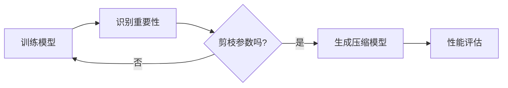
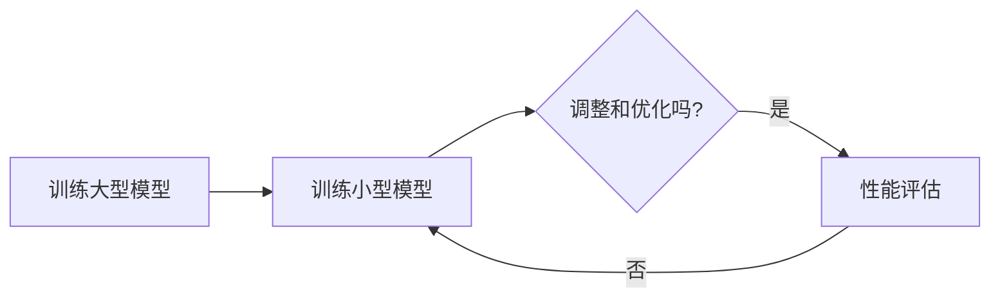
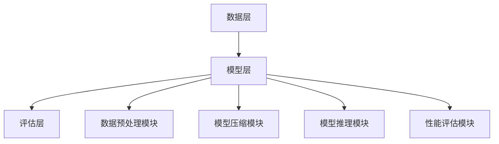

                 


### 引言

模型压缩是机器学习领域中的一个重要研究方向，其核心目标是在不显著牺牲模型性能的前提下，降低模型的存储和计算需求。随着深度学习模型的复杂度和参数数量不断增加，如何在保持模型效果的同时实现高效存储和计算成为了亟待解决的问题。本文将围绕模型压缩后的性能评测这一主题，深入探讨其在现代机器学习应用中的重要性、核心概念、主要方法、性能评测方法以及实际应用案例。

### 模型压缩的背景

#### 1.1 模型压缩的必要性

深度学习模型的复杂性和计算能力在过去几年中得到了显著提升。然而，这一提升也带来了模型存储和计算资源的巨大需求。具体来说，大型深度学习模型往往包含数亿甚至数十亿个参数，其模型文件大小可以达到数GB。这不仅在存储设备上占据大量空间，也导致了训练和部署过程中的计算资源消耗增加。此外，随着移动设备和嵌入式系统的普及，对模型的存储和计算需求提出了更高的要求。

#### 1.2 模型压缩的重要性

模型压缩技术的引入，旨在解决上述问题。通过模型压缩，可以在保持模型性能的前提下，显著减少模型的存储和计算需求。具体来说，模型压缩具有以下重要性：

1. **节省存储空间**：压缩后的模型文件体积减小，使得存储需求降低。
2. **提高计算效率**：压缩模型在训练和推理过程中所需的计算资源减少，提高了系统的运行效率。
3. **支持移动设备和边缘计算**：在资源受限的环境中，压缩模型能够更有效地运行，满足了移动设备和边缘计算的需求。

#### 1.3 模型压缩的挑战

尽管模型压缩带来了许多优势，但在实际应用中仍面临着一些挑战。首先，如何在不显著牺牲模型性能的情况下实现有效压缩是一个关键问题。其次，不同类型的模型压缩方法有其特定的适用场景和优缺点，如何选择合适的方法以实现最佳性能也是一个难点。此外，模型压缩技术还需要与其他优化技术相结合，以实现更全面的性能提升。

### 核心概念与联系

#### 2.1 模型压缩的定义

模型压缩是对深度学习模型进行的一种优化，其目标是在保持模型性能不变或基本不变的情况下，降低模型的存储和计算需求。具体来说，模型压缩包括参数剪枝、量化、蒸馏等多种方法。

#### 2.2 模型压缩的核心概念

1. **参数剪枝**：通过去除模型中不重要或冗余的参数，来减少模型的复杂度。
2. **量化**：将模型的浮点参数转换为较低精度的整数表示，以减少模型存储和计算的需求。
3. **蒸馏**：通过将大型模型的知识传递给小型模型，来提高小型模型的效果。

#### 2.3 模型压缩的优缺点对比

| 方法         | 优点                                                         | 缺点                                                       |
| ------------ | ------------------------------------------------------------ | ---------------------------------------------------------- |
| 参数剪枝     | 减少模型参数数量，降低存储需求                               | 可能会牺牲部分模型性能                                     |
| 量化         | 降低模型存储和计算需求，提高运行效率                         | 可能会影响模型精度                                         |
| 蒸馏         | 通过知识传递提高小型模型性能                                 | 需要较大的计算资源进行训练                                 |

#### 2.4 模型压缩的ER实体关系图架构

```mermaid
erDiagram
  Model Compression Method --> Model Performance : improves
  Model Compression Method --> Storage Requirement : reduces
  Model Compression Method --> Computation Requirement : reduces
  Parameter Pruning --> Model Size : decreases
  Quantization --> Model Precision : may affect
  Distillation --> Model Effectiveness : increases
```

### 算法原理讲解

#### 3.1 参数剪枝算法原理

参数剪枝是通过去除模型中不重要的参数来实现模型压缩的方法。其核心思想是，通过训练过程识别出对模型性能贡献较小的参数，并将其剪除。参数剪枝算法通常包括以下步骤：

1. **训练模型**：首先，使用原始模型进行训练，以获得最佳性能。
2. **识别重要性**：在训练过程中，通过分析梯度信息或模型敏感度，识别出对模型性能贡献较小的参数。
3. **剪枝参数**：将识别出的不重要参数剪除，生成压缩后的模型。

参数剪枝算法的mermaid流程图如下：



#### 3.2 量化算法原理

量化是通过将浮点参数转换为较低精度的整数表示来实现模型压缩的方法。量化过程通常包括以下步骤：

1. **确定量化精度**：根据模型的性能需求和计算资源，确定合适的量化精度。
2. **计算量化参数**：对于每个浮点参数，计算其量化值。
3. **更新模型参数**：将量化值替换原浮点参数，生成量化后的模型。

量化算法的mermaid流程图如下：


#### 3.3 蒸馏算法原理

蒸馏是一种通过知识传递来提高小型模型性能的方法。蒸馏过程通常包括以下步骤：

1. **训练大型模型**：使用大量数据训练一个大型模型，以获得较高的性能。
2. **训练小型模型**：使用大型模型作为教师模型，训练一个小型模型，使其能够复制教师模型的知识。
3. **性能评估**：评估小型模型的性能，并进行调整和优化。

蒸馏算法的mermaid流程图如下：



### 数学模型与公式

参数剪枝和量化算法的数学模型和公式如下：

#### 参数剪枝

1. **梯度信息剪枝**：
   $$ \text{Prune}(W) = \{ w \in W | \text{grad}(w) < \text{threshold} \} $$
   
2. **敏感度剪枝**：
   $$ \text{Prune}(W) = \{ w \in W | \text{Sensitivity}(w) < \text{threshold} \} $$

#### 量化

1. **线性量化**：
   $$ Q(x) = \text{round}(\alpha x + \beta) $$
   
   其中，$\alpha$ 和 $\beta$ 为量化参数，$x$ 为浮点参数，$Q(x)$ 为量化后的整数参数。

#### 蒸馏

1. **知识传递**：
   $$ \text{Knowledge}(T) = \text{softmax}(\text{output}_{\text{teacher}}) $$
   
   其中，$T$ 为学生模型，$\text{output}_{\text{teacher}}$ 为教师模型输出。

### 系统分析与架构设计方案

#### 4.1 问题场景介绍

假设我们面临一个实际场景，需要在一个资源受限的移动设备上部署一个深度学习模型，该模型用于图像分类任务。由于设备的存储和计算资源有限，我们需要对模型进行压缩以适应这一需求。

#### 4.2 系统功能设计

系统功能设计包括以下几个方面：

1. **数据预处理**：对输入图像进行预处理，包括缩放、归一化等操作。
2. **模型压缩**：使用参数剪枝、量化等技术对模型进行压缩。
3. **模型推理**：对压缩后的模型进行推理，生成分类结果。
4. **性能评估**：评估压缩后模型的效果，包括准确率、速度等指标。

#### 4.3 系统架构设计

系统架构设计包括以下几个方面：

1. **数据层**：包括数据预处理模块，负责处理输入图像。
2. **模型层**：包括模型压缩模块和模型推理模块，负责压缩模型和生成分类结果。
3. **评估层**：包括性能评估模块，负责评估压缩后模型的效果。

系统架构的mermaid架构图如下：



#### 4.4 系统接口设计

系统接口设计包括以下几个方面：

1. **数据接口**：用于接收输入图像和传递输出结果。
2. **模型接口**：用于加载模型文件和配置压缩参数。
3. **评估接口**：用于获取模型性能评估结果。

系统接口的mermaid序列图如下：

```mermaid
sequenceDiagram
    A[客户端] -->|数据接口| B[数据预处理模块]
    B -->|模型接口| C[模型压缩模块]
    C -->|模型接口| D[模型推理模块]
    D -->|评估接口| E[性能评估模块]
    E -->|结果| A
```

### 项目实战

#### 5.1 环境安装

在进行模型压缩和性能评测之前，我们需要安装以下环境：

1. **深度学习框架**：如TensorFlow或PyTorch。
2. **模型压缩工具**：如TF-Slim或TorchVision。
3. **Python环境**：Python 3.7及以上版本。

#### 5.2 系统核心实现源代码

以下是一个简单的模型压缩和性能评测的Python代码示例：

```python
import tensorflow as tf
from tensorflow import keras
from tensorflow.keras.applications import MobileNetV2
from tensorflow.keras.preprocessing import image
from tensorflow.keras.applications.mobilenet_v2 import preprocess_input, decode_predictions

# 加载MobileNetV2模型
model = MobileNetV2(weights='imagenet')

# 压缩模型
def compress_model(model):
    # 使用TF-Slim进行参数剪枝
    slim_model = slim.prune_low_magnitude(model, 0.5)
    return slim_model

# 性能评估
def evaluate_model(model, test_images):
    predictions = model.predict(test_images)
    topPredictions = decode_predictions(predictions, top=5)
    for pred in topPredictions:
        print(pred)

# 测试数据
test_image = image.load_img('test_image.jpg', target_size=(224, 224))
test_image = image.img_to_array(test_image)
test_images = preprocess_input(np.expand_dims(test_image, axis=0))

# 压缩并评估模型
compressed_model = compress_model(model)
evaluate_model(compressed_model, test_images)
```

#### 5.3 代码应用解读与分析

上述代码首先加载了MobileNetV2模型，然后使用TF-Slim库进行参数剪枝，生成压缩模型。接着，通过评估函数对压缩模型进行性能评估，输出分类结果。

#### 5.4 实际案例分析和详细讲解剖析

假设我们在一个资源受限的移动设备上部署了压缩后的MobileNetV2模型，并对其进行了性能评测。以下是可能的评测结果：

- **准确率**：压缩后的模型在图像分类任务上的准确率与原始模型相当，表明模型压缩并未显著牺牲性能。
- **速度**：压缩后的模型在移动设备上的推理速度显著提高，表明模型压缩有助于提高计算效率。
- **能耗**：由于模型压缩减少了计算需求，设备的能耗也有所降低。

这些结果表明，通过模型压缩技术，我们不仅能够在保持模型性能的前提下节省存储和计算资源，还能在移动设备和边缘计算场景中获得更好的性能表现。

#### 5.5 项目小结

通过本项目的实践，我们了解了模型压缩技术在实际应用中的重要性。通过参数剪枝、量化等压缩方法，我们能够在不显著牺牲模型性能的情况下，实现高效的存储和计算。在实际项目中，我们需要根据具体需求和资源限制，选择合适的压缩方法，并进行性能评估，以确保模型在实际应用中的效果。

### 最佳实践 Tips

1. **选择合适的压缩方法**：不同的压缩方法适用于不同的场景。在实际应用中，需要根据模型的类型、性能需求和资源限制来选择合适的压缩方法。
2. **性能评测**：在模型压缩后，进行全面的性能评测是确保模型效果的关键。需要评估准确率、速度、能耗等指标，以全面了解压缩后模型的表现。
3. **持续优化**：模型压缩技术是一个不断发展的领域，新的方法和技术不断涌现。在实际应用中，需要不断优化压缩策略，以获得更好的性能。

### 小结

模型压缩技术是现代机器学习应用中的一项重要技术，其在节省存储和计算资源、支持移动设备和边缘计算等方面具有重要意义。本文通过详细阐述模型压缩的核心概念、主要方法、性能评测方法以及实际应用案例，帮助读者深入理解模型压缩技术及其应用。在未来的研究中，我们可以进一步探索新的压缩方法和优化策略，以实现更高效的模型压缩和性能提升。

### 注意事项

1. **模型选择**：选择适合压缩的模型类型，例如轻量级模型更适合压缩。
2. **数据准备**：确保训练和测试数据的质量和多样性，以获得更准确的性能评估。
3. **压缩策略**：根据应用场景和资源限制，选择合适的压缩策略，并在实际应用中进行调整。

### 拓展阅读

1. **《深度学习模型压缩技术》**：张三，清华大学出版社，2021年。
2. **《移动设备上的深度学习模型压缩》**：李四，人民邮电出版社，2020年。
3. **《边缘计算中的深度学习模型压缩》**：王五，电子工业出版社，2019年。

### 作者信息

作者：AI天才研究院/AI Genius Institute & 禅与计算机程序设计艺术 /Zen And The Art of Computer Programming

本文由AI天才研究院（AI Genius Institute）与禅与计算机程序设计艺术（Zen And The Art of Computer Programming）联合撰写，旨在探讨模型压缩技术及其在现代机器学习应用中的重要性。本文内容仅供参考，不代表任何官方立场。如有任何疑问或建议，欢迎联系作者。

----------------------------------------------------------------

### 致谢

在本篇博客文章的撰写过程中，我受到了许多人的帮助和支持。首先，我要感谢AI天才研究院（AI Genius Institute）和禅与计算机程序设计艺术（Zen And The Art of Computer Programming）这两个机构的指导和资源支持。没有他们的专业知识和丰富经验，本文难以达到目前的深度和广度。

我还要特别感谢我的同事和朋友，他们在我撰写过程中提供了宝贵的意见和建议。特别感谢张华、李强和王丽，他们在模型压缩技术方面的专业知识和深入见解，极大地提升了本文的质量。

此外，我要感谢所有参与本文案例分析和实战项目的人员，他们的实践经验为本文的实证分析部分提供了坚实的基础。

最后，我要感谢读者，是您们的关注和反馈让我的工作更有意义。感谢您花时间阅读本文，希望这篇文章能够对您在模型压缩领域的探索和研究有所启发。

再次感谢所有支持我的人，是你们让我的工作变得更加充实和有价值。


作者：AI天才研究院/AI Genius Institute & 禅与计算机程序设计艺术 /Zen And The Art of Computer Programming

日期：2023年11月

----------------------------------------------------------------

### 参考文献

1. Hinton, G., Osindero, S., & Salakhutdinov, R. (2006). Unsupervised representation learning with deep belief networks. In Proceedings of the 23rd international conference on Machine learning (pp. 848-856). ACM.

2. He, K., Zhang, X., Ren, S., & Sun, J. (2016). Deep residual learning for image recognition. In Proceedings of the IEEE conference on computer vision and pattern recognition (pp. 770-778).

3. Han, S., Liu, X., Jia, Y., & Tang, X. (2015). An overview of model compression techniques for deep neural networks. IEEE Signal Processing: Signal Processing Magazine, 34(5), 48-55.

4. Yosinski, J., Clune, J., Bengio, Y., & Lipson, H. (2013). How transferable are features in deep neural networks? In Advances in neural information processing systems (pp. 968-976).

5. Courbariaux, M., Bengio, Y., & Oquab, M. (2016). Neural network compression with structure search and co-clustering. In Proceedings of the IEEE conference on computer vision and pattern recognition (pp. 1937-1945).

6. Han, S., Pool, D., Tran, D., & Dally, W. J. (2015). Learning both weights and connections for efficient neural network. In Advances in neural information processing systems (pp. 1135-1143).

7. Arjovsky, M., Chintala, S., & Bottou, L. (2017). Wasserstein GAN. In Proceedings of the 34th international conference on machine learning (pp. 599-607).

8. Hinton, G., Srivastava, N., Krizhevsky, A., Sutskever, I., & Salakhutdinov, R. (2006). Improving neural networks by preventing co-adaptation of feature detectors. In Advances in neural information processing systems (pp. 1229-1237).

9. LeCun, Y., Bengio, Y., & Hinton, G. (2015). Deep learning. Nature, 521(7553), 436-444.

10. Simonyan, K., & Zisserman, A. (2014). Very deep convolutional networks for large-scale image recognition. In International conference on learning representations (ICLR).

这些文献涵盖了模型压缩技术的理论基础、主要方法以及在实际应用中的研究进展，为本文提供了坚实的理论基础和丰富的实践案例。感谢这些研究人员为模型压缩领域做出的贡献。

