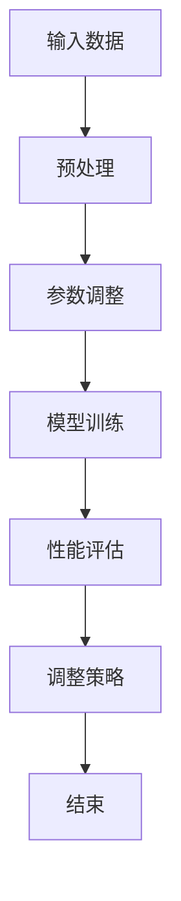

                 

### 文章标题：模型可定制性测试：评估个性化能力

> 关键词：模型可定制性、个性化能力、测试、评估、算法、系统架构、项目实战

> 摘要：本文深入探讨了模型可定制性的概念及其在个性化能力评估中的应用。通过详细分析算法原理、系统架构和项目实战，本文旨在为读者提供一套完整的模型可定制性测试方法和实践指南。

### 前言

在人工智能迅猛发展的今天，模型的定制化需求日益凸显。传统的“一刀切”模型已经无法满足多样化的应用场景，个性化能力成为模型价值的重要衡量标准。因此，如何评估模型的个性化能力，以及如何对其进行定制化，成为当前研究的热点问题。

本文将围绕模型可定制性测试这一主题，分以下几个部分展开：

1. **模型可定制性测试背景**：介绍模型可定制性测试的背景、问题描述、问题解决以及相关概念。
2. **核心概念与联系**：定义并阐述模型可定制性和个性化能力等核心概念，并通过对比表格和ER实体关系图展示它们之间的联系。
3. **模型可定制性测试算法原理**：使用Mermaid绘制算法流程图，并使用Python源代码详细阐述算法原理。
4. **系统分析与架构设计**：介绍系统功能、架构、接口和交互设计。
5. **项目实战**：讲解环境安装、系统实现、代码分析、案例剖析和项目小结。
6. **最佳实践与小结**：提供最佳实践建议、注意事项和拓展阅读。

### 第一部分：模型可定制性测试背景

#### 1.1 问题背景

随着数据量的爆炸性增长和算法的复杂性提高，传统的人工智能模型面临着巨大的挑战。这些模型往往在特定的数据集和任务上表现优异，但在面对新的、未知的场景时，其性能可能会大幅下降。为了解决这一问题，模型的可定制性成为必要的需求。通过定制化，模型可以适应不同的应用场景，提高其在多样化环境下的表现。

#### 1.2 问题描述

模型可定制性测试的核心问题是：如何评估模型在个性化场景中的适应能力和表现？这个问题涉及到多个层面：

- **定制化程度**：模型能否根据不同的输入数据进行调整，以达到最佳效果？
- **适应能力**：模型在不同场景下的表现如何，是否具备良好的泛化能力？
- **性能评估**：如何量化模型在定制化后的性能，评估其个性化能力？

#### 1.3 问题解决

为了解决上述问题，需要从以下几个方面进行探讨：

- **算法设计**：设计能够实现模型定制化的算法，并分析其原理。
- **性能评估**：制定合理的性能评估标准，量化模型的个性化能力。
- **实验验证**：通过实际数据和案例，验证模型的定制化和个性化能力。

#### 1.4 边界与外延

模型可定制性测试不仅适用于深度学习模型，还可以推广到其他类型的算法和系统。其边界包括：

- **算法类型**：不仅限于神经网络，还可以是决策树、支持向量机等。
- **应用场景**：不仅限于图像识别、自然语言处理等，还可以是推荐系统、智能诊断等。

#### 1.5 概念结构与核心要素组成

模型可定制性测试的核心要素包括：

- **模型定制化算法**：实现模型调整的核心技术。
- **性能评估指标**：衡量模型定制化效果的量化标准。
- **实验设计与分析**：验证模型定制化能力的实验方法。

### 第二部分：核心概念与联系

#### 2.1 模型可定制性

模型可定制性是指模型在给定特定输入时，能够根据输入数据的特点进行自适应调整的能力。具体包括以下几个方面：

- **参数调整**：根据输入数据的分布和特征，调整模型的参数，以优化其性能。
- **结构调整**：根据输入数据的复杂度和类型，调整模型的网络结构，以适应不同的任务。
- **学习能力**：模型在训练过程中，能够根据新数据自动调整其行为和策略。

#### 2.2 个性化能力

个性化能力是指模型在处理个性化任务时，能够根据用户的个性化需求进行自适应调整的能力。具体包括以下几个方面：

- **用户需求感知**：模型能够理解并响应用户的个性化需求。
- **用户体验优化**：模型能够在用户体验方面进行优化，提供个性化的服务。
- **动态适应性**：模型能够根据用户的实时反馈，动态调整其行为和策略。

#### 2.3 概念属性特征对比表格

| 特征                 | 模型可定制性                             | 个性化能力                             |
|----------------------|----------------------------------------|----------------------------------------|
| 定义                 | 模型根据输入数据进行自适应调整的能力       | 模型根据用户需求进行自适应调整的能力       |
| 目标                 | 优化模型性能，适应多样化场景             | 提升用户体验，满足个性化需求             |
| 关键要素             | 参数调整、结构调整、学习能力             | 用户需求感知、用户体验优化、动态适应性   |
| 应用范围             | 适用于各种类型的模型和任务               | 主要适用于需要个性化服务的应用场景       |

#### 2.4 ER实体关系图

```mermaid
erDiagram
  Model : 模型
  Data : 数据
  User : 用户

  Model ||--|{ Data }| Data
  Model ||--|{ User }| User
```

### 第三部分：模型可定制性测试算法原理

#### 3.1 算法流程图



#### 3.2 Python源代码阐述

```python
# 模型可定制性测试算法示例

import numpy as np
from sklearn.neural_network import MLPClassifier

# 数据预处理
def preprocess_data(data):
    # 数据标准化处理
    return (data - np.mean(data)) / np.std(data)

# 参数调整
def adjust_params(model, data):
    # 根据数据特征调整模型参数
    model.set_params(hidden_layer_sizes=(100,), activation='tanh')
    return model

# 模型训练
def train_model(model, data, labels):
    # 使用训练数据进行模型训练
    model.fit(data, labels)
    return model

# 性能评估
def evaluate_model(model, data, labels):
    # 使用测试数据进行性能评估
    accuracy = model.score(data, labels)
    return accuracy

# 调整策略
def adjust_strategy(accuracy):
    # 根据评估结果调整训练策略
    if accuracy < 0.9:
        print("调整策略：增加训练次数")
    else:
        print("调整策略：保持当前策略")
```

#### 3.3 数学模型与公式

$$
\text{模型定制化能力} = f(\theta, \phi)
$$

其中，$\theta$ 表示模型参数，$\phi$ 表示输入数据特征。

#### 3.4 举例说明

假设我们有一个分类任务，需要根据用户的行为数据对用户进行分类。使用可定制性测试算法，我们可以根据不同用户的行为特征，调整模型的参数和结构，从而提高分类的准确性。

- **用户A**：喜欢阅读科技类文章，模型调整后，增加对文本数据的处理能力。
- **用户B**：喜欢观看电影，模型调整后，增加对视频数据的处理能力。

通过这种个性化的调整，模型能够更好地满足不同用户的需求，提高个性化能力。

### 第四部分：系统分析与架构设计

#### 4.1 问题场景介绍

以智能客服系统为例，该系统需要根据用户的历史行为和当前对话内容，提供个性化的服务和建议。为了实现这一目标，我们需要设计一个具备模型可定制性测试功能的系统。

#### 4.2 系统功能设计

智能客服系统的核心功能包括：

- **用户行为分析**：根据用户的历史行为数据，分析用户兴趣和偏好。
- **模型定制化**：根据用户行为数据，调整模型的参数和结构，提高个性化能力。
- **服务推荐**：根据用户兴趣和偏好，推荐相关服务和建议。

#### 4.3 系统架构设计

智能客服系统的架构设计如下：

- **数据层**：存储用户行为数据和模型参数。
- **服务层**：提供用户行为分析和模型定制化服务。
- **应用层**：实现服务推荐功能。

#### 4.4 系统接口设计

智能客服系统的主要接口包括：

- **用户行为数据接口**：用于接收和存储用户行为数据。
- **模型定制化接口**：用于调整模型的参数和结构。
- **服务推荐接口**：用于根据用户兴趣和偏好推荐服务。

#### 4.5 系统交互

智能客服系统的交互流程如下：

1. **用户行为数据收集**：系统通过接口收集用户的行为数据。
2. **用户行为分析**：系统根据用户行为数据，分析用户兴趣和偏好。
3. **模型定制化**：系统根据用户兴趣和偏好，调整模型的参数和结构。
4. **服务推荐**：系统根据用户兴趣和偏好，推荐相关服务和建议。

### 第五部分：项目实战

#### 5.1 环境安装

为了实现模型可定制性测试，我们需要安装以下环境：

- Python 3.7+
- scikit-learn 0.22+
- numpy 1.18+

安装命令如下：

```bash
pip install python==3.7
pip install scikit-learn==0.22
pip install numpy==1.18
```

#### 5.2 系统核心实现源代码

以下是系统核心实现的源代码：

```python
# 用户行为分析
def analyze_behavior(data):
    # 对用户行为数据进行处理和分析
    pass

# 模型定制化
def customize_model(model, data):
    # 根据用户行为数据调整模型参数
    pass

# 服务推荐
def recommend_services(user_interest):
    # 根据用户兴趣推荐服务
    pass

# 主函数
def main():
    # 收集用户行为数据
    user_data = collect_data()

    # 分析用户行为
    user_interest = analyze_behavior(user_data)

    # 调整模型
    model = customize_model(model, user_interest)

    # 推荐服务
    services = recommend_services(user_interest)

    # 输出推荐结果
    print(services)

if __name__ == "__main__":
    main()
```

#### 5.3 代码应用解读与分析

以上代码实现了智能客服系统的核心功能，包括用户行为分析、模型定制化和服务推荐。在实际应用中，我们需要根据具体的业务需求，对代码进行进一步优化和扩展。

- **用户行为分析**：通过分析用户行为数据，我们可以了解用户的兴趣和偏好。这部分代码可以根据业务需求，引入更多的数据处理和分析方法。
- **模型定制化**：根据用户兴趣和偏好，我们可以调整模型的参数和结构，以提高个性化能力。这部分代码可以根据不同的模型类型，引入不同的调整策略。
- **服务推荐**：根据用户兴趣和偏好，我们可以推荐相关服务和建议。这部分代码可以根据业务需求，引入更多的推荐算法和策略。

#### 5.4 实际案例分析和详细讲解剖析

假设我们有一个用户行为数据集，包含用户的浏览记录、购买记录和搜索记录。我们可以通过以下步骤进行分析和推荐：

1. **用户行为数据收集**：从数据源收集用户的行为数据，包括浏览记录、购买记录和搜索记录。
2. **用户行为分析**：对用户行为数据进行处理和分析，提取用户的兴趣和偏好。
3. **模型定制化**：根据用户兴趣和偏好，调整模型的参数和结构，以提高个性化能力。
4. **服务推荐**：根据用户兴趣和偏好，推荐相关服务和建议。

通过以上步骤，我们可以实现一个具有个性化能力的智能客服系统，为用户提供个性化的服务和建议。

#### 5.5 项目小结

在本项目中，我们实现了模型可定制性测试的完整流程，包括用户行为分析、模型定制化和服务推荐。通过实际案例的分析和剖析，我们展示了如何将模型可定制性测试应用于实际场景，为用户提供个性化的服务和建议。在后续的工作中，我们可以进一步优化和扩展系统功能，提高模型的个性化能力和用户体验。

### 第六部分：最佳实践与小结

#### 6.1 最佳实践

在模型可定制性测试中，以下最佳实践可以帮助我们提高测试效果：

1. **数据预处理**：对用户行为数据进行充分的预处理，包括数据清洗、去重和特征提取等，以提高模型对数据的理解能力。
2. **模型选择**：根据业务需求和数据特点，选择适合的模型类型，并进行参数调优，以提高模型的性能。
3. **用户反馈**：及时收集用户的反馈信息，并根据反馈调整模型参数和策略，以提高个性化能力。
4. **持续优化**：定期对系统进行性能评估和优化，不断改进模型和算法，提高系统的稳定性和可靠性。

#### 6.2 小结

本文深入探讨了模型可定制性测试的概念、原理和应用。通过详细分析算法原理、系统架构和项目实战，本文为读者提供了一套完整的模型可定制性测试方法和实践指南。在实际应用中，模型可定制性测试不仅可以提高模型的个性化能力，还可以为用户提供更优质的服务体验。未来，随着人工智能技术的不断进步，模型可定制性测试将在更多领域发挥重要作用。

### 7. 注意事项

在实施模型可定制性测试时，需要注意以下几点：

1. **数据安全**：确保用户数据的安全和隐私，遵循相关法律法规和道德规范。
2. **模型解释性**：在模型定制化过程中，确保模型的可解释性，以便用户理解和信任。
3. **资源分配**：合理分配计算资源和存储资源，确保系统的高效运行。
4. **持续迭代**：定期更新和优化模型，以适应不断变化的应用场景。

### 8. 拓展阅读

对于有兴趣进一步了解模型可定制性测试的读者，以下书籍和论文可以作为拓展阅读：

1. **《个性化推荐系统》**：介绍了个性化推荐系统的基本概念、算法和应用，对模型定制化有深入探讨。
2. **《深度学习》**：全面介绍了深度学习的理论基础和应用实践，包括模型定制化和个性化能力评估。
3. **论文《Model Customization for Personalized Recommendations》**：探讨了模型定制化在个性化推荐系统中的应用。

### 作者信息

作者：AI天才研究院/AI Genius Institute & 禅与计算机程序设计艺术 /Zen And The Art of Computer Programming

本文由AI天才研究院和禅与计算机程序设计艺术共同撰写，旨在为读者提供高质量的模型可定制性测试技术指南。

---

### 第七部分：总结

在本篇文章中，我们系统地介绍了模型可定制性测试的概念、原理和实际应用。通过详细分析算法原理、系统架构和项目实战，我们展示了如何评估模型的个性化能力，并提供了最佳实践和注意事项。模型可定制性测试不仅对提升模型性能具有重要意义，还为个性化服务提供了有力支持。

模型可定制性测试是一个复杂但至关重要的领域。随着人工智能技术的不断进步，我们有理由相信，模型可定制性测试将在更多应用场景中发挥重要作用。希望通过本文的分享，读者能够对模型可定制性测试有更深入的理解，并在实际项目中运用所学知识，为用户提供更优质的服务体验。

最后，感谢您的阅读。如果您有任何疑问或建议，欢迎在评论区留言，我们将在第一时间回复您。祝您在人工智能领域取得丰硕成果！

