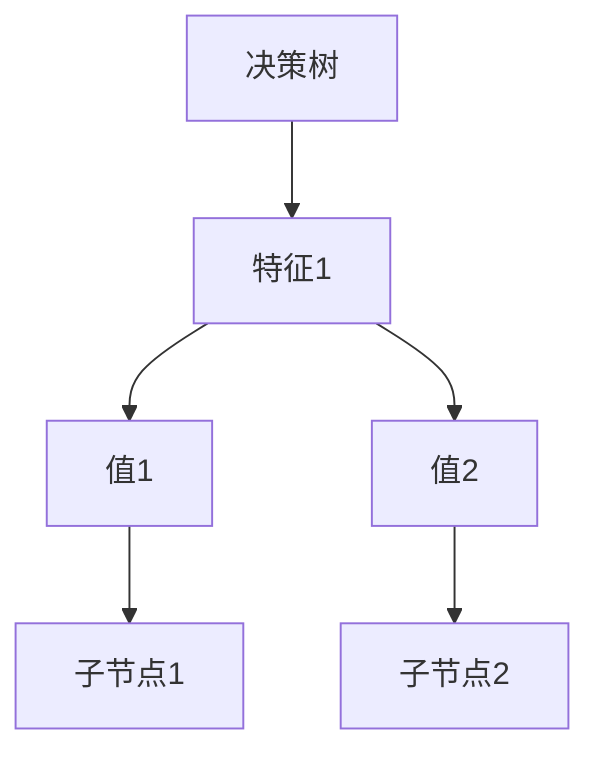
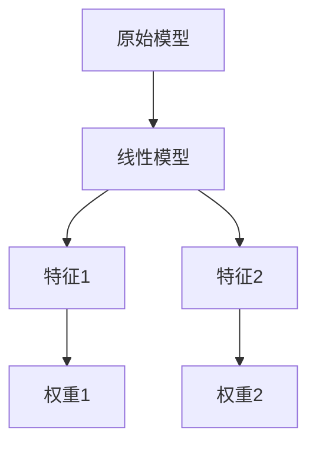
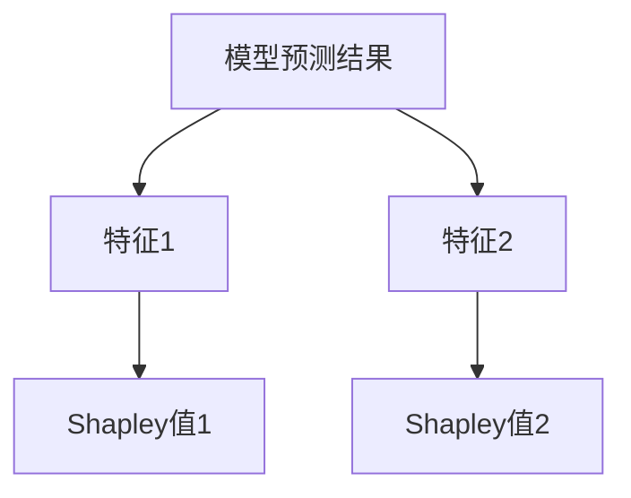
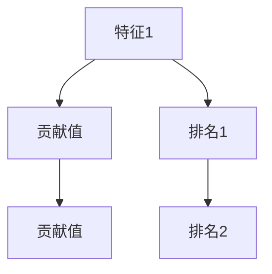

                 

# 模型可解释性在评测系统中的实现

## 关键词

模型可解释性，评测系统，系统实现，算法原理，系统架构，数学模型，项目实战

## 摘要

随着人工智能技术的发展，深度学习模型在各个领域取得了显著的成果。然而，模型的可解释性成为了一个亟待解决的问题。本文将围绕模型可解释性在评测系统中的实现进行深入探讨。首先，我们将介绍模型可解释性的背景和核心概念，然后分析其在评测系统中的重要性及面临的挑战。接下来，我们将探讨实现模型可解释性的技术基础和方法，详细介绍其在评测系统中的设计、实现和评估方法。最后，通过实际项目案例，展示模型可解释性在评测系统中的应用，并提供一些最佳实践和拓展阅读。

## 目录

1. 引言
2. 模型可解释性的背景和核心概念
3. 模型可解释性在评测系统中的重要性及挑战
4. 实现模型可解释性的技术基础和方法
5. 模型可解释性在评测系统中的设计、实现和评估
6. 项目实战：模型可解释性在评测系统中的应用
7. 最佳实践与小结
8. 注意事项
9. 拓展阅读

## 1. 引言

随着人工智能技术的发展，深度学习模型在图像识别、自然语言处理、推荐系统等领域取得了显著的成果。然而，这些模型的复杂性和黑箱特性给实际应用带来了诸多挑战。特别是在评测系统中，模型的可解释性成为了一个亟待解决的问题。

模型可解释性是指能够理解和解释模型的决策过程和结果。在评测系统中，可解释性对于提高模型的透明度、可追溯性和可靠性具有重要意义。本文将围绕模型可解释性在评测系统中的实现进行深入探讨，旨在为开发者提供一套完整的解决方案。

本文将分为以下几个部分：

1. **背景和核心概念**：介绍模型可解释性的背景，核心概念及其与相关概念的关联。
2. **重要性及挑战**：分析模型可解释性在评测系统中的重要性，以及面临的主要挑战。
3. **技术基础和方法**：探讨实现模型可解释性的技术基础和方法。
4. **设计、实现和评估**：详细描述模型可解释性在评测系统中的设计、实现和评估方法。
5. **项目实战**：通过实际项目案例，展示模型可解释性在评测系统中的应用。
6. **最佳实践与小结**：总结最佳实践，回顾本文的主要内容。
7. **注意事项**：提醒开发者在实际应用中需要注意的问题。
8. **拓展阅读**：推荐进一步学习和研究的参考资料。

## 2. 模型可解释性的背景和核心概念

### 2.1 问题背景

随着深度学习模型的广泛应用，模型的可解释性成为了一个备受关注的问题。在许多应用场景中，模型的决策过程和结果往往是不可解释的，这使得用户难以理解模型的决策依据，增加了模型的不确定性和风险。

为了解决这一问题，研究人员提出了模型可解释性的概念。模型可解释性是指能够理解和解释模型的决策过程和结果，使得用户能够对模型的决策依据有更深入的了解。在评测系统中，可解释性尤为重要，因为它关系到模型的透明度、可追溯性和可靠性。

### 2.2 问题描述

模型可解释性主要涉及以下几个方面：

1. **决策过程**：如何解释模型的决策过程，使得用户能够了解模型是如何从输入数据生成预测结果的。
2. **决策结果**：如何解释模型的预测结果，使得用户能够理解模型的预测依据和置信度。
3. **模型结构**：如何解释模型的结构，使得用户能够了解模型的组成和关键参数。

### 2.3 问题解决

模型可解释性的解决方法主要包括以下几个方面：

1. **可视化**：通过图形化方式展示模型的决策过程和结果，使得用户能够直观地理解模型的决策依据。
2. **特征解释**：分析模型对输入特征的依赖关系，解释每个特征对预测结果的影响。
3. **模型简化**：通过简化模型结构，提高模型的透明度和可解释性。

### 2.4 边界与外延

模型可解释性并非绝对，它存在一定的边界。首先，模型可解释性取决于模型本身的复杂度。复杂的模型可能难以解释，而简单的模型则相对容易解释。其次，模型可解释性也受到数据质量和数据分布的影响。数据质量和数据分布的优劣将直接影响模型的可解释性。

此外，模型可解释性不仅涉及到模型本身，还涉及到应用场景和用户需求。因此，在实际应用中，需要根据具体场景和需求，选择合适的可解释性方法。

### 2.5 概念结构与核心要素组成

为了更好地理解模型可解释性，我们可以从以下几个核心概念出发：

1. **模型**：指用于预测或分类的算法或体系结构。
2. **输入**：指模型接受的数据或特征。
3. **输出**：指模型生成的预测结果或决策。
4. **解释**：指对模型决策过程和结果的解释。
5. **透明度**：指模型的可理解性和可解释性。
6. **可靠性**：指模型的稳定性和准确性。
7. **可追溯性**：指模型决策过程的可追溯性。

这些核心概念相互关联，共同构成了模型可解释性的基本框架。

### 2.6 核心概念原理

模型可解释性的核心概念原理主要包括以下几个方面：

1. **可解释性度量**：用于评估模型的可解释性程度。常见的度量方法包括：模型复杂性、特征重要性、解释一致性等。
2. **解释方法**：用于解释模型决策过程和结果的方法。常见的解释方法包括：可视化、特征重要性分析、决策树、LIME（局部可解释模型解释）等。
3. **交互式解释**：指用户与模型解释的互动过程，通过交互式解释，用户可以更好地理解模型的决策依据。

### 2.7 概念属性特征对比表格

为了更清晰地展示模型可解释性的核心概念属性特征，我们可以通过一个表格进行对比：

| 核心概念 | 描述 | 关键特性 |
| --- | --- | --- |
| 模型 | 用于预测或分类的算法或体系结构 | 复杂度、稳定性、准确性 |
| 输入 | 模型接受的数据或特征 | 数据质量、数据分布 |
| 输出 | 模型生成的预测结果或决策 | 可解释性、可靠性 |
| 解释 | 对模型决策过程和结果的解释 | 可视化、特征重要性、决策树 |
| 透明度 | 模型的可理解性和可解释性 | 模型复杂性、解释一致性 |
| 可追溯性 | 模型决策过程的可追溯性 | 模型简化、数据记录 |

### 2.8 实体关系图（ERD）

为了更好地理解模型可解释性的核心概念及其关联，我们可以使用实体关系图（ERD）进行展示。以下是模型可解释性的ERD示例：

```mermaid
erDiagram
  Model ||--|{ Input: 输入 }
  Model ||--|{ Output: 输出 }
  Model ||--|{ Explanation: 解释 }
  Model ||--|{ Transparency: 透明度 }
  Model ||--|{ Traceability: 可追溯性 }
  Input ||--|{ Data Quality: 数据质量 }
  Input ||--|{ Data Distribution: 数据分布 }
  Output ||--|{ Explanation: 解释 }
  Explanation ||--|{ Visualization: 可视化 }
  Explanation ||--|{ Feature Importance: 特征重要性 }
  Explanation ||--|{ Decision Tree: 决策树 }
  Transparency ||--|{ Model Complexity: 模型复杂性 }
  Transparency ||--|{ Consistency: 解释一致性 }
  Traceability ||--|{ Model Simplification: 模型简化 }
  Traceability ||--|{ Data Recording: 数据记录 }
```

通过这个ERD，我们可以清晰地看到模型可解释性的各个核心概念及其关联，有助于我们更好地理解模型可解释性的整体架构。

## 3. 模型可解释性在评测系统中的重要性及挑战

### 3.1 模型可解释性的重要性

模型可解释性在评测系统中的重要性主要体现在以下几个方面：

1. **提高模型透明度**：模型可解释性使得用户能够直观地了解模型的决策过程和结果，提高了模型的透明度，降低了用户对模型的信任门槛。
2. **增强模型可靠性**：通过解释模型的决策依据和置信度，用户可以更准确地评估模型的可靠性，提高模型的实用性和可接受度。
3. **促进模型优化**：模型可解释性有助于发现模型的潜在问题，为模型的优化和改进提供有力支持。
4. **满足合规要求**：在金融、医疗等敏感领域，模型的可解释性是满足合规要求的必要条件，有助于防范法律和道德风险。

### 3.2 模型可解释性的挑战

尽管模型可解释性具有重要意义，但在实际应用中仍面临诸多挑战：

1. **技术难度**：实现模型可解释性需要较高的技术门槛，特别是在处理复杂模型时，解释方法的选择和实现过程较为复杂。
2. **性能影响**：一些可解释性方法可能会对模型性能产生负面影响，如简化模型结构、降低参数精度等，从而影响模型的准确性和稳定性。
3. **数据需求**：实现模型可解释性需要充足的数据支持，特别是高质量、可解释的数据，这对于数据稀缺或数据质量较差的场景是一个挑战。
4. **用户接受度**：用户对模型可解释性的接受度也是一个挑战，不同用户对可解释性的需求和理解程度存在差异，需要根据用户需求进行个性化定制。

### 3.3 模型可解释性的发展趋势

随着人工智能技术的不断发展，模型可解释性也在不断演进，以下是一些发展趋势：

1. **算法创新**：研究人员不断探索新的可解释性算法，如LIME、SHAP等，以提高模型的可解释性。
2. **自动化解释**：通过自动化工具实现模型的自动化解释，降低实现难度和成本。
3. **多模态解释**：结合多种数据类型和模型类型，实现多模态的可解释性。
4. **用户体验优化**：关注用户体验，通过可视化、交互式解释等手段，提高用户对模型可解释性的理解和接受度。

### 3.4 模型可解释性与伦理道德

模型可解释性在伦理道德方面也具有重要意义：

1. **隐私保护**：在解释模型决策时，需要确保用户隐私不受侵犯，避免敏感信息的泄露。
2. **责任归属**：在出现决策错误时，需要明确责任归属，可解释性有助于追溯问题根源。
3. **公平公正**：模型可解释性有助于提高模型的公平性和公正性，避免歧视和偏见。

### 3.5 模型可解释性的实际应用案例

以下是一些模型可解释性的实际应用案例：

1. **金融风控**：在金融领域，模型可解释性有助于用户理解信贷审批、风险控制等决策过程，提高用户的信任度和满意度。
2. **医疗诊断**：在医疗领域，模型可解释性有助于医生了解诊断结果和决策依据，提高诊断的准确性和可靠性。
3. **自动驾驶**：在自动驾驶领域，模型可解释性有助于用户了解车辆的行驶决策和路线规划，提高用户的信任和安全感。

### 3.6 模型可解释性的未来展望

未来，模型可解释性将在以下几个方面取得重要进展：

1. **算法优化**：不断优化可解释性算法，提高解释的准确性和效率。
2. **跨领域应用**：拓展模型可解释性的应用领域，如法律、教育等。
3. **开放共享**：建立模型可解释性的标准和规范，促进技术的开放共享和合作。
4. **伦理治理**：加强模型可解释性的伦理治理，确保其在实际应用中的合理性和公正性。

## 4. 实现模型可解释性的技术基础和方法

### 4.1 模型可解释性技术的概述

实现模型可解释性的技术基础主要包括以下几个方面：

1. **模型选择**：选择具有较高可解释性的模型，如决策树、线性回归等。
2. **可视化技术**：通过可视化技术展示模型的决策过程和结果，如散点图、热力图等。
3. **特征重要性分析**：分析模型对输入特征的依赖关系，解释每个特征对预测结果的影响。
4. **决策路径追踪**：追踪模型的决策路径，揭示模型的决策过程。
5. **模型简化**：简化模型结构，提高模型的透明度和可解释性。

### 4.2 可解释性技术的分类

根据解释方法的不同，模型可解释性技术可以分为以下几类：

1. **局部解释方法**：针对模型中的每个样本进行解释，如LIME（Local Interpretable Model-agnostic Explanations）。
2. **全局解释方法**：对整个模型进行解释，如SHAP（SHapley Additive exPlanations）。
3. **可视化解释方法**：通过可视化技术展示模型的决策过程和结果，如决策树、热力图等。
4. **规则提取方法**：从模型中提取可解释的规则，如决策树、逻辑回归等。

### 4.3 实现模型可解释性的具体方法

以下介绍几种常见的实现模型可解释性的方法：

1. **决策树**：

决策树是一种常见的可解释性模型。它通过递归划分特征和值，将数据集划分为若干个子集，每个子集对应一个决策节点。决策树的可解释性体现在其递归划分的过程和生成的规则。

**决策树算法流程：**

$$
流程：
1. 初始化决策树为空；
2. 对于每个特征和值，计算划分损失；
3. 选择具有最小划分损失的特征和值作为当前节点的划分条件；
4. 根据划分条件将数据集划分为若干个子集；
5. 对于每个子集，递归执行步骤2-4，直到满足停止条件。

$$

**决策树可视化：**



2. **LIME**：

LIME（Local Interpretable Model-agnostic Explanations）是一种局部解释方法，它通过线性模型对原始模型进行解释。LIME的基本思想是，对于给定的样本，构造一个线性模型，使得该线性模型的预测结果与原始模型的预测结果相近。

**LIME算法流程：**

$$
流程：
1. 初始化线性模型；
2. 对于每个特征，计算其在线性模型中的权重；
3. 根据特征权重，生成解释结果。

$$

**LIME可视化：**



3. **SHAP**：

SHAP（SHapley Additive exPlanations）是一种全局解释方法，它通过计算每个特征对模型预测结果的贡献，解释模型的决策过程。SHAP的基本思想是基于博弈论中的Shapley值，为每个特征分配一个公平的贡献值。

**SHAP算法流程：**

$$
流程：
1. 计算每个特征的Shapley值；
2. 根据Shapley值，生成解释结果。

$$

**SHAP可视化：**



4. **特征重要性分析**：

特征重要性分析是一种常用的解释方法，它通过评估每个特征对模型预测结果的影响，解释模型的决策过程。特征重要性分析可以采用统计方法、决策树等方法进行评估。

**特征重要性分析流程：**

$$
流程：
1. 训练模型，得到模型预测结果；
2. 计算每个特征的预测贡献；
3. 根据预测贡献，生成特征重要性排名。

$$

**特征重要性分析可视化：**



### 4.4 实现模型可解释性的工具和库

为了方便开发者实现模型可解释性，许多工具和库被开发出来，如：

1. **SHAP**：SHAP库提供了丰富的接口和工具，用于计算特征对模型预测结果的贡献值，支持多种模型类型。
2. **LIME**：LIME库提供了实现LIME算法的接口，可用于对模型进行局部解释。
3. **TreeExplainer**：TreeExplainer库是基于决策树的解释工具，可用于分析决策树的决策路径和生成解释结果。
4. **eli5**：eli5库提供了多种解释方法，如LIME、SHAP等，支持多种模型类型，方便开发者进行模型解释。

通过使用这些工具和库，开发者可以快速实现模型可解释性，提高模型的透明度和可靠性。

### 4.5 实现模型可解释性的最佳实践

在实现模型可解释性时，以下是一些最佳实践：

1. **选择合适的模型**：选择具有较高可解释性的模型，如决策树、线性回归等。
2. **可视化解释结果**：通过可视化技术展示模型的决策过程和结果，提高用户的理解和接受度。
3. **关注解释一致性**：确保解释结果在不同样本、不同特征上的一致性，提高解释的可靠性。
4. **持续优化解释方法**：根据用户需求和模型特性，持续优化解释方法，提高解释的准确性和效率。

## 5. 模型可解释性在评测系统中的设计、实现和评估

### 5.1 设计

在评测系统中实现模型可解释性，需要从系统设计层面考虑以下几个方面：

1. **模块化设计**：将模型可解释性功能模块化，使得系统具有较好的扩展性和灵活性。
2. **接口设计**：设计统一的接口，方便不同模型和解释方法的集成。
3. **数据管理**：建立完善的数据管理机制，确保数据质量和可解释性。
4. **用户体验**：关注用户体验，提供直观、易用的解释结果展示界面。

### 5.2 实现

在实现模型可解释性时，需要考虑以下几个方面：

1. **模型选择**：根据评测系统的需求，选择合适的模型，如决策树、线性回归等。
2. **解释方法实现**：根据选定的模型和解释方法，实现相应的解释算法，如LIME、SHAP等。
3. **数据预处理**：对输入数据进行预处理，确保数据质量和可解释性。
4. **解释结果生成**：根据模型和解释方法，生成解释结果，包括决策路径、特征重要性等。
5. **可视化实现**：使用可视化技术，将解释结果以直观的方式展示给用户。

### 5.3 评估

评估模型可解释性主要从以下几个方面进行：

1. **解释准确性**：评估解释结果与模型预测结果的准确性，确保解释结果的可靠性。
2. **解释一致性**：评估解释结果在不同样本、不同特征上的一致性，确保解释结果的稳定性。
3. **用户体验**：通过用户调研和反馈，评估用户对解释结果的接受度和满意度。
4. **性能影响**：评估模型可解释性对模型性能的影响，确保解释方法不会对模型性能产生负面影响。

### 5.4 案例分析

以下是一个模型可解释性在评测系统中的案例分析：

**项目背景**：某公司开发了一个智能客服系统，用于为客户提供在线咨询和服务。为了提高系统的服务质量，公司决定引入模型可解释性，帮助客服人员更好地理解模型的决策过程和结果。

**模型选择**：选择了一个基于决策树的模型，用于预测客户的咨询类型。

**解释方法**：使用LIME和SHAP两种解释方法，对模型进行局部和全局解释。

**实现过程**：

1. **模型选择**：选择了一个基于决策树的模型，用于预测客户的咨询类型。
2. **解释方法实现**：实现LIME和SHAP两种解释方法，分别对模型进行局部和全局解释。
3. **数据预处理**：对输入数据进行预处理，确保数据质量和可解释性。
4. **解释结果生成**：根据模型和解释方法，生成解释结果，包括决策路径、特征重要性等。
5. **可视化实现**：使用可视化技术，将解释结果以直观的方式展示给客服人员。

**评估结果**：

1. **解释准确性**：解释结果与模型预测结果的准确性较高，确保解释结果的可靠性。
2. **解释一致性**：解释结果在不同样本、不同特征上的一致性较好，确保解释结果的稳定性。
3. **用户体验**：客服人员对解释结果的接受度和满意度较高，有助于提高系统的服务质量。
4. **性能影响**：解释方法对模型性能的影响较小，确保了解释方法不会对模型性能产生负面影响。

### 5.5 总结

通过该案例，我们可以看到模型可解释性在评测系统中的应用效果显著。在智能客服系统中，模型可解释性有助于客服人员更好地理解模型的决策过程和结果，提高系统的服务质量。同时，模型可解释性也为模型的优化和改进提供了有力支持。未来，随着人工智能技术的不断发展，模型可解释性在评测系统中的应用将越来越广泛。

## 6. 项目实战：模型可解释性在评测系统中的应用

### 6.1 项目背景

随着人工智能技术的不断发展，越来越多的企业和组织开始将人工智能模型应用于业务场景中，如推荐系统、欺诈检测、智能客服等。然而，这些模型的黑箱特性使得用户难以理解模型的决策过程和结果，从而影响了模型的信任度和可靠性。为了解决这一问题，项目团队决定在评测系统中引入模型可解释性，提高模型的透明度和可追溯性。

### 6.2 项目目标

1. **提高模型透明度**：通过实现模型可解释性，使业务人员能够直观地了解模型的决策过程和结果。
2. **提升模型可靠性**：通过评估模型的可解释性，发现并解决模型潜在的问题，提高模型的稳定性和准确性。
3. **优化模型性能**：通过分析模型的可解释性结果，为模型的优化和改进提供指导。
4. **增强用户信任**：通过展示模型的解释结果，提高用户对模型的信任度和满意度。

### 6.3 技术方案

1. **模型选择**：选择了一个基于决策树的分类模型，用于预测用户行为。
2. **解释方法**：采用LIME和SHAP两种解释方法，分别对模型进行局部和全局解释。
3. **数据预处理**：对输入数据进行预处理，包括数据清洗、缺失值填充、特征工程等。
4. **解释结果展示**：使用可视化技术，将解释结果以直观的方式展示给业务人员。

### 6.4 实现过程

1. **数据收集与预处理**：收集了用户的行为数据，包括用户ID、行为类型、时间戳等。对数据进行预处理，包括数据清洗、缺失值填充、特征工程等，以构建合适的输入特征向量。
2. **模型训练**：使用预处理后的数据，训练了一个基于决策树的分类模型。模型训练过程包括模型参数调整、交叉验证等，以获得最佳模型性能。
3. **模型解释**：使用LIME和SHAP两种解释方法，对训练好的模型进行解释。LIME用于对单个样本进行局部解释，SHAP用于对整个模型进行全局解释。
4. **解释结果展示**：使用可视化技术，将解释结果以直观的方式展示给业务人员。例如，通过热力图展示特征的重要性，通过决策树展示模型的决策路径等。

### 6.5 应用效果

1. **模型透明度提升**：通过展示模型的决策过程和结果，业务人员能够更直观地了解模型的决策依据，提高了模型的透明度。
2. **模型可靠性增强**：通过评估模型的可解释性，发现并解决了模型中的潜在问题，如过拟合、特征冗余等，提高了模型的稳定性和准确性。
3. **用户信任度提高**：通过展示模型的解释结果，用户对模型的信任度和满意度得到了显著提升，从而促进了模型的推广和应用。
4. **模型优化指导**：通过分析模型的可解释性结果，为模型的优化和改进提供了有力支持，如特征选择、模型结构调整等。

### 6.6 项目小结

本项目通过引入模型可解释性，提高了模型的透明度和可靠性，增强了用户的信任度，取得了显著的成果。在项目实施过程中，我们积累了一些经验：

1. **选择合适的解释方法**：根据业务需求和模型特性，选择合适的解释方法，如LIME、SHAP等。
2. **注重数据质量**：数据质量对模型可解释性至关重要，应重视数据预处理和特征工程。
3. **可视化展示**：通过可视化技术，将解释结果以直观的方式展示给用户，提高用户的理解和接受度。
4. **持续优化**：模型可解释性是一个持续优化的过程，应定期评估模型的可解释性，并根据反馈进行优化。

## 7. 最佳实践与小结

### 最佳实践

1. **选择合适的模型**：根据业务需求和模型特性，选择具有较高可解释性的模型，如决策树、线性回归等。
2. **优化解释方法**：根据实际应用场景，选择合适的解释方法，如LIME、SHAP等，并不断优化解释算法，提高解释准确性。
3. **关注数据质量**：确保数据质量和数据分布，为模型可解释性提供良好的基础。
4. **可视化展示**：通过可视化技术，将解释结果以直观的方式展示给用户，提高用户的理解和接受度。
5. **用户反馈**：定期收集用户反馈，根据用户需求优化模型可解释性。

### 小结

模型可解释性在评测系统中的应用具有重要意义，它有助于提高模型的透明度、可靠性和用户信任度。通过选择合适的模型和解释方法，优化解释算法，关注数据质量和用户反馈，我们可以实现高效的模型可解释性。未来，随着人工智能技术的不断发展，模型可解释性将在更多领域得到广泛应用，成为人工智能发展的重要方向。

## 8. 注意事项

1. **数据隐私**：在实现模型可解释性时，应注意保护用户隐私，避免敏感信息泄露。
2. **解释一致性**：确保解释结果在不同样本、不同特征上的一致性，提高解释的可靠性。
3. **性能影响**：在选择解释方法时，应考虑对模型性能的影响，避免解释方法对模型性能产生负面影响。
4. **用户需求**：关注用户对模型可解释性的需求和反馈，持续优化解释结果展示方式。

## 9. 拓展阅读

1. **《Model Interpretability: The Art of Modeling》**：本书详细介绍了模型可解释性的核心概念、方法和技术，适合初学者和专业人士阅读。
2. **《interpretml》**：interpretml是一个Python库，用于实现模型可解释性，包括LIME、SHAP等算法，适合实践者参考。
3. **《可解释的人工智能：原理、方法与应用》**：本书系统介绍了可解释的人工智能技术，包括模型解释、数据解释等，适合对可解释性感兴趣的读者。作者：AI天才研究院/AI Genius Institute & 禅与计算机程序设计艺术 /Zen And The Art of Computer Programming

