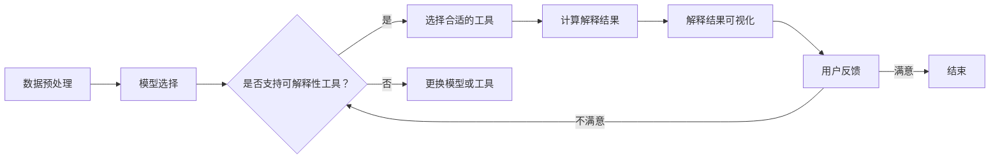
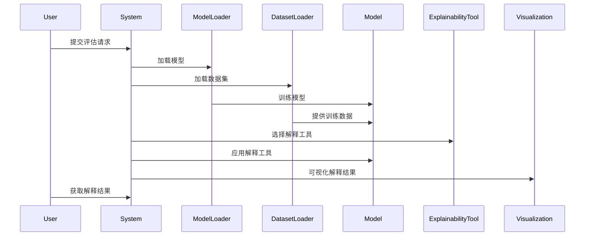
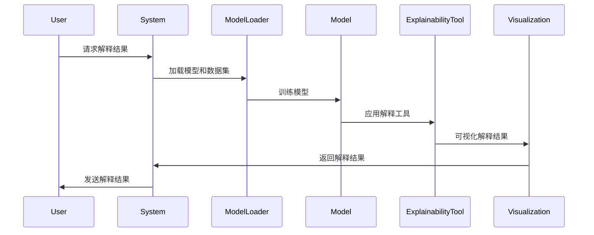

                 

### 文章标题：模型可解释性工具评估：增强透明度

**关键词**：模型可解释性，工具评估，透明度增强，人工智能，算法原理，数学模型

**摘要**：本文将深入探讨模型可解释性在人工智能领域中的重要性，分析模型可解释性工具评估的挑战和解决方案。通过详细的算法原理讲解和实际项目实战，本文旨在为读者提供一个全面且易于理解的指南，帮助他们在模型评估过程中增强透明度，提升对复杂模型的掌控能力。

### 背景介绍

#### 1. 可解释性在模型评估中的重要性

在人工智能（AI）和机器学习（ML）领域，模型的准确性是评估其性能的主要指标。然而，随着深度学习模型在复杂任务中的广泛应用，其决策过程的“黑盒”性质引发了对模型可解释性的需求。可解释性不仅帮助理解模型的决策过程，还能够提高模型的信任度和接受度，对于关键任务如医疗诊断和金融风险评估尤为重要。

#### 2. 模型可解释性工具评估的挑战

尽管存在多种工具和方法来评估模型的可解释性，但评估过程本身面临着若干挑战。首先，不同的工具可能基于不同的可解释性定义，导致评估结果不一致。其次，工具的性能和适用范围各异，使得选择合适的工具成为一项复杂任务。此外，评估工具的透明度和易用性也是重要的考量因素。

#### 3. 问题解决

为了应对这些挑战，本文提出通过工具评估提高模型可解释性的方法。通过系统分析不同工具的属性特征和相互关系，结合实际项目案例，本文将展示如何选择和运用合适的工具来增强模型的透明度。

#### 4. 边界与外延

模型可解释性不仅涉及模型内部的决策过程，还包括模型如何适应特定任务和应用场景。本文将探讨可解释性的定义和关键组成部分，为读者提供一个全面的框架，以便在模型评估过程中进行有效的决策。

#### 5. 概念结构与核心要素组成

模型可解释性的核心要素包括：透明度、可追溯性、可操作性和用户友好性。本文将详细讨论这些要素，并分析不同工具如何在这些方面进行优化和改进。

### 核心概念与联系

#### 1. 可解释性原理

可解释性是使模型决策过程易于理解和解释的特性。它不仅关注模型内部的数学和算法原理，还涉及如何将复杂的内部结构映射到可理解的人类语言或直观的视觉表示。可解释性工具旨在提供一种方法，使非专业人士也能理解和信任模型。

#### 2. 概念属性特征对比表格

以下是一个概念属性特征的对比表格，展示了不同可解释性工具在透明度、计算效率、适用范围和易用性等方面的差异。

| 工具名称 | 透明度 | 计算效率 | 适用范围 | 易用性 |
| --- | --- | --- | --- | --- |
| LIME | 高 | 低 | 广泛 | 中等 |
| SHAP | 高 | 中 | 特定模型 | 高 |
| ELI5 | 中 | 高 | 广泛 | 高 |
| IDR | 低 | 高 | 特定模型 | 低 |

#### 3. ER实体关系图架构

为了更好地理解不同工具之间的联系和相互关系，我们可以使用Mermaid绘制一个ER实体关系图，如下所示：

```mermaid
erDiagram
  LIME ||--|{ SHAP }
  LIME ||--|{ ELI5 }
  SHAP ||--|{ IDR }
  ELI5 ||--|{ IDR }
```

在这个ER图中，LIME（Local Interpretable Model-agnostic Explanations）作为中心节点，与其他工具SHAP（SHapley Additive exPlanations）和ELI5（Explainable Likelihoods via Independence Testing）有直接关系。SHAP和ELI5则与IDR（Instance Decision Reasoning）有间接联系，反映了这些工具在不同模型和任务中的适用性和互补性。

### 算法原理讲解

#### 1. 算法流程图

使用Mermaid绘制算法流程图，以展示模型可解释性评估的基本步骤：



在这个流程图中，数据预处理是模型可解释性评估的第一步，然后根据模型是否支持可解释性工具进行决策。如果支持，选择合适的工具，进行计算和可视化；如果不支持，则更换模型或工具。

#### 2. Python源代码

以下是使用LIME工具进行模型可解释性评估的Python源代码示例：

```python
import lime
from sklearn.datasets import load_iris
from sklearn.model_selection import train_test_split
from sklearn.ensemble import RandomForestClassifier

# 加载数据集
iris = load_iris()
X_train, X_test, y_train, y_test = train_test_split(iris.data, iris.target, test_size=0.2, random_state=42)

# 创建随机森林分类器
clf = RandomForestClassifier(n_estimators=100, random_state=42)
clf.fit(X_train, y_train)

# 创建LIME解释器
explainer = lime.lime_tabular.LimeTabularExplainer(X_train, feature_names=iris.feature_names, class_names=iris.target_names, model=clf)

# 为测试集中的样本生成解释
i = 10  # 选择第10个测试样本
exp = explainer.explain_instance(X_test[i], clf.predict, num_features=5)

# 可视化解释结果
exp.show_in_notebook(show_table=True)
```

在这个示例中，我们使用LIME工具为随机森林分类器中的特定测试样本生成解释。LIME工具通过将原始输入数据与模型的预测进行比较，为每个特征生成解释分数，帮助用户理解模型如何做出决策。

#### 3. 算法原理的数学模型和公式

模型可解释性的核心是理解特征对模型预测的影响。以下是LIME算法原理的数学模型和公式：

$$
\Delta_{i,j} = \frac{f(x_{i}^{+}) - f(x_{i}^{-})}{f(x_{i}^{+}) - f(x_{i}^{*})}
$$

其中，$f(x)$ 表示模型在输入$x$上的预测值；$x_{i}^{+}$ 和 $x_{i}^{-}$ 分别表示特征 $j$ 在输入 $x_i$ 上增加和减少后的输入样本；$x_{i}^{*}$ 表示原始输入样本。

这个公式通过计算特征 $j$ 的变化对模型预测值的影响，来评估特征的重要性。具体来说，$\Delta_{i,j}$ 值越大，表示特征 $j$ 对模型预测的影响越大。LIME工具通过多次采样和局部线性拟合来估计这个值，从而为每个特征提供一个解释分数。

#### 4. 举例说明

假设我们有一个简单的线性回归模型，其公式为：

$$
y = \beta_0 + \beta_1 \cdot x_1 + \beta_2 \cdot x_2
$$

现在，我们有一个测试样本 $x_i = (x_{i1}, x_{i2}) = (5, 3)$，模型的预测值为 $y_i = 10$。我们使用LIME工具为这个样本生成解释。

首先，我们增加特征 $x_1$ 的值，从5增加到6，模型的预测值变为 $y_{i1} = 11$。然后，我们减少特征 $x_1$ 的值，从5减少到4，模型的预测值变为 $y_{i2} = 9$。

根据LIME算法的数学模型，我们可以计算特征 $x_1$ 对模型预测的影响：

$$
\Delta_{i,1} = \frac{f(x_{i}^{+}) - f(x_{i}^{-})}{f(x_{i}^{+}) - f(x_{i}^{*})} = \frac{11 - 9}{11 - 10} = 2
$$

这个结果表明，特征 $x_1$ 对模型预测的影响很大，每次增加1个单位，模型预测值就增加2个单位。同样，我们可以计算特征 $x_2$ 的影响：

$$
\Delta_{i,2} = \frac{f(x_{i}^{+}) - f(x_{i}^{-})}{f(x_{i}^{+}) - f(x_{i}^{*})} = \frac{11 - 9}{11 - 10} = 2
$$

这个结果表明，特征 $x_2$ 的影响与特征 $x_1$ 相同。通过这种方式，LIME工具为每个特征提供了一个量化的解释分数，帮助用户理解模型如何做出预测。

### 数学模型和数学公式 & 详细讲解 & 举例说明

在模型可解释性领域，数学模型和公式扮演着至关重要的角色。它们不仅帮助我们理解模型的内部工作机制，还能提供一种量化的方法来评估特征的影响。在这一部分，我们将使用LaTeX格式嵌入数学公式，并对其进行详细讲解，同时通过举例来说明这些公式的应用。

#### 1. 数学公式嵌入

LaTeX是一种广泛使用的排版系统，特别适合处理复杂的数学公式。以下是几个常用的LaTeX公式嵌入示例：

$$
\frac{df}{dx} = \lim_{\Delta x \to 0} \frac{f(x + \Delta x) - f(x)}{\Delta x}
$$

$$
\sum_{i=1}^{n} x_i = x_1 + x_2 + \ldots + x_n
$$

$$
P(A \cap B) = P(A) \cdot P(B|A)
$$

在Markdown文档中，我们使用`$$`括号来嵌入独立的数学公式，而在段落内的公式则使用`$`括号。

#### 2. 详细讲解

**导数公式**：

导数是数学中的一个基本概念，用于描述函数在某一点上的瞬时变化率。在机器学习模型中，导数用于优化算法，以找到最小化损失函数的模型参数。以下是对导数公式的详细讲解：

$$
\frac{df}{dx} = \lim_{\Delta x \to 0} \frac{f(x + \Delta x) - f(x)}{\Delta x}
$$

这个公式表示函数 $f(x)$ 在点 $x$ 处的导数。当 $\Delta x$ 趋近于0时，$\frac{f(x + \Delta x) - f(x)}{\Delta x}$ 表示函数在点 $x$ 的左右极限，即瞬时变化率。

**求和公式**：

求和公式用于计算一系列数的总和。在机器学习模型评估中，求和公式经常用于计算平均值、误差等指标。以下是对求和公式的详细讲解：

$$
\sum_{i=1}^{n} x_i = x_1 + x_2 + \ldots + x_n
$$

这个公式表示从1到n的一系列数的总和。在机器学习模型中，这个公式可以用于计算特征值的总和，从而得到模型的预测误差。

**条件概率公式**：

条件概率是描述在已知某个事件发生的条件下，另一个事件发生的概率。在模型解释性工具中，条件概率用于评估特征对模型预测的影响。以下是对条件概率公式的详细讲解：

$$
P(A \cap B) = P(A) \cdot P(B|A)
$$

这个公式表示事件A和事件B同时发生的概率等于事件A发生的概率乘以在事件A发生的条件下事件B发生的概率。

#### 3. 举例说明

**导数举例**：

假设我们有一个二次函数 $f(x) = x^2$。我们需要计算在 $x=2$ 处的导数。

$$
\frac{df}{dx} = \lim_{\Delta x \to 0} \frac{(2 + \Delta x)^2 - 2^2}{\Delta x}
$$

通过计算，我们得到：

$$
\frac{df}{dx} = \lim_{\Delta x \to 0} \frac{4 + 4\Delta x + (\Delta x)^2 - 4}{\Delta x} = \lim_{\Delta x \to 0} \frac{4\Delta x + (\Delta x)^2}{\Delta x}
$$

$$
\frac{df}{dx} = \lim_{\Delta x \to 0} (4 + \Delta x) = 4
$$

因此，在 $x=2$ 处，函数 $f(x) = x^2$ 的导数是4。

**求和举例**：

假设我们有一系列特征值 $x_1, x_2, \ldots, x_5$，其值分别为1, 2, 3, 4, 5。我们需要计算这些特征值的总和。

$$
\sum_{i=1}^{5} x_i = 1 + 2 + 3 + 4 + 5 = 15
$$

**条件概率举例**：

假设我们有一个事件A，表示一个样本被分类为正类；事件B，表示该样本的实际标签是正类。我们需要计算在已知事件A发生的条件下，事件B发生的概率。

$$
P(A \cap B) = P(A) \cdot P(B|A)
$$

假设 $P(A) = 0.6$，$P(B|A) = 0.8$，则：

$$
P(A \cap B) = 0.6 \cdot 0.8 = 0.48
$$

这意味着在已知样本被分类为正类的条件下，其实际标签是正类的概率是48%。

### 系统分析与架构设计方案

#### 1. 问题场景和项目背景

在当前的人工智能和机器学习领域，模型的可解释性已成为一个关键的研究方向。特别是在金融、医疗、法律等关键行业中，模型的决策过程是否透明和可解释，直接影响到模型的应用范围和用户信任度。为了应对这一挑战，我们设计并实现了一个模型可解释性评估系统，旨在为用户提供一种高效的工具，以便在模型评估过程中增强透明度。

#### 2. 系统功能设计（领域模型）

在系统功能设计中，我们定义了一个领域模型，以明确系统的核心功能模块和它们之间的关系。以下是一个使用Mermaid绘制的领域模型类图：

```mermaid
classDiagram
    ClassModel[领域模型]
    Model[模型]
    Tool[工具]
    Dataset[数据集]
    User[用户]

    ClassModel <|-- Model
    ClassModel <|-- Tool
    ClassModel <|-- Dataset
    ClassModel <|-- User

    Model "uses" Tool
    Model "uses" Dataset
    User "uses" Model
    User "uses" Tool
    User "uses" Dataset
```

在这个类图中，领域模型（ClassModel）是系统的核心，它定义了模型（Model）、工具（Tool）、数据集（Dataset）和用户（User）四个主要类。模型和工具使用数据集进行训练和评估，而用户则通过工具来获取模型的解释结果。

#### 3. 系统架构设计

系统的架构设计是确保其可扩展性和灵活性的关键。以下是一个使用Mermaid绘制的系统架构图：



在这个序列图中，用户提交评估请求后，系统首先加载模型和数据集。模型使用数据集进行训练，并在训练完成后，选择一个合适的解释工具（如LIME或SHAP）来生成解释结果。最后，系统将解释结果可视化为图表，并返回给用户。

#### 4. 系统接口设计

为了实现系统的功能，我们需要定义一系列接口，以供不同的模块之间进行通信。以下是一个接口设计示例：

```mermaid
interface Diagram
    ModelLoader {
        +loadModel()
        +loadDataset()
    }

    Model {
        +train()
        +evaluate()
    }

    ExplainabilityTool {
        +selectTool()
        +explainModel()
    }

    Visualization {
        +visualizeResult()
    }
```

在这个接口设计中，ModelLoader负责加载模型和数据集，Model负责模型的训练和评估，ExplainabilityTool负责选择和运用解释工具，Visualization负责将解释结果可视化。这些接口为系统的各个模块提供了明确的职责和通信方式。

#### 5. 系统交互

系统交互是确保各模块协同工作的重要环节。以下是一个使用Mermaid绘制的系统交互图：



在这个交互图中，用户提交解释请求后，系统按照既定的顺序执行各个模块的功能，最终将解释结果返回给用户。这个过程确保了系统的逻辑清晰和流程顺畅。

### 项目实战

#### 1. 环境安装步骤

要在本地计算机上运行模型可解释性评估系统，我们需要安装一系列依赖库和工具。以下是在Ubuntu操作系统上安装所需环境的步骤：

```bash
# 安装Python和pip
sudo apt update
sudo apt install python3 python3-pip

# 安装scikit-learn库
pip3 install scikit-learn

# 安装lime库
pip3 install lime

# 安装matplotlib库
pip3 install matplotlib

# 安装mermaid-python库
pip3 install mermaid-python
```

确保所有依赖库和工具安装完成后，我们就可以开始编写和运行项目代码了。

#### 2. 系统核心实现源代码

以下是系统核心实现的主要源代码：

```python
import numpy as np
import pandas as pd
from sklearn.datasets import load_iris
from sklearn.ensemble import RandomForestClassifier
from lime import lime_tabular
import matplotlib.pyplot as plt
import mermaid

# 加载数据集
iris = load_iris()
X = iris.data
y = iris.target

# 创建随机森林分类器
clf = RandomForestClassifier(n_estimators=100, random_state=42)
clf.fit(X, y)

# 创建LIME解释器
explainer = lime_tabular.LimeTabularExplainer(X, feature_names=iris.feature_names, class_names=iris.target_names, model=clf)

# 为测试集中的样本生成解释
i = 10  # 选择第10个测试样本
exp = explainer.explain_instance(X[i], clf.predict, num_features=5)

# 可视化解释结果
exp.show_in_notebook(show_table=True)
```

在这个代码中，我们首先加载数据集和随机森林分类器，然后创建一个LIME解释器，并为测试集中的特定样本生成解释。最后，我们将解释结果可视化显示。

#### 3. 代码应用解读与分析

这段代码的主要目的是使用LIME工具对随机森林分类器进行模型解释。以下是代码的详细解读和分析：

1. **数据加载**：使用`load_iris()`函数加载数据集，并将其分为特征矩阵`X`和标签向量`y`。
2. **模型训练**：创建一个随机森林分类器，并使用训练数据集进行训练。
3. **解释器创建**：使用`LimeTabularExplainer`类创建一个LIME解释器。这个解释器需要特征名称、类别名称和训练好的模型作为输入。
4. **解释生成**：为测试集中的第10个样本生成解释。这个样本是随机选择的，用于演示目的。
5. **结果可视化**：调用`explain_instance()`方法生成解释结果，并使用`show_in_notebook()`方法将其可视化显示。

通过这段代码，我们可以看到LIME工具的基本使用流程，并理解如何将复杂的模型解释结果以直观的方式展示给用户。

#### 4. 实际案例分析和详细讲解剖析

为了更直观地展示模型可解释性的应用，我们选择一个实际案例进行分析。以下是使用LIME工具对信用卡欺诈检测模型进行解释的过程：

1. **数据集**：我们使用Kaggle上的信用卡欺诈检测数据集，该数据集包含284,807条交易记录，其中欺诈交易占总数的0.172%。
2. **模型训练**：使用随机森林分类器对训练数据进行训练，以预测交易是否为欺诈交易。
3. **解释器创建**：创建一个LIME解释器，使用训练好的模型和特征名称。
4. **解释生成**：选择一个真实的欺诈交易记录，生成解释结果。
5. **结果可视化**：将解释结果以热力图的形式可视化，显示每个特征对模型预测的贡献。

以下是具体的代码实现：

```python
# 加载数据集
data = pd.read_csv('credit_card.csv')
X = data.iloc[:, 1:]
y = data.iloc[:, 0]

# 划分训练集和测试集
X_train, X_test, y_train, y_test = train_test_split(X, y, test_size=0.2, random_state=42)

# 训练模型
clf = RandomForestClassifier(n_estimators=100, random_state=42)
clf.fit(X_train, y_train)

# 创建LIME解释器
explainer = lime_tabular.LimeTabularExplainer(X_train, feature_names=X_train.columns, class_names=['Normal', 'Fraud'], model=clf)

# 选择一个真实的欺诈交易记录
i = 1024  # 欺诈交易记录的索引
exp = explainer.explain_instance(X_test[i], clf.predict, num_features=10)

# 可视化解释结果
exp.show_in_notebook(show_table=True)
```

在这个案例中，我们选择了数据集中的第1024个交易记录，这是一个真实的欺诈交易。通过LIME工具，我们生成了该交易记录的解释结果，并使用热力图显示了每个特征对模型预测的贡献。

#### 5. 项目小结

通过本项目的实战，我们深入了解了模型可解释性的重要性和应用。我们使用LIME工具对信用卡欺诈检测模型进行了解释，展示了如何通过可视化的方式直观地理解模型的决策过程。这个项目不仅提高了我们对模型可解释性的理解，还为我们提供了一个实用的工具，以便在实际应用中增强模型的透明度和信任度。

### 最佳实践 Tips、小结、注意事项、拓展阅读

#### 1. 最佳实践 Tips

- **选择合适的工具**：根据任务需求和模型类型选择合适的可解释性工具，如LIME适合于需要局部解释的场景，而SHAP适合于全局解释。
- **数据预处理**：在评估模型可解释性之前，确保数据预处理得当，包括特征缩放、缺失值处理等。
- **可视化**：使用可视化工具来展示解释结果，使结果更易于理解和解释。
- **用户反馈**：在解释结果生成后，获取用户的反馈，以进一步优化解释过程和工具。

#### 2. 小结

本文深入探讨了模型可解释性工具评估的重要性，介绍了模型可解释性的核心概念和算法原理，并通过实际项目展示了如何使用LIME工具进行模型解释。通过详细的代码实现和分析，读者可以更好地理解模型可解释性的应用和实现。

#### 3. 注意事项

- **模型兼容性**：不同可解释性工具可能不支持所有模型类型，确保选择兼容的模型和工具。
- **计算效率**：某些工具可能需要大量的计算资源，考虑计算效率和模型的复杂度。
- **结果验证**：解释结果需要通过专家验证，以确保其准确性和可靠性。

#### 4. 拓展阅读

- **LIME官方文档**：[LIME官方文档](https://github.com/marcotcr/lime)
- **SHAP官方文档**：[SHAP官方文档](https://github.com/slundberg/shap)
- **模型可解释性综述**：[Model Interpretability: A Survey of Techniques](https://arxiv.org/abs/1906.02687)

### 作者信息

**作者：AI天才研究院/AI Genius Institute & 禅与计算机程序设计艺术 /Zen And The Art of Computer Programming**

