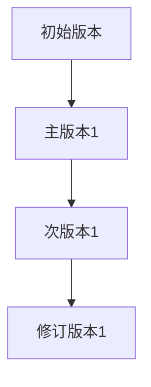
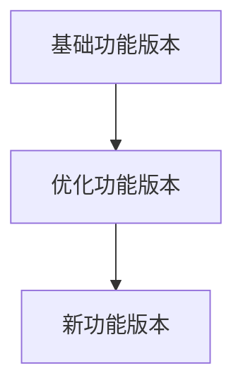

                 

### 模型版本控制的基本概念

#### 第1章: 模型版本控制概述

##### 1.1 问题背景

在当今快速发展的技术领域，尤其是人工智能和机器学习领域，模型的迭代和优化变得越来越频繁。模型版本控制作为管理这些迭代过程的重要手段，其重要性日益凸显。版本控制不仅仅是为了跟踪模型的变更，更是为了确保模型在不同迭代之间的稳定性和可追溯性。

首先，为什么要进行模型版本控制呢？原因主要有以下几点：

1. **持续迭代的需求**：在人工智能领域，模型常常需要根据新的数据和业务需求进行迭代和优化。如果不进行版本控制，将很难追踪每个版本的改进和变更，从而影响模型的稳定性和可靠性。

2. **团队协作的挑战**：在多个开发者和数据科学家协作开发模型时，版本控制能够有效避免因为代码或数据冲突导致的开发中断。

3. **测试和部署的复杂性**：随着模型的复杂性和规模的增加，测试和部署过程中的错误变得更为常见。版本控制可以帮助团队快速定位问题，回滚到先前的稳定版本。

4. **合规和审计的要求**：许多行业和领域对模型的变更和更新有严格的合规和审计要求。版本控制可以提供详细的变更记录，便于合规检查和问题追踪。

##### 1.1.2 模型版本控制的挑战

尽管模型版本控制的重要性不言而喻，但实施过程中也面临着一些挑战：

1. **版本管理的复杂性**：随着模型迭代次数的增加，版本管理的复杂性也显著上升。如何有效地组织和管理大量的版本数据，成为了一个难题。

2. **数据同步的挑战**：在分布式开发环境中，如何确保各个团队成员的版本数据同步，是一个技术难题。

3. **版本更新的风险**：每次模型更新都可能带来新的风险，例如性能下降、稳定性问题等。如何评估和降低这些风险，是版本控制的一个关键问题。

4. **文档和记录的维护**：为了确保模型的可追溯性和透明性，需要详细记录每个版本的变更原因、变更内容和测试结果。这需要大量的时间和精力。

##### 1.1.3 模型版本控制的重要性

模型版本控制不仅仅是技术问题，它对整个项目的成功有着深远的影响：

1. **可追溯性和透明性**：通过版本控制，可以清晰地追踪每个模型的迭代过程，使得团队成员对模型的变更有更清晰的认识。

2. **风险管理和故障恢复**：通过版本控制，可以在模型出现问题时快速回滚到先前的稳定版本，降低风险。

3. **团队协作和沟通**：版本控制提供了一个统一的平台，使得团队成员可以更加高效地协同工作，减少了沟通成本。

4. **合规性和审计**：良好的版本控制可以帮助企业在合规检查和审计中提供详细的变更记录，降低合规风险。

##### 1.2 问题描述

在了解了模型版本控制的重要性后，我们来看一下具体的问题描述：

- **模型迭代的需求**：随着数据和技术的发展，模型需要不断迭代和优化。如何有效地管理这些迭代过程，是一个关键问题。

- **模型版本管理的难点**：如何组织和管理大量的版本数据，确保数据同步和版本更新过程中的稳定性，是版本控制的难点。

- **版本更新的风险**：每次模型更新都可能带来新的风险，如何评估和降低这些风险，是版本控制的一个挑战。

##### 1.3 问题解决

为了解决上述问题，我们可以采取以下策略：

1. **选择合适的版本控制工具**：根据团队规模和开发环境选择合适的版本控制工具，如Git、SVN等。

2. **制定版本管理流程**：明确版本创建、发布和回滚的流程，确保团队成员对版本管理的统一理解。

3. **实施持续集成和持续交付**：通过自动化的构建、测试和部署，提高版本更新的效率和稳定性。

4. **详细记录和文档**：为了确保模型的可追溯性和透明性，详细记录每个版本的变更原因、变更内容和测试结果。

##### 1.4 边界与外延

在讨论模型版本控制时，我们还需要考虑其适用范围和与其他技术的联系：

1. **适用范围**：模型版本控制适用于人工智能和机器学习领域的所有模型，无论是深度学习模型、统计模型还是其他类型的模型。

2. **与其他技术的联系**：模型版本控制与数据管理、持续集成、持续交付等技术紧密相关，需要综合考虑和协调。

##### 1.5 概念结构与核心要素组成

模型版本控制的核心概念和要素包括：

1. **模型版本号**：用于标识模型的不同版本。版本号类型可以分为简单递增号、时间戳版本号和功能性版本号。

2. **模型状态管理**：对模型在不同版本间的状态进行跟踪和管理。状态管理方法包括版本库、持续集成和持续交付。

### 概念结构与核心要素组成

#### 1.5.1 模型版本号

**定义**: 模型版本号是对模型版本的唯一标识。

**属性**:
- **唯一性**: 每个版本号必须是唯一的，以确保能够准确地区分不同的版本。
- **递增性**: 版本号通常随着版本的递增而递增，以便于追踪和管理。
- **可读性**: 版本号应当具备一定的可读性，使得用户能够直观地理解版本号的含义。

**特征对比表格**:

| 版本号类型 | 特点 |
| :--: | :--: |
| 简单递增号 | 只能表示版本递增，无法区分模型的具体变化 |
| 时间戳版本号 | 结合时间戳，能表示模型的更新时间 |
| 功能性版本号 | 按功能模块划分，能清晰地展示模型的变更点 |

**简单递增号示例**: `V1.0`, `V1.1`, `V1.2`  
**时间戳版本号示例**: `V2023.04.01`, `V2023.04.02`  
**功能性版本号示例**: `V1.0-Base`, `V1.1-Optimization`, `V1.2-NewFeature`

#### 1.5.2 模型状态管理

**定义**: 模型状态管理是指对模型在不同版本间的状态进行跟踪和管理。

**属性**:
- **可追踪性**: 能够追踪每个版本的状态变化，便于问题排查和回溯。
- **可回溯性**: 可以回滚到先前的版本，确保模型的稳定性和可靠性。
- **可扩展性**: 支持不同规模和复杂度的模型管理，便于未来的扩展。

**特征对比表格**:

| 状态管理方法 | 特点 |
| :--: | :--: |
| 版本库 | 可以存储和管理多个版本的模型，但需手动维护 |
| 持续集成 | 可以自动化的构建、测试和部署模型，提高效率 |
| 持续交付 | 结合版本库和持续集成，可以实现自动化部署，降低风险 |

**版本库管理示例**: 
- 创建版本库: `git init`
- 添加模型文件: `git add model.py`
- 提交版本: `git commit -m "Update model with new features"`
- 推送版本到远程仓库: `git push origin main`

**持续集成示例**: 
- 构建模型: `python setup.py build`
- 测试模型: `python test_model.py`
- 部署模型: `python deploy_model.py`

**持续交付示例**: 
- 构建和测试: `make build-test`
- 部署: `make deploy`

通过上述概念和要素的介绍，我们可以更好地理解模型版本控制的基本结构和实施方法。在接下来的章节中，我们将深入探讨模型版本控制的具体方法和最佳实践。

### 第2章: 模型版本控制的基本方法

#### 2.1 版本控制工具概述

在模型版本控制中，选择合适的版本控制工具至关重要。目前，常用的版本控制工具有Git、SVN和Mercurial等。每种工具都有其独特的特点和适用场景。

##### 2.1.1 Git版本控制

Git是最流行的分布式版本控制工具之一，它由Linus Torvalds创建，旨在支持快速、高效和安全的分布式版本管理。Git的核心优势在于它的分布式特性，使得每个开发者都可以维护自己的本地仓库，从而提高了协作效率和操作灵活性。

**基本原理**:

Git通过一种基于内容的地址来唯一标识文件和提交。每个提交都包含一个指向父提交的指针、一个表示提交内容的哈希值以及一些附加信息，如提交者的姓名、电子邮件地址和提交说明。Git的核心功能包括：

- **创建仓库**: `git init`
- **添加文件**: `git add <file>`
- **提交变更**: `git commit -m "Commit message"`
- **查看历史**: `git log`
- **分支管理**: `git branch`、`git checkout`、`git merge`
- **合并请求**: `git pull request`

**核心功能**:

Git的核心功能使其成为模型版本控制的理想选择：

- **版本控制**: Git能够有效地跟踪和管理模型文件的不同版本，确保每个版本的可追溯性。
- **分支管理**: 支持多分支开发，使得开发者可以在不影响主分支的情况下独立开发和测试模型。
- **合并请求**: 提供了代码审查和合并的工具，确保模型更新的质量和稳定性。

**在模型版本控制中的应用**:

在模型版本控制中，Git的应用主要包括以下几个方面：

- **模型文件管理**: 使用Git来存储和管理模型的代码文件和数据文件。
- **迭代开发**: 开发者可以在各自的分支上独立迭代模型，并在完成测试后合并到主分支。
- **版本回滚**: 在模型更新出现问题时，可以通过Git快速回滚到先前的稳定版本。

**案例示例**:

假设有一个名为`model.py`的模型文件，开发者在不同的迭代过程中对其进行了多次修改。

1. **初始化仓库**: `git init`
2. **添加模型文件**: `git add model.py`
3. **提交变更**:
   - `git commit -m "Initial version of the model"`
   - `git commit -m "Add feature A"`
   - `git commit -m "Fix bug in feature A"`

4. **创建分支**: `git branch featureB`
5. **在分支上迭代模型**: `git checkout featureB`，进行新的功能开发。
6. **合并分支**: 将`featureB`分支合并到主分支，并解决合并冲突。

**总结**:

Git作为一个强大的分布式版本控制工具，能够满足模型版本控制的需求。它提供了丰富的功能，使得模型迭代和版本管理更加高效和可靠。

##### 2.1.2 其他版本控制工具简介

除了Git之外，还有其他一些常用的版本控制工具，如SVN和Mercurial。

**SVN**

SVN（Subversion）是一个集中式的版本控制工具，它由Apache软件基金会开发。与Git相比，SVN更加适合单分支开发模式，并且有着更加完善的权限控制和备份功能。

**基本原理**:

SVN通过中央仓库来存储和管理版本数据。每次提交变更时，都会将文件和数据同步到中央仓库。SVN的核心功能包括：

- **创建仓库**: `svn create repository`
- **添加文件**: `svn add <file>`
- **提交变更**: `svn commit -m "Commit message"`
- **查看历史**: `svn log`
- **分支管理**: `svn copy`、`svn merge`
- **权限控制**: `svn propset`、`svn propget`

**核心功能**:

- **中央仓库**: 所有变更都存储在中央仓库，便于集中管理和备份。
- **权限控制**: 可以对不同的用户和组设置不同的访问权限，确保版本数据的安全。

**在模型版本控制中的应用**:

- **单分支开发**: 适合单分支模式的项目，模型版本控制相对简单。
- **权限控制**: 在涉及多个团队和协作时，可以通过SVN的权限控制来管理版本数据的访问。

**案例示例**:

假设有一个名为`model.py`的模型文件，使用SVN进行版本控制。

1. **创建仓库**: `svn create repository`
2. **添加模型文件**: `svn add model.py`
3. **提交变更**: `svn commit -m "Initial version of the model"`
4. **创建分支**: `svn copy repository/branches/featureA`
5. **在分支上迭代模型**: `svn checkout repository/branches/featureA`
6. **合并分支**: `svn merge featureA repository/trunk`
7. **权限设置**: `svn propset svn:access=user:rw group:devs:rw repository`

**总结**:

SVN作为一个集中式的版本控制工具，适合单分支开发和需要严格权限控制的场景。它在某些特定场景下具有优势，但相较于Git，其分布式特性和灵活性稍显不足。

**Mercurial**

Mercurial（简称Hg）是另一个分布式版本控制工具，由Matt Mackall创建。与Git类似，Mercurial也支持分布式工作流程，但它在某些方面提供了更加简洁和直观的命令。

**基本原理**:

Mercurial通过分布式仓库来存储和管理版本数据。每个仓库都包含完整的版本历史，使得开发者可以在本地进行完整的版本控制操作。

**核心功能**:

- **创建仓库**: `hg init`
- **添加文件**: `hg add <file>`
- **提交变更**: `hg commit -m "Commit message"`
- **查看历史**: `hg log`
- **分支管理**: `hg branch`、`hg merge`
- **合并请求**: `hg pull request`

**核心功能**:

- **分布式仓库**: 支持完全分布式的版本控制，无需中央仓库。
- **简洁命令**: 提供了简洁的命令行界面，使得操作更加直观。

**在模型版本控制中的应用**:

- **分布式协作**: 适合在分布式团队中进行协作，无需中央仓库。
- **简洁操作**: 简洁的命令行界面使得版本控制操作更加便捷。

**案例示例**:

假设有一个名为`model.py`的模型文件，使用Mercurial进行版本控制。

1. **创建仓库**: `hg init`
2. **添加模型文件**: `hg add model.py`
3. **提交变更**: `hg commit -m "Initial version of the model"`
4. **创建分支**: `hg branch featureA`
5. **在分支上迭代模型**: `hg update featureA`
6. **合并分支**: `hg merge main`
7. **提交合并**: `hg commit -m "Merge featureA into main"`

**总结**:

Mercurial作为一个强大的分布式版本控制工具，适合在分布式团队中进行协作。它在某些方面与Git相似，但提供了更加简洁的操作界面。

综上所述，Git、SVN和Mercurial各有优势和适用场景。选择合适的版本控制工具，需要根据团队规模、开发模式和工作流程进行综合考虑。

#### 2.2 模型版本号的命名规则

在模型版本控制中，选择合适的版本号命名规则对于明确版本间的差异和便于追踪管理至关重要。常见的版本号命名规则包括递增版本号和基于功能的版本号。

##### 2.2.1 基本命名规则

**递增版本号**

递增版本号是最常见的版本号命名规则，其形式通常为 `VX.Y.Z`，其中：

- `X` 表示主版本号，通常在较大范围的功能性变动或重大架构调整时递增。
- `Y` 表示次版本号，通常在新增或修改功能时递增。
- `Z` 表示修订号，通常在修复bug或进行小范围优化时递增。

递增版本号的基本命名规则可以用数学公式表示为：
$$V_{i} = V_{0} + i$$
其中，$V_{0}$ 表示初始版本号，$i$ 表示迭代次数。

**基于功能的版本号**

基于功能的版本号命名规则更加详细地描述了每个版本的变更点，其形式通常为 `V1.0-Base`、`V1.1-Optimization` 或 `V1.2-NewFeature` 等。这种命名规则能够清晰地展示每个版本的主要功能和变更点。

基于功能的版本号命名规则可以用数学公式表示为：
$$V_{f} = F_{1}, F_{2}, ..., F_{n}$$
其中，$F_{1}, F_{2}, ..., F_{n}$ 分别表示每个版本的主要功能和变更点。

##### 2.2.2 命名规则示例

**递增版本号示例**

以下是一个递增版本号的应用示例：

1. 初始版本：`V1.0.0`
2. 次版本号递增：`V1.0.1`
3. 修订号递增：`V1.0.2`

**基于功能的版本号示例**

以下是一个基于功能的版本号的应用示例：

1. 基础功能版本：`V1.0-Base`
2. 优化功能版本：`V1.1-Optimization`
3. 新功能版本：`V1.2-NewFeature`

**Mermaid 流程图示例**

以下是一个基于递增版本号的Mermaid流程图示例：

以下是一个基于功能的版本号的Mermaid流程图示例：

通过合理的版本号命名规则，可以有效地管理和追踪模型的迭代过程，为模型的开发和维护提供清晰的指引。

### 第3章: 模型版本管理的最佳实践

#### 3.1 模型版本管理流程

模型版本管理是一个涉及多个环节的复杂过程，需要制定明确的流程以确保版本更新的有效性和安全性。以下是模型版本管理的基本流程：

##### 3.1.1 版本管理的基本步骤

1. **创建新版本**：

   - 在开始新的迭代之前，创建一个新的版本分支，用于独立的开发和测试。
   - 使用版本控制工具（如Git）创建新分支：`git checkout -b new-feature-branch`。

2. **开发与测试**：

   - 在新分支上进行模型的开发工作，包括算法改进、代码优化和新增功能等。
   - 完成开发后，进行全面的测试，确保模型的新版本能够正常运行，并且没有引入新的错误。

3. **代码审查**：

   - 提交代码到版本库，并进行代码审查，确保代码的质量和安全性。
   - 使用代码审查工具（如GitHub的拉取请求、GitLab的Merge Request等）进行代码审查。

4. **合并分支**：

   - 在代码审查通过后，将新分支合并到主分支或目标分支。
   - 使用版本控制工具进行合并操作：`git merge new-feature-branch`。

5. **部署新版本**：

   - 将新版本部署到生产环境或测试环境，进行最终的测试和验证。
   - 确保新版本的模型能够在实际场景中正常运行，满足业务需求。

6. **文档记录**：

   - 记录新版本的详细信息，包括变更日志、测试结果和部署情况等。
   - 更新项目的文档和记录，以便团队成员和其他相关方了解新版本的变更情况。

##### 3.1.2 版本管理策略

在模型版本管理中，可以采用不同的策略来确保版本更新的效率和安全性。以下是几种常见的版本管理策略：

1. **固定版本策略**：

   - 在特定的时间间隔（如每周或每月）发布新版本，确保版本发布的规律性。
   - 适用于需求稳定、变更频率较低的模型。

2. **持续集成策略**：

   - 在每次代码提交后自动进行集成、构建和测试，确保每次提交的代码都是可集成和可测试的。
   - 适用于变更频繁、需要快速响应的业务场景。

3. **持续交付策略**：

   - 结合持续集成和持续交付（CI/CD）流程，实现自动化部署，确保新版本能够快速、安全地发布到生产环境。
   - 适用于需要频繁发布新版本的高动态业务场景。

#### 3.2 版本控制工具的使用技巧

正确使用版本控制工具是进行有效版本管理的关键。以下是一些常见的版本控制工具使用技巧：

##### 3.2.1 Git操作技巧

1. **快速切换版本**：

   - 使用 `git checkout` 命令可以快速切换到指定版本或分支。
   - 例如，切换到特定提交：`git checkout <commit-hash>`。

2. **分支管理**：

   - 创建新分支：`git checkout -b new-branch`。
   - 切换分支：`git checkout new-branch`。
   - 合并分支：`git merge new-branch`。

3. **合并请求**：

   - 创建合并请求：在GitHub、GitLab等平台上，提交合并请求以合并分支。
   - 进行代码审查和讨论：确保合并的代码质量。

##### 3.2.2 SVN操作技巧

1. **版本库创建与删除**：

   - 创建版本库：`svnadmin create repository`。
   - 删除版本库：`svnadmin delete repository`。

2. **文件夹与文件的添加与删除**：

   - 添加文件或文件夹：`svn add <file>` 或 `svn add <folder>`。
   - 删除文件或文件夹：`svn delete <file>` 或 `svn delete <folder>`。

3. **更新与提交**：

   - 更新工作副本：`svn update`。
   - 提交变更：`svn commit -m "Commit message"`。

通过遵循这些最佳实践和操作技巧，可以有效地管理模型版本，确保版本更新的顺利和安全。

### 第三部分：模型版本控制的案例分析

在实际应用中，模型版本控制不仅是一个技术问题，更是一个涉及团队协作、风险管理、以及系统部署的复杂过程。以下通过两个案例，详细探讨模型版本控制的实施过程和效果。

#### 案例一：企业级AI模型开发与迭代

某大型企业正在开发一款基于深度学习的人工智能模型，用于预测客户流失率。该模型涉及大量的数据预处理、特征工程、模型训练和评估等步骤。为了确保模型开发过程的稳定性和可追溯性，团队采用了Git进行版本控制。

**1. 案例背景**

- **团队构成**：由数据科学家、软件工程师、产品经理和测试人员组成。
- **模型开发流程**：包括数据收集、数据处理、模型构建、模型训练和模型评估等步骤。
- **版本控制工具**：选择Git进行版本控制。

**2. 模型版本管理流程**

（1）**创建新版本**

每次开始一个新的迭代周期时，数据科学家会在Git中创建一个新的分支，例如 `feature/client-loss-forecast-v2`。

（2）**开发与测试**

数据科学家在新的分支上进行数据预处理、模型训练和测试。开发完成后，提交代码并进行单元测试，确保新版本的模型能够正常运行。

（3）**代码审查**

提交代码到Git仓库，团队成员进行代码审查。审查通过后，合并到主分支。

（4）**合并分支**

数据科学家将开发完成的分支合并到主分支，并解决可能出现的合并冲突。

（5）**部署新版本**

将新版本部署到测试环境，测试人员进行全面测试，确保模型的预测准确性和稳定性。

（6）**文档记录**

更新模型的文档，记录每个版本的变更点、测试结果和部署情况。

**3. 实施效果**

- **高效的团队协作**：Git的分支管理功能使得团队成员可以独立开发，减少代码冲突，提高工作效率。
- **可追溯的版本记录**：通过Git，团队可以清晰地追踪每个版本的变更，确保模型的迭代过程透明。
- **风险可控**：每次版本更新都经过代码审查和测试，降低了引入新错误的风险。

**4. 案例小结**

通过Git进行模型版本控制，企业成功实现了高效、稳定的模型迭代过程，为后续的业务应用提供了可靠的保障。

#### 案例二：开源深度学习项目的维护

某知名开源深度学习项目由全球开发者共同维护，项目包含大量的代码库、预训练模型和数据集。为了确保项目的稳定性和持续发展，项目团队采用了Git和Docker进行版本控制。

**1. 案例背景**

- **项目规模**：包含数十个代码库，数千个预训练模型，以及大量的数据集。
- **开发模式**：分布式开发，开发者来自全球各地。
- **版本控制工具**：选择Git进行代码版本控制，Docker用于容器化管理。

**2. 模型版本管理流程**

（1）**创建新版本**

开发者根据功能需求创建新的Git分支，例如 `feature/new-model-optimizer`。

（2）**开发与测试**

在新的分支上进行模型的优化、测试和调试。每次提交代码都会触发自动化测试，确保代码的质量。

（3）**代码审查**

提交代码到Git仓库，团队成员进行代码审查和讨论，确保合并的代码符合项目规范。

（4）**合并分支**

审查通过后，将新的功能合并到主分支，并更新Docker镜像。

（5）**容器化部署**

使用Docker将新版本的模型容器化，确保在不同环境下的运行一致性。

（6）**文档记录**

更新项目文档，记录每个版本的变更点、测试结果和部署情况。

**3. 实施效果**

- **高效的代码管理**：Git的分布式特性使得开发者可以独立工作，减少合并冲突，提高开发效率。
- **容器化的部署**：Docker确保了模型在不同环境下的可移植性，提高了部署的效率。
- **社区参与**：通过Git和Docker，项目团队能够更好地管理社区贡献，确保项目的持续发展。

**4. 案例小结**

通过Git和Docker的联合使用，开源深度学习项目实现了高效的版本控制和容器化部署，为全球开发者提供了一个稳定、可靠的开发平台。

### 案例总结

通过以上两个案例，我们可以看到模型版本控制在实际应用中的重要性。无论是企业级AI模型开发，还是开源深度学习项目的维护，有效的版本控制都能够提高团队协作效率，确保模型的稳定性和可追溯性。未来，随着AI技术的不断发展，模型版本控制将在更多领域发挥重要作用。

### 结语

模型版本控制是人工智能和机器学习领域不可或缺的一部分，它不仅确保了模型的稳定性和可追溯性，还大大提升了团队的协作效率。通过本文的详细讨论，我们了解了模型版本控制的基本概念、方法以及实施最佳实践。在实际应用中，选择合适的版本控制工具、制定合理的版本管理流程和策略，是成功实施模型版本控制的关键。

展望未来，随着人工智能技术的不断进步，模型版本控制的需求将更加迫切。我们可以预见，更智能、更自动化的版本控制工具和流程将不断涌现，为人工智能应用的开发和维护提供更加高效的解决方案。

在学习和应用模型版本控制的过程中，我们需要关注以下几点：

1. **持续学习和更新知识**：人工智能和机器学习领域的知识更新迅速，持续学习和更新相关技术是必要的。
2. **实践和验证**：理论知识和实践相结合，通过实际项目验证模型的迭代和版本管理效果。
3. **团队协作与沟通**：良好的团队协作和沟通是模型版本控制成功的关键，确保每个团队成员都明确版本管理的流程和目标。

让我们携手共同推动模型版本控制的发展，为人工智能技术的应用和创新提供坚实的保障。

### 作者信息

作者：AI天才研究院/AI Genius Institute & 禅与计算机程序设计艺术 /Zen And The Art of Computer Programming

AI天才研究院（AI Genius Institute）专注于人工智能领域的研究和开发，致力于推动AI技术的创新和应用。研究院的成员包括多位世界级人工智能专家、程序员和软件架构师，他们深耕于计算机科学、机器学习、深度学习和自然语言处理等领域。研究院的出版物《禅与计算机程序设计艺术》深受读者喜爱，为全球程序员提供了丰富的编程哲学和技术指导。

