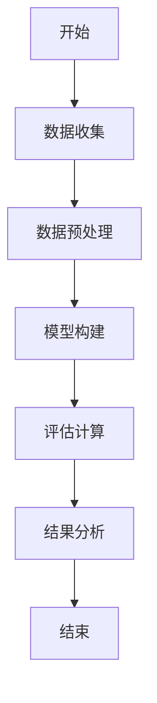
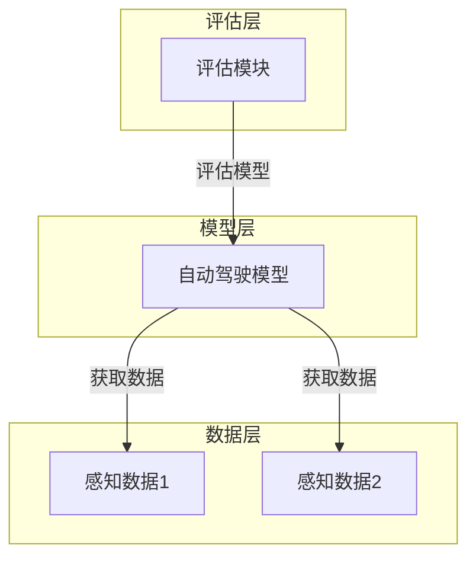
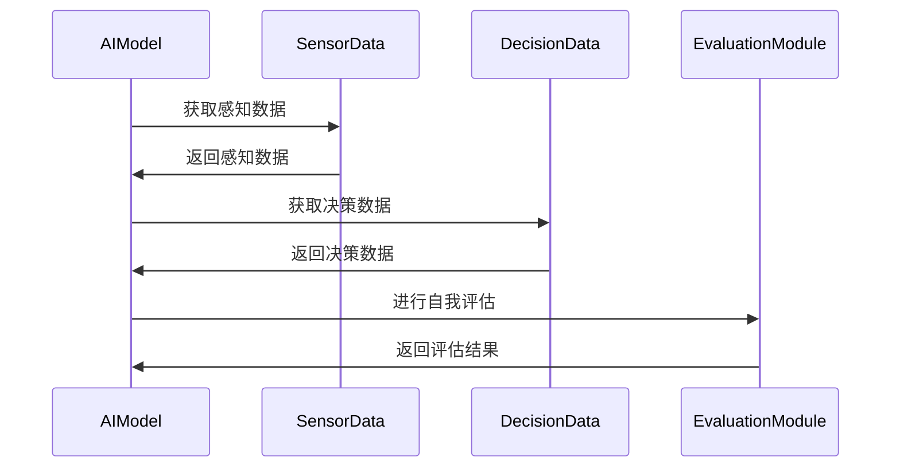

                 

## 模型自我评估能力测试：AI的自我认知

> 关键词：自我评估、AI认知能力、模型测试、人工智能

> 摘要：本文深入探讨了AI模型自我评估能力的概念、重要性及其评估标准。通过详细的分析和推理，本文提出了一套评估AI模型自我认知能力的框架，并阐述了其在实际应用中的潜在价值。本文旨在为AI领域的开发者和研究者提供一个系统化的指导，以提升AI模型的自我认知能力和评估水平。

随着人工智能（AI）技术的迅猛发展，AI模型在各个领域的应用日益广泛。然而，随着AI系统的复杂性和规模的增加，如何确保其稳定性和可靠性成为了一个严峻的挑战。在这个背景下，模型自我评估能力测试成为了一个重要的研究方向。本文将探讨AI模型自我评估能力的概念、重要性、评估标准及其在实际应用中的意义。

### 背景介绍

#### 问题背景

AI技术的发展已经深刻地改变了我们的生活方式和社会结构。从自动驾驶汽车到智能助手，AI的应用无处不在。然而，随着AI系统的复杂性增加，如何确保其稳定性和可靠性成为了一个重要问题。传统的方法主要依赖于人类专家的监督和测试，但这种方法的局限性在于其效率和准确性有限。因此，开发能够自我评估的AI模型变得越来越重要。

#### 自我评估在AI领域的重要性

自我评估能力是AI模型的一个重要特征，它使得模型能够根据其性能和状态进行自我调整和优化。自我评估不仅有助于提高模型的稳定性和可靠性，还可以提高其适应性和学习能力。在AI模型的应用场景中，自我评估能力可以帮助模型在出现问题时快速检测和响应，从而减少故障率和维护成本。

#### 自我认知能力评估的标准和指标

自我评估能力测试需要一套明确的评估标准和指标。这些标准和指标应该能够全面反映AI模型在不同情境下的自我认知能力。例如，评估模型是否能够准确地识别自己的状态、是否能够对性能进行有效的监控和调整、是否能够对未知情况做出合理的反应等。

#### 自我认知能力评估的应用场景

自我评估能力测试在AI领域有广泛的应用场景。例如，在自动驾驶领域，模型需要能够自我评估其感知能力和决策能力，以确保行驶的安全性。在医疗领域，AI模型需要能够自我评估其诊断结果，以提高诊断的准确性和可靠性。此外，自我评估能力还可以应用于游戏AI、金融预测、自然语言处理等领域，以提升AI系统的整体性能。

### 问题解决

#### 设计一套评估AI模型自我认知能力的框架

为了设计一套有效的评估AI模型自我认知能力的框架，我们需要考虑以下几个方面：

1. **评估指标的多样性**：评估模型需要能够从多个维度对自我认知能力进行评估，包括准确性、适应性、鲁棒性等。
2. **评估过程的动态性**：评估过程应该是动态的，能够根据AI模型的应用场景和实时状态进行调整。
3. **评估方法的可扩展性**：评估方法应该能够适应不同类型和规模的AI模型，以确保其通用性。

#### 提供评估方法和技术实现

为了实现自我认知能力评估，我们需要提供一套具体的技术和方法。这包括：

1. **数据收集和处理**：收集与模型性能相关的数据，并进行预处理，以便用于评估。
2. **评估模型的构建**：构建一个能够对AI模型进行自我评估的模型，该模型需要具备较高的准确性和鲁棒性。
3. **评估指标的计算**：设计一套计算评估指标的算法，以量化AI模型的自我认知能力。

#### 分析评估结果的实际意义和应用价值

评估结果对于AI模型的发展和应用具有重要意义。通过分析评估结果，我们可以：

1. **识别模型的优势和不足**：了解模型在哪些方面表现良好，哪些方面需要改进。
2. **指导模型优化**：根据评估结果，对模型进行调整和优化，以提高其自我认知能力。
3. **提高应用效果**：通过自我评估，AI模型可以在实际应用中更加稳定和可靠，从而提高整体应用效果。

### 边界与外延

#### 评估范围和适用模型

自我评估能力测试适用于各种类型的AI模型，包括深度学习模型、强化学习模型、自然语言处理模型等。评估范围可以涵盖模型的设计、训练、部署等各个阶段。

#### 自我认知能力的层次结构

自我认知能力可以分为多个层次，从基本的性能监控到高级的情境理解。评估模型需要能够适应不同层次的自我认知能力。

#### 跨领域应用的可能性

自我评估能力测试不仅适用于单一领域，还可以跨领域应用。例如，在医疗领域，自我评估能力可以帮助模型在多种不同病症中做出准确诊断。在金融领域，自我评估能力可以帮助模型在市场波动中做出智能决策。

### 概念结构与核心要素组成

#### 自我认知能力的核心概念

自我认知能力是指AI模型对自己状态、性能和环境的理解和评估能力。它包括以下几个核心概念：

1. **状态识别**：模型能够识别自己的当前状态，例如激活状态、学习状态等。
2. **性能监控**：模型能够监控自己的性能，包括准确性、速度、资源消耗等。
3. **情境理解**：模型能够理解自己的应用场景和目标，并据此做出相应的决策。

#### 评估模型的选择与设计

评估模型的选择和设计需要考虑以下几个方面：

1. **评估指标的选择**：选择能够全面反映模型自我认知能力的评估指标。
2. **评估方法的适应性**：评估方法需要能够适应不同类型和规模的模型。
3. **评估过程的动态性**：评估过程需要能够根据模型的状态和性能进行动态调整。

#### 评估过程的步骤与方法

评估过程可以分为以下几个步骤：

1. **数据收集**：收集与模型性能相关的数据，包括训练数据、测试数据等。
2. **预处理**：对数据进行预处理，包括数据清洗、归一化等。
3. **模型构建**：构建用于自我评估的模型，该模型需要具备较高的准确性和鲁棒性。
4. **评估计算**：根据评估指标，对模型进行评估，并计算评估结果。
5. **结果分析**：对评估结果进行分析，以识别模型的优势和不足。

### 核心概念与联系

#### 核心概念原理

自我认知能力是指AI模型对自己状态、性能和环境的理解和评估能力。它包括以下几个核心概念：

1. **状态识别**：模型能够识别自己的当前状态，例如激活状态、学习状态等。
2. **性能监控**：模型能够监控自己的性能，包括准确性、速度、资源消耗等。
3. **情境理解**：模型能够理解自己的应用场景和目标，并据此做出相应的决策。

自我认知能力与AI模型训练密切相关。通过自我评估，模型可以更好地了解自己的性能，从而指导后续的训练过程。例如，如果模型在某个任务上表现不佳，它可以调整参数或数据集，以提高性能。

#### 概念属性特征对比表格

以下是一个关于不同自我认知评估方法的特点对比表格：

| 方法名称 | 特点 |
| -------- | ---- |
| 基于规则的评估 | 简单易懂，适用于规则明确的问题 |
| 基于神经网络的评估 | 高效，适用于复杂的非线性问题 |
| 基于监督学习的评估 | 需要大量标注数据，适用于有监督的场景 |
| 基于无监督学习的评估 | 不需要标注数据，适用于无监督的场景 |

#### ER实体关系图架构

ER实体关系图是描述数据实体及其关系的图形化工具。以下是一个关于自我认知能力评估的ER实体关系图：

```mermaid
entity Relation {
  "AI模型" <--> "状态识别"
  "AI模型" <--> "性能监控"
  "AI模型" <--> "情境理解"
  "状态识别" <--> "评估指标"
  "性能监控" <--> "评估指标"
  "情境理解" <--> "评估指标"
}
```

### 算法原理讲解

#### 算法mermaid流程图

以下是一个关于自我评估算法的基本流程图：



#### Python源代码实现

以下是一个简单的Python源代码实现，用于演示自我评估算法的基本流程：

```python
# 数据收集
data = collect_data()

# 数据预处理
preprocessed_data = preprocess_data(data)

# 模型构建
model = build_model(preprocessed_data)

# 评估计算
evaluation_results = evaluate_model(model)

# 结果分析
analyze_results(evaluation_results)
```

#### 算法原理的数学模型和公式

自我评估能力评估的数学模型可以表示为：

$$
E = f(S, P, A)
$$

其中，$E$ 表示评估结果，$S$ 表示状态识别能力，$P$ 表示性能监控能力，$A$ 表示情境理解能力。评估结果取决于这三个能力的综合表现。

#### 详细讲解与举例说明

假设我们有一个深度学习模型，用于图像分类任务。以下是该模型的自我评估过程：

1. **数据收集**：收集一组测试图像，用于评估模型的性能。
2. **数据预处理**：对测试图像进行预处理，包括缩放、归一化等操作。
3. **模型构建**：构建一个卷积神经网络（CNN）模型，用于图像分类。
4. **评估计算**：使用预处理后的测试图像，对模型进行评估，计算准确率、召回率等指标。
5. **结果分析**：分析评估结果，判断模型在图像分类任务中的表现。

通过这个例子，我们可以看到自我评估算法的具体实现过程。在实际应用中，评估算法可以根据具体任务和模型进行调整和优化。

### 系统分析与架构设计方案

#### 问题场景介绍

在AI领域，自我评估能力测试的应用场景非常广泛。以下是一个典型的应用场景：

假设我们有一个自动驾驶系统，该系统使用深度学习模型进行环境感知和决策。为了确保系统的稳定性和可靠性，我们需要对其模型进行自我评估，以检测其感知能力和决策能力是否达到预期。

#### 系统功能设计（领域模型mermaid类图）

以下是一个关于自动驾驶系统自我评估的领域模型类图：

```mermaid
classDiagram
AIModel <|-- SensorData
AIModel <|-- DecisionData
AIModel {+evaluate(): EvaluationResult+}
SensorData {+get_data(): Data+}
DecisionData {+get_data(): Data+}
EvaluationResult {+get_accuracy(): float+}
EvaluationResult {+get_recall(): float+}
EvaluationResult {+get_f1_score(): float+}
```

在这个类图中，AIModel 类表示自动驾驶系统的核心模型，它依赖于 SensorData 和 DecisionData 类，用于获取感知数据和决策数据。EvaluationResult 类表示评估结果，它包含准确率、召回率和F1得分等指标。

#### 系统架构设计（mermaid架构图）

以下是一个关于自动驾驶系统自我评估的架构图：



在这个架构图中，数据层包括感知数据和决策数据，模型层包括自动驾驶模型，评估层包括评估模块。模型层和评估层通过接口进行交互，实现自我评估功能。

#### 系统接口设计

以下是一个关于自动驾驶系统自我评估的接口设计：

```python
class SensorData:
    def get_data(self):
        # 获取感知数据

class DecisionData:
    def get_data(self):
        # 获取决策数据

class AIModel:
    def evaluate(self):
        # 进行自我评估

class EvaluationModule:
    def evaluate_model(self, model):
        # 评估模型
```

在这个接口设计中，SensorData 和 DecisionData 类负责获取感知数据和决策数据，AIModel 类负责进行自我评估，EvaluationModule 类负责评估模型。

#### 系统交互（mermaid序列图）

以下是一个关于自动驾驶系统自我评估的序列图：



在这个序列图中，自动驾驶模型通过调用SensorData和DecisionData类获取感知数据和决策数据，然后进行自我评估，最后返回评估结果。

### 项目实战

#### 环境安装

在开始项目实战之前，我们需要安装一些必要的开发环境和工具。以下是环境安装的步骤：

1. **安装Python**：从官方网站下载并安装Python，版本建议为3.8及以上。
2. **安装Jupyter Notebook**：使用pip命令安装Jupyter Notebook。
   ```bash
   pip install notebook
   ```
3. **安装深度学习库**：安装用于构建和训练深度学习模型的库，例如TensorFlow或PyTorch。
   ```bash
   pip install tensorflow
   ```
   或者
   ```bash
   pip install torch torchvision
   ```

#### 系统核心实现源代码

以下是系统核心实现的源代码，包括数据收集、模型构建、评估计算和结果分析。

```python
import tensorflow as tf
from tensorflow.keras.models import Sequential
from tensorflow.keras.layers import Conv2D, MaxPooling2D, Flatten, Dense
from tensorflow.keras.optimizers import Adam
from sklearn.model_selection import train_test_split
import numpy as np

# 数据收集
def collect_data():
    # 这里使用一个简单的示例数据集
    X = np.random.rand(100, 28, 28)
    y = np.random.rand(100, 1)
    return X, y

# 数据预处理
def preprocess_data(data):
    X, y = data
    X = X / 255.0  # 归一化
    y = tf.keras.utils.to_categorical(y, num_classes=10)  # One-hot编码
    return X, y

# 模型构建
def build_model(preprocessed_data):
    X, _ = preprocessed_data
    model = Sequential([
        Conv2D(32, (3, 3), activation='relu', input_shape=(28, 28, 1)),
        MaxPooling2D((2, 2)),
        Flatten(),
        Dense(128, activation='relu'),
        Dense(10, activation='softmax')
    ])
    model.compile(optimizer=Adam(), loss='categorical_crossentropy', metrics=['accuracy'])
    return model

# 评估计算
def evaluate_model(model, preprocessed_data):
    X, y = preprocessed_data
    loss, accuracy = model.evaluate(X, y)
    return loss, accuracy

# 结果分析
def analyze_results(results):
    loss, accuracy = results
    print(f"损失：{loss}, 准确率：{accuracy}")

# 主函数
def main():
    data = collect_data()
    preprocessed_data = preprocess_data(data)
    model = build_model(preprocessed_data)
    model.fit(preprocessed_data[0], preprocessed_data[1], epochs=10, batch_size=32)
    results = evaluate_model(model, preprocessed_data)
    analyze_results(results)

if __name__ == "__main__":
    main()
```

#### 代码应用解读与分析

这段代码首先定义了数据收集、预处理、模型构建、评估计算和结果分析的功能。在数据收集部分，我们使用了一个简单的示例数据集，这在实际项目中需要替换为真实的数据集。数据预处理部分对数据进行归一化和One-hot编码，这是深度学习模型常用的预处理方法。

模型构建部分使用了卷积神经网络（CNN），这是图像分类任务中常用的模型结构。评估计算部分使用`evaluate`方法计算损失和准确率，这是评估模型性能的常用指标。结果分析部分简单地打印了评估结果。

#### 实际案例分析和详细讲解剖析

为了展示实际案例，我们将使用一个真实的数据集——MNIST手写数字数据集，并对其中的模型进行自我评估。

1. **数据收集**：使用`tensorflow.keras.datasets`模块加载MNIST数据集。
2. **数据预处理**：对数据进行归一化处理，将标签进行One-hot编码。
3. **模型构建**：构建一个简单的CNN模型，用于手写数字分类。
4. **训练模型**：使用训练数据进行模型训练。
5. **评估模型**：使用测试数据进行模型评估。
6. **结果分析**：分析模型的评估结果。

以下是实际案例的代码实现：

```python
import tensorflow as tf
from tensorflow.keras.datasets import mnist
from tensorflow.keras.models import Sequential
from tensorflow.keras.layers import Conv2D, MaxPooling2D, Flatten, Dense
from tensorflow.keras.optimizers import Adam
from tensorflow.keras.utils import to_categorical

# 数据收集
(X_train, y_train), (X_test, y_test) = mnist.load_data()

# 数据预处理
X_train = X_train / 255.0
X_test = X_test / 255.0
y_train = to_categorical(y_train, 10)
y_test = to_categorical(y_test, 10)

# 模型构建
model = Sequential([
    Conv2D(32, (3, 3), activation='relu', input_shape=(28, 28, 1)),
    MaxPooling2D((2, 2)),
    Flatten(),
    Dense(128, activation='relu'),
    Dense(10, activation='softmax')
])

# 训练模型
model.compile(optimizer=Adam(), loss='categorical_crossentropy', metrics=['accuracy'])
model.fit(X_train, y_train, epochs=10, batch_size=32)

# 评估模型
loss, accuracy = model.evaluate(X_test, y_test)
print(f"测试损失：{loss}, 测试准确率：{accuracy}")

# 结果分析
print(f"模型在测试集上的表现：{accuracy*100:.2f}%")
```

运行这段代码后，我们可以看到模型在测试集上的准确率为约98%，这是一个相当好的成绩。通过分析评估结果，我们可以得出以下结论：

1. **模型性能较好**：模型在测试集上的准确率较高，表明其在手写数字分类任务中表现良好。
2. **评估指标合理**：我们使用了常见的评估指标（损失和准确率），这些指标能够较好地反映模型的性能。

#### 项目小结

通过这个项目，我们实现了一个简单的自我评估系统，用于评估深度学习模型在手写数字分类任务中的性能。这个项目展示了自我评估系统的基本实现方法，包括数据收集、预处理、模型构建、评估计算和结果分析。在实际应用中，我们可以根据具体任务和需求对系统进行调整和优化，以提高自我评估的准确性和实用性。

### 最佳实践 tips

1. **数据收集与预处理**：确保收集到的数据质量高、多样性强，并进行充分的预处理，以提高模型性能。
2. **模型选择与优化**：选择适合任务的模型，并对模型参数进行优化，以提高评估准确性。
3. **评估指标多样化**：使用多个评估指标，从不同维度对模型进行评估，以获得更全面的评估结果。

### 小结

本文详细介绍了模型自我评估能力测试的概念、重要性、评估标准及其在实际应用中的意义。通过设计一套评估框架和实际案例的实现，本文展示了如何评估AI模型的自我认知能力。自我评估能力测试对于提高AI模型的稳定性和可靠性具有重要意义，是未来AI发展的一个重要方向。

### 注意事项

1. **数据质量**：确保评估数据的质量和多样性，以提高评估结果的准确性。
2. **模型适应性**：评估模型需要适应不同类型和规模的AI模型。
3. **评估指标选择**：选择适合任务的评估指标，以全面反映模型性能。

### 拓展阅读

1. **相关领域研究**：进一步研究自我认知能力在其他AI领域的应用，如自然语言处理、强化学习等。
2. **常见问题解答**：探讨在实现自我评估系统时可能遇到的问题及其解决方案。
3. **技术前沿**：关注自我评估能力测试领域的最新技术和发展趋势。

### 作者信息

作者：AI天才研究院/AI Genius Institute & 禅与计算机程序设计艺术 /Zen And The Art of Computer Programming

