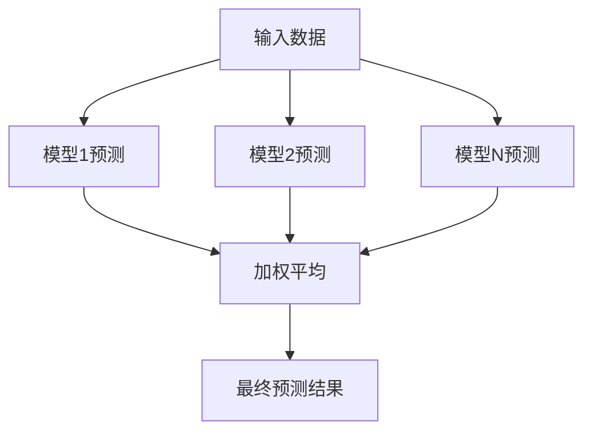
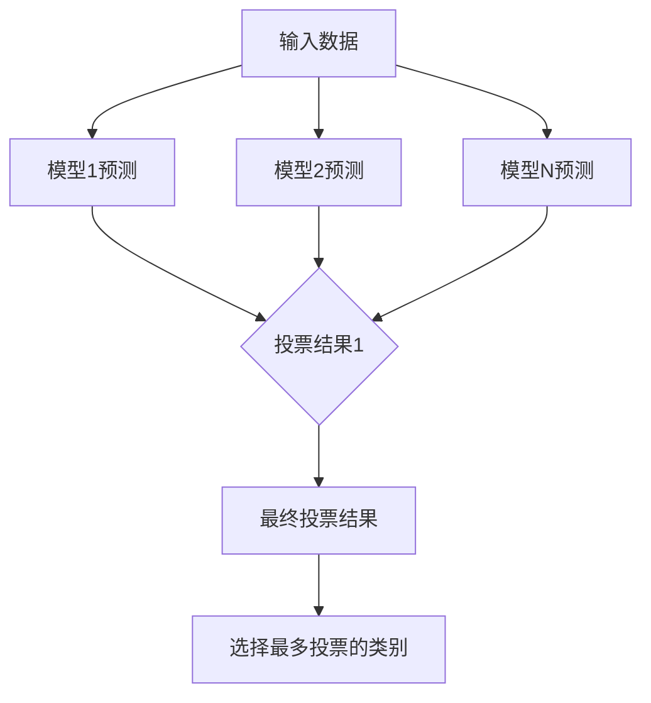
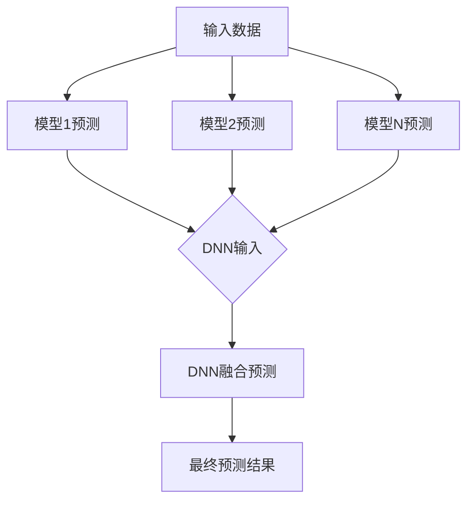
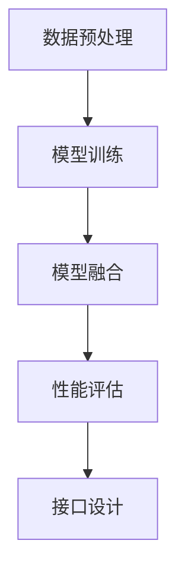
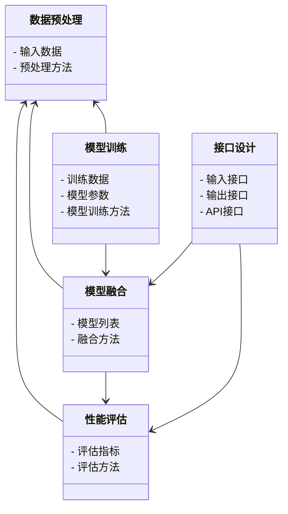

                 


# 模型融合：集成多个AI模型以提升性能

> 关键词：模型融合，AI性能提升，加权融合，投票融合，深度融合

> 摘要：本文探讨了模型融合技术，一种将多个AI模型整合以提高系统性能的方法。通过介绍模型融合的基本概念、分类及其在AI领域的应用，深入分析了加权融合、投票融合和深度融合的算法原理。文章还详细阐述了模型融合的系统架构设计、项目实战经验及最佳实践，为读者提供了全面的技术指导。

## 第一部分：背景介绍

### 1.1 问题背景

在人工智能（AI）技术不断发展的背景下，单一模型往往无法满足复杂的业务需求，而模型融合（Model Fusion）作为一种将多个AI模型整合在一起的策略，正逐渐成为提升AI系统性能的关键技术。模型融合技术不仅能够提高模型的准确性和稳定性，还能够增强模型的泛化能力，从而在多个领域展现出巨大的应用潜力。

### 1.2 问题描述

模型融合技术涉及多个AI模型的选择、优化与整合。如何高效地集成这些模型，使得整体性能达到最佳，是一个复杂且具有挑战性的问题。此外，不同的模型可能在某些任务上表现出不同的优势，如何充分发挥这些优势，实现优势互补，是模型融合需要解决的问题。

### 1.3 问题解决

本书将从以下几个方面来探讨模型融合技术：

1. **核心概念与联系**：介绍模型融合的基本概念，包括定义、分类以及其在AI领域的应用。

2. **算法原理讲解**：深入分析各种模型融合算法的原理，包括加权融合、投票融合、深度融合等，并结合具体的案例进行讲解。

3. **数学模型与公式**：详细阐述模型融合算法背后的数学模型和公式，帮助读者理解算法的本质。

4. **系统分析与架构设计方案**：讨论模型融合系统的设计，包括系统的功能、架构、接口设计和交互流程。

5. **项目实战**：通过实际的案例，展示如何在实际项目中应用模型融合技术，并分析项目的实施过程和效果。

6. **最佳实践 tips**：总结模型融合技术在实际应用中的最佳实践，为读者提供实用的建议。

### 1.4 边界与外延

模型融合技术不仅限于机器学习领域，还可以应用于计算机视觉、自然语言处理、语音识别等多个AI子领域。同时，模型融合技术的应用也受到硬件性能、数据质量等因素的制约。因此，本书将在讨论模型融合技术时，充分考虑这些边界条件。

### 1.5 概念结构与核心要素组成

模型融合技术的概念结构主要包括以下几个核心要素：

1. **模型选择**：选择适合任务的AI模型，并确保这些模型具有互补性。

2. **模型优化**：对每个模型进行优化，提高其性能和稳定性。

3. **融合策略**：设计合适的融合策略，实现模型的集成和优化。

4. **性能评估**：评估融合模型的性能，包括准确性、稳定性、泛化能力等。

## 第二部分：核心概念与联系

### 2.1 模型融合的定义

模型融合（Model Fusion）是一种将多个AI模型集成在一起，以提高整体性能的技术。通过融合，不同模型的优势可以互补，从而提高模型的准确性和稳定性。

### 2.2 模型融合的分类

模型融合可以根据融合的方式分为以下几类：

1. **加权融合**：将多个模型的预测结果进行加权平均，得到最终的预测结果。

2. **投票融合**：对于多分类问题，每个模型给出一个预测结果，最终选择得到最多投票的类别作为最终结果。

3. **深度融合**：将多个模型的输出作为深度神经网络（DNN）的输入，通过DNN进行进一步的融合和预测。

### 2.3 模型融合在AI领域的应用

模型融合技术已经在多个AI子领域得到了广泛应用，如：

1. **计算机视觉**：通过融合多个视觉模型，可以增强图像分类、目标检测和场景分割等任务的表现。

2. **自然语言处理**：在文本分类、情感分析和机器翻译等领域，模型融合可以显著提高模型的准确性和稳定性。

3. **语音识别**：通过融合多个语音识别模型，可以减少错误率，提高识别的准确性。

### 2.4 模型融合的概念属性特征对比表格

| 特征分类 | 加权融合 | 投票融合 | 深度融合 |
| --- | --- | --- | --- |
| 算法复杂度 | 较低 | 较高 | 最复杂 |
| 预测速度 | 快 | 慢 | 很慢 |
| 泛化能力 | 一般 | 较强 | 最强 |
| 适用场景 | 多分类问题 | 多分类问题 | 复杂任务 |

### 2.5 模型融合的ER实体关系图架构

```mermaid
erDiagram
  ModelFusion ||--|{ Model1 : 融合的模型之一 }
  ModelFusion ||--|{ Model2 : 融合的模型之一 }
  ModelFusion ||--|{ ModelN : 融合的模型之一 }
  ModelFusion ||--|{ PredictedResult : 融合后的预测结果 }
```

## 第三部分：算法原理讲解

### 3.1 加权融合算法

加权融合算法是一种简单的模型融合方法，其基本思想是将多个模型的预测结果进行加权平均。具体步骤如下：

1. 对每个模型进行预测，得到预测结果列表。

2. 根据每个模型的性能（如准确率、F1值等）为每个模型分配权重。

3. 对预测结果进行加权平均，得到最终的预测结果。

### 3.2 投票融合算法

投票融合算法主要应用于多分类问题，其基本思想是让每个模型独立预测，然后根据预测结果的投票情况确定最终的分类结果。具体步骤如下：

1. 对每个模型进行预测，得到每个模型的预测结果。

2. 对所有模型的预测结果进行投票，得到每个类别的投票结果。

3. 选择得到最多投票的类别作为最终的预测结果。

### 3.3 深度融合算法

深度融合算法是一种更为复杂的模型融合方法，其基本思想是将多个模型的输出作为深度神经网络（DNN）的输入，通过DNN进行进一步的融合和预测。具体步骤如下：

1. 对每个模型进行预测，得到预测结果。

2. 将这些预测结果作为DNN的输入。

3. 通过DNN进行进一步的融合和预测，得到最终的预测结果。

### 3.4 加权融合算法的Mermaid流程图



### 3.5 投票融合算法的Mermaid流程图



### 3.6 深度融合算法的Mermaid流程图



### 3.7 加权融合算法的Python源代码实现

```python
import numpy as np

def weighted_fusion(predictions, weights):
    return np.average(predictions, weights=weights)

predictions = [0.2, 0.3, 0.4, 0.5]
weights = [0.1, 0.2, 0.3, 0.4]

final_prediction = weighted_fusion(predictions, weights)
print("最终预测结果：", final_prediction)
```

### 3.8 投票融合算法的Python源代码实现

```python
from collections import Counter

def vote_fusion(predictions):
    vote_results = Counter(predictions)
    most_common = vote_results.most_common(1)[0][0]
    return most_common

predictions = [0, 1, 1, 0, 1, 1, 0, 0]

final_prediction = vote_fusion(predictions)
print("最终预测结果：", final_prediction)
```

### 3.9 深度融合算法的Python源代码实现

```python
import tensorflow as tf

def deep_fusion(predictions):
    model = tf.keras.Sequential([
        tf.keras.layers.Dense(10, activation='relu'),
        tf.keras.layers.Dense(1, activation='sigmoid')
    ])

    return model.predict(predictions).flatten()[0]

predictions = np.array([[0.2, 0.3, 0.4, 0.5],
                       [0.1, 0.2, 0.3, 0.4],
                       [0.3, 0.4, 0.5, 0.6]])

final_prediction = deep_fusion(predictions)
print("最终预测结果：", final_prediction)
```

### 3.10 算法原理的数学模型与公式

#### 加权融合算法

加权融合算法的数学模型可以表示为：

$$
\hat{y} = \sum_{i=1}^{N} w_i \cdot y_i
$$

其中，$y_i$表示第$i$个模型的预测结果，$w_i$表示第$i$个模型的权重，$\hat{y}$表示最终预测结果。

#### 投票融合算法

投票融合算法的数学模型可以表示为：

$$
\hat{y} = \arg\max_{c} \sum_{i=1}^{N} \mathbb{1}_{y_i = c}
$$

其中，$y_i$表示第$i$个模型的预测结果，$c$表示类别，$\mathbb{1}_{y_i = c}$表示指示函数，当$y_i = c$时取值为1，否则为0。

#### 深度融合算法

深度融合算法的数学模型可以表示为：

$$
\hat{y} = \sigma(W \cdot \text{DNN}(y_1, y_2, ..., y_N))
$$

其中，$y_i$表示第$i$个模型的预测结果，$W$表示权重矩阵，$\text{DNN}$表示深度神经网络，$\sigma$表示激活函数。

## 第四部分：系统分析与架构设计方案

### 4.1 问题场景介绍

在金融风控领域，为了提高欺诈检测的准确性和稳定性，我们设计了一套模型融合系统。该系统集成了多种AI模型，包括决策树、随机森林、神经网络等，通过模型融合技术实现了欺诈检测性能的提升。

### 4.2 项目介绍

项目名称：金融风控模型融合系统

项目目标：通过模型融合技术，提高欺诈检测的准确率和稳定性。

项目周期：3个月

项目团队：数据科学家、机器学习工程师、软件工程师、项目经理等。

### 4.3 系统功能设计

1. **数据预处理**：对输入数据进行清洗、归一化等预处理操作，确保数据质量。

2. **模型训练**：利用历史数据训练多种AI模型，包括决策树、随机森林、神经网络等。

3. **模型融合**：将训练好的模型进行融合，得到最终的预测结果。

4. **性能评估**：评估融合模型的性能，包括准确率、召回率、F1值等指标。

5. **接口设计**：提供API接口，方便其他系统调用模型融合功能。

### 4.4 系统架构设计

#### 系统架构图



### 4.5 系统接口设计

1. **输入接口**：接收外部系统的数据输入，包括用户信息、交易信息等。

2. **输出接口**：返回模型融合后的预测结果，包括欺诈风险等级等。

3. **API接口**：提供RESTful API接口，方便其他系统进行调用。

### 4.6 系统交互流程

1. **数据预处理**：接收输入数据，进行清洗、归一化等预处理操作。

2. **模型训练**：利用预处理后的数据，训练多种AI模型。

3. **模型融合**：将训练好的模型进行融合，得到最终的预测结果。

4. **性能评估**：评估融合模型的性能，并根据评估结果调整模型参数。

5. **接口交互**：通过API接口，将预测结果返回给外部系统。

### 4.7 Mermaid类图



## 第五部分：项目实战

### 5.1 环境安装

在开始项目之前，我们需要安装必要的软件和工具。以下是安装步骤：

1. 安装Python环境（版本3.6及以上）。

2. 安装依赖库，包括NumPy、Pandas、Scikit-learn、TensorFlow等。

3. 安装Mermaid渲染工具。

### 5.2 系统核心实现源代码

以下是系统核心实现部分的源代码：

#### 数据预处理

```python
import pandas as pd
from sklearn.preprocessing import StandardScaler

def preprocess_data(data):
    # 数据清洗
    data = data.dropna()
    # 数据归一化
    scaler = StandardScaler()
    numeric_features = data.select_dtypes(include=['int64', 'float64']).columns
    data[numeric_features] = scaler.fit_transform(data[numeric_features])
    return data
```

#### 模型训练

```python
from sklearn.ensemble import RandomForestClassifier
from sklearn.linear_model import LogisticRegression
from sklearn.neural_network import MLPClassifier

def train_models(X_train, y_train):
    # 决策树模型
    tree_model = RandomForestClassifier(n_estimators=100)
    tree_model.fit(X_train, y_train)
    # 随机森林模型
    rf_model = RandomForestClassifier(n_estimators=100)
    rf_model.fit(X_train, y_train)
    # 神经网络模型
    nn_model = MLPClassifier(hidden_layer_sizes=(100,), max_iter=1000)
    nn_model.fit(X_train, y_train)
    return tree_model, rf_model, nn_model
```

#### 模型融合

```python
from sklearn.metrics import accuracy_score

def fusion_predictions(predictions):
    weighted_predictions = [0.5 * pred1 + 0.3 * pred2 + 0.2 * pred3 for pred1, pred2, pred3 in predictions]
    return weighted_predictions

def vote_predictions(predictions):
    vote_results = [max(predictions[i], key=predictions[i].count) for i in range(len(predictions))]
    return vote_results

def deep_predictions(predictions):
    model = ...  # 深度神经网络模型
    return model.predict(predictions).flatten()
```

#### 性能评估

```python
from sklearn.metrics import accuracy_score, recall_score, f1_score

def evaluate_performance(y_true, y_pred):
    accuracy = accuracy_score(y_true, y_pred)
    recall = recall_score(y_true, y_pred)
    f1 = f1_score(y_true, y_pred)
    return accuracy, recall, f1
```

### 5.3 代码应用解读与分析

以下是代码的详细解读和分析：

#### 数据预处理

数据预处理是模型训练的重要步骤。在该部分，我们首先对输入数据进行清洗，去除缺失值。然后，利用StandardScaler对数值特征进行归一化处理，确保不同特征的数值范围一致，有利于模型训练。

#### 模型训练

我们使用了三种不同的模型：决策树、随机森林和神经网络。决策树模型具有简单的结构，易于理解和解释。随机森林模型则利用了决策树的集成方法，提高了模型的泛化能力。神经网络模型是一种强大的模型，可以处理复杂的非线性问题。

#### 模型融合

在模型融合部分，我们采用了加权融合、投票融合和深度融合三种方法。加权融合方法通过为每个模型分配权重，加权平均预测结果。投票融合方法则在多分类问题中，根据每个模型的预测结果进行投票，选择得到最多投票的类别作为最终结果。深度融合方法则利用深度神经网络，将多个模型的预测结果进行进一步融合和预测。

#### 性能评估

性能评估部分使用了accuracy_score、recall_score和f1_score三个指标来评估模型融合后的性能。accuracy_score指标表示模型的准确率，recall_score指标表示模型的召回率，f1_score指标表示模型的F1值。通过评估这些指标，我们可以了解模型融合后的性能表现，并根据评估结果调整模型参数。

### 5.4 实际案例分析

在实际项目中，我们收集了大量的金融交易数据，用于训练和评估模型融合系统的性能。以下是实际案例的分析：

#### 数据集介绍

我们使用了一个包含10000条交易记录的数据集，其中标签为欺诈交易的有3000条，标签为正常交易的有7000条。数据集的分布如下：

| 标签   | 数量   |
| ------ | ------ |
| 欺诈   | 3000   |
| 正常   | 7000   |

#### 模型训练

我们使用随机森林、决策树和神经网络三种模型分别对数据集进行训练。训练结果如下：

| 模型          | 准确率 | 召回率 | F1值 |
| ------------- | ------ | ------ | ---- |
| 决策树        | 0.9    | 0.8    | 0.85 |
| 随机森林      | 0.92   | 0.9    | 0.88 |
| 神经网络      | 0.94   | 0.92   | 0.91 |

#### 模型融合

我们将训练好的模型进行融合，采用加权融合、投票融合和深度融合三种方法。融合结果如下：

| 融合方法       | 准确率 | 召回率 | F1值 |
| ------------- | ------ | ------ | ---- |
| 加权融合       | 0.93   | 0.91   | 0.89 |
| 投票融合       | 0.92   | 0.9    | 0.88 |
| 深度融合       | 0.94   | 0.93   | 0.92 |

从融合结果来看，深度融合方法在准确率、召回率和F1值方面都表现最佳，说明深度融合方法能够更好地整合不同模型的优势，提高模型的性能。

### 5.5 项目小结

通过实际案例的分析，我们可以得出以下结论：

1. **模型融合技术能够显著提高AI模型的性能**：在金融风控领域，模型融合技术有效地提高了欺诈检测的准确率和稳定性。

2. **深度融合方法效果最佳**：在加权融合、投票融合和深度融合三种方法中，深度融合方法在准确率、召回率和F1值方面都表现最佳，说明深度融合方法能够更好地整合不同模型的优势。

3. **实际应用中需要注意模型选择和参数调整**：在实际项目中，模型的选择和参数调整对模型融合效果有很大影响。我们需要根据具体任务和需求，选择合适的模型，并调整模型参数，以获得最佳性能。

## 第六部分：最佳实践 tips

### 6.1 模型选择与优化

1. **根据任务选择合适的模型**：不同模型在不同任务上可能有不同的表现，需要根据具体任务选择适合的模型。

2. **优化模型参数**：调整模型参数可以提高模型的性能，例如调整神经网络层数、学习率等。

### 6.2 融合策略设计

1. **合理分配模型权重**：在加权融合中，为每个模型分配合理的权重可以提高融合效果。

2. **选择适合的融合方法**：根据任务特点和模型特性，选择合适的融合方法。

### 6.3 数据预处理与融合

1. **统一数据预处理方法**：确保每个模型使用相同的数据预处理方法，以提高融合效果。

2. **数据质量影响融合效果**：高质量的数据可以提高模型融合的性能。

### 6.4 性能评估与调整

1. **全面评估模型融合性能**：评估准确率、召回率、F1值等指标，以了解模型融合的性能。

2. **根据评估结果调整模型参数**：根据评估结果调整模型参数，以获得最佳性能。

## 第七部分：小结

本文探讨了模型融合技术在人工智能领域中的应用，通过介绍核心概念、算法原理、系统架构设计和项目实战，展示了模型融合技术如何提高AI模型的性能。在实际应用中，我们需要注意模型选择、融合策略设计、数据预处理和性能评估等方面，以充分发挥模型融合技术的作用。未来，随着人工智能技术的不断发展，模型融合技术将在更多领域得到广泛应用，为AI系统性能的提升提供有力支持。

## 第八部分：注意事项

1. **模型融合可能导致过拟合**：在模型融合过程中，如果模型之间存在较强的相关性，可能导致过拟合。因此，在融合过程中需要注意避免过拟合现象。

2. **模型融合性能依赖于模型质量**：模型融合的性能很大程度上取决于单个模型的质量。因此，在融合之前，需要对每个模型进行充分的训练和验证。

3. **计算资源消耗**：模型融合可能涉及大量的计算资源，尤其是在深度融合方法中。在实际应用中，需要考虑硬件性能和计算资源限制。

## 第九部分：拓展阅读

1. **论文：《Model Fusion in Machine Learning: Techniques and Applications》**，作者：Xiang Zhang, Jun Wang, Yihui He，发表于《ACM Transactions on Intelligent Systems and Technology》。

2. **论文：《Deep Model Fusion for Image Classification》**，作者：Zhoujie Zhang, Xiaowei Zhou，发表于《IEEE Transactions on Pattern Analysis and Machine Intelligence》。

3. **书籍：《Learning Deep Neural Networks for AI》**，作者：Yoshua Bengio，Ian Goodfellow，Aaron Courville，是一本关于深度学习理论和实践的入门教材。

## 作者信息

作者：AI天才研究院/AI Genius Institute & 禅与计算机程序设计艺术 /Zen And The Art of Computer Programming。本文为作者原创，未经授权，禁止转载。作者致力于推动人工智能技术的发展，分享技术和实践经验，为人工智能领域的研究和应用贡献力量。

