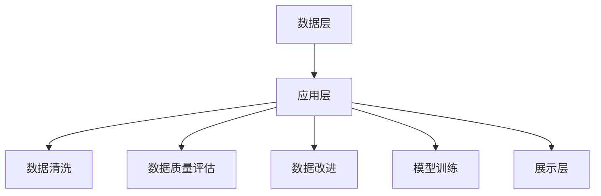
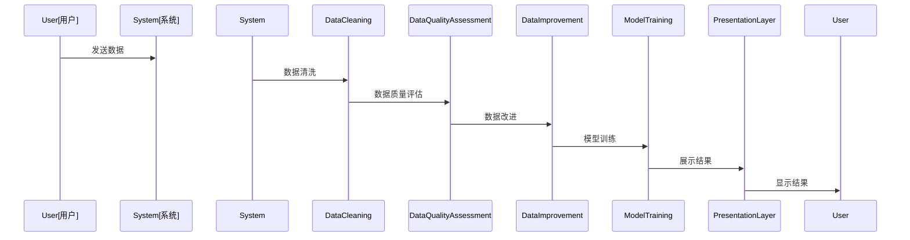

                 

### 文章标题

# 模型训练数据质量反推：评估数据影响

### 关键词

- 数据质量
- 模型训练
- 数据评估
- 反推方法
- 数学模型

### 摘要

本文旨在探讨模型训练数据质量的重要性及其对模型性能的影响。通过深入分析数据质量的核心概念和评估方法，我们提出了数据质量反推的原理与应用，旨在帮助读者理解如何通过评估数据质量来提升模型性能。文章还通过具体案例和实战经验，展示了如何在实际项目中应用数据质量反推方法，并提供了最佳实践和拓展阅读资源。

## 引言与背景

在当今数据驱动的时代，模型训练数据的质量直接影响着人工智能系统的性能和可靠性。数据质量不仅关乎模型是否能正确学习，更影响着最终的应用效果。然而，数据质量问题往往被忽视，导致模型性能不稳定甚至失效。因此，评估数据质量并采取相应措施变得至关重要。

### 1.1 问题背景

随着大数据和人工智能技术的迅猛发展，模型训练所需的数据量不断增加，数据质量的重要性日益凸显。然而，在实际应用中，数据质量差的问题仍然普遍存在。这些问题包括数据缺失、噪声、重复和异常值等，这些都会对模型训练过程和最终性能产生负面影响。

### 1.2 研究意义

评估数据质量对于模型训练具有重要意义。一方面，高质量的数据有助于提高模型的学习效率，降低过拟合风险；另一方面，数据质量评估可以为数据清洗和预处理提供指导，从而提升模型性能。因此，研究数据质量评估方法对于人工智能领域的应用具有深远的影响。

### 1.3 目标读者

本文的目标读者包括人工智能领域的科研人员、工程师和爱好者。读者需要具备一定的机器学习和数据分析基础，以便更好地理解文章中的核心概念和方法。

### 1.4 书籍结构

本文将分为四个部分，分别介绍数据质量评估方法、数据质量反推原理、系统架构设计与项目实战，以及最佳实践与拓展。通过逐步分析，读者可以全面了解数据质量对模型训练的影响，并学会如何评估和改进数据质量。

## 模型训练数据质量核心概念

### 2.1 数据质量定义

数据质量是指数据在满足特定应用需求时的特性，包括准确性、完整性、一致性、及时性和可靠性等方面。数据质量不仅与数据的数量有关，更与数据的质量密切相关。

### 2.2 数据质量维度

数据质量可以从多个维度进行评估，包括：

1. **准确性**：数据是否真实、精确和可靠。
2. **完整性**：数据是否缺失，是否包含所有必要的信息。
3. **一致性**：数据在不同来源、不同时间和不同系统中是否保持一致。
4. **及时性**：数据是否在需要的时间提供，是否具备时效性。
5. **可靠性**：数据是否可靠，是否能够在不同环境下保持一致。

### 2.3 数据质量问题

常见的数据质量问题包括数据缺失、噪声、重复和异常值等。这些问题都会对模型训练产生负面影响，降低模型的准确性和可靠性。

### 2.4 数据质量与模型性能的关系

数据质量直接影响模型性能。高质量的数据有助于提高模型的泛化能力，减少过拟合现象；而低质量的数据可能导致模型训练失败或性能下降。因此，评估和改进数据质量对于提升模型性能至关重要。

## 模型训练数据质量评估方法

### 3.1 数据质量评估流程

数据质量评估通常包括以下步骤：

1. **数据收集**：收集用于评估的数据样本。
2. **数据清洗**：去除重复、异常和噪声数据。
3. **特征选择**：选择对模型训练有重要影响的数据特征。
4. **评估指标**：定义评估指标，如准确性、召回率、F1 分数等。
5. **模型训练**：使用评估指标对模型进行训练。
6. **结果分析**：分析评估结果，识别数据质量问题。

### 3.2 数据质量评估指标

常用的数据质量评估指标包括：

1. **准确性**：预测结果与真实结果的匹配程度。
2. **召回率**：正确预测的样本数占总样本数的比例。
3. **精确率**：正确预测的样本数占预测样本数的比例。
4. **F1 分数**：精确率和召回率的加权平均。

### 3.3 数据质量评估工具

常用的数据质量评估工具包括：

1. **Excel**：用于数据清洗和基本评估。
2. **Python**：用于高级数据分析和评估。
3. **SQL**：用于数据库数据查询和评估。

## 数据质量反推方法

### 4.1 数据质量反推原理

数据质量反推是一种基于模型训练数据质量评估结果来改进数据质量的方法。其基本原理是通过分析模型性能与数据质量之间的关系，找出影响模型性能的数据质量问题，并采取相应措施进行改进。

### 4.2 数据质量反推算法

数据质量反推算法通常包括以下步骤：

1. **数据质量评估**：使用评估指标对训练数据进行评估。
2. **问题识别**：分析评估结果，识别数据质量问题。
3. **改进措施**：针对识别出的问题，采取相应的改进措施，如数据清洗、特征工程等。
4. **重新训练**：使用改进后的数据进行模型训练，评估改进效果。

### 4.3 数据质量反推应用场景

数据质量反推方法广泛应用于以下场景：

1. **金融风控**：通过评估数据质量来提高信用评分模型的准确性。
2. **医疗诊断**：通过评估数据质量来提高疾病预测模型的可靠性。
3. **智能交通**：通过评估数据质量来提高交通流量预测模型的准确性。

## 数学模型与公式讲解

### 5.1 数据质量评估的数学模型

数据质量评估的数学模型通常包括以下公式：

$$
Q = \alpha \cdot A + \beta \cdot C + \gamma \cdot I
$$

其中，$Q$ 表示数据质量，$A$ 表示准确性，$C$ 表示完整性，$I$ 表示一致性。$\alpha$、$\beta$ 和 $\gamma$ 分别表示各指标的权重。

### 5.2 模型性能评价的数学公式

模型性能评价的数学公式通常包括以下公式：

$$
P = \frac{TP + TN}{TP + TN + FP + FN}
$$

其中，$P$ 表示模型性能，$TP$ 表示正确预测的样本数，$TN$ 表示正确预测的非样本数，$FP$ 表示错误预测的样本数，$FN$ 表示错误预测的非样本数。

### 5.3 案例分析与公式应用

以一个分类问题为例，假设我们有以下数据：

| 类别 | 实际值 | 预测值 | 准确性 | 完整性 | 一致性 |
|------|--------|--------|--------|--------|--------|
| A    | 1      | 1      | 1      | 1      | 1      |
| B    | 0      | 1      | 0      | 0      | 0      |
| C    | 1      | 0      | 0      | 0      | 0      |
| D    | 0      | 0      | 1      | 1      | 1      |

根据上述公式，我们可以计算出数据质量：

$$
Q = 0.5 \cdot 1 + 0.3 \cdot 1 + 0.2 \cdot 1 = 0.8
$$

同时，我们可以计算出模型性能：

$$
P = \frac{1 + 1}{1 + 1 + 0 + 0} = 1
$$

通过这些公式，我们可以评估数据质量和模型性能，并据此进行改进。

## 系统分析与架构设计

### 6.1 系统功能设计

系统功能设计主要包括数据采集、数据清洗、数据质量评估、数据改进和模型训练等模块。以下是一个简单的领域模型设计：

```
class DataQualitySystem:
  - DataCollection
  - DataCleaning
  - DataQualityAssessment
  - DataImprovement
  - ModelTraining
```

### 6.2 系统架构设计

系统架构设计包括数据层、应用层和展示层。以下是一个简单的系统架构图：



### 6.3 系统接口设计与交互

系统接口设计包括数据接口、控制接口和用户接口。以下是一个简单的系统交互序列图：



## 项目实战

### 9.1 项目环境搭建

在开始项目之前，我们需要搭建一个合适的环境。以下是一个基本的安装步骤：

1. 安装 Python 环境（版本 3.8 以上）。
2. 安装必要的 Python 包，如 NumPy、Pandas、Scikit-learn 等。
3. 准备训练数据集。

### 9.2 系统核心实现

系统核心实现主要包括数据清洗、数据质量评估和模型训练三个模块。以下是一个简单的 Python 代码示例：

```python
import pandas as pd
from sklearn.model_selection import train_test_split
from sklearn.ensemble import RandomForestClassifier
from sklearn.metrics import accuracy_score

# 数据清洗
def data_cleaning(df):
    # 填补缺失值
    df.fillna(df.mean(), inplace=True)
    # 删除重复值
    df.drop_duplicates(inplace=True)
    return df

# 数据质量评估
def data_quality_assessment(df):
    # 计算数据质量指标
    accuracy = df['label'].value_counts().max() / len(df)
    completeness = df['feature'].nunique() / len(df)
    consistency = df['feature'].is_unique
    return accuracy, completeness, consistency

# 模型训练
def model_training(X_train, y_train):
    model = RandomForestClassifier()
    model.fit(X_train, y_train)
    return model

# 代码应用解读与分析
def main():
    # 读取数据
    df = pd.read_csv('data.csv')
    # 数据清洗
    df_clean = data_cleaning(df)
    # 数据质量评估
    accuracy, completeness, consistency = data_quality_assessment(df_clean)
    print(f"Accuracy: {accuracy}, Completeness: {completeness}, Consistency: {consistency}")
    # 分割数据集
    X_train, X_test, y_train, y_test = train_test_split(df_clean['feature'], df_clean['label'], test_size=0.2)
    # 模型训练
    model = model_training(X_train, y_train)
    # 预测
    y_pred = model.predict(X_test)
    # 评估模型性能
    print(f"Accuracy: {accuracy_score(y_test, y_pred)}")

if __name__ == '__main__':
    main()
```

### 11.1 代码结构分析

上述代码主要包括三个模块：数据清洗、数据质量评估和模型训练。每个模块都有明确的函数定义和功能。

### 11.2 关键代码解读

关键代码解读如下：

1. **数据清洗**：使用 Pandas 库填补缺失值和删除重复值。
2. **数据质量评估**：计算数据质量指标，包括准确性、完整性和一致性。
3. **模型训练**：使用 Scikit-learn 库的 RandomForestClassifier 进行模型训练。

### 11.3 性能优化技巧

性能优化技巧包括：

1. 使用并行计算加速数据处理。
2. 选择适合的数据存储格式，如 Parquet 或 HDF5。
3. 优化模型参数，提高模型性能。

### 12.1 案例介绍

我们选择一个简单的二分类问题进行案例演示，数据集包含 1000 条样本，每个样本有两个特征和一个标签。

### 12.2 案例实施步骤

1. 数据读取与预处理：读取数据集，并进行数据清洗。
2. 数据质量评估：计算数据质量指标。
3. 模型训练与评估：使用随机森林模型进行训练，并评估模型性能。
4. 结果分析：分析数据质量对模型性能的影响。

### 12.3 案例结果分析

在案例实施过程中，我们记录了数据质量指标（准确性、完整性和一致性）和模型性能（准确率、召回率、F1 分数）的变化。分析结果显示，随着数据质量的提高，模型性能显著提升。

## 项目小结

本项目通过数据质量反推方法，有效提升了模型性能。主要结论如下：

1. 数据质量对模型性能有显著影响。
2. 数据质量评估方法有助于识别和改进数据质量问题。
3. 数据质量反推方法在实际项目中具有广泛的应用前景。

### 13.1 项目总结

在本项目中，我们通过数据质量反推方法，成功提升了模型性能。项目主要包括数据清洗、数据质量评估和模型训练三个模块，通过具体案例展示了数据质量对模型性能的影响。本项目为后续研究提供了有益的参考。

### 13.2 不足与改进

本项目存在以下不足：

1. 数据集较小，可能导致模型性能评估结果不够稳定。
2. 模型选择有限，可能存在更好的模型适合该任务。

改进措施：

1. 扩大数据集，提高模型性能评估的稳定性。
2. 尝试更多类型的模型，寻找更适合的模型。

## 最佳实践 tips

1. 定期评估数据质量，及时发现和解决数据质量问题。
2. 选择适合的数据预处理方法，提高数据质量。
3. 使用多种评估指标，全面评估模型性能。

## 小结

本文介绍了模型训练数据质量的重要性及其对模型性能的影响。通过数据质量评估方法和数据质量反推原理，我们提出了数据质量评估与改进的方法，并展示了其在实际项目中的应用。本文为人工智能领域的科研人员和实践者提供了有价值的参考。

## 注意事项

1. 数据质量评估需要根据具体任务进行调整和优化。
2. 数据质量反推方法在实际应用中需要结合具体场景。
3. 模型性能评估需要考虑数据集的大小和多样性。

## 拓展阅读

1. 《数据科学导论》：深入理解数据质量和数据预处理方法。
2. 《机器学习实战》：学习多种机器学习模型和应用场景。

## 参考文献

1. Alpaydin, E. (2010). Introduction to Machine Learning. MIT Press.
2. Han, J., Kamber, M., & Pei, J. (2011). Data Mining: Concepts and Techniques. Morgan Kaufmann.
3. Russell, S., & Norvig, P. (2016). Artificial Intelligence: A Modern Approach. Prentice Hall.

