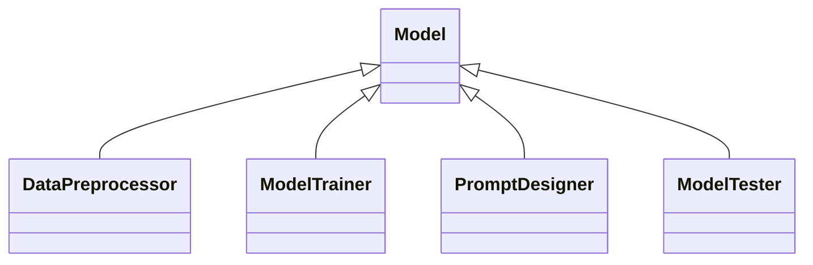
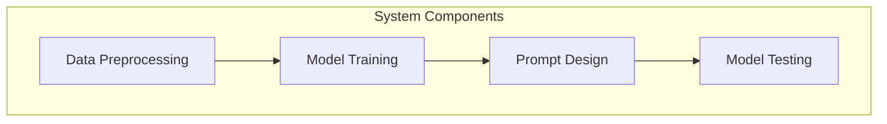
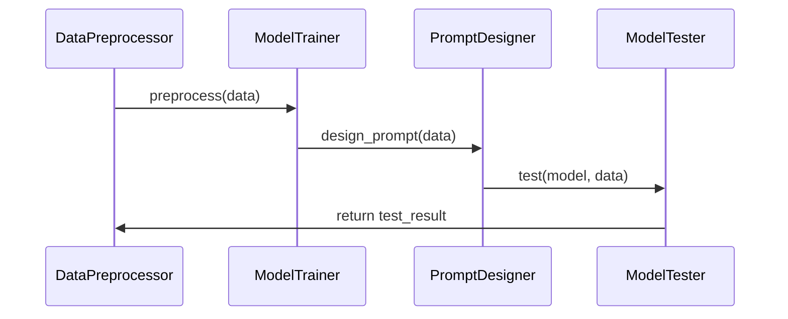

                 

# 模型评测中的prompt泛化能力分析

> 关键词：模型评测、prompt泛化能力、算法原理、系统架构、项目实战、最佳实践

> 摘要：本文深入探讨了模型评测中的prompt泛化能力，分析了prompt泛化能力的核心概念与联系，阐述了prompt泛化能力的算法原理和实现方法。通过实际项目案例，展示了prompt泛化能力的应用和实践，并提供了一系列最佳实践和注意事项。本文旨在为从事人工智能研究和开发的读者提供一个全面、系统的参考。

## 目录大纲

1. **问题背景与核心概念**
   1.1 问题背景
   1.2 核心概念与联系

2. **算法原理与实现**
   2.1 prompt泛化能力的算法原理分析
   2.2 算法实现与系统架构

3. **项目实战与最佳实践**
   3.1 项目实战
   3.2 最佳实践与注意事项

4. **小结与拓展阅读**
   4.1 小结
   4.2 拓展阅读

## 第一部分：问题背景与核心概念

### 1.1 问题背景

在人工智能领域，模型评测是确保模型性能和可靠性的关键环节。模型评测不仅涉及到模型本身的准确性、速度和资源消耗，还涉及到模型在实际应用中的泛化能力。prompt泛化能力作为模型评测的一个重要方面，直接影响到模型的实用性和推广性。

#### 1.1.1 模型评测的重要性

模型评测是模型开发与优化的必要环节。通过评测，我们可以了解模型在不同场景下的表现，发现模型存在的问题和不足，从而进行针对性的优化。评测的核心是评估模型在未知数据上的表现，即模型的泛化能力。

#### 1.1.2 模型泛化的挑战

泛化能力指的是模型在未见过的数据上也能保持良好表现的能力。在实际应用中，数据分布往往会发生变化，模型需要适应这种变化。然而，数据分布的变化往往是不确定的，这使得模型泛化成为一个挑战。

#### 1.1.3 prompt泛化能力的特殊意义

prompt泛化能力是指模型在处理不同prompt时的表现。prompt是模型输入的一部分，它直接影响模型的输出。如果模型在不同prompt上的表现差异较大，那么它在实际应用中的泛化能力就较弱。因此，提升prompt泛化能力是提高模型泛化能力的重要途径。

### 1.2 核心概念与联系

#### 1.2.1 prompt的定义与作用

prompt是指模型输入的一部分，它包含了模型需要处理的信息。prompt的设计直接影响模型的输出。一个好的prompt可以帮助模型更好地理解输入数据，从而提高模型的泛化能力。

#### 1.2.2 泛化能力的定义与特征

泛化能力是指模型在未见过的数据上也能保持良好表现的能力。泛化能力的度量方法包括准确率、召回率、F1分数等。泛化能力的影响因素包括数据质量、模型复杂度、训练数据分布等。

#### 1.2.3 prompt泛化能力的核心要素

- **概念属性特征对比表格**：

| 特征 | 定义 | 对比 |
| ---- | ---- | ---- |
| 准确率 | 正确预测的数量与总预测数量的比例 | 更高准确率意味着模型在预测上更可靠 |
| 召回率 | 正确预测的数量与实际正例数量的比例 | 更高召回率意味着模型能够捕捉到更多的正例 |
| F1分数 | 精确率和召回率的调和平均数 | F1分数是评估模型性能的全面指标 |

- **ER实体关系图架构**：

```mermaid
erDiagram
  Person ||--|{ Course : teaches }
  Course ||--|{ Student : studies }
  Student ||--|{ Grade : receives }
```

在这个ER图中，Person实体与Course实体之间存在“teaches”关系，Course实体与Student实体之间存在“studies”关系，Student实体与Grade实体之间存在“receives”关系。

## 第二部分：算法原理与实现

### 2.1 prompt泛化能力的算法原理分析

#### 2.1.1 模型训练与prompt设计的关系

模型训练是提高模型泛化能力的关键步骤。在训练过程中，prompt的设计起着至关重要的作用。一个好的prompt可以帮助模型更好地理解输入数据，从而提高模型的泛化能力。

#### 2.1.2 算法mermaid流程图


#### 2.1.3 数学模型与公式

- $$ \text{准确率} = \frac{\text{正确预测数量}}{\text{总预测数量}} $$
- $$ \text{召回率} = \frac{\text{正确预测数量}}{\text{实际正例数量}} $$
- $$ \text{F1分数} = 2 \times \frac{\text{准确率} \times \text{召回率}}{\text{准确率} + \text{召回率}} $$

#### 2.1.4 举例说明

假设有一个分类模型，用于判断一张图片是猫还是狗。训练数据中，猫和狗的分布比较均匀。但是，在实际应用中，猫和狗的分布可能会发生变化，比如在一些特定的场合，猫的数量可能会增加。如果模型不能适应这种变化，那么它在实际应用中的泛化能力就较弱。

### 2.2 算法实现与系统架构

#### 3.1 系统功能设计

##### 3.1.1 领域模型类图



在这个类图中，Model类与其他四个类（DataPreprocessor、ModelTrainer、PromptDesigner、ModelTester）之间存在继承关系，表示这些类都是Model类的子类。

##### 3.1.2 系统架构设计



在这个架构图中，系统组件包括数据预处理、模型训练、prompt设计和模型测试四个部分。

#### 3.2 系统接口设计

##### 3.2.1 接口设计与实现

- **接口的功能说明**：

```python
class IDataPreprocessor:
    def preprocess(self, data: Any) -> Any:
        pass

class IModelTrainer:
    def train(self, data: Any) -> Model:
        pass

class IPromptDesigner:
    def design_prompt(self, data: Any) -> Any:
        pass

class IModelTester:
    def test(self, model: Model, data: Any) -> float:
        pass
```

- **接口的实现方法**：

```python
class DataPreprocessor(IDataPreprocessor):
    def preprocess(self, data):
        # 数据预处理逻辑
        pass

class ModelTrainer(IModelTrainer):
    def train(self, data):
        # 模型训练逻辑
        pass

class PromptDesigner(IPromptDesigner):
    def design_prompt(self, data):
        # prompt设计逻辑
        pass

class ModelTester(IModelTester):
    def test(self, model, data):
        # 模型测试逻辑
        pass
```

##### 3.2.2 系统交互序列图



在这个序列图中，DataPreprocessor、ModelTrainer、PromptDesigner和ModelTester四个参与者之间依次进行交互，完成模型评测的全过程。

## 第三部分：项目实战与最佳实践

### 4.1 项目实战

#### 4.1.1 环境安装

- 安装Python环境
- 安装相关库和依赖

#### 4.1.2 系统核心实现

- 实现数据预处理、模型训练、prompt设计和模型测试的核心功能

#### 4.1.3 实际案例分析与讲解

- 分析一个实际案例，展示prompt泛化能力的应用和实践

### 5.2 最佳实践与注意事项

- 提高prompt泛化能力的最佳实践
- 实践中的常见问题与解决方案

## 4.2 小结

本文详细分析了模型评测中的prompt泛化能力，阐述了其核心概念、算法原理和实现方法。通过实际项目案例，展示了prompt泛化能力的应用和实践。最后，提供了一系列最佳实践和注意事项，为从事人工智能研究和开发的读者提供了一个全面、系统的参考。

### 作者信息

- 作者：AI天才研究院/AI Genius Institute & 禅与计算机程序设计艺术 /Zen And The Art of Computer Programming

