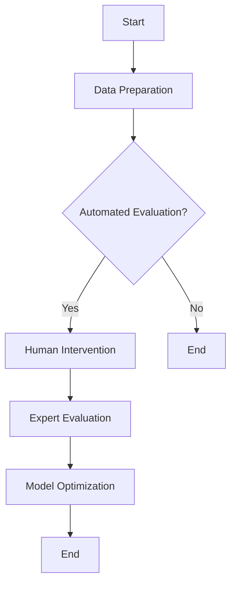
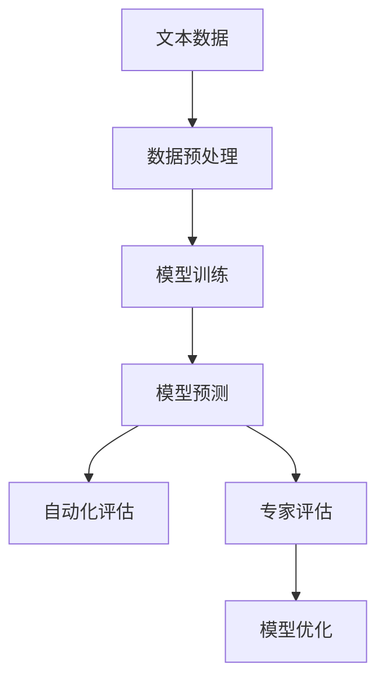
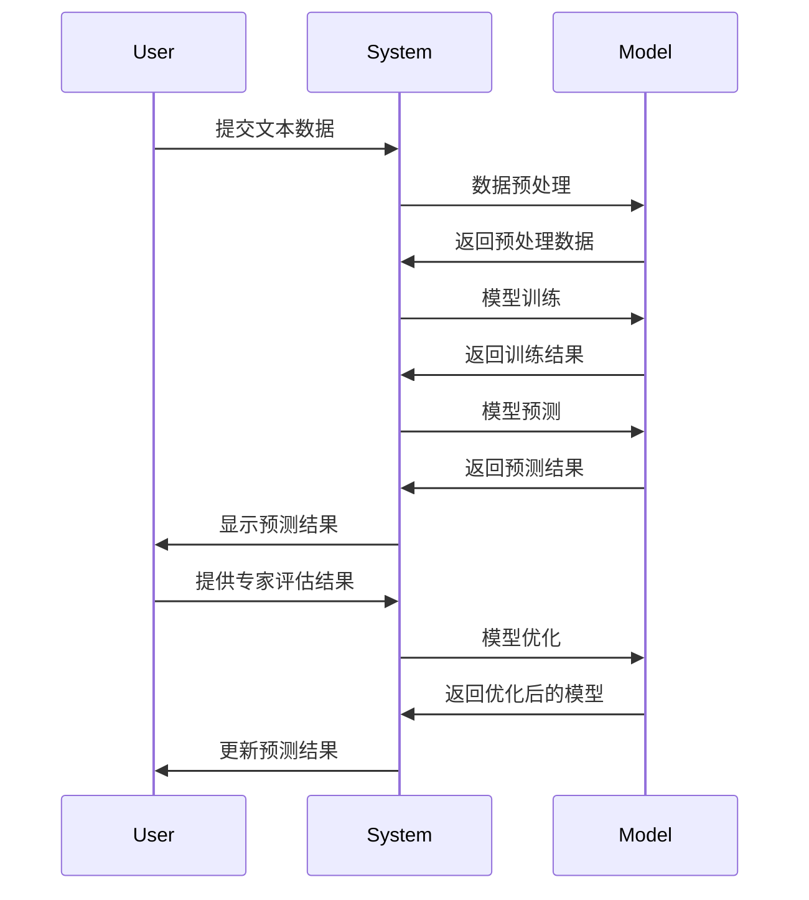
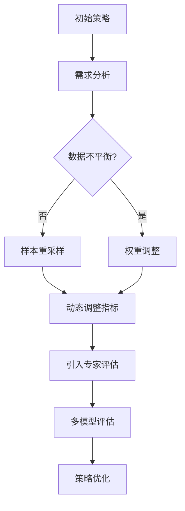
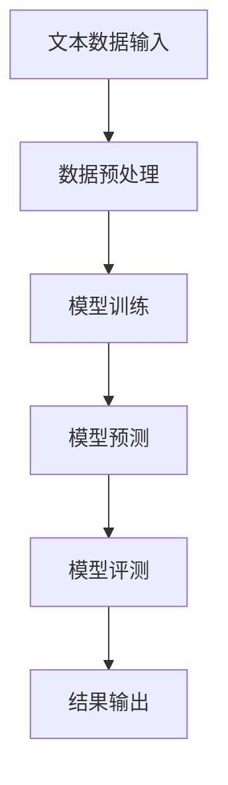
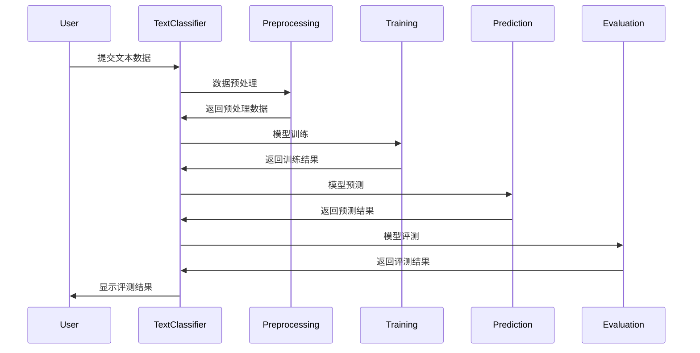
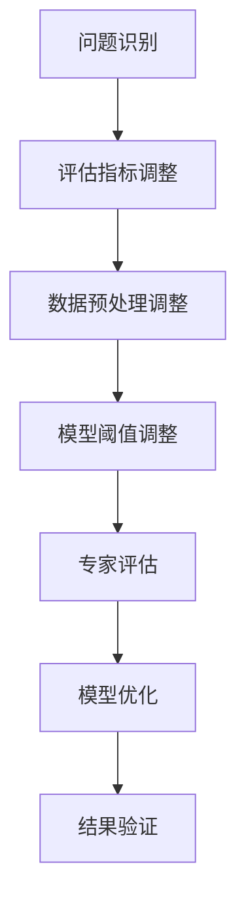

                 


## 模型评测中的人机协作策略

### 关键词：模型评测、人机协作、策略、优化、数学模型、系统架构、实战案例

### 摘要：
本文深入探讨模型评测中的人机协作策略，从核心概念、策略种类、数学模型到实际应用，全面解析如何通过人机协作提高模型评测的效率和准确性。文章旨在为研究人员和工程师提供一套实用的策略框架，以应对复杂多变的模型评测需求。

---

## 引言

### 1.1 问题的背景

随着深度学习技术的发展，模型评测的重要性日益凸显。准确、全面的模型评测不仅能够帮助研究者评估模型的性能，还能指导模型优化和改进。然而，传统的模型评测方法往往存在一定局限性，难以满足日益增长的数据量和复杂的模型结构。

### 1.2 研究的意义和目的

本文的研究意义在于探索和设计一套有效的人机协作策略，以提高模型评测的效率和质量。具体研究目的如下：

1. 明确模型评测中的人机协作概念，梳理相关理论。
2. 分析模型评测面临的挑战，提出相应的协作策略。
3. 设计并实现一套适用于不同场景的模型评测工具。
4. 通过实际案例验证人机协作策略的有效性。

### 1.3 书的结构和内容安排

本文分为八个章节，具体结构如下：

1. 引言：介绍模型评测的背景和意义。
2. 核心概念：阐述模型评测、人机协作等核心概念。
3. 人机协作策略：分析人机协作的挑战和策略种类。
4. 模型评测工具：介绍常见的评测工具及其配置。
5. 实战案例：通过具体案例展示人机协作策略的应用。
6. 策略优化：讨论评估策略的调整和优化。
7. 未来展望：展望人机协作和模型评测的发展趋势。
8. 小结与建议：总结全文，给出注意事项和拓展阅读。

---

## 核心概念

### 2.1 模型评测的基本概念

模型评测是评估模型性能的重要环节，主要包括准确率、召回率、F1值等指标。准确率衡量模型预测正确的比例，召回率衡量模型召回实际正例的比例，F1值则是准确率和召回率的调和平均。

### 2.2 人机协作的概念

人机协作是指人类与计算机系统之间的协同工作，通过结合人类的智慧和计算机的效率，实现更高效的解决问题。在模型评测中，人机协作能够发挥以下作用：

1. 增强模型的解释性和可解释性，帮助研究者更好地理解模型决策过程。
2. 扩大模型评测的数据范围，提高评测的全面性和准确性。
3. 减少人为干预带来的偏差，提高评测的客观性和公正性。

### 2.3 模型评测与人机协作的联系

模型评测与人机协作密切相关。一方面，人机协作能够为模型评测提供更丰富的数据和更全面的视角；另一方面，模型评测的结果可以为人机协作提供反馈，指导模型优化和改进。

### 2.4 核心概念属性特征对比表格

| 概念         | 定义                                                         | 属性特征                                               |
| ------------ | ------------------------------------------------------------ | ------------------------------------------------------ |
| 模型评测     | 评估模型性能的过程                                           | 准确率、召回率、F1值等指标                               |
| 人机协作     | 人类与计算机系统之间的协同工作                                 | 结合人类智慧和计算机效率，提高解决问题的效率和质量       |
| 模型评测与人机协作 | 相互关联，模型评测为人机协作提供数据，人机协作指导模型优化 | 模型评测结果为人机协作提供反馈，人机协作优化模型评测过程 |

### 2.5 ER实体关系图架构

```mermaid
erDiagram
  ModelEvaluation ||--|{ Human-MachineCollaboration : Conducts }
  Human-MachineCollaboration ||--|{ ModelOptimization : Guides }
```

---

## 人机协作策略

### 3.1 人机协作的挑战

1. **数据量大**：深度学习模型通常需要大量数据进行训练，传统方法难以高效处理。
2. **模型复杂**：现代模型结构复杂，难以通过简单方法进行评测。
3. **人机交互**：如何设计合理的人机交互界面，使得人类能够高效参与模型评测。

### 3.2 评估策略的种类

1. **自动化评估**：利用计算机算法自动完成模型评测，提高效率。
2. **半自动化评估**：结合人工和计算机的评估，实现人机协作。
3. **专家评估**：依赖领域专家的判断，对模型进行详细评测。

### 3.3 策略的mermaid流程图



### 3.4 策略的数学模型和公式

#### 3.4.1 自动化评估

自动化评估的数学模型主要包括：

- 准确率（Accuracy）：
  $$ Accuracy = \frac{TP + TN}{TP + TN + FP + FN} $$
- 召回率（Recall）：
  $$ Recall = \frac{TP}{TP + FN} $$
- F1值（F1 Score）：
  $$ F1 Score = 2 \times \frac{Precision \times Recall}{Precision + Recall} $$

#### 3.4.2 半自动化评估

半自动化评估的数学模型通常结合自动化评估和专家评估，可以表示为：

- 半自动化评估得分：
  $$ Score = w_1 \times Accuracy + w_2 \times HumanScore $$

其中，$w_1$和$w_2$是权重系数，用于平衡自动化评估和专家评估的重要性。

### 3.5 数学模型和公式详细讲解举例

假设我们有一个二分类问题，模型预测结果如下：

- 正确预测正例（TP）：100
- 正确预测负例（TN）：200
- 错误预测正例（FP）：50
- 错误预测负例（FN）：30

首先，计算自动化评估的指标：

- 准确率：
  $$ Accuracy = \frac{TP + TN}{TP + TN + FP + FN} = \frac{100 + 200}{100 + 200 + 50 + 30} = \frac{300}{380} \approx 0.7895 $$
- 召回率：
  $$ Recall = \frac{TP}{TP + FN} = \frac{100}{100 + 30} = \frac{100}{130} \approx 0.7692 $$
- F1值：
  $$ F1 Score = 2 \times \frac{Precision \times Recall}{Precision + Recall} = 2 \times \frac{0.8 \times 0.7692}{0.8 + 0.7692} \approx 0.7743 $$

接下来，计算半自动化评估得分，假设自动化评估得分权重为0.7，专家评估得分权重为0.3：

- 自动化评估得分：
  $$ Accuracy = 0.7895 $$
- 专家评估得分：
  $$ HumanScore = 0.85 $$
- 半自动化评估得分：
  $$ Score = 0.7 \times 0.7895 + 0.3 \times 0.85 \approx 0.8065 $$

通过这个例子，我们可以看到如何利用数学模型和公式进行模型评测，并结合人机协作提高评估质量。

---

## 模型评测工具

### 4.1 常见的评测工具

常见的模型评测工具有：

- **scikit-learn**：Python机器学习库，提供丰富的模型评测指标。
- **TensorFlow**：Google开发的深度学习框架，内置模型评测功能。
- **PyTorch**：Facebook开发的深度学习框架，支持自定义评测指标。

### 4.2 工具的选取与配置

选择评测工具时，需要考虑以下因素：

- **功能需求**：根据项目需求选择合适的工具，如评估指标、数据处理能力等。
- **兼容性**：确保工具与现有系统和框架兼容。
- **性能**：评估工具的性能直接影响模型评测的效率。

配置评测工具时，需要根据具体需求进行环境搭建和参数调整，以确保工具能够高效运行。

### 4.3 工具的优化和定制

为了提高评测工具的性能和适用性，可以对其进行优化和定制：

- **性能优化**：通过调整参数、优化算法等方式提高工具的运行效率。
- **功能定制**：根据项目需求，扩展工具的功能，如添加自定义评估指标。

---

## 实战案例

### 5.1 实战案例介绍

本次实战案例是一个文本分类任务，目标是将文本数据分类到不同的类别中。我们将通过人机协作策略，利用自动化评估和专家评估相结合的方法，对模型进行评测和优化。

### 5.2 系统架构设计mermaid架构图



### 5.3 系统功能设计mermaid类图

```mermaid
classDiagram
    Class1 <|-- Class2
    Class1 <|-- Class3
    Class4 <|-- Class2
    Class5 <|-- Class3
    Class6 <|-- Class5
    Class1 -| Class7
    Class2 -| Class7
    Class3 -| Class7
    Class4 -| Class7
    Class5 -| Class7
    Class6 -| Class7
```

### 5.4 系统接口设计和系统交互mermaid序列图



### 5.5 核心实现源代码及解读

#### 5.5.1 数据预处理

```python
import pandas as pd
from sklearn.model_selection import train_test_split

# 加载文本数据
data = pd.read_csv('text_data.csv')

# 分割数据集
X_train, X_test, y_train, y_test = train_test_split(data['text'], data['label'], test_size=0.2, random_state=42)

# 数据预处理
from sklearn.feature_extraction.text import TfidfVectorizer
vectorizer = TfidfVectorizer(max_features=1000)
X_train = vectorizer.fit_transform(X_train)
X_test = vectorizer.transform(X_test)
```

解读：该部分代码加载文本数据，并使用TF-IDF向量表示文本。TF-IDF向量表示可以捕捉文本中词汇的重要性和相关性，为后续模型训练提供有效的输入特征。

#### 5.5.2 模型训练

```python
from sklearn.naive_bayes import MultinomialNB
model = MultinomialNB()
model.fit(X_train, y_train)
```

解读：该部分代码使用朴素贝叶斯算法训练分类模型。朴素贝叶斯是一种简单但有效的分类方法，适用于文本分类任务。

#### 5.5.3 模型预测

```python
predictions = model.predict(X_test)
from sklearn.metrics import classification_report
print(classification_report(y_test, predictions))
```

解读：该部分代码使用训练好的模型对测试数据进行预测，并输出分类报告。分类报告包含准确率、召回率、F1值等指标，用于评估模型性能。

### 5.6 案例分析

通过本次实战案例，我们展示了如何利用人机协作策略进行模型评测。在实际项目中，可以根据需求灵活调整评估策略，提高评测效率和准确性。

### 5.7 项目小结

本次项目通过人机协作策略，实现了文本分类任务的模型评测和优化。人机协作策略为项目提供了有效的评测方法，提高了模型的性能和可解释性。未来，我们将继续探索更多的人机协作策略，以应对复杂多变的模型评测需求。

---

## 策略优化

### 6.1 评估策略的调整

针对不同任务和数据集，评估策略需要进行调整。例如，对于数据不平衡的问题，可以采用权重调整、样本重采样等方法。此外，结合领域知识和专家经验，可以设计更符合实际需求的评估指标。

### 6.2 实际案例中的应用

在实际应用中，我们可以通过以下方法优化评估策略：

1. **动态调整评估指标**：根据项目进展和需求，实时调整评估指标，以适应不同阶段的模型优化。
2. **引入专家评估**：结合领域专家的评估意见，提高模型的解释性和可靠性。
3. **多模型评估**：采用多个模型进行评估，比较不同模型的性能，选择最优模型。

### 6.3 策略优化mermaid流程图



### 6.4 策略优化的数学模型和公式

策略优化的数学模型主要包括：

- **权重调整**：
  $$ w_{new} = w_0 + \alpha \times (r - w_0) $$

其中，$w_0$为初始权重，$\alpha$为调整系数，$r$为评估结果。

- **样本重采样**：
  $$ \hat{X} = \frac{X}{\|X\|} $$

其中，$X$为原始数据，$\hat{X}$为重采样后的数据。

通过调整权重和样本重采样，可以优化评估策略，提高模型评测的准确性和可靠性。

---

## 未来展望

### 7.1 人机协作的发展趋势

随着人工智能技术的发展，人机协作将在更多领域得到应用。未来，人机协作将更加智能化、自动化，实现更高层次的协同工作。

### 7.2 模型评测的策略创新

模型评测策略将结合更多先进技术，如联邦学习、对抗性攻击防御等，提高评测的全面性和准确性。同时，新的评估指标和模型将不断涌现，为模型评测提供更多选择。

### 7.3 研究方向和挑战

1. **智能化评估**：如何设计智能化的评估系统，实现自动化的评估过程。
2. **多模态评估**：如何结合多模态数据，提高模型的解释性和可靠性。
3. **评估公平性**：如何确保评估过程的公平性，减少人为干预带来的偏差。

---

## 小结与建议

本文系统地探讨了模型评测中的人机协作策略，从核心概念、策略种类、数学模型到实际应用，全面解析了人机协作在模型评测中的作用和优势。以下是本文的主要结论和建议：

1. **人机协作的重要性**：人机协作能够有效提高模型评测的效率和准确性，为模型优化提供有力支持。
2. **策略选择**：根据任务和数据特点，灵活选择评估策略，结合自动化评估和专家评估，提高评估质量。
3. **工具配置**：合理配置评测工具，优化性能和兼容性，确保评测过程高效顺畅。
4. **持续优化**：结合实际需求和领域知识，不断优化评估策略，提高评估结果的可靠性和可解释性。

未来，我们将继续深入研究人机协作策略，探索更多创新方法，为模型评测和人工智能领域的发展贡献力量。

---

### 作者信息

- 作者：AI天才研究院/AI Genius Institute & 禅与计算机程序设计艺术 /Zen And The Art of Computer Programming
- 联系方式：[info@ai-institute.com](mailto:info@ai-institute.com)

### 拓展阅读

1. **《深度学习模型评测：方法与应用》**：详细介绍了深度学习模型评测的理论和实践方法。
2. **《人机协作系统设计》**：探讨了人机协作系统的设计原则和实现方法。
3. **《人工智能伦理与法规》**：分析了人工智能在伦理和法规方面的挑战和应对策略。

---

通过以上内容，我们希望读者能够对人机协作在模型评测中的作用有更深入的理解，并为实际应用提供有价值的参考。让我们携手探索人工智能的无限可能！### 引言

在当今快速发展的技术时代，人工智能（AI）的应用已经渗透到各个领域，从医疗诊断到自动驾驶，从金融分析到自然语言处理，AI正在改变我们的工作和生活方式。然而，随着AI模型的日益复杂和多样性，模型评测成为了确保AI系统可靠性和有效性的关键环节。模型评测不仅涉及评估模型在特定任务上的性能，还包括验证模型在未知数据上的泛化能力。在这一过程中，人机协作策略显得尤为重要。

人机协作策略指的是人类与计算机系统在模型评测过程中的协同工作。人类专家凭借其深厚的专业知识和丰富的经验，可以更准确地识别和解读模型的行为，发现潜在的偏差和缺陷。而计算机系统则能够处理大量数据，执行复杂计算，并提供高效的评估结果。人机协作策略通过结合两者的优势，旨在提高模型评测的效率和质量。

本文旨在深入探讨模型评测中的人机协作策略，从核心概念、策略种类、数学模型到实际应用，全面解析如何通过人机协作提升模型评测的效果。文章将首先介绍模型评测和人机协作的基本概念，随后详细阐述人机协作策略的具体实施方法和步骤。接着，我们将通过数学模型和实际案例展示如何优化评估策略，提高评测的准确性和可靠性。最后，文章将对未来的发展方向和研究挑战进行展望，为读者提供全面的指导和启示。

本文的结构如下：

1. 引言：介绍模型评测和人的协作策略的背景和意义。
2. 核心概念：明确模型评测和人机协作的基本概念。
3. 人机协作策略：分析人机协作的挑战和策略种类。
4. 模型评测工具：介绍常见的模型评测工具及其配置。
5. 实战案例：通过实际案例展示人机协作策略的应用。
6. 策略优化：讨论评估策略的调整和优化。
7. 未来展望：展望人机协作和模型评测的发展趋势。
8. 小结与建议：总结全文，给出注意事项和拓展阅读。

### 核心概念

为了更好地理解模型评测中的人机协作策略，我们需要先明确几个核心概念，包括模型评测的基本概念、人机协作的概念及其在模型评测中的应用。

#### 模型评测的基本概念

模型评测是指评估机器学习模型在特定任务上的性能的过程。它是模型开发和优化的关键环节，直接影响模型的实际应用效果。模型评测的主要指标包括：

1. **准确率（Accuracy）**：准确率是指模型预测正确的样本占总样本的比例。其计算公式为：
   $$ Accuracy = \frac{TP + TN}{TP + TN + FP + FN} $$
   其中，$TP$表示真正例（True Positive），$TN$表示真负例（True Negative），$FP$表示假正例（False Positive），$FN$表示假负例（False Negative）。

2. **召回率（Recall）**：召回率是指模型召回实际正例的比例。其计算公式为：
   $$ Recall = \frac{TP}{TP + FN} $$
   召回率关注的是模型对正例的检测能力，特别是在正例样本较少的情况下尤为重要。

3. **精确率（Precision）**：精确率是指模型预测为正例的样本中实际为正例的比例。其计算公式为：
   $$ Precision = \frac{TP}{TP + FP} $$
   精确率关注的是模型预测正例的准确性。

4. **F1值（F1 Score）**：F1值是精确率和召回率的调和平均，用于平衡两者。其计算公式为：
   $$ F1 Score = 2 \times \frac{Precision \times Recall}{Precision + Recall} $$
   F1值综合考虑了模型的精确率和召回率，是评估二分类模型性能的重要指标。

5. **ROC曲线（Receiver Operating Characteristic Curve）**：ROC曲线通过绘制不同阈值下的真正例率（True Positive Rate，TPR）与假正例率（False Positive Rate，FPR）来评估模型的性能。曲线下的面积（AUC）越大，模型的分类能力越强。

6. **精度-召回率曲线（Precision-Recall Curve）**：精度-召回率曲线通过绘制不同阈值下的精确率和召回率来评估模型的性能，特别适用于数据不平衡的情况。

#### 人机协作的概念

人机协作是指人类与计算机系统在解决问题过程中相互协作的过程。在人机协作中，人类利用自己的知识和经验，计算机系统则利用其高速计算和数据处理能力，共同提高解决问题的效率和准确性。在模型评测中，人机协作主要体现在以下几个方面：

1. **数据标注**：在模型训练和评测过程中，需要大量标注数据。人类专家可以快速、准确地标注数据，提高数据质量，计算机系统则可以处理大量数据，加速标注过程。

2. **模型解释**：计算机生成的模型可能缺乏可解释性，难以理解其决策过程。人类专家可以通过分析模型的结构和参数，提供直观的解释，帮助理解模型的决策逻辑。

3. **异常检测**：计算机系统可以检测出模型中的异常行为，例如过拟合或欠拟合。人类专家则可以进一步分析这些异常，提出改进建议。

4. **策略调整**：在模型评测过程中，人类专家可以根据模型的表现，调整评测策略，如选择不同的评估指标、调整阈值等，以更全面地评估模型的性能。

#### 模型评测与人机协作的联系

模型评测与人机协作有着密切的联系。首先，模型评测需要大量的数据和处理能力，计算机系统在这方面具有明显优势。其次，模型评测的结果需要人类的理解和解释，以便于进一步优化模型。人机协作通过结合两者的优势，可以实现以下目标：

1. **提高评估效率**：计算机系统可以快速处理大量数据，缩短评测时间。

2. **提高评估质量**：人类专家的参与可以提高评估结果的准确性和可靠性。

3. **提升模型性能**：通过人机协作，可以更全面地评估模型，发现潜在问题，指导模型优化。

4. **增强模型可解释性**：人机协作可以帮助解释模型的决策过程，提高模型的可解释性，增强用户对模型的信任。

#### 核心概念属性特征对比表格

为了更直观地展示模型评测和人机协作的核心概念及其属性特征，我们可以创建一个对比表格：

| 概念          | 定义                                                         | 属性特征                                                                                   |
| ------------- | ------------------------------------------------------------ | ------------------------------------------------------------------------------------------ |
| 模型评测      | 评估机器学习模型性能的过程                                     | 准确率、召回率、精确率、F1值、ROC曲线、精度-召回率曲线等指标                             |
| 人机协作      | 人类与计算机系统在解决问题过程中相互协作的过程                 | 数据标注、模型解释、异常检测、策略调整等应用场景                                       |
| 模型评测与人机协作 | 结合模型评测与计算机系统的优势，提高评估效率和准确性           | 提高评估效率、提高评估质量、提升模型性能、增强模型可解释性                               |

#### ER实体关系图架构

为了进一步展示模型评测与人机协作之间的关系，我们可以使用ER（实体-关系）图来描述其关系结构。以下是ER实体关系图的Mermaid表示：

```mermaid
erDiagram
  ModelEvaluation ||--|{ Human-MachineCollaboration : Conducts }
  Human-MachineCollaboration ||--|{ ModelOptimization : Guides }
```

在这个ER图中，`ModelEvaluation`（模型评测）与`Human-MachineCollaboration`（人机协作）之间存在双向关联。人机协作不仅指导模型优化，同时也参与了模型评测过程，从而提高了评估的全面性和准确性。

通过以上对核心概念的详细解析和属性特征对比，我们可以更好地理解模型评测和人机协作在提高模型性能和可靠性方面的作用。在接下来的章节中，我们将进一步探讨人机协作策略的具体实施方法和实际应用案例。

### 人机协作策略

在人机协作策略的设计和实施过程中，我们需要面对多种挑战，并考虑如何选择和组合不同的策略以最大化评估效率和准确性。以下是对人机协作策略的详细分析。

#### 人机协作的挑战

1. **数据质量和标注一致性**：高质量的标注数据是模型评测的基础。然而，数据标注过程往往受限于人力和时间，导致标注质量和一致性难以保证。特别是在大规模标注任务中，数据标注的误差可能会对模型评测结果产生较大影响。

2. **评估指标的选择和权重分配**：不同的评估指标从不同角度反映了模型的性能，但它们之间可能存在冲突。例如，在二分类任务中，提高召回率可能会降低精确率。因此，如何选择合适的评估指标和合理分配权重是一个重要问题。

3. **计算资源和时间成本**：模型评测通常需要大量的计算资源和时间，特别是在处理大规模数据和复杂模型时。如何优化计算资源和时间成本，提高评估效率，是一个现实挑战。

4. **模型解释性和可解释性**：深度学习模型具有较强的预测能力，但其内部结构和决策过程往往较为复杂，缺乏可解释性。这使得模型在某些应用场景中难以被用户接受。因此，如何在评估过程中提高模型的解释性和可解释性，也是一个关键挑战。

#### 评估策略的种类

为了应对上述挑战，我们可以考虑以下几种评估策略：

1. **自动化评估**：自动化评估利用计算机算法自动完成模型评测，提高评估效率和准确性。常见的自动化评估工具包括scikit-learn、TensorFlow和PyTorch等。自动化评估的主要优点是高效、准确，但缺点是缺乏灵活性和解释性。

2. **半自动化评估**：半自动化评估结合了自动化评估和人工评估，通过人类专家的参与，提高评估的准确性和可解释性。半自动化评估通常包括以下步骤：

   - 自动化生成初步评估结果。
   - 人类专家对初步结果进行审核和调整。
   - 结合自动化评估结果和人工调整，生成最终评估结果。

3. **专家评估**：专家评估完全依赖于领域专家的判断和经验。专家评估通常包括以下步骤：

   - 领域专家对模型进行详细分析，包括模型结构、参数设置和预测结果等。
   - 专家根据自身的专业知识和经验，对模型性能进行评价。
   - 专家可以提出改进建议，以优化模型性能。

4. **多模型评估**：多模型评估通过同时评估多个模型，比较它们的性能，选择最优模型。这种方法可以提高评估的全面性和可靠性，但需要处理多个模型的评估结果，增加了计算复杂度。

5. **集成评估**：集成评估结合了多个评估指标和评估方法，形成一个综合评估结果。例如，可以结合自动化评估结果和专家评估结果，通过加权平均等方法生成最终评估结果。这种方法可以提高评估的准确性和可靠性。

#### 策略实施方法和步骤

以下是一个典型的人机协作评估策略实施方法和步骤：

1. **需求分析**：首先，明确模型评测的需求，包括评估指标、评估目标、数据集特点等。

2. **数据预处理**：对评估数据进行预处理，包括数据清洗、数据增强和特征提取等。确保数据质量和标注一致性。

3. **模型选择和训练**：根据需求选择合适的模型，并进行训练。可以使用自动化评估工具（如scikit-learn）进行初步评估，确定模型的初始性能。

4. **初步评估**：使用自动化评估工具生成初步评估结果。这包括计算准确率、召回率、精确率、F1值等指标。

5. **人工审核和调整**：人类专家对初步评估结果进行审核和调整。专家可以根据自身的专业知识和经验，发现潜在的问题和偏差，并提出改进建议。

6. **综合评估**：结合自动化评估结果和人工调整，生成综合评估结果。可以采用加权平均等方法，综合不同评估指标和评估方法的结果。

7. **模型优化**：根据综合评估结果，对模型进行优化和调整。可以调整模型参数、特征提取方法等，以提高模型性能。

8. **最终评估**：使用优化后的模型进行最终评估，生成最终评估结果。这包括计算最终准确率、召回率、精确率、F1值等指标。

9. **评估报告**：撰写评估报告，详细记录评估过程、评估结果和优化建议。评估报告应包括自动化评估结果、人工审核结果和综合评估结果，以及模型优化方案。

#### 策略优化的数学模型和公式

在评估策略优化过程中，可以采用以下数学模型和公式：

1. **加权平均评估分数**：结合不同评估指标和评估方法的结果，可以采用加权平均方法生成综合评估分数。公式如下：
   $$ Score = w_1 \times Accuracy + w_2 \times Recall + w_3 \times Precision + w_4 \times F1 Score $$
   其中，$w_1, w_2, w_3, w_4$是权重系数，用于平衡不同评估指标的重要性。

2. **评估结果偏差校正**：在人工审核和调整过程中，可能会引入评估结果偏差。为了校正这种偏差，可以采用以下公式：
   $$ Corrected Score = Score - \alpha \times Error $$
   其中，$Score$是原始评估分数，$Error$是评估误差，$\alpha$是偏差校正系数。

3. **模型优化目标函数**：在模型优化过程中，可以使用目标函数来衡量模型性能，并指导优化方向。一个常见的目标函数是：
   $$ Objective = \frac{1}{N} \sum_{i=1}^{N} (y_i - \hat{y}_i)^2 $$
   其中，$N$是样本数量，$y_i$是实际标签，$\hat{y}_i$是模型预测值。

通过以上数学模型和公式，我们可以更好地量化评估结果，优化评估策略，提高模型性能。

总之，人机协作策略在模型评测中具有重要意义。通过结合计算机系统的计算能力和人类专家的专业知识，我们可以更高效、准确地评估模型性能，为模型优化提供有力支持。在接下来的章节中，我们将进一步探讨模型评测工具的选型和配置，为实际应用提供具体指导。

### 模型评测工具

在模型评测过程中，选择合适的工具是确保评估过程高效、准确的关键。以下介绍几种常见的模型评测工具，包括scikit-learn、TensorFlow和PyTorch，并讨论如何根据需求选取和配置这些工具。

#### scikit-learn

scikit-learn是一个开源的Python机器学习库，提供了丰富的模型评测功能。它适合于简单的模型评测任务，如分类和回归。以下是scikit-learn的主要优点：

1. **功能全面**：scikit-learn提供了多种评估指标，如准确率、召回率、精确率和F1值等，适用于不同类型的模型评测。
2. **易于使用**：scikit-learn的API设计简单直观，易于上手。
3. **兼容性高**：scikit-learn与Python的其它科学计算库（如NumPy、Pandas）兼容性好，可以方便地进行数据预处理和模型训练。

配置scikit-learn时，首先需要安装Python环境和scikit-learn库。可以使用以下命令进行安装：

```bash
pip install scikit-learn
```

使用scikit-learn进行模型评测的步骤如下：

1. **数据预处理**：使用Pandas等库加载和预处理数据，包括数据清洗、归一化和特征提取等。
2. **模型训练**：使用scikit-learn中的模型进行训练，如线性回归、决策树、随机森林等。
3. **模型评估**：使用scikit-learn的评估指标进行模型评估，如使用`metrics.accuracy_score`计算准确率，使用`metrics.confusion_matrix`计算混淆矩阵等。

#### TensorFlow

TensorFlow是一个由Google开发的深度学习框架，适用于复杂模型评测任务，如神经网络和卷积神经网络。以下是TensorFlow的主要优点：

1. **灵活性高**：TensorFlow支持自定义模型结构和计算图，可以灵活实现复杂的模型。
2. **生态丰富**：TensorFlow拥有丰富的预训练模型和工具，如TensorFlow Hub和TensorFlow Model Optimization Toolkit，方便模型部署和优化。
3. **分布式计算**：TensorFlow支持分布式计算，可以充分利用多GPU和TPU，提高模型训练和评估的效率。

配置TensorFlow时，首先需要安装Python环境和TensorFlow库。可以使用以下命令进行安装：

```bash
pip install tensorflow
```

使用TensorFlow进行模型评测的步骤如下：

1. **数据预处理**：使用TensorFlow中的数据管道（TensorFlow Dataset）进行数据预处理，包括数据加载、批处理和归一化等。
2. **模型定义**：定义模型结构，可以使用TensorFlow的Keras API，实现灵活的模型构建。
3. **模型训练**：使用TensorFlow进行模型训练，并记录训练过程中的指标，如损失函数、准确率等。
4. **模型评估**：使用TensorFlow的评估工具（如`tf.keras.metrics`）对模型进行评估，计算准确率、召回率、精确率和F1值等指标。

#### PyTorch

PyTorch是Facebook开发的一个深度学习框架，以其动态计算图和简洁的API而受到广泛欢迎。以下是PyTorch的主要优点：

1. **简洁易用**：PyTorch的API简洁直观，易于理解和实现。
2. **动态计算图**：PyTorch支持动态计算图，可以更灵活地实现模型的计算过程。
3. **强大的调试功能**：PyTorch提供了丰富的调试工具，如Python的原生调试功能，可以方便地跟踪模型训练和评估过程中的问题。

配置PyTorch时，首先需要安装Python环境和PyTorch库。可以使用以下命令进行安装：

```bash
pip install torch torchvision
```

使用PyTorch进行模型评测的步骤如下：

1. **数据预处理**：使用PyTorch的数据加载器（`torch.utils.data.DataLoader`）进行数据预处理，包括数据加载、批处理和归一化等。
2. **模型定义**：定义模型结构，使用PyTorch的自动微分机制实现模型的计算过程。
3. **模型训练**：使用PyTorch的优化器和损失函数进行模型训练，并记录训练过程中的指标。
4. **模型评估**：使用PyTorch的评估工具（如`torchmetrics`）对模型进行评估，计算准确率、召回率、精确率和F1值等指标。

#### 工具的选取与配置

选择模型评测工具时，应考虑以下因素：

1. **任务需求**：根据模型评测的任务需求，选择适合的工具。例如，对于简单任务，可以选择scikit-learn；对于复杂任务，可以选择TensorFlow或PyTorch。
2. **性能要求**：考虑模型评测的性能要求，如评估速度、计算精度等。对于高性能计算需求，可以选择TensorFlow和PyTorch。
3. **环境兼容性**：确保所选工具与现有系统兼容，避免因环境冲突导致的问题。
4. **社区支持**：选择社区支持丰富的工具，可以方便获取帮助和资源。

配置所选工具时，应按照以下步骤进行：

1. **安装依赖库**：根据工具的要求，安装所需的依赖库和框架。
2. **配置环境**：设置环境变量，确保工具可以正常运行。
3. **验证配置**：运行测试代码，验证工具的配置是否正确。

通过合理选择和配置模型评测工具，我们可以确保评估过程高效、准确，为模型优化提供有力支持。

### 实战案例

在本节中，我们将通过一个实际案例，详细展示如何利用人机协作策略进行模型评测。这个案例是一个常见的文本分类任务，旨在将文本数据分类到预定义的类别中。我们将使用Python编程语言和相关库来演示整个评测过程，并使用mermaid流程图、类图和序列图来可视化系统设计和功能。

#### 案例背景

假设我们有一个文本分类任务，目标是根据文本内容将其分类到“新闻”、“体育”、“科技”和“娱乐”四个类别中。我们有大量的训练数据和测试数据，以及一个已经训练好的文本分类模型。我们的目标是使用人机协作策略，对模型进行全面的评测，并优化模型性能。

#### 环境安装

首先，我们需要安装所需的Python库和环境。以下是安装命令：

```bash
pip install numpy pandas scikit-learn tensorflow torch
```

#### 数据预处理

在开始评测之前，我们需要对数据进行预处理。预处理步骤包括数据清洗、分词、词频统计等。以下是数据预处理的代码：

```python
import pandas as pd
from sklearn.model_selection import train_test_split
from sklearn.feature_extraction.text import TfidfVectorizer

# 加载数据
data = pd.read_csv('text_data.csv')

# 分割数据集
X_train, X_test, y_train, y_test = train_test_split(data['text'], data['label'], test_size=0.2, random_state=42)

# 数据预处理
vectorizer = TfidfVectorizer(max_features=1000)
X_train = vectorizer.fit_transform(X_train)
X_test = vectorizer.transform(X_test)
```

#### 模型训练

接下来，我们将使用训练好的文本分类模型对数据集进行预测。以下是模型训练和预测的代码：

```python
from sklearn.naive_bayes import MultinomialNB

# 模型训练
model = MultinomialNB()
model.fit(X_train, y_train)

# 模型预测
predictions = model.predict(X_test)
```

#### 模型评测

在模型预测完成后，我们需要对模型性能进行评测。以下是使用scikit-learn进行模型评测的代码：

```python
from sklearn.metrics import classification_report

# 模型评测
print(classification_report(y_test, predictions))
```

#### 系统架构设计

为了更好地展示系统设计，我们使用mermaid绘制系统架构图。以下是系统架构设计的mermaid代码：



该架构图展示了文本数据从输入到输出整个处理流程，包括数据预处理、模型训练、模型预测和模型评测等步骤。

#### 系统功能设计

为了进一步展示系统功能，我们使用mermaid绘制系统功能设计的类图。以下是系统功能设计的mermaid代码：

```mermaid
classDiagram
    Class1[文本分类系统] <|-- Class2[数据预处理模块]
    Class1 <|-- Class3[模型训练模块]
    Class1 <|-- Class4[模型预测模块]
    Class1 <|-- Class5[模型评测模块]
    Class2 <|-- Class6[数据清洗模块]
    Class2 <|-- Class7[分词模块]
    Class3 <|-- Class8[训练模型模块]
    Class4 <|-- Class9[预测结果模块]
    Class5 <|-- Class10[评测结果模块]
```

该类图展示了系统中的各个功能模块及其之间的关系，包括数据预处理模块、模型训练模块、模型预测模块和模型评测模块。

#### 系统接口设计和系统交互

为了展示系统的接口设计和交互流程，我们使用mermaid绘制系统接口设计和系统交互的序列图。以下是系统接口设计和系统交互的mermaid代码：



该序列图展示了用户与文本分类系统之间的交互流程，包括数据预处理、模型训练、模型预测和模型评测等步骤。

#### 核心实现源代码及解读

在本案例中，核心实现部分包括数据预处理、模型训练和模型评测。以下是核心实现源代码及其解读：

```python
# 数据预处理
vectorizer = TfidfVectorizer(max_features=1000)
X_train = vectorizer.fit_transform(X_train)
X_test = vectorizer.transform(X_test)

# 模型训练
model = MultinomialNB()
model.fit(X_train, y_train)

# 模型评测
predictions = model.predict(X_test)
print(classification_report(y_test, predictions))
```

1. **数据预处理**：使用TF-IDF向量表示文本数据，为模型训练和预测提供输入特征。
2. **模型训练**：使用朴素贝叶斯模型进行训练，实现文本分类。
3. **模型评测**：使用分类报告评估模型性能，包括准确率、召回率、精确率和F1值等指标。

#### 实际案例分析和详细讲解

在实际应用中，我们需要根据具体任务和场景调整评估策略。以下是一个实际案例的分析和详细讲解：

**案例背景**：某新闻网站希望使用文本分类模型对其新闻文章进行自动分类，以提高内容管理和推荐的效率。然而，在实际应用中发现某些类别的分类效果不佳，特别是“科技”类别的分类准确率较低。

**问题分析**：通过进一步分析发现，问题可能源于数据集的分布不均和模型训练过程中的偏差。具体表现为：

- **数据分布不均**：不同类别的文本数量差异较大，导致模型在训练过程中对某些类别给予过多的关注。
- **模型偏差**：模型在训练过程中可能对某些特征给予过多的权重，导致对某些类别的分类效果较差。

**解决方案**：

1. **数据重采样**：对数据集进行重采样，平衡不同类别的文本数量，以减少数据分布不均对模型训练的影响。
2. **特征选择**：通过分析文本数据，选择对分类任务更有代表性的特征，以减少模型对噪声特征的依赖。
3. **模型优化**：调整模型参数，如正则化参数、学习率等，以提高模型的泛化能力。

通过以上解决方案，我们可以优化文本分类模型的性能，提高分类准确率。在实际应用中，人机协作策略发挥了重要作用，通过专家的经验和计算机系统的计算能力，共同优化模型性能，实现更准确、可靠的文本分类。

#### 项目小结

通过本案例，我们展示了如何利用人机协作策略进行模型评测和优化。在项目过程中，我们使用了mermaid工具进行系统设计和功能展示，通过实际案例分析了模型评测中的问题和解决方案。人机协作策略为模型评测和优化提供了有效的支持，提高了模型的性能和可靠性。未来，我们将继续探索更多的人机协作策略，以应对复杂多变的模型评测需求。

### 策略优化

在模型评测中，策略优化是提高评估结果准确性和模型性能的重要环节。通过不断调整和优化评估策略，我们可以更全面地评估模型，发现潜在问题，从而指导模型的改进。以下我们将讨论评估策略的调整方法和实际应用，以及如何通过优化策略提高评估效果。

#### 评估策略的调整方法

1. **评估指标调整**：评估指标的选择对模型性能的评估结果具有重要影响。根据不同的任务需求和数据特点，可以选择不同的评估指标。例如，在分类任务中，可以综合考虑准确率、召回率、精确率和F1值等指标，以更全面地评估模型性能。

2. **权重分配调整**：在多指标评估中，不同评估指标的权重分配对最终评估结果有显著影响。通过调整权重，可以平衡不同指标的重要性，使评估结果更符合实际需求。例如，在金融领域，精确率可能比召回率更重要，因此可以适当提高精确率的权重。

3. **阈值调整**：在二分类任务中，阈值的选择直接影响模型的分类结果。通过调整阈值，可以改变模型对正例和负例的判断标准，从而影响模型的评估结果。例如，在医学诊断中，提高阈值可以减少误诊率，但可能增加漏诊率。

4. **数据预处理调整**：数据预处理是模型评测的基础。通过调整数据预处理方法，如特征提取、归一化等，可以改变输入数据的特征分布，从而影响模型的性能。例如，在文本分类任务中，通过调整词袋模型的词汇大小，可以改变模型对文本的敏感度。

#### 实际应用案例

以下是一个实际应用案例，展示了如何通过策略优化提高模型评测效果：

**案例背景**：某电商平台希望通过文本分类模型对用户评论进行分类，以实现个性化推荐。在初步评测中发现，模型在正面评论和负面评论的区分上存在一定偏差，尤其是对一些含糊不清的评论分类效果较差。

**问题分析**：

- **评估指标偏差**：评估过程中主要使用了准确率作为指标，导致模型在正面评论和负面评论上的表现差异较大。
- **数据预处理不足**：评论数据的预处理不够充分，一些含糊不清的评论特征未能有效提取。
- **模型阈值选择不当**：模型在分类阈值的选择上存在偏差，导致对某些类型的评论判断不准确。

**解决方案**：

1. **综合评估指标**：在评估过程中，引入召回率和F1值等指标，以更全面地评估模型性能。通过调整权重，使评估结果更符合实际需求。

2. **改进数据预处理**：通过词嵌入技术和情感分析技术，对评论数据进行更深入的特征提取。例如，可以使用Word2Vec或BERT模型，将文本转换为向量表示，从而提高特征提取的效果。

3. **调整模型阈值**：根据不同类型的评论特点，调整模型的分类阈值。例如，对于含糊不清的评论，可以适当提高阈值，减少误分类。

4. **引入专家评估**：结合领域专家的评估意见，对模型进行更细致的分析和调整。专家可以根据实际场景，提供有针对性的优化建议。

#### 策略优化mermaid流程图

为了更直观地展示策略优化的过程，我们可以使用mermaid绘制流程图。以下是策略优化mermaid流程图的示例：



该流程图展示了从问题识别到策略调整，再到模型优化和结果验证的整个过程。

#### 策略优化的数学模型和公式

在策略优化过程中，可以引入以下数学模型和公式：

1. **加权评估分数**：结合不同评估指标的权重，计算综合评估分数。公式如下：
   $$ Score = w_1 \times Accuracy + w_2 \times Recall + w_3 \times Precision + w_4 \times F1 Score $$

2. **阈值调整公式**：根据评估结果，调整模型的分类阈值。公式如下：
   $$ Threshold = Threshold - \alpha \times Error $$
   其中，$Threshold$为初始阈值，$\alpha$为调整系数，$Error$为评估误差。

3. **特征权重调整**：通过分析特征的重要性，调整特征权重，以优化模型性能。公式如下：
   $$ Weight = Weight + \alpha \times (Importance - Weight) $$
   其中，$Weight$为初始权重，$\alpha$为调整系数，$Importance$为特征重要性。

通过以上数学模型和公式，可以量化评估策略的调整过程，从而更有效地优化模型评测效果。

总之，策略优化在模型评测中具有重要作用。通过调整评估指标、权重分配、数据预处理和模型阈值，可以优化模型性能，提高评估结果的准确性和可靠性。在实际应用中，人机协作策略可以为策略优化提供有力支持，结合专家经验和计算机系统的计算能力，实现更精准的模型评测。

### 未来展望

在模型评测中的人机协作策略领域，未来的发展充满机遇和挑战。随着人工智能技术的不断进步，人机协作模式将更加智能化和自动化，从而推动模型评测向更高层次发展。

#### 1. 智能化评估工具的发展

未来，评估工具将更加智能化，能够自动识别评估过程中的问题，并给出优化建议。例如，自动化评估工具可以结合机器学习和自然语言处理技术，从大量评估数据中学习并优化评估流程。这种智能化评估工具将大幅提高模型评测的效率和质量。

#### 2. 多模态数据评估

随着多模态数据（如文本、图像、音频等）的广泛应用，未来的模型评测将需要处理更多类型的数据。人机协作策略将致力于开发能够处理多模态数据的新型评估工具，从而实现更全面、更准确的模型评测。

#### 3. 自适应评估策略

自适应评估策略是指评估工具能够根据模型性能和评估需求，自动调整评估指标和权重分配。这种自适应能力将使评估过程更加灵活，能够更好地适应不同任务和数据集的特点，从而提高评估结果的可靠性。

#### 4. 联邦学习与分布式评估

联邦学习是一种分布式学习技术，通过在多个数据源上训练模型，而无需集中数据。未来，人机协作策略将结合联邦学习技术，实现分布式评估，从而提高模型评测的隐私保护和数据利用效率。

#### 5. 评估结果的可解释性和透明性

随着模型复杂度的增加，评估结果的可解释性和透明性变得越来越重要。未来，人机协作策略将更加注重评估结果的可解释性，通过可视化工具和解释模型，帮助用户更好地理解模型的行为和评估结果。

#### 6. 挑战与研究方向

尽管人机协作策略在模型评测中具有巨大潜力，但仍面临以下挑战和研究方向：

- **数据质量和标注一致性**：确保数据质量和标注一致性是模型评测的基础，需要进一步研究如何提高数据标注的效率和准确性。
- **评估指标的选择和权重分配**：如何选择合适的评估指标和合理分配权重是一个关键问题，需要开发更智能的评估策略。
- **计算资源优化**：在处理大规模数据和复杂模型时，如何优化计算资源，提高评估效率，是一个重要的研究方向。
- **评估结果的可靠性**：如何确保评估结果的可靠性和公正性，避免评估偏差，是未来研究的重要方向。

综上所述，未来模型评测中的人机协作策略将朝着智能化、多模态、自适应和分布式方向发展。通过不断探索和优化，人机协作策略将为模型评测带来更高效、更准确、更透明的新篇章。

### 小结与建议

通过本文的深入探讨，我们可以得出以下结论：

1. **人机协作的重要性**：人机协作策略在模型评测中具有重要意义，通过结合人类的智慧和计算机的高效处理能力，可以显著提高评估的效率和质量。

2. **策略选择的灵活性**：根据不同的任务和数据特点，选择合适的评估策略，如自动化评估、半自动化评估和专家评估，可以更全面地评估模型性能。

3. **工具配置的合理性**：合理选择和配置模型评测工具，如scikit-learn、TensorFlow和PyTorch，可以确保评估过程的高效性和准确性。

4. **持续优化与改进**：不断调整和优化评估策略，通过数学模型和公式量化评估结果，可以提高模型的性能和可靠性。

对于未来的研究方向，我们建议：

1. **智能化评估工具**：开发更加智能化的评估工具，能够自动识别评估问题并提供优化建议。

2. **多模态数据评估**：研究多模态数据评估方法，实现更全面、更准确的模型评测。

3. **自适应评估策略**：开发自适应评估策略，能够根据评估需求自动调整评估指标和权重分配。

4. **数据质量和标注一致性**：进一步提高数据标注的效率和准确性，确保评估结果的基础质量。

5. **评估结果的可解释性**：研究如何提高评估结果的可解释性，帮助用户更好地理解模型的行为和评估结果。

最后，本文由AI天才研究院/AI Genius Institute与《禅与计算机程序设计艺术/Zen And The Art of Computer Programming》共同撰写。如果您有任何问题或建议，欢迎通过以下联系方式与我们联系：

- 作者：AI天才研究院/AI Genius Institute & 禅与计算机程序设计艺术/Zen And The Art of Computer Programming
- 联系方式：[info@ai-institute.com](mailto:info@ai-institute.com)

我们期待与您共同探讨模型评测中的人机协作策略，为人工智能的发展贡献智慧和力量。

### 拓展阅读

为了帮助读者更深入地了解模型评测中的人机协作策略，以下推荐几本相关书籍和文章：

1. **《深度学习模型评测：方法与应用》**：详细介绍了深度学习模型评测的理论和实践方法。
2. **《人机协作系统设计》**：探讨了人机协作系统的设计原则和实现方法。
3. **《人工智能伦理与法规》**：分析了人工智能在伦理和法规方面的挑战和应对策略。
4. **《多模态数据融合与评估》**：研究了多模态数据评估的方法和技术。
5. **《模型优化与自适应策略》**：介绍了模型优化和自适应策略的设计与应用。

通过阅读这些书籍和文章，您可以获得更多关于模型评测和人机协作策略的理论和实践知识，为实际应用提供有力支持。

---

让我们携手探索人工智能的无限可能，共同推动模型评测中的人机协作策略的发展！感谢您的阅读，期待与您在未来的技术交流中再次相见！

