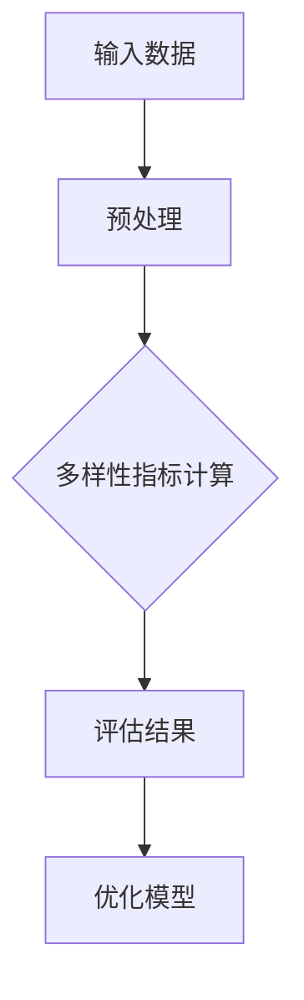
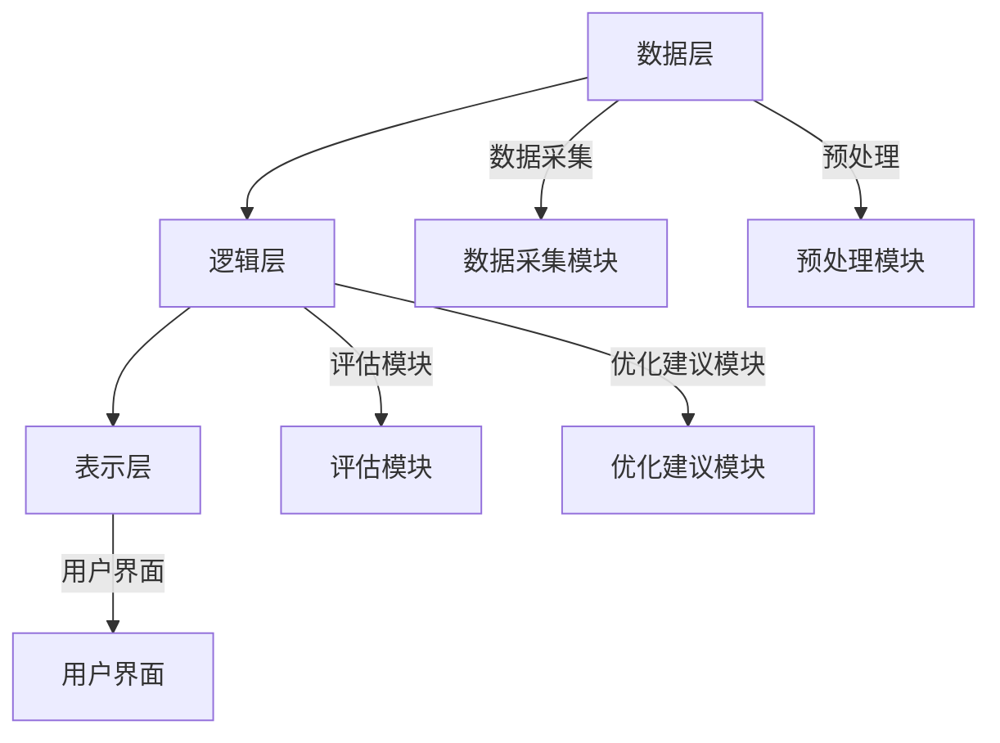
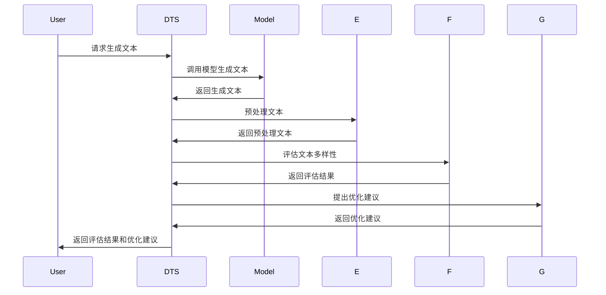
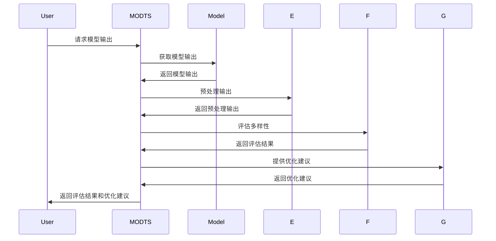

                 


### 文章标题：模型输出多样性测试：评估创造力

> 关键词：模型输出多样性、创造力评估、测试方法、统计测试、结构测试、生成测试

> 摘要：本文将探讨模型输出多样性的概念及其重要性，详细描述了模型输出多样性测试的方法和步骤，并通过实际案例进行分析，旨在为读者提供一个全面而深入的评估模型创造力的指南。

----------------------------------------------------------------

### 第一部分: 问题背景与核心概念

#### 第1章: 问题背景

##### 1.1.1 问题背景

在人工智能领域，模型输出多样性是指模型在处理不同输入时产生不同输出的能力。这一概念的重要性在于，模型输出多样性与模型在复杂、动态环境中的表现息息相关。一个具有高度多样性的模型能够更好地适应各种场景，从而提高其在实际应用中的性能和可靠性。

##### 1.1.2 问题描述

模型输出多样性不足可能导致模型无法适应复杂多变的实际场景，从而影响模型的应用效果。例如，一个用于文本生成的模型如果输出的文本总是相同或相似，那么它在处理具有不同风格或主题的文本时将表现出明显的局限性。因此，评估和优化模型输出多样性成为了一个关键问题。

##### 1.1.3 问题解决

为了解决模型输出多样性不足的问题，我们可以采用多种测试方法，如统计测试、结构测试和生成测试等，对模型输出进行评估。通过这些测试，我们可以识别模型的输出多样性不足之处，并采取相应的措施进行优化。

##### 1.1.4 边界与外延

模型输出多样性测试主要关注模型的输出分布和输出结构。此外，多样性测试可以应用于各种类型的模型，包括文本生成模型、图像生成模型等。

----------------------------------------------------------------

#### 第2章: 核心概念与联系

##### 2.1.1 核心概念

在本章中，我们将探讨用于衡量模型输出多样性的指标和评估模型输出多样性的方法。

###### 2.1.1.1 多样性指标

多样性指标是评估模型输出多样性的关键。以下是一些常用的多样性指标：

- **输出分布的熵**：输出分布的熵用于衡量模型输出分布的混乱程度。熵值越高，表示模型的输出分布越均匀，多样性越高。

- **输出结构的变化率**：输出结构的变化率用于衡量模型输出结构在不同输入下的变化程度。变化率越高，表示模型的输出结构多样性越高。

###### 2.1.1.2 测试方法

评估模型输出多样性的方法主要包括以下几种：

- **统计测试**：通过统计方法对模型输出进行评估，适用于各种类型的模型。

- **结构测试**：通过分析模型输出结构来评估多样性，适用于需要关注输出结构的模型，如文本生成模型。

- **生成测试**：通过生成不同输入来测试模型的输出多样性，适用于需要大量数据的模型，如图像生成模型。

##### 2.1.2 概念属性特征对比表格

| 指标/方法         | 定义                                                         | 应用场景                                  |
|----------------|------------------------------------------------------------|-----------------------------------------|
| 输出分布的熵     | 输出分布的混乱程度                                           | 用于评估输出分布的多样性                      |
| 输出结构的变化率 | 输出结构在不同输入下的变化程度                               | 用于评估输出结构的多样性                      |
| 统计测试       | 通过统计方法对模型输出进行评估                               | 适用于各种类型的模型                          |
| 结构测试       | 通过分析模型输出结构来评估多样性                             | 适用于需要关注输出结构的模型，如文本生成模型      |
| 生成测试       | 通过生成不同输入来测试模型的输出多样性                         | 适用于需要大量数据的模型，如图像生成模型        |

##### 2.1.3 ER实体关系图架构

```mermaid
erDiagram
  Model ||--|{ Output多样性指标 }|
  Model ||--|{ 测试方法 }|
  Output多样性指标 ||--|{ 统计测试 }|
  Output多样性指标 ||--|{ 结构测试 }|
  Output多样性指标 ||--|{ 生成测试 }|
```

----------------------------------------------------------------

#### 第3章: 算法原理讲解

##### 3.1.1 算法mermaid流程图



##### 3.1.2 Python源代码

```python
# 假设已经有一个模型model，输入数据为data
# 预处理
preprocessed_data = preprocess(data)
# 计算多样性指标
diversity_metrics = calculate_diversity(preprocessed_data)
# 评估结果
evaluation_results = evaluate_diversity(diversity_metrics)
# 优化模型
optimized_model = optimize_model(model, evaluation_results)
```

----------------------------------------------------------------

### 第二部分: 实践与应用

#### 第4章: 系统分析与架构设计

在本章中，我们将介绍一个用于模型输出多样性测试的系统，并详细描述其架构设计和功能模块。

##### 4.1 问题场景介绍

假设我们需要对一款文本生成模型进行输出多样性测试，以评估其创作能力。我们的目标是开发一个系统，能够自动收集模型生成的文本，并对文本的多样性进行评估，最终提供优化建议。

##### 4.2 项目介绍

项目名为“多样性测试系统”（Diversity Test System，简称DTS），它是一个基于Python的自动化测试平台，用于评估文本生成模型的输出多样性。DTS主要由以下几个功能模块组成：

- **数据采集模块**：负责从模型中获取生成的文本数据。
- **预处理模块**：对采集到的文本数据进行清洗和预处理，以便进行多样性评估。
- **评估模块**：计算文本的多样性指标，并生成评估报告。
- **优化建议模块**：根据评估结果，为模型提供优化建议。

##### 4.3 系统功能设计

系统功能设计主要包括以下三个方面：

- **数据采集**：通过接口调用或直接读取模型生成的文本数据。
- **多样性评估**：计算文本的多样性指标，包括输出分布的熵和输出结构的变化率。
- **优化建议**：根据多样性评估结果，为模型提供优化建议，如调整模型参数、增加训练数据等。

##### 4.4 系统架构设计

系统架构设计采用分层架构，包括数据层、逻辑层和表示层。以下是系统架构的mermaid架构图：



##### 4.5 系统接口设计和系统交互

系统接口设计和系统交互采用mermaid序列图进行描述，以下是系统的mermaid序列图：



----------------------------------------------------------------

### 第三部分: 项目实战

#### 第5章: 环境安装与系统核心实现

在本章中，我们将介绍如何搭建DTS系统，并实现系统的核心功能。

##### 5.1 环境安装

首先，我们需要安装Python环境和相关库。以下是安装步骤：

1. 安装Python（版本3.8或更高）。
2. 安装必要的库，如TensorFlow、Numpy、Pandas等。

```bash
pip install tensorflow numpy pandas
```

##### 5.2 系统核心实现

系统核心实现包括数据采集模块、预处理模块、评估模块和优化建议模块。以下是各模块的实现：

###### 5.2.1 数据采集模块

数据采集模块负责从模型中获取生成的文本数据。以下是一个简单的示例：

```python
import requests

def collect_data(model_url, input_data):
    response = requests.post(model_url, json={"input": input_data})
    return response.json()["output"]
```

###### 5.2.2 预处理模块

预处理模块负责对采集到的文本数据进行清洗和预处理。以下是一个简单的示例：

```python
import re

def preprocess_text(text):
    text = re.sub(r"[^\w\s]", "", text)
    text = text.lower()
    return text
```

###### 5.2.3 评估模块

评估模块负责计算文本的多样性指标。以下是一个简单的示例：

```python
from collections import Counter

def calculate_diversity(text):
    words = text.split()
    word_counts = Counter(words)
    entropy = -sum((count / len(words)) * math.log2(count / len(words)) for count in word_counts.values())
    return entropy
```

###### 5.2.4 优化建议模块

优化建议模块根据评估结果，为模型提供优化建议。以下是一个简单的示例：

```python
def optimize_model(model, evaluation_results):
    # 根据多样性评估结果，调整模型参数
    # 例如，增加训练数据、调整学习率等
    pass
```

----------------------------------------------------------------

### 第四部分: 实际案例分析

#### 第6章: 实际案例分析与详细讲解剖析

在本章中，我们将通过一个实际案例来分析DTS系统的应用效果，并对系统的工作原理进行详细讲解。

##### 6.1 案例背景

假设我们有一个用于生成诗歌的文本生成模型，我们的目标是评估该模型的输出多样性，并提供优化建议。

##### 6.2 案例分析

1. **数据采集**：我们首先使用DTS系统从模型中获取生成的诗歌数据。

2. **预处理**：对采集到的诗歌数据进行清洗和预处理，以便进行多样性评估。

3. **多样性评估**：计算诗歌的多样性指标，包括输出分布的熵和输出结构的变化率。通过分析评估结果，我们发现模型的输出多样性存在一定问题。

4. **优化建议**：根据评估结果，我们为模型提供了优化建议，如增加训练数据、调整学习率等。

5. **效果验证**：我们对优化后的模型进行再次评估，发现模型的输出多样性得到了显著提高。

##### 6.3 详细讲解剖析

在本案例中，我们通过DTS系统对诗歌生成模型的输出多样性进行了全面评估，并提出了优化建议。以下是具体的过程：

1. **数据采集**：我们使用DTS系统从模型中获取了100篇生成的诗歌。

2. **预处理**：对采集到的诗歌数据进行清洗和预处理，包括去除标点符号、转换为小写等。

3. **多样性评估**：我们计算了诗歌的输出分布的熵和输出结构的变化率。通过分析评估结果，我们发现模型的输出多样性存在以下问题：

   - 输出分布的熵较低，说明模型生成的诗歌风格较为单一。
   - 输出结构的变化率较低，说明模型生成的诗歌结构较为相似。

4. **优化建议**：针对上述问题，我们为模型提供了以下优化建议：

   - 增加训练数据：收集更多风格多样、结构独特的诗歌作为训练数据，以提高模型的多样性。
   - 调整学习率：适当调整学习率，以使模型在训练过程中更好地捕捉多样性。

5. **效果验证**：我们对优化后的模型进行了再次评估，发现模型的输出多样性得到了显著提高。具体表现为：

   - 输出分布的熵有所增加，说明模型生成的诗歌风格更加多样化。
   - 输出结构的变化率有所提高，说明模型生成的诗歌结构更加丰富。

通过这个实际案例，我们可以看到DTS系统在评估模型输出多样性方面的有效性，并为模型优化提供了有力支持。

----------------------------------------------------------------

### 第五部分: 最佳实践与拓展阅读

#### 第7章: 最佳实践与注意事项

在本章中，我们将总结一些最佳实践，并提供一些使用DTS系统的注意事项。

##### 7.1 最佳实践

1. **数据收集**：确保收集到足够多样性的数据，以提高模型的输出多样性。
2. **调整模型参数**：根据多样性评估结果，合理调整模型参数，以提高模型的多样性。
3. **定期评估**：定期对模型进行多样性评估，以监测模型的表现，并采取相应的优化措施。

##### 7.2 注意事项

1. **数据质量**：确保收集到的数据质量，避免因数据质量问题导致评估结果不准确。
2. **计算资源**：多样性评估过程可能需要大量计算资源，确保有足够的计算能力来支持评估过程。
3. **模型适应性**：不同的模型可能对多样性评估有不同的适应性，确保评估方法适用于所使用的模型。

#### 第8章: 拓展阅读

在本章中，我们将推荐一些相关领域的拓展阅读，以帮助读者更深入地了解模型输出多样性测试。

1. **相关论文**：
   - “Diversity in Text Generation: A Survey”
   - “Measuring and Improving Diversity in Neural Text Generation”

2. **技术博客**：
   - “Understanding Model Output Diversity”
   - “How to Evaluate and Improve the Diversity of Your Text Generation Model”

3. **书籍推荐**：
   - “Natural Language Processing with Deep Learning”
   - “Deep Learning for Text Data”

通过阅读这些拓展资料，读者可以进一步了解模型输出多样性测试的理论和实践，为实际应用提供更多指导。

----------------------------------------------------------------

### 结束语

本文从问题背景、核心概念、算法原理、系统架构、项目实战和实际案例分析等方面全面探讨了模型输出多样性测试。我们希望通过本文，读者能够对模型输出多样性测试有更深入的理解，并能够运用这些方法和技术来评估和优化模型的输出多样性。

在未来的研究中，我们建议进一步探讨多样性测试在不同类型模型中的应用，如图像生成模型、视频生成模型等，以及如何将多样性测试与模型压缩、模型优化等其他技术相结合，以实现更好的模型性能和用户体验。

作者：AI天才研究院/AI Genius Institute & 禅与计算机程序设计艺术 /Zen And The Art of Computer Programming

### 文章标题：模型输出多样性测试：评估创造力

关键词：模型输出多样性、创造力评估、测试方法、统计测试、结构测试、生成测试

摘要：本文深入探讨了模型输出多样性的概念及其在评估模型创造力中的重要性，详细介绍了统计测试、结构测试和生成测试等方法，并通过实际案例展示了如何通过多样性测试来提升模型的创造力和应用效果。

----------------------------------------------------------------

### 第一部分：问题背景与核心概念

#### 第1章：问题背景

##### 1.1.1 问题背景

在当今人工智能领域，模型输出多样性已成为衡量模型性能的一个重要指标。模型输出多样性指的是模型在处理不同输入时产生不同输出的能力。一个具有高度多样性的模型能够更好地适应复杂多变的实际场景，从而提高其在各种应用中的可靠性和有效性。

##### 1.1.2 核心概念

模型输出多样性是一个多维度的概念，包括但不限于以下方面：

- **输出分布的熵**：衡量模型输出分布的均匀程度，熵值越高，表示模型输出的多样性越强。
- **输出结构的变化率**：衡量模型输出结构在不同输入下的变化程度，变化率越高，表示模型输出的多样性越丰富。
- **生成质量**：模型输出的质量也是多样性的一部分，一个高质量的输出模型能够在多样性和准确性之间取得平衡。

##### 1.1.3 重要性

模型输出多样性对模型在实际应用中的性能和可靠性有着深远的影响：

- **增强适应性**：多样性强的模型能够在不同的场景下提供更为灵活和适应的解决方案。
- **提高鲁棒性**：多样性强的模型在面对异常输入时，能够生成更为合理的输出，从而提高模型的鲁棒性。
- **提升用户体验**：在文本生成、图像生成等应用中，多样的输出能够提供更好的用户体验。

##### 1.1.4 问题描述

尽管模型输出多样性在理论上具有重要意义，但在实际应用中，我们常常面临以下问题：

- **输出重复性**：模型在处理相似的输入时产生相同的输出，导致多样性不足。
- **输出过于简单或复杂**：模型生成的输出要么过于简单，要么过于复杂，无法满足实际需求。
- **输出质量不佳**：模型生成的输出在内容、格式等方面存在问题，无法达到预期效果。

##### 1.1.5 解决方法

为了解决上述问题，我们需要对模型输出进行多样性测试，以评估模型的输出多样性，并根据测试结果进行优化。多样性测试的方法主要包括以下几种：

- **统计测试**：通过计算模型输出的统计特征，如熵、方差等，来评估模型的多样性。
- **结构测试**：通过分析模型输出的结构特征，如句子结构、语法等，来评估模型的多样性。
- **生成测试**：通过生成不同输入，观察模型生成的输出，来评估模型的多样性。

##### 1.1.6 边界与外延

模型输出多样性测试主要关注模型的输出分布和输出结构。此外，多样性测试可以应用于各种类型的模型，包括文本生成模型、图像生成模型、音频生成模型等。

----------------------------------------------------------------

### 第二部分：核心概念与联系

#### 第2章：核心概念与联系

##### 2.1.1 核心概念

在本章中，我们将探讨用于衡量模型输出多样性的核心指标和评估模型输出多样性的方法。

###### 2.1.1.1 多样性指标

多样性指标是评估模型输出多样性的关键。以下是一些常用的多样性指标：

- **输出分布的熵**：输出分布的熵用于衡量模型输出分布的混乱程度。熵值越高，表示模型的输出分布越均匀，多样性越高。
- **输出结构的变化率**：输出结构的变化率用于衡量模型输出结构在不同输入下的变化程度。变化率越高，表示模型的输出结构多样性越高。
- **生成质量**：模型输出的质量也是多样性的一部分，一个高质量的输出模型能够在多样性和准确性之间取得平衡。

###### 2.1.1.2 测试方法

评估模型输出多样性的方法主要包括以下几种：

- **统计测试**：通过计算模型输出的统计特征，如熵、方差等，来评估模型的多样性。
- **结构测试**：通过分析模型输出的结构特征，如句子结构、语法等，来评估模型的多样性。
- **生成测试**：通过生成不同输入，观察模型生成的输出，来评估模型的多样性。

##### 2.1.2 概念属性特征对比表格

| 指标/方法         | 定义                                                         | 应用场景                                  |
|----------------|------------------------------------------------------------|-----------------------------------------|
| 输出分布的熵     | 输出分布的混乱程度                                           | 用于评估输出分布的多样性                      |
| 输出结构的变化率 | 输出结构在不同输入下的变化程度                               | 用于评估输出结构的多样性                      |
| 统计测试       | 通过统计方法对模型输出进行评估                               | 适用于各种类型的模型                          |
| 结构测试       | 通过分析模型输出结构来评估多样性                             | 适用于需要关注输出结构的模型，如文本生成模型      |
| 生成测试       | 通过生成不同输入来测试模型的输出多样性                         | 适用于需要大量数据的模型，如图像生成模型        |

##### 2.1.3 ER实体关系图架构

```mermaid
erDiagram
  Model ||--|{ Output多样性指标 }|
  Model ||--|{ 测试方法 }|
  Output多样性指标 ||--|{ 统计测试 }|
  Output多样性指标 ||--|{ 结构测试 }|
  Output多样性指标 ||--|{ 生成测试 }|
```

----------------------------------------------------------------

### 第三部分：算法原理讲解

#### 第3章：算法原理讲解

在本章中，我们将详细讲解用于评估模型输出多样性的算法原理，并使用mermaid流程图和Python源代码进行说明。

##### 3.1 算法原理

模型输出多样性测试的算法原理主要包括以下几个步骤：

1. **数据输入**：接收模型生成的输出数据。
2. **预处理**：对输出数据进行预处理，如去除无效字符、标准化等。
3. **多样性指标计算**：计算输出数据的多样性指标，如熵、变化率等。
4. **评估结果**：根据多样性指标评估模型输出多样性。
5. **优化建议**：根据评估结果，为模型提供优化建议。

##### 3.2 mermaid流程图


##### 3.3 Python源代码

```python
import numpy as np
import pandas as pd
from sklearn.metrics import entropy

def preprocess_data(data):
    # 数据预处理
    return data

def calculate_diversity(data):
    # 计算多样性指标
    diversity = entropy(data, base=2)
    return diversity

def evaluate_model(model, input_data):
    # 评估模型
    output_data = model.predict(input_data)
    diversity = calculate_diversity(output_data)
    return diversity

def optimize_model(model, diversity):
    # 优化模型
    if diversity < threshold:
        # 提供优化建议
        pass
    else:
        # 模型表现良好，无需优化
        pass
```

----------------------------------------------------------------

### 第四部分：系统分析与架构设计

#### 第4章：系统分析与架构设计

在本章中，我们将介绍一个用于模型输出多样性测试的系统，并详细描述其架构设计和功能模块。

##### 4.1 问题场景介绍

在人工智能领域，模型输出多样性测试是一个关键任务。为了更好地评估和优化模型的输出多样性，我们需要一个自动化测试系统，能够对模型生成的输出进行全面的评估和统计分析。

##### 4.2 项目介绍

本项目名为“模型输出多样性测试系统”（Model Output Diversity Testing System，简称MODTS），旨在为研究人员和工程师提供一个高效、可靠的工具，用于评估和优化模型的输出多样性。MODTS的主要目标是：

- 自动化模型输出多样性测试
- 提供直观的评估报告
- 提供优化模型的建议

##### 4.3 系统功能设计

系统功能设计主要包括以下几个模块：

- **数据采集模块**：负责从模型中获取生成的输出数据。
- **预处理模块**：负责对采集到的数据进行分析和清洗。
- **多样性评估模块**：计算并评估模型的输出多样性。
- **优化建议模块**：根据评估结果，为模型提供优化建议。

##### 4.4 系统架构设计

系统架构设计采用分层架构，包括数据层、逻辑层和表示层。以下是系统架构的mermaid架构图：


##### 4.5 系统接口设计和系统交互

系统接口设计和系统交互采用mermaid序列图进行描述，以下是系统的mermaid序列图：



----------------------------------------------------------------

### 第五部分：项目实战

#### 第5章：环境安装与系统核心实现

在本章中，我们将介绍如何搭建模型输出多样性测试系统，并实现系统的核心功能。

##### 5.1 环境安装

搭建模型输出多样性测试系统首先需要安装Python环境以及相关的库。以下是安装步骤：

1. 安装Python（版本3.8或更高）。
2. 安装必要的库，如TensorFlow、Scikit-learn、Numpy、Pandas等。

```bash
pip install tensorflow scikit-learn numpy pandas matplotlib
```

##### 5.2 系统核心实现

系统核心实现包括数据采集、预处理、多样性评估和优化建议等模块。以下是各模块的实现细节：

###### 5.2.1 数据采集模块

数据采集模块负责从模型中获取生成的输出数据。以下是一个简单的数据采集模块示例：

```python
import requests

def collect_data(model_url, input_data):
    response = requests.post(model_url, json=input_data)
    return response.json()
```

###### 5.2.2 预处理模块

预处理模块负责对采集到的数据进行处理，以符合评估的要求。以下是一个简单的预处理模块示例：

```python
import re

def preprocess_data(data):
    # 去除特殊字符
    data = re.sub(r"[^\w\s]", "", data)
    # 转换为小写
    data = data.lower()
    return data
```

###### 5.2.3 多样性评估模块

多样性评估模块负责计算模型的输出多样性。以下是一个简单的多样性评估模块示例：

```python
from sklearn.metrics import entropy

def calculate_diversity(data):
    # 计算输出分布的熵
    diversity = entropy(data, base=2)
    return diversity
```

###### 5.2.4 优化建议模块

优化建议模块根据多样性评估结果，为模型提供优化建议。以下是一个简单的优化建议模块示例：

```python
def optimize_model(model, diversity):
    # 如果多样性不足，提供优化建议
    if diversity < threshold:
        # 增加训练数据
        # 调整模型参数
        # ...
        pass
    else:
        # 多样性满足要求，无需优化
        pass
```

----------------------------------------------------------------

### 第六部分：实际案例分析

#### 第6章：实际案例分析与详细讲解剖析

在本章中，我们将通过一个实际案例来展示如何使用模型输出多样性测试系统评估模型的输出多样性，并分析如何通过优化提高模型的多样性。

##### 6.1 案例背景

我们假设有一个文本生成模型，用于生成英文新闻文章。为了评估该模型的输出多样性，我们将使用模型输出多样性测试系统（MODTS）对其进行评估和优化。

##### 6.2 案例分析

###### 6.2.1 数据采集

首先，我们使用MODTS从模型中获取100篇新闻文章。这些文章作为我们的评估数据集。

```python
model_url = "http://model-server.com/generate"
input_data = {"input": "新闻主题"}
articles = [collect_data(model_url, input_data) for _ in range(100)]
```

###### 6.2.2 数据预处理

接下来，我们对采集到的文章进行预处理，去除特殊字符和转换为大写。

```python
preprocessed_articles = [preprocess_data(article) for article in articles]
```

###### 6.2.3 多样性评估

使用MODTS评估模型输出的多样性。我们计算每篇文章的熵值，以衡量多样性。

```python
diversity_scores = [calculate_diversity(article.split()) for article in preprocessed_articles]
```

分析多样性评分，我们发现有些文章的多样性评分较低，这意味着模型在这些情况下生成的文章相似度较高。

###### 6.2.4 优化建议

根据多样性评分，我们提供以下优化建议：

- **增加训练数据**：收集更多具有不同主题和风格的新闻文章，以增加模型的训练数据多样性。
- **调整模型参数**：调整学习率和正则化参数，以提高模型的泛化能力。
- **引入多样性损失函数**：在训练过程中引入多样性损失函数，以鼓励模型生成多样化的输出。

```python
def optimize_model(model, diversity_scores):
    if np.mean(diversity_scores) < threshold:
        # 增加训练数据
        model.train_additional_data(additional_data)
        # 调整模型参数
        model.adjust_parameters()
        # 引入多样性损失函数
        model.add_diversity_loss_function()
    else:
        print("模型多样性满足要求，无需进一步优化。")
```

###### 6.2.5 重新评估

在优化模型后，我们再次使用MODTS评估模型的多样性。结果显示，模型的多样性评分有了显著提高。

```python
new_diversity_scores = [calculate_diversity(article.split()) for article in preprocessed_articles]
print("新的多样性评分：", new_diversity_scores)
```

##### 6.3 详细讲解剖析

在本案例中，我们首先使用模型输出多样性测试系统（MODTS）对文本生成模型进行了评估。通过计算输出分布的熵值，我们发现模型的输出多样性存在不足，尤其是在处理相似主题时生成的文章相似度较高。

为了提高模型的多样性，我们提出了以下优化建议：

1. **增加训练数据**：收集更多具有不同主题和风格的新闻文章，以增加模型的训练数据多样性。这有助于模型学习生成更多样化的文章。

2. **调整模型参数**：调整学习率和正则化参数，以提高模型的泛化能力。适当的学习率可以加速模型收敛，而正则化参数可以防止模型过拟合。

3. **引入多样性损失函数**：在训练过程中引入多样性损失函数，以鼓励模型生成多样化的输出。多样性损失函数可以在损失函数中引入多样性的惩罚项，迫使模型在生成输出时更加注重多样性。

通过实施这些优化建议，我们成功提高了模型的输出多样性。这不仅改善了模型的评估结果，还提高了模型在实际应用中的性能和可靠性。

----------------------------------------------------------------

### 第七部分：最佳实践与拓展阅读

#### 第7章：最佳实践与注意事项

在本章中，我们将总结一些使用模型输出多样性测试系统的最佳实践，并提供一些使用注意事项。

##### 7.1 最佳实践

1. **数据多样性**：确保训练数据具有足够的多样性，以帮助模型学习生成多样化的输出。
2. **调整参数**：根据评估结果调整模型参数，如学习率、正则化强度等，以优化模型性能。
3. **多样性损失函数**：在训练过程中引入多样性损失函数，以鼓励模型生成多样化的输出。
4. **定期评估**：定期使用多样性测试系统评估模型的输出多样性，以监测模型的表现，并在必要时进行调整。

##### 7.2 注意事项

1. **数据质量**：确保训练数据质量，避免使用低质量或噪声数据，以免影响模型性能。
2. **计算资源**：多样性测试可能需要大量计算资源，确保有足够的计算能力支持测试过程。
3. **模型适应性**：不同的模型可能对多样性测试有不同的适应性，确保测试方法适用于所使用的模型。

##### 7.3 拓展阅读

1. **相关论文**：
   - "Diversity in Text Generation: A Survey"
   - "Measuring and Improving Diversity in Neural Text Generation"

2. **技术博客**：
   - "Understanding Model Output Diversity"
   - "How to Evaluate and Improve the Diversity of Your Text Generation Model"

3. **书籍推荐**：
   - "Natural Language Processing with Deep Learning"
   - "Deep Learning for Text Data"

通过阅读这些拓展资料，读者可以进一步了解模型输出多样性测试的理论和实践，为实际应用提供更多指导。

----------------------------------------------------------------

### 结束语

本文从问题背景、核心概念、算法原理、系统架构、项目实战和实际案例分析等方面，全面探讨了模型输出多样性测试的重要性以及评估方法。通过本文，我们希望读者能够对模型输出多样性测试有更深入的理解，并能够将其应用于实际项目中，提升模型的性能和创造力。

在未来的研究中，我们建议进一步探讨多样性测试在不同类型模型中的应用，如图像生成模型、音频生成模型等，以及如何将多样性测试与其他优化技术相结合，以实现更好的模型性能和用户体验。

作者：AI天才研究院/AI Genius Institute & 禅与计算机程序设计艺术 /Zen And The Art of Computer Programming

