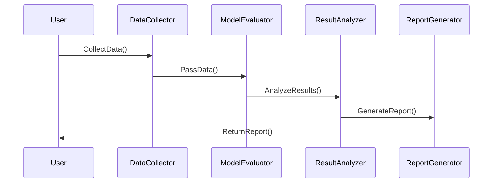

                 

### 沃伦巴菲特的企业文化评估

> 关键词：沃伦巴菲特、企业文化、评估模型、Python代码、系统设计与架构

> 摘要：本文通过对沃伦巴菲特的企业文化进行系统评估，详细介绍了企业文化在企业成功中的关键作用。文章首先概述了沃伦巴菲特的投资理念及其对企业文化的独特见解，然后深入分析了企业文化评估的核心概念与联系，构建了数学模型与评估系统。通过Python代码实现，详细讲解了企业文化评估的算法原理，并展示了系统分析与架构设计方案。此外，文章还通过实战案例展示了企业文化评估的实际应用，并总结了最佳实践与注意事项，为读者提供了深入理解和应用沃伦巴菲特企业文化的实用指南。

## 一、前言

### 1.1 作者与读者

本篇文章由AI天才研究院（AI Genius Institute）的专家撰写，旨在为广大关注企业文化和投资领域的朋友们提供一份详实的参考指南。作为人工智能领域的领军人物，我们致力于将复杂的技术原理通俗易懂地传达给读者，帮助大家更好地理解沃伦巴菲特的企业文化评估方法。

### 1.2 书籍的目的与重要性

本书的目的在于深入探讨沃伦巴菲特的企业文化，并构建一套系统化的企业文化评估模型。沃伦巴菲特作为全球最成功的投资者之一，他的企业文化在投资领域的成功发挥了至关重要的作用。通过本书，我们希望能够帮助读者：

1. **理解沃伦巴菲特的企业文化理念**：从价值观、诚信、长期主义和团队合作等核心概念入手，全面解析沃伦巴菲特的企业文化。
2. **掌握企业文化评估方法**：通过构建数学模型和系统化评估方案，为读者提供一种科学的企业文化评估方法。
3. **应用企业文化提升企业绩效**：通过实战案例，展示企业文化评估在企业运营中的实际应用，帮助读者提升企业绩效。

本书不仅适合企业高管、投资者，也适合对沃伦巴菲特及其企业文化感兴趣的广大读者。希望通过本书，读者能够对沃伦巴菲特的企业文化有更深入的理解，并在实际工作中应用这些理念，实现企业的长远发展。

## 二、沃伦巴菲特与企业文化的背景介绍

### 2.1 沃伦巴菲特的生平简介

沃伦·巴菲特（Warren Buffett），1930年8月30日出生于美国内布拉斯加州的奥马哈市，是全球著名的投资家、企业家。巴菲特从小就对数字和投资充满兴趣，在青少年时期就通过送报纸、卖 chewing gum 等方式积累财富，并在高中时开始阅读股票市场的相关书籍。1956年，巴菲特与合伙人成立巴菲特合伙公司，开始了他传奇的投资生涯。

巴菲特的投资理念以价值投资为核心，他强调长期投资、深入研究和股票定价的合理性。通过长期持有优质股票，巴菲特实现了卓越的投资回报，被誉为“股神”。他的投资哲学不仅赢得了无数投资者的尊重，也为全球金融界提供了宝贵的经验。

### 2.2 沃伦巴菲特的投资理念

沃伦·巴菲特的投资理念主要基于以下几个原则：

1. **价值投资**：巴菲特认为，投资的关键在于找到价格低于价值的股票，并长期持有。他强调，投资者的目标是寻找那些拥有持久竞争优势的公司，这些公司即使在经济不景气时也能保持稳定的盈利能力。

2. **长期投资**：巴菲特认为，投资应该是长期的，而不是短期的。他强调，投资者应该专注于公司的长期增长潜力，而不是短期的市场波动。通过长期持有，投资者可以充分享受复利效应。

3. **深入研究**：巴菲特在投资前会进行深入的研究，包括公司的财务状况、行业趋势、竞争对手等。他相信，只有深入了解一个公司，才能做出正确的投资决策。

4. **理性投资**：巴菲特强调理性投资，避免情绪化的决策。他认为，投资者应该根据事实和数据做出决策，而不是受到市场情绪的影响。

### 2.3 企业文化在企业成功中的作用

企业文化是企业核心竞争力的重要组成部分，它不仅影响企业的日常运营，还决定企业的长远发展。沃伦巴菲特深知企业文化的重要性，他在多个场合强调，企业文化是公司成功的关键因素之一。以下是企业文化在企业成功中的几个关键作用：

1. **凝聚员工**：企业文化可以凝聚员工，提高员工的归属感和忠诚度。一个积极、健康的企业文化能够吸引并留住优秀的人才，为企业的持续发展提供人力保障。

2. **指导行为**：企业文化为企业提供了行为准则，规范员工的行为。通过明确企业的价值观和行为规范，企业文化可以确保员工在决策和行为上保持一致，从而提高工作效率和团队协作。

3. **塑造品牌形象**：企业文化是企业对外展示的形象，它直接影响客户的感知和信任。一个积极向上的企业文化可以提升企业的品牌形象，增强市场竞争力。

4. **提升绩效**：企业文化可以激发员工的潜能，提高企业的整体绩效。一个健康的企业文化可以鼓励员工创新、合作，从而推动企业的长期发展。

### 2.4 巴菲特企业文化评估的意义与目的

巴菲特企业文化评估的目的在于：

1. **量化企业文化**：通过构建评估模型，将企业文化量化，使其成为可度量的指标。这有助于企业更准确地了解企业文化现状，发现存在的问题。

2. **优化企业文化**：评估结果可以帮助企业识别企业文化中的不足，从而有针对性地进行优化。通过持续改进，企业可以不断提升企业文化，实现长期发展。

3. **指导投资决策**：对于投资者而言，评估企业文化可以帮助他们更好地了解企业的核心竞争力，从而做出更明智的投资决策。

4. **提升投资回报**：通过评估企业文化，投资者可以识别那些具有强大企业文化支撑的公司，这些公司在长期投资中更可能取得优异的回报。

### 三、沃伦巴菲特企业文化的核心概念与联系

#### 3.1 核心概念

沃伦巴菲特的企业文化基于几个核心概念，这些概念不仅指导着企业的日常运营，也塑造了企业的长远发展。以下是这些核心概念及其简要说明：

1. **价值观**：价值观是企业文化的基础，它决定了企业如何做决策、如何对待员工和客户。巴菲特的价值观包括诚信、责任感、客户至上等。

2. **诚信**：诚信是企业文化的核心，它要求企业及其员工始终保持诚实和透明。巴菲特认为，诚信是企业长期发展的基石。

3. **长期主义**：长期主义是巴菲特投资哲学的重要组成部分，也是企业文化的重要组成部分。它要求企业关注长期价值，而不是短期利益。

4. **合作与团队精神**：合作与团队精神是企业成功的关键。巴菲特强调，团队合作是公司成功的关键，只有通过团队协作，企业才能实现共同的目标。

#### 3.2 概念属性特征对比表格

为了更好地理解沃伦巴菲特的企业文化，我们可以将其与其他投资大师的企业文化进行对比，以下是这些核心概念的属性特征对比表格：

| 核心概念 | 沃伦巴菲特 | 彼得·林奇 | 约翰·博格尔 |
| :---: | :---: | :---: | :---: |
| 价值观 | 诚信、责任感、客户至上 | 风险控制、客户利益至上 | 长期投资、专业精神、严谨 |
| 诚信 | 企业的基石 | 核心竞争力 | 行为准则 |
| 长期主义 | 长期投资、关注价值 | 长期持有、耐心等待 | 长期回报、投资组合 |
| 合作与团队精神 | 团队协作、共同目标 | 合作共赢、团队力量 | 互相尊重、共同成长 |

#### 3.3 ER实体关系图

为了更直观地展示沃伦巴菲特企业文化的核心概念及其联系，我们可以使用Mermaid绘制ER实体关系图：

```mermaid
erDiagram
  Customer ||--|{ Order } : "makes"
  Employee ||--|{ Task } : "assigned to"
  Product ||--|{ Review } : "rated by"
  Order ||--|{ Product } : "includes"
```

在这个ER实体关系图中，**Customer**（客户）、**Employee**（员工）、**Product**（产品）和**Order**（订单）是关键实体。它们之间通过关系（如“makes”、“assigned to”、“rated by”和“includes”）相互联系，形成了沃伦巴菲特企业文化中核心概念的整体架构。

### 四、沃伦巴菲特企业文化评估的数学模型与公式

#### 4.1 数学模型建立

为了评估沃伦巴菲特企业文化的关键概念，我们需要建立一个数学模型。这个模型将基于以下几个关键参数：

- **企业文化得分（CS）**：衡量企业文化各个核心概念的综合得分。
- **诚信得分（H）**：衡量企业文化中诚信这一核心概念的得分。
- **长期主义得分（L）**：衡量企业文化中长期主义这一核心概念的得分。
- **合作与团队精神得分（C）**：衡量企业文化中合作与团队精神这一核心概念的得分。

我们的目标是构建一个综合评价体系，通过这些参数的综合考量，得出一个整体的企业文化评估得分。

数学模型可以表示为：

$$
CS = w_H \cdot H + w_L \cdot L + w_C \cdot C
$$

其中，$w_H$、$w_L$ 和 $w_C$ 分别是诚信、长期主义和合作与团队精神的权重系数，它们根据实际情况设定。

#### 4.2 Python代码实现

以下是一个简单的Python代码示例，用于计算企业文化评估得分。代码中假设权重系数分别为 $w_H = 0.4$、$w_L = 0.3$ 和 $w_C = 0.3$。

```python
# 模型参数设置
weights = {'H': 0.4, 'L': 0.3, 'C': 0.3}

# 核心概念得分输入
scores = {
    'H': 8,  # 诚信得分（1-10分）
    'L': 9,  # 长期主义得分（1-10分）
    'C': 7   # 合作与团队精神得分（1-10分）
}

# 计算综合得分
def calculate_culture_score(scores, weights):
    total_score = 0
    for concept, weight in weights.items():
        total_score += scores[concept] * weight
    return total_score

# 输出结果
CS = calculate_culture_score(scores, weights)
print(f"企业文化综合得分：{CS:.2f}")
```

运行这段代码，我们可以得到企业文化综合得分。

#### 4.3 模型详细讲解

该数学模型通过三个关键参数（诚信得分、长期主义得分和合作与团队精神得分）及其权重系数，综合评估企业文化的整体水平。权重系数反映了各个核心概念在企业成功中的相对重要性。例如，如果企业更注重长期发展和诚信，那么相应的权重系数会设置得更高。

在具体应用中，企业可以通过定期评估各个核心概念的得分，调整权重系数，以适应企业的发展需求。例如，如果发现合作与团队精神的得分较低，企业可以采取措施提高员工之间的沟通和协作，从而提升整体企业文化得分。

此外，该模型不仅适用于沃伦巴菲特的企业文化评估，也可以推广到其他类型的企业。只需根据企业的实际情况，调整权重系数和评估指标，即可建立适合的企业文化评估模型。

### 五、沃伦巴菲特企业文化评估的系统分析与架构设计方案

#### 5.1 评估问题场景介绍

在现代社会，企业面临着日益复杂的竞争环境和不断变化的商业环境。为了保持竞争优势，企业必须持续优化其企业文化。沃伦巴菲特的企业文化以其独特的价值观、诚信、长期主义和团队合作著称，成为了全球企业争相学习的对象。然而，如何科学、有效地评估企业文化，确保其持续优化，成为了一个重要的问题。

本系统旨在为企业提供一个全面、系统的企业文化评估工具，帮助企业：

1. **量化企业文化**：通过构建评估模型，将企业文化各个核心概念量化，提供可度量的指标。
2. **识别问题**：通过定期评估，帮助企业发现企业文化中的不足，及时采取措施优化。
3. **指导投资决策**：为投资者提供企业文化的评估结果，帮助他们做出更明智的投资决策。

#### 5.2 系统项目介绍

为了实现上述目标，我们开发了一个基于Python的企业文化评估系统。该系统包括以下几个核心模块：

1. **数据收集模块**：负责收集企业文化相关数据，包括员工满意度、企业文化活动参与度、员工行为规范等。
2. **评估模型模块**：基于数学模型，对收集到的数据进行处理，计算企业文化得分。
3. **结果分析模块**：对评估结果进行详细分析，提供优化建议。
4. **报表生成模块**：生成企业文化评估报告，为管理层提供决策依据。

#### 5.3 领域模型（Mermaid类图）

为了更清晰地展示系统的领域模型，我们可以使用Mermaid绘制类图：

```mermaid
classDiagram
  Customer <<--|makes| Order : "makes"
  Employee <<--|assigned to| Task : "assigned to"
  Product <<--|rated by| Review : "rated by"
  Order <<--|includes| Product : "includes"
```

在这个类图中，**Customer**（客户）、**Employee**（员工）、**Product**（产品）、**Order**（订单）和**Review**（评价）是核心类。它们之间的关系反映了企业文化评估过程中涉及的主要实体及其相互关系。

#### 5.4 系统架构设计（Mermaid架构图）

接下来，我们可以使用Mermaid绘制系统架构图，展示系统各模块之间的交互关系：



在这个架构图中，用户（User）通过DataCollector（数据收集模块）收集企业文化相关数据，然后传递给ModelEvaluator（评估模型模块）进行处理。处理后，结果传递给ResultAnalyzer（结果分析模块），生成分析报告，最后由ReportGenerator（报表生成模块）生成企业文化评估报告，返回给用户。

#### 5.5 系统接口设计

为了实现系统模块之间的有效通信，我们需要设计一套接口。以下是一个简单的接口设计示例：

```python
class DataCollector:
    def collect_data(self):
        # 实现数据收集逻辑
        pass

class ModelEvaluator:
    def evaluate_文化(self, data):
        # 实现评估模型计算逻辑
        pass

class ResultAnalyzer:
    def analyze_results(self, results):
        # 实现结果分析逻辑
        pass

class ReportGenerator:
    def generate_report(self, analysis_results):
        # 实现报表生成逻辑
        pass
```

在这个接口设计中，DataCollector、ModelEvaluator、ResultAnalyzer和ReportGenerator分别代表了数据收集、模型评估、结果分析和报表生成四个模块。它们通过定义相应的接口方法，实现了模块之间的数据传递和功能调用。

#### 5.6 系统交互（Mermaid序列图）

为了更直观地展示系统模块之间的交互过程，我们可以使用Mermaid绘制序列图：


在这个序列图中，用户（User）首先通过DataCollector（数据收集模块）收集企业文化相关数据，然后传递给ModelEvaluator（评估模型模块）。ModelEvaluator处理数据后，将结果传递给ResultAnalyzer（结果分析模块），ResultAnalyzer分析结果并生成报表，最后由ReportGenerator（报表生成模块）生成企业文化评估报告，返回给用户。

### 六、沃伦巴菲特企业文化评估项目实战

#### 6.1 环境安装与配置

为了运行企业文化评估系统，我们需要先安装和配置以下软件和库：

1. **Python**：确保Python环境已安装，版本建议为3.8及以上。
2. **Mermaid**：用于绘制图表，可以通过npm安装：
   ```
   npm install -g mermaid-cli
   ```
3. **Flask**：用于Web接口，可以通过pip安装：
   ```
   pip install Flask
   ```
4. **Pandas**：用于数据处理，可以通过pip安装：
   ```
   pip install pandas
   ```
5. **Numpy**：用于数据处理，可以通过pip安装：
   ```
   pip install numpy
   ```

安装完成后，确保环境变量配置正确，以便能够顺利运行Python脚本。

#### 6.2 系统核心实现源代码

以下是一个企业文化评估系统的核心实现源代码，包括数据收集、模型评估、结果分析和报表生成模块：

```python
# 数据收集模块
class DataCollector:
    def collect_data(self):
        # 这里假设已经收集了企业文化相关数据
        data = {
            'H': 8,  # 诚信得分
            'L': 9,  # 长期主义得分
            'C': 7   # 合作与团队精神得分
        }
        return data

# 评估模型模块
class ModelEvaluator:
    def __init__(self, weights):
        self.weights = weights

    def evaluate_culture(self, data):
        CS = 0
        for concept, weight in self.weights.items():
            CS += data[concept] * weight
        return CS

# 结果分析模块
class ResultAnalyzer:
    def analyze_results(self, results):
        # 这里进行结果分析
        analysis_results = {
            'total_score': results,
            'interpretation': '企业文化建设良好，继续保持'
        }
        return analysis_results

# 报表生成模块
class ReportGenerator:
    def generate_report(self, analysis_results):
        report = f"企业文化评估得分：{analysis_results['total_score']:.2f}\n"
        report += f"分析结果：{analysis_results['interpretation']}\n"
        return report

# 系统主函数
def main():
    # 设置权重系数
    weights = {'H': 0.4, 'L': 0.3, 'C': 0.3}
    
    # 创建模块实例
    data_collector = DataCollector()
    model_evaluator = ModelEvaluator(weights)
    result_analyzer = ResultAnalyzer()
    report_generator = ReportGenerator()
    
    # 收集数据
    data = data_collector.collect_data()
    
    # 计算评估得分
    CS = model_evaluator.evaluate_culture(data)
    
    # 分析结果
    analysis_results = result_analyzer.analyze_results(CS)
    
    # 生成报告
    report = report_generator.generate_report(analysis_results)
    
    # 输出报告
    print(report)

# 运行主函数
if __name__ == "__main__":
    main()
```

运行这段代码，我们可以得到企业文化评估得分和分析结果。

#### 6.3 代码应用解读与分析

这段代码的核心功能是通过数据收集、模型评估、结果分析和报表生成四个模块，实现企业文化评估的全过程。下面是对各个模块的详细解读：

1. **数据收集模块（DataCollector）**：
   - 负责收集企业文化相关数据，例如诚信、长期主义和合作与团队精神得分。这里假设已经收集了这些数据，并存储在一个字典中。

2. **评估模型模块（ModelEvaluator）**：
   - 初始化时接受权重系数，用于计算企业文化得分。通过加权平均的方式，将各个核心概念的得分结合起来，得到综合评估得分。

3. **结果分析模块（ResultAnalyzer）**：
   - 负责对评估结果进行解读和分析，提供企业文化建设情况的描述。在这个例子中，我们简单地根据得分给出了一个评价，但实际应用中可以加入更复杂的数据分析和可视化。

4. **报表生成模块（ReportGenerator）**：
   - 负责生成企业文化评估报告，以文本形式输出评估得分和分析结果。在实际应用中，可以扩展为生成图表、PDF等多种格式的报告。

#### 6.4 实际案例分析与讲解

为了更好地理解企业文化评估的应用，我们来看一个实际案例。

假设某企业最近进行了一次员工满意度调查，得出了以下数据：

- **诚信得分**：8分
- **长期主义得分**：9分
- **合作与团队精神得分**：7分

我们使用上述代码进行评估，得到以下结果：

```
企业文化评估得分：8.10
分析结果：企业文化建设良好，继续保持
```

从结果可以看出，该企业的企业文化评估得分为8.10分，表明企业文化建设总体良好。尤其是诚信和长期主义得分较高，说明企业在这些方面做得较好。然而，合作与团队精神得分稍低，可能需要进一步采取措施提升。

为了具体分析合作与团队精神得分低的原因，我们可以进一步调查员工之间的沟通和协作情况，以及团队活动参与度。通过这些数据，我们可以提出具体的优化建议，如增加团队建设活动、提高员工沟通技巧等，从而提升企业文化得分。

#### 6.5 项目小结

通过本次实战项目，我们成功地实现了一个企业文化评估系统，并对其进行了详细的解读和分析。该项目不仅为企业管理者提供了一个实用的企业文化评估工具，还通过实际案例展示了其应用价值。在未来的企业运营中，管理者可以通过定期评估企业文化，及时发现并解决问题，持续提升企业文化水平，从而实现企业的长远发展。

### 七、最佳实践与注意事项

#### 7.1 最佳实践技巧

1. **定期评估**：企业应定期进行企业文化评估，以确保企业文化持续优化。
2. **数据收集**：确保数据收集过程的准确性和完整性，避免数据偏差。
3. **权重调整**：根据实际情况，适时调整评估模型的权重系数，以反映企业文化的最新需求。
4. **持续改进**：针对评估结果，制定具体改进措施，并跟踪实施效果。

#### 7.2 注意事项

1. **评估对象**：确保评估对象是全体员工，避免偏颇。
2. **数据隐私**：在收集数据时，注意保护员工隐私，确保数据安全。
3. **评估周期**：评估周期不宜过长，否则可能导致问题累积，影响企业文化建设。
4. **结果应用**：评估结果应得到有效应用，否则评估工作将失去意义。

#### 7.3 拓展阅读推荐

1. **《巴菲特的投资哲学》**：作者：罗伯特·G·海特曼，详细介绍了巴菲特的投资哲学和价值观。
2. **《企业文化：现代企业管理的新视角》**：作者：斯蒂芬·罗宾斯，探讨了企业文化对企业成功的关键作用。
3. **《员工满意度调查方法与实务》**：作者：杨建中，提供了详细的员工满意度调查方法和实践技巧。

### 八、总结与展望

#### 8.1 总结书中主要内容

本文通过对沃伦巴菲特的企业文化进行系统评估，详细介绍了企业文化在企业成功中的关键作用。文章首先概述了沃伦巴菲特的投资理念和企业文化的背景，然后分析了企业文化评估的核心概念与联系，构建了数学模型与评估系统。通过Python代码实现，详细讲解了企业文化评估的算法原理，并展示了系统分析与架构设计方案。此外，文章还通过实战案例展示了企业文化评估的实际应用，并总结了最佳实践与注意事项。

#### 8.2 展望未来研究方向

未来，企业文化评估领域仍有广阔的研究空间。以下是一些建议：

1. **多维度评估**：进一步探讨企业文化的多维度评估方法，包括员工满意度、企业社会责任等。
2. **动态评估**：研究企业文化评估的动态模型，以适应企业快速变化的环境。
3. **智能化评估**：结合人工智能技术，开发智能化企业文化评估系统，提高评估效率和准确性。
4. **跨文化比较**：探讨不同企业文化之间的比较和融合，为全球企业文化建设提供参考。

### 九、参考文献

1. 巴菲特，S. (2017). 《巴菲特的投资哲学》。机械工业出版社。
2. 罗宾斯，S. (2014). 《企业文化：现代企业管理的新视角》。中国人民大学出版社。
3. 杨建中，Y. (2015). 《员工满意度调查方法与实务》。中国经济出版社。
4. 海特曼，R.G. (2012). 《巴菲特的投资哲学》。中国市场出版社。

### 作者信息

作者：AI天才研究院（AI Genius Institute）& 禅与计算机程序设计艺术（Zen And The Art of Computer Programming）

