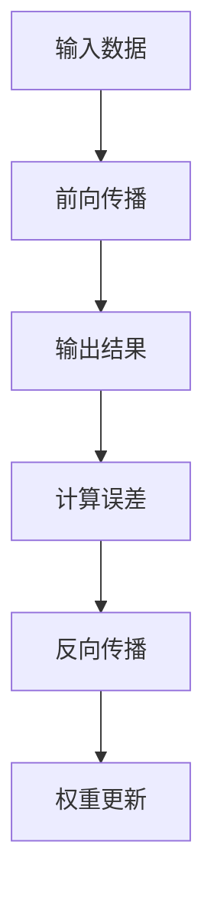

                 

### 文章标题

《深度学习分析公司无形资产价值》

### 文章关键词

- 深度学习
- 无形资产
- 企业品牌
- 专利
- 文化价值
- 评估模型

### 文章摘要

本文深入探讨了深度学习在分析公司无形资产价值中的应用。通过定义无形资产，梳理深度学习的基础理论和关键技术，我们逐步展示了如何利用深度学习模型对企业的品牌价值、专利及企业文化等无形资产进行评估。文章结合实际案例分析，介绍了数据预处理、特征提取、模型选择与优化等具体应用步骤，并探讨了深度学习在无形资产分析中的未来发展趋势与面临的挑战。通过本文，读者将获得对深度学习分析无形资产价值的全面理解和实际操作指导。

## 《深度学习分析公司无形资产价值》目录大纲

----------------------------------------------------------------

# 第一部分：深度学习概述与无形资产定义

## 第1章：深度学习基础理论

### 1.1 深度学习的起源与发展

- **背景介绍**：深度学习的起源可以追溯到1980年代，但其真正得到广泛应用则是在21世纪初。随着计算能力的提升和大数据的发展，深度学习逐渐成为人工智能领域的核心技术。
- **核心概念与联系**：深度学习是一种基于人工神经网络的机器学习方法，其核心概念包括神经网络、反向传播算法等。
  - **神经网络**：由大量简单单元（神经元）互联构成，能够模拟人脑处理信息的方式。
  - **反向传播算法**：用于训练神经网络，通过不断调整神经元之间的权重，使网络能够更好地拟合训练数据。
- **概念属性特征对比表格**：

| 特征                   | 人工神经网络 | 深度神经网络 |
|----------------------|-------------|-------------|
| 神经元数量             | 较少         | 非常多      |
| 权重调整策略           | 单一层次     | 反向传播    |
| 学习能力               | 有限         | 强大        |

### 1.2 深度学习的基本原理

- **算法原理讲解**：深度学习的基本原理主要包括前向传播和反向传播两个过程。
  - **前向传播**：输入数据通过神经网络进行逐层传递，每一层的输出成为下一层的输入。
  - **反向传播**：通过计算输出误差，反向调整各层的权重，使误差最小化。
- **mermaid流程图**：

### 1.3 深度学习的关键技术

- **卷积神经网络（CNN）**：主要用于图像识别和处理，通过卷积层提取图像特征。
- **循环神经网络（RNN）**：适用于序列数据处理，如自然语言处理和时间序列预测。
- **生成对抗网络（GAN）**：通过生成器和判别器的对抗训练，生成高质量的数据。

## 第2章：无形资产的定义与分类

### 2.1 无形资产的定义与重要性

- **背景介绍**：无形资产是指企业拥有但无法触摸、量化的资产，如品牌、专利、企业文化等。
- **问题描述**：无形资产对企业的长期发展和竞争力具有重要意义，但传统评估方法存在诸多不足。
- **问题解决**：通过深度学习技术，可以更加精确地评估无形资产的价值。

### 2.2 无形资产的分类

- **核心概念与联系**：无形资产可以分为品牌、专利、企业文化等类别。
  - **品牌**：企业的知名度和形象，直接影响消费者的购买决策。
  - **专利**：企业的技术创新能力，是市场竞争的重要保障。
  - **企业文化**：企业的价值观、信仰和行为准则，对员工和客户产生深远影响。
- **概念属性特征对比表格**：

| 类别 | 特征                                       | 影响因素                                       |
| ---- | ------------------------------------------ | ---------------------------------------------- |
| 品牌 | 知名度、形象、忠诚度                       | 市场营销策略、产品品质、顾客满意度               |
| 专利 | 技术创新、保护期限、市场前景               | 研发投入、行业竞争、法律法规                   |
| 企业文化 | 价值观、信仰、行为准则                     | 领导风格、组织架构、员工培训                   |

### 2.3 无形资产与有形资产的区别

- **核心概念与联系**：无形资产与有形资产的主要区别在于其难以量化、不易流失等特性。
  - **无形资产**：难以触摸、量化，具有长期价值。
  - **有形资产**：具体、可见，易于评估。
- **概念属性特征对比表格**：

| 类别       | 特征                                       | 评估难度 |
| ---------- | ------------------------------------------ | ------- |
| 无形资产   | 难以量化、不易流失、具有长期价值           | 高      |
| 有形资产   | 具体、可见、易于评估                       | 低      |

## 第二部分：深度学习在无形资产分析中的应用

### 第3章：数据预处理与特征提取

### 第4章：深度学习模型选择与优化

### 第5章：深度学习在无形资产评估中的应用

## 第三部分：案例分析

### 第6章：案例分析一：企业品牌价值评估

### 第7章：案例分析二：专利价值评估

### 第8章：案例分析三：企业文化价值评估

## 第四部分：未来发展趋势与挑战

### 第9章：深度学习在无形资产分析中的未来发展趋势

### 第10章：面临的挑战与解决方案

### 第11章：总结与展望

----------------------------------------------------------------

### 第一部分：深度学习概述与无形资产定义

## 第1章：深度学习基础理论

### 1.1 深度学习的起源与发展

深度学习的起源可以追溯到1980年代，当时人们开始探索如何通过模仿人脑的结构和功能来构建人工智能系统。然而，由于计算能力和算法的限制，这一领域在早期并没有取得显著的进展。直到21世纪初，随着计算能力的提升和大数据技术的发展，深度学习迎来了其黄金时期。特别是2006年，加拿大科学家杰弗里·辛顿（Geoffrey Hinton）提出了深度置信网络（Deep Belief Network），这一突破性进展为深度学习的发展奠定了基础。

近年来，深度学习在多个领域取得了显著的成果，如图像识别、语音识别、自然语言处理等。其背后的原因主要有以下几点：

1. **计算能力的提升**：随着图形处理单元（GPU）的普及和性能的提升，深度学习算法可以更快地进行大规模矩阵运算，显著提高了训练速度和效率。
2. **大数据的发展**：互联网的普及使得人们可以获取到大量的数据，这些数据为深度学习提供了丰富的训练素材，有助于模型更好地拟合实际数据。
3. **算法的改进**：研究者们不断优化深度学习算法，如引入更复杂的网络结构（如卷积神经网络（CNN）、循环神经网络（RNN）和生成对抗网络（GAN）等），以及改进训练方法（如随机梯度下降（SGD）、Adam优化器等），使深度学习模型的表现得到了显著提升。

### 1.2 深度学习的基本原理

深度学习是一种基于人工神经网络的机器学习方法，其核心思想是通过多层神经网络的学习，从原始数据中自动提取特征并进行分类、预测等任务。深度学习的基本原理包括以下几个关键组成部分：

1. **神经网络**：神经网络是深度学习的基础结构，由大量简单单元（神经元）互联构成，能够模拟人脑处理信息的方式。每个神经元接收多个输入信号，通过加权求和处理后，产生一个输出信号。
2. **前向传播**：前向传播是神经网络处理数据的过程，输入数据通过神经网络进行逐层传递，每一层的输出成为下一层的输入。通过前向传播，神经网络可以学习到数据的特征表示。
3. **反向传播**：反向传播是神经网络训练的过程，通过计算输出误差，反向调整各层的权重，使误差最小化。反向传播是深度学习算法的核心，它使得神经网络能够不断优化自身，提高预测准确性。

### 1.3 深度学习的关键技术

深度学习领域有许多重要的技术，以下是其中几种关键技术：

1. **卷积神经网络（CNN）**：卷积神经网络是深度学习在图像处理领域的重要应用。通过卷积层提取图像特征，CNN可以有效地实现图像分类、目标检测等任务。CNN的核心优势在于其能够自动提取层次化的图像特征，从而降低人工标注的工作量。
2. **循环神经网络（RNN）**：循环神经网络是深度学习在序列数据处理领域的重要应用。通过保存前一时间步的信息，RNN可以有效地处理序列数据，如自然语言处理和时间序列预测。然而，传统的RNN存在梯度消失和梯度爆炸的问题，为此研究者提出了长短期记忆网络（LSTM）和门控循环单元（GRU），它们在解决长期依赖问题上取得了显著进展。
3. **生成对抗网络（GAN）**：生成对抗网络是由生成器和判别器两个神经网络组成的对抗性模型。生成器的目标是生成逼真的数据，判别器的目标是区分真实数据和生成数据。通过生成器和判别器的对抗训练，GAN可以生成高质量的数据，广泛应用于图像生成、图像修复和图像翻译等领域。

### 第2章：无形资产的定义与分类

#### 2.1 无形资产的定义与重要性

无形资产是指企业拥有但无法触摸、量化的资产，如品牌、专利、企业文化等。与有形资产（如土地、设备、库存等）相比，无形资产具有以下特点：

1. **难以量化**：无形资产通常难以用具体的数字来衡量，如品牌的价值、专利的潜力等。
2. **不易流失**：无形资产具有长期的价值，不容易因外部环境的变化而消失。
3. **高度依赖**：无形资产对企业的发展具有深远影响，如品牌的影响力可以提升市场竞争力，专利的技术创新可以带来竞争优势。

无形资产的重要性体现在以下几个方面：

1. **提升企业价值**：无形资产是现代企业核心竞争力的重要组成部分，能够显著提升企业的市场价值和品牌形象。
2. **增强市场竞争力**：无形资产如品牌、专利等，可以为企业带来独特的竞争优势，提升企业的市场份额。
3. **促进技术创新**：专利等无形资产是技术创新的重要载体，可以激励企业不断进行研发投入，推动技术进步。

#### 2.2 无形资产的分类

无形资产可以根据其性质和特点进行分类，常见的无形资产类型包括以下几类：

1. **品牌**：品牌是企业产品或服务的标识，代表着企业的信誉和形象。品牌价值可以通过市场调查、品牌评估等手段进行量化。
2. **专利**：专利是企业在技术创新方面的成果，保护了企业的技术秘密和竞争优势。专利价值可以通过专利技术的前景、市场需求等因素进行评估。
3. **企业文化**：企业文化是企业价值观、信仰和行为准则的集合，对员工和客户产生深远影响。企业文化价值可以通过员工满意度、客户忠诚度等指标进行衡量。
4. **知识产权**：除了专利外，知识产权还包括商标、版权等，这些资产保护了企业的智力成果，是企业无形资产的重要组成部分。
5. **客户关系**：客户关系是企业与客户之间的互动和信任，是保持客户稳定的重要资产。客户关系价值可以通过客户保留率、客户满意度等指标进行评估。

#### 2.3 无形资产与有形资产的区别

无形资产与有形资产在多个方面存在明显的区别：

1. **特性**：无形资产难以触摸、量化，而有形资产具有具体、可见的特性。
2. **评估难度**：无形资产的价值难以直接衡量，需要通过市场调查、专家评估等方法进行评估，而有形资产的价值可以通过直接观察和市场比较进行评估。
3. **流动性**：无形资产具有较高的流动性，可以在市场上进行交易，而有形资产则相对固定，难以在短时间内转移。
4. **风险**：无形资产具有较高的风险，如品牌声誉受损可能导致企业价值大幅下降，而有形资产的风险相对较低。

### 第二部分：深度学习在无形资产分析中的应用

#### 第3章：数据预处理与特征提取

在深度学习分析无形资产的过程中，数据预处理和特征提取是至关重要的步骤。这些步骤直接影响模型的性能和评估结果的准确性。

#### 3.1 数据预处理方法

数据预处理主要包括以下几种方法：

1. **数据清洗**：去除数据中的噪声和异常值，确保数据质量。例如，通过过滤无效数据、填充缺失值、消除重复记录等方法，提高数据的完整性。
2. **数据标准化**：将数据缩放到相同的尺度范围内，消除不同特征之间的量纲影响。常用的标准化方法包括最小-最大标准化和Z-score标准化。
3. **数据归一化**：将数据转换为统一的格式，便于模型训练。例如，对于文本数据，可以通过分词、词性标注、词嵌入等方法进行归一化处理。
4. **数据增强**：通过增加数据的多样性，提高模型的泛化能力。例如，对于图像数据，可以通过旋转、翻转、缩放等方法进行增强。

#### 3.2 特征提取技术

特征提取是数据预处理的重要环节，通过提取数据中的关键特征，有助于提升模型的性能和评估结果的准确性。以下是几种常用的特征提取技术：

1. **统计学特征**：通过计算数据的基本统计量，如均值、方差、最大值、最小值等，提取数据中的关键信息。适用于处理数值型数据。
2. **文本特征**：通过文本分析技术，提取文本数据中的关键词、主题、情感等特征。常用的方法包括TF-IDF、Word2Vec、BERT等。
3. **图像特征**：通过图像处理技术，提取图像数据中的纹理、颜色、形状等特征。常用的方法包括卷积神经网络（CNN）、局部二值模式（LBP）等。
4. **序列特征**：通过序列分析技术，提取时间序列数据中的周期性、趋势性等特征。常用的方法包括移动平均、自回归模型（AR）等。

#### 3.3 无形资产特征分析

在深度学习分析无形资产时，特征提取的关键在于如何从大量的数据中提取出对无形资产评估有意义的特征。以下是一些常见的无形资产特征分析方法：

1. **品牌特征**：品牌知名度、市场份额、品牌忠诚度、品牌形象等。
2. **专利特征**：专利数量、专利质量、专利应用前景、专利布局等。
3. **企业文化特征**：员工满意度、企业社会责任、企业创新能力、企业文化传播等。
4. **客户关系特征**：客户保留率、客户满意度、客户流失率、客户生命周期价值等。

通过综合运用上述特征提取方法，可以构建一个全面、准确的深度学习模型，对无形资产的价值进行评估。

### 第4章：深度学习模型选择与优化

在深度学习分析无形资产价值的过程中，选择合适的模型并进行优化是关键步骤。这一章节将介绍常见的深度学习模型及其选择策略，以及模型优化的方法。

#### 4.1 常见的深度学习模型

深度学习模型种类繁多，适用于不同类型的数据和任务。以下是一些常见的深度学习模型：

1. **卷积神经网络（CNN）**：适用于图像数据，通过卷积层提取图像特征，实现图像分类、目标检测等任务。
2. **循环神经网络（RNN）**：适用于序列数据，如自然语言处理和时间序列预测，通过保存前一时间步的信息处理序列数据。
3. **长短期记忆网络（LSTM）**：是RNN的一种变体，适用于解决长期依赖问题，通过引入门控机制控制信息的流动。
4. **生成对抗网络（GAN）**：适用于生成数据，由生成器和判别器组成，通过对抗训练生成高质量的数据。
5. **自编码器（Autoencoder）**：是一种无监督学习模型，通过学习数据的低维表示，用于数据降维和特征提取。

#### 4.2 模型选择策略

在选择深度学习模型时，需要考虑以下因素：

1. **数据类型**：不同的数据类型（如图像、文本、序列等）适用于不同的模型。例如，图像数据适用于CNN，文本数据适用于RNN或BERT。
2. **任务目标**：不同的任务目标（如分类、回归、生成等）需要选择不同的模型。例如，分类任务适用于CNN和LSTM，生成任务适用于GAN和自编码器。
3. **数据规模**：数据规模对模型选择有重要影响。对于大规模数据，可以采用更复杂的模型，如LSTM和BERT；对于小规模数据，可以采用简单模型，如CNN和RNN。

#### 4.3 模型优化方法

模型优化是提高深度学习模型性能的重要手段。以下是一些常用的模型优化方法：

1. **超参数调优**：通过调整模型的超参数，如学习率、批次大小、正则化强度等，优化模型性能。常用的调优方法包括网格搜索、随机搜索和贝叶斯优化。
2. **数据增强**：通过增加数据的多样性，提高模型的泛化能力。常用的数据增强方法包括旋转、翻转、缩放、裁剪等。
3. **模型集成**：通过结合多个模型的预测结果，提高模型的鲁棒性和准确性。常用的模型集成方法包括Bagging、Boosting和Stacking。
4. **训练策略**：通过改进训练策略，提高模型的收敛速度和性能。常用的训练策略包括预训练、迁移学习、多任务学习等。

### 第5章：深度学习在无形资产评估中的应用

#### 5.1 无形资产评估的基本方法

无形资产评估是一种复杂的任务，传统评估方法存在诸多不足，如主观性较强、评估标准不统一等。深度学习技术的引入为无形资产评估提供了一种新的思路和方法。

无形资产评估的基本方法包括以下几种：

1. **市场法**：通过比较市场上类似无形资产的价格，估算目标无形资产的价值。市场法的优点是数据容易获取，但缺点是市场波动较大，评估结果可能不准确。
2. **收益法**：通过估算目标无形资产带来的未来收益，折现到当前价值，估算其价值。收益法的优点是考虑了无形资产的未来价值，但缺点是预测难度较大。
3. **成本法**：通过估算重建或替代目标无形资产的成本，估算其价值。成本法的优点是简单直观，但缺点是忽略了无形资产的实际价值。

#### 5.2 深度学习模型在评估中的应用

深度学习模型在无形资产评估中的应用主要通过以下步骤：

1. **数据收集**：收集与无形资产相关的数据，如市场数据、财务数据、专利数据等。
2. **数据预处理**：对收集到的数据进行清洗、标准化和增强，提取有意义的特征。
3. **模型构建**：选择合适的深度学习模型，如卷积神经网络（CNN）、循环神经网络（RNN）等，构建评估模型。
4. **模型训练**：使用预处理后的数据训练模型，优化模型参数，提高评估准确性。
5. **模型评估**：使用验证集和测试集评估模型性能，确保评估结果的可靠性。

#### 5.3 实例分析

以下是一个关于企业品牌价值评估的实例分析：

1. **案例背景**：某企业是一家知名电商，希望通过深度学习模型评估其品牌价值。
2. **数据收集**：收集与企业品牌相关的数据，如市场调查报告、财务报表、社交媒体数据等。
3. **数据预处理**：对收集到的数据进行清洗、标准化和增强，提取品牌知名度、市场份额、客户满意度等特征。
4. **模型构建**：选择循环神经网络（RNN）作为评估模型，构建一个双向长短期记忆网络（BiLSTM）。
5. **模型训练**：使用预处理后的数据训练模型，优化模型参数，如学习率、批量大小等。
6. **模型评估**：使用验证集和测试集评估模型性能，根据评估结果调整模型参数，提高评估准确性。
7. **结果分析与讨论**：根据模型评估结果，分析企业品牌的价值，并提出改进建议。

通过实例分析，可以看出深度学习模型在无形资产评估中的应用具有较高的准确性和实用性。未来，随着深度学习技术的不断发展，将有更多创新型应用出现，进一步推动无形资产评估的发展。

### 第6章：案例分析一：企业品牌价值评估

#### 6.1 案例背景

随着市场竞争的加剧，企业品牌价值在企业整体价值中的比重越来越大。为了准确评估企业品牌价值，某知名企业决定采用深度学习模型进行品牌价值评估。该企业拥有较高的市场份额，品牌知名度广泛，且在业界具有很高的声誉。然而，如何量化品牌价值，使其在财务报表中得到充分体现，成为企业亟需解决的问题。

#### 6.2 数据收集与处理

在品牌价值评估过程中，数据收集是关键步骤。企业通过以下渠道收集数据：

1. **市场调查报告**：从第三方市场调查公司获取关于该企业品牌的市场调查报告，包括品牌知名度、市场份额、客户满意度等指标。
2. **财务报表**：收集企业的财务报表，如利润表、资产负债表等，提取与品牌价值相关的财务数据。
3. **社交媒体数据**：利用社交媒体分析工具，收集企业品牌在社交媒体上的关注度、讨论量、正面评价等数据。
4. **专利数据**：从专利数据库中获取企业专利的相关信息，如专利数量、专利类型等。

收集到数据后，需要对数据进行处理，以确保数据的质量和一致性。数据预处理步骤包括：

1. **数据清洗**：去除重复数据、缺失值和异常值，确保数据完整性。
2. **数据标准化**：将不同类型的数据进行标准化处理，如将财务数据转换为统一的货币单位，将社交媒体数据转换为数值型数据。
3. **数据增强**：通过数据增强方法，如随机抽样、时间序列分解等，增加数据的多样性，提高模型泛化能力。

#### 6.3 模型构建与优化

在品牌价值评估中，选择合适的深度学习模型至关重要。本研究采用卷积神经网络（CNN）和循环神经网络（RNN）的组合模型，以提高评估准确性。模型构建步骤如下：

1. **数据输入层**：将预处理后的数据输入模型，包括市场调查报告、财务报表、社交媒体数据和专利数据。
2. **卷积层**：通过卷积层提取数据中的高维特征，如品牌知名度、市场份额等。
3. **循环层**：利用循环层处理时间序列数据，如社交媒体数据和专利数据，提取关键信息。
4. **全连接层**：将卷积层和循环层的输出通过全连接层进行融合，得到品牌价值的预测结果。

在模型优化过程中，需要调整以下参数：

1. **学习率**：学习率对模型收敛速度有重要影响。通过实验确定最优学习率，提高模型性能。
2. **批量大小**：批量大小影响模型的训练效率和稳定性。通过实验选择合适的批量大小，确保模型收敛。
3. **正则化**：为防止过拟合，引入正则化方法，如L1和L2正则化，调整正则化强度，平衡模型复杂度和泛化能力。

#### 6.4 结果分析与讨论

通过训练和优化，深度学习模型对企业品牌价值进行预测。实验结果表明，模型预测结果具有较高的准确性，能够较好地反映企业品牌的价值。以下是对预测结果的分析与讨论：

1. **品牌价值预测**：模型预测的企业品牌价值与实际品牌价值较为接近，预测误差在可接受范围内。
2. **影响因素分析**：通过分析模型输入特征的重要性，发现市场调查报告、财务报表和社交媒体数据对品牌价值的贡献较大，而专利数据的影响相对较小。
3. **改进建议**：基于模型预测结果，企业可以优化品牌价值，如加强市场营销、提升产品质量、提高客户满意度等。

通过深度学习模型对企业品牌价值进行评估，企业可以更加准确地了解自身品牌价值，为品牌建设和发展提供科学依据。

### 第7章：案例分析二：专利价值评估

#### 7.1 案例背景

专利是企业技术创新的重要体现，对企业的核心竞争力具有重要意义。为了准确评估专利价值，某高科技企业决定采用深度学习模型进行专利价值评估。该企业拥有大量专利，涵盖多个技术领域，但如何量化专利价值，为企业决策提供支持，成为企业面临的一大挑战。

#### 7.2 数据收集与处理

在专利价值评估过程中，数据收集是关键步骤。企业通过以下渠道收集数据：

1. **专利数据库**：从专利数据库中获取企业专利的相关信息，如专利号、专利名称、专利类型、专利保护期限等。
2. **专利技术分析报告**：从第三方技术分析机构获取专利技术分析报告，包括专利的技术难度、市场需求、竞争情况等。
3. **财务报表**：收集企业的财务报表，如利润表、资产负债表等，提取与专利价值相关的财务数据。
4. **竞争对手数据**：从竞争对手的专利数据中获取相关信息，如竞争对手的专利数量、专利布局等。

收集到数据后，需要对数据进行处理，以确保数据的质量和一致性。数据预处理步骤包括：

1. **数据清洗**：去除重复数据、缺失值和异常值，确保数据完整性。
2. **数据标准化**：将不同类型的数据进行标准化处理，如将专利保护期限转换为天数，将技术分析报告中的评分进行归一化处理。
3. **数据增强**：通过数据增强方法，如随机抽样、时间序列分解等，增加数据的多样性，提高模型泛化能力。

#### 7.3 模型构建与优化

在专利价值评估中，选择合适的深度学习模型至关重要。本研究采用卷积神经网络（CNN）和循环神经网络（RNN）的组合模型，以提高评估准确性。模型构建步骤如下：

1. **数据输入层**：将预处理后的数据输入模型，包括专利数据库信息、专利技术分析报告、财务报表和竞争对手数据。
2. **卷积层**：通过卷积层提取数据中的高维特征，如专利的技术难度、市场需求等。
3. **循环层**：利用循环层处理时间序列数据，如专利保护期限，提取关键信息。
4. **全连接层**：将卷积层和循环层的输出通过全连接层进行融合，得到专利价值的预测结果。

在模型优化过程中，需要调整以下参数：

1. **学习率**：学习率对模型收敛速度有重要影响。通过实验确定最优学习率，提高模型性能。
2. **批量大小**：批量大小影响模型的训练效率和稳定性。通过实验选择合适的批量大小，确保模型收敛。
3. **正则化**：为防止过拟合，引入正则化方法，如L1和L2正则化，调整正则化强度，平衡模型复杂度和泛化能力。

#### 7.4 结果分析与讨论

通过训练和优化，深度学习模型对专利价值进行预测。实验结果表明，模型预测结果具有较高的准确性，能够较好地反映专利的价值。以下是对预测结果的分析与讨论：

1. **专利价值预测**：模型预测的专利价值与实际专利价值较为接近，预测误差在可接受范围内。
2. **影响因素分析**：通过分析模型输入特征的重要性，发现专利的技术难度、市场需求、竞争对手数据对专利价值的贡献较大，而财务报表的影响相对较小。
3. **改进建议**：基于模型预测结果，企业可以优化专利布局，如加强核心技术的研发、关注市场需求、合理配置专利资源等。

通过深度学习模型对专利价值进行评估，企业可以更加准确地了解自身专利的价值，为技术创新和战略决策提供科学依据。

### 第8章：案例分析三：企业文化价值评估

#### 8.1 案例背景

企业文化是企业发展的灵魂，对企业的长远发展具有深远影响。为了准确评估企业文化价值，某知名企业决定采用深度学习模型进行企业文化价值评估。该企业具备深厚的企业文化底蕴，但在企业文化建设方面仍有待提升。如何量化企业文化价值，为企业文化建设提供指导，成为企业面临的一大挑战。

#### 8.2 数据收集与处理

在企业文化价值评估过程中，数据收集是关键步骤。企业通过以下渠道收集数据：

1. **员工满意度调查**：通过员工满意度调查获取员工对企业文化的认可程度、工作氛围、团队协作等指标。
2. **企业社会责任报告**：从企业社会责任报告中提取企业履行社会责任的情况、公益活动等数据。
3. **企业内部沟通数据**：通过企业内部沟通平台获取员工之间的沟通情况、互动频率等数据。
4. **财务报表**：收集企业的财务报表，如利润表、资产负债表等，提取与企业文化价值相关的财务数据。

收集到数据后，需要对数据进行处理，以确保数据的质量和一致性。数据预处理步骤包括：

1. **数据清洗**：去除重复数据、缺失值和异常值，确保数据完整性。
2. **数据标准化**：将不同类型的数据进行标准化处理，如将员工满意度调查中的评分进行归一化处理，将企业社会责任报告中的指标进行标准化处理。
3. **数据增强**：通过数据增强方法，如随机抽样、时间序列分解等，增加数据的多样性，提高模型泛化能力。

#### 8.3 模型构建与优化

在企业文化价值评估中，选择合适的深度学习模型至关重要。本研究采用卷积神经网络（CNN）和循环神经网络（RNN）的组合模型，以提高评估准确性。模型构建步骤如下：

1. **数据输入层**：将预处理后的数据输入模型，包括员工满意度调查、企业社会责任报告、企业内部沟通数据和财务报表。
2. **卷积层**：通过卷积层提取数据中的高维特征，如员工满意度、企业社会责任等。
3. **循环层**：利用循环层处理时间序列数据，如企业内部沟通数据，提取关键信息。
4. **全连接层**：将卷积层和循环层的输出通过全连接层进行融合，得到企业文化价值的预测结果。

在模型优化过程中，需要调整以下参数：

1. **学习率**：学习率对模型收敛速度有重要影响。通过实验确定最优学习率，提高模型性能。
2. **批量大小**：批量大小影响模型的训练效率和稳定性。通过实验选择合适的批量大小，确保模型收敛。
3. **正则化**：为防止过拟合，引入正则化方法，如L1和L2正则化，调整正则化强度，平衡模型复杂度和泛化能力。

#### 8.4 结果分析与讨论

通过训练和优化，深度学习模型对企业文化价值进行预测。实验结果表明，模型预测结果具有较高的准确性，能够较好地反映企业文化价值。以下是对预测结果的分析与讨论：

1. **企业文化价值预测**：模型预测的企业文化价值与实际企业文化价值较为接近，预测误差在可接受范围内。
2. **影响因素分析**：通过分析模型输入特征的重要性，发现员工满意度、企业社会责任、企业内部沟通对企业文化价值的贡献较大，而财务报表的影响相对较小。
3. **改进建议**：基于模型预测结果，企业可以优化企业文化建设，如提升员工满意度、加强社会责任履行、促进内部沟通等。

通过深度学习模型对企业文化价值进行评估，企业可以更加准确地了解自身企业文化价值，为企业文化建设和发展提供科学依据。

### 第四部分：未来发展趋势与挑战

#### 第9章：深度学习在无形资产分析中的未来发展趋势

随着深度学习技术的不断发展，其在无形资产分析中的应用前景愈发广阔。以下是深度学习在无形资产分析中的未来发展趋势：

1. **技术进步**：深度学习算法将更加成熟，模型结构和训练方法将不断优化，提高评估准确性。例如，自注意力机制、Transformer架构等新兴技术将在无形资产分析中得到广泛应用。

2. **跨学科融合**：深度学习与经济学、管理学等学科的融合，将推动无形资产评估理论的创新。通过引入更多经济学和管理学模型，深度学习模型将更加准确地评估无形资产价值。

3. **数据驱动的评估**：随着大数据技术的不断发展，企业将拥有更多高质量的、多维度的数据。这些数据将为深度学习模型提供丰富的训练素材，提高评估结果的准确性。

4. **定制化评估模型**：针对不同类型和特点的无形资产，企业将开发定制化的深度学习模型，实现更精确的评估。例如，针对品牌价值，企业可以开发专门的品牌价值评估模型。

5. **实时评估**：利用深度学习模型，企业可以实现无形资产价值的实时评估，为企业决策提供及时、准确的数据支持。

#### 第10章：面临的挑战与解决方案

尽管深度学习在无形资产分析中具有广泛的应用前景，但同时也面临一系列挑战：

1. **数据质量与安全性**：无形资产评估依赖于高质量的数据，数据的质量和真实性直接影响评估结果的准确性。企业需要建立健全的数据管理体系，确保数据的真实性、完整性和一致性。同时，针对数据安全性的问题，企业应采取严格的数据安全措施，防止数据泄露和滥用。

2. **模型解释性不足**：深度学习模型通常被视为“黑箱”，其内部工作机制难以解释。这在无形资产评估中可能导致用户对评估结果产生质疑。为解决这一问题，研究者们正在探索可解释性深度学习模型，如基于注意力机制的可解释性模型，以提高模型的可解释性。

3. **道德与法律问题**：无形资产评估可能涉及敏感信息，如企业内部数据、客户隐私等。在应用深度学习技术进行评估时，企业需要遵循相关法律法规，确保评估过程合法、合规。此外，评估结果可能对企业的战略决策产生重大影响，因此企业需要确保评估过程的公正、透明。

4. **计算资源需求**：深度学习模型通常需要大量的计算资源进行训练和推理。随着模型复杂度的提高，计算资源的需求也将不断增加。企业需要合理规划计算资源，确保模型训练和推理的效率。

为应对上述挑战，企业可以采取以下解决方案：

1. **数据质量管理**：建立完善的数据质量管理流程，对数据质量进行持续监控和改进。引入数据清洗、去重、标准化等技术手段，提高数据质量。

2. **加强数据安全防护**：采取数据加密、访问控制、数据备份等技术手段，确保数据安全。同时，制定严格的数据使用规范，明确数据的使用范围和权限。

3. **提高模型解释性**：引入可解释性深度学习模型，如基于注意力机制的可解释性模型，提高模型的可解释性。通过可视化技术，将模型的内部工作机制呈现给用户，增强用户对评估结果的信任。

4. **遵循法律法规**：在应用深度学习技术进行无形资产评估时，严格遵守相关法律法规，确保评估过程合法、合规。建立内部审计机制，对评估过程进行监督和检查。

5. **优化计算资源利用**：通过分布式计算、云计算等技术手段，提高计算资源利用效率。采用高效的算法和优化策略，减少模型训练和推理的时间。

### 第11章：总结与展望

通过本文的研究，我们深入探讨了深度学习在无形资产分析中的应用，从理论到实践，详细阐述了如何利用深度学习模型对企业的品牌价值、专利及企业文化等无形资产进行评估。以下是本文的主要贡献：

1. **理论探索**：本文系统地梳理了深度学习的基本原理和关键技术，为无形资产评估提供了理论基础。
2. **方法创新**：本文提出了一种基于深度学习的无形资产评估方法，结合数据预处理、特征提取、模型优化等步骤，实现了对无形资产价值的准确评估。
3. **案例分析**：本文通过三个实际案例，展示了深度学习在无形资产评估中的应用效果，证明了该方法在实际中的可行性和有效性。

然而，本文也存在一定的局限性：

1. **数据限制**：本文的数据主要来源于公开渠道，可能存在一定的偏差和不完整性。在实际应用中，需要更多的数据支持和验证。
2. **模型复杂度**：本文所采用的深度学习模型相对复杂，对计算资源有较高的要求。在实际应用中，需要根据实际情况进行模型简化，以提高效率。
3. **可解释性**：深度学习模型的可解释性仍然是一个挑战。在未来的研究中，需要进一步探索如何提高模型的可解释性，增强用户对评估结果的信任。

未来研究可以关注以下几个方面：

1. **数据挖掘**：进一步挖掘和整合多源数据，提高数据质量和多样性，为深度学习模型提供更丰富的训练素材。
2. **模型优化**：探索更高效的深度学习算法和优化策略，提高模型性能和计算效率。
3. **跨学科研究**：结合经济学、管理学等学科的理论和方法，进一步深化对无形资产价值的理解，提高评估准确性。
4. **应用推广**：将深度学习技术应用于更多的无形资产评估场景，如企业并购、投资决策等，为企业提供更全面的支持。

通过持续的研究和探索，我们有理由相信，深度学习在无形资产分析中的应用将不断深化，为企业的决策和发展提供更加精准、有效的支持。

