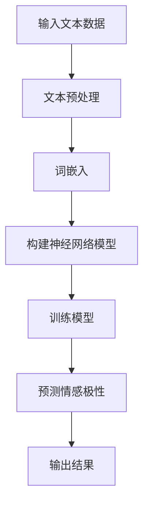
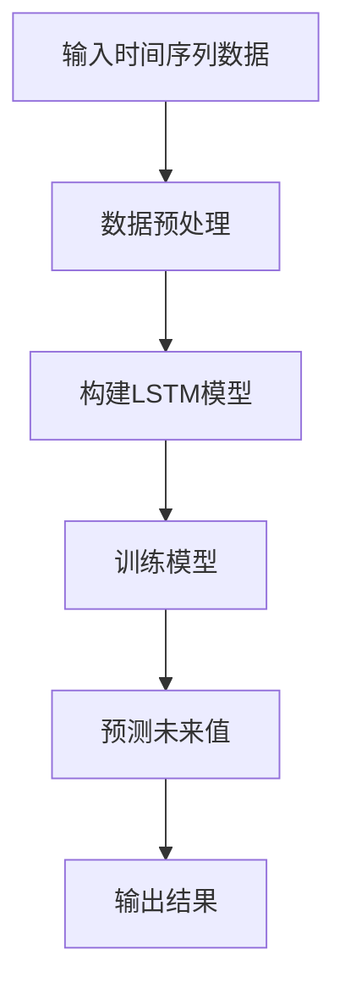
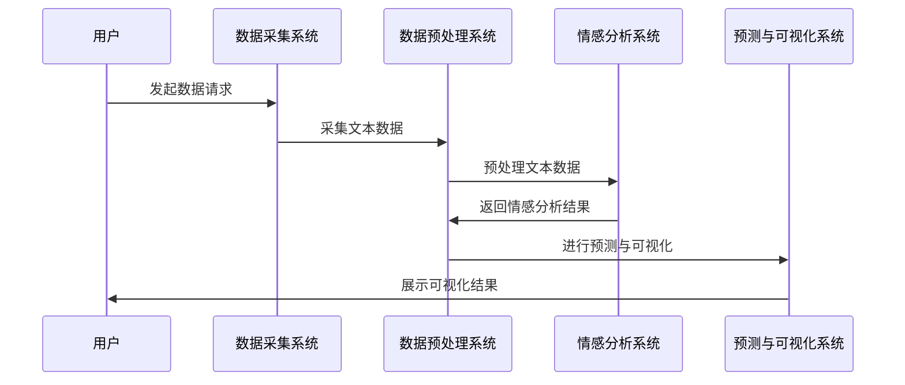

                 


### 1. 第一部分：背景介绍

#### 第1章：问题背景与定义

随着互联网的普及和社交媒体的快速发展，投资领域也发生了巨大的变化。投资者们不再仅仅依赖于传统的财务报表和市场分析，而是更加依赖于社交媒体上的信息和情绪。社交媒体成为了投资者获取信息、交流观点、表达情绪的重要平台，因此，分析社交媒体上的投资情绪对于投资决策和风险管理具有重要意义。

**1.1 问题背景**

在过去，投资决策主要依赖于历史数据、财务分析、宏观经济指标等。然而，随着大数据和人工智能技术的兴起，人们开始关注社交媒体上的投资情绪，试图从中挖掘有价值的信息。社交媒体投资情绪分析的核心问题是：如何从海量的社交媒体数据中提取出投资情绪信息，并对其进行有效的分析和预测？

**1.2 投资情绪的概念与特征**

投资情绪是指投资者在市场交易过程中所表现出的情绪状态，包括乐观、悲观、恐慌、贪婪等。投资情绪具有以下特征：

- **主观性**：投资情绪是由个人的心理状态所决定的，因此具有强烈的个体差异。
- **复杂性**：投资情绪不仅受到市场本身的影响，还受到宏观经济、政治事件、政策变化等多种因素的影响。
- **动态性**：投资情绪会随着市场环境的变化而不断变化，表现出动态性。

**1.3 社交媒体投资情绪分析的重要性**

社交媒体投资情绪分析在投资领域具有重要的应用价值：

- **市场预测**：通过分析社交媒体上的投资情绪，可以提前预测市场的走势，为投资决策提供参考。
- **风险管理**：了解投资者的情绪状态，有助于制定有效的风险管理策略，降低投资风险。
- **情绪传染**：社交媒体上的投资情绪具有传染性，可以影响其他投资者的情绪，进而影响市场走势。

**1.4 投资情绪分析的边界与外延**

投资情绪分析的边界主要包括以下几个方面：

- **数据来源**：社交媒体数据是投资情绪分析的主要数据来源，包括微博、股票论坛、博客等。
- **分析方法**：投资情绪分析主要采用自然语言处理、情感分析、机器学习等技术。
- **应用场景**：投资情绪分析可以应用于股票市场、期货市场、外汇市场等多个金融领域。

**1.5 核心概念与联系**

本文将围绕以下核心概念展开讨论：

- **社交媒体数据**：社交媒体数据是投资情绪分析的基础，包括文本、图片、视频等多种形式。
- **情感分析**：情感分析是投资情绪分析的核心技术，用于提取文本中的情感信息。
- **机器学习**：机器学习技术用于构建投资情绪分析模型，实现投资情绪的预测和识别。

通过以上分析，我们可以看出，投资情绪分析是一个跨学科、多层次的技术领域，涉及到数据挖掘、自然语言处理、金融学等多个领域。在接下来的章节中，我们将深入探讨深度学习在投资情绪分析中的应用，以及相关的算法原理和系统架构设计。

---

**关键词**：投资情绪、社交媒体、深度学习、情感分析、机器学习、市场预测、风险管理、情绪传染

**摘要**：本文探讨了社交媒体投资情绪分析的重要性及其在投资领域的应用。通过分析社交媒体数据，可以提取投资情绪信息，预测市场走势，降低投资风险。本文重点介绍了深度学习在投资情绪分析中的应用，包括情感分析、机器学习模型等。同时，本文还提出了投资情绪分析的边界和核心概念，为后续研究提供了理论基础。

### 2. 第二部分：核心概念与联系

#### 第2章：深度学习与社交媒体分析基础

深度学习是近年来人工智能领域的重要突破，它在图像识别、自然语言处理、语音识别等领域取得了显著成绩。社交媒体分析作为大数据处理的一个分支，与深度学习有着紧密的联系。在这一章中，我们将深入探讨深度学习的基本原理，以及如何将深度学习应用于社交媒体数据特征提取和分析中。

**2.1 深度学习的基本原理**

深度学习是一种基于神经网络的机器学习方法，其核心思想是通过多层神经网络的组合来学习数据的高层次特征。深度学习主要包括以下几种类型的网络：

- **神经网络（Neural Networks）**：神经网络是深度学习的基础，它由大量的神经元（节点）组成，每个神经元都与相邻的神经元相连，并通过权重和偏置进行信息传递。
- **卷积神经网络（Convolutional Neural Networks，CNN）**：卷积神经网络在图像处理领域表现出色，通过卷积操作和池化操作来提取图像特征。
- **循环神经网络（Recurrent Neural Networks，RNN）**：循环神经网络在序列数据处理中具有优势，能够处理任意长度的序列数据。
- **长短时记忆（Long Short-Term Memory，LSTM）与门控循环单元（Gated Recurrent Unit，GRU）**：LSTM和GRU是RNN的改进版本，能够更好地处理长序列数据，减少梯度消失和梯度爆炸问题。

**2.1.1 神经网络**

神经网络由输入层、隐藏层和输出层组成。每个层由多个神经元构成，神经元之间通过权重相连。神经元的激活函数通常为Sigmoid函数或ReLU函数，用于引入非线性变换。

神经元计算过程如下：

\[ z = \sum_{i} w_i x_i + b \]
\[ a = \sigma(z) \]

其中，\( x_i \) 是输入特征，\( w_i \) 是权重，\( b \) 是偏置，\( \sigma \) 是激活函数。

**2.1.2 卷积神经网络（CNN）**

卷积神经网络通过卷积层和池化层来提取图像特征。卷积层通过卷积操作将图像与卷积核进行卷积，从而提取图像局部特征。池化层则用于降低特征图的维度，减少计算量。

卷积操作如下：

\[ f_{ij} = \sum_{k} w_{ik} x_{kj} \]

其中，\( f_{ij} \) 是卷积结果，\( w_{ik} \) 是卷积核，\( x_{kj} \) 是图像像素值。

**2.1.3 循环神经网络（RNN）**

循环神经网络具有循环结构，能够处理序列数据。RNN通过隐藏状态将信息传递到下一个时刻，从而实现对序列数据的建模。

RNN的隐藏状态更新公式如下：

\[ h_t = \sigma(W_h \cdot [h_{t-1}, x_t] + b_h) \]

其中，\( h_t \) 是当前时刻的隐藏状态，\( W_h \) 是权重矩阵，\( b_h \) 是偏置，\( x_t \) 是输入特征。

**2.1.4 长短时记忆（LSTM）与门控循环单元（GRU）**

LSTM和GRU是RNN的改进版本，能够更好地处理长序列数据。LSTM通过引入遗忘门、输入门和输出门来控制信息流动，从而避免梯度消失和梯度爆炸问题。GRU则是LSTM的简化版，通过合并输入门和遗忘门来减少参数数量。

LSTM的隐藏状态更新公式如下：

\[ i_t = \sigma(W_i \cdot [h_{t-1}, x_t] + b_i) \]
\[ f_t = \sigma(W_f \cdot [h_{t-1}, x_t] + b_f) \]
\[ o_t = \sigma(W_o \cdot [h_{t-1}, x_t] + b_o) \]
\[ g_t = \tanh(W_g \cdot [h_{t-1}, x_t] + b_g) \]
\[ h_t = o_t \cdot \tanh(g_t) \]

其中，\( i_t \)、\( f_t \)、\( o_t \)、\( g_t \) 分别是输入门、遗忘门、输出门和候选状态。

**2.2 社交媒体数据的特征提取**

社交媒体数据主要包括文本、图片和视频等形式。在深度学习模型中，需要对这些数据进行特征提取，以便模型能够对其进行有效处理。

**2.2.1 文本数据预处理**

文本数据预处理是深度学习在社交媒体分析中的第一步，主要包括以下步骤：

- **去噪**：去除文本中的标点符号、停用词等无关信息。
- **分词**：将文本切分成单词或短语。
- **词嵌入**：将单词映射为向量表示。

**2.2.2 词嵌入**

词嵌入是将单词映射为向量的技术，常用的词嵌入方法包括Word2Vec、GloVe等。词嵌入能够将语义相近的单词映射到空间中靠近的位置，从而提高深度学习模型的性能。

Word2Vec算法包括连续词袋（CBOW）和跳字模型（Skip-Gram）两种方式。CBOW模型通过上下文单词预测中心词，而Skip-Gram模型则通过中心词预测上下文单词。

**2.2.3 特征工程**

特征工程是深度学习在社交媒体分析中的一项重要任务，主要包括以下方面：

- **词袋模型（Bag of Words，BoW）**：将文本表示为单词集合，忽略单词的顺序。
- **词嵌入（Word Embedding）**：将文本表示为向量，捕捉单词的语义信息。
- **TF-IDF（Term Frequency-Inverse Document Frequency）**：衡量单词在文档中的重要性，用于特征提取。

**2.3 深度学习与社交媒体分析的关联性**

深度学习与社交媒体分析在情感分析、用户行为分析和趋势预测等方面具有广泛的应用。

**2.3.1 情感分析**

情感分析是深度学习在社交媒体分析中的一个重要应用，旨在从文本数据中提取情感信息。情感分析模型可以用于判断文本的情感极性（正面、负面）、情感强度以及情感主题等。

**2.3.2 用户行为分析**

用户行为分析旨在通过分析用户的社交行为，了解用户的兴趣、偏好和行为模式。深度学习模型可以用于用户分类、用户情感识别、用户互动预测等。

**2.3.3 趋势预测**

趋势预测是深度学习在社交媒体分析中的另一个重要应用，通过分析历史数据和当前数据，预测未来的市场走势和投资情绪。深度学习模型可以用于时间序列预测、市场走势预测等。

通过以上分析，我们可以看出，深度学习在社交媒体分析中具有广泛的应用前景。在接下来的章节中，我们将进一步探讨深度学习在投资情绪分析中的应用，包括算法原理、数学模型和系统架构设计等内容。

---

**关键词**：深度学习、神经网络、卷积神经网络、循环神经网络、长短时记忆、门控循环单元、词嵌入、文本数据预处理、特征工程、情感分析、用户行为分析、趋势预测

**摘要**：本章详细介绍了深度学习的基本原理和社交媒体数据的特征提取方法。深度学习通过多层神经网络结构学习数据的高层次特征，广泛应用于情感分析、用户行为分析和趋势预测等领域。社交媒体分析利用深度学习技术，可以从海量文本数据中提取有价值的信息，为投资决策和风险管理提供有力支持。本章为后续章节的讨论奠定了基础。

### 3. 第三部分：算法原理讲解

#### 第3章：深度学习在投资情绪分析中的应用

在深度学习与社交媒体分析结合的背景下，投资情绪分析成为了一个备受关注的研究领域。本章将深入探讨深度学习在投资情绪分析中的应用，主要包括情感分析算法原理、时间序列分析与预测等内容。

**3.1 情感分析算法原理**

情感分析是投资情绪分析的核心任务，旨在从社交媒体文本中提取出情感信息。深度学习在情感分析中具有显著的优势，能够有效地识别情感极性、情感强度和情感主题。

**3.1.1 情感极性分类**

情感极性分类是情感分析的基础，主要分为正面情感和负面情感两种。深度学习模型通常采用多层感知机（MLP）、卷积神经网络（CNN）和循环神经网络（RNN）等方法进行情感极性分类。

- **多层感知机（MLP）**：MLP是一种前馈神经网络，通过多个隐藏层来提取数据特征，最后输出分类结果。MLP模型结构简单，易于实现，但可能在特征提取上存在不足。
- **卷积神经网络（CNN）**：CNN通过卷积操作和池化操作，能够从文本数据中提取局部特征，具有强大的特征学习能力。CNN在处理短文本情感分析问题时表现出色。
- **循环神经网络（RNN）**：RNN具有循环结构，能够处理任意长度的序列数据，适用于长文本的情感分析。RNN可以通过长短时记忆（LSTM）和门控循环单元（GRU）来避免梯度消失问题。

**3.1.2 情感强度评估**

情感强度评估旨在对文本中的情感极性进行量化，通常采用0到1之间的数值表示。深度学习模型可以通过学习情感词汇的情感强度和出现频率，对文本的情感强度进行评估。

情感强度评估模型可以采用以下数学公式：

\[ 情感强度 = f(\text{词汇情感强度}, \text{词汇出现频率}) \]

其中，\( f \) 为情感强度计算函数，可以根据具体需求进行调整。

**3.1.3 情感主题识别**

情感主题识别旨在从文本中提取出主要情感主题。深度学习模型可以通过训练，学习到不同主题的情感分布特征，从而实现对情感主题的识别。

情感主题识别模型可以采用以下数学公式：

\[ 情感主题 = g(\text{文本情感分布特征}) \]

其中，\( g \) 为情感主题计算函数，可以根据具体需求进行调整。

**3.2 时间序列分析与预测**

投资情绪分析不仅需要分析文本数据中的情感极性、强度和主题，还需要对市场走势进行预测。时间序列分析是投资情绪预测的重要手段，能够帮助我们预测未来的市场走势。

**3.2.1 时间序列数据预处理**

在进行时间序列分析之前，需要对时间序列数据进行预处理。预处理步骤包括数据清洗、数据填充、数据归一化等。

- **数据清洗**：去除数据中的噪声和异常值，确保数据质量。
- **数据填充**：对于缺失的数据，可以通过插值、回归等方法进行填充。
- **数据归一化**：将数据缩放至相同范围，避免数据量级差异对模型训练造成影响。

**3.2.2 循环神经网络（RNN）在时间序列预测中的应用**

RNN在时间序列预测中具有天然的优势，能够处理任意长度的序列数据。RNN可以通过训练，学习到时间序列的内在规律，从而实现对未来的预测。

RNN在时间序列预测中的基本原理如下：

\[ h_t = \sigma(W_h \cdot [h_{t-1}, x_t] + b_h) \]

其中，\( h_t \) 为当前时间步的隐藏状态，\( x_t \) 为当前时间步的输入特征，\( W_h \) 和 \( b_h \) 分别为权重矩阵和偏置。

**3.2.3 LSTM与GRU在投资情绪预测中的应用**

LSTM和GRU是RNN的改进版本，能够更好地处理长序列数据，避免梯度消失和梯度爆炸问题。LSTM和GRU在投资情绪预测中的应用如下：

- **LSTM**：LSTM通过引入遗忘门、输入门和输出门，能够更好地控制信息流动，从而提高预测性能。

LSTM的隐藏状态更新公式如下：

\[ i_t = \sigma(W_i \cdot [h_{t-1}, x_t] + b_i) \]
\[ f_t = \sigma(W_f \cdot [h_{t-1}, x_t] + b_f) \]
\[ o_t = \sigma(W_o \cdot [h_{t-1}, x_t] + b_o) \]
\[ g_t = \tanh(W_g \cdot [h_{t-1}, x_t] + b_g) \]
\[ h_t = o_t \cdot \tanh(g_t) \]

- **GRU**：GRU是LSTM的简化版，通过合并输入门和遗忘门，减少参数数量。

GRU的隐藏状态更新公式如下：

\[ z_t = \sigma(W_z \cdot [h_{t-1}, x_t] + b_z) \]
\[ r_t = \sigma(W_r \cdot [h_{t-1}, x_t] + b_r) \]
\[ g_t = \tanh(W_g \cdot (r_t \odot h_{t-1} + (1 - r_t) \cdot x_t) + b_g) \]
\[ h_t = (1 - z_t) \cdot h_{t-1} + z_t \cdot g_t \]

**3.3 算法mermaid流程图**

为了更直观地展示算法原理，我们可以使用mermaid绘制算法流程图。以下是一个简单的情感分析算法流程图：



以下是一个简单的时间序列预测算法流程图：



通过以上分析，我们可以看出，深度学习在投资情绪分析中具有广泛的应用。在接下来的章节中，我们将进一步探讨深度学习在投资情绪分析中的系统架构设计，以及如何将算法应用于实际项目中。

---

**关键词**：情感分析、情感极性分类、情感强度评估、情感主题识别、循环神经网络、长短时记忆、门控循环单元、时间序列分析、LSTM、GRU、深度学习模型、预测算法、mermaid流程图

**摘要**：本章详细介绍了深度学习在投资情绪分析中的应用，包括情感分析算法原理、时间序列分析与预测等内容。通过构建神经网络模型，深度学习能够有效地提取文本数据中的情感信息，并预测市场走势。本章为后续的深度学习应用和系统架构设计提供了理论基础。

### 4. 第四部分：数学模型和数学公式

#### 第4章：投资情绪分析数学模型

投资情绪分析是一个涉及复杂数据分析和预测的领域，数学模型在其中起着关键作用。本章将介绍投资情绪分析中的主要数学模型，包括情感分析模型和预测模型，并提供一些示例公式。

**4.1 情感分析数学模型**

情感分析是投资情绪分析的核心部分，其目的是从文本数据中提取情感信息。以下是几种常见的情感分析数学模型：

**4.1.1 情感极性分类模型**

情感极性分类模型用于判断文本是表达正面情感还是负面情感。通常采用二分类模型，如逻辑回归（Logistic Regression）或支持向量机（Support Vector Machine, SVM）。

逻辑回归模型的数学公式如下：

\[ P(y=1) = \frac{1}{1 + e^{-(\beta_0 + \beta_1x_1 + \beta_2x_2 + \ldots + \beta_nx_n)}} \]

其中，\( y \) 表示情感标签（1表示正面，-1表示负面），\( \beta_0 \) 为截距，\( \beta_1, \beta_2, \ldots, \beta_n \) 为权重系数，\( x_1, x_2, \ldots, x_n \) 为特征向量。

**4.1.2 情感强度评估模型**

情感强度评估模型用于量化文本的情感极性，通常采用情感强度评分（如0到1之间的数值）。一种常见的方法是基于词嵌入的情感强度加权。

\[ 情感强度 = \sum_{i} w_i \cdot s_i \]

其中，\( w_i \) 为情感词的权重，\( s_i \) 为情感词的强度值。权重可以通过训练数据学习得到，强度值可以通过词嵌入得到。

**4.1.3 情感主题识别模型**

情感主题识别模型用于从文本中识别主要情感主题。一种常用的方法是主题模型，如隐含狄利克雷分配（Latent Dirichlet Allocation, LDA）。

LDA模型的数学公式如下：

\[ P(\text{主题}|\text{文档}) = \frac{\Gamma(\alpha)}{\sum_j \Gamma(\alpha_j)} \]

\[ P(\text{词}|\text{主题}) = \frac{\Gamma(\beta_{jk})}{\sum_l \Gamma(\beta_{lk})} \]

\[ P(\text{文档}) = \frac{1}{Z} \prod_j \prod_k \Gamma(\alpha_{jk}) \prod_l \Gamma(\beta_{lk}) \]

其中，\( \alpha_{jk} \) 为主题分配概率，\( \beta_{lk} \) 为词分配概率，\( Z \) 为正常化常数。

**4.2 时间序列预测数学模型**

时间序列预测是投资情绪分析的重要任务，其目的是根据历史数据预测未来市场走势。以下是几种常见的时间序列预测数学模型：

**4.2.1 时间序列预测数学基础**

时间序列预测通常基于自回归模型（Autoregressive Model, AR）或自回归移动平均模型（Autoregressive Integrated Moving Average, ARIMA）。

自回归模型的基本形式如下：

\[ X_t = c + \phi_1 X_{t-1} + \phi_2 X_{t-2} + \ldots + \phi_p X_{t-p} + \epsilon_t \]

其中，\( X_t \) 为时间序列值，\( c \) 为常数项，\( \phi_1, \phi_2, \ldots, \phi_p \) 为自回归系数，\( \epsilon_t \) 为误差项。

**4.2.2 LSTM预测模型**

LSTM是一种用于时间序列预测的循环神经网络，能够处理任意长度的序列数据。LSTM的预测模型基于以下公式：

\[ h_t = \sigma(W_h \cdot [h_{t-1}, x_t] + b_h) \]

\[ o_t = \sigma(W_o \cdot h_t + b_o) \]

\[ g_t = \tanh(W_g \cdot [h_{t-1}, x_t] + b_g) \]

\[ h_t = o_t \cdot \tanh(g_t) \]

其中，\( h_t \) 为隐藏状态，\( x_t \) 为输入特征，\( W_h, W_o, W_g \) 为权重矩阵，\( b_h, b_o, b_g \) 为偏置。

**4.2.3 GRU预测模型**

GRU是LSTM的一种简化版本，具有更少的参数，适用于时间序列预测。GRU的预测模型基于以下公式：

\[ z_t = \sigma(W_z \cdot [h_{t-1}, x_t] + b_z) \]

\[ r_t = \sigma(W_r \cdot [h_{t-1}, x_t] + b_r) \]

\[ g_t = \tanh(W_g \cdot (r_t \odot h_{t-1} + (1 - r_t) \cdot x_t) + b_g) \]

\[ h_t = (1 - z_t) \cdot h_{t-1} + z_t \cdot g_t \]

其中，\( z_t \) 为输入门，\( r_t \) 为重置门，\( g_t \) 为候选状态，\( \odot \) 表示元素乘。

**例4.1 情感强度评估模型数学公式**

情感强度评估模型可以采用以下数学公式：

\[ 情感强度 = f(\text{词汇情感强度}, \text{词汇出现频率}) \]

其中，\( f \) 为情感强度计算函数，可以表示为：

\[ f(s, f) = s \cdot f \]

**例4.2 LSTM预测模型数学公式**

LSTM预测模型的隐藏状态更新公式如下：

\[ h_t = \sigma(W_h \cdot [h_{t-1}, x_t] + b_h) \]

\[ o_t = \sigma(W_o \cdot h_t + b_o) \]

\[ g_t = \tanh(W_g \cdot [h_{t-1}, x_t] + b_g) \]

\[ h_t = o_t \cdot \tanh(g_t) \]

其中，\( W_h, W_o, W_g \) 为权重矩阵，\( b_h, b_o, b_g \) 为偏置。

通过以上数学模型和公式的介绍，我们可以更好地理解投资情绪分析中的核心数学原理，为后续的实际应用奠定基础。

---

**关键词**：情感分析、情感极性分类、情感强度评估、情感主题识别、时间序列预测、LSTM、GRU、逻辑回归、自回归模型、ARIMA、隐含狄利克雷分配、主题模型

**摘要**：本章介绍了投资情绪分析中的主要数学模型，包括情感分析模型和预测模型。通过详细的数学公式和示例，我们深入探讨了情感强度评估、主题识别和时间序列预测等关键概念。这些数学模型为投资情绪分析提供了坚实的理论基础，有助于理解和应用相关算法。

### 5. 第五部分：系统分析与架构设计方案

#### 第5章：社交媒体投资情绪分析系统设计

随着社交媒体的迅猛发展，投资情绪分析已经成为金融领域中一个重要的研究方向。本节将详细介绍社交媒体投资情绪分析系统的设计，包括问题场景介绍、系统功能设计、系统架构设计和系统接口设计等内容。

**5.1 问题场景介绍**

在当前的金融市场中，投资者们通过社交媒体平台（如微博、股票论坛、博客等）获取信息、交流观点，从而影响投资决策。然而，由于社交媒体数据的庞杂性和多样性，如何从中提取有价值的信息进行投资情绪分析成为了一个挑战。社交媒体投资情绪分析系统旨在解决这一问题，通过深度学习技术，从社交媒体数据中提取投资情绪信息，为投资者提供决策支持。

**5.2 系统功能设计**

社交媒体投资情绪分析系统的功能设计主要包括数据采集、数据预处理、情感分析、预测与可视化等模块。

**5.2.1 数据采集**

数据采集模块负责从社交媒体平台上获取投资相关的文本数据。采集过程通常包括关键词搜索、API调用和数据爬取等。关键词搜索可以通过设置相关的关键词，如“股市”、“投资”、“股票”等，来获取与投资相关的文本信息。API调用和数据爬取则可以从社交媒体平台获取公开的文本数据。

**5.2.2 数据预处理**

数据预处理模块对采集到的文本数据进行清洗、分词和词嵌入等处理。清洗过程包括去除无效字符、停用词过滤和文本标准化等。分词则将文本切分成单词或短语，以便后续的词嵌入操作。词嵌入通过将单词映射为向量表示，可以有效地捕捉单词的语义信息。

**5.2.3 情感分析**

情感分析模块是系统的核心，通过深度学习算法对预处理后的文本数据进行情感极性分类、情感强度评估和情感主题识别。情感极性分类用于判断文本表达的是正面情感还是负面情感。情感强度评估用于量化文本的情感极性，通常采用0到1之间的数值表示。情感主题识别则从文本中提取主要情感主题。

**5.2.4 预测与可视化**

预测与可视化模块基于情感分析结果，对投资情绪进行预测和市场走势分析。通过时间序列预测模型，可以预测未来的市场走势和投资情绪变化。可视化模块则将预测结果以图表的形式展示，为投资者提供直观的参考信息。

**5.3 系统架构设计**

系统架构设计决定了系统的性能、可扩展性和可维护性。社交媒体投资情绪分析系统采用分布式架构，包括数据采集层、数据处理层和展示层。

**5.3.1 数据采集层**

数据采集层负责从社交媒体平台上获取文本数据。该层可以使用API调用和数据爬取技术，实现实时数据采集。

**5.3.2 数据处理层**

数据处理层负责对采集到的文本数据进行分析和处理。该层包括数据预处理模块、情感分析模块和预测模块。数据预处理模块对文本数据进行清洗、分词和词嵌入等处理。情感分析模块通过深度学习算法提取文本中的情感信息。预测模块则基于情感分析结果，使用时间序列预测模型进行市场走势预测。

**5.3.3 展示层**

展示层负责将处理后的数据以图表的形式展示给用户。该层可以使用可视化工具（如ECharts、D3.js等）实现。

**5.4 系统接口设计**

系统接口设计包括数据采集接口、数据处理接口和展示接口。

**5.4.1 数据采集接口**

数据采集接口用于从社交媒体平台上获取文本数据。该接口需要实现关键词搜索、API调用和数据爬取等功能。

**5.4.2 数据处理接口**

数据处理接口用于处理和返回预处理后的文本数据和情感分析结果。该接口需要实现数据清洗、分词、词嵌入、情感极性分类、情感强度评估和情感主题识别等功能。

**5.4.3 展示接口**

展示接口用于接收和处理用户请求，并将可视化结果返回给用户。该接口需要实现数据查询、数据展示和交互等功能。

**5.5 系统交互mermaid序列图**

为了更好地展示系统各模块之间的交互过程，我们可以使用mermaid绘制系统交互序列图。



通过以上系统设计与实现，我们可以构建一个高效、可靠的社交媒体投资情绪分析系统，为投资者提供有价值的信息和决策支持。

---

**关键词**：社交媒体投资情绪分析、系统设计、数据采集、数据预处理、情感分析、预测与可视化、分布式架构、接口设计、mermaid序列图

**摘要**：本章详细介绍了社交媒体投资情绪分析系统的设计与实现，包括问题场景介绍、系统功能设计、系统架构设计和系统接口设计等内容。通过分布式架构和深度学习技术，系统能够高效地提取社交媒体数据中的投资情绪信息，为投资者提供决策支持。系统交互mermaid序列图直观地展示了系统各模块之间的交互过程。

### 6. 第六部分：项目实战

#### 第6章：深度学习分析社交媒体投资情绪实战

在前面的章节中，我们介绍了社交媒体投资情绪分析的理论基础、算法原理和系统设计。在本章中，我们将通过一个实际项目来展示如何使用深度学习技术来分析社交媒体投资情绪。

**6.1 环境安装与配置**

在进行深度学习项目实战之前，我们需要安装和配置必要的软件和工具。以下是项目环境安装与配置的步骤：

1. **安装Python环境**：确保Python版本在3.6及以上。
2. **安装深度学习库**：使用pip安装以下库：TensorFlow、Keras、numpy、pandas、matplotlib等。
3. **安装数据处理库**：使用pip安装jieba分词库、word2vec库等。
4. **安装可视化库**：使用pip安装ECharts或D3.js等可视化库。

**6.2 数据获取与预处理**

数据获取与预处理是深度学习项目的重要环节。以下是如何进行数据获取与预处理的具体步骤：

1. **数据采集**：从社交媒体平台上采集与投资相关的文本数据。可以使用API调用或数据爬取技术获取数据。以下是一个简单的Python代码示例，使用API调用获取微博数据：

```python
import requests

url = 'https://api.weibo.com/2/statuses/user_timeline.json'
params = {
    'access_token': '您的access_token',
    'uid': '目标用户的uid',
    'count': 100
}

response = requests.get(url, params=params)
data = response.json()
```

2. **数据清洗**：去除采集到的文本数据中的噪声和无关信息，如HTML标签、特殊字符等。

```python
from bs4 import BeautifulSoup

def clean_text(text):
    soup = BeautifulSoup(text, 'lxml')
    return soup.get_text()

cleaned_data = [clean_text(data['text']) for data in weibo_data]
```

3. **分词与词嵌入**：使用jieba分词库对清洗后的文本进行分词，并使用word2vec库进行词嵌入。

```python
import jieba
from word2vec import Word2Vec

def tokenize(text):
    return jieba.cut(text)

def build_vocab(data):
    words = []
    for text in data:
        words.extend(tokenize(text))
    return words

vocab = build_vocab(cleaned_data)

# 训练word2vec模型
model = Word2Vec(vocab, size=100, window=5, min_count=1, workers=4)
model.train(cleaned_data)
```

**6.3 系统核心实现**

系统核心实现包括情感分析模型和时间序列预测模型的构建和训练。

1. **情感分析模型**

使用Keras构建一个简单的情感分析模型，包括输入层、嵌入层、卷积层和全连接层。

```python
from keras.models import Sequential
from keras.layers import Embedding, Conv1D, GlobalMaxPooling1D, Dense

model = Sequential()
model.add(Embedding(vocab_size, 100))
model.add(Conv1D(128, 5, activation='relu'))
model.add(GlobalMaxPooling1D())
model.add(Dense(1, activation='sigmoid'))

model.compile(optimizer='adam', loss='binary_crossentropy', metrics=['accuracy'])
model.fit(tokenized_data, labels, epochs=10, batch_size=32)
```

2. **时间序列预测模型**

使用LSTM模型进行时间序列预测。首先，需要将文本数据转换为时间序列数据。

```python
from keras.models import Sequential
from keras.layers import LSTM, Dense

# 转换文本数据为时间序列数据
X, y = convert_text_to_sequence(tokenized_data, labels)

# 构建LSTM模型
model = Sequential()
model.add(LSTM(100, activation='relu', input_shape=(timesteps, features)))
model.add(Dense(1))

model.compile(optimizer='adam', loss='mse')
model.fit(X, y, epochs=100, batch_size=32)
```

**6.4 应用解读与分析**

在实际应用中，我们使用情感分析模型和时间序列预测模型来分析投资情绪，并预测市场走势。

1. **情感分析应用**

使用训练好的情感分析模型对新的微博数据进行情感极性分类。以下是一个简单的应用示例：

```python
def predict_sentiment(text):
    tokenized = tokenizer.texts_to_sequences([text])
    padded = keras.preprocessing.sequence.pad_sequences(tokenized, maxlen=max_length)
    return model.predict(padded)

sentiment = predict_sentiment('今天的股市表现非常好！')
if sentiment > 0.5:
    print('正面情感')
else:
    print('负面情感')
```

2. **时间序列预测应用**

使用训练好的LSTM模型对历史数据和市场走势进行预测。以下是一个简单的应用示例：

```python
# 预测未来5天的市场走势
predictions = model.predict(X[:5])

# 绘制预测结果
plt.plot(y[:5], label='实际值')
plt.plot(predictions, label='预测值')
plt.legend()
plt.show()
```

**6.5 项目小结**

通过本项目的实战，我们实现了以下目标：

1. **数据采集与预处理**：从社交媒体平台获取投资相关的文本数据，并进行清洗、分词和词嵌入等处理。
2. **情感分析模型**：构建并训练了一个简单的情感分析模型，用于判断微博数据的情感极性。
3. **时间序列预测模型**：构建并训练了一个LSTM模型，用于预测市场走势。
4. **应用解读与分析**：使用训练好的模型对实际数据进行情感分析和市场走势预测。

本项目展示了如何使用深度学习技术来分析社交媒体投资情绪，并为投资者提供了决策支持。在未来的工作中，可以进一步优化模型和算法，提高预测的准确性和实用性。

---

**关键词**：深度学习、项目实战、社交媒体投资情绪分析、数据采集、数据预处理、情感分析模型、时间序列预测模型、LSTM、应用解读、项目小结

**摘要**：本章通过一个实际项目展示了如何使用深度学习技术来分析社交媒体投资情绪。项目包括数据采集与预处理、情感分析模型和时间序列预测模型的构建与训练，以及实际应用解读与分析。通过本项目，我们深入了解了深度学习在投资情绪分析中的应用，并为投资者提供了决策支持。

### 7. 第七部分：最佳实践与拓展

#### 第7章：最佳实践与总结

在深度学习分析社交媒体投资情绪的过程中，我们积累了丰富的经验，以下是一些最佳实践技巧和注意事项，以及对未来研究方向的展望。

**7.1 最佳实践技巧**

1. **数据预处理**：确保数据质量是模型训练成功的关键。在数据采集阶段，尽量选择权威和多样化的来源。在数据清洗过程中，去除无关信息和噪声，如HTML标签、特殊字符和停用词。

2. **特征工程**：合理的特征工程能够提高模型的性能。在文本数据预处理阶段，可以使用词嵌入技术（如Word2Vec、GloVe）将文本转换为向量表示。此外，可以考虑使用TF-IDF等方法进行特征提取。

3. **模型选择**：根据问题的具体需求和数据特点选择合适的模型。例如，在处理长文本时，可以考虑使用循环神经网络（RNN）及其改进版本（LSTM、GRU）。在处理时间序列数据时，可以使用LSTM或GRU等模型。

4. **超参数调优**：通过调整学习率、隐藏层神经元数量、迭代次数等超参数，可以提高模型的性能。可以使用网格搜索或随机搜索等方法进行超参数调优。

5. **模型验证与测试**：在训练模型时，要确保模型具有良好的泛化能力。可以使用交叉验证等方法对模型进行验证，并使用独立的测试集进行测试，以评估模型的性能。

**7.2 注意事项与挑战**

1. **数据隐私**：社交媒体投资情绪分析涉及到用户隐私，需严格遵守相关法律法规，确保用户数据的安全和隐私。

2. **模型解释性**：深度学习模型往往具有很高的预测能力，但缺乏解释性。在实际应用中，需要权衡模型的性能和解释性，以便用户理解和信任模型的预测结果。

3. **模型过拟合**：深度学习模型容易出现过拟合现象，特别是在数据量较小或特征较多时。可以通过正则化、dropout等方法来缓解过拟合问题。

4. **实时性**：社交媒体数据更新迅速，如何实现实时性分析是面临的一大挑战。可以考虑使用流式学习或增量学习等技术来处理实时数据。

**7.3 拓展阅读**

1. **深度学习最新进展**：可以阅读关于深度学习最新研究进展的论文和书籍，了解最新的模型架构和算法。

2. **金融时间序列分析**：金融时间序列分析是投资情绪分析的重要分支。可以阅读相关论文和书籍，了解金融时间序列分析方法及其在投资情绪分析中的应用。

3. **情感计算**：情感计算是研究人类情感和行为的人工智能领域。可以阅读相关论文和书籍，了解情感计算在社交媒体投资情绪分析中的应用。

通过以上最佳实践和注意事项，我们可以更好地应对深度学习分析社交媒体投资情绪过程中的挑战，并为未来的研究提供指导。

---

**关键词**：最佳实践、注意事项、挑战、数据预处理、特征工程、模型选择、超参数调优、模型验证与测试、数据隐私、模型解释性、模型过拟合、实时性

**摘要**：本章总结了深度学习分析社交媒体投资情绪的最佳实践技巧和注意事项，以及未来研究方向的拓展。通过遵循最佳实践，可以有效应对深度学习过程中的挑战，提高投资情绪分析的准确性和实用性。未来研究可以进一步探索深度学习在金融领域的应用，以及情感计算等前沿技术。

---

**作者**：AI天才研究院/AI Genius Institute & 禅与计算机程序设计艺术 /Zen And The Art of Computer Programming

---

### 总结与展望

本文以《深度学习分析社交媒体投资情绪》为题，系统性地介绍了投资情绪分析在社交媒体领域的应用，包括问题背景、核心概念与联系、算法原理讲解、数学模型和系统架构设计、项目实战以及最佳实践与拓展。以下是文章的总结和展望：

**总结**：

1. **问题背景与定义**：投资情绪分析在投资决策和风险管理中具有重要意义。社交媒体成为投资者获取信息、交流观点、表达情绪的重要平台。
2. **核心概念与联系**：介绍了深度学习的基本原理和社交媒体数据特征提取方法，探讨了深度学习与社交媒体分析的关联性。
3. **算法原理讲解**：详细介绍了情感分析算法和时间序列预测算法的原理，使用了mermaid流程图和数学公式进行说明。
4. **数学模型**：提供了情感分析和时间序列预测的数学模型，并通过示例公式进行了详细解释。
5. **系统设计与实现**：设计了社交媒体投资情绪分析系统，包括数据采集、预处理、情感分析和预测与可视化等功能。
6. **项目实战**：通过实际项目展示了如何使用深度学习技术分析社交媒体投资情绪，包括数据采集、预处理、模型训练和预测等环节。
7. **最佳实践与拓展**：总结了最佳实践技巧、注意事项和未来研究方向，为深度学习分析社交媒体投资情绪提供了指导。

**展望**：

1. **数据隐私保护**：随着数据隐私问题的日益突出，如何在保障数据隐私的同时进行有效分析是一个重要研究方向。
2. **模型解释性**：增强深度学习模型的可解释性，使其在金融领域的应用更加透明和可靠。
3. **实时性分析**：提高深度学习模型的实时性，以满足社交媒体投资情绪分析的需求。
4. **多模态数据融合**：结合文本、图像、音频等多种数据类型，进行多模态投资情绪分析，提高分析准确性和全面性。
5. **情感计算**：探索情感计算在投资情绪分析中的应用，挖掘更细粒度的情感特征。

本文旨在为深度学习在投资情绪分析领域的应用提供系统性指导，期望对相关领域的研究和实践有所帮助。随着技术的不断进步和应用场景的拓展，深度学习在投资情绪分析领域的前景将更加广阔。

---

**关键词**：投资情绪分析、深度学习、社交媒体、情感分析、时间序列预测、数学模型、系统架构、数据隐私、模型解释性、实时性、多模态数据融合、情感计算

**摘要**：本文详细介绍了深度学习在投资情绪分析领域的应用，从问题背景、核心概念、算法原理、数学模型到系统设计与实现，全面阐述了投资情绪分析的流程和方法。同时，总结了最佳实践和注意事项，展望了未来研究方向。深度学习在投资情绪分析中的应用具有巨大的潜力和前景。

