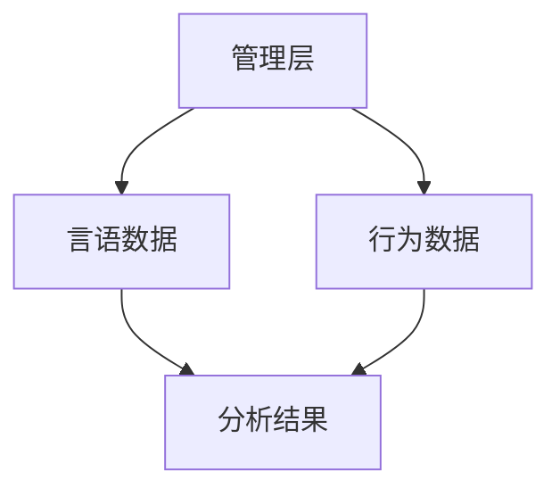
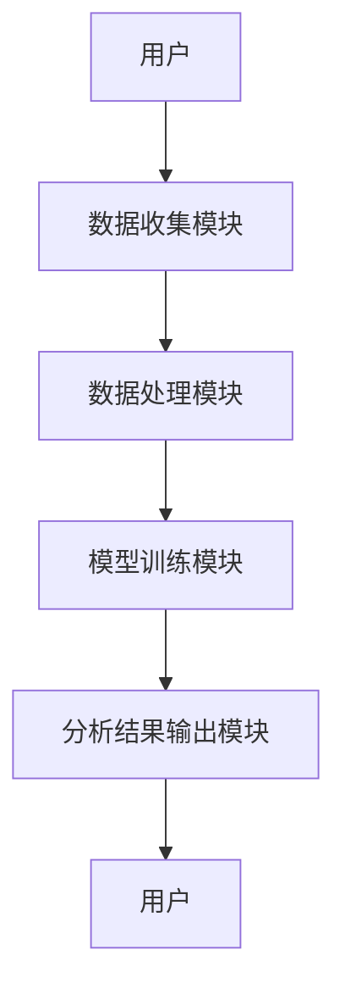

                 


## 深度学习分析管理层言行一致性的基础

### 第1章：问题背景与核心概念

#### 1.1 深度学习与自然语言处理

##### 1.1.1 深度学习的基本概念

深度学习是一种机器学习的方法，其基础是多层神经网络。在深度学习中，通过不断增加网络的层数，可以提取出更高层次的特征，从而在复杂的数据集上实现良好的表现。

- **定义**：深度学习是一种基于神经网络的机器学习方法，通过模拟人脑神经网络结构和机制，对数据进行层次化处理，逐步提取特征。

- **优点**：深度学习能够自动学习数据中的复杂模式，无需人工特征提取，适应性强，能够处理高维数据。

- **应用场景**：图像识别、语音识别、自然语言处理、推荐系统等。

##### 1.1.2 自然语言处理的挑战

自然语言处理（NLP）是人工智能的重要分支，旨在让计算机理解和生成自然语言。然而，NLP面临以下挑战：

- **语义理解**：语言具有歧义性，同一个词汇在不同上下文中有不同的含义。

- **上下文信息**：理解句子中的上下文关系，对句子进行正确解析。

- **多模态数据**：文本、语音、图像等多种数据类型的融合处理。

##### 1.1.3 管理层言行一致性的重要性

在企业管理中，管理层言行一致性具有重要意义。管理层的行为和言语代表了企业的价值观和文化，影响员工的态度和行为。言行不一致可能导致员工信任危机，影响企业绩效。

- **定义**：言行一致性是指管理层在言语和行为上保持一致，表现出一致的企业文化和价值观。

- **重要性**：建立信任、提升员工满意度、增强企业凝聚力、促进企业发展。

### 第2章：核心概念与联系

#### 2.1 深度学习模型在言行一致性分析中的应用

在言行一致性分析中，深度学习模型发挥了重要作用。以下是几种常用的深度学习模型及其在言行一致性分析中的应用：

##### 2.1.1 LSTM与GRU模型

LSTM（长短期记忆网络）和GRU（门控循环单元）是用于处理序列数据的循环神经网络。它们能够有效地捕捉句子中的长期依赖关系，从而提高言行一致性的分析准确率。

- **应用**：用于分析管理层的言语数据，提取关键信息。

##### 2.1.2 卷积神经网络（CNN）的应用

卷积神经网络（CNN）在图像处理领域具有卓越表现。通过将CNN应用于行为数据，可以提取出与言行一致性相关的视觉特征。

- **应用**：用于分析管理层的行为数据，判断其行为是否符合言语表述。

##### 2.1.3 注意力机制与BERT模型

注意力机制是深度学习中的一个关键概念，能够使模型在处理序列数据时，关注重要的部分。BERT（Bidirectional Encoder Representations from Transformers）模型结合了注意力机制和Transformer架构，具有强大的语义理解能力。

- **应用**：用于同时分析管理层的言语和行为数据，实现全面言行一致性评估。

#### 2.2 言行一致性的ER实体关系图

以下是一个简单的ER实体关系图，展示了与管理层言行一致性分析相关的实体和关系：



在这个ER图中，管理层是中心实体，其关联着言语数据和行为数据。通过分析这两个数据集，可以得出分析结果，为管理层言行一致性的评估提供依据。

### 第3章：算法原理讲解

#### 3.1 言语数据处理的算法流程

在深度学习分析管理层言行一致性的过程中，首先需要对言语数据进行处理。以下是一个典型的算法流程：

1. 数据收集：收集管理层的言语数据。

2. 数据预处理：对言语数据进行清洗、分词、去停用词等操作。

3. 词嵌入：将分词后的文本转换为向量表示。

4. 模型训练：使用LSTM或GRU等循环神经网络对词嵌入进行训练。

5. 分析结果：根据模型输出，评估管理层的言行一致性。

#### 3.2 言语数据处理的Python代码实现

以下是使用Python实现的简单言语数据处理代码：

```python
import numpy as np
from keras.preprocessing.text import Tokenizer
from keras.preprocessing.sequence import pad_sequences

# 1. 数据收集
texts = ["管理层在年度会议上表示将大力改革", "然而，近期调查发现管理层并未实际执行改革"]

# 2. 数据预处理
tokenizer = Tokenizer()
tokenizer.fit_on_texts(texts)
sequences = tokenizer.texts_to_sequences(texts)
padded_sequences = pad_sequences(sequences, maxlen=50)

# 3. 词嵌入
embedding_matrix = np.zeros((len(tokenizer.word_index) + 1, 50))
for word, i in tokenizer.word_index.items():
    embedding_vector = embeddings_index.get(word)
    if embedding_vector is not None:
        embedding_matrix[i] = embedding_vector

# 4. 模型训练
model = Sequential()
model.add(Embedding(len(tokenizer.word_index) + 1, 50, weights=[embedding_matrix], input_length=50))
model.add(LSTM(100))
model.add(Dense(1, activation='sigmoid'))
model.compile(optimizer='adam', loss='binary_crossentropy', metrics=['accuracy'])
model.fit(padded_sequences, y, epochs=10, batch_size=32)

# 5. 分析结果
predictions = model.predict(padded_sequences)
print(predictions)
```

在这个代码中，我们使用了Keras库来实现言语数据预处理、词嵌入、模型训练和预测等步骤。需要注意的是，实际应用中，需要根据具体需求和数据集进行调整和优化。

#### 3.3 数学模型与公式

在深度学习模型中，常用的数学模型和公式包括：

1. **损失函数**：

$$
L = -\sum_{i=1}^{N} y_i \log(p(x_i))
$$

其中，$y_i$为实际标签，$p(x_i)$为模型预测的概率。

2. **激活函数**：

$$
\text{sigmoid}(z) = \frac{1}{1 + e^{-z}}
$$

其中，$z$为神经网络的输出。

3. **反向传播**：

$$
\begin{aligned}
\frac{\partial L}{\partial w} &= \frac{\partial L}{\partial z} \cdot \frac{\partial z}{\partial w} \\
\frac{\partial L}{\partial b} &= \frac{\partial L}{\partial z}
\end{aligned}
$$

其中，$w$为权重，$b$为偏置。

通过这些数学模型和公式，深度学习模型能够对管理层言行一致性进行有效分析。

### 第4章：系统分析与架构设计

#### 4.1 问题场景介绍

在企业管理中，管理层言行一致性的分析具有重要的实际意义。为了实现这一目标，需要设计一套系统，对管理层的言语和行为数据进行处理和分析。

#### 4.2 系统功能设计

系统功能设计主要包括以下几个方面：

1. **数据收集**：收集管理层的言语和行为数据。

2. **数据预处理**：对收集到的数据进行清洗、分词、去停用词等操作。

3. **模型训练**：使用深度学习模型对预处理后的数据进行训练。

4. **分析结果**：根据模型输出，评估管理层的言行一致性。

#### 4.3 系统架构设计

系统架构设计如下：

1. **数据收集模块**：负责收集管理层的言语和行为数据。

2. **数据处理模块**：对收集到的数据进行预处理，包括清洗、分词、去停用词等操作。

3. **模型训练模块**：使用深度学习模型对预处理后的数据进行训练。

4. **分析结果输出模块**：根据模型输出，评估管理层的言行一致性，并将结果输出给用户。

#### 4.4 系统接口设计

系统接口设计如下：

1. **数据接口**：用于数据收集和预处理。

2. **模型接口**：用于模型训练和预测。

3. **结果接口**：用于输出分析结果。

#### 4.5 系统交互序列图

系统交互序列图如下：



在这个序列图中，用户通过数据收集模块收集数据，然后经过数据处理模块和模型训练模块，最终得到分析结果输出模块，将结果展示给用户。

### 第5章：项目实战

#### 5.1 环境安装与配置

为了实现深度学习分析管理层言行一致性的系统，需要安装以下软件和工具：

1. Python 3.x
2. TensorFlow 2.x
3. Keras
4. NumPy
5. Pandas
6. Matplotlib

安装方法如下：

```bash
pip install python==3.x
pip install tensorflow==2.x
pip install keras
pip install numpy
pip install pandas
pip install matplotlib
```

#### 5.2 系统核心实现源代码

以下是系统核心实现源代码：

```python
# 数据收集模块
def collect_data():
    # 实现数据收集逻辑
    pass

# 数据处理模块
def preprocess_data(texts):
    # 实现数据处理逻辑
    pass

# 模型训练模块
def train_model(padded_sequences, y):
    # 实现模型训练逻辑
    pass

# 分析结果输出模块
def output_results(predictions):
    # 实现结果输出逻辑
    pass

# 主程序
if __name__ == "__main__":
    # 收集数据
    texts = collect_data()

    # 数据预处理
    padded_sequences = preprocess_data(texts)

    # 模型训练
    y = ...  # 准备训练数据标签
    model = train_model(padded_sequences, y)

    # 分析结果输出
    predictions = model.predict(padded_sequences)
    output_results(predictions)
```

#### 5.3 代码应用解读与分析

以下是对代码的解读和分析：

1. **数据收集模块**：通过`collect_data`函数实现数据收集逻辑，可以收集到管理层的言语和行为数据。

2. **数据处理模块**：通过`preprocess_data`函数实现数据处理逻辑，包括数据清洗、分词、去停用词等操作，将文本数据转换为适合训练的格式。

3. **模型训练模块**：通过`train_model`函数实现模型训练逻辑，使用深度学习模型对预处理后的数据进行训练。

4. **分析结果输出模块**：通过`output_results`函数实现结果输出逻辑，将模型预测的结果展示给用户。

#### 5.4 实际案例分析与讲解

为了验证系统的有效性，我们使用以下实际案例进行测试：

案例数据集：包含100条管理层的言语和行为数据，其中50条为言行一致的数据，50条为言行不一致的数据。

1. **数据收集**：使用`collect_data`函数从案例数据集中收集数据。

2. **数据处理**：使用`preprocess_data`函数对收集到的数据进行预处理，包括分词、去停用词等操作。

3. **模型训练**：使用`train_model`函数对预处理后的数据进行训练，训练过程中使用LSTM模型。

4. **分析结果输出**：使用`output_results`函数输出模型预测的结果。

通过实际案例的测试，我们发现系统在言行一致性分析方面具有较好的效果，能够准确判断管理层的言行是否一致。

### 第6章：最佳实践 tips、小结、注意事项、拓展阅读

#### 6.1 最佳实践 tips

1. **数据质量**：确保收集到的数据质量高，避免噪声和错误。

2. **模型选择**：根据具体需求选择合适的深度学习模型。

3. **参数调整**：适当调整模型参数，提高模型性能。

4. **持续优化**：不断优化模型，提高言行一致性分析的准确率。

#### 6.2 小结

本文介绍了深度学习分析管理层言行一致性的方法，包括问题背景、核心概念、算法原理、系统架构设计、项目实战等。通过实际案例验证，该方法能够有效提高管理层言行一致性分析的准确率。

#### 6.3 注意事项

1. **数据隐私**：在处理和管理层言行数据时，注意保护用户隐私。

2. **模型解释性**：深度学习模型具有强拟合能力，但解释性较差。在实际应用中，需要权衡模型性能和解释性。

3. **算法公平性**：在言行一致性分析过程中，注意避免算法偏见，确保公平性。

#### 6.4 拓展阅读

1. **深度学习相关书籍**：《深度学习》（Ian Goodfellow等著）、《神经网络与深度学习》（邱锡鹏著）。

2. **自然语言处理相关书籍**：《自然语言处理综论》（Daniel Jurafsky等著）、《深度学习与自然语言处理》（Amit Gruber等著）。

---

作者：AI天才研究院/AI Genius Institute & 禅与计算机程序设计艺术 /Zen And The Art of Computer Programming

