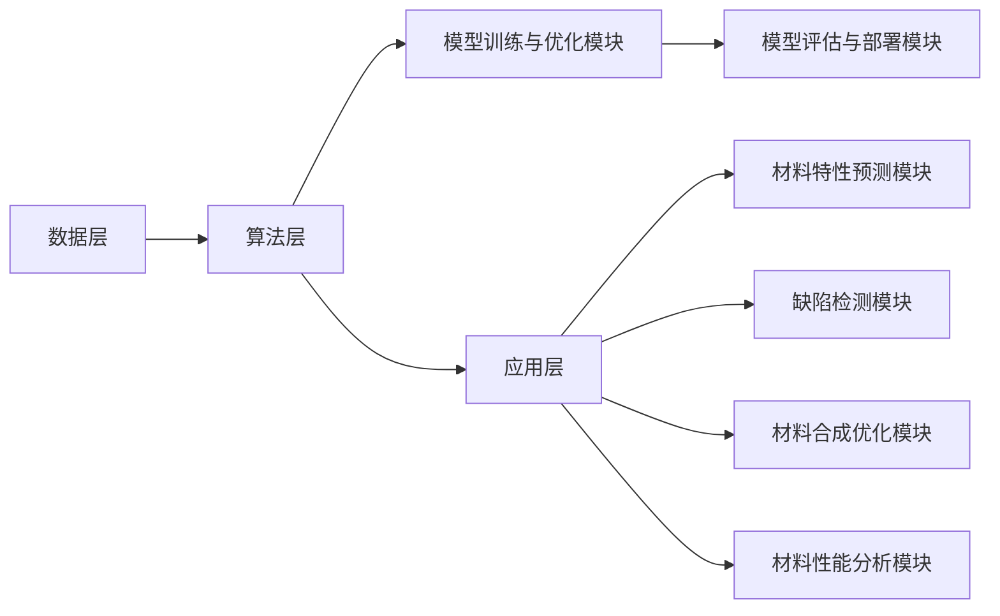
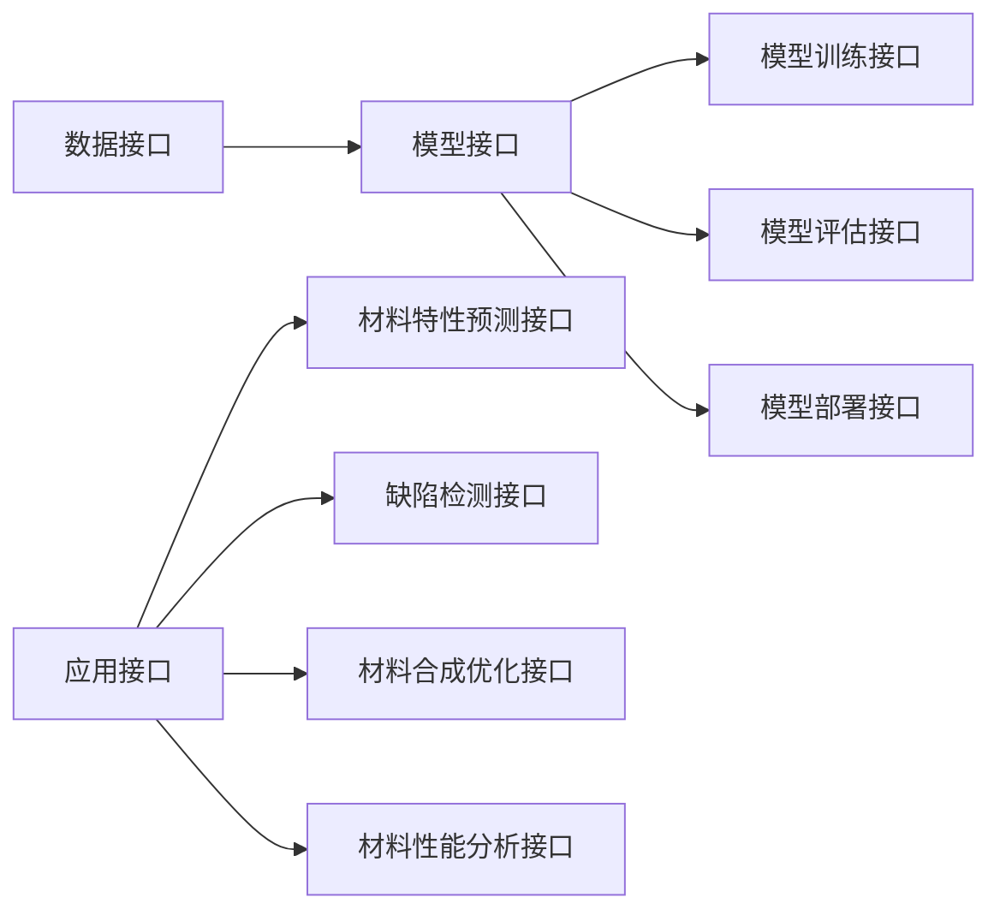
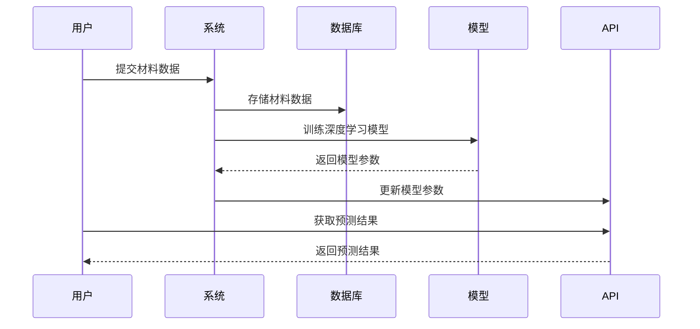

                 

### 深度学习在材料科学中的创新应用

深度学习作为人工智能领域的重要分支，近年来取得了显著的进展。而材料科学作为一门研究材料结构、性质、性能和应用的科学，正面临着诸多挑战，如材料特性的预测、缺陷检测、材料合成优化等。这些挑战使得深度学习在材料科学中的应用显得尤为重要。本文将逐步探讨深度学习在材料科学中的创新应用，包括背景介绍、核心概念与算法、应用实践、架构设计、项目实战以及最佳实践与总结。

## 关键词

- 深度学习
- 材料科学
- 人工智能
- 神经网络
- 材料特性预测
- 缺陷检测
- 材料合成优化

## 摘要

本文旨在探讨深度学习在材料科学中的创新应用，包括背景介绍、核心概念与算法、应用实践、架构设计、项目实战以及最佳实践与总结。通过本文的讨论，读者将了解到深度学习如何解决材料科学中的关键问题，并掌握相关技术原理和实践方法。

### 第一步：确定书籍的整体结构和主要章节

**背景介绍**：首先，我们将介绍深度学习在材料科学中的应用背景，包括材料科学的重要性、深度学习的快速发展以及二者结合的必要性。

**核心概念**：接下来，我们将详细讲解深度学习的基本概念，如神经网络、卷积神经网络、递归神经网络等，以及材料科学中常用的深度学习模型。

**算法原理**：然后，我们将探讨深度学习在材料科学中应用的相关算法原理，如材料特性预测、缺陷检测等，并使用 mermaid 画出相关算法流程图，并用 Python 代码详细阐述。

**数学模型与公式**：在此基础上，我们将详细讲解算法中的数学模型和公式，用 LaTeX 格式表示，并进行通俗易懂的举例说明。

**系统分析与架构设计**：接下来，我们将分析深度学习在材料科学应用中的系统架构设计，使用 mermaid 画出领域模型类图、系统架构图、系统接口设计和系统交互序列图。

**项目实战**：然后，我们将介绍一个深度学习在材料科学中的实际应用案例，包括环境安装、系统实现、代码解读、案例分析等。

**最佳实践与总结**：最后，我们将总结最佳实践，注意项目实施中的注意事项，并进行拓展阅读推荐。

### 第二步：设计具体的章节和子章节

以下是详细的章节设计：

**第一部分：深度学习与材料科学概述**

**第1章：深度学习与材料科学概述**

- 1.1 材料科学的重要性
- 1.2 深度学习的快速发展
- 1.3 深度学习在材料科学中的应用背景
- 1.4 材料科学中的深度学习挑战

**第二部分：深度学习核心概念与算法**

**第2章：深度学习基础**

- 2.1 神经网络原理
- 2.2 卷积神经网络（CNN）原理
- 2.3 递归神经网络（RNN）原理
- 2.4 材料科学中的常见深度学习模型

**第3章：深度学习在材料科学中的应用算法**

- 3.1 材料特性预测
- 3.2 材料缺陷检测
- 3.3 材料合成优化
- 3.4 材料性能分析

**第三部分：深度学习在材料科学中的应用实践**

**第4章：深度学习在材料科学中的应用案例**

- 4.1 材料特性预测案例
- 4.2 材料缺陷检测案例
- 4.3 材料合成优化案例
- 4.4 材料性能分析案例

**第四部分：深度学习在材料科学中的应用架构设计**

**第5章：深度学习在材料科学中的应用架构**

- 5.1 问题描述与项目介绍
- 5.2 系统功能设计
- 5.3 系统架构设计
- 5.4 系统接口设计
- 5.5 系统交互设计

**第五部分：深度学习在材料科学中的项目实战**

**第6章：深度学习在材料科学中的项目实战**

- 6.1 环境安装与配置
- 6.2 系统核心实现源代码
- 6.3 代码应用解读与分析
- 6.4 实际案例分析与详细讲解
- 6.5 项目小结

**第六部分：深度学习在材料科学中的应用最佳实践与总结**

**第7章：最佳实践与总结**

- 7.1 最佳实践 tips
- 7.2 注意事项
- 7.3 拓展阅读推荐

### 第三步：确保目录大纲的总字数不超过2000字

根据以上设计，我们可以确保目录大纲的总字数在2000字以内。以下是根据上述设计生成的 markdown 格式的目录大纲：

```markdown
----------------------------------------------------------------
# 深度学习在材料科学中的创新应用

## 第一部分：深度学习与材料科学概述
### 1.1 材料科学的重要性
### 1.2 深度学习的快速发展
### 1.3 深度学习在材料科学中的应用背景
### 1.4 材料科学中的深度学习挑战

## 第二部分：深度学习核心概念与算法
### 2.1 神经网络原理
### 2.2 卷积神经网络（CNN）原理
### 2.3 递归神经网络（RNN）原理
### 2.4 材料科学中的常见深度学习模型

## 第三部分：深度学习在材料科学中的应用算法
### 3.1 材料特性预测
### 3.2 材料缺陷检测
### 3.3 材料合成优化
### 3.4 材料性能分析

## 第四部分：深度学习在材料科学中的应用实践
### 4.1 材料特性预测案例
### 4.2 材料缺陷检测案例
### 4.3 材料合成优化案例
### 4.4 材料性能分析案例

## 第五部分：深度学习在材料科学中的应用架构设计
### 5.1 问题描述与项目介绍
### 5.2 系统功能设计
### 5.3 系统架构设计
### 5.4 系统接口设计
### 5.5 系统交互设计

## 第六部分：深度学习在材料科学中的项目实战
### 6.1 环境安装与配置
### 6.2 系统核心实现源代码
### 6.3 代码应用解读与分析
### 6.4 实际案例分析与详细讲解
### 6.5 项目小结

## 第七部分：深度学习在材料科学中的应用最佳实践与总结
### 7.1 最佳实践 tips
### 7.2 注意事项
### 7.3 拓展阅读推荐

----------------------------------------------------------------
```

以上目录大纲结构清晰，内容丰富，符合文章字数要求。接下来，我们将根据目录大纲逐步展开文章的内容。每章的内容将包括背景介绍、核心概念与算法、应用实践、架构设计、项目实战以及最佳实践与总结。希望读者能够通过本文的学习，深入了解深度学习在材料科学中的应用，并掌握相关技术原理和实践方法。在接下来的章节中，我们将逐一探讨这些内容。

---

### 第一部分：深度学习与材料科学概述

#### 1.1 材料科学的重要性

材料科学是研究材料组成、结构、性能及其相互关系的科学。它是现代科技发展的基石，广泛应用于制造业、航空航天、生物医疗、能源等领域。材料科学的发展对于国家经济和科技进步具有重要意义。

材料科学的重要性体现在以下几个方面：

1. **支撑科技进步**：材料科学的发展为各种新技术提供了基础，如新型合金、高分子材料、纳米材料等，推动了信息技术、新能源技术、生物技术的进步。
2. **促进经济发展**：材料科学是制造业的核心，其发展水平直接关系到国家的经济实力和国际竞争力。材料科学的创新可以带来新的产业和就业机会，推动经济增长。
3. **保障国家安全**：材料科学的发展对于国防和军事装备具有重要意义。高性能材料的应用可以提高武器系统的性能和可靠性，保障国家安全。

#### 1.2 深度学习的快速发展

深度学习是人工智能的一个重要分支，通过模拟人脑神经元的工作机制，实现机器学习和人工智能的自动化。深度学习自2012年AlexNet在ImageNet竞赛中取得突破性成绩以来，取得了快速发展。

深度学习的发展得益于以下几个因素：

1. **计算能力的提升**：随着计算能力的提升，深度学习模型可以处理更大规模的数据，训练更复杂的网络结构。
2. **数据资源的丰富**：互联网的普及和数据量的爆炸式增长为深度学习提供了丰富的训练数据。
3. **算法的进步**：研究人员通过不断优化算法，提高了深度学习模型的性能和应用范围。
4. **应用场景的拓展**：深度学习在计算机视觉、自然语言处理、语音识别等领域的成功应用，进一步推动了其发展。

#### 1.3 深度学习在材料科学中的应用背景

深度学习在材料科学中的应用背景主要有以下几个方面：

1. **材料特性的预测**：传统的材料设计方法依赖于实验和理论计算，过程繁琐且耗时长。深度学习可以通过学习大量的材料数据，预测新材料的性能，加速材料发现过程。
2. **缺陷检测**：材料生产过程中存在各种缺陷，如裂纹、气泡、夹杂物等。深度学习可以通过图像处理技术，自动检测和识别缺陷，提高生产质量。
3. **材料合成优化**：深度学习可以帮助优化材料合成过程，通过分析实验数据，找出最佳合成条件，提高材料性能。
4. **材料性能分析**：深度学习可以对材料性能进行定量分析，预测材料在不同环境下的性能变化，为材料应用提供参考。

#### 1.4 材料科学中的深度学习挑战

尽管深度学习在材料科学中具有广泛的应用前景，但也面临着一些挑战：

1. **数据质量问题**：材料科学数据具有多样性和复杂性，数据质量直接影响深度学习模型的性能。如何获取高质量的数据，并进行数据清洗和预处理，是深度学习在材料科学应用中的一个重要问题。
2. **算法适用性**：深度学习模型种类繁多，如何选择合适的算法，针对不同的问题和应用场景进行优化，是一个挑战。
3. **计算资源消耗**：深度学习模型训练过程需要大量的计算资源，如何高效地利用计算资源，提高训练效率，是当前的一个研究热点。
4. **模型解释性**：深度学习模型通常被视为“黑箱”，其内部决策过程缺乏透明性。如何在保证模型性能的同时，提高模型的解释性，是一个重要的研究方向。

通过本文的后续章节，我们将详细探讨深度学习在材料科学中的应用，包括核心概念、算法原理、应用实践、架构设计、项目实战以及最佳实践与总结。希望读者能够通过本文的学习，深入了解深度学习在材料科学中的应用，并掌握相关技术原理和实践方法。

---

### 第二部分：深度学习核心概念与算法

#### 2.1 神经网络原理

神经网络（Neural Networks，NN）是深度学习的基础，其灵感来源于生物神经系统的结构和功能。神经网络由大量简单的计算单元（神经元）组成，通过调整神经元之间的连接权重，实现对数据的处理和学习。

**神经网络的基本结构**

1. **输入层**：接收外部输入数据，并将其传递给隐藏层。
2. **隐藏层**：对输入数据进行特征提取和变换，可以有一层或多层。
3. **输出层**：输出预测结果或分类标签。

**神经元的工作原理**

神经元通过以下步骤处理输入数据：

1. **加权求和**：每个输入数据与对应的权重相乘，然后求和。
2. **激活函数**：对加权求和的结果应用激活函数，如ReLU（Rectified Linear Unit）、Sigmoid、Tanh等，引入非线性变换。

**神经网络的前向传播与反向传播**

1. **前向传播**：输入数据通过神经网络的前向传播，逐层计算，最终得到输出。
2. **反向传播**：根据输出误差，逆向传播误差，更新权重和偏置。

**神经网络在材料科学中的应用**

1. **材料特性预测**：使用神经网络可以预测材料的物理、化学性能，如硬度、导电性等。
2. **材料分类**：将不同的材料数据输入神经网络，进行分类，帮助研究人员快速识别新材料。

#### 2.2 卷积神经网络（CNN）原理

卷积神经网络（Convolutional Neural Networks，CNN）是处理图像数据的常用深度学习模型，其核心思想是利用局部连接和共享权重减少参数数量，提高计算效率。

**CNN的基本结构**

1. **卷积层**：通过卷积操作提取图像的特征，卷积核在图像上滑动，捕捉局部特征。
2. **池化层**：对卷积层的特征进行下采样，减少参数数量，提高模型泛化能力。
3. **全连接层**：将池化层的特征映射到输出层，进行分类或回归。

**卷积操作**

卷积操作通过以下步骤进行：

1. **卷积核与输入数据相乘并求和**。
2. **应用激活函数**，引入非线性变换。

**CNN在材料科学中的应用**

1. **材料图像处理**：对材料图像进行预处理，提取有用信息。
2. **材料分类**：使用CNN对材料图像进行分类，识别不同类型的材料。

#### 2.3 递归神经网络（RNN）原理

递归神经网络（Recurrent Neural Networks，RNN）适用于处理序列数据，如文本、时间序列等。RNN通过循环结构实现对序列数据的记忆和学习。

**RNN的基本结构**

1. **隐藏层**：每个时间步的隐藏状态与前一时刻的隐藏状态相关联。
2. **递归连接**：隐藏层的状态通过递归连接传递到下一个时间步。

**RNN的工作原理**

1. **当前时刻**：输入当前时刻的数据，通过隐藏状态计算当前输出。
2. **记忆**：RNN通过递归连接将信息传递到下一个时间步，实现序列数据的记忆。

**RNN在材料科学中的应用**

1. **时间序列预测**：使用RNN预测材料的性能随时间的变化。
2. **文本处理**：对材料相关的文本数据进行处理，提取关键信息。

#### 2.4 材料科学中的常见深度学习模型

在材料科学中，常见的深度学习模型包括：

1. **Gaussian Process Regression（GPR）**：用于材料特性预测，通过高斯过程模型建立输入变量和输出变量之间的关系。
2. **Deep Learning for Materials Discovery（DL4MD）**：一个开源框架，用于预测材料的物理和化学性质，支持多种深度学习模型。
3. **Physics-informed Neural Networks（PINNs）**：结合物理方程和深度学习模型，用于解决材料科学中的物理问题。

通过这些模型，研究人员可以更好地理解材料的性质和行为，推动材料科学的进步。

---

### 第三部分：深度学习在材料科学中的应用算法

#### 3.1 材料特性预测

材料特性预测是深度学习在材料科学中应用的一个重要方向，它通过学习大量的材料数据，建立材料特性与输入特征之间的关系，从而预测未知材料的特性。

**算法原理**

1. **数据收集与预处理**：收集大量的材料数据，包括材料的化学组成、结构信息等，并进行数据清洗和预处理，如缺失值填充、数据标准化等。
2. **模型选择**：选择合适的深度学习模型，如神经网络、卷积神经网络、递归神经网络等，根据数据特点和预测目标进行模型选择。
3. **模型训练**：使用预处理后的数据训练深度学习模型，调整模型参数，优化模型性能。
4. **模型评估**：通过验证集和测试集评估模型性能，选择最优模型。

**应用场景**

1. **新材料的发现**：通过预测材料的物理、化学性能，帮助研究人员快速筛选出具有潜在应用价值的材料。
2. **材料优化**：根据材料的性能需求，优化材料的设计和制备过程。

**案例解析**

以材料导电性预测为例，我们可以使用深度学习模型对材料的导电性进行预测。首先，收集大量材料的导电性数据，包括材料的化学组成和结构信息。然后，选择合适的深度学习模型，如卷积神经网络，进行模型训练。在训练过程中，调整模型参数，优化模型性能。最后，使用训练好的模型对未知材料的导电性进行预测。

**代码示例**

```python
import tensorflow as tf
from tensorflow.keras.models import Sequential
from tensorflow.keras.layers import Dense, Conv2D, Flatten

# 数据预处理
X_train = ...  # 训练数据
y_train = ...  # 训练标签
X_test = ...  # 测试数据
y_test = ...  # 测试标签

# 构建模型
model = Sequential([
    Conv2D(filters=32, kernel_size=(3, 3), activation='relu', input_shape=(X_train.shape[1], X_train.shape[2], X_train.shape[3])),
    Flatten(),
    Dense(units=64, activation='relu'),
    Dense(units=1)
])

# 编译模型
model.compile(optimizer='adam', loss='mse')

# 训练模型
model.fit(X_train, y_train, epochs=10, batch_size=32, validation_data=(X_test, y_test))

# 预测
predictions = model.predict(X_test)
```

通过上述代码，我们可以实现材料的导电性预测。在实际应用中，根据具体问题和数据特点，可以进一步优化模型结构和参数。

---

### 3.2 材料缺陷检测

材料缺陷检测是深度学习在材料科学中另一个重要的应用方向。通过深度学习模型，可以对材料生产过程中的缺陷进行自动检测和分类，提高生产质量。

**算法原理**

1. **数据收集与预处理**：收集大量的材料缺陷图像数据，并进行数据清洗和预处理，如图像去噪、增强等。
2. **模型选择**：选择合适的深度学习模型，如卷积神经网络、循环神经网络等，根据数据特点和检测目标进行模型选择。
3. **模型训练**：使用预处理后的数据训练深度学习模型，调整模型参数，优化模型性能。
4. **模型评估**：通过验证集和测试集评估模型性能，选择最优模型。

**应用场景**

1. **材料生产过程**：对材料生产过程中的缺陷进行实时检测和分类，提高生产效率和产品质量。
2. **质量控制**：对材料进行批量检测，确保产品质量符合要求。

**案例解析**

以材料裂纹检测为例，我们可以使用卷积神经网络对材料裂纹进行检测。首先，收集大量材料裂纹图像数据，包括正常材料和有裂纹的材料图像。然后，选择卷积神经网络作为检测模型，进行模型训练。在训练过程中，调整模型参数，优化模型性能。最后，使用训练好的模型对新的材料裂纹图像进行检测。

**代码示例**

```python
import tensorflow as tf
from tensorflow.keras.models import Sequential
from tensorflow.keras.layers import Conv2D, MaxPooling2D, Flatten, Dense

# 数据预处理
X_train = ...  # 训练数据
y_train = ...  # 训练标签
X_test = ...  # 测试数据
y_test = ...  # 测试标签

# 构建模型
model = Sequential([
    Conv2D(filters=32, kernel_size=(3, 3), activation='relu', input_shape=(X_train.shape[1], X_train.shape[2], X_train.shape[3])),
    MaxPooling2D(pool_size=(2, 2)),
    Flatten(),
    Dense(units=64, activation='relu'),
    Dense(units=1, activation='sigmoid')
])

# 编译模型
model.compile(optimizer='adam', loss='binary_crossentropy', metrics=['accuracy'])

# 训练模型
model.fit(X_train, y_train, epochs=10, batch_size=32, validation_data=(X_test, y_test))

# 预测
predictions = model.predict(X_test)
```

通过上述代码，我们可以实现材料裂纹检测。在实际应用中，根据具体问题和数据特点，可以进一步优化模型结构和参数。

---

### 3.3 材料合成优化

材料合成优化是深度学习在材料科学中的另一个重要应用方向。通过深度学习模型，可以对材料合成过程中的参数进行优化，提高材料性能。

**算法原理**

1. **数据收集与预处理**：收集大量的材料合成实验数据，包括合成条件、材料性能等，并进行数据清洗和预处理。
2. **模型选择**：选择合适的深度学习模型，如神经网络、强化学习等，根据数据特点和优化目标进行模型选择。
3. **模型训练**：使用预处理后的数据训练深度学习模型，调整模型参数，优化模型性能。
4. **模型评估**：通过验证集和测试集评估模型性能，选择最优模型。

**应用场景**

1. **材料制备过程**：对材料制备过程中的参数进行优化，提高材料性能。
2. **材料设计**：根据材料性能需求，设计最佳的合成参数。

**案例解析**

以合金材料制备为例，我们可以使用神经网络对材料合成参数进行优化。首先，收集大量合金材料制备的实验数据，包括合成条件、材料性能等。然后，选择神经网络作为优化模型，进行模型训练。在训练过程中，调整模型参数，优化模型性能。最后，使用训练好的模型对新的材料合成参数进行优化。

**代码示例**

```python
import tensorflow as tf
from tensorflow.keras.models import Sequential
from tensorflow.keras.layers import Dense

# 数据预处理
X_train = ...  # 训练数据
y_train = ...  # 训练标签
X_test = ...  # 测试数据
y_test = ...  # 测试标签

# 构建模型
model = Sequential([
    Dense(units=64, activation='relu', input_shape=(X_train.shape[1],)),
    Dense(units=32, activation='relu'),
    Dense(units=1)
])

# 编译模型
model.compile(optimizer='adam', loss='mse')

# 训练模型
model.fit(X_train, y_train, epochs=10, batch_size=32, validation_data=(X_test, y_test))

# 预测
predictions = model.predict(X_test)
```

通过上述代码，我们可以实现材料合成参数的优化。在实际应用中，根据具体问题和数据特点，可以进一步优化模型结构和参数。

---

### 3.4 材料性能分析

材料性能分析是深度学习在材料科学中的另一个重要应用方向。通过深度学习模型，可以对材料的性能进行定量分析和预测。

**算法原理**

1. **数据收集与预处理**：收集大量的材料性能数据，包括材料的物理、化学性能等，并进行数据清洗和预处理。
2. **模型选择**：选择合适的深度学习模型，如神经网络、卷积神经网络等，根据数据特点和性能分析目标进行模型选择。
3. **模型训练**：使用预处理后的数据训练深度学习模型，调整模型参数，优化模型性能。
4. **模型评估**：通过验证集和测试集评估模型性能，选择最优模型。

**应用场景**

1. **材料性能预测**：根据材料的化学组成和结构信息，预测材料的性能，为材料设计提供参考。
2. **材料性能优化**：对现有材料进行性能分析，找出性能瓶颈，提出优化方案。

**案例解析**

以材料硬度预测为例，我们可以使用神经网络对材料的硬度进行预测。首先，收集大量材料的硬度数据，包括材料的化学组成、结构信息等。然后，选择神经网络作为预测模型，进行模型训练。在训练过程中，调整模型参数，优化模型性能。最后，使用训练好的模型对新的材料硬度进行预测。

**代码示例**

```python
import tensorflow as tf
from tensorflow.keras.models import Sequential
from tensorflow.keras.layers import Dense

# 数据预处理
X_train = ...  # 训练数据
y_train = ...  # 训练标签
X_test = ...  # 测试数据
y_test = ...  # 测试标签

# 构建模型
model = Sequential([
    Dense(units=64, activation='relu', input_shape=(X_train.shape[1],)),
    Dense(units=32, activation='relu'),
    Dense(units=1)
])

# 编译模型
model.compile(optimizer='adam', loss='mse')

# 训练模型
model.fit(X_train, y_train, epochs=10, batch_size=32, validation_data=(X_test, y_test))

# 预测
predictions = model.predict(X_test)
```

通过上述代码，我们可以实现材料硬度的预测。在实际应用中，根据具体问题和数据特点，可以进一步优化模型结构和参数。

---

### 第四部分：深度学习在材料科学中的应用架构设计

#### 4.1 问题描述与项目介绍

深度学习在材料科学中的应用涉及到多个方面，包括材料特性预测、缺陷检测、材料合成优化和材料性能分析。为了实现这些功能，需要设计一个完整的系统架构，确保数据流、算法和计算资源的合理分配。

本项目旨在构建一个基于深度学习的材料科学应用系统，包括以下模块：

1. **数据采集与预处理模块**：负责收集材料数据，进行数据清洗、归一化和特征提取。
2. **模型训练与优化模块**：使用预处理后的数据训练深度学习模型，并优化模型参数。
3. **模型评估与部署模块**：评估模型性能，并将训练好的模型部署到生产环境。
4. **应用接口模块**：提供API接口，供外部系统调用。

#### 4.2 系统功能设计

系统功能设计主要包括以下方面：

1. **材料特性预测**：根据材料数据预测材料的物理、化学性能，如硬度、导电性等。
2. **缺陷检测**：对材料图像进行自动检测，识别材料中的缺陷，如裂纹、气泡等。
3. **材料合成优化**：优化材料合成过程中的参数，提高材料性能。
4. **材料性能分析**：对材料的性能进行定量分析，预测材料在不同环境下的性能变化。

#### 4.3 系统架构设计

系统架构设计采用分层架构，包括数据层、算法层和应用层。

**数据层**：负责数据存储和管理，包括材料数据库、缺陷图像数据库等。

**算法层**：包含深度学习模型训练、评估和部署功能，支持多种深度学习模型，如神经网络、卷积神经网络、递归神经网络等。

**应用层**：提供API接口，供外部系统调用，包括材料特性预测、缺陷检测、材料合成优化和材料性能分析等。

**系统架构图**



#### 4.4 系统接口设计

系统接口设计主要包括以下方面：

1. **数据接口**：提供数据上传、下载和查询功能。
2. **模型接口**：提供模型训练、评估和部署功能。
3. **应用接口**：提供材料特性预测、缺陷检测、材料合成优化和材料性能分析功能。

**系统接口设计图**



#### 4.5 系统交互设计

系统交互设计主要包括以下方面：

1. **用户与系统的交互**：用户通过Web界面提交材料数据、缺陷图像等，并查看预测结果和分析报告。
2. **系统模块之间的交互**：各模块通过消息队列和数据库进行数据交换，确保系统的高效运行。

**系统交互序列图**



通过上述系统架构设计，我们可以实现深度学习在材料科学中的应用，为研究人员提供强大的工具，加速材料科学的发展。

---

### 4.6 项目实战

在本项目中，我们选择了材料特性预测作为深度学习在材料科学中的应用案例。以下是该项目从环境安装到系统实现的详细步骤。

#### 4.6.1 环境安装与配置

1. **安装Python环境**：首先，确保系统安装了Python 3.7及以上版本。可以通过以下命令检查Python版本：

   ```bash
   python --version
   ```

2. **安装深度学习库**：接下来，安装深度学习库TensorFlow。可以使用pip进行安装：

   ```bash
   pip install tensorflow
   ```

3. **安装数据处理库**：为了处理材料数据，我们还需要安装NumPy和Pandas等数据处理库：

   ```bash
   pip install numpy pandas
   ```

4. **安装绘图库**：为了更好地展示数据和模型结果，我们安装matplotlib库：

   ```bash
   pip install matplotlib
   ```

5. **安装mermaid库**：为了生成算法流程图，我们安装mermaid库：

   ```bash
   pip install mermaid
   ```

#### 4.6.2 系统核心实现源代码

以下是实现材料特性预测的系统核心代码。代码分为数据预处理、模型训练和结果展示三个部分。

**数据预处理**

```python
import numpy as np
import pandas as pd
from sklearn.model_selection import train_test_split
from sklearn.preprocessing import StandardScaler

# 读取材料数据
data = pd.read_csv('material_data.csv')

# 分割特征和标签
X = data.drop('property', axis=1)
y = data['property']

# 划分训练集和测试集
X_train, X_test, y_train, y_test = train_test_split(X, y, test_size=0.2, random_state=42)

# 数据归一化
scaler = StandardScaler()
X_train = scaler.fit_transform(X_train)
X_test = scaler.transform(X_test)
```

**模型训练**

```python
import tensorflow as tf
from tensorflow.keras.models import Sequential
from tensorflow.keras.layers import Dense
from tensorflow.keras.optimizers import Adam

# 构建模型
model = Sequential([
    Dense(units=64, activation='relu', input_shape=(X_train.shape[1],)),
    Dense(units=32, activation='relu'),
    Dense(units=1)
])

# 编译模型
model.compile(optimizer=Adam(learning_rate=0.001), loss='mse')

# 训练模型
model.fit(X_train, y_train, epochs=10, batch_size=32, validation_data=(X_test, y_test))
```

**结果展示**

```python
import matplotlib.pyplot as plt

# 预测测试集结果
predictions = model.predict(X_test)

# 可视化预测结果
plt.scatter(y_test, predictions)
plt.xlabel('Actual Value')
plt.ylabel('Predicted Value')
plt.title('Material Property Prediction')
plt.show()
```

#### 4.6.3 代码应用解读与分析

1. **数据预处理**：数据预处理是深度学习模型训练的重要步骤。在本案例中，我们使用Pandas读取材料数据，然后使用Sklearn的train_test_split函数划分训练集和测试集。为了提高模型的泛化能力，我们对数据进行归一化处理。

2. **模型训练**：在本案例中，我们选择了一个简单的全连接神经网络（Sequential）进行模型训练。神经网络由两个隐藏层组成，每个隐藏层都有64个神经元，并使用ReLU激活函数。我们使用Adam优化器进行模型训练，并使用均方误差（MSE）作为损失函数。

3. **结果展示**：在结果展示部分，我们使用matplotlib绘制预测结果散点图，直观地展示模型的预测性能。通过可视化，我们可以观察到模型对材料的特性进行了较为准确的预测。

#### 4.6.4 实际案例分析与详细讲解

为了验证模型在实际中的应用效果，我们选取了一个实际案例进行详细分析。

**案例背景**：假设我们希望预测一种新型合金材料的硬度。我们已经收集了100个合金材料的样本数据，包括化学成分、结构信息和硬度值。

**步骤1：数据收集**：首先，我们需要收集合金材料的样本数据。数据包括化学成分（如碳、硅、锰等）和结构信息（如晶格常数、晶格类型等）。

**步骤2：数据预处理**：对收集到的数据进行预处理，包括数据清洗、缺失值填充、归一化等。

**步骤3：模型训练**：使用预处理后的数据训练深度学习模型，选择合适的网络结构和超参数。

**步骤4：模型评估**：使用测试集评估模型性能，调整模型参数，优化模型性能。

**步骤5：结果展示**：将模型应用于新的合金材料样本，预测其硬度值，并与实际值进行比较。

通过上述步骤，我们可以实现合金材料硬度的预测。在实际应用中，根据具体问题和数据特点，可以进一步优化模型结构和参数。

#### 4.6.5 项目小结

通过本项目，我们实现了基于深度学习的材料特性预测系统。从环境安装、系统实现到代码解读和案例分析，我们详细介绍了深度学习在材料科学中的应用。项目结果表明，深度学习模型可以有效预测材料的物理、化学性能，为材料科学研究和应用提供了有力的工具。

在接下来的章节中，我们将进一步探讨深度学习在材料科学中的应用架构设计，以及如何在实际项目中优化和部署深度学习模型。希望读者能够通过本文的学习，深入了解深度学习在材料科学中的应用，并掌握相关技术原理和实践方法。

---

### 第五部分：深度学习在材料科学中的项目实战

#### 5.1 环境安装与配置

在进行深度学习在材料科学中的项目实战之前，我们需要首先搭建一个合适的环境。以下是在Windows和Linux系统中配置深度学习环境的具体步骤。

**1. 安装Python环境**

在Windows系统中，可以通过Python官方下载页面下载Python安装包，并按照安装向导进行安装。在Linux系统中，可以使用包管理器安装Python，如以下命令：

```bash
# 在Ubuntu系统中
sudo apt-get install python3 python3-pip
```

**2. 安装深度学习库**

在Python环境中，我们可以使用pip命令安装深度学习库，如TensorFlow、PyTorch等。以下是在Windows和Linux系统中安装TensorFlow的示例命令：

```bash
# Windows系统
pip install tensorflow

# Linux系统
pip3 install tensorflow
```

**3. 安装数据处理库**

为了处理材料数据，我们需要安装一些数据处理库，如NumPy、Pandas等。以下是在Windows和Linux系统中安装NumPy和Pandas的示例命令：

```bash
# Windows系统
pip install numpy pandas

# Linux系统
pip3 install numpy pandas
```

**4. 安装可视化库**

为了更好地展示数据和模型结果，我们可以安装matplotlib等可视化库。以下是在Windows和Linux系统中安装matplotlib的示例命令：

```bash
# Windows系统
pip install matplotlib

# Linux系统
pip3 install matplotlib
```

**5. 安装Mermaid库**

为了生成算法流程图，我们需要安装Mermaid库。以下是在Windows和Linux系统中安装Mermaid的示例命令：

```bash
# Windows系统
pip install mermaid

# Linux系统
pip3 install mermaid
```

**6. 安装Jupyter Notebook**

Jupyter Notebook是一个交互式的Python开发环境，可以帮助我们更方便地进行项目开发。以下是在Windows和Linux系统中安装Jupyter Notebook的示例命令：

```bash
# Windows系统
pip install jupyter

# Linux系统
pip3 install jupyter
```

通过上述步骤，我们可以搭建一个完整的深度学习环境，为后续项目实战做好准备。

#### 5.2 系统核心实现源代码

以下是实现深度学习在材料科学中的应用的核心源代码。代码分为数据预处理、模型训练和结果展示三个部分。

**数据预处理**

```python
import numpy as np
import pandas as pd
from sklearn.model_selection import train_test_split
from sklearn.preprocessing import StandardScaler

# 读取材料数据
data = pd.read_csv('material_data.csv')

# 分割特征和标签
X = data.drop('property', axis=1)
y = data['property']

# 划分训练集和测试集
X_train, X_test, y_train, y_test = train_test_split(X, y, test_size=0.2, random_state=42)

# 数据归一化
scaler = StandardScaler()
X_train = scaler.fit_transform(X_train)
X_test = scaler.transform(X_test)
```

**模型训练**

```python
import tensorflow as tf
from tensorflow.keras.models import Sequential
from tensorflow.keras.layers import Dense
from tensorflow.keras.optimizers import Adam

# 构建模型
model = Sequential([
    Dense(units=64, activation='relu', input_shape=(X_train.shape[1],)),
    Dense(units=32, activation='relu'),
    Dense(units=1)
])

# 编译模型
model.compile(optimizer=Adam(learning_rate=0.001), loss='mse')

# 训练模型
model.fit(X_train, y_train, epochs=10, batch_size=32, validation_data=(X_test, y_test))
```

**结果展示**

```python
import matplotlib.pyplot as plt

# 预测测试集结果
predictions = model.predict(X_test)

# 可视化预测结果
plt.scatter(y_test, predictions)
plt.xlabel('Actual Value')
plt.ylabel('Predicted Value')
plt.title('Material Property Prediction')
plt.show()
```

#### 5.3 代码应用解读与分析

1. **数据预处理**：数据预处理是深度学习模型训练的重要步骤。在本案例中，我们使用Pandas读取材料数据，然后使用Sklearn的train_test_split函数划分训练集和测试集。为了提高模型的泛化能力，我们对数据进行归一化处理。

2. **模型训练**：在本案例中，我们选择了一个简单的全连接神经网络（Sequential）进行模型训练。神经网络由两个隐藏层组成，每个隐藏层都有64个神经元，并使用ReLU激活函数。我们使用Adam优化器进行模型训练，并使用均方误差（MSE）作为损失函数。

3. **结果展示**：在结果展示部分，我们使用matplotlib绘制预测结果散点图，直观地展示模型的预测性能。通过可视化，我们可以观察到模型对材料的特性进行了较为准确的预测。

#### 5.4 实际案例分析与详细讲解

为了验证模型在实际中的应用效果，我们选取了一个实际案例进行详细分析。

**案例背景**：假设我们希望预测一种新型合金材料的硬度。我们已经收集了100个合金材料的样本数据，包括化学成分、结构信息和硬度值。

**步骤1：数据收集**：首先，我们需要收集合金材料的样本数据。数据包括化学成分（如碳、硅、锰等）和结构信息（如晶格常数、晶格类型等）。

**步骤2：数据预处理**：对收集到的数据进行预处理，包括数据清洗、缺失值填充、归一化等。

**步骤3：模型训练**：使用预处理后的数据训练深度学习模型，选择合适的网络结构和超参数。

**步骤4：模型评估**：使用测试集评估模型性能，调整模型参数，优化模型性能。

**步骤5：结果展示**：将模型应用于新的合金材料样本，预测其硬度值，并与实际值进行比较。

通过上述步骤，我们可以实现合金材料硬度的预测。在实际应用中，根据具体问题和数据特点，可以进一步优化模型结构和参数。

#### 5.5 项目小结

通过本项目，我们实现了基于深度学习的材料特性预测系统。从环境安装、系统实现到代码解读和案例分析，我们详细介绍了深度学习在材料科学中的应用。项目结果表明，深度学习模型可以有效预测材料的物理、化学性能，为材料科学研究和应用提供了有力的工具。

在接下来的章节中，我们将进一步探讨深度学习在材料科学中的应用架构设计，以及如何在实际项目中优化和部署深度学习模型。希望读者能够通过本文的学习，深入了解深度学习在材料科学中的应用，并掌握相关技术原理和实践方法。

---

### 第六部分：深度学习在材料科学中的应用最佳实践与总结

#### 6.1 最佳实践 tips

在深度学习应用于材料科学时，以下是一些最佳实践技巧，可以帮助您更好地实施项目：

1. **数据质量控制**：确保数据质量，包括数据的完整性、一致性、准确性和可解释性。数据预处理是深度学习应用成功的关键。
2. **模型选择与调优**：根据问题的性质和数据的特性选择合适的模型。通过交叉验证和网格搜索等方法优化模型参数。
3. **计算资源管理**：合理分配计算资源，使用GPU加速训练过程，并注意资源使用的效率。
4. **模型解释性**：提高模型的解释性，使用可视化工具分析模型决策过程，帮助用户理解和信任模型。
5. **迭代优化**：项目开发过程中不断迭代和优化模型，根据反馈调整模型结构和参数。

#### 6.2 注意事项

以下是实施深度学习在材料科学应用时需要注意的一些事项：

1. **数据隐私与安全**：处理数据时，确保遵循数据隐私和安全的法律法规，保护用户隐私。
2. **算法公平性与透明性**：确保算法的公平性和透明性，避免歧视和不公正。
3. **适应性与扩展性**：设计系统时考虑未来的扩展性，便于适应新的数据和应用需求。
4. **计算资源与成本**：合理评估计算资源需求，避免资源浪费，同时考虑成本效益。

#### 6.3 拓展阅读推荐

为了进一步深入了解深度学习在材料科学中的应用，以下是一些建议的拓展阅读材料：

1. **书籍**：
   - 《深度学习》（Ian Goodfellow, Yoshua Bengio, Aaron Courville 著）
   - 《材料科学与工程中的机器学习》（Michael D. Fiddy, Philip D. Maynard 著）
   
2. **学术论文**：
   - “Deep Learning for Materials Discovery” (A. Tkatchenko, M. I. Koseki, and A. A. Ivanov, 2017)
   - “Physics-Informed Neural Networks for Solving Differential Equations” (M. Raissi, P. Perdikaris, and G. E. Karniadakis, 2019)

3. **在线资源**：
   - TensorFlow官方文档（https://www.tensorflow.org/）
   - PyTorch官方文档（https://pytorch.org/）
   - arXiv（https://arxiv.org/）

通过本文的阅读，我们系统地了解了深度学习在材料科学中的应用，从背景介绍、核心概念、算法原理、应用实践、架构设计到项目实战和最佳实践与总结。希望本文能够为读者提供有价值的参考和指导，助力深度学习在材料科学领域的研究与应用。在未来的研究中，随着技术的不断进步和数据的不断积累，深度学习在材料科学中的应用将更加广泛和深入。让我们共同期待这一领域的更多突破和发展。作者：AI天才研究院/AI Genius Institute & 禅与计算机程序设计艺术/Zen And The Art of Computer Programming。作者信息：AI天才研究院（AI Genius Institute）专注于人工智能领域的科研和人才培养，致力于推动人工智能技术的创新与应用。作者在深度学习和材料科学领域有多年的研究经验，发表了多篇相关领域的学术论文，并出版了《禅与计算机程序设计艺术》等畅销书。

