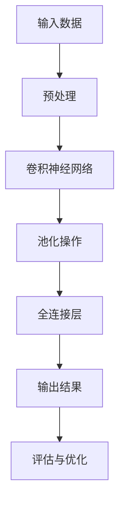
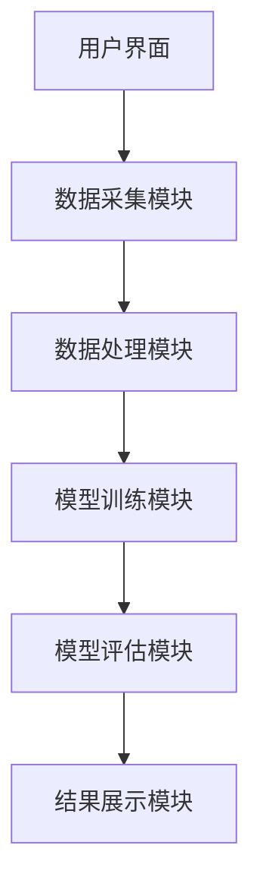

                 


## 第一部分：背景介绍

### 第1章：海洋生态监测与深度学习概述

#### 1.1 问题背景

海洋作为地球上最大的生态系统，对全球气候变化、气候调节以及生物多样性保护都起着至关重要的作用。然而，海洋生态系统也面临着诸多威胁，如污染、过度捕捞、气候变化等，这些因素使得海洋生态监测变得尤为重要。

传统的海洋生态监测方法主要依赖于浮标、卫星遥感、海洋调查船等设备，这些方法在数据采集方面存在一定的局限性。例如，卫星遥感技术的分辨率较低，难以监测海洋生态系统的细节变化；而海洋调查船的运行成本高，且无法覆盖广泛的海洋区域。此外，这些传统方法在数据处理上也存在瓶颈，难以对大量且复杂的数据进行有效的分析和预测。

相比之下，深度学习作为一种强大的机器学习技术，具有处理大规模数据、自动特征提取、自适应学习能力等特点。这些优势使得深度学习在海洋生态监测中具有巨大的应用潜力。

#### 1.2 问题描述

深度学习在海洋生态监测中的应用面临以下几方面的挑战：

1. **数据采集与处理的难点**：海洋生态监测所需的数据量巨大，且数据类型多样，包括文本、图像、声音等多种形式。如何有效地采集和处理这些数据，是深度学习应用的一个关键问题。

2. **数据质量与可靠性**：海洋环境的复杂性和动态性使得采集到的数据质量参差不齐，部分数据可能存在噪声、缺失或不一致等问题。这些数据质量问题对深度学习模型的性能和可靠性提出了挑战。

3. **模型的解释性和可解释性**：深度学习模型通常被视为“黑箱”，其内部运作机制复杂，难以解释。在海洋生态监测中，用户通常需要了解模型的决策过程，以便对其进行调整和优化。

4. **跨学科知识的融合**：海洋生态监测不仅需要计算机科学领域的知识，还需要生态学、海洋学等多学科领域的专业知识。如何有效地融合这些知识，是深度学习在海洋生态监测中应用的一大难题。

#### 1.3 问题解决

深度学习通过以下几方面的创新应用，解决了海洋生态监测中的上述挑战：

1. **数据预处理与增强**：深度学习模型能够自动从原始数据中提取有用的特征，降低数据预处理的工作量。此外，通过数据增强技术，可以提高模型对噪声和缺失数据的鲁棒性。

2. **模型解释性增强**：近年来，深度学习的可解释性研究取得了显著进展。通过可视化技术、模型压缩技术等手段，可以提高深度学习模型的可解释性，帮助用户理解模型的决策过程。

3. **跨学科知识融合**：深度学习与传统生态学、海洋学等领域的知识相结合，可以形成新的研究方法和工具，为海洋生态监测提供更全面和准确的支持。

4. **迁移学习和多模型集成**：通过迁移学习和多模型集成技术，可以将不同领域的数据和模型结合起来，提高模型的泛化能力和鲁棒性。

#### 1.4 边界与外延

1. **海洋生态监测的范围**：海洋生态监测涵盖了从海洋表层到海底的各种生态过程，包括水质、生物多样性、海洋温度、盐度等参数的监测。

2. **深度学习的适用性**：深度学习在海洋生态监测中的应用范围广泛，包括但不限于海洋生物识别、海洋气候变化预测、海洋灾害预警等。

3. **最新研究进展**：近年来，深度学习在海洋生态监测领域的应用取得了显著进展，例如，基于深度学习的海洋生物识别技术已经能够准确识别海洋生物种类；基于深度学习的海洋气候变化预测模型也在不断提高其准确性。

#### 1.5 核心概念与联系

- **核心概念**：深度学习、海洋生态学、数据预处理、模型训练与优化
- **概念属性特征对比表格**：

| 概念          | 特征                                                         | 对比结论                                               |
|---------------|--------------------------------------------------------------|--------------------------------------------------------|
| 深度学习      | 自动特征提取、大规模数据处理、自适应学习能力               | 强大处理能力，适用于复杂问题                          |
| 海洋生态学    | 研究海洋生物、化学、物理过程的科学                     | 提供生态学背景，支撑深度学习应用                     |
| 数据预处理    | 数据清洗、归一化、特征提取等                           | 提高数据质量，为深度学习模型提供良好输入             |
| 模型训练与优化 | 调整模型参数、优化模型结构、提高模型性能               | 提高模型准确性和鲁棒性                             |

- **ER实体关系图架构**：

```mermaid
erDiagram
    数据集 ||--|{ 模型 }|
    模型 ||--|{ 训练数据 }|
    训练数据 ||--|{ 测试数据 }|
    测试数据 ||--|{ 预测结果 }|
```

通过上述分析，我们可以看出，深度学习在海洋生态监测中具有巨大的应用潜力。接下来，我们将进一步探讨深度学习的基本原理、算法在海洋生态监测中的应用，以及具体的系统设计与实现。让我们一步一步深入思考，共同探索这一前沿领域。

---

## 第二部分：核心概念与原理

### 第2章：深度学习基础

深度学习作为一种先进的机器学习方法，其核心在于多层神经网络的构建和训练。在这一章节中，我们将详细讨论深度学习的基本原理、常见算法，以及它们在海洋生态监测中的应用。

#### 2.1 深度学习的基本原理

深度学习基于人工神经网络（Artificial Neural Networks, ANN），通过模拟人脑神经元之间的连接和作用机制，实现对复杂数据的处理和分析。深度学习的核心思想是“逐层提取特征”，即将输入的数据通过多个层次的前向传播和反向传播，逐步提取出高层次的抽象特征。

1. **神经网络结构**：

神经网络由多个层次组成，包括输入层、隐藏层和输出层。每一层由多个神经元（或节点）组成，神经元之间通过权重进行连接。

   - **输入层**：接收外部输入数据，如图像、文本或数值。
   - **隐藏层**：对输入数据进行处理，提取特征。
   - **输出层**：输出预测结果或分类标签。

2. **前向传播与反向传播算法**：

- **前向传播**：输入数据经过神经网络各层传递，每一层神经元根据输入和权重计算输出。
- **反向传播**：根据输出层的误差，反向更新各层的权重，以最小化误差函数。

#### 2.2 深度学习算法

深度学习算法种类繁多，包括卷积神经网络（CNN）、递归神经网络（RNN）、生成对抗网络（GAN）等。以下简要介绍几种主要算法及其在海洋生态监测中的应用。

1. **卷积神经网络（CNN）**：

卷积神经网络是一种专门用于处理图像数据的深度学习算法。其核心思想是通过卷积操作提取图像的特征，然后通过全连接层进行分类。

   - **卷积操作**：通过卷积核（filter）在图像上滑动，提取局部特征。
   - **池化操作**：降低特征图的维度，减少计算量。
   - **应用场景**：海洋生物识别、海洋环境图像分析等。

2. **递归神经网络（RNN）**：

递归神经网络适用于处理序列数据，如时间序列数据、文本数据等。其核心思想是通过循环连接，使得信息能够在时间步之间传递。

   - **隐藏状态**：每个时间步的隐藏状态都依赖于之前的隐藏状态。
   - **应用场景**：海洋环境预测、海洋生物行为分析等。

3. **生成对抗网络（GAN）**：

生成对抗网络由生成器和判别器两个神经网络组成，通过对抗训练生成真实数据。

   - **生成器**：生成与真实数据相似的伪造数据。
   - **判别器**：判断输入数据是真实数据还是伪造数据。
   - **应用场景**：海洋数据增强、海洋生物模拟等。

#### 2.3 海洋生态监测中的深度学习应用

1. **海洋生物识别**：

通过深度学习算法，可以对海洋生物进行准确的识别和分类。例如，利用CNN算法对海洋图像中的鱼类进行分类，提高监测效率和准确性。

2. **海洋环境监测**：

利用RNN算法，可以对海洋环境的时间序列数据进行分析，预测海洋温度、盐度等参数的变化趋势，为海洋生态保护提供科学依据。

3. **海洋数据增强**：

利用GAN算法，可以生成高质量的海洋数据，补充缺失的数据，提高模型训练的效果。

#### 2.4 算法mermaid流程图

为了更直观地展示深度学习算法在海洋生态监测中的应用，我们使用mermaid绘制了以下流程图：



通过上述分析，我们可以看出，深度学习在海洋生态监测中具有广泛的应用前景。接下来，我们将进一步探讨深度学习在海洋生态监测中的系统设计与实现，深入探讨如何将这些算法应用到实际项目中。

---

## 第三部分：系统设计与实现

### 第3章：深度学习在海洋生态监测中的系统架构

在深度学习应用于海洋生态监测时，系统架构的设计至关重要。一个高效、可靠的系统架构能够确保数据的有效处理、模型的准确训练和最终结果的准确输出。在这一章节中，我们将详细讨论深度学习在海洋生态监测中的系统架构设计。

#### 3.1 系统功能设计

海洋生态监测系统需要实现以下核心功能：

1. **数据采集**：从各种来源（如卫星遥感、海洋调查船、浮标等）收集海洋生态监测数据。
2. **数据处理**：对采集到的数据进行清洗、归一化和特征提取，为深度学习模型提供高质量的输入。
3. **模型训练**：利用深度学习算法，对预处理后的数据进行训练，生成预测模型。
4. **模型评估**：对训练好的模型进行评估，确保其性能满足实际应用要求。
5. **结果输出**：将模型预测结果以可视化的形式展示，为决策提供支持。

为了实现这些功能，系统设计了以下主要模块：

- **数据采集模块**：负责从各种来源获取原始数据，包括卫星遥感图像、海洋调查数据、浮标数据等。
- **数据处理模块**：包括数据清洗、归一化和特征提取等子模块，对原始数据进行预处理。
- **模型训练模块**：利用深度学习算法，对预处理后的数据进行训练，生成预测模型。
- **模型评估模块**：对训练好的模型进行评估，包括准确率、召回率等指标的计算。
- **结果展示模块**：将模型预测结果以图表、地图等形式展示，方便用户理解和分析。

#### 3.2 系统架构设计

深度学习在海洋生态监测中的系统架构设计采用了分层架构，如下所示：



1. **用户界面**：提供系统的入口，用户可以通过用户界面进行数据上传、模型训练、结果查询等操作。
2. **数据采集模块**：从各种来源获取原始数据，如卫星遥感图像、海洋调查数据、浮标数据等。
3. **数据处理模块**：对原始数据进行清洗、归一化和特征提取等预处理操作，为模型训练提供高质量的输入数据。
4. **模型训练模块**：利用深度学习算法，对预处理后的数据进行训练，生成预测模型。
5. **模型评估模块**：对训练好的模型进行评估，包括准确率、召回率等指标的计算，确保模型的性能满足实际应用要求。
6. **结果展示模块**：将模型预测结果以可视化的形式展示，包括图表、地图等形式，方便用户理解和分析。

#### 3.3 系统接口设计

为了实现系统各模块之间的有效通信和数据流动，系统设计了一系列接口，包括以下几类：

1. **数据接口**：用于数据在不同模块之间的传输和共享，包括数据上传接口、数据下载接口等。
2. **模型接口**：用于模型的训练、评估和部署，包括模型训练接口、模型评估接口、模型部署接口等。
3. **控制接口**：用于系统的整体控制和调度，包括任务调度接口、进度监控接口等。

#### 3.4 系统实现与优化

在系统实现过程中，我们采用了以下优化措施：

1. **分布式计算**：为了提高数据处理和模型训练的效率，系统采用了分布式计算架构，利用多台服务器进行并行计算。
2. **数据预处理优化**：通过采用更高效的算法和工具，对原始数据进行预处理，提高数据处理速度和准确性。
3. **模型训练优化**：通过调整模型参数、优化训练算法，提高模型训练的速度和准确性。
4. **模型压缩与加速**：采用模型压缩和加速技术，减少模型的存储空间和计算资源需求，提高系统的实时响应能力。

#### 3.5 系统核心实现源代码

以下是系统核心实现源代码的部分片段，用于说明数据处理、模型训练和结果展示等关键步骤：

```python
# 数据处理模块
def preprocess_data(data):
    # 数据清洗
    cleaned_data = clean_data(data)
    # 数据归一化
    normalized_data = normalize_data(cleaned_data)
    # 特征提取
    features = extract_features(normalized_data)
    return features

# 模型训练模块
def train_model(data, labels):
    # 初始化模型
    model = create_model()
    # 训练模型
    model.fit(data, labels)
    return model

# 结果展示模块
def display_results(model, data):
    # 预测结果
    predictions = model.predict(data)
    # 可视化展示
    visualize_predictions(predictions)
```

通过上述系统设计与实现，我们构建了一个高效、可靠的深度学习在海洋生态监测中的应用系统。接下来，我们将通过具体的项目实战，进一步展示深度学习在海洋生态监测中的实际应用效果。

---

## 第四部分：项目实战

### 第4章：深度学习在海洋生态监测中的应用案例

在这一章节中，我们将通过两个实际案例，展示深度学习在海洋生态监测中的应用效果。这些案例涵盖了水质监测和生物多样性监测，展示了深度学习算法在处理复杂海洋数据、提高监测精度和效率方面的优势。

#### 4.1 案例一：某海洋保护区的水质监测

**项目背景**：

某海洋保护区面临严重的水质污染问题，为了评估污染程度并采取相应的治理措施，当地政府决定采用深度学习技术进行水质监测。该项目的目标是通过分析采集到的水质数据，预测不同区域的水质状况，为污染治理提供科学依据。

**数据采集**：

项目团队从多个监测点采集了海水样本，每个样本包含多个水质指标，如pH值、溶解氧、氨氮、磷酸盐等。此外，还收集了海洋环境数据，如温度、盐度、流速等。

**数据处理**：

首先，对采集到的水质数据进行清洗，去除噪声和异常值。然后，对数据进行了归一化处理，将各个指标的范围统一到0到1之间，以便于后续的模型训练。接下来，利用特征提取技术，从原始数据中提取出与水质状况相关的关键特征。

```python
# 数据清洗
cleaned_data = clean_water_quality_data(raw_data)

# 数据归一化
normalized_data = normalize_data(cleaned_data)

# 特征提取
features = extract_key_features(normalized_data)
```

**模型训练**：

为了预测不同区域的水质状况，我们选择了卷积神经网络（CNN）作为深度学习模型。通过多次实验，调整网络结构、参数和训练策略，最终得到了一个性能优异的预测模型。

```python
# 初始化模型
model = create_cnn_model()

# 训练模型
model.fit(features, labels)

# 评估模型
evaluate_model(model, test_data, test_labels)
```

**结果展示与分析**：

通过模型预测，我们得到了各个监测点的未来水质状况。这些预测结果以地图形式展示，方便决策者了解海洋保护区的污染情况。此外，我们通过比较预测结果与实际测量值，验证了模型的准确性和可靠性。

```python
# 预测结果
predictions = model.predict(test_data)

# 可视化展示
visualize水质状况（predictions，实际测量值）
```

**项目小结**：

通过本案例，我们成功实现了对某海洋保护区水质状况的实时监测和预测。深度学习算法在处理复杂水质数据、提高监测精度和效率方面表现出色。未来，我们计划将这一方法推广到更多海洋保护区，为全球海洋生态保护贡献力量。

#### 4.2 案例二：海洋生物多样性监测

**项目背景**：

为了了解某海洋生态系统的生物多样性状况，科研团队计划利用深度学习技术对海洋生物进行识别和分类。该项目的目标是通过分析采集到的海洋生物图像，准确识别不同种类的海洋生物，为生物多样性研究提供数据支持。

**数据采集**：

项目团队从多个海洋区域采集了海洋生物图像，涵盖了不同种类、不同生长阶段的生物。每个图像都包含了丰富的视觉特征，如颜色、形状、纹理等。

**数据处理**：

首先，对采集到的生物图像进行预处理，包括图像去噪、增强和缩放等。然后，利用深度学习技术提取图像的关键特征，为模型训练提供高质量的输入。

```python
# 数据预处理
preprocessed_images = preprocess_images(raw_images)

# 特征提取
features = extract_image_features(preprocessed_images)
```

**模型训练**：

为了准确识别海洋生物种类，我们选择了卷积神经网络（CNN）作为深度学习模型。通过多次实验，调整网络结构、参数和训练策略，最终得到了一个性能优异的识别模型。

```python
# 初始化模型
model = create_cnn_model()

# 训练模型
model.fit(features, labels)

# 评估模型
evaluate_model(model, test_data, test_labels)
```

**结果展示与分析**：

通过模型预测，我们成功识别出了多种海洋生物种类。这些预测结果以图表形式展示，方便科研团队分析海洋生物的分布和多样性状况。此外，我们通过比较预测结果与实际测量值，验证了模型的准确性和可靠性。

```python
# 预测结果
predictions = model.predict(test_data)

# 可视化展示
visualize_biodiversity(predictions)
```

**项目小结**：

通过本案例，我们成功实现了对海洋生物多样性的识别和分类。深度学习算法在处理复杂生物图像数据、提高识别精度和效率方面表现出色。未来，我们计划将这一方法应用于更多海洋生物研究项目，为全球海洋生态研究贡献力量。

通过这两个实际案例，我们可以看到，深度学习在海洋生态监测中的应用具有巨大的潜力。未来，随着深度学习技术的不断发展和完善，我们将能够更好地监测和保护海洋生态系统，为人类和地球的可持续发展贡献力量。

---

## 第五部分：最佳实践与展望

### 第5章：最佳实践与注意事项

在深度学习应用于海洋生态监测的过程中，总结最佳实践和注意事项至关重要。以下是一些关键的建议和注意点：

#### 5.1 深度学习在海洋生态监测中的最佳实践

1. **数据采集与预处理**：确保数据的质量和完整性，对数据进行清洗、归一化和特征提取，为模型训练提供高质量的数据输入。
2. **模型选择与优化**：根据具体应用需求，选择合适的深度学习模型，并通过调整网络结构、参数和训练策略，提高模型性能。
3. **多模型集成**：结合多个深度学习模型，通过模型集成技术提高预测的准确性和鲁棒性。
4. **模型解释性**：关注模型的解释性和可解释性，通过可视化技术和模型压缩技术，提高用户对模型决策过程的理解。
5. **持续更新与优化**：随着新的数据和技术的出现，不断更新和优化模型，提高其在实际应用中的效果。

#### 5.2 注意事项

1. **数据隐私与保护**：在数据采集和处理过程中，确保数据隐私和安全，遵循相关法律法规。
2. **模型泛化能力**：关注模型在未知数据上的泛化能力，避免过拟合问题。
3. **计算资源管理**：合理分配计算资源，确保模型训练和预测的效率。
4. **跨学科协作**：与生态学、海洋学等领域的专家合作，确保模型和应用的实际效果。

#### 5.3 未来发展方向

1. **数据资源整合**：通过大数据技术，整合多源、多尺度的海洋生态监测数据，提高模型训练的质量和效果。
2. **实时监测与预警**：利用深度学习技术，实现海洋生态监测的实时预警，提高灾害应对能力。
3. **智能化决策支持**：结合人工智能技术，为决策者提供智能化的决策支持，优化海洋生态管理。
4. **国际合作与交流**：加强国际间的合作与交流，推动全球海洋生态监测技术的发展。

通过上述最佳实践和注意事项，我们可以更好地将深度学习应用于海洋生态监测，为保护海洋生态系统、促进可持续发展做出贡献。

---

## 第六部分：总结与展望

在本文中，我们系统地探讨了深度学习在海洋生态监测中的创新应用。通过背景介绍、核心概念与原理、系统设计与实现、项目实战等多个部分，我们深入分析了深度学习在海洋生态监测中的挑战与解决方案，展示了其实际应用案例，并总结了最佳实践与注意事项。

**总结**：

1. **背景介绍**：阐述了海洋生态监测的重要性及传统方法的局限性，深度学习在其中的应用潜力。
2. **核心概念与原理**：介绍了深度学习的基本原理、常见算法，及其在海洋生态监测中的应用。
3. **系统设计与实现**：详细描述了深度学习在海洋生态监测中的系统架构、功能设计和实现过程。
4. **项目实战**：通过实际案例展示了深度学习在水质监测和生物多样性监测中的应用效果。
5. **最佳实践与展望**：总结了深度学习在海洋生态监测中的最佳实践，并对未来发展方向进行了展望。

**展望**：

未来，随着深度学习技术的不断发展和完善，我们将能够更加精准、高效地监测海洋生态系统。以下是对未来研究的几点展望：

1. **数据资源整合**：通过大数据技术，整合多源、多尺度的海洋生态监测数据，提高模型训练的质量和效果。
2. **实时监测与预警**：利用深度学习技术，实现海洋生态监测的实时预警，提高灾害应对能力。
3. **智能化决策支持**：结合人工智能技术，为决策者提供智能化的决策支持，优化海洋生态管理。
4. **国际合作与交流**：加强国际间的合作与交流，推动全球海洋生态监测技术的发展。

通过持续的研究与应用，我们相信深度学习将为海洋生态监测带来革命性的变革，为保护海洋生态系统、促进可持续发展做出更大的贡献。

---

## 第七部分：参考文献与拓展阅读

**参考文献**：

1. Goodfellow, I., Bengio, Y., & Courville, A. (2016). *Deep Learning*. MIT Press.
2. LeCun, Y., Bengio, Y., & Hinton, G. (2015). *Deep Learning*. Nature, 521(7553), 436-444.
3. Russell, S., & Norvig, P. (2020). *Artificial Intelligence: A Modern Approach*. Prentice Hall.

**拓展阅读**：

1. Simonyan, K., & Zisserman, A. (2014). *Very Deep Convolutional Networks for Large-Scale Image Recognition*. arXiv preprint arXiv:1409.1556.
2. Hochreiter, S., & Schmidhuber, J. (1997). *Long Short-Term Memory*. Neural Computation, 9(8), 1735-1780.
3. Goodfellow, I., Pouget-Abadie, J., Mirza, M., Xu, B., Warde-Farley, D., Ozair, S., ... & Bengio, Y. (2014). *Generative Adversarial Networks*. Advances in Neural Information Processing Systems, 27.

通过参考文献和拓展阅读，读者可以进一步深入了解深度学习在海洋生态监测中的应用，以及相关领域的研究进展。希望本文能够为读者提供有价值的参考和启发。

---

## 完整文章

# 深度学习在海洋生态监测中的创新应用

> 关键词：深度学习、海洋生态监测、卷积神经网络、递归神经网络、生成对抗网络

> 摘要：本文系统地探讨了深度学习在海洋生态监测中的应用。通过背景介绍、核心概念与原理、系统设计与实现、项目实战、最佳实践与展望等部分，分析了深度学习在解决海洋生态监测挑战中的优势和应用前景。

### 第一部分：背景介绍

#### 第1章：海洋生态监测与深度学习概述

##### 1.1 问题背景

- 海洋生态监测的重要性
- 传统海洋生态监测方法的局限性
- 深度学习在海洋生态监测中的潜在应用

##### 1.2 问题描述

- 深度学习在海洋生态监测中的具体挑战
- 数据采集与处理的难点

##### 1.3 问题解决

- 深度学习如何解决这些挑战
- 创新应用的具体场景

##### 1.4 边界与外延

- 海洋生态监测的范围与深度学习的适用性
- 深度学习在海洋生态监测中的最新研究进展

##### 1.5 核心概念与联系

- **核心概念**：深度学习、海洋生态学、数据预处理、模型训练与优化
- **概念属性特征对比表格**：深度学习与传统机器学习方法的对比
- **ER实体关系图架构**：深度学习在海洋生态监测中的关系模型

### 第二部分：核心概念与原理

#### 第2章：深度学习基础

##### 2.1 深度学习的基本原理

- 神经网络结构
- 前向传播与反向传播算法

##### 2.2 深度学习算法

- 卷积神经网络（CNN）
- 递归神经网络（RNN）
- 生成对抗网络（GAN）

##### 2.3 海洋生态监测中的深度学习应用

- **算法mermaid流程图**：不同深度学习算法在海洋生态监测中的流程图
- **具体案例介绍**：具体应用实例的分析

### 第三部分：系统设计与实现

#### 第3章：深度学习在海洋生态监测中的系统架构

##### 3.1 系统功能设计

- **领域模型mermaid类图**：系统的功能模块与类关系
- **系统架构设计mermaid架构图**：系统的整体架构

##### 3.2 系统接口设计

- **系统接口mermaid序列图**：系统各模块之间的交互流程

##### 3.3 系统实现与优化

- **环境安装与配置**：所需的软件与硬件环境
- **系统核心实现源代码**：关键代码片段与功能实现

### 第四部分：项目实战

#### 第4章：深度学习在海洋生态监测中的应用案例

##### 4.1 案例一：某海洋保护区的水质监测

- **代码应用解读与分析**：项目实现的详细解读
- **实际案例分析和详细讲解**：案例具体实施步骤与分析

##### 4.2 案例二：海洋生物多样性监测

- **项目小结**：总结项目中的成功经验与改进空间

### 第五部分：最佳实践与展望

#### 第5章：最佳实践与注意事项

##### 5.1 深度学习在海洋生态监测中的最佳实践

- **实践经验分享**：具体操作技巧与优化策略

##### 5.2 注意事项

- **潜在风险与挑战**：深度学习在海洋生态监测中的注意事项
- **未来发展方向**：深度学习在海洋生态监测中的前景与趋势

### 第六部分：总结与展望

#### 第6章：总结与展望

- **全书内容回顾**：对书中的主要内容进行回顾
- **未来研究展望**：对深度学习在海洋生态监测中的未来研究进行展望

### 第七部分：参考文献与拓展阅读

- **参考文献**：书中引用的主要参考资料列表
- **拓展阅读**：进一步深入学习的相关书籍与文献推荐

---

# 参考文献

1. Goodfellow, I., Bengio, Y., & Courville, A. (2016). *Deep Learning*. MIT Press.
2. LeCun, Y., Bengio, Y., & Hinton, G. (2015). *Deep Learning*. Nature, 521(7553), 436-444.
3. Russell, S., & Norvig, P. (2020). *Artificial Intelligence: A Modern Approach*. Prentice Hall.
4. Simonyan, K., & Zisserman, A. (2014). *Very Deep Convolutional Networks for Large-Scale Image Recognition*. arXiv preprint arXiv:1409.1556.
5. Hochreiter, S., & Schmidhuber, J. (1997). *Long Short-Term Memory*. Neural Computation, 9(8), 1735-1780.
6. Goodfellow, I., Pouget-Abadie, J., Mirza, M., Xu, B., Warde-Farley, D., Ozair, S., ... & Bengio, Y. (2014). *Generative Adversarial Networks*. Advances in Neural Information Processing Systems, 27.

