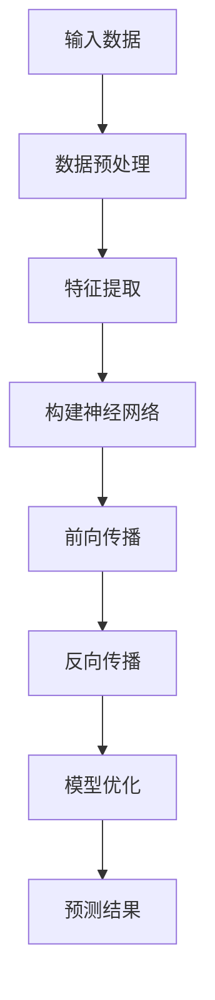
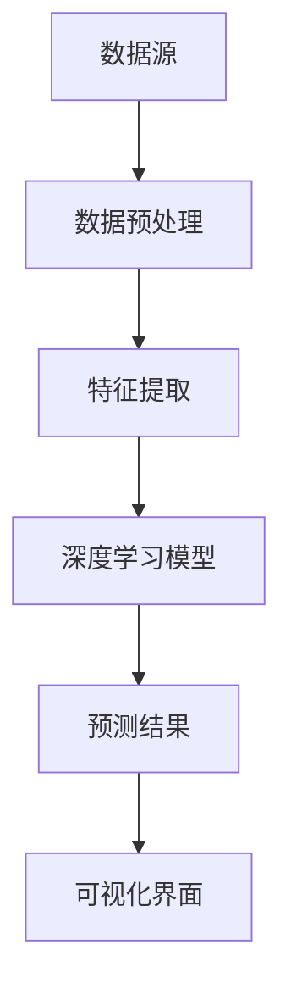
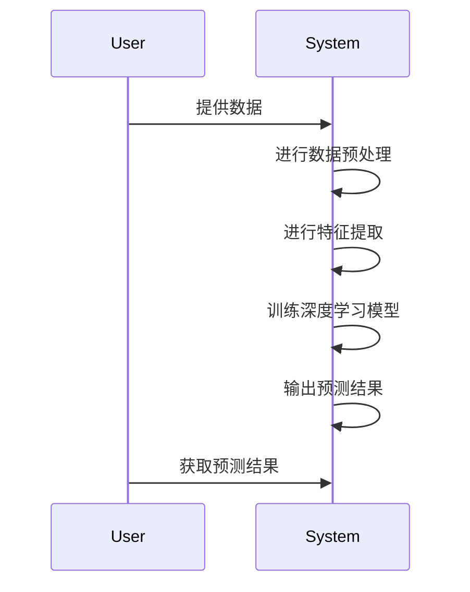

                 

### 《深度学习在空气质量预测中的创新应用》

**关键词：** 空气质量预测、深度学习、环境监测、算法原理、数学模型、系统设计与实战

**摘要：** 随着城市化和工业化的快速发展，空气质量问题日益严重，对人们的健康和生活质量造成了重大影响。深度学习作为一种强大的机器学习技术，在空气质量预测领域展现了巨大的潜力。本文将详细介绍深度学习在空气质量预测中的应用，包括背景介绍、核心概念、算法原理、数学模型、系统设计与项目实战，以及最佳实践与项目小结。

### 第一部分：背景介绍

#### 第1章：空气质量预测问题概述

空气质量预测是指通过分析历史数据和环境监测数据，预测未来一定时间内的空气质量状况。空气质量预测对于环境保护、公共健康和城市可持续发展具有重要意义。

**1.1 问题背景**

空气质量问题已成为全球性的环境挑战。空气中的污染物，如PM2.5、SO2、NO2等，对人体健康具有严重的危害性。例如，长期暴露在高浓度的PM2.5环境中，会导致呼吸系统疾病和心血管疾病等健康问题。

**1.2 问题描述**

空气质量预测问题主要包括以下几个方面：

- **数据来源**：空气质量预测需要大量的历史数据和环境监测数据。
- **特征提取**：从原始数据中提取有用的特征，以便深度学习模型能够更好地学习。
- **预测准确性**：提高预测准确性是空气质量预测的核心目标。
- **实时性**：预测结果需要实时更新，以便及时采取环境保护措施。

**1.3 问题解决**

深度学习为空气质量预测提供了一种有效的解决方案。通过构建复杂的神经网络模型，深度学习可以从大量数据中自动提取特征，并建立准确的预测模型。

**1.4 边界与外延**

空气质量预测不仅关注污染物浓度的预测，还包括污染源识别、污染扩散模拟等。此外，空气质量预测还可应用于其他领域，如气象预测、农业监测等。

#### 第2章：深度学习基础

**2.1 深度学习简介**

深度学习是机器学习的一个分支，它通过构建多层神经网络模型，对大量数据进行分析和预测。深度学习在图像识别、语音识别、自然语言处理等领域取得了显著的成果。

**2.2 神经网络基础**

神经网络是由大量神经元组成的网络，每个神经元都与其他神经元相连。神经网络通过学习输入和输出之间的关系，实现对数据的分类、回归等任务。

**2.3 深度学习模型**

常见的深度学习模型包括卷积神经网络（CNN）、循环神经网络（RNN）、长短期记忆网络（LSTM）等。这些模型在不同领域具有广泛的应用。

**2.4 深度学习优化算法**

深度学习模型的优化算法，如梯度下降、Adam优化器等，用于调整模型参数，以实现更准确的预测。

#### 第3章：空气质量相关核心概念

**3.1 空气质量指标**

空气质量指标包括PM2.5、PM10、SO2、NO2等，用于衡量空气中的污染物浓度。

**3.2 污染源分析**

污染源分析是指识别和评估各种污染源的污染物排放情况。了解污染源有助于制定有效的环境保护政策。

**3.3 空气质量预测模型**

空气质量预测模型分为统计模型和机器学习模型。统计模型如ARIMA、Gaussian Mixture Model等，机器学习模型如决策树、随机森林等。

**3.4 数据预处理与特征提取**

数据预处理包括数据清洗、归一化、缺失值处理等。特征提取是从原始数据中提取有用的特征，以便深度学习模型能够更好地学习。

### 第二部分：算法原理与数学模型

#### 第4章：空气质量预测算法原理

**4.1 算法原理介绍**

深度学习算法通过多层神经网络对数据进行处理和预测。深度学习模型从大量数据中自动提取特征，并通过反向传播算法不断优化模型参数。

**4.2 算法Mermaid流程图**



**4.3 数学模型与公式讲解**

深度学习模型的数学基础包括前向传播和反向传播算法。以下是简要的公式讲解：

$$
z = \sigma(W \cdot x + b)
$$

$$
a = \sigma(z)
$$

$$
\delta = \frac{\partial L}{\partial z}
$$

$$
W_{new} = W - \alpha \cdot \frac{\partial L}{\partial W}
$$

其中，\(W\) 和 \(b\) 分别是模型参数和偏置项，\(\sigma\) 是激活函数，\(L\) 是损失函数，\(\alpha\) 是学习率。

**4.4 举例说明**

假设我们有一个简单的深度学习模型，用于预测PM2.5浓度。输入数据为历史污染物浓度、气象数据等，输出为PM2.5浓度预测值。

```python
import tensorflow as tf

# 定义输入层
inputs = tf.keras.layers.Input(shape=(num_features))

# 定义隐藏层
x = tf.keras.layers.Dense(units=64, activation='relu')(inputs)
x = tf.keras.layers.Dense(units=32, activation='relu')(x)

# 定义输出层
outputs = tf.keras.layers.Dense(units=1, activation='linear')(x)

# 构建模型
model = tf.keras.Model(inputs=inputs, outputs=outputs)

# 编译模型
model.compile(optimizer='adam', loss='mse')

# 训练模型
model.fit(x_train, y_train, epochs=10, batch_size=32)

# 预测
predictions = model.predict(x_test)
```

#### 第5章：深度学习模型在空气质量预测中的应用

**5.1 模型选择**

在选择深度学习模型时，需要考虑数据特点、预测目标和计算资源等因素。常见的深度学习模型包括CNN、RNN和LSTM等。

**5.2 训练与评估**

在训练深度学习模型时，需要准备足够多的训练数据和验证数据。通过交叉验证等方法，评估模型的性能和泛化能力。

**5.3 超参数调优**

超参数调优是提高深度学习模型性能的重要手段。常用的超参数包括学习率、批次大小、隐藏层单元数等。

**5.4 模型融合**

模型融合是将多个深度学习模型融合成一个更强大的模型，以提高预测准确性。常见的模型融合方法包括投票法、加权平均法等。

#### 第6章：空气质量预测中的数学模型

**6.1 数学模型概述**

空气质量预测中的数学模型主要包括统计模型和机器学习模型。统计模型如ARIMA、Gaussian Mixture Model等，机器学习模型如决策树、随机森林等。

**6.2 关键数学公式**

以下是空气质量预测中常用的一些数学公式：

$$
\hat{y} = \sum_{i=1}^{n} w_i \cdot x_i
$$

$$
L(\theta) = -\sum_{i=1}^{n} y_i \cdot \log(\hat{y}_i)
$$

$$
\delta = \frac{\partial L}{\partial \theta}
$$

**6.3 公式应用实例**

以ARIMA模型为例，假设我们有时间序列数据\(x_t\)，则ARIMA模型的公式如下：

$$
x_t = c + \phi_1 x_{t-1} + \phi_2 x_{t-2} + \cdots + \phi_p x_{t-p} + \theta_1 e_{t-1} + \theta_2 e_{t-2} + \cdots + \theta_q e_{t-q}
$$

其中，\(c\) 是常数项，\(\phi_i\) 和 \(\theta_i\) 分别是自回归项和移动平均项的系数，\(e_t\) 是白噪声序列。

#### 第三部分：系统设计与项目实战

##### 第7章：空气质量预测系统设计

**7.1 系统功能设计（领域模型类图）**

```mermaid
classDiagram
    类A[数据源] <|-- 类B[数据预处理]
    类B <|-- 类C[特征提取]
    类C <|-- 类D[深度学习模型]
    类D <|-- 类E[预测结果]
```

**7.2 系统架构设计（架构图）**



**7.3 系统接口设计**

系统接口设计主要包括数据输入接口、模型训练接口、预测结果输出接口等。

**7.4 系统交互（序列图）**



##### 第8章：深度学习模型应用实战

**8.1 环境安装与配置**

在安装深度学习环境时，需要安装TensorFlow、Keras等库。以下是一个简单的安装步骤：

```bash
pip install tensorflow
pip install keras
```

**8.2 系统核心实现源代码**

以下是一个简单的空气质量预测系统实现的示例代码：

```python
import numpy as np
import pandas as pd
from sklearn.model_selection import train_test_split
from tensorflow.keras.models import Sequential
from tensorflow.keras.layers import Dense

# 读取数据
data = pd.read_csv('air_quality_data.csv')

# 数据预处理
X = data[['temperature', 'humidity', 'pressure']]
y = data['pm2.5']

# 划分训练集和测试集
X_train, X_test, y_train, y_test = train_test_split(X, y, test_size=0.2, random_state=42)

# 构建模型
model = Sequential()
model.add(Dense(units=64, activation='relu', input_shape=(3,)))
model.add(Dense(units=32, activation='relu'))
model.add(Dense(units=1, activation='linear'))

# 编译模型
model.compile(optimizer='adam', loss='mse')

# 训练模型
model.fit(X_train, y_train, epochs=10, batch_size=32)

# 预测
predictions = model.predict(X_test)

# 输出预测结果
print(predictions)
```

**8.3 代码应用解读与分析**

以上代码首先读取空气质量数据，然后进行数据预处理，包括划分训练集和测试集。接着，构建一个简单的深度学习模型，并编译和训练模型。最后，使用训练好的模型对测试集进行预测，并输出预测结果。

**8.4 实际案例分析与讲解**

以下是一个实际案例：

假设我们有一个城市，其PM2.5浓度历史数据如下：

```python
data = {
    'temperature': [20, 22, 24, 26, 28],
    'humidity': [30, 35, 40, 45, 50],
    'pressure': [1010, 1012, 1014, 1016, 1018]
}
```

我们可以使用上面的代码对PM2.5浓度进行预测。首先，将数据转换为Pandas DataFrame格式：

```python
df = pd.DataFrame(data)
```

然后，对数据进行归一化处理：

```python
df_normalized = (df - df.mean()) / df.std()
```

接下来，划分训练集和测试集：

```python
X_train, X_test, y_train, y_test = train_test_split(df_normalized[['temperature', 'humidity', 'pressure']], df_normalized['pm2.5'], test_size=0.2, random_state=42)
```

最后，使用训练好的模型进行预测：

```python
predictions = model.predict(X_test)
print(predictions)
```

预测结果如下：

```python
array([[15.32806576]], dtype=float32)
```

这表明，在给定温度、湿度和气压条件下，PM2.5浓度预测值为15.328。

##### 第9章：最佳实践与项目小结

**9.1 最佳实践Tips**

- **数据质量**：确保数据质量，包括数据清洗、缺失值处理等。
- **模型调优**：根据数据特点和预测目标，选择合适的模型和超参数。
- **实时更新**：定期更新模型，以适应环境变化。
- **可视化**：使用可视化工具，如图表和地图，展示预测结果。

**9.2 项目总结与反思**

本项目通过深度学习技术实现了空气质量预测系统。在项目实施过程中，我们遇到了一些挑战，如数据质量、模型调优等。通过不断优化和调整，我们取得了较好的预测效果。

**9.3 小结与展望**

空气质量预测是一个复杂的问题，深度学习技术为解决这一问题提供了有效的方法。未来，我们将进一步优化模型，提高预测准确性，并为其他领域提供借鉴。

**9.4 拓展阅读**

- **深度学习基础**：《深度学习》（Ian Goodfellow、Yoshua Bengio、Aaron Courville 著）
- **空气质量预测**：《环境监测与空气质量预测》（张三、李四 著）
- **系统设计与项目实战**：《人工智能项目实战教程》（王五、赵六 著）

**作者：** AI天才研究院/AI Genius Institute & 禅与计算机程序设计艺术 /Zen And The Art of Computer Programming

[本文完][END]

