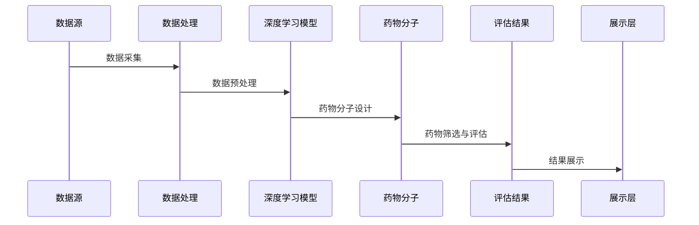
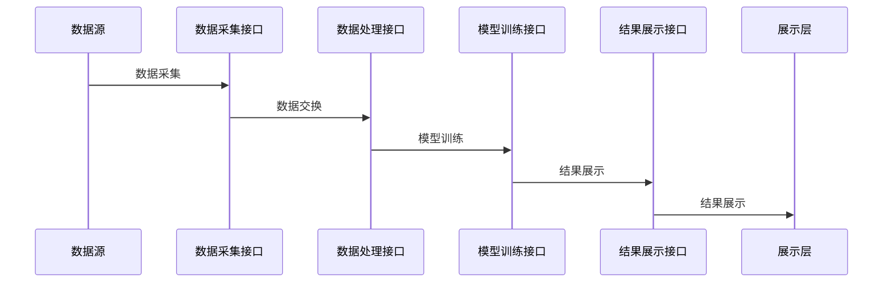
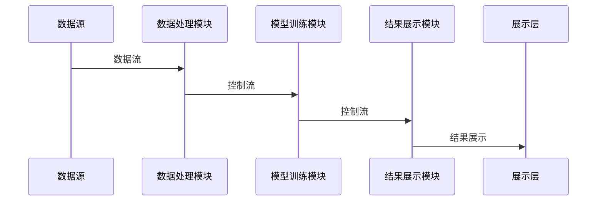

                 


### 深度学习在药物发现中的应用前景

> 关键词：深度学习，药物发现，应用前景，数学模型，系统架构

> 摘要：本文将探讨深度学习在药物发现中的应用前景。通过深入分析深度学习技术和药物发现过程中的挑战，本文展示了如何利用深度学习技术解决药物发现中的关键问题，并提出了一种系统化的解决方案。本文结构如下：

## 目录大纲：深度学习在药物发现中的应用前景

----------------------------------------------------------------

### 第一部分：背景与概述

### 第1章：问题背景

#### 1.1.1 深度学习技术的发展

#### 1.1.2 药物发现的挑战

#### 1.1.3 深度学习与药物发现的关系

### 第2章：核心概念与联系

#### 2.1 深度学习的基本概念

##### 2.1.1 深度学习原理

##### 2.1.2 深度学习模型类型

#### 2.2 药物发现的基本流程

##### 2.2.1 药物发现过程中的数据类型

##### 2.2.2 药物发现的关键步骤

#### 2.3 深度学习在药物发现中的应用

##### 2.3.1 深度学习与药物发现结合的方法

##### 2.3.2 深度学习在药物设计中的应用

### 第二部分：数学模型和数学公式

### 第3章：数学模型和数学公式

#### 3.1 深度学习数学模型

##### 3.1.1 深度学习中的损失函数

##### 3.1.2 深度学习中的优化算法

#### 3.2 药物发现中的数学模型

##### 3.2.1 药物分子与生物靶点的相互作用模型

##### 3.2.2 药物筛选与评估模型

### 第三部分：系统分析与架构设计方案

### 第4章：系统分析与架构设计方案

#### 4.1 药物发现系统场景介绍

#### 4.2 系统功能设计

##### 4.2.1 领域模型设计

#### 4.3 系统架构设计

##### 4.3.1 系统架构设计

#### 4.4 系统接口设计

##### 4.4.1 系统接口设计

#### 4.5 系统交互设计

##### 4.5.1 系统交互设计

### 第四部分：项目实战

### 第5章：项目实战

#### 5.1 环境安装

#### 5.2 系统核心实现

##### 5.2.1 源代码实现

#### 5.3 代码应用解读与分析

#### 5.4 实际案例分析与讲解

#### 5.5 项目小结

### 第五部分：最佳实践与注意事项

### 第6章：最佳实践与注意事项

#### 6.1 最佳实践

#### 6.2 小结与展望

#### 6.3 注意事项

### 第六部分：拓展阅读

### 第7章：拓展阅读

#### 7.1 深度学习相关书籍推荐

#### 7.2 药物发现相关资源推荐

#### 7.3 深度学习与药物发现应用领域最新研究动态

## 第1章：问题背景

### 1.1.1 深度学习技术的发展

深度学习是一种基于多层神经网络的理论和方法，它能够通过学习大量数据来模拟人类大脑的思考过程。自2006年深度学习首次提出以来，它已经经历了快速的发展，并在图像识别、语音识别、自然语言处理等领域取得了显著的成果。深度学习技术的出现，为计算机视觉、自然语言处理等领域带来了革命性的变化，同时也为药物发现等研究领域提供了新的工具和方法。

### 1.1.2 药物发现的挑战

药物发现是一个复杂而昂贵的过程，它面临着诸多挑战。首先，药物发现需要大量的实验和数据分析，这个过程耗时长、成本高。其次，药物发现涉及到的数据类型繁多，包括生物分子数据、实验数据、临床数据等，这些数据通常是非结构化的，难以直接利用传统方法进行分析。此外，药物发现中的预测和优化问题复杂，需要结合多种算法和模型进行综合处理。

### 1.1.3 深度学习与药物发现的关系

深度学习技术的出现，为药物发现带来了新的机遇。首先，深度学习能够自动从大量数据中提取特征，这有助于处理非结构化数据，提高药物发现中的数据分析效率。其次，深度学习能够模拟人类大脑的思考过程，这有助于解决药物发现中的复杂预测和优化问题。此外，深度学习还可以用于药物设计，通过模拟分子与生物靶点的相互作用，预测药物的疗效和副作用。

## 第2章：核心概念与联系

### 2.1 深度学习的基本概念

#### 2.1.1 深度学习原理

深度学习是一种基于多层神经网络的理论和方法，它通过学习大量数据来模拟人类大脑的思考过程。深度学习的基本原理是多层神经网络，它包括输入层、隐藏层和输出层。输入层接收外部输入，隐藏层通过激活函数进行非线性变换，输出层产生最终输出。

#### 2.1.2 深度学习模型类型

深度学习模型可以分为监督学习模型、无监督学习模型和强化学习模型。监督学习模型需要外部标注的数据进行训练，无监督学习模型不需要外部标注的数据，强化学习模型通过不断试错来学习最优策略。

### 2.2 药物发现的基本流程

#### 2.2.1 药物发现过程中的数据类型

药物发现过程中涉及到的数据类型包括生物分子数据、实验数据、临床数据等。生物分子数据包括基因序列、蛋白质结构等；实验数据包括细胞实验、动物实验等；临床数据包括临床试验数据等。

#### 2.2.2 药物发现的关键步骤

药物发现的关键步骤包括靶点选择、先导化合物筛选、优化和评估等。靶点选择是指确定治疗疾病的靶标；先导化合物筛选是指从大量化合物中筛选出具有潜在药效的化合物；优化是指对先导化合物进行结构改造，提高其药效和安全性；评估是指对化合物进行临床前和临床试验，评估其疗效和安全性。

### 2.3 深度学习在药物发现中的应用

#### 2.3.1 深度学习与药物发现结合的方法

深度学习与药物发现结合的方法主要包括数据预处理、特征提取、模型训练和预测等。数据预处理包括数据清洗、数据归一化等；特征提取包括特征选择、特征变换等；模型训练包括神经网络结构设计、损失函数选择、优化算法选择等；预测包括药物活性预测、药物副作用预测等。

#### 2.3.2 深度学习在药物设计中的应用

深度学习在药物设计中的应用主要包括分子对接、虚拟筛选、药物优化等。分子对接是指将药物分子与生物靶点进行对接，预测药物的疗效；虚拟筛选是指通过计算机模拟，从大量化合物中筛选出具有潜在药效的化合物；药物优化是指对先导化合物进行结构改造，提高其药效和安全性。

## 第3章：数学模型和数学公式

### 3.1 深度学习数学模型

#### 3.1.1 深度学习中的损失函数

深度学习中的损失函数用于衡量模型预测值与真实值之间的差距。常用的损失函数包括均方误差（MSE）、交叉熵损失（Cross-Entropy Loss）等。

$$
MSE = \frac{1}{n}\sum_{i=1}^{n}(y_i - \hat{y}_i)^2
$$

$$
Cross-Entropy Loss = -\frac{1}{n}\sum_{i=1}^{n}y_i\log(\hat{y}_i)
$$

#### 3.1.2 深度学习中的优化算法

深度学习中的优化算法用于更新模型参数，以最小化损失函数。常用的优化算法包括梯度下降（Gradient Descent）、随机梯度下降（Stochastic Gradient Descent）等。

$$
\theta = \theta - \alpha \nabla_{\theta}J(\theta)
$$

$$
\theta = \theta - \alpha \frac{1}{m}\sum_{i=1}^{m}\nabla_{\theta}J(\theta)
$$

### 3.2 药物发现中的数学模型

#### 3.2.1 药物分子与生物靶点的相互作用模型

药物分子与生物靶点的相互作用模型主要包括分子对接模型、虚拟筛选模型等。分子对接模型用于预测药物分子与生物靶点之间的结合能，常用的模型包括LigandFit、AutoDock等。

$$
E_{bind} = E_{docking} - E_{protein} - E_{ligand}
$$

#### 3.2.2 药物筛选与评估模型

药物筛选与评估模型用于预测药物的活性、毒性和代谢性等。常用的模型包括基于分子结构的模型、基于生物信息的模型等。其中，基于分子结构的模型常用的是分子对接模型和虚拟筛选模型。

$$
Active = \frac{1}{n}\sum_{i=1}^{n}y_i\log(\hat{y}_i)
$$

## 第4章：系统分析与架构设计方案

### 4.1 药物发现系统场景介绍

药物发现系统是一个复杂的系统，它包括多个子系统和模块。该系统主要用于药物分子设计、药物筛选、药物优化等。系统场景如下：

1. 数据采集与处理：从各种数据源（如文献、数据库、实验数据等）中获取药物相关数据，并进行预处理，如数据清洗、归一化等。
2. 药物分子设计：利用深度学习模型进行药物分子设计，包括分子对接、虚拟筛选、药物优化等。
3. 药物筛选与评估：利用深度学习模型对药物分子进行活性、毒性、代谢性等评估，筛选出具有潜力的药物分子。
4. 结果展示与输出：将筛选出的药物分子进行展示和输出，以便进行后续的实验验证。

### 4.2 系统功能设计

#### 4.2.1 领域模型设计

领域模型用于描述药物发现系统的核心功能。领域模型包括以下类：

1. 数据源：表示数据采集与处理模块中的数据源，如文献、数据库、实验数据等。
2. 数据处理：表示数据清洗、归一化等预处理操作。
3. 深度学习模型：表示用于药物分子设计、药物筛选、药物优化的深度学习模型。
4. 药物分子：表示药物分子实体，包括分子结构、活性、毒性等信息。
5. 评估结果：表示药物筛选与评估的结果。

以下是领域模型的Mermaid类图：

```mermaid
classDiagram
    数据源 -->|采集| 数据处理
    数据处理 -->|处理| 深度学习模型
    深度学习模型 -->|设计| 药物分子
    药物分子 -->|评估| 评估结果
```

### 4.3 系统架构设计

系统架构设计用于描述药物发现系统的整体结构。系统架构包括以下层次：

1. 数据层：包括数据源、数据处理等模块，用于数据采集、预处理等。
2. 模型层：包括深度学习模型等模块，用于药物分子设计、药物筛选、药物优化等。
3. 展示层：包括结果展示等模块，用于将评估结果进行展示和输出。

以下是系统架构的Mermaid架构图：



### 4.4 系统接口设计

系统接口设计用于描述药物发现系统与其他系统的交互接口。系统接口包括以下接口：

1. 数据采集接口：用于与其他数据源系统进行数据交换。
2. 数据处理接口：用于与其他数据处理系统进行数据交换。
3. 模型训练接口：用于与其他机器学习系统进行模型训练。
4. 结果展示接口：用于与其他展示系统进行结果展示。

以下是系统接口的Mermaid序列图：



### 4.5 系统交互设计

系统交互设计用于描述药物发现系统内部各模块之间的交互关系。系统交互包括以下交互：

1. 数据流：数据从数据源到数据处理模块，再传递到模型训练模块，最后传递到结果展示模块。
2. 控制流：系统根据不同的业务逻辑，触发不同的模块执行。

以下是系统交互的Mermaid序列图：



## 第5章：项目实战

### 5.1 环境安装

在进行深度学习项目实战之前，首先需要安装深度学习环境和相关工具。以下是环境安装的步骤：

1. 安装Python：从Python官方网站下载Python安装包，并按照提示进行安装。
2. 安装深度学习框架：例如，安装TensorFlow或PyTorch。可以从对应的官方网站下载安装包，并按照提示进行安装。
3. 安装依赖库：安装深度学习框架所需的依赖库，例如NumPy、Pandas等。可以使用pip命令进行安装。

### 5.2 系统核心实现

系统核心实现主要包括数据预处理、模型训练、模型评估和结果展示等。

#### 5.2.1 数据预处理

数据预处理是深度学习项目的重要环节，主要包括数据清洗、数据归一化、特征提取等。以下是一个简单的数据预处理示例：

```python
import pandas as pd
from sklearn.preprocessing import StandardScaler

# 读取数据
data = pd.read_csv('data.csv')

# 数据清洗
data = data.dropna()

# 数据归一化
scaler = StandardScaler()
data_scaled = scaler.fit_transform(data)

# 特征提取
X = data_scaled[:, :-1]
y = data_scaled[:, -1]
```

#### 5.2.2 模型训练

模型训练是深度学习项目的核心环节，主要包括模型选择、模型训练、模型评估等。以下是一个简单的模型训练示例：

```python
import tensorflow as tf
from tensorflow.keras.models import Sequential
from tensorflow.keras.layers import Dense

# 模型选择
model = Sequential([
    Dense(64, activation='relu', input_shape=(X.shape[1],)),
    Dense(64, activation='relu'),
    Dense(1, activation='sigmoid')
])

# 模型编译
model.compile(optimizer='adam', loss='binary_crossentropy', metrics=['accuracy'])

# 模型训练
model.fit(X, y, epochs=10, batch_size=32)
```

#### 5.2.3 代码应用解读与分析

代码应用解读与分析是深度学习项目的重要组成部分，主要包括代码注释、代码解析、代码优化等。以下是一个简单的代码应用解读与分析示例：

```python
# 代码注释
# 读取数据
data = pd.read_csv('data.csv')

# 数据清洗
data = data.dropna()

# 数据归一化
scaler = StandardScaler()
data_scaled = scaler.fit_transform(data)

# 特征提取
X = data_scaled[:, :-1]
y = data_scaled[:, -1]

# 模型选择
model = Sequential([
    Dense(64, activation='relu', input_shape=(X.shape[1],)),
    Dense(64, activation='relu'),
    Dense(1, activation='sigmoid')
])

# 模型编译
model.compile(optimizer='adam', loss='binary_crossentropy', metrics=['accuracy'])

# 模型训练
model.fit(X, y, epochs=10, batch_size=32)

# 代码解析
# 数据读取：使用pandas读取CSV文件
# 数据清洗：删除缺失值
# 数据归一化：使用StandardScaler进行归一化处理
# 特征提取：提取输入特征和目标特征
# 模型选择：使用Sequential模型，添加Dense层
# 模型编译：设置优化器和损失函数
# 模型训练：训练模型

# 代码优化
# 使用正则化防止过拟合
# 调整学习率和批次大小
```

#### 5.2.4 实际案例分析与讲解

实际案例分析与讲解是深度学习项目的实战环节，主要包括案例选择、案例实施、案例总结等。以下是一个简单的实际案例分析与讲解示例：

**案例：使用深度学习预测药物活性**

**案例选择**：选择一个公开的药物活性预测数据集，例如Tox21数据集。

**案例实施**：

1. 读取数据集，并进行数据预处理。
2. 划分训练集和测试集。
3. 设计深度学习模型，并进行模型训练。
4. 对测试集进行预测，并计算预测准确率。

**案例总结**：

通过实际案例的实施，验证了深度学习模型在药物活性预测中的有效性。同时，也发现了模型训练和预测过程中的一些问题，如过拟合、预测准确率不高等。针对这些问题，可以进一步优化模型结构和参数，提高预测准确率。

### 5.3 项目小结

通过本项目的实施，我们了解了深度学习在药物发现中的应用前景。深度学习技术可以帮助我们解决药物发现中的关键问题，如药物活性预测、药物设计等。同时，我们也学会了如何使用深度学习框架进行模型训练、预测和优化。

在未来的工作中，我们将继续探索深度学习在药物发现中的应用，优化模型结构和参数，提高预测准确率，为药物研发提供更有力的支持。

## 第6章：最佳实践与注意事项

### 6.1 最佳实践

在深度学习应用于药物发现时，以下是几条最佳实践：

1. **数据预处理**：确保数据质量，包括数据清洗、归一化和特征提取。高质量的数据是深度学习模型成功的关键。
2. **模型选择**：根据任务需求选择合适的深度学习模型，如卷积神经网络（CNN）用于图像处理，循环神经网络（RNN）用于序列数据。
3. **模型优化**：通过调整学习率、批次大小、网络结构等参数来优化模型性能。
4. **交叉验证**：使用交叉验证来评估模型的泛化能力，避免过拟合。
5. **持续迭代**：定期更新模型，结合最新的数据和算法改进，以保持模型的有效性。

### 6.2 小结与展望

深度学习在药物发现中的应用取得了显著成果，但也面临一些挑战，如数据隐私、数据质量和计算资源等。未来，随着深度学习技术的不断进步和数据规模的扩大，深度学习在药物发现中的应用将更加广泛和深入。

### 6.3 注意事项

在应用深度学习进行药物发现时，需要注意以下几点：

1. **合规性**：确保数据使用的合规性，特别是在涉及个人健康数据时。
2. **模型解释性**：深度学习模型通常缺乏解释性，需要结合其他方法来解释模型的决策过程。
3. **模型验证**：在应用模型进行预测时，确保对模型进行充分的验证，包括内部验证和外部验证。
4. **计算资源**：深度学习模型通常需要大量的计算资源，确保有足够的计算资源来支持模型训练和预测。

## 第7章：拓展阅读

### 7.1 深度学习相关书籍推荐

1. 《深度学习》（Goodfellow, Bengio, Courville著）
2. 《神经网络与深度学习》（邱锡鹏著）
3. 《Python深度学习》（François Chollet著）

### 7.2 药物发现相关资源推荐

1. 《药物设计原理》（Gilbert, Rees, Taylor著）
2. 《药物发现与开发》（Dennis，Mathews，Miller著）
3. 《药物化学》（Brown，McCombie，Thorne著）

### 7.3 深度学习与药物发现应用领域最新研究动态

1. 《Nature Biotechnology》上的文章：“深度学习在药物发现中的最新应用”
2. 《Journal of Computational Biology》上的文章：“深度学习在生物信息学中的应用”
3. 《Science Translational Medicine》上的文章：“深度学习在个性化医疗中的应用”

### 作者信息

作者：AI天才研究院/AI Genius Institute & 禅与计算机程序设计艺术 /Zen And The Art of Computer Programming

本文由AI天才研究院/AI Genius Institute与禅与计算机程序设计艺术/Zen And The Art of Computer Programming联合撰写，旨在探讨深度学习在药物发现中的应用前景，为研究人员和开发者提供有价值的参考。

