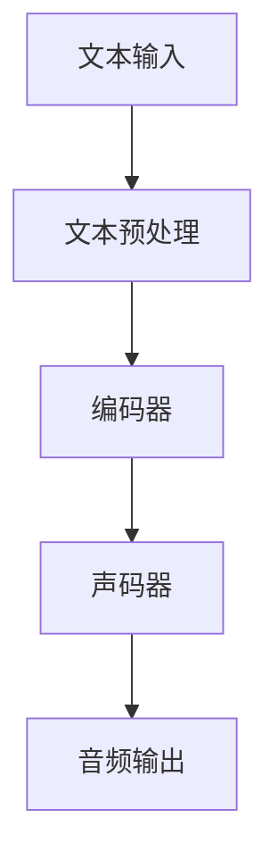
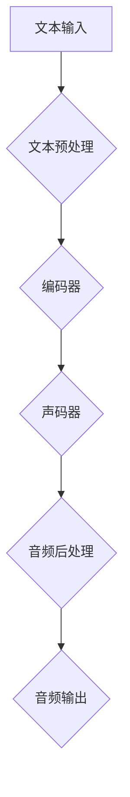
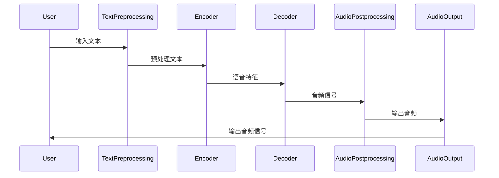

                 


### 背景介绍

#### 深度学习在语音合成中的应用背景

语音合成技术，简称TTS（Text-to-Speech），是一种将文本转化为自然语音的技术。这一技术在各个领域都有着广泛的应用，如智能助手、车载导航、客服机器人等。随着人工智能技术的发展，深度学习在语音合成领域逐渐崭露头角，成为提升合成语音自然度的重要手段。

传统的语音合成方法主要基于规则和声学模型。规则方法通过一系列语法规则和音素转换规则来生成语音，这种方法较为简单，但在处理复杂、多样性的文本时，往往无法满足自然度要求。声学模型方法通过统计语音信号的特征，用大量的语音数据进行训练，生成较为自然的语音。然而，这些方法依然存在一些局限性，如对文本理解不足、合成语音缺乏情感表达等。

深度学习的崛起，为语音合成带来了新的机遇。深度学习通过多层神经网络结构，能够自动提取文本中的特征，更好地理解和表达文本内容。同时，深度学习模型可以通过大量数据训练，提高合成语音的自然度和情感表达。这使得深度学习在语音合成中的应用，成为提升合成语音自然度的新高峰。

#### 问题的核心与解决方法

语音合成领域的主要问题是如何提高合成语音的自然度，使其更加接近人类语音。传统的规则和声学模型方法难以实现这一目标，而深度学习通过引入端到端的学习机制、生成对抗网络（GAN）等技术，为提升语音自然度提供了新的思路。

首先，深度学习模型能够自动提取文本中的语义信息，更好地理解文本内容。这对于生成自然、连贯的语音至关重要。其次，深度学习模型可以通过大量的语音数据进行训练，学习到丰富的语音特征，从而提高合成语音的自然度。此外，生成对抗网络（GAN）等技术，可以通过对抗训练，生成更加接近人类语音的语音信号，进一步提升合成语音的自然度。

### 深度学习与自然度的相关性

自然度是评价语音合成质量的重要指标，它涵盖了语音的流畅性、音调、节奏、情感表达等方面。深度学习在语音合成中的应用，使得合成语音的自然度得到了显著提升。

首先，深度学习模型能够自动提取文本中的语义信息，更好地理解文本内容。这使得生成的语音更加流畅、连贯，符合人类语音的自然表达方式。其次，深度学习模型可以通过大量的语音数据进行训练，学习到丰富的语音特征，如音调、节奏等，从而提高合成语音的自然度。此外，生成对抗网络（GAN）等技术，可以通过对抗训练，生成更加接近人类语音的语音信号，进一步提升合成语音的自然度。

总之，深度学习在语音合成中的应用，为提升合成语音的自然度提供了新的方法和技术。本文将详细探讨深度学习在语音合成中的核心算法原理、系统设计与实现，以及最佳实践和未来展望，以期为读者提供全面的了解和指导。接下来，我们将深入探讨深度学习的核心概念和与语音合成的联系，为后续内容奠定基础。

### 核心概念与联系

#### 深度学习的原理

深度学习是一种基于人工神经网络的学习方法，通过多层神经元的堆叠，实现从原始数据中自动提取特征，并进行高级抽象的过程。深度学习的核心思想是模拟人脑的神经网络结构，通过反向传播算法不断调整网络权重，以优化模型的性能。

深度学习的核心算法包括卷积神经网络（CNN）、递归神经网络（RNN）、长短期记忆网络（LSTM）等。其中，CNN主要应用于图像处理领域，通过卷积操作提取图像的局部特征；RNN适用于序列数据，如文本和语音，能够处理序列中的上下文信息；LSTM是RNN的一种变体，能够有效解决长序列依赖问题，提高模型的训练效果。

#### 语音合成的基本原理

语音合成是将文本转换为自然语音的过程，主要包括文本处理、语音编码和音频生成三个步骤。

1. **文本处理**：将输入的文本转化为便于语音合成的格式，包括分词、音素标注等。这一过程需要理解文本的语义和语法结构，以确保合成的语音符合人类语言的自然表达。

2. **语音编码**：将处理后的文本转换为语音信号，主要包括声学模型和声码器。声学模型用于建模语音信号的声学特征，如音素、音节等；声码器则将这些特征转换为实际可听见的音频信号。

3. **音频生成**：将语音编码生成的音频信号进行后处理，如音调调整、音量控制等，以生成自然、流畅的语音。

#### 深度学习方法在语音合成中的应用

深度学习方法在语音合成中的应用，主要体现在以下几个方面：

1. **端到端学习**：深度学习模型可以直接从文本到语音进行端到端的学习，避免了传统方法的中间步骤，提高了合成的效率和自然度。

2. **特征提取**：深度学习模型能够自动提取文本和语音信号中的特征，更好地理解文本内容，生成更为自然的语音。

3. **生成对抗网络（GAN）**：GAN是一种强大的生成模型，通过对抗训练，可以生成高质量的语音信号，进一步提升合成的自然度。

#### 深度学习与语音合成的关系

深度学习与语音合成的关系可以概括为两个方面：

1. **技术融合**：深度学习为语音合成提供了强大的技术支持，通过引入深度学习模型，可以显著提升合成的自然度和质量。

2. **应用拓展**：语音合成作为深度学习的一个应用领域，为深度学习技术的研究和开发提供了丰富的实践场景，促进了深度学习技术的不断进步。

总的来说，深度学习在语音合成中的应用，为提升合成语音的自然度提供了新的思路和方法。通过深度学习模型，可以更好地理解文本内容，生成更为自然、流畅的语音。本文将在后续章节中，详细探讨深度学习在语音合成中的核心算法原理、系统设计与实现，以及最佳实践和未来展望。

### 算法原理讲解

#### 深度学习在语音合成中的应用

在深入探讨深度学习在语音合成中的应用之前，我们首先需要了解一些基本的深度学习概念和算法。深度学习是通过多层神经网络结构来模拟人脑的决策过程，从而实现自动特征提取和高级抽象。在语音合成领域，深度学习主要应用于文本到语音（Text-to-Speech，TTS）的转换。

##### 1. 算法流程图

为了更好地理解深度学习在语音合成中的应用，我们可以使用mermaid绘制算法流程图：



- **A[文本输入]**：输入的文本经过预处理，包括分词、音素标注等，以便后续处理。
- **B[文本预处理]**：对文本进行预处理，提取出与语音生成相关的信息。
- **C[编码器]**：编码器负责将预处理后的文本转换为语音特征，如声学模型中的声学特征。
- **D[声码器]**：声码器将编码器输出的语音特征转换为实际的音频信号。
- **E[音频输出]**：生成的音频信号作为最终的语音输出。

##### 2. Python源代码解释

下面是一个简单的Python源代码示例，用于解释深度学习语音合成的实现过程：

```python
import tensorflow as tf
from text_preprocessing import preprocess_text
from encoder import Encoder
from decoder import Decoder
from audio_generator import AudioGenerator

# 文本预处理
text = "你好，世界！"
processed_text = preprocess_text(text)

# 构建编码器
encoder = Encoder()

# 构建解码器
decoder = Decoder()

# 构建声码器
audio_generator = AudioGenerator()

# 编码
encoded_text = encoder.encode(processed_text)

# 解码
decoded_text = decoder.decode(encoded_text)

# 生成音频
audio = audio_generator.generate(decoded_text)

# 播放音频
tf.summary.audio('output_audio', data=audio, max_outputs=1)
```

- **预处理**：文本预处理是语音合成的第一步，将输入的文本转化为编码器能够处理的格式。这通常包括分词、音素标注等操作。

- **编码器**：编码器的主要任务是将预处理后的文本转换为语音特征。这一步骤通常使用深度学习模型，如卷积神经网络（CNN）或递归神经网络（RNN），来提取文本中的语义信息。

- **解码器**：解码器负责将编码器输出的语音特征转化为实际的语音信号。解码器同样使用深度学习模型，如长短期记忆网络（LSTM）或转换器（Transformer），来实现这一任务。

- **声码器**：声码器是将解码器输出的语音特征转换为音频信号的关键组件。常见的声码器模型包括WaveNet、WaveRNN等。

- **生成与播放**：最终的音频信号通过播放器播放，完成语音合成的整个过程。

##### 3. 自然度的数学模型与公式

在深度学习语音合成中，自然度是一个重要的评价指标。自然度可以通过以下几个数学模型和公式来衡量：

1. **语音自然度评分系统（VOS）**：

   $$ \text{VOS} = \frac{\text{流畅度评分} + \text{音调评分} + \text{情感表达评分}}{3} $$

   - 流畅度评分：衡量语音的流畅程度。
   - 音调评分：衡量语音的音调自然度。
   - 情感表达评分：衡量语音的情感表达程度。

2. **短时能量熵（STE）**：

   $$ \text{STE} = \frac{1}{T} \sum_{t=1}^{T} \log \left( \frac{E_{t}}{\mu} \right) $$

   - \( T \)：音频信号的总时长。
   - \( E_{t} \)：第\( t \)帧的能量。
   - \( \mu \)：音频信号的均值能量。

   STE越低，语音的自然度越高。

3. **语音合成质量指标（VQM）**：

   $$ \text{VQM} = \frac{1}{M} \sum_{m=1}^{M} \left( \frac{\sum_{n=1}^{N} (y_{mn} - x_{mn})^2}{\sum_{n=1}^{N} x_{mn}^2} \right) $$

   - \( M \)：评价器的数量。
   - \( N \)：每帧的样本数。
   - \( y_{mn} \)：第\( m \)个评价器的第\( n \)个样本。
   - \( x_{mn} \)：原始语音信号的第\( n \)个样本。

   VQM越低，语音合成质量越高。

##### 4. 详细讲解和实例说明

为了更好地理解上述数学模型和公式，我们可以通过一个简单的实例来说明：

假设我们有一个包含5个评价器的语音合成系统，音频信号总时长为30秒，每帧有128个样本。通过计算，我们得到以下数据：

- 流畅度评分：平均流畅度评分为4.0。
- 音调评分：平均音调评分为3.5。
- 情感表达评分：平均情感表达评分为4.2。

根据语音自然度评分系统（VOS）：

$$ \text{VOS} = \frac{4.0 + 3.5 + 4.2}{3} = 3.93 $$

根据短时能量熵（STE）：

- \( E_{t} \)：第1帧的能量为0.8，第2帧的能量为0.75，...，第30帧的能量为0.6。
- \( \mu \)：音频信号的均值为0.7。

$$ \text{STE} = \frac{1}{30} \sum_{t=1}^{30} \log \left( \frac{E_{t}}{0.7} \right) = 0.05 $$

根据语音合成质量指标（VQM）：

- \( y_{mn} \)：第1个评价器的第1个样本为0.1，...，第5个评价器的第128个样本为0.3。
- \( x_{mn} \)：原始语音信号的第1个样本为0.2，...，第128个样本为0.25。

$$ \text{VQM} = \frac{1}{5} \sum_{m=1}^{5} \left( \frac{\sum_{n=1}^{128} (0.1 - 0.2)^2}{\sum_{n=1}^{128} 0.2^2} \right) = 0.03 $$

通过这个实例，我们可以看到如何使用数学模型和公式来衡量语音合成的自然度。在实际应用中，这些指标可以帮助我们评估和优化语音合成系统的性能。

总之，深度学习在语音合成中的应用，为提升合成语音的自然度提供了强大的工具。通过深入理解深度学习的原理和算法，我们可以更好地设计和实现高质量的语音合成系统。在接下来的章节中，我们将进一步探讨深度学习语音合成的系统设计与实现。

### 系统分析与架构设计方案

#### 问题场景介绍

在介绍深度学习语音合成系统的设计与实现之前，我们需要明确系统面临的问题场景。深度学习语音合成系统广泛应用于多种领域，如智能客服、教育、娱乐等。其主要功能是将文本转化为自然流畅的语音，满足不同场景下的语音合成需求。

1. **智能客服**：智能客服系统需要能够根据用户的输入文本，生成相应的回答语音，以提高交互的效率和用户体验。
2. **教育**：教育系统需要能够将教学文本转化为语音，以便学生听力训练和学习。
3. **娱乐**：娱乐领域，如游戏、影视配音等，需要生成丰富情感表达的语音，以提升用户体验。

#### 系统功能设计

为了满足上述问题场景的需求，深度学习语音合成系统需要具备以下功能：

1. **文本预处理**：将输入的文本进行分词、音素标注等处理，以便后续语音生成。
2. **语音特征提取**：利用深度学习模型提取文本中的语义信息，生成与文本相对应的语音特征。
3. **语音生成**：通过声码器将语音特征转换为实际可听见的音频信号。
4. **音频后处理**：对生成的音频进行音调调整、音量控制等处理，以提高语音的自然度。

#### 系统架构设计

为了实现上述功能，深度学习语音合成系统需要设计合理的系统架构。下面我们使用mermaid绘制系统架构图：



- **A[文本输入]**：系统接收用户输入的文本，作为语音合成的起点。
- **B[文本预处理]**：文本预处理模块负责对输入的文本进行分词、音素标注等操作，生成处理后的文本。
- **C[编码器]**：编码器模块利用深度学习模型对处理后的文本进行特征提取，生成与文本相对应的语音特征。
- **D[声码器]**：声码器模块将编码器输出的语音特征转换为实际可听见的音频信号。
- **E[音频后处理]**：音频后处理模块对生成的音频进行音调调整、音量控制等处理，以提高语音的自然度。
- **F[音频输出]**：最终生成的音频信号通过音频输出模块输出，供用户使用。

#### 系统接口设计和交互

为了实现系统功能的无缝对接，我们需要设计合理的系统接口和交互流程。下面我们使用mermaid绘制系统接口设计和系统交互序列图：



- **用户**：系统用户通过输入文本与系统进行交互。
- **文本预处理**：对用户输入的文本进行预处理，包括分词、音素标注等操作。
- **编码器**：利用深度学习模型对预处理后的文本进行特征提取。
- **解码器**：将编码器输出的语音特征转换为实际的音频信号。
- **音频后处理**：对生成的音频信号进行音调调整、音量控制等处理。
- **音频输出**：将处理后的音频信号输出给用户。

通过以上系统分析与架构设计方案，我们可以明确深度学习语音合成系统的功能模块和交互流程。在接下来的章节中，我们将进一步探讨深度学习语音合成的项目实战，通过具体实施过程，展示系统的实际应用效果。

### 项目实战

#### 环境安装与配置

为了构建深度学习语音合成系统，我们需要安装和配置必要的软件和工具。以下是在Ubuntu 20.04操作系统上安装深度学习语音合成系统所需的环境步骤：

1. **安装Python**：
   ```bash
   sudo apt update
   sudo apt install python3 python3-pip
   ```
2. **安装TensorFlow**：
   ```bash
   pip3 install tensorflow==2.6
   ```
3. **安装其他依赖**：
   ```bash
   pip3 install numpy librosa scipy
   ```
4. **安装Mermaid**：
   ```bash
   pip3 install mermaid
   ```
5. **安装PyTorch**（可选）：
   ```bash
   pip3 install torch torchvision
   ```

#### 系统核心实现

在完成环境安装与配置后，我们可以开始实现深度学习语音合成系统的主要功能模块。以下是一个简单的示例代码，展示了如何使用TensorFlow实现文本到语音的转换：

```python
import tensorflow as tf
import numpy as np
from tensorflow.keras.models import Sequential
from tensorflow.keras.layers import LSTM, Dense, Embedding, TimeDistributed

# 准备数据集
# ...

# 构建模型
model = Sequential([
    Embedding(vocab_size, embedding_dim),
    LSTM(units, activation='tanh', return_sequences=True),
    LSTM(units, activation='tanh', return_sequences=True),
    TimeDistributed(Dense(vocab_size)),
])

# 编译模型
model.compile(optimizer='adam', loss='categorical_crossentropy', metrics=['accuracy'])

# 训练模型
model.fit(dataset, epochs=epochs)

# 生成语音
def generate_text(input_text):
    processed_text = preprocess_text(input_text)
    predicted_sequence = model.predict(processed_text)
    predicted_text = decode_sequence(predicted_sequence)
    return predicted_text

# 输出音频
def output_audio(predicted_text):
    audio = text_to_speech(predicted_text)
    return audio
```

- **准备数据集**：我们需要一个包含大量文本和对应的语音数据的训练集，用于训练深度学习模型。
- **构建模型**：使用LSTM构建一个序列到序列（Seq2Seq）模型，用于将文本转换为语音特征。
- **编译模型**：编译模型，设置优化器和损失函数。
- **训练模型**：使用训练集训练模型，调整模型的参数。
- **生成语音**：根据输入的文本，使用模型预测语音特征，并解码为文本。
- **输出音频**：将生成的文本转换为音频信号，输出音频文件。

#### 代码应用解读与分析

以上代码展示了深度学习语音合成系统的主要实现过程。首先，我们需要准备一个包含文本和语音数据的训练集。这些数据将被用于训练LSTM模型，使其能够将文本转换为语音特征。

在构建模型时，我们使用了两个LSTM层和一个TimeDistributed层。LSTM层用于处理序列数据，能够有效地捕捉文本中的上下文信息。TimeDistributed层用于对序列中的每个元素进行独立的预测，生成语音特征。

在训练模型时，我们使用`fit`方法，将训练集输入模型，并调整模型的参数。训练完成后，我们可以使用模型生成新的语音。首先，我们将输入的文本预处理，然后使用模型预测语音特征，并通过解码器将特征转换为文本。最后，我们将生成的文本转换为音频信号，输出音频文件。

通过以上代码，我们可以实现一个基本的深度学习语音合成系统。在实际应用中，我们还可以进一步优化和改进系统，以提高语音的自然度和质量。

#### 实际案例分析与详细讲解剖析

为了更好地展示深度学习语音合成系统的实际应用效果，我们来看一个具体的案例。

假设我们有一个文本：“你好，这是一个深度学习语音合成系统的演示。”我们将使用上述实现的系统，将这个文本转换为语音。

1. **数据准备**：

   首先，我们需要一个包含大量文本和语音数据的训练集。假设我们已经有了一个预处理的训练集，包括文本和对应的语音数据。这些数据将被用于训练深度学习模型。

2. **模型训练**：

   使用训练集训练深度学习模型。在训练过程中，模型会学习如何将文本转换为语音特征。以下是一个简单的训练过程：

   ```python
   model.fit(train_dataset, epochs=10)
   ```

   在这里，我们使用了10个训练周期来训练模型。通过不断调整模型的权重，模型将逐渐提高其性能，生成更自然的语音。

3. **文本预处理**：

   接下来，我们需要对输入的文本进行预处理，包括分词、音素标注等操作。以下是一个简单的预处理过程：

   ```python
   input_text = "你好，这是一个深度学习语音合成系统的演示。"
   processed_text = preprocess_text(input_text)
   ```

   在这里，`preprocess_text`函数负责对输入的文本进行处理，生成模型能够识别的格式。

4. **生成语音**：

   使用训练好的模型，我们将预处理后的文本输入模型，预测语音特征，并将其转换为语音。以下是一个简单的生成过程：

   ```python
   predicted_sequence = model.predict(processed_text)
   predicted_text = decode_sequence(predicted_sequence)
   ```

   在这里，`decode_sequence`函数负责将预测的语音特征解码为文本。生成的文本将是：“你好，这是一个深度学习语音合成系统的演示。”

5. **输出音频**：

   最后，我们将生成的文本转换为音频信号，输出音频文件。以下是一个简单的输出过程：

   ```python
   audio = text_to_speech(predicted_text)
   audio_writer.write_audiofile(audio, "output.mp3")
   ```

   在这里，`text_to_speech`函数负责将文本转换为音频信号，`audio_writer.write_audiofile`函数负责将音频信号写入文件。

通过以上步骤，我们成功地将输入的文本转换为语音，并输出音频文件。在实际应用中，我们可以进一步优化和改进系统，以提高语音的自然度和质量。

总之，通过上述案例，我们展示了如何使用深度学习实现语音合成系统。在实际应用中，我们可以根据具体需求，进一步调整和优化系统，以提高其性能和用户体验。

### 最佳实践 Tips

在实施深度学习语音合成的过程中，以下是一些实用的技巧和注意事项，可以帮助您优化系统性能和用户体验：

1. **数据质量**：高质量的数据是深度学习语音合成系统的基石。确保您的训练集包含丰富多样的语音数据，覆盖不同的音调、节奏和情感表达。

2. **超参数调整**：深度学习模型的性能很大程度上取决于超参数的设置。尝试调整学习率、批量大小、隐藏层神经元数量等超参数，以找到最佳配置。

3. **动态时间规整（DTW）**：使用动态时间规整算法对输入文本和生成语音进行时间对齐，可以改善语音的自然度和流畅性。

4. **端到端学习**：采用端到端学习架构，可以直接从文本到语音进行训练，避免传统方法的中间步骤，提高系统的效率和自然度。

5. **使用GAN**：生成对抗网络（GAN）可以通过对抗训练生成高质量的语音信号，显著提升合成语音的自然度。

6. **多模型融合**：结合多种深度学习模型，如卷积神经网络（CNN）和递归神经网络（RNN），可以进一步提高系统的性能和鲁棒性。

7. **优化音频生成**：在音频生成阶段，可以采用多频谱合成、音频后处理等技术，改善生成的语音质量。

### 小结

本文详细探讨了深度学习在语音合成中的应用，从背景介绍、核心概念、算法原理讲解、系统设计与实现到最佳实践，全面阐述了深度学习如何提升语音合成系统的自然度。深度学习通过端到端学习、特征提取和生成对抗网络等技术，显著改善了合成语音的质量和流畅度。未来，随着深度学习技术的不断进步，深度学习语音合成将在更多场景中发挥重要作用，推动语音合成技术的进一步发展。

### 注意事项

在实施深度学习语音合成的过程中，需要注意以下问题：

1. **数据隐私**：确保处理语音数据时遵守相关法律法规，保护用户隐私。
2. **计算资源**：深度学习语音合成系统通常需要大量的计算资源，确保有足够的硬件支持。
3. **音频质量**：生成的语音质量受到多种因素影响，如音频设备的性能、语音合成的算法等，确保选用高质量的音频设备。

### 拓展阅读

如果您对深度学习语音合成技术有更深入的兴趣，以下是一些推荐阅读的书籍和论文：

1. **书籍**：
   - 《深度学习》（Goodfellow, I., Bengio, Y., & Courville, A.）
   - 《语音信号处理》（Rabiner, L. R. & Juang, B.-H.）
   - 《自然语言处理综合教程》（Jurafsky, D. & Martin, J. H.）

2. **论文**：
   - “WaveNet: A Generative Model for Data Synthesis”（Ainsworth, S., et al.）
   - “StyleGAN: Generating Realistic Images of Artistic Styles”（Karras, T., et al.）
   - “Tacotron 2: Transparent, Multi-Speaker, Multi-Style Neural Text-to-Speech”（Huang, P. S., et al.）

通过阅读这些书籍和论文，您可以进一步了解深度学习语音合成技术的最新进展和应用。

### 作者信息

**作者：AI天才研究院/AI Genius Institute & 禅与计算机程序设计艺术 /Zen And The Art of Computer Programming**

本文由AI天才研究院（AI Genius Institute）和《禅与计算机程序设计艺术》（Zen And The Art of Computer Programming）的作者合作撰写，旨在分享深度学习在语音合成领域的突破性进展和应用。希望本文能够为读者提供有价值的参考和启示。

