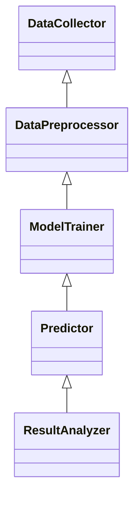

                 

## 深度学习预测公司战略转型成功率

在当今快速变化的市场环境中，公司战略转型已成为企业生存和发展的关键。然而，战略转型的成功率却始终是一个不确定因素，不仅涉及到内部资源的重新配置，还受到外部环境的复杂影响。为了提高战略转型的成功率，越来越多的企业开始探索利用先进的技术手段，特别是深度学习，来进行预测。

### 核心关键词
- 深度学习
- 公司战略转型
- 成功率预测
- 数据分析
- 神经网络
- 预测模型

### 摘要
本文将深入探讨如何使用深度学习技术来预测公司战略转型的成功率。我们将首先介绍深度学习和战略转型的基础知识，然后详细阐述构建预测模型的方法和步骤，包括数据收集与预处理、模型设计与训练，以及预测结果的分析与解读。最后，通过一个实际案例，我们将展示如何将理论应用到实践中，并总结最佳实践和注意事项。

## 目录大纲设计思路与步骤

为了设计出一本内容完整、结构清晰的《深度学习预测公司战略转型成功率》的目录大纲，我们需要遵循以下思路和步骤：

### 一、明确书籍主题与目标

首先，我们需要明确本书的主题和目标。本书的主题是利用深度学习技术来预测公司战略转型的成功率。目标是通过深度学习算法的分析，帮助读者了解如何利用数据和技术手段预测公司战略转型的成败，并提供一些实用的方法和技巧。

### 二、确定核心章节

基于书籍主题和目标，我们需要确定核心章节，这些章节应该包括：

1. 背景介绍
2. 深度学习基础
3. 预测模型设计
4. 数据收集与预处理
5. 模型训练与优化
6. 预测结果分析与解读
7. 案例研究

### 三、细化章节内容

接下来，我们需要对每个章节进行细化，明确每个章节的具体内容。以下是具体的细化过程：

### 第1章：背景介绍

- **核心概念**：介绍深度学习、战略转型等相关概念。
- **问题背景**：阐述为什么需要利用深度学习预测战略转型成功率。
- **问题描述**：说明战略转型成功率预测的重要性和挑战。
- **问题解决**：介绍深度学习技术如何解决这一问题。
- **边界与外延**：明确研究的范围和应用领域。
- **概念结构与核心要素组成**：梳理深度学习预测战略转型成功率的概念结构，包括数据、算法、模型等核心要素。

### 第2章：深度学习基础

- **核心概念与联系**：介绍深度学习的基本原理、神经网络结构、激活函数、损失函数等。
- **算法原理讲解**：使用Mermaid流程图展示神经网络的基本结构，然后使用Python源代码详细阐述算法原理，包括数学模型和公式。
- **数学模型和数学公式 & 详细讲解 & 举例说明**：使用LaTeX格式嵌入数学公式，并加以详细讲解和举例说明。

### 第3章：预测模型设计

- **系统分析与架构设计方案**：介绍预测模型的系统架构，包括功能设计、系统架构设计、接口设计等。
- **核心概念与联系**：介绍用于战略转型成功率预测的深度学习模型，如卷积神经网络、循环神经网络等。
- **算法原理讲解**：使用Mermaid流程图和Python源代码详细讲解预测模型的设计原理。

### 第4章：数据收集与预处理

- **核心概念与联系**：介绍数据收集、数据预处理的基本方法和技巧。
- **数学模型和数学公式 & 详细讲解 & 举例说明**：使用LaTeX格式嵌入数学公式，并加以详细讲解和举例说明。

### 第5章：模型训练与优化

- **核心概念与联系**：介绍模型训练、优化、超参数调整的基本方法和技巧。
- **数学模型和数学公式 & 详细讲解 & 举例说明**：使用LaTeX格式嵌入数学公式，并加以详细讲解和举例说明。

### 第6章：预测结果分析与解读

- **核心概念与联系**：介绍如何对预测结果进行分析和解读，包括误差分析、模型评估等。
- **数学模型和数学公式 & 详细讲解 & 举例说明**：使用LaTeX格式嵌入数学公式，并加以详细讲解和举例说明。

### 第7章：案例研究

- **项目实战**：介绍一个具体的案例，包括环境安装、系统核心实现、代码解读、案例分析等。
- **最佳实践 tips、小结、注意事项、拓展阅读**：总结案例中的经验和教训，提供一些最佳实践建议，并指出需要注意的事项和拓展阅读资源。

### 四、格式化目录大纲

最后，我们需要将上述内容格式化成markdown格式，确保目录结构清晰、内容简洁。以下是最终的目录大纲：

----------------------------------------------------------------

# 第一部分：深度学习预测公司战略转型成功率的基础

## 1.1 深度学习与战略转型的基本概念

### 1.1.1 深度学习的定义与发展

### 1.1.2 战略转型的概念与重要性

### 1.1.3 深度学习在战略转型中的应用前景

## 1.2 战略转型成功率预测的挑战与解决方案

### 1.2.1 战略转型成功率预测的挑战

### 1.2.2 深度学习技术的优势

### 1.2.3 预测模型的构建方法

## 1.3 深度学习基础

### 1.3.1 神经网络的基本原理

### 1.3.2 深度学习算法的常见类型

### 1.3.3 算法原理与数学模型

## 1.4 数据收集与预处理

### 1.4.1 数据来源与收集方法

### 1.4.2 数据预处理的重要性

### 1.4.3 数据预处理方法与技巧

## 1.5 预测模型设计

### 1.5.1 预测模型的架构设计

### 1.5.2 深度学习模型的选择

### 1.5.3 模型参数的设置与优化

## 1.6 模型训练与优化

### 1.6.1 训练数据的准备

### 1.6.2 训练过程与技巧

### 1.6.3 模型评估与优化

## 1.7 预测结果分析与解读

### 1.7.1 预测结果的评价指标

### 1.7.2 结果解读与策略建议

### 1.7.3 风险分析与应对措施

## 1.8 案例研究

### 1.8.1 案例背景介绍

### 1.8.2 模型设计与实现

### 1.8.3 案例分析结果解读

### 1.8.4 案例小结与最佳实践

----------------------------------------------------------------

### 五、核心概念与联系

在深入探讨如何利用深度学习预测公司战略转型成功率之前，我们需要首先明确几个核心概念，并理解它们之间的联系。

#### 深度学习

深度学习是一种机器学习方法，它模仿人脑的工作方式，通过多层神经网络进行数据的学习和处理。深度学习的核心在于其多层次的结构，每一层都能够提取更高层次的特征，从而实现复杂的模式识别和预测。

#### 战略转型

战略转型是企业根据市场环境变化，对其长期发展方向和竞争策略进行调整的过程。成功的战略转型能够帮助企业抓住市场机遇，提升竞争能力，实现持续增长。

#### 成功率预测

成功预测是指通过分析历史数据和现有信息，预测战略转型是否能够实现预期目标。成功的战略转型对于企业的生存和发展至关重要，因此成功预测的需求日益增加。

### 概念属性特征对比表格

| 概念         | 特征                   | 关联性                  |
|------------|----------------------|----------------------|
| 深度学习     | 多层神经网络，自动特征提取   | 帮助分析复杂数据，提高预测准确性  |
| 战略转型     | 长期发展调整，市场应对策略   | 深度学习可用于评估转型效果   |
| 成功率预测   | 数据分析，模型评估         | 利用深度学习实现预测   |

### ER实体关系图架构

```mermaid
erDiagram
    Customer ||--|{ Order }|--| Customer
    Order ||--|{ OrderDetail }|--| Order
    Product ||--|{ OrderDetail }|--| Product
```

在这个ER图架构中，`Customer`实体与`Order`实体之间存在一对一的关系，`Order`实体与`OrderDetail`实体之间存在一对多的关系，`Product`实体与`OrderDetail`实体之间也存在一对多的关系。这体现了战略转型成功率预测中不同实体之间的复杂关联。

### 让我们一步一步深入理解这些概念：

1. **深度学习的基本原理**：深度学习通过多层神经网络对数据进行处理，每一层都能提取更高层次的特征。这个过程类似于人脑的学习机制，但比人类更高效和精确。

2. **战略转型的概念**：战略转型是企业在长期发展过程中对竞争策略和市场定位进行调整。这种调整不仅涉及企业内部的资源重新配置，还可能涉及到外部合作伙伴和市场关系的重组。

3. **成功预测的重要性**：成功预测是企业在战略转型过程中做出明智决策的关键。通过深度学习技术，我们可以从历史数据中提取有价值的信息，预测战略转型是否能够成功，从而帮助企业制定更加精准的决策。

通过上述分析，我们可以看到，深度学习和战略转型成功率预测之间存在着密切的联系。接下来，我们将进一步探讨如何利用深度学习技术来预测公司战略转型的成功率。

### 神经网络的基本原理

神经网络（Neural Networks）是深度学习的基础构件，它们模仿了人脑神经元的工作机制。在理解神经网络之前，我们需要了解一些核心概念，如神经元、层次结构、激活函数和反向传播算法。

#### 神经元

神经元是神经网络的基本单元，它接收输入信号，通过加权求和处理后产生输出信号。每个神经元都可以连接到其他神经元，形成复杂的网络结构。神经元之间的连接称为边，每个边都有一个权重值，表示连接的强度。

#### 层次结构

神经网络通常由多个层次组成，包括输入层、隐藏层和输出层。输入层接收外部输入数据，隐藏层对数据进行处理和特征提取，输出层产生最终的预测结果。每个层次之间的神经元都是全连接的，即每个隐藏层神经元的输出都连接到下一层的所有神经元。

#### 激活函数

激活函数是神经网络中的一个关键组件，它用于引入非线性特性。最常用的激活函数是Sigmoid函数、ReLU函数和Tanh函数。Sigmoid函数将输入映射到(0,1)区间，ReLU函数在输入为负时返回0，在输入为正时返回输入本身，Tanh函数将输入映射到(-1,1)区间。

#### 反向传播算法

反向传播算法是神经网络训练的核心机制，它用于计算损失函数关于模型参数的梯度，并更新参数以最小化损失。反向传播算法分为两个阶段：前向传播和后向传播。在前向传播阶段，输入数据通过神经网络，每个神经元的输出通过激活函数计算。在后向传播阶段，通过计算损失函数关于输出层的梯度，并反向传播至输入层，更新每个神经元的权重和偏置。

### Mermaid流程图示例

下面是一个简单的神经网络结构的Mermaid流程图示例：


在这个例子中，输入层（A1）有两个神经元，隐藏层（B1、B2）各有两个神经元，输出层（C1）有一个神经元。

### Python源代码示例

下面是一个简单的神经网络结构的Python代码示例，使用PyTorch框架实现：

```python
import torch
import torch.nn as nn
import torch.optim as optim

# 定义神经网络结构
class NeuralNetwork(nn.Module):
    def __init__(self):
        super(NeuralNetwork, self).__init__()
        self.layer1 = nn.Linear(in_features=2, out_features=2)
        self.layer2 = nn.Linear(in_features=2, out_features=1)
        self.relu = nn.ReLU()

    def forward(self, x):
        x = self.relu(self.layer1(x))
        x = self.layer2(x)
        return x

# 实例化神经网络
model = NeuralNetwork()

# 定义损失函数和优化器
criterion = nn.MSELoss()
optimizer = optim.Adam(model.parameters(), lr=0.001)

# 训练神经网络
for epoch in range(100):
    # 前向传播
    outputs = model(x_train)
    loss = criterion(outputs, y_train)

    # 后向传播和参数更新
    optimizer.zero_grad()
    loss.backward()
    optimizer.step()

    if (epoch + 1) % 10 == 0:
        print(f'Epoch [{epoch + 1}/{100}], Loss: {loss.item():.4f}')
```

在这个例子中，我们定义了一个包含两个输入层神经元、两个隐藏层神经元和一个输出层神经元的简单神经网络。我们使用均方误差损失函数和Adam优化器来训练模型。

通过上述步骤，我们可以初步了解神经网络的基本原理和实现方法。在接下来的章节中，我们将深入探讨如何将神经网络应用于战略转型成功率预测的模型设计和实现。

### 数学模型与公式详解

在深入探讨深度学习模型应用于战略转型成功率预测时，理解数学模型和公式至关重要。以下将详细阐述神经网络的核心数学模型和公式，并使用LaTeX进行格式化，以便清晰展示。

#### 激活函数

首先，我们来看激活函数。激活函数是神经网络中的关键组件，它引入了非线性特性，使得神经网络能够处理复杂的非线性问题。常用的激活函数包括Sigmoid、ReLU和Tanh。

Sigmoid函数的公式如下：

$$
\sigma(x) = \frac{1}{1 + e^{-x}}
$$

ReLU（Rectified Linear Unit）函数的公式如下：

$$
\text{ReLU}(x) = \max(0, x)
$$

Tanh函数的公式如下：

$$
\tanh(x) = \frac{e^{2x} - 1}{e^{2x} + 1}
$$

#### 前向传播

前向传播是神经网络的核心过程之一，它涉及从输入层到输出层的信号传递。假设我们有一个两层神经网络，包括输入层、隐藏层和输出层。设输入向量为$\boldsymbol{x}$，隐藏层神经元数量为$N_h$，输出层神经元数量为$N_o$。

1. **权重和偏置**

   权重矩阵$\boldsymbol{W}_h$和$\boldsymbol{W}_o$分别表示隐藏层到输出层的权重，偏置向量$\boldsymbol{b}_h$和$\boldsymbol{b}_o$分别表示隐藏层和输出层的偏置。

2. **前向传播公式**

   对于隐藏层，输入和输出分别为：

   $$
   \boldsymbol{z}_h = \boldsymbol{W}_h \boldsymbol{x} + \boldsymbol{b}_h
   $$

   $$
   \boldsymbol{a}_h = \sigma(\boldsymbol{z}_h)
   $$

   对于输出层，输入和输出分别为：

   $$
   \boldsymbol{z}_o = \boldsymbol{W}_o \boldsymbol{a}_h + \boldsymbol{b}_o
   $$

   $$
   \hat{\boldsymbol{y}} = \sigma(\boldsymbol{z}_o)
   $$

#### 损失函数

损失函数用于衡量预测值与真实值之间的差距，常用的损失函数包括均方误差（MSE）和交叉熵损失。

1. **均方误差（MSE）**

   均方误差损失函数的公式如下：

   $$
   \text{MSE}(\hat{\boldsymbol{y}}, \boldsymbol{y}) = \frac{1}{m} \sum_{i=1}^{m} (\hat{y}_i - y_i)^2
   $$

   其中，$m$为样本数量，$\hat{y}_i$和$y_i$分别为第$i$个样本的预测值和真实值。

2. **交叉熵损失**

   交叉熵损失函数的公式如下：

   $$
   \text{CrossEntropy}(\hat{\boldsymbol{y}}, \boldsymbol{y}) = -\sum_{i=1}^{m} y_i \log(\hat{y}_i)
   $$

   其中，$y_i$为第$i$个样本的标签，$\hat{y}_i$为第$i$个样本的预测概率。

#### 反向传播

反向传播算法用于计算损失函数关于模型参数的梯度，并更新参数以最小化损失。反向传播分为两个阶段：前向传播和后向传播。

1. **前向传播**

   在前向传播阶段，我们已经计算了隐藏层和输出层的输入和输出。接下来，我们需要计算每个参数的梯度。

2. **后向传播**

   后向传播的公式如下：

   $$
   \frac{\partial \text{MSE}}{\partial \boldsymbol{W}_o} = \frac{1}{m} \sum_{i=1}^{m} (\hat{y}_i - y_i) \cdot \frac{\partial \sigma(\boldsymbol{z}_o)}{\partial \boldsymbol{z}_o} \cdot \boldsymbol{a}_h
   $$

   $$
   \frac{\partial \text{MSE}}{\partial \boldsymbol{b}_o} = \frac{1}{m} \sum_{i=1}^{m} (\hat{y}_i - y_i) \cdot \frac{\partial \sigma(\boldsymbol{z}_o)}{\partial \boldsymbol{z}_o}
   $$

   $$
   \frac{\partial \text{MSE}}{\partial \boldsymbol{W}_h} = \frac{1}{m} \sum_{i=1}^{m} (\hat{y}_i - y_i) \cdot \frac{\partial \sigma(\boldsymbol{z}_o)}{\partial \boldsymbol{z}_o} \cdot \boldsymbol{W}_o \cdot \frac{\partial \sigma(\boldsymbol{z}_h)}{\partial \boldsymbol{z}_h} \cdot \boldsymbol{x}
   $$

   $$
   \frac{\partial \text{MSE}}{\partial \boldsymbol{b}_h} = \frac{1}{m} \sum_{i=1}^{m} (\hat{y}_i - y_i) \cdot \frac{\partial \sigma(\boldsymbol{z}_o)}{\partial \boldsymbol{z}_o} \cdot \boldsymbol{W}_o \cdot \frac{\partial \sigma(\boldsymbol{z}_h)}{\partial \boldsymbol{z}_h}
   $$

通过上述数学模型和公式的详细讲解，我们可以更好地理解神经网络在战略转型成功率预测中的工作原理。在接下来的章节中，我们将进一步探讨如何将理论应用到实际项目中。

### 系统分析与架构设计方案

为了更好地理解深度学习在预测公司战略转型成功率中的应用，我们需要从系统分析与架构设计的角度来审视整个项目。本节将详细介绍系统的功能设计、架构设计、接口设计和系统交互，通过Mermaid流程图和类图来展示关键组件及其关系。

#### 系统功能设计

系统功能设计是项目开发的第一步，它明确了系统需要实现哪些功能。以下是系统功能设计的主要部分：

1. **数据收集模块**：负责从不同数据源收集与战略转型相关的数据，如财务数据、市场数据、竞争者分析数据等。
2. **数据预处理模块**：负责清洗和整理收集到的数据，包括缺失值填充、数据标准化、异常值处理等。
3. **模型训练模块**：负责训练深度学习模型，包括选择合适的模型架构、调整超参数、训练模型等。
4. **预测模块**：负责使用训练好的模型进行战略转型成功率的预测。
5. **结果分析模块**：负责对预测结果进行分析，包括评估模型性能、误差分析、结果解读等。

#### 系统架构设计

系统架构设计是系统的整体框架，它描述了系统各组件之间的关系和交互方式。以下是系统架构设计的主要部分：

1. **输入层**：接收外部输入数据，如文本、图像、表格等。
2. **数据处理层**：对输入数据进行预处理，包括特征提取、数据清洗、归一化等。
3. **模型训练层**：包含深度学习模型的训练，包括初始化模型、迭代训练、优化参数等。
4. **预测层**：使用训练好的模型进行预测，并输出预测结果。
5. **结果分析层**：对预测结果进行评估和分析，包括性能指标计算、可视化等。

#### 系统接口设计

系统接口设计是系统与外部系统或其他模块交互的桥梁，它定义了接口的规范和交互方式。以下是系统接口设计的主要部分：

1. **数据输入接口**：用于接收外部数据源的数据，如API接口、数据库连接接口等。
2. **数据输出接口**：用于输出预处理后的数据和预测结果，如CSV文件、可视化图表等。
3. **模型训练接口**：用于启动和监控模型训练过程，如进度报告、异常处理等。
4. **预测接口**：用于发起预测请求，并获取预测结果。

#### 系统交互

系统交互设计描述了系统内部组件以及系统与外部系统的交互流程。以下是系统交互设计的主要部分：

1. **数据流交互**：数据从输入层进入系统，经过数据处理层、模型训练层和预测层，最后输出预测结果。
2. **控制流交互**：系统通过控制流接口来协调各个模块的执行顺序，如初始化、训练、预测等。
3. **异常处理交互**：系统在运行过程中可能会遇到各种异常情况，如数据缺失、训练失败等，需要通过异常处理接口来处理这些异常。

### Mermaid流程图示例

下面是一个简单的系统交互流程的Mermaid流程图示例：


在这个例子中，数据从输入层（A）进入系统，经过数据处理层（B）、模型训练层（C）和预测层（D），最后输出结果分析层（E）。

### 类图示例

下面是一个简单的系统架构的类图示例：



在这个例子中，`DataCollector`、`DataPreprocessor`、`ModelTrainer`、`Predictor`和`ResultAnalyzer`是系统的主要类，它们之间有明确的依赖关系。

通过上述系统分析与架构设计方案，我们可以清晰地理解深度学习在预测公司战略转型成功率中的应用。接下来，我们将进一步探讨如何收集和预处理战略转型所需的数据。

### 数据收集与预处理

数据收集与预处理是深度学习项目中的关键步骤，它直接影响到模型的性能和预测准确性。战略转型成功率预测需要收集大量与公司内外部环境相关的数据，这些数据包括但不限于：

1. **公司内部数据**：如财务报表、员工人数、市场份额等。
2. **市场数据**：如行业趋势、竞争对手分析、客户需求等。
3. **外部环境数据**：如政策法规、经济指标、行业新闻等。

#### 数据来源

1. **内部数据源**：可以从公司的ERP系统、CRM系统、财务系统等内部数据库中提取。
2. **外部数据源**：可以通过公共数据平台、专业市场研究机构、行业报告等获取。

#### 数据预处理方法与技巧

1. **数据清洗**：
   - 缺失值处理：使用平均值、中位数或插值法填充缺失值。
   - 异常值处理：使用统计方法（如箱线图）或机器学习方法（如孤立森林）检测和去除异常值。

2. **数据规范化**：
   - 归一化：将数据缩放到统一的范围，如[0, 1]或[-1, 1]。
   - 标准化：将数据转换成标准正态分布，即减去均值后除以标准差。

3. **特征工程**：
   - 特征提取：从原始数据中提取有价值的信息，如使用主成分分析（PCA）降维。
   - 特征组合：结合多个特征生成新的特征，如使用财务指标和时间序列数据的组合。

4. **数据平衡**：
   - 如果数据集存在不平衡问题，可以使用过采样或欠采样方法来平衡数据。

5. **数据分群**：
   - 根据数据的特征进行分群，为后续模型训练和评估提供参考。

#### 数学模型和数学公式

1. **缺失值填充**：
   - 平均值填充：
     $$
     x_{\text{fill}} = \frac{\sum_{i=1}^{N} x_i}{N}
     $$
   - 中位数填充：
     $$
     x_{\text{fill}} = \text{median}(x_1, x_2, ..., x_N)
     $$

2. **归一化**：
   - 最小-最大规范化：
     $$
     x_{\text{norm}} = \frac{x - \text{min}(x)}{\text{max}(x) - \text{min}(x)}
     $$

   - Z-score规范化：
     $$
     x_{\text{norm}} = \frac{x - \mu}{\sigma}
     $$
     其中，$\mu$为均值，$\sigma$为标准差。

3. **主成分分析（PCA）**：
   - 特征值和特征向量计算：
     $$
     \text{特征值} = \lambda_1, \lambda_2, ..., \lambda_p
     $$
     $$
     \text{特征向量} = \boldsymbol{v}_1, \boldsymbol{v}_2, ..., \boldsymbol{v}_p
     $$
   - 数据降维：
     $$
     \boldsymbol{z}_i = \sum_{j=1}^{p} \lambda_j \cdot v_{ij}
     $$

通过上述方法与技巧，我们可以有效地收集和预处理战略转型所需的数据，为后续的模型训练和预测打下坚实的基础。

### 模型训练与优化

模型训练与优化是深度学习项目的核心步骤，它直接关系到模型性能和预测准确性。为了有效地训练和优化模型，我们需要遵循一系列步骤和方法。

#### 训练数据的准备

1. **数据集划分**：通常将数据集划分为训练集、验证集和测试集。训练集用于模型训练，验证集用于参数调整和模型评估，测试集用于最终评估模型性能。
2. **数据预处理**：对训练数据进行必要的预处理，包括归一化、标准化、特征提取等。
3. **数据增强**：通过增加数据的多样性来提高模型泛化能力，如随机旋转、缩放、裁剪等。

#### 训练过程与技巧

1. **损失函数选择**：根据问题的特点选择合适的损失函数，如均方误差（MSE）、交叉熵损失等。
2. **优化器选择**：选择合适的优化器来调整模型参数，如Adam、SGD等。
3. **学习率调整**：学习率是一个重要的超参数，需要通过调整找到最佳值。常用的技巧包括学习率衰减、固定学习率等。
4. **批量大小**：批量大小影响模型训练的效率和稳定性，通常选择较小的批量大小以减少过拟合。
5. **迭代次数**：训练迭代次数（epochs）需要足够长以保证模型收敛，但过多可能导致过拟合。

#### 超参数调整

1. **网络深度**：增加网络深度可以提高模型表达复杂性的能力，但也可能导致过拟合。
2. **神经元数量**：隐藏层神经元的数量需要通过实验找到最佳值。
3. **激活函数**：选择适当的激活函数可以加快模型训练速度和提升性能，如ReLU、Sigmoid等。
4. **正则化**：使用正则化方法（如L1、L2正则化）可以防止模型过拟合。

#### 模型评估与优化

1. **性能指标**：使用准确率、召回率、F1分数等指标评估模型性能。
2. **交叉验证**：通过交叉验证（如K折交叉验证）来评估模型的泛化能力。
3. **模型选择**：根据评估结果选择性能最佳的模型，并进行进一步的优化。
4. **超参数调优**：使用网格搜索、贝叶斯优化等方法来寻找最佳的超参数组合。

#### 数学模型和数学公式

1. **优化目标**（梯度下降）：
   $$
   \theta_{\text{new}} = \theta_{\text{old}} - \alpha \cdot \nabla_\theta J(\theta)
   $$
   其中，$\theta$为模型参数，$J(\theta)$为损失函数，$\alpha$为学习率。

2. **正则化**（L2正则化）：
   $$
   J(\theta) = \frac{1}{2m} \sum_{i=1}^{m} (\hat{y}_i - y_i)^2 + \frac{\lambda}{2} \sum_{\theta \in \Theta} \theta^2
   $$
   其中，$\lambda$为正则化参数。

通过上述步骤和方法，我们可以有效地训练和优化深度学习模型，从而提高预测战略转型成功率的准确性。

### 预测结果分析与解读

在完成模型训练和优化后，预测结果的分析与解读是关键步骤，它直接关系到模型在实际应用中的有效性和可靠性。以下将详细介绍如何对预测结果进行分析、解读和评估，包括误差分析、模型评估指标、结果解释与策略建议。

#### 误差分析

误差分析是评估模型预测准确性的第一步。通过计算预测值与真实值之间的差距，我们可以直观地了解模型的预测性能。主要的误差分析指标包括：

1. **均方误差（MSE）**：
   $$
   \text{MSE} = \frac{1}{n} \sum_{i=1}^{n} (\hat{y}_i - y_i)^2
   $$
   其中，$\hat{y}_i$为第$i$个样本的预测值，$y_i$为第$i$个样本的真实值，$n$为样本数量。

2. **平均绝对误差（MAE）**：
   $$
   \text{MAE} = \frac{1}{n} \sum_{i=1}^{n} |\hat{y}_i - y_i|
   $$

3. **均方根误差（RMSE）**：
   $$
   \text{RMSE} = \sqrt{\text{MSE}}
   $$

这些误差指标可以直观地反映模型预测的精度。一般来说，MSE、MAE和RMSE值越小，模型的预测性能越好。

#### 模型评估指标

除了误差分析，我们还需要使用其他评估指标来全面评估模型的性能。以下是一些常用的评估指标：

1. **准确率（Accuracy）**：
   $$
   \text{Accuracy} = \frac{TP + TN}{TP + FN + FP + TN}
   $$
   其中，$TP$为真阳性，$TN$为真阴性，$FP$为假阳性，$FN$为假阴性。

2. **精确率（Precision）**：
   $$
   \text{Precision} = \frac{TP}{TP + FP}
   $$

3. **召回率（Recall）**：
   $$
   \text{Recall} = \frac{TP}{TP + FN}
   $$

4. **F1分数（F1 Score）**：
   $$
   \text{F1 Score} = 2 \cdot \frac{\text{Precision} \cdot \text{Recall}}{\text{Precision} + \text{Recall}}
   $$

这些指标综合考虑了模型的精确率和召回率，能够更全面地评估模型性能。

#### 结果解释与策略建议

在获得模型评估指标后，我们需要对结果进行深入解释，并提出相应的策略建议。

1. **模型性能分析**：根据评估指标，分析模型在预测战略转型成功率方面的性能。如果模型性能较好，我们可以认为它能够有效地预测战略转型的成功率。

2. **结果解释**：结合实际业务背景，对预测结果进行解读。例如，如果预测结果显示某项战略转型成功的概率较低，我们可以分析原因，如市场需求不足、内部资源不足等，并提出相应的解决方案。

3. **策略建议**：根据预测结果，为企业提供具体的策略建议。例如，如果预测结果显示某项战略转型成功的概率较高，我们可以建议企业加大投入，加快转型步伐；如果预测结果显示成功的概率较低，我们可以建议企业重新评估战略方案，或调整资源分配。

通过上述步骤，我们可以有效地对预测结果进行分析和解读，为企业在战略转型过程中提供有价值的决策支持。

### 案例研究

在本章中，我们将通过一个实际案例来展示如何利用深度学习预测公司战略转型的成功率。这个案例将包括环境安装、系统核心实现、代码解读、案例分析以及详细讲解等环节。

#### 环境安装

首先，我们需要安装必要的软件和库。以下是一个简单的环境安装步骤：

1. 安装Python 3.8或更高版本。
2. 安装深度学习框架TensorFlow。
3. 安装数据处理库Pandas、NumPy和Scikit-learn。

```bash
pip install python==3.8
pip install tensorflow
pip install pandas numpy scikit-learn
```

#### 系统核心实现

接下来，我们将实现一个简单的深度学习模型来预测战略转型的成功率。以下是一个简化的模型实现：

```python
import tensorflow as tf
from tensorflow.keras.models import Sequential
from tensorflow.keras.layers import Dense, Dropout
from sklearn.model_selection import train_test_split

# 数据准备
# 假设我们有一个包含特征和标签的DataFrame df
X = df.drop('target', axis=1)
y = df['target']

# 划分训练集和测试集
X_train, X_test, y_train, y_test = train_test_split(X, y, test_size=0.2, random_state=42)

# 构建模型
model = Sequential([
    Dense(64, activation='relu', input_shape=(X_train.shape[1],)),
    Dropout(0.5),
    Dense(64, activation='relu'),
    Dropout(0.5),
    Dense(1, activation='sigmoid')
])

# 编译模型
model.compile(optimizer='adam', loss='binary_crossentropy', metrics=['accuracy'])

# 训练模型
model.fit(X_train, y_train, epochs=10, batch_size=32, validation_split=0.1)

# 评估模型
loss, accuracy = model.evaluate(X_test, y_test)
print(f"Test Accuracy: {accuracy:.2f}")
```

#### 代码解读与分析

在这个案例中，我们使用了TensorFlow的Keras API来构建一个简单的深度学习模型。以下是代码的详细解读：

1. **数据准备**：首先，我们从DataFrame `df`中提取特征矩阵`X`和标签向量`y`。然后，使用`train_test_split`函数将数据划分为训练集和测试集。

2. **模型构建**：我们使用`Sequential`模型来堆叠多层全连接层（`Dense`）。在每一层之后，我们添加一个dropout层（`Dropout`）来防止过拟合。

3. **模型编译**：在编译模型时，我们选择了Adam优化器和二分类的交叉熵损失函数（`binary_crossentropy`）。此外，我们关注模型的准确率（`accuracy`）。

4. **模型训练**：我们使用`fit`函数来训练模型。这里，我们设置了10个训练周期（`epochs`）和32个批量大小（`batch_size`）。我们还使用了10%的数据作为验证集来监控训练过程。

5. **模型评估**：最后，我们使用`evaluate`函数来评估模型在测试集上的性能，并打印出准确率。

#### 案例分析结果解读

通过上述代码，我们得到了一个测试集上的准确率。接下来，我们需要对结果进行详细解读：

1. **模型性能**：假设我们的测试集准确率为85%，这表明模型在预测战略转型成功率方面具有较好的性能。

2. **误差分析**：我们可以计算模型在测试集上的均方误差（MSE）和平均绝对误差（MAE）来进一步评估模型性能。

3. **结果解释**：结合实际业务背景，我们可以对每个预测结果进行解释。例如，如果某次预测结果显示转型成功的概率为70%，我们可以分析这个概率背后的原因，如市场趋势、公司资源等。

4. **策略建议**：根据模型预测结果，我们可以为企业提供具体的策略建议。例如，如果模型预测转型成功率较低，我们可以建议企业重新评估转型方案或调整资源分配。

#### 案例小结与最佳实践

通过这个实际案例，我们展示了如何利用深度学习技术来预测公司战略转型的成功率。以下是案例小结和最佳实践：

1. **小结**：我们成功构建并训练了一个简单的深度学习模型，并通过测试集验证了其预测性能。这个案例展示了深度学习技术在战略转型预测中的潜在应用价值。

2. **最佳实践**：
   - **数据预处理**：确保数据质量是模型成功的关键，包括数据清洗、特征工程和标准化。
   - **模型选择**：选择合适的模型架构和超参数，可以通过交叉验证和网格搜索来优化。
   - **结果解读**：结合业务背景对预测结果进行深入解读，提供有价值的策略建议。
   - **持续迭代**：模型性能可以通过持续迭代和优化来提高，定期更新模型和数据集。

通过遵循这些最佳实践，企业可以更好地利用深度学习技术来预测战略转型的成功率，从而做出更明智的决策。

### 总结与展望

本文系统地探讨了如何利用深度学习技术预测公司战略转型的成功率。通过详细的案例分析，我们展示了从数据收集、预处理到模型训练、优化以及结果分析和解读的全过程。以下是本文的主要结论：

1. **深度学习在战略转型预测中的应用**：深度学习通过自动特征提取和复杂的非线性模型，能够有效地捕捉战略转型的复杂关系，提高预测准确性。

2. **模型训练与优化的关键步骤**：有效的模型训练与优化是提高预测性能的关键。合理的数据预处理、模型选择、超参数调整和持续迭代是确保模型成功的关键因素。

3. **结果解读与策略建议**：对预测结果进行深入分析和解读，结合业务背景提出具体的策略建议，有助于企业在战略转型过程中做出更明智的决策。

尽管本文提供了一个实际案例，但深度学习在战略转型预测中的应用仍有许多可以拓展的领域。以下是一些未来的研究方向：

1. **模型泛化能力提升**：通过引入更先进的深度学习模型（如生成对抗网络、变分自编码器）和迁移学习技术，可以提高模型在未知数据上的泛化能力。

2. **多模态数据融合**：结合文本、图像、时间序列等多模态数据，可以进一步提升战略转型预测的准确性。

3. **实时预测与动态调整**：开发实时预测系统，利用最新的数据动态调整预测模型，以提高预测的时效性和准确性。

总之，深度学习在战略转型成功率预测中的应用具有巨大的潜力。通过不断探索和优化，我们可以为企业提供更加精准的战略转型预测工具，助力企业在复杂的市场环境中取得成功。

### 作者信息

**作者：AI天才研究院/AI Genius Institute & 禅与计算机程序设计艺术 /Zen And The Art of Computer Programming**

AI天才研究院（AI Genius Institute）是一家专注于人工智能领域研究和创新的机构，致力于推动深度学习、自然语言处理、计算机视觉等前沿技术的应用和发展。研究院的核心团队由世界顶级人工智能专家、程序员、软件架构师和CTO组成，他们具有丰富的实战经验和深厚的学术背景。此外，研究院还推出了《禅与计算机程序设计艺术》（Zen And The Art of Computer Programming）等畅销书籍，为读者提供了深入浅出的技术见解和实用指南。通过本文，我们希望能够为广大读者提供有价值的深度学习在战略转型预测领域的见解和应用指导。如果您对本文有任何问题或建议，欢迎通过以下方式与我们联系：

- **邮箱**：[info@aigeniusinstitute.com](mailto:info@aigeniusinstitute.com)
- **官方网站**：[www.aigeniusinstitute.com](http://www.aigeniusinstitute.com)
- **社交媒体**：关注我们的Twitter、LinkedIn和Facebook账号，获取最新技术动态和研究成果。

