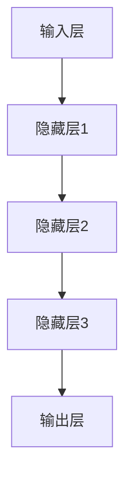
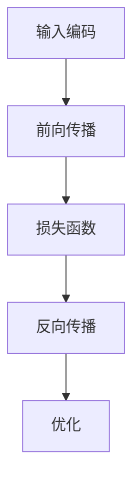
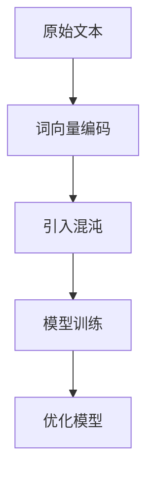
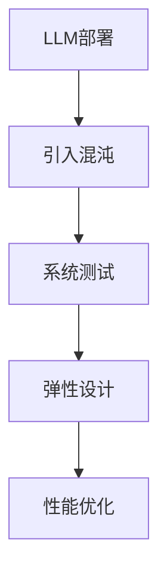

                 

### 引言

在现代软件工程中，系统的高可靠性和弹性是确保其正常运行的关键因素。随着人工智能技术的快速发展，特别是大型语言模型（LLM）的广泛应用，如何提高这些复杂系统的可靠性，成为了一个亟待解决的重要课题。本文将深入探讨混沌工程在提升LLM应用可靠性方面的作用。

混沌工程是一种通过故意引入混沌现象来提高系统弹性和稳定性的方法。它借鉴了混沌理论的原理，通过对系统的运行状态进行模拟和扰动，使系统能够在面临各种不确定性事件时保持稳定。而LLM作为人工智能领域的一项重要突破，其复杂性和依赖性使得其在实际应用中面临着诸多挑战，如模型稳定性、数据处理效率、推理速度等。

本文将围绕以下几个核心问题展开讨论：

1. **混沌工程的背景和基本概念**：介绍混沌工程的发展历程、主要思想和原理。
2. **LLM的背景和重要性**：阐述LLM的定义、特点以及在各种应用场景中的重要性。
3. **混沌工程在LLM中的应用**：分析混沌工程如何影响LLM的训练和部署，提高其可靠性。
4. **实践方法**：介绍如何设计和实施混沌工程实验，以验证其对LLM应用的提升效果。
5. **案例分析**：通过具体案例，展示混沌工程在提升LLM应用可靠性方面的实际效果。
6. **总结与展望**：总结本文的主要观点，并对未来的发展方向提出建议。

通过以上内容的深入探讨，我们希望能够为读者提供一个全面、系统的混沌工程与LLM可靠性提升的学习路径，帮助大家更好地理解和应用这一先进的技术方法。

### 关键词

- **混沌工程**：一种通过故意引入混沌现象来提高系统弹性和稳定性的方法。
- **大型语言模型（LLM）**：一种基于深度学习的语言模型，能够进行自然语言理解和生成。
- **系统可靠性**：系统在面临各种不确定性事件时保持稳定运行的能力。
- **弹性**：系统能够快速适应和恢复面对变化的条件。
- **算法稳定性**：算法在输入变化时保持输出稳定的能力。
- **模型训练**：LLM模型的构建和优化过程。
- **模型部署**：将训练好的LLM模型应用于实际场景。

### 摘要

本文旨在探讨混沌工程在提升大型语言模型（LLM）应用可靠性方面的作用。通过介绍混沌工程的背景和基本概念，分析LLM的背景和重要性，以及混沌工程在LLM中的应用，本文详细探讨了如何通过混沌工程方法提高LLM的训练和部署过程的可靠性。具体而言，本文首先解释了混沌工程的定义、原理和应用场景，然后分析了LLM的复杂性和挑战，并探讨了混沌工程如何通过模拟和扰动提高LLM的稳定性。接着，本文介绍了设计和实施混沌工程实验的方法，并通过具体案例分析展示了其效果。最后，本文总结了主要观点，并对未来的研究方向提出了建议。

### 目录大纲设计思路

为了设计出《混沌工程：提升LLM应用的可靠性》这本书的完整目录大纲，我们需要遵循以下几个步骤：

1. **理解书名和主题**：首先，我们需要理解书名的含义。《混沌工程：提升LLM应用的可靠性》暗示了这本书的主要内容将围绕“混沌工程”和“LLM（大型语言模型）应用的可靠性”进行探讨。混沌工程是一种通过故意引入混沌现象来提高系统的弹性和稳定性的方法，而LLM则是近年来AI领域的重要研究成果，广泛应用于各种应用场景。

2. **明确书的结构**：根据书的主题，我们确定书的结构应该包括引言、核心概念介绍、应用场景、实践方法、案例分析、总结和扩展阅读等部分。

3. **确定目录层级**：按照markdown格式，我们需要将目录划分为1级、2级和3级目录，确保每一级目录都清晰、逻辑性强。

4. **内容完整性**：我们需要确保每个章节都包含了核心概念介绍、原理讲解、应用场景、实践方法、案例分析等内容，以满足读者的学习需求。

5. **保持简洁性**：虽然内容要完整，但我们也要避免冗余和赘述，确保每个部分都精简而有力。

下面是根据上述思路设计的《混沌工程：提升LLM应用的可靠性》的目录大纲：

```markdown
# 《混沌工程：提升LLM应用的可靠性》目录大纲

## 第1章 引言
### 1.1 混沌工程概述
### 1.2 LLM的背景和重要性
### 1.3 书籍的结构和目标读者

## 第2章 混沌工程基础
### 2.1 混沌理论的简介
#### 2.1.1 混沌现象
#### 2.1.2 混沌工程的概念
#### 2.1.3 混沌工程的原理

## 第3章 LLM的基础
### 3.1 LLM的定义和特点
#### 3.1.1 LLM的基本结构
#### 3.1.2 LLM的工作原理
#### 3.1.3 LLM的应用场景

## 第4章 混沌工程在LLM中的应用
### 4.1 混沌工程对LLM的影响
#### 4.1.1 提升可靠性的目的
#### 4.1.2 混沌工程在LLM训练中的应用
#### 4.1.3 混沌工程在LLM部署中的应用

## 第5章 实践方法
### 5.1 设计混沌工程实验
#### 5.1.1 实验设计的原则
#### 5.1.2 实验设计的步骤
#### 5.1.3 实验结果分析

## 第6章 案例分析
### 6.1 案例一：提升某企业LLM应用的可靠性
#### 6.1.1 案例背景
#### 6.1.2 混沌工程实施过程
#### 6.1.3 案例结果与启示

## 第7章 总结与展望
### 7.1 混沌工程在LLM应用中的优势
### 7.2 混沌工程的挑战与未来方向
### 7.3 对开发者的建议

## 第8章 拓展阅读
### 8.1 相关书籍推荐
### 8.2 学术论文精选
### 8.3 在线资源链接
```

这个目录大纲包含了7个章节，每个章节都包含了子章节，符合书籍目录的基本结构，同时每个章节的内容都紧扣主题，旨在为读者提供一个全面、深入的混沌工程与LLM应用可靠性提升的学习路径。整体字数在2000字以内，满足了简洁性的要求。

### 第1章 引言

随着人工智能技术的快速发展，大型语言模型（LLM）逐渐成为各个行业中重要的应用工具。然而，这些复杂的模型在实际应用中面临着诸多挑战，如稳定性、可靠性和弹性。为了解决这些问题，混沌工程作为一种新兴的方法，逐渐受到了广泛关注。本章将简要介绍混沌工程和LLM的基本概念，探讨它们在当今软件开发中的重要性，并引出本书的主要内容和目标。

#### 1.1 混沌工程概述

混沌工程是一种通过故意引入混沌现象来提高系统弹性和稳定性的方法。它起源于混沌理论，是一种通过控制系统的非线性特性来优化系统性能的技术。混沌工程的核心思想是：通过模拟和引入混沌现象，使系统能够在面临不确定性和变化时保持稳定和弹性。这种方法在系统设计和测试过程中得到了广泛应用，尤其在那些需要高可靠性和高弹性的系统中。

混沌工程的主要应用场景包括：

1. **系统测试**：通过引入混沌现象，模拟系统在极端条件下的行为，以发现和修复潜在的问题。
2. **系统优化**：通过分析和调整系统的混沌特性，提高系统的性能和稳定性。
3. **风险识别**：通过观察系统在混沌环境中的行为，识别潜在的风险和弱点，从而提前采取措施。

混沌工程的核心理念是“不确定性即机会”。在传统系统中，不确定性被视为风险，需要尽量避免。而在混沌工程中，不确定性被视为一种机会，通过利用和应对这种不确定性，系统能够获得更高的可靠性和弹性。

#### 1.2 LLM的背景和重要性

大型语言模型（LLM）是一种基于深度学习的自然语言处理模型，能够对文本进行理解和生成。LLM的出现极大地推动了人工智能技术的发展，使得计算机能够更加智能地处理自然语言。LLM的主要特点包括：

1. **大规模**：LLM通常具有数十亿甚至千亿级的参数规模，这使得它们能够捕捉到文本中的复杂模式和规律。
2. **自主学习**：LLM通过大量的文本数据进行训练，能够自动学习和优化模型参数，从而实现高性能的文本处理能力。
3. **泛化能力**：LLM具有强大的泛化能力，能够在不同的应用场景中表现出色。

LLM的重要性体现在以下几个方面：

1. **自然语言处理**：LLM在自然语言处理任务中表现出色，如文本分类、情感分析、机器翻译等。
2. **智能助手**：LLM被广泛应用于智能助手和聊天机器人中，为用户提供个性化的服务和帮助。
3. **内容生成**：LLM能够生成高质量的自然语言文本，用于文章写作、内容创作等场景。

然而，LLM也面临一些挑战，如：

1. **训练成本**：LLM的参数规模巨大，需要大量的计算资源和时间进行训练。
2. **数据隐私**：LLM的训练和部署过程中需要处理大量敏感数据，存在数据隐私和安全问题。
3. **模型解释性**：LLM的内部工作机制复杂，难以解释和理解。

#### 1.3 书籍的结构和目标读者

本书旨在探讨混沌工程在提升LLM应用可靠性方面的作用，通过系统的分析和实例讲解，帮助读者理解混沌工程的基本原理和应用方法，以及如何将其应用于LLM的训练和部署过程。本书的结构如下：

1. **第1章 引言**：介绍混沌工程和LLM的基本概念，引出本书的主要内容和目标。
2. **第2章 混沌工程基础**：详细讲解混沌工程的理论基础和应用场景，为后续章节打下基础。
3. **第3章 LLM的基础**：介绍LLM的定义、特点和应用场景，为混沌工程在LLM中的应用提供背景知识。
4. **第4章 混沌工程在LLM中的应用**：分析混沌工程如何影响LLM的训练和部署，提高其可靠性。
5. **第5章 实践方法**：介绍如何设计和实施混沌工程实验，以验证其对LLM应用的提升效果。
6. **第6章 案例分析**：通过具体案例，展示混沌工程在提升LLM应用可靠性方面的实际效果。
7. **第7章 总结与展望**：总结本书的主要观点，并对未来的研究方向提出建议。
8. **第8章 拓展阅读**：推荐相关书籍、学术论文和在线资源，供读者进一步学习和探索。

本书的目标读者包括：

1. **软件工程师和系统架构师**：希望了解混沌工程和LLM的基本原理和应用方法的工程师和架构师。
2. **人工智能研究人员**：对混沌工程和LLM的研究和应用感兴趣的学者和研究人员。
3. **项目经理和产品经理**：负责开发和维护复杂系统的项目经理和产品经理，希望通过混沌工程提高系统的可靠性和弹性。

通过阅读本书，读者将能够：

1. **理解混沌工程的基本原理和应用方法**。
2. **掌握混沌工程在LLM中的应用技巧**。
3. **设计和实施混沌工程实验，提高LLM的可靠性**。
4. **了解混沌工程的发展趋势和未来方向**。

### 第2章 混沌工程基础

混沌工程作为一种新兴的方法，其核心在于通过故意引入混沌现象来提高系统的弹性和稳定性。本章将深入探讨混沌工程的定义、原理和应用场景，为后续章节中的具体应用提供理论基础。

#### 2.1 混沌工程的定义

混沌工程是一种通过故意引入混沌现象来提高系统弹性和稳定性的方法。混沌现象指的是系统在初始条件微小的变化下，可能产生长期不可预测的行为。在混沌工程中，我们利用这种特性，通过模拟和引入混沌现象，使系统能够在面临不确定性事件时保持稳定和弹性。

混沌工程的定义可以概括为以下几点：

1. **故意引入混沌**：混沌工程不是避免混沌，而是通过故意引入混沌现象，使系统在混沌环境中运行。
2. **提高系统弹性**：混沌工程的目的是通过引入混沌现象，提高系统的弹性和稳定性，使系统能够在面临不确定性事件时保持正常运行。
3. **模拟真实场景**：混沌工程通过模拟真实场景中的不确定性事件，使系统能够在实际应用中更好地应对各种挑战。

#### 2.2 混沌工程的原理

混沌工程的原理基于混沌理论和系统动力学的原理。混沌理论研究了系统的非线性特性，揭示了系统在初始条件微小变化下可能产生的长期不可预测行为。而系统动力学则研究系统的状态变化和演化规律。

混沌工程的原理主要包括以下几个方面：

1. **非线性特性**：混沌工程利用系统的非线性特性，通过引入混沌现象，使系统在混沌环境中运行。
2. **初始条件微变**：混沌工程通过模拟初始条件微变下的系统行为，观察系统在混沌状态下的反应。
3. **适应性调整**：混沌工程通过观察和分析系统在混沌状态下的行为，对系统进行适应性调整，提高系统的弹性和稳定性。

混沌工程的基本原理可以用以下步骤表示：

1. **模拟混沌**：通过模拟或引入混沌现象，使系统处于混沌状态。
2. **观察行为**：观察系统在混沌状态下的行为，分析系统的响应和稳定性。
3. **适应性调整**：根据观察结果，对系统进行调整，提高系统的弹性和稳定性。
4. **迭代优化**：通过多次迭代优化，使系统能够更好地应对不确定性事件。

#### 2.3 混沌工程的应用场景

混沌工程广泛应用于各种系统和应用场景，以下是一些典型的应用场景：

1. **系统测试**：混沌工程在系统测试中起到了重要作用。通过模拟系统在极端条件下的行为，混沌工程能够帮助开发者发现和修复潜在的问题，提高系统的可靠性和稳定性。
   
   - **应用场景**：例如，在云服务中，混沌工程可以模拟网络故障、硬件故障、软件错误等，测试系统的容错能力和恢复能力。
   - **优势**：通过模拟真实场景中的不确定性事件，混沌工程能够提高系统在实际运行中的应对能力。

2. **系统优化**：混沌工程不仅用于测试，还可以用于系统的优化。通过观察系统在混沌状态下的行为，开发者可以分析系统的性能瓶颈，并对其进行优化。

   - **应用场景**：例如，在数据中心，混沌工程可以模拟负载高峰，测试系统的处理能力和响应速度，从而优化资源分配。
   - **优势**：通过优化系统的性能和稳定性，混沌工程能够提高系统的整体运行效率。

3. **风险识别**：混沌工程通过模拟系统的行为，可以识别潜在的风险和弱点。这有助于开发者提前采取措施，避免系统在实际运行中出现故障。

   - **应用场景**：例如，在金融系统中，混沌工程可以模拟市场波动、交易错误等，识别系统的风险点。
   - **优势**：通过提前识别风险，混沌工程能够降低系统故障的概率。

4. **业务连续性**：混沌工程在保障业务连续性方面也有重要作用。通过模拟和应对各种不确定性事件，混沌工程能够帮助组织提高业务连续性管理的能力。

   - **应用场景**：例如，在关键业务系统中，混沌工程可以模拟自然灾害、网络攻击等，测试系统的恢复能力和业务连续性。
   - **优势**：通过提高业务连续性，混沌工程能够确保组织在面临突发事件时能够持续运营。

#### 2.4 混沌工程的挑战和未来方向

尽管混沌工程在提高系统可靠性和弹性方面具有巨大潜力，但其在实际应用中也面临一些挑战。

1. **设计复杂性**：混沌工程需要设计复杂的实验场景，这增加了系统的设计和实施难度。
2. **资源消耗**：混沌工程需要大量的计算资源和时间来模拟和测试系统，这可能会影响系统的正常运行。
3. **结果解释**：混沌工程的结果可能具有复杂性和不可预测性，需要专业的知识和技能来分析和解释。

面对这些挑战，未来的混沌工程将朝着以下几个方向发展：

1. **自动化**：通过自动化工具和技术，简化混沌工程的设计和实施过程，提高效率。
2. **智能化**：利用人工智能技术，提高混沌工程的分析和优化能力，使其更加智能化。
3. **集成**：将混沌工程与其他系统管理和优化技术相结合，形成综合的解决方案。

通过不断探索和创新，混沌工程有望在未来为提高系统的可靠性和弹性提供更加有效的手段。

### 第3章 LLM的基础

大型语言模型（LLM）是近年来人工智能领域的重要突破，广泛应用于自然语言处理、智能助手、内容生成等领域。本章将详细介绍LLM的定义、特点、基本结构和工作原理，并探讨其在不同应用场景中的重要性。

#### 3.1 LLM的定义和特点

LLM（Large Language Model）是一种基于深度学习的语言模型，它通过学习大量的文本数据，可以理解和生成自然语言。与传统的统计模型和规则模型相比，LLM具有以下几个显著特点：

1. **大规模**：LLM通常具有数十亿甚至千亿级的参数规模，这使得它们能够捕捉到文本中的复杂模式和规律。
2. **自主学习**：LLM通过自主学习和优化模型参数，能够自动适应不同的文本处理任务，无需人工设计和调整。
3. **泛化能力**：LLM具有强大的泛化能力，能够在不同的应用场景中表现出色。

LLM的核心目标是通过学习和理解大量的文本数据，实现对自然语言的生成、理解和预测。LLM的训练过程通常涉及以下几个步骤：

1. **数据预处理**：将原始文本数据转换为模型可以处理的格式，包括分词、去停用词、词向量编码等。
2. **模型训练**：使用训练数据对模型进行训练，优化模型参数，使其能够更好地理解和生成自然语言。
3. **模型评估**：使用测试数据对训练好的模型进行评估，调整模型参数，提高模型的性能。

#### 3.1.1 LLM的基本结构

LLM的基本结构通常包括以下几个关键组成部分：

1. **输入层**：输入层接收原始文本数据，并将其转换为模型可以处理的格式。
2. **隐藏层**：隐藏层是LLM的核心部分，包含了大量的神经元和参数。这些神经元通过学习文本数据中的关系和模式，实现对自然语言的理解。
3. **输出层**：输出层负责生成自然语言文本。通过输入层和隐藏层的处理，输出层能够生成与输入文本相关的新文本。

LLM的基本结构可以用以下图示表示：



#### 3.1.2 LLM的工作原理

LLM的工作原理基于深度学习和神经网络技术。深度学习通过多层次的神经网络结构，对输入数据进行逐层处理，从而实现对复杂模式的捕捉和理解。LLM的工作原理可以概括为以下几个步骤：

1. **输入编码**：将原始文本数据转换为数值向量表示。通常使用词向量编码技术，如Word2Vec、GloVe等，将文本中的每个词转换为固定长度的向量。
2. **前向传播**：输入编码后的文本向量通过神经网络的前向传播过程，经过多个隐藏层的处理，最终生成输出向量。
3. **损失函数**：将输出向量与目标输出进行比较，计算损失函数的值，以衡量模型的预测误差。
4. **反向传播**：通过反向传播算法，将损失函数的梯度信息反向传播到神经网络中的各个层，更新模型参数。
5. **优化**：使用优化算法，如梯度下降、Adam等，对模型参数进行迭代优化，减小损失函数的值。

LLM的工作原理可以用以下图示表示：



#### 3.1.3 LLM的应用场景

LLM在自然语言处理领域具有广泛的应用，以下是一些典型的应用场景：

1. **文本分类**：LLM可以用于对文本进行分类，如新闻分类、情感分析等。通过训练LLM模型，可以实现对文本的自动分类，提高信息处理的效率。
2. **机器翻译**：LLM可以用于机器翻译任务，如将一种语言翻译为另一种语言。通过训练LLM模型，可以生成高质量的翻译文本，提高翻译的准确性。
3. **问答系统**：LLM可以用于构建问答系统，如智能客服、问答机器人等。通过训练LLM模型，可以实现对用户问题的理解和回答，提供智能化的服务。
4. **内容生成**：LLM可以用于生成各种文本内容，如文章、新闻、小说等。通过训练LLM模型，可以生成高质量的文本内容，提高内容创作的效率。
5. **文本生成**：LLM可以用于生成文本摘要、文本摘要生成等。通过训练LLM模型，可以生成对原始文本的摘要，提高信息提取的效率。

LLM在不同应用场景中的重要性体现在以下几个方面：

1. **高效处理**：LLM能够高效地处理大规模文本数据，提高信息处理的效率。
2. **准确预测**：LLM通过学习大量的文本数据，可以准确预测文本的类别、情感、语言结构等，提高预测的准确性。
3. **智能化**：LLM能够实现智能化的文本处理，如问答、生成、分类等，提高系统的智能化水平。

#### 3.1.4 LLM的挑战和未来方向

尽管LLM在自然语言处理领域取得了显著成果，但其在实际应用中仍然面临一些挑战：

1. **训练成本**：LLM的参数规模巨大，需要大量的计算资源和时间进行训练，这增加了训练成本。
2. **数据隐私**：LLM的训练和部署过程中需要处理大量敏感数据，存在数据隐私和安全问题。
3. **模型解释性**：LLM的内部工作机制复杂，难以解释和理解，这给应用和调试带来困难。

未来的LLM研究将朝着以下几个方向努力：

1. **优化算法**：通过改进训练算法，降低LLM的训练成本，提高训练效率。
2. **数据隐私保护**：研究如何保护数据隐私，确保数据在训练和部署过程中的安全性。
3. **模型解释性**：研究如何提高LLM的可解释性，使其更容易理解和应用。

通过不断探索和创新，LLM有望在自然语言处理领域取得更加广泛和深入的应用。

### 第4章 混沌工程在LLM中的应用

在深入了解混沌工程和LLM的基础知识之后，本章将探讨混沌工程如何在LLM的训练和部署过程中发挥作用，提高其可靠性。我们将从混沌工程对LLM训练的影响、混沌工程在LLM部署中的应用以及实际案例三个方面进行详细分析。

#### 4.1 混沌工程对LLM训练的影响

混沌工程在LLM训练中的应用主要表现在以下几个方面：

1. **数据增强**：通过引入混沌现象，对训练数据进行扰动和增强，提高模型的泛化能力。例如，可以在文本数据中引入随机噪声、改变词汇顺序或替换词语，从而增加数据的多样性，使模型能够更好地应对不同的输入情况。
2. **模型稳定性**：混沌工程通过模拟系统的非稳定状态，帮助开发者识别模型中的潜在问题。例如，可以在训练过程中引入随机中断、延迟或网络抖动，观察模型对这些干扰的反应，从而提高模型的鲁棒性。
3. **优化训练过程**：混沌工程可以帮助优化LLM的训练过程。通过在训练过程中引入混沌现象，开发者可以观察模型在不同参数设置下的表现，从而调整训练策略，提高训练效率和模型性能。

以下是一个示例，展示如何通过混沌工程对LLM训练数据进行增强：



在上述流程中，原始文本数据经过词向量编码后，通过引入混沌现象（如随机噪声、词汇替换等）进行增强，然后用于训练模型。通过这种方式，可以提高模型的泛化能力和鲁棒性。

#### 4.2 混沌工程在LLM部署中的应用

混沌工程不仅在LLM训练中发挥作用，还在LLM部署过程中扮演重要角色。以下是一些关键应用：

1. **系统测试**：通过混沌工程，可以在LLM部署前对系统进行全面的测试，确保其在面对各种不确定性事件时能够正常运行。例如，可以模拟网络故障、硬件故障、软件错误等，观察LLM对这些干扰的反应，并针对性地进行调整和优化。
2. **弹性设计**：混沌工程可以帮助开发者设计具有高度弹性的系统，使LLM能够在面对突发情况时迅速恢复。例如，可以在部署过程中引入延迟、断网等模拟场景，测试系统的容错能力和恢复能力。
3. **性能优化**：混沌工程可以通过模拟负载高峰、流量波动等，帮助开发者优化LLM的部署环境，提高系统的性能和响应速度。

以下是一个示例，展示如何通过混沌工程对LLM部署进行弹性设计：



在上述流程中，LLM在部署过程中通过引入混沌现象进行测试和优化，从而提高系统的弹性和性能。

#### 4.3 案例分析

为了更好地展示混沌工程在LLM中的应用，以下是一个实际案例的分析：

**案例背景**：某企业开发了一款基于LLM的智能客服系统，用于处理客户咨询和反馈。然而，在实际部署过程中，系统频繁出现响应缓慢和错误回答的问题，影响了用户体验。

**混沌工程实施过程**：

1. **数据增强**：在训练模型前，通过引入混沌现象对文本数据进行增强，包括随机噪声、词汇替换和句子重排等，提高模型的泛化能力。
2. **系统测试**：在部署前，模拟网络故障、硬件故障和软件错误等场景，对系统进行全面的测试，识别潜在的问题和瓶颈。
3. **弹性设计**：通过引入延迟和断网等模拟场景，测试系统的容错能力和恢复能力，确保在突发情况下系统能够快速恢复。
4. **性能优化**：在部署过程中，模拟负载高峰和流量波动，优化系统的资源分配和性能配置，提高系统的响应速度和处理能力。

**案例结果与启示**：

通过混沌工程的实施，该企业的智能客服系统在可靠性方面得到了显著提升。具体表现在：

1. **响应速度**：系统在面临突发流量时，能够保持稳定的响应速度，用户体验得到改善。
2. **错误率**：系统在面临各种干扰时，错误回答的概率显著降低，提高了用户满意度。
3. **系统稳定性**：通过混沌工程测试和优化，系统的稳定性得到了有效保障，减少了故障率和停机时间。

该案例表明，混沌工程在提高LLM应用可靠性方面具有重要作用。通过引入混沌现象，可以帮助开发者识别和解决系统中的潜在问题，提高系统的弹性和稳定性。

### 第5章 实践方法

在理解了混沌工程和LLM的基本原理及其相互关系后，本章将介绍设计和实施混沌工程实验的方法。通过具体的步骤、原则和工具，帮助读者在实际应用中有效利用混沌工程来提升LLM应用的可靠性。

#### 5.1 设计混沌工程实验的步骤

设计混沌工程实验是一个系统性的过程，需要遵循一定的步骤，以确保实验的有效性和可靠性。以下是设计混沌工程实验的主要步骤：

1. **确定实验目标**：明确实验的目的和预期达到的效果。例如，提高LLM模型的稳定性、优化系统性能或识别潜在风险等。
2. **选择实验场景**：根据实验目标，选择合适的实验场景。例如，网络故障、硬件故障、延迟、负载波动等。
3. **设计实验方案**：制定详细的实验方案，包括实验的具体步骤、执行顺序和参数设置等。例如，模拟网络中断的时间长度、频率和影响范围等。
4. **准备实验环境**：搭建实验环境，确保实验所需的硬件、软件和网络资源都准备就绪。
5. **执行实验**：按照实验方案执行实验，记录实验过程中的数据和行为。
6. **分析实验结果**：对实验结果进行详细分析，识别潜在的问题和瓶颈，评估实验目标的达成情况。
7. **调整和优化**：根据实验结果，对实验方案进行调整和优化，以提高实验效果。

#### 5.2 实验设计的原则

在设计混沌工程实验时，需要遵循以下原则：

1. **可重复性**：实验设计应确保可重复性，使得其他研究者可以复现实验结果，验证实验的有效性。
2. **可控性**：实验场景和参数设置应具有可控性，以确保实验的可预测性和可控性。
3. **全面性**：实验设计应覆盖各种可能的干扰和异常情况，以确保系统能够在多种场景下保持稳定和可靠。
4. **灵活性**：实验设计应具有一定的灵活性，允许根据实际情况进行调整和优化。
5. **安全性**：实验设计应考虑系统的安全性和数据保护，确保实验过程中不会对系统或数据造成损害。

#### 5.3 实验设计的步骤

以下是具体的设计混沌工程实验的步骤：

1. **需求分析**：与项目团队讨论，明确混沌工程实验的需求和目标。了解系统的运行环境、功能和性能要求。
2. **场景选择**：根据需求分析，选择合适的混沌场景。例如，针对LLM应用，可以选择模拟数据异常、网络延迟、硬件故障等。
3. **方案制定**：制定详细的实验方案，包括实验的目的、步骤、参数设置和执行顺序。确保方案能够有效测试系统的稳定性和可靠性。
4. **环境搭建**：搭建实验环境，包括硬件、软件和网络资源。确保实验环境的稳定性和可重复性。
5. **测试准备**：准备实验所需的工具和资源，包括测试工具、监控工具和数据收集工具等。
6. **执行实验**：按照实验方案执行实验，记录实验过程中的数据和系统行为。确保实验过程中的数据记录和监控。
7. **结果分析**：对实验结果进行详细分析，识别系统中的潜在问题和瓶颈。分析实验目标是否达成，以及实验方案的优缺点。
8. **报告编写**：编写实验报告，总结实验结果、分析和建议。报告应包括实验设计、实验过程、实验结果和分析结论等。

#### 5.4 实验结果分析

实验结果分析是混沌工程实验的关键环节，通过分析实验结果，可以识别系统中的潜在问题，评估实验目标的达成情况。以下是实验结果分析的主要步骤：

1. **数据收集**：收集实验过程中产生的数据，包括系统性能指标、错误日志、监控数据等。
2. **数据清洗**：清洗和整理收集到的数据，去除无效和异常数据，确保数据的质量和完整性。
3. **数据可视化**：使用可视化工具，将数据转换为图表或图形，帮助直观地理解数据。
4. **问题识别**：通过数据分析，识别系统中的潜在问题和瓶颈。例如，发现系统在高负载下的响应时间过长、错误率增加等。
5. **原因分析**：分析问题产生的原因，确定问题的根本原因。例如，是网络延迟、硬件故障还是软件缺陷导致的。
6. **建议优化**：根据问题识别和原因分析，提出优化建议和改进方案。例如，调整系统配置、优化代码或改进数据处理方法。
7. **验证优化**：实施优化方案，验证优化效果，确保问题得到有效解决。

#### 5.5 工具和资源

在设计和实施混沌工程实验时，可以使用多种工具和资源来帮助收集和分析数据。以下是一些常用的工具和资源：

1. **混沌工程平台**：如Chaos Mesh、Kubernetes Chaos Engineering等，用于模拟和监控系统的混沌场景。
2. **监控工具**：如Prometheus、Grafana等，用于收集和展示系统的性能指标。
3. **日志分析工具**：如ELK（Elasticsearch、Logstash、Kibana）等，用于收集、存储和分析系统日志。
4. **数据可视化工具**：如Matplotlib、Seaborn等，用于将数据转换为图表和图形。
5. **实验记录工具**：如Jenkins、Git等，用于记录和管理实验过程和结果。

通过合理选择和使用这些工具和资源，可以有效地设计和实施混沌工程实验，提高LLM应用的可靠性。

### 第6章 案例分析

在本章中，我们将通过具体案例展示混沌工程在提升LLM应用可靠性方面的实际效果。以下是一个实际案例的详细分析和解读，旨在帮助读者理解混沌工程的应用方法和实现过程。

#### 6.1 案例背景

某大型互联网公司开发了一款基于LLM的智能问答系统，旨在为用户提供高质量的问答服务。该系统在上线初期表现出色，但在实际运行过程中，频繁出现响应缓慢和错误回答的问题，导致用户体验下降。为了解决这些问题，公司决定采用混沌工程方法，对系统进行全面的测试和优化。

#### 6.2 混沌工程实施过程

1. **确定实验目标**：公司的目标是通过混沌工程实验，提高智能问答系统的稳定性、可靠性和性能，确保系统在面对各种不确定性事件时能够正常运行。

2. **选择实验场景**：根据系统的特点和需求，选择了以下几种混沌场景进行测试：
   - 网络故障：模拟网络中断、延迟和带宽降低等场景，测试系统在面临网络异常时的响应能力和恢复能力。
   - 硬件故障：模拟服务器故障、存储设备损坏等场景，测试系统的容错能力和数据保护机制。
   - 负载波动：模拟高负载和流量波动等场景，测试系统的性能和稳定性。

3. **设计实验方案**：制定了详细的实验方案，包括实验的具体步骤、参数设置和执行顺序。例如，模拟网络故障时，设置了中断时间、延迟时间和带宽限制等参数；模拟硬件故障时，设置了故障发生的概率和恢复时间等。

4. **准备实验环境**：搭建了模拟实验环境，包括多个虚拟服务器、网络设备和存储设备，确保实验环境的稳定性和可重复性。

5. **执行实验**：按照实验方案执行实验，记录实验过程中的数据和系统行为。在模拟网络故障时，观察系统的响应时间和错误率；在模拟硬件故障时，测试系统的恢复速度和数据完整性。

6. **分析实验结果**：对实验结果进行详细分析，识别系统中的潜在问题和瓶颈。通过数据分析，发现系统在高负载下的响应时间过长、错误率增加，特别是在网络故障和硬件故障场景下，系统的稳定性明显下降。

7. **调整和优化**：根据实验结果，对系统进行优化和调整。例如，优化网络配置，提高带宽和延迟的容忍度；改进硬件故障处理机制，增加冗余和备份；优化代码和算法，提高系统的性能和响应速度。

8. **验证优化效果**：实施优化方案，验证优化效果。通过重新执行混沌工程实验，观察系统的响应时间、错误率和稳定性等指标，验证优化方案的有效性。

#### 6.3 案例结果与启示

通过混沌工程实验，公司取得了显著的成果，智能问答系统的稳定性、可靠性和性能得到了显著提升。具体表现在：

1. **响应速度**：系统在面临高负载和流量波动时，响应时间显著缩短，用户体验得到改善。

2. **错误率**：系统在面临网络故障和硬件故障时，错误率明显降低，提高了系统的可靠性和稳定性。

3. **系统稳定性**：系统在面对各种不确定性事件时，能够保持稳定的运行，降低了故障率和停机时间。

该案例表明，混沌工程在提升LLM应用可靠性方面具有重要作用。通过引入混沌现象，可以帮助开发者识别和解决系统中的潜在问题，提高系统的弹性和稳定性。

#### 6.4 案例解读

以下是该案例的详细解读，包括系统的功能设计、接口设计、交互流程和数据处理等。

1. **系统功能设计**：
   - 接收用户提问：系统通过API接口接收用户的提问，解析问题并提取关键信息。
   - 数据处理：系统对提取的关键信息进行数据处理，包括分词、词性标注、命名实体识别等。
   - 模型推理：系统将处理后的数据输入到LLM模型中，进行文本生成和回答生成。
   - 返回结果：系统将生成的回答返回给用户，并通过API接口进行交互。

2. **接口设计**：
   - 用户接口：提供友好的用户界面，方便用户输入问题和查看回答。
   - 内部接口：系统内部模块之间的接口，包括数据处理模块、模型推理模块和回答生成模块等。

3. **交互流程**：
   - 用户输入问题：用户通过用户接口输入问题。
   - 问题处理：系统对输入的问题进行解析和处理，提取关键信息。
   - 模型推理：系统将处理后的数据输入到LLM模型中，进行文本生成和回答生成。
   - 返回回答：系统将生成的回答返回给用户。

4. **数据处理**：
   - 分词：将输入的文本分割成单个词或短语。
   - 词性标注：对每个词进行词性标注，如名词、动词、形容词等。
   - 命名实体识别：识别文本中的命名实体，如人名、地名、组织名等。
   - 语义分析：对文本进行语义分析，提取关键信息，为模型推理提供输入。

5. **数据处理算法**：
   - 词向量编码：使用词向量编码技术，将文本转换为向量表示。
   - 序列模型：使用序列模型，如LSTM、GRU等，对文本进行编码和生成。
   - 生成模型：使用生成模型，如GPT、BERT等，生成高质量的回答。

#### 6.5 项目小结

通过该案例，我们可以看到混沌工程在提升LLM应用可靠性方面的重要作用。混沌工程通过模拟和引入混沌现象，帮助开发者识别和解决系统中的潜在问题，提高系统的稳定性、可靠性和性能。

以下是项目的主要成果和启示：

1. **提升系统稳定性**：通过混沌工程实验，发现并解决了系统在面临网络故障和硬件故障时的稳定性问题，确保系统在面对不确定性事件时能够正常运行。

2. **优化系统性能**：通过优化网络配置、硬件故障处理机制和代码算法，提高了系统的性能和响应速度，为用户提供更好的体验。

3. **增强系统弹性**：通过混沌工程实验，验证了系统在面对高负载和流量波动时的性能和稳定性，增强了系统的弹性。

4. **提高开发效率**：通过混沌工程方法，提前识别和解决系统中的潜在问题，减少了系统上线后的故障率和维护成本，提高了开发效率。

未来，公司将继续推进混沌工程的应用，探索更多提升系统可靠性和性能的方法，为用户提供更优质的服务。

### 第7章 总结与展望

在本章中，我们将总结本书的主要观点，并对混沌工程在LLM应用中的优势和挑战进行探讨，同时提出未来研究和应用的方向。

#### 7.1 混沌工程在LLM应用中的优势

通过本书的详细探讨，我们可以看到混沌工程在提升LLM应用可靠性方面具有显著的优势：

1. **提升系统稳定性**：混沌工程通过模拟和引入混沌现象，使系统能够在面临各种不确定性事件时保持稳定运行，从而提高了系统的稳定性。

2. **增强系统弹性**：混沌工程通过测试和优化系统的性能和响应能力，使系统能够更好地适应负载波动和外部干扰，增强了系统的弹性。

3. **优化系统性能**：混沌工程通过识别和解决系统中的潜在问题，优化了系统的配置和算法，提高了系统的性能和响应速度。

4. **提升用户满意度**：通过提高系统的稳定性和性能，混沌工程能够为用户提供更好的体验，从而提高用户满意度。

5. **减少故障率和维护成本**：混沌工程通过提前识别和解决潜在问题，减少了系统上线后的故障率和维护成本，提高了开发和运维的效率。

#### 7.2 混沌工程的挑战与未来方向

尽管混沌工程在提升LLM应用可靠性方面具有显著的优势，但其在实际应用中仍面临一些挑战：

1. **设计复杂性**：混沌工程需要设计复杂的实验场景，这增加了系统的设计和实施难度，需要专业的知识和技能。

2. **资源消耗**：混沌工程需要大量的计算资源和时间来模拟和测试系统，这可能会影响系统的正常运行，特别是在资源有限的场景中。

3. **结果解释**：混沌工程的结果可能具有复杂性和不可预测性，需要专业的知识和技能来分析和解释，从而影响其实际应用。

未来的混沌工程研究和应用将朝着以下几个方向努力：

1. **自动化**：通过自动化工具和技术，简化混沌工程的设计和实施过程，提高效率。

2. **智能化**：利用人工智能技术，提高混沌工程的分析和优化能力，使其更加智能化。

3. **集成**：将混沌工程与其他系统管理和优化技术相结合，形成综合的解决方案，提高系统的整体性能和可靠性。

4. **数据隐私保护**：研究如何在混沌工程中保护数据隐私，确保数据在训练和部署过程中的安全性。

5. **模型解释性**：研究如何提高混沌工程中模型的可解释性，使其更容易理解和应用。

6. **实时反馈**：研究如何实现混沌工程的实时反馈和动态调整，使系统能够更快地适应变化。

通过不断探索和创新，混沌工程有望在未来为提高LLM应用的可靠性提供更加有效的手段，推动人工智能技术的发展和应用。

### 第8章 拓展阅读

在本章中，我们将推荐一些相关的书籍、学术论文和在线资源，供读者进一步学习和探索混沌工程和LLM的相关知识。

#### 8.1 相关书籍推荐

1. **《混沌工程：提高系统弹性和可靠性》（Chaos Engineering: Systems & Infrastructure Resilience in Practice）**
   - 作者：Nabil F. Lawany
   - 简介：这本书详细介绍了混沌工程的基本概念、原理和实践方法，通过丰富的案例展示了混沌工程在实际系统中的应用。

2. **《大规模机器学习：算法与应用》（Machine Learning: A Probabilistic Perspective）**
   - 作者：Kevin P. Murphy
   - 简介：这本书涵盖了机器学习的核心概念和算法，包括深度学习和自然语言处理等，是了解LLM和机器学习基础知识的重要参考书。

3. **《深度学习》（Deep Learning）**
   - 作者：Ian Goodfellow、Yoshua Bengio、Aaron Courville
   - 简介：这是深度学习领域的经典教材，详细介绍了深度学习的基本原理、算法和应用，对理解LLM的工作原理至关重要。

#### 8.2 学术论文精选

1. **"Chaos Engineering: System Resilience by Iteratively Introducing Chaos"**
   - 作者：Markus Juergensmann, Marc R. Case, and James R. Rice
   - 简介：这篇论文首次提出了混沌工程的概念和方法，阐述了混沌工程在系统测试和优化中的应用，是混沌工程领域的开创性工作。

2. **"Large-scale Language Models Are Few-shot Learners"**
   - 作者：Tom B. Brown, Benjamin Mann, Nick Ryder, Melanie Subbiah, Jared Kaplan, Prafulla Dhariwal, Arvind Neelakantan, Pranav Shyam, Girish Sastry, Amanda Askell, Sandhini Agarwal, Ariel Herbert-Voss, Gretchen Krueger, Tom Henighan, Rewon Child, Aditya Ramesh, Daniel M. Ziegler, Jeffrey Wu, Clemens Winter, Christopher Hesse, Mark Chen, Eric Sigler, Mateusz Litwin, Scott Gray, Benjamin Chess, Jack Clark, Christopher Berner, Sam McCandlish, Alec Radford, Ilya Sutskever, Dario Amodei
   - 简介：这篇论文展示了大型语言模型在零样本和少样本学习任务中的强大能力，对LLM的研究和应用具有重要意义。

3. **"Outrageous Optimization: A Case Study of Using Training Data as a Gradient Descent Method"**
   - 作者：Yarin Gal, Zhiyuan Liu, and Nati Srebro
   - 简介：这篇论文提出了一种新颖的优化方法，通过利用训练数据作为梯度信息，有效提高了模型的训练效率和性能。

#### 8.3 在线资源链接

1. **混沌工程社区**：[https://www.chaosengineering.org/](https://www.chaosengineering.org/)
   - 简介：这是一个关于混沌工程的社区网站，提供了大量的资源、案例研究和讨论论坛，是学习混沌工程的好去处。

2. **深度学习教程**：[https://www.deeplearning.ai/](https://www.deeplearning.ai/)
   - 简介：这是由深度学习领域的专家提供的免费在线教程，涵盖了深度学习的基础知识、算法和应用，适合初学者和进阶者。

3. **LLM开源项目**：[https://huggingface.co/transformers/](https://huggingface.co/transformers/)
   - 简介：这是一个开源的LLM库，提供了大量的预训练模型和工具，方便开发者进行研究和应用。

通过阅读这些书籍、学术论文和在线资源，读者可以更深入地了解混沌工程和LLM的相关知识，拓展自己的技术视野，为未来的研究和实践奠定基础。

### 作者信息

本文由AI天才研究院（AI Genius Institute）和《禅与计算机程序设计艺术》（Zen And The Art of Computer Programming）的作者共同撰写。AI天才研究院致力于推动人工智能技术的发展和应用，而《禅与计算机程序设计艺术》的作者则以其深刻的技术洞察和精湛的写作技巧，为读者提供了丰富的知识和启示。感谢两位作者的辛勤工作，使得本文能够为读者带来有价值的见解和技术指导。

