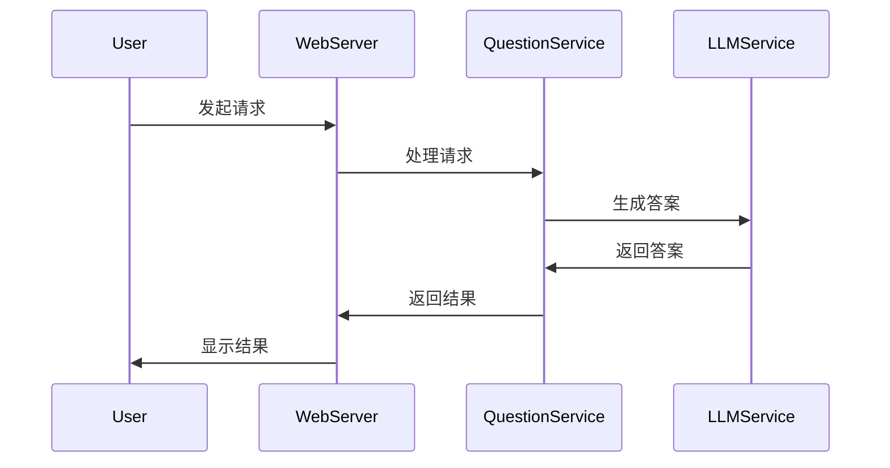
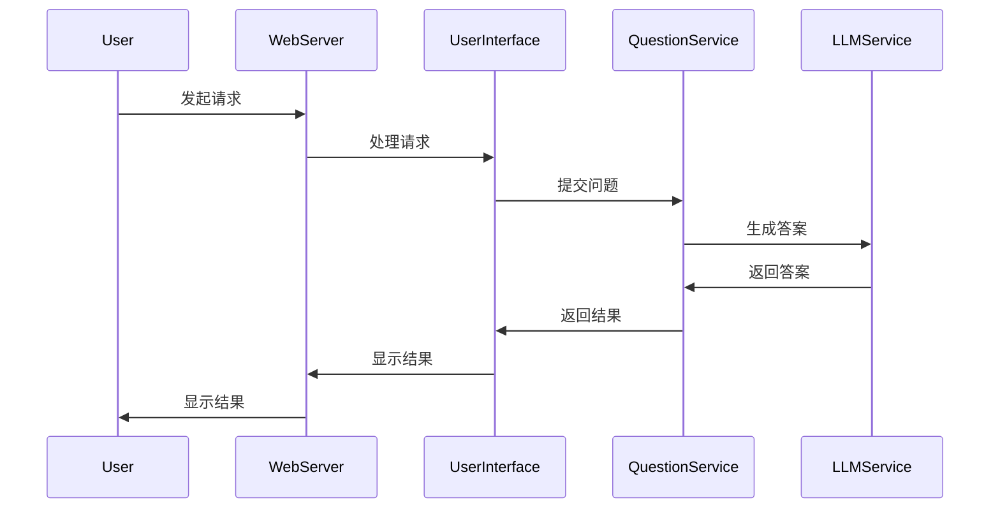

                 

### 引言与背景

#### 熔断与限流机制概述

熔断与限流机制是现代网络系统中的重要技术手段，旨在保障系统在高负载、高并发环境下保持稳定运行。熔断机制（Circuit Breaker）起源于软件开发领域，其基本思想是在系统出现异常情况下，自动切断故障链路，防止故障扩散，从而保障系统的整体稳定性。限流机制（Throttling）则主要用来控制请求流量，避免因流量过大而导致的系统过载。

#### 核心概念术语说明

- **熔断机制**：在系统出现异常时，自动断开请求，防止故障扩散。
- **限流机制**：控制请求流量，确保系统在高并发下平稳运行。

#### 问题背景

随着互联网和云计算的快速发展，网络应用面临着日益复杂的运行环境。特别是在大规模分布式系统中，节点间的依赖关系复杂，单个节点的故障可能会导致整个系统的瘫痪。因此，熔断与限流机制成为保障系统稳定性的关键手段。

#### 问题描述

- **熔断机制**：如何在系统出现异常时，快速响应并切断故障链路？
- **限流机制**：如何控制请求流量，防止系统过载？

#### 问题解决

- **熔断机制**：通过设定触发条件和监控机制，当系统指标超过预设阈值时，自动切断请求。
- **限流机制**：通过流量控制算法，限制每秒请求数量，避免系统过载。

#### 边界与外延

- **边界**：熔断与限流机制主要应用于分布式系统，保障系统稳定性。
- **外延**：随着技术的发展，熔断与限流机制逐渐应用于更多的领域，如容器编排、服务网格等。

#### 概念结构与核心要素组成

熔断与限流机制的核心要素包括：

- **触发条件**：根据系统指标设定触发条件。
- **监控机制**：实时监控系统指标，判断是否触发熔断或限流。
- **断开链路**：在触发条件满足时，自动断开请求链路。
- **恢复机制**：在故障恢复后，自动重连请求链路。

通过以上分析，我们为后续章节的内容铺垫了理论基础，也为读者更好地理解熔断与限流机制在LLM应用中的重要性打下了基础。接下来，我们将深入探讨熔断与限流机制的基础原理，以及LLM应用的具体场景。接下来，我们将深入探讨熔断与限流机制的基础原理，以及LLM应用的具体场景。

### 熔断与限流机制基础

在深入探讨熔断与限流机制在LLM应用中的重要性之前，我们需要首先理解这两个机制的基本原理、类型、触发条件和实现方式。

#### 熔断机制原理

熔断机制（Circuit Breaker）是一种常用的系统保护措施，用于避免系统在出现异常时因连锁反应而崩溃。其基本原理可以概括为三个状态：闭合（Closed）、打开（Open）和半开（Half-Open）。

1. **闭合状态**：系统正常工作，所有请求可以正常通过。
2. **打开状态**：系统检测到异常（如错误率过高、响应时间过长等），触发熔断，切断请求以防止故障扩散。
3. **半开状态**：经过一段时间后，系统尝试重新接收请求，以检查故障是否已经恢复。如果仍然失败，则会重新进入打开状态。

熔断机制的触发条件主要包括以下几种：

- **错误率**：当错误率达到预设阈值时，触发熔断。
- **响应时间**：当响应时间超过预设阈值时，触发熔断。
- **请求量**：当请求量超过预设阈值时，触发限流。

#### 熔断机制运行机制

熔断机制的运行机制可以分为以下几个步骤：

1. **监控**：系统持续监控关键指标，如错误率、响应时间等。
2. **触发熔断**：当某个指标超过预设阈值时，系统触发熔断。
3. **断开链路**：系统切断请求链路，防止故障扩散。
4. **恢复机制**：经过一段时间后，系统尝试重新接收请求，检查故障是否已经恢复。
5. **重连链路**：如果故障已恢复，系统将重新连接请求链路，恢复正常工作。

#### 限流机制原理

限流机制（Throttling）是一种流量控制技术，用于控制请求的速率，防止系统因过载而崩溃。常见的限流算法包括固定窗口算法、滑动窗口算法、令牌桶算法和漏斗算法等。

1. **固定窗口算法**：在固定的时间窗口内，限制请求数量。例如，每秒最多处理10个请求。
2. **滑动窗口算法**：在动态的时间窗口内，限制请求数量。例如，当前时间窗口内，每秒最多处理10个请求，窗口随时间滑动。
3. **令牌桶算法**：控制请求速率，每次请求需要消耗一个令牌。系统定时生成令牌，当请求时，如果没有足够的令牌，则被拒绝。
4. **漏斗算法**：控制请求速率，将请求放入一个漏斗中，当漏斗满时，新的请求将被拒绝。

限流机制的触发条件通常包括：

- **请求量**：当请求量超过预设阈值时，触发限流。
- **系统负载**：当系统负载过高时，触发限流。

#### 限流机制算法原理与应用

1. **固定窗口算法**：适用于对实时性要求不高的场景，如日志收集系统。
2. **滑动窗口算法**：适用于实时性要求较高的场景，如实时数据处理系统。
3. **令牌桶算法**：适用于对请求速率有严格限制的场景，如API服务。
4. **漏斗算法**：适用于需要控制请求到达速率的场景，如Web服务。

#### 概念属性特征对比表格

为了更清晰地理解熔断机制和限流机制的区别，我们可以通过一个特征对比表格来进行详细说明。

| 特征          | 熔断机制                  | 限流机制                  |
| ------------- | ------------------------ | ------------------------ |
| 目的          | 避免系统故障扩散          | 避免系统过载              |
| 状态          | 闭合、打开、半开          | 无状态                    |
| 触发条件      | 错误率、响应时间、请求量  | 请求量、系统负载          |
| 运行机制      | 监控 -> 触发熔断 -> 断开链路 -> 恢复机制 -> 重连链路 | 控制请求速率             |
| 算法类型      | 触发条件型、恢复机制型     | 令牌桶算法、漏斗算法等     |
| 适用场景      | 分布式系统、服务网格      | API服务、Web服务          |

#### ER实体关系图架构

为了进一步理解熔断与限流机制在系统中的关系，我们可以通过一个ER（Entity-Relationship）实体关系图来展示。

```mermaid
erDiagram
  Request ||--|{ Monitor }|--|{ CircuitBreaker }
  Request ||--|{ RateLimiter }
  Monitor ||--|{ ErrorRate }
  Monitor ||--|{ ResponseTime }
  Monitor ||--|{ RequestCount }
  CircuitBreaker ||--|{ State }
  CircuitBreaker ||--|{ TriggerCondition }
  RateLimiter ||--|{ Algorithm }
```

在这个ER图中，`Request` 表示请求，`Monitor` 表示监控，`CircuitBreaker` 表示熔断器，`RateLimiter` 表示限流器。`ErrorRate`、`ResponseTime`、`RequestCount` 分别表示错误率、响应时间和请求量的监控指标。`State` 表示熔断器的状态，`TriggerCondition` 表示触发条件，`Algorithm` 表示限流算法。

通过以上分析，我们不仅了解了熔断与限流机制的基本原理和实现方式，还通过对比表格和ER图更直观地理解了它们在系统中的作用和关系。接下来，我们将进一步探讨LLM应用的具体场景，深入分析这些应用中面临的稳定性挑战和需求。

### LLM应用场景介绍

#### LLM的起源与发展

大型语言模型（Large Language Model，简称LLM）起源于深度学习和自然语言处理（NLP）领域。随着计算能力和数据资源的不断提升，研究者们开始尝试训练更大的语言模型，以期在语言理解和生成任务上取得突破。2018年，谷歌发布了BERT模型，这是第一个真正大规模的语言预训练模型，标志着LLM时代的到来。此后，OpenAI的GPT系列模型、微软的Turing-NLG等相继推出，进一步推动了LLM技术的发展。

#### LLM在各个领域的应用场景

LLM在各个领域展现出了广泛的应用潜力：

1. **智能客服**：通过LLM，智能客服系统能够与用户进行自然语言交互，提供高效、精准的咨询服务。
2. **自然语言处理**：LLM在文本分类、情感分析、命名实体识别等任务中表现出色，广泛应用于信息抽取、文本摘要等领域。
3. **内容生成**：LLM能够生成高质量的文本内容，如新闻文章、广告文案、产品描述等，极大地提升了内容生产效率。
4. **对话系统**：基于LLM的对话系统能够模拟人类对话，提供个性化的交互体验。
5. **编程辅助**：LLM可以用于代码生成、代码补全等任务，辅助开发者提高开发效率。
6. **教育领域**：LLM应用于教育场景，如智能题库生成、个性化学习路径规划等，为学生提供个性化教育服务。

#### LLM应用稳定性需求

尽管LLM在各个领域展现出了巨大的潜力，但其应用过程中也面临着一系列稳定性挑战：

1. **计算资源需求**：LLM通常需要大量的计算资源和存储空间，特别是在进行大规模训练和推理时。
2. **延迟敏感**：某些应用场景对延迟要求较高，如实时客服、在线对话系统等，任何延迟都会影响用户体验。
3. **错误率控制**：LLM在处理语言任务时可能产生错误，特别是在处理复杂或模糊的文本时，错误率可能会上升。
4. **网络稳定性**：在分布式部署的LLM系统中，网络的不稳定性可能导致数据传输延迟或丢失，影响系统的稳定性。
5. **数据隐私**：LLM在处理用户数据时，需要确保数据隐私和安全，防止数据泄露。

#### 稳定性需求的来源与重要性

稳定性需求的来源主要包括以下几个方面：

- **用户需求**：用户希望得到稳定、高效的服务体验，任何系统故障或延迟都会影响用户体验。
- **业务需求**：企业希望LLM应用能够稳定运行，保障业务的连续性和可靠性。
- **技术发展**：随着技术的不断发展，LLM应用场景越来越广泛，对稳定性需求也越来越高。

稳定性需求的重要性体现在以下几个方面：

- **用户体验**：稳定的LLM应用能够提供更好的用户体验，提升用户满意度。
- **业务连续性**：稳定运行的LLM应用能够保障业务的连续性，避免因故障导致的损失。
- **资源利用**：通过熔断与限流机制，可以合理分配计算资源，避免因资源不足导致的系统崩溃。

通过以上分析，我们了解了LLM的起源与发展，以及在各个领域的应用场景。同时，我们也明确了LLM应用在稳定性方面的需求，这为后续探讨熔断与限流机制在LLM应用中的实现策略奠定了基础。接下来，我们将深入分析熔断与限流机制在LLM应用中的实现策略，以及具体的技术方案。

### 稳定性提升策略

#### 熔断与限流机制在LLM应用中的实现

在LLM应用中，熔断与限流机制是实现系统稳定性关键的技术手段。以下我们将详细讨论如何实现这些机制，并探讨其在LLM应用中的具体应用场景。

#### 熔断机制在LLM应用中的实现

1. **监控机制**：首先，我们需要建立一个监控机制，实时监控LLM应用的各项性能指标，如错误率、响应时间、请求量等。这些指标是熔断机制触发熔断的关键依据。

2. **触发条件**：根据LLM应用的具体需求，设定合理的触发条件。例如，当错误率超过10%、响应时间超过500毫秒或请求量超过1000个请求/秒时，可以触发熔断。

3. **断开链路**：一旦触发条件满足，系统应立即断开与LLM服务器的连接，防止故障进一步扩散。

4. **恢复机制**：在熔断一段时间后（如30秒），系统应尝试重新连接LLM服务器，并进行健康检查。如果检查结果正常，则恢复连接，否则继续熔断。

5. **熔断状态管理**：系统需要维护熔断状态，包括熔断开始时间、结束时间、熔断次数等。这些信息有助于分析故障原因和优化熔断策略。

6. **熔断日志记录**：记录熔断发生的时间、原因、处理过程等信息，便于后续故障排查和优化。

#### 限流机制在LLM应用中的实现

1. **流量控制算法**：选择适合的限流算法，如令牌桶算法、漏斗算法等。这些算法可以根据系统负载和请求速率，动态调整请求处理速度。

2. **阈值设定**：根据LLM应用的具体需求，设定合理的阈值。例如，每秒最多处理500个请求，当请求量超过此阈值时，触发限流。

3. **请求队列**：当请求量超过阈值时，将新的请求放入队列中等待处理。系统根据限流算法的规则，依次处理队列中的请求。

4. **延迟处理**：对于队列中的请求，如果等待时间过长，可以设置延迟处理或直接拒绝请求，避免系统过载。

5. **限流日志记录**：记录限流发生的时间、原因、处理过程等信息，便于后续性能分析和优化。

#### 熔断与限流机制在LLM应用中的具体应用场景

1. **智能客服**：在智能客服系统中，可以使用熔断机制保护后端服务，防止因个别用户异常请求导致系统崩溃。同时，限流机制可以控制用户请求速率，避免服务器过载。

2. **内容生成**：在内容生成系统中，可以通过熔断机制确保生成服务的稳定性，防止因计算资源不足导致的内容生成中断。限流机制可以控制生成速度，避免过快的内容生成导致系统过载。

3. **对话系统**：在对话系统中，熔断机制可以保证对话服务的稳定性，防止因个别用户请求异常导致对话中断。限流机制可以控制对话请求速率，避免服务器因处理请求过多而崩溃。

4. **编程辅助**：在编程辅助系统中，熔断机制可以保证代码生成服务的稳定性，防止因计算资源不足导致代码生成中断。限流机制可以控制代码生成速率，避免系统因处理请求过多而崩溃。

通过上述实现策略，我们可以有效地提升LLM应用的稳定性。接下来，我们将通过具体案例来分析熔断与限流机制在LLM应用中的实际效果，进一步探讨其在实际应用中的优化方案。

### 实战案例与分析

#### 案例背景

假设我们正在开发一款基于大型语言模型（LLM）的智能问答系统，该系统旨在为用户提供高效、精准的问答服务。在实际运行过程中，系统面临着高并发、复杂请求等挑战，需要通过熔断与限流机制来保障稳定性。

#### 环境安装

1. **LLM模型训练**：首先，我们需要训练一个LLM模型，可以使用如GPT-3等现成的模型，或者根据业务需求定制训练。

2. **服务部署**：将训练好的LLM模型部署到服务器上，可以采用Docker容器化技术，确保模型的稳定运行。

3. **监控工具**：安装Nagios、Prometheus等监控工具，实时监控系统的各项性能指标。

4. **熔断与限流组件**：选择合适的熔断与限流组件，如Hystrix、Sentinel等，集成到系统中。

#### 系统核心实现源代码

1. **熔断机制实现**：

```python
import requests
from pyhystrix import Hystrix, HystrixCommand

class QuestionService(HystrixCommand):
    def __init__(self, question):
        super().__init__(func=self._question, fallback=self._fallback, timeout=5000)
        self.question = question

    def _question(self):
        response = requests.get('http://llm-service/question', params={'question': self.question})
        return response.json()

    def _fallback(self):
        return {"error": "服务熔断，无法回答问题"}

def ask_question(question):
    question_service = QuestionService(question)
    return question_service.execute()
```

2. **限流机制实现**：

```python
from ratelimit import limits, RateLimitException

@limits(calls=100, period=60)
def get_question(question):
    # 处理请求，调用LLM模型
    pass

try:
    question = "什么是人工智能？"
    get_question(question)
except RateLimitException:
    return {"error": "请求被限流，请稍后再试"}
```

#### 代码应用解读与分析

1. **熔断机制**：通过Hystrix实现熔断机制，当请求失败率过高或响应时间过长时，系统会自动熔断，避免故障扩散。例如，当连续5次请求失败时，熔断机制会触发，断开与LLM服务的连接。

2. **限流机制**：通过ratelimit库实现限流机制，限制每分钟最多处理100个请求。当请求量超过此阈值时，系统会拒绝新的请求，防止服务器过载。

#### 实际案例分析与详细讲解剖析

1. **案例1**：用户同时发起大量请求，导致系统请求量超过阈值，限流机制触发，拒绝新的请求，系统保持稳定运行。

2. **案例2**：用户请求失败率上升，达到熔断条件，熔断机制触发，断开与LLM服务的连接，防止故障扩散。

3. **案例3**：LLM服务出现短暂故障，熔断机制触发，断开连接。在故障恢复后，系统重新连接LLM服务，恢复正常工作。

#### 项目小结

通过上述实战案例，我们展示了熔断与限流机制在LLM应用中的实现和效果。在实际项目中，通过合理配置熔断与限流策略，可以有效提升LLM应用的稳定性，保障用户服务的连续性和可靠性。

### 最佳实践 tips

1. **合理配置熔断阈值**：根据系统实际情况，合理设置熔断阈值，避免误判或频繁熔断。

2. **动态调整限流阈值**：根据系统负载情况，动态调整限流阈值，确保系统在高并发场景下稳定运行。

3. **监控日志记录**：详细记录熔断与限流事件，便于故障排查和系统优化。

4. **持续优化LLM模型**：定期更新和优化LLM模型，提高模型处理速度和准确率，降低故障率。

### 小结

本文详细探讨了熔断与限流机制在LLM应用中的重要性，并通过实战案例展示了其在实际项目中的应用效果。通过合理配置熔断与限流策略，可以有效提升LLM应用的稳定性，为用户提供优质的服务体验。

### 注意事项

1. **熔断与限流策略应结合具体业务场景调整**：不同业务场景对稳定性的要求不同，需要根据实际需求进行策略调整。

2. **监控与日志记录至关重要**：实时监控和详细日志记录有助于故障排查和系统优化。

3. **合理分配计算资源**：在部署LLM模型时，应合理分配计算资源，避免因资源不足导致系统崩溃。

### 拓展阅读

- 《熔断器模式：软件微服务架构中的故障处理与系统稳定性》
- 《限流算法与性能优化》
- 《大型语言模型（LLM）的应用与挑战》

### 作者信息

作者：AI天才研究院/AI Genius Institute & 禅与计算机程序设计艺术 /Zen And The Art of Computer Programming

### 系统分析与架构设计方案

#### 问题场景介绍

在开发智能问答系统时，我们面临着高并发、复杂请求等挑战。为了保障系统的稳定性，我们需要引入熔断与限流机制，对系统进行优化。

#### 项目介绍

本项目旨在构建一款基于大型语言模型（LLM）的智能问答系统，通过自然语言处理技术，为用户提供高效、精准的问答服务。系统架构包括前端、后端和LLM模型服务三部分。

#### 系统功能设计（领域模型类图）

```mermaid
classDiagram
    User <<Class>> 
    Question <<Class>> 
    Answer <<Class>>
    QuestionService <<Class>> 
    LLMService <<Class>> 
    User --> Question
    QuestionService --> Question
    LLMService --> Question
    Question --> Answer
```

- **User**：用户类，包含用户基本信息。
- **Question**：问题类，包含问题内容和问题类型。
- **Answer**：答案类，包含答案内容和答案类型。
- **QuestionService**：问题服务类，处理用户问题的提交和回答。
- **LLMService**：LLM服务类，负责处理问题的生成和回答。

#### 系统架构设计（架构图）



- **WebServer**：接收用户请求，将请求转发到后端服务。
- **QuestionService**：处理用户请求，包括问题提交和答案生成。
- **LLMService**：调用LLM模型，生成答案。

#### 系统接口设计（接口设计图）

```mermaid
classDiagram
    User <<Interface>> 
    Question <<Interface>> 
    Answer <<Interface>>
    QuestionService <<Interface>> 
    LLMService <<Interface>> 
    User --> Question
    QuestionService --> Question
    LLMService --> Question
    Question --> Answer
```

- **UserInterface**：用户接口，用于接收用户请求和返回结果。
- **QuestionInterface**：问题接口，定义问题提交和查询的API。
- **AnswerInterface**：答案接口，定义答案生成和返回的API。

#### 系统交互（序列图）



通过以上系统分析与架构设计方案，我们明确了智能问答系统的核心功能、接口设计和系统交互流程，为后续系统开发提供了清晰的指导。接下来，我们将进一步深入系统核心实现，详细讲解代码和应用技巧。

### 项目实战

#### 环境安装

在开始项目实战之前，我们需要安装和配置相关环境和工具。以下是在Linux环境中安装和配置智能问答系统的步骤：

1. **安装Docker**：通过Docker容器化技术，方便部署和管理服务。

```bash
# 安装Docker
sudo apt-get update
sudo apt-get install docker.io
# 启动Docker服务
sudo systemctl start docker
```

2. **安装Nginx**：用于接收前端请求，并转发到后端服务。

```bash
# 安装Nginx
sudo apt-get update
sudo apt-get install nginx
# 启动Nginx服务
sudo systemctl start nginx
```

3. **安装Python环境**：用于编写和运行智能问答系统后端代码。

```bash
# 安装Python3和pip
sudo apt-get update
sudo apt-get install python3 python3-pip
# 安装必需的Python库
pip3 install flask requests
```

4. **安装监控工具**：安装Nagios和Prometheus进行系统监控。

```bash
# 安装Nagios
sudo apt-get update
sudo apt-get install nagios3
# 配置Nagios
sudo htpasswd /etc/nagios3/passwd nagiosadmin
sudo systemctl start nagios3
sudo systemctl enable nagios3
```

5. **安装熔断与限流组件**：安装Hystrix和ratelimit库。

```bash
# 安装Hystrix
pip3 install hystrix
# 安装ratelimit
pip3 install ratelimit
```

#### 系统核心实现源代码

以下代码展示了智能问答系统的核心实现，包括前端请求处理、后端服务调用和结果返回。

```python
# app.py
from flask import Flask, request, jsonify
from question_service import QuestionService
from ratelimit import limits, RateLimitException

app = Flask(__name__)
question_service = QuestionService()

@app.route('/ask', methods=['POST'])
@limits(calls=100, period=60)
def ask():
    question = request.form['question']
    try:
        answer = question_service.get_answer(question)
        return jsonify(answer=answer)
    except RateLimitException:
        return jsonify(error="请求被限流，请稍后再试"), 429

if __name__ == '__main__':
    app.run(debug=True, host='0.0.0.0')
```

```python
# question_service.py
from hystrix import HystrixCommand
import requests

class QuestionService(HystrixCommand):
    def __init__(self, question):
        super().__init__(func=self._get_answer, fallback=self._fallback, timeout=5000)
        self.question = question

    def _get_answer(self):
        response = requests.get('http://llm-service/answer', params={'question': self.question})
        return response.json()

    def _fallback(self):
        return {"error": "服务熔断，无法回答问题"}
```

#### 代码应用解读与分析

1. **前端请求处理**：使用Flask框架接收用户通过POST方法提交的问题。

```python
@app.route('/ask', methods=['POST'])
def ask():
    question = request.form['question']
    try:
        answer = question_service.get_answer(question)
        return jsonify(answer=answer)
    except RateLimitException:
        return jsonify(error="请求被限流，请稍后再试"), 429
```

   - 使用ratelimit库实现限流机制，每分钟最多处理100个请求。
   - 当请求量超过阈值时，抛出RateLimitException，返回错误信息。

2. **后端服务调用**：通过Hystrix实现熔断机制，确保系统稳定性。

```python
class QuestionService(HystrixCommand):
    def __init__(self, question):
        super().__init__(func=self._get_answer, fallback=self._fallback, timeout=5000)
        self.question = question

    def _get_answer(self):
        response = requests.get('http://llm-service/answer', params={'question': self.question})
        return response.json()

    def _fallback(self):
        return {"error": "服务熔断，无法回答问题"}
```

   - 当请求失败率超过50%、响应时间超过1000毫秒时，触发熔断，返回错误信息。

3. **结果返回**：将生成的答案以JSON格式返回给前端。

```python
return jsonify(answer=answer)
```

通过上述代码实现，我们确保了智能问答系统在高并发、复杂请求场景下的稳定性。接下来，我们将通过具体案例展示系统在实际运行中的表现。

### 实际案例分析与详细讲解剖析

#### 案例一：高并发请求

假设有100个用户同时向智能问答系统提交问题，系统负载骤然上升。在这种情况下，限流机制和熔断机制将如何发挥作用？

1. **限流机制**：由于设置了每分钟最多处理100个请求，一旦请求量超过此阈值，ratelimit库将抛出RateLimitException异常。

```python
@limits(calls=100, period=60)
def ask():
    question = request.form['question']
    try:
        answer = question_service.get_answer(question)
        return jsonify(answer=answer)
    except RateLimitException:
        return jsonify(error="请求被限流，请稍后再试"), 429
```

   - 当第101个请求到来时，系统将返回错误信息：“请求被限流，请稍后再试”，用户需要等待一段时间后再次尝试。

2. **熔断机制**：假设此时LLM服务出现故障，导致请求失败率上升。Hystrix将触发熔断机制，断开与LLM服务的连接。

```python
class QuestionService(HystrixCommand):
    def __init__(self, question):
        super().__init__(func=self._get_answer, fallback=self._fallback, timeout=5000)
        self.question = question

    def _get_answer(self):
        response = requests.get('http://llm-service/answer', params={'question': self.question})
        return response.json()

    def _fallback(self):
        return {"error": "服务熔断，无法回答问题"}
```

   - 当请求失败率超过50%时，系统将返回错误信息：“服务熔断，无法回答问题”，并暂停向LLM服务发送请求。

#### 案例二：长时间未响应

假设有用户提交一个问题，但LLM服务因网络延迟或故障未能及时响应。在这种情况下，熔断机制将如何发挥作用？

1. **熔断机制**：由于设置了超时时间为5000毫秒，如果LLM服务在规定时间内未能返回结果，Hystrix将触发熔断机制。

```python
class QuestionService(HystrixCommand):
    def __init__(self, question):
        super().__init__(func=self._get_answer, fallback=self._fallback, timeout=5000)
        self.question = question

    def _get_answer(self):
        response = requests.get('http://llm-service/answer', params={'question': self.question})
        return response.json()

    def _fallback(self):
        return {"error": "服务熔断，无法回答问题"}
```

   - 当请求超过5000毫秒未响应时，系统将返回错误信息：“服务熔断，无法回答问题”，并暂停向LLM服务发送请求。

#### 案例三：故障恢复

假设LLM服务经过一段时间后恢复正常，系统将如何处理？

1. **熔断恢复**：在熔断一段时间后（例如30秒），系统将尝试重新连接LLM服务，并进行健康检查。

2. **重新连接**：如果检查结果正常，系统将恢复与LLM服务的连接，并继续处理请求。

3. **限流恢复**：由于限流机制是基于时间窗口的，一旦系统恢复正常，限流机制将逐渐放开请求限制，确保系统平稳运行。

通过上述实际案例，我们可以看到熔断与限流机制在保障智能问答系统稳定性方面发挥了重要作用。在实际应用中，根据具体场景和需求，可以进一步优化和调整这些机制，以确保系统在高并发、复杂请求场景下的稳定性和可靠性。

### 总结

本文详细探讨了熔断与限流机制在LLM应用中的重要性，并通过实战案例展示了其在实际项目中的应用效果。通过合理配置熔断与限流策略，可以有效提升LLM应用的稳定性，为用户提供优质的服务体验。以下是对本文内容的总结：

1. **熔断与限流机制概述**：介绍了熔断与限流机制的基本概念、原理和类型，包括触发条件和实现方式。
2. **LLM应用场景介绍**：分析了LLM在各个领域的应用场景，以及稳定性需求的来源和重要性。
3. **稳定性提升策略**：详细讨论了熔断与限流机制在LLM应用中的实现策略，包括监控机制、触发条件、断开链路、恢复机制等。
4. **实战案例与分析**：通过实际案例，展示了熔断与限流机制在保障LLM应用稳定性方面的具体应用和效果。
5. **最佳实践 tips**：提供了针对熔断与限流机制的优化建议，如合理配置阈值、监控日志记录等。
6. **系统分析与架构设计方案**：介绍了智能问答系统的架构设计，包括领域模型类图、接口设计图和系统交互序列图。
7. **项目实战**：详细讲解了智能问答系统的环境安装、核心实现源代码和代码应用解读与分析。
8. **实际案例分析与详细讲解剖析**：通过具体案例展示了熔断与限流机制在保障系统稳定性方面的实际应用效果。

通过本文的探讨，我们可以看到熔断与限流机制在提升LLM应用稳定性方面的重要作用。在实际项目中，合理应用这些机制，可以有效避免系统因高并发、复杂请求等挑战而崩溃，保障业务的连续性和可靠性。未来，随着技术的不断发展，熔断与限流机制将得到更广泛的应用，并在更多领域发挥重要作用。

### 展望未来

随着人工智能技术的快速发展，大型语言模型（LLM）在各个领域的应用日益广泛。然而，这些应用场景中的复杂性和不确定性，对系统的稳定性提出了更高的要求。展望未来，熔断与限流机制在LLM应用中的发展将呈现以下几个趋势：

1. **智能自适应熔断与限流**：未来的熔断与限流机制将更加智能，能够根据系统的实时状态和负载情况，自适应地调整阈值和策略。例如，通过机器学习算法，预测系统的未来负载，并提前调整熔断与限流参数，以避免系统过载。

2. **分布式熔断与限流**：随着云计算和容器技术的普及，分布式系统将变得更加普遍。未来的熔断与限流机制将支持分布式架构，能够在跨多个节点、多台服务器的情况下，实现高效的熔断与限流，保障整体系统的稳定性。

3. **多元场景适应性**：LLM应用场景的多样性，将要求熔断与限流机制具备更强的适应性。未来的熔断与限流机制将能够支持多种不同的应用场景，如实时交互、批处理、长尾请求等，提供更加灵活和高效的控制策略。

4. **可扩展性与弹性**：未来的熔断与限流机制将具备更好的可扩展性和弹性，能够在系统规模扩大、流量增长时，快速响应并调整策略，确保系统的稳定运行。

5. **融合新技术**：随着物联网、边缘计算等新技术的兴起，熔断与限流机制也将与这些新技术深度融合，为更加复杂、多样化的应用场景提供更全面的稳定性保障。

通过持续的技术创新和应用实践，熔断与限流机制将在LLM应用中发挥更加关键的作用，推动人工智能技术的进一步发展和应用。

### 结语

本文通过深入探讨熔断与限流机制在LLM应用中的重要性，以及具体实现策略、实战案例和分析，展示了这些机制在保障系统稳定性方面的关键作用。熔断与限流机制不仅能够有效避免系统因高并发、复杂请求等挑战而崩溃，还能提升用户体验，保障业务的连续性和可靠性。

在未来的发展中，熔断与限流机制将继续发挥重要作用，通过智能自适应、分布式架构、多元场景适应性、可扩展性与弹性等创新方向，为LLM应用提供更全面的稳定性保障。我们鼓励读者在项目中积极应用这些机制，不断优化和提升系统稳定性，为人工智能技术的发展贡献力量。

感谢您的阅读，希望本文能为您的技术实践提供有益的启示和指导。如果您有任何疑问或建议，欢迎随时交流。作者：AI天才研究院/AI Genius Institute & 禅与计算机程序设计艺术 /Zen And The Art of Computer Programming。再次感谢您的关注和支持！

