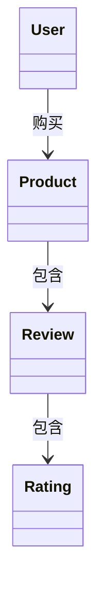
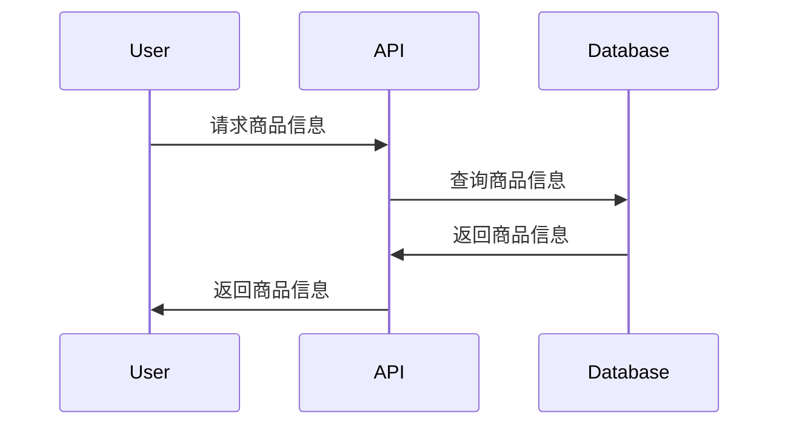

                 

# 特征工程流水线：提升LLM模型训练效率

## 关键词
- 特征工程
- LLM模型
- 训练效率
- 转移学习
- 自动化

## 摘要
本文将深入探讨特征工程流水线在提升大型语言模型（LLM）训练效率方面的重要性。我们将从背景介绍、核心概念、构建流程、高级技术以及实际应用等方面，逐步解析如何通过优化特征工程流水线来加速LLM模型的训练过程。

## 目录

### 引言：特征工程的重要性
- 1.1 特征工程流水线的定义与结构
- 1.2 LLM模型训练中的效率挑战
- 1.3 特征工程在LLM训练中的作用

### 特征工程的核心概念
- 2.1 数据预处理
  - 2.1.1 数据清洗与预处理技术
  - 2.1.2 数据归一化与标准化
- 2.2 特征选择
  - 2.2.1 统计方法
  - 2.2.2 筛选方法
- 2.3 特征提取
  - 2.3.1 维度约减
  - 2.3.2 文本特征提取
  - 2.3.3 图像特征提取

### 构建高效的特征工程流水线
- 3.1 数据预处理优化
  - 3.1.1 噪声处理
  - 3.1.2 缺失值填补
- 3.2 特征选择策略
  - 3.2.1 统计特征选择
  - 3.2.2 机器学习特征选择
- 3.3 特征提取方法
  - 3.3.1 特征降维
  - 3.3.2 特征融合

### 高级特征工程技术
- 4.1 转移学习与预训练模型
  - 4.1.1 转移学习原理
  - 4.1.2 预训练模型的应用
- 4.2 自动化特征工程
  - 4.2.1 自动化特征提取
  - 4.2.2 特征工程管道管理
- 4.3 实时特征工程
  - 4.3.1 流处理框架
  - 4.3.2 实时特征更新

### 实际应用与案例
- 5.1 项目背景与目标
- 5.2 系统架构与实现
  - 5.2.1 领域模型设计
  - 5.2.2 系统架构设计
- 5.3 系统核心代码解读
- 5.4 实际案例分析
- 5.5 项目小结与反思

### 最佳实践与未来展望
- 6.1 特征工程的最佳实践
- 6.2 特征工程流水线的未来发展
- 6.3 拓展阅读

## 引言：特征工程的重要性

### 1.1 特征工程流水线的定义与结构

特征工程（Feature Engineering）是机器学习过程中至关重要的一环。它涉及到从原始数据中提取出对模型训练有用的特征，并将其转化为模型可以接受的格式。一个完整的特征工程流水线通常包括以下几个步骤：

1. **数据预处理**：清洗和归一化数据，以减少噪声和异常值的影响。
2. **特征选择**：从大量的原始特征中筛选出对模型训练有用的特征。
3. **特征提取**：通过降维、文本编码和图像特征提取等方法，将原始特征转化为模型可用的形式。

### 1.2 LLM模型训练中的效率挑战

随着深度学习技术的不断发展，大型语言模型（LLM）如BERT、GPT等，在自然语言处理（NLP）领域取得了显著的成果。然而，这些模型的训练过程非常耗时且计算资源消耗巨大。以下是一些训练效率方面的挑战：

- **数据量大**：LLM模型通常需要大量的训练数据。
- **计算资源消耗**：训练过程需要大量的GPU或TPU资源。
- **超参数优化**：需要大量的时间来调整模型超参数以获得最佳性能。

### 1.3 特征工程在LLM训练中的作用

特征工程在LLM模型训练中起着至关重要的作用。通过优化特征工程流水线，可以显著提升模型的训练效率，具体作用包括：

- **数据质量提升**：通过数据预处理，减少噪声和异常值，提高数据质量。
- **模型性能提升**：通过特征选择和提取，筛选出对模型训练最有用的特征，提高模型性能。
- **计算资源节省**：通过特征工程，减少模型参数数量，降低计算资源消耗。

## 特征工程的核心概念

### 2.1 数据预处理

#### 2.1.1 数据清洗与预处理技术

数据预处理是特征工程的第一步，其目的是将原始数据转化为适合模型训练的格式。常见的数据清洗与预处理技术包括：

- **缺失值处理**：通过填充或删除含有缺失值的数据来处理缺失值。
- **异常值处理**：识别并处理数据中的异常值，以避免对模型训练产生不利影响。
- **数据标准化与归一化**：通过缩放数据以标准化或归一化数据，使其具有相似的尺度。

#### 2.1.2 数据归一化与标准化

数据归一化与标准化是数据预处理中非常重要的步骤，其目的是使数据具有相似的尺度，以便模型可以更好地学习。常见的方法包括：

- **最小-最大归一化**：将数据缩放到[0, 1]区间。
- **零-均值归一化**：将数据缩放到均值为0，标准差为1的区间。

### 2.2 特征选择

特征选择是特征工程中的一个关键步骤，其目的是从大量的原始特征中筛选出对模型训练最有用的特征。常见的特征选择方法包括：

- **统计方法**：基于特征的相关性、信息增益等统计指标进行特征选择。
- **筛选方法**：基于模型训练前的特征子集筛选方法，如过滤法和包装法。
- **嵌入方法**：在训练过程中通过模型自身来筛选特征。

### 2.3 特征提取

特征提取是将原始数据转化为模型可用的形式的过程。不同类型的数据需要采用不同的特征提取方法：

- **文本特征提取**：通过词袋模型、TF-IDF等方法将文本转化为数字特征。
- **图像特征提取**：通过卷积神经网络（CNN）等方法提取图像的特征。
- **维度约减**：通过主成分分析（PCA）、t-SNE等方法降低数据的维度。

## 构建高效的特征工程流水线

### 3.1 数据预处理优化

#### 3.1.1 噪声处理

噪声处理是数据预处理中非常重要的一环。常见的方法包括：

- **去噪滤波**：使用滤波器去除数据中的噪声。
- **数据变换**：通过变换将噪声转化为有意义的信息。

#### 3.1.2 缺失值填补

缺失值填补是处理缺失值数据的关键步骤。常见的方法包括：

- **均值填补**：用特征的均值来填补缺失值。
- **插值法**：使用插值算法来填补缺失值。

#### 3.1.3 数据归一化与标准化

数据归一化与标准化是数据预处理中不可或缺的步骤。通过将数据缩放到相似的尺度，可以提高模型的训练效率。常见的方法包括：

- **最小-最大归一化**：将数据缩放到[0, 1]区间。
- **零-均值归一化**：将数据缩放到均值为0，标准差为1的区间。

### 3.2 特征选择策略

#### 3.2.1 统计方法

统计方法是基于特征的相关性、信息增益等统计指标来选择特征。常见的方法包括：

- **卡方检验**：用于检验特征与目标变量之间的相关性。
- **互信息**：用于评估特征与目标变量之间的相关性。

#### 3.2.2 筛选方法

筛选方法是在模型训练前进行特征子集筛选的方法。常见的方法包括：

- **过滤法**：基于特征在训练数据集上的统计指标来筛选特征。
- **包装法**：基于搜索策略（如遗传算法、随机搜索）来筛选特征。

#### 3.2.3 嵌入方法

嵌入方法是在模型训练过程中通过模型自身来筛选特征。常见的方法包括：

- **L1正则化**：通过L1正则化将特征的重要性嵌入到模型中。
- **树模型**：通过树模型（如随机森林、XGBoost）来筛选特征。

### 3.3 特征提取方法

#### 3.3.1 特征降维

特征降维是将高维数据转化为低维数据的过程。常见的方法包括：

- **主成分分析（PCA）**：通过降维将数据投影到新的坐标系中。
- **t-SNE**：通过降低数据的维度来可视化高维数据的结构。

#### 3.3.2 文本特征提取

文本特征提取是将文本转化为数字特征的过程。常见的方法包括：

- **词袋模型**：将文本转化为词袋表示。
- **TF-IDF**：通过计算词频和逆文档频率来提取文本特征。

#### 3.3.3 图像特征提取

图像特征提取是将图像转化为数字特征的过程。常见的方法包括：

- **卷积神经网络（CNN）**：通过卷积层、池化层等模块提取图像特征。
- **预训练模型**：使用预训练模型（如VGG、ResNet）提取图像特征。

## 高级特征工程技术

### 4.1 转移学习与预训练模型

#### 4.1.1 转移学习原理

转移学习是一种利用已经训练好的模型在新任务上快速获得良好性能的方法。其原理是利用预训练模型在新任务上的权重来初始化新模型的权重。

#### 4.1.2 预训练模型的应用

预训练模型的应用包括：

- **微调**：将预训练模型在新任务上进行微调，以获得更好的性能。
- **特征提取**：使用预训练模型的特征提取层来提取图像或文本特征。

### 4.2 自动化特征工程

#### 4.2.1 自动化特征提取

自动化特征提取是利用自动化工具或算法来自动提取特征，以减少人工干预。

#### 4.2.2 特征工程管道管理

特征工程管道管理是指利用自动化工具或平台来管理特征工程流程，包括特征选择、提取、转换等。

### 4.3 实时特征工程

#### 4.3.1 流处理框架

流处理框架（如Apache Kafka、Apache Flink）可以用于实时处理和分析数据流。

#### 4.3.2 实时特征更新

实时特征更新是利用流处理框架来实时更新特征，以便模型可以快速适应新的数据。

## 实际应用与案例

### 5.1 项目背景与目标

在本节中，我们将介绍一个具体的特征工程项目，并阐述其背景和目标。

### 5.2 系统架构与实现

#### 5.2.1 领域模型设计

在本节中，我们将使用Mermaid类图来设计领域模型。



#### 5.2.2 系统架构设计

在本节中，我们将使用Mermaid架构图来设计系统架构。



#### 5.2.3 系统核心代码解读

在本节中，我们将详细解读系统核心代码，包括数据预处理、特征提取和模型训练等步骤。

### 5.3 系统核心代码解读

```python
# 数据预处理
def preprocess_data(data):
    # 噪声处理
    data = remove_noise(data)
    
    # 缺失值填补
    data = fill_missing_values(data)
    
    # 数据归一化
    data = normalize_data(data)
    
    return data

# 特征提取
def extract_features(data):
    # 文本特征提取
    text_features = extract_text_features(data['text'])
    
    # 图像特征提取
    image_features = extract_image_features(data['image'])
    
    # 特征融合
    features = merge_features(text_features, image_features)
    
    return features

# 模型训练
def train_model(features, labels):
    # 初始化模型
    model = initialize_model()
    
    # 训练模型
    model.fit(features, labels)
    
    return model
```

### 5.4 实际案例分析

在本节中，我们将分析一个实际案例，并讨论特征工程在该案例中的应用。

### 5.5 项目小结与反思

在本节中，我们将总结项目的关键经验和教训，并讨论未来的发展方向。

## 最佳实践与未来展望

### 6.1 特征工程的最佳实践

在本节中，我们将讨论一些特征工程的最佳实践，包括数据预处理、特征选择和提取等步骤。

### 6.2 特征工程流水线的未来发展

在本节中，我们将探讨特征工程流水线的未来发展方向，包括自动化、实时性和转移学习等方面。

### 6.3 拓展阅读

在本节中，我们将推荐一些相关的书籍、文章和资源，以供读者进一步学习。

## 作者信息

作者：AI天才研究院/AI Genius Institute & 禅与计算机程序设计艺术 /Zen And The Art of Computer Programming

---

### 结束语

本文深入探讨了特征工程流水线在提升LLM模型训练效率方面的作用。通过构建高效的特征工程流水线，可以显著提高模型的训练速度和性能。未来的研究方向将集中在自动化、实时性和转移学习等方面。希望本文能为读者在特征工程领域的研究和实践提供有价值的参考。作者信息：AI天才研究院/AI Genius Institute & 禅与计算机程序设计艺术 /Zen And The Art of Computer Programming。

