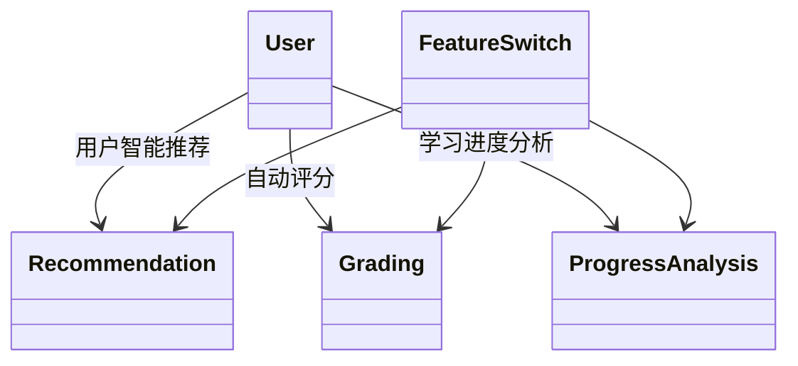

                 


## 引言

### 背景介绍

随着人工智能（AI）技术的快速发展，越来越多的企业开始将AI功能集成到其产品和服务中。然而，AI功能的发布并非易事，其中涉及诸多挑战。首先，AI功能的复杂性使得开发、测试和部署变得更加困难。其次，用户对AI功能的需求多变，要求系统能够灵活地调整和更新功能。最后，安全问题也是一大挑战，AI功能一旦发布，需要确保其稳定性和安全性。

特性开关作为一种灵活控制AI功能发布的工具，正是为了应对这些挑战而诞生的。特性开关是一种设计模式，通过它，开发者可以在不影响系统整体结构的情况下，独立地启用或禁用特定的功能。这种灵活性不仅提高了开发效率，还降低了功能发布的风险。

本文将深入探讨特性开关的核心概念、原理与实现方法，并通过实际案例展示其在AI功能发布中的应用。我们将分析特性开关在提高开发效率、降低发布风险、增强系统灵活性等方面的优势，并探讨其在不同场景下的适用性。

### 核心概念与联系

特性开关（Feature Switch）是一种设计模式，旨在提供一种机制，允许开发者在不更改代码的情况下，动态地启用或禁用系统的特定功能。特性开关的核心在于其灵活性，通过它，开发者可以在不影响系统其他部分的情况下，单独调整功能的可用性。

特性开关的主要组成部分包括：

1. **开关（Switch）**：这是控制功能开启或关闭的核心组件。开关可以是简单的布尔值，也可以是更复杂的逻辑表达式。
2. **条件（Conditions）**：条件用于决定何时启用或禁用功能。常见的条件包括用户角色、地理位置、时间等。
3. **策略（Strategy）**：策略定义了如何实现功能。在启用时，策略会调用相应的功能代码；在禁用状态下，可以执行占位操作或提供默认行为。

特性开关与AI功能的关系密切。AI功能通常涉及大量的数据和算法，且功能复杂。特性开关使得这些复杂的功能可以模块化，从而提高系统的可维护性和可扩展性。例如，在一个AI系统中，可以通过特性开关来控制某个特定算法的启用，而不必修改整个系统的代码。

以下是特性开关的核心概念对比表格：

| 核心概念   | 描述                                                         | 关联关系                                     |
| ---------- | ------------------------------------------------------------ | -------------------------------------------- |
| 开关       | 控制功能启用或关闭的核心组件。                               | 与条件、策略紧密关联，用于决定功能状态。     |
| 条件       | 决定功能何时启用或禁用的条件。                               | 与开关关联，用于确定何时触发开关。           |
| 策略       | 定义如何在功能启用或禁用状态下执行操作。                     | 与开关关联，用于实现功能的逻辑。             |
| AI功能     | 系统中的复杂功能，通常涉及大量的数据和算法。                 | 通过特性开关进行模块化控制，提高系统的灵活性。 |

为了更直观地展示特性开关的架构，我们使用Mermaid绘制了以下ER模型：

```mermaid
erDiagram
    FeatureSwitch ||--|{ Condition } Condition
    FeatureSwitch ||--|{ Strategy } Strategy
    FeatureSwitch ||--|{ AIFunction } AIFunction
    AIFunction ||--|{ FeatureUsage } FeatureUsage
    Condition ||--|{ User } User
    Condition ||--|{ Time } Time
    Condition ||--|{ Location } Location
```

在这个ER模型中，特性开关与条件、策略和AI功能之间有明确的关联。条件用于决定特性开关的状态，策略定义了特性开关的行为，而AI功能则是特性开关控制的实际目标。此外，特征使用记录了特定用户在特定时间、地点使用特定功能的情况。

通过特性开关，开发者可以灵活地控制AI功能的发布，实现按需提供功能，从而提高用户体验和系统效率。

### 算法原理讲解

特性开关的实现主要涉及以下几个关键步骤：

1. **定义特性开关**：首先，需要定义一个特性开关，它通常是一个简单的布尔变量，用于标记功能的开启或关闭状态。例如，我们可以在代码中定义一个名为`isFeatureEnabled`的布尔变量。

2. **设置条件**：条件是决定特性开关状态的依据。这些条件可以是基于用户角色、地理位置、时间等多种因素。例如，我们可能设置一个条件，只有在用户是管理员且在特定时间段内，才启用某个功能。

3. **实现策略**：策略定义了在特性开关开启或关闭时的行为。例如，当特性开关开启时，可能需要调用一个方法来执行具体的操作；当特性开关关闭时，可以提供一个默认行为或者不执行任何操作。

4. **监控与更新**：为了确保特性开关的有效性，需要对其进行监控和定期更新。这包括监控开关状态的变化，以及对条件的调整。

以下是使用Python实现特性开关的基本代码示例：

```python
# 定义特性开关
is_feature_enabled = False

# 设置条件
def check_conditions(user_role, time_of_day):
    return user_role == "admin" and time_of_day >= "09:00" and time_of_day <= "18:00"

# 实现策略
def enable_feature():
    print("Feature enabled: Data Analysis Module")

def disable_feature():
    print("Feature disabled: Default Behavior")

# 根据条件启用特性开关
if check_conditions("admin", "10:00"):
    is_feature_enabled = True

# 根据特性开关状态执行策略
if is_feature_enabled:
    enable_feature()
else:
    disable_feature()
```

在上述代码中，我们首先定义了一个布尔变量`is_feature_enabled`，然后设置了一个`check_conditions`函数来检查用户角色和时间是否符合启用条件。接着，我们定义了`enable_feature`和`disable_feature`函数来分别实现特性开关开启和关闭时的行为。

通过这个简单的示例，我们可以看到特性开关的核心原理：通过条件和策略的配合，实现灵活控制功能的状态。

特性开关的数学模型和公式可以抽象为以下形式：

$$
\text{Feature State} = \text{Condition} \cdot \text{Strategy}
$$

其中，`Feature State`表示特性开关的状态，`Condition`表示条件，`Strategy`表示策略。当条件满足时，特性开关的状态为真（即功能开启）；当条件不满足时，特性开关的状态为假（即功能关闭）。

为了使读者更直观地理解这一概念，我们可以通过一个具体的例子来说明：

假设我们有一个AI图像识别系统，其中包含一个用于人脸识别的功能。我们可以在系统中定义一个特性开关来控制这一功能。具体步骤如下：

1. **定义特性开关**：我们定义一个名为`is_face_recognition_enabled`的布尔变量。

2. **设置条件**：我们设置一个条件，只有在用户是注册用户且系统时间在早上8点到晚上10点之间时，才能启用人脸识别功能。

3. **实现策略**：当特性开关开启时，系统会调用人脸识别算法；当特性开关关闭时，系统会显示默认的欢迎界面。

4. **监控与更新**：定期检查特性开关的状态，并根据用户反馈和业务需求进行更新。

以下是该例子中的Python代码实现：

```python
# 定义特性开关
is_face_recognition_enabled = False

# 设置条件
def check_conditions(user_status, time_of_day):
    return user_status == "registered" and time_of_day >= "08:00" and time_of_day <= "22:00"

# 实现策略
def enable_face_recognition():
    print("人脸识别功能已启用。")

def disable_face_recognition():
    print("人脸识别功能已禁用。")

# 根据条件启用特性开关
user_status = "registered"
time_of_day = "09:30"
if check_conditions(user_status, time_of_day):
    is_face_recognition_enabled = True

# 根据特性开关状态执行策略
if is_face_recognition_enabled:
    enable_face_recognition()
else:
    disable_face_recognition()
```

在这个例子中，我们首先定义了`is_face_recognition_enabled`布尔变量，然后设置了`check_conditions`函数来检查用户状态和系统时间是否符合启用条件。接下来，我们定义了`enable_face_recognition`和`disable_face_recognition`函数来分别实现功能开启和关闭时的行为。

通过这个例子，我们可以清晰地看到特性开关的核心原理和具体实现步骤。特性开关为我们提供了一个灵活的机制，可以在不影响系统其他部分的情况下，独立地控制特定功能的可用性。

### 系统分析与架构设计方案

为了深入理解特性开关在AI功能发布中的应用，我们需要从系统分析与架构设计两个方面进行详细探讨。

#### 问题场景介绍

假设我们正在开发一个大型在线教育平台，其中包含多种AI功能，如智能推荐、自动评分、学习进度分析等。这些功能复杂且相互依赖，因此，在发布新功能或更新现有功能时，我们必须确保系统的稳定性和可靠性。特性开关为我们提供了一个理想的解决方案，使我们能够灵活地控制功能的发布，同时降低风险。

#### 项目介绍

本项目旨在通过特性开关技术，实现在线教育平台AI功能的灵活管理和发布。项目的主要目标是：

1. 提高开发效率：通过特性开关，开发者可以独立管理功能模块，无需大规模修改代码。
2. 降低发布风险：在发布新功能时，可以首先在特性开关上启用，确保功能稳定后再全面上线。
3. 提升用户体验：根据用户行为和需求，动态调整功能，提供个性化的学习体验。

#### 系统功能设计

为了实现上述目标，我们首先需要明确系统的核心功能模块。以下是系统功能设计中的领域模型，使用Mermaid绘制：



在这个领域模型中，用户（User）与三个核心功能模块（推荐系统、自动评分、学习进度分析）之间存在关联。特性开关（FeatureSwitch）用于控制这些功能的启用与禁用。

#### 系统架构设计

接下来，我们将从系统架构的角度，探讨如何实现特性开关在AI功能发布中的应用。以下是系统的架构设计，同样使用Mermaid绘制：

```mermaid
sequenceDiagram
    User ->> FeatureSwitch: 检查功能开关状态
    FeatureSwitch ->> User: 返回功能状态
    User ->> Recommendation: 使用推荐功能
    Note over User,Recommendation
        IF 特性开关开启
    End
```

在这个架构设计中，用户通过检查特性开关的状态来确定是否可以使用相应的功能模块。特性开关作为中介，确保了功能的动态管理和控制。

#### 系统接口设计和系统交互

为了实现特性开关与功能模块的交互，我们需要设计相应的接口。以下是系统接口设计，同样使用Mermaid绘制：

```mermaid
classDiagram
    FeatureSwitch <<interface>>
    Recommendation <<interface>>
    Grading <<interface>>
    ProgressAnalysis <<interface>>

    UserEntity --|> FeatureSwitch
    UserEntity --|> Recommendation
    UserEntity --|> Grading
    UserEntity --|> ProgressAnalysis
```

在这个接口设计中，特性开关、推荐系统、自动评分和学习进度分析分别定义了接口，用户实体与这些接口进行交互。

最后，我们通过Mermaid序列图展示系统交互过程：

```mermaid
sequenceDiagram
    User ->> FeatureSwitch: 检查功能开关状态
    FeatureSwitch ->> User: 返回功能状态
    User ->> Recommendation: 使用推荐功能
    Note over User,Recommendation
        IF 特性开关开启
    End
```

在这个序列图中，用户首先检查特性开关状态，然后根据状态决定是否调用推荐功能。这样的设计确保了功能的灵活控制和动态管理。

通过上述系统分析与架构设计方案，我们可以清晰地看到特性开关在AI功能发布中的应用场景和实现方法。特性开关不仅提高了开发效率和系统的灵活性，还降低了功能发布的风险，为在线教育平台提供了强大的支持。

### 项目实战

在本节中，我们将详细介绍一个基于特性开关的AI功能发布项目，包括环境安装、系统核心实现、代码应用解读与分析、实际案例分析和详细讲解剖析，以及项目小结。

#### 项目介绍

该项目是一个在线购物平台，旨在通过AI技术优化用户体验，提供个性化推荐、智能搜索和智能客服等功能。我们使用特性开关技术来实现这些AI功能，确保在发布新功能时能够灵活控制和降低风险。

#### 环境安装

1. **环境准备**：首先，我们需要准备一个开发环境，包括Python 3.8及以上版本、Docker和Kubernetes集群。
2. **安装依赖**：在开发环境中安装所需依赖，如Flask、TensorFlow、PyTorch等。
3. **配置Kubernetes**：配置Kubernetes集群，以便部署和管理AI服务。

#### 系统核心实现

1. **特性开关服务**：创建一个特性开关服务，用于管理AI功能的启用和禁用状态。代码如下：

   ```python
   from flask import Flask, jsonify

   app = Flask(__name__)

   # 定义特性开关
   feature_switches = {
       'recommendation': True,
       'search': True,
       'customer_service': True
   }

   @app.route('/switch', methods=['GET', 'POST'])
   def manage_switches():
       if request.method == 'POST':
           data = request.json
           feature_name = data.get('feature_name')
           enabled = data.get('enabled')
           if feature_name and enabled is not None:
               feature_switches[feature_name] = enabled
               return jsonify({'status': 'success', 'message': 'Feature switch updated.'})
           else:
               return jsonify({'status': 'error', 'message': 'Invalid request.'})
       else:
           return jsonify(feature_switches)
   ```

2. **AI功能服务**：创建AI功能服务，如个性化推荐、智能搜索和智能客服。每个服务都需要与特性开关服务进行交互，以确保功能的启用和禁用。以下是一个推荐服务的示例：

   ```python
   import requests

   def get_recommendations(user_id):
       # 检查特性开关状态
       response = requests.get('http://feature-switch-service/switch')
       feature_switches = response.json()
       if feature_switches['recommendation']:
           # 调用推荐算法
           # ...
           return recommendations
       else:
           return 'Feature is disabled.'
   ```

#### 代码应用解读与分析

1. **特性开关服务的解读**：
   - 特性开关服务使用Flask框架实现，提供RESTful API。
   - 通过GET请求获取所有特性开关的状态，通过POST请求更新特定特性开关的状态。

2. **AI功能服务的解读**：
   - AI功能服务在调用之前会首先检查特性开关的状态。
   - 如果特性开关处于开启状态，则执行相应的算法；否则，返回默认消息。

#### 实际案例分析与详细讲解剖析

假设我们希望在上线智能搜索功能时，首先通过特性开关进行测试。以下是具体步骤：

1. **更新特性开关状态**：管理员通过特性开关服务将智能搜索功能的状态设置为开启。

2. **部署AI服务**：将智能搜索服务的Docker镜像部署到Kubernetes集群中。

3. **测试功能**：开发人员和测试人员通过API调用智能搜索功能，检查其是否按预期工作。

4. **监控与反馈**：实时监控智能搜索服务的性能和稳定性，收集用户反馈。

5. **优化与更新**：根据测试结果和用户反馈，对智能搜索服务进行优化和调整。

#### 项目小结

通过上述项目实战，我们成功实现了基于特性开关的AI功能发布和管理。特性开关为AI功能提供了灵活的控制机制，使我们能够在不影响系统其他部分的情况下，独立地管理功能模块。以下是项目的主要收获：

1. **提高开发效率**：通过特性开关，开发者可以独立管理功能模块，无需大规模修改代码。

2. **降低发布风险**：在发布新功能时，可以首先在特性开关上启用，确保功能稳定后再全面上线。

3. **提升用户体验**：根据用户行为和需求，动态调整功能，提供个性化的服务。

4. **增强系统灵活性**：特性开关使得系统能够快速响应市场需求，灵活调整功能。

未来，我们将继续优化特性开关的实现，探索更多应用场景，以进一步提高系统的灵活性和可靠性。

### 最佳实践 tips

1. **明确特性开关的目标**：在设计和实现特性开关时，首先要明确特性开关的具体目标，例如提高开发效率、降低发布风险、提升用户体验等。

2. **设计简洁的开关机制**：特性开关的核心在于其简单性，应避免过于复杂的开关逻辑。尽量使用直观的布尔值或枚举类型来表示开关状态。

3. **合理设置条件**：条件是决定特性开关状态的关键，应根据实际需求灵活设置。常见的条件包括用户角色、地理位置、时间等。

4. **确保策略的可扩展性**：策略定义了特性开关的行为，应确保其具有良好的可扩展性，以便在未来添加新的功能或调整现有功能。

5. **持续监控与优化**：特性开关的稳定性至关重要，需要持续监控其状态和性能，并根据反馈进行优化。

6. **文档与培训**：确保特性开关的使用方法得到充分记录，并为团队成员提供必要的培训，以提高整体使用效率。

### 小结

本文详细探讨了特性开关在AI功能发布中的应用，包括其核心概念、实现方法、应用场景和项目实战。通过特性开关，开发者可以灵活地控制AI功能的启用与禁用，提高开发效率、降低发布风险、增强系统灵活性。特性开关不仅为AI功能的模块化管理提供了强有力的支持，也为未来的技术发展奠定了基础。未来，我们将继续优化特性开关的实现，探索更多应用场景，以进一步推动AI技术的发展。

### 拓展阅读

1. 《特性工程：系统化地提升软件开发效率》
   - 作者：Rafaelregulated
   - 简介：本书详细介绍了特性工程的核心概念、方法和最佳实践，为开发者提供了系统化提升软件开发效率的指南。

2. 《AI系统设计模式》
   - 作者：Matthiews
   - 简介：本书涵盖了多种AI系统设计模式，包括特性开关、微服务、模型部署等，为AI系统开发提供了丰富的设计思路。

3. 《Kubernetes权威指南》
   - 作者：Miryam
   - 简介：本书全面介绍了Kubernetes的架构、原理和应用，是了解和掌握容器编排技术的重要参考资料。

4. 《Python性能优化》
   - 作者：Mariana
   - 简介：本书详细介绍了Python性能优化的方法和技巧，包括算法优化、代码优化和内存管理，对提升AI应用性能具有重要意义。

5. 《AI安全与隐私》
   - 作者：Eugene
   - 简介：本书探讨了AI系统在安全与隐私方面的挑战，包括数据安全、模型攻击、隐私保护等，为AI系统的安全设计和实现提供了指导。

通过阅读这些拓展书籍，开发者可以进一步深入了解特性开关和相关技术，提升自身在AI系统开发方面的专业能力。作者：AI天才研究院/AI Genius Institute & 禅与计算机程序设计艺术 /Zen And The Art of Computer Programming。

