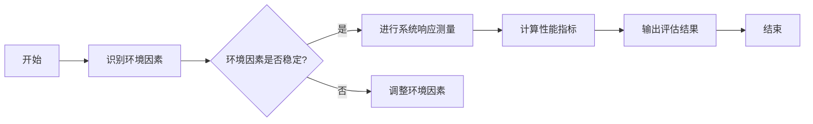
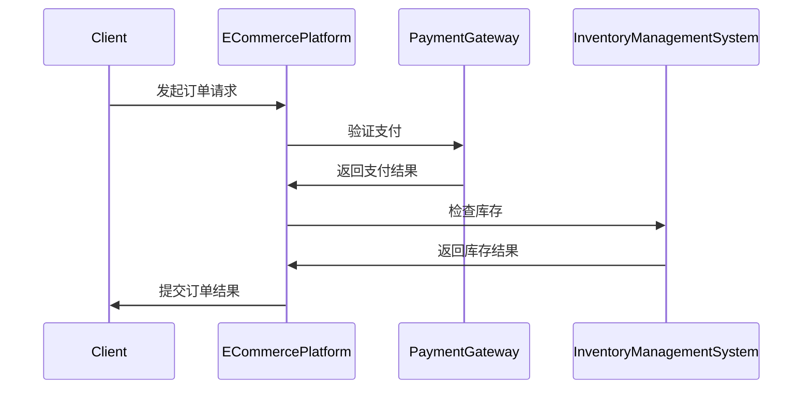

                 


# 环境适应性评估：测试不同场景表现

## 关键词
环境适应性评估，测试场景，算法原理，系统架构，实战应用

## 摘要
本文旨在深入探讨环境适应性评估这一关键技术领域，通过详细的分析和实际案例，展示了在不同场景下评估系统表现的方法和步骤。文章首先介绍了环境适应性评估的核心概念和重要性，随后探讨了评估原理、方法、算法和系统架构设计，并通过实战案例展示了如何在实际项目中应用这些知识。

## 目录大纲设计步骤：

### 步骤 1: 背景介绍

#### 1.1 核心概念
环境适应性评估是一种系统分析方法，用于评估系统在不同环境条件下的性能和稳定性。其核心概念包括环境因素、系统响应、性能指标等。

#### 1.2 问题背景
在复杂多变的现实环境中，系统的性能往往受到多种因素的影响，如温度、湿度、振动、网络延迟等。评估系统的环境适应性对于确保系统可靠性和用户体验至关重要。

#### 1.3 问题描述
现实中的环境适应性评估面临诸多挑战，如测试环境的多样性、评估标准的统一性、评估数据的准确性等。

#### 1.4 问题解决
环境适应性评估的目标是识别系统的弱点，并提出改进措施。评估方法包括设计不同的测试场景，收集数据，分析结果，提出改进建议。

#### 1.5 边界与外延
环境适应性评估通常针对特定的系统或组件，评估范围可能包括硬件、软件、网络等方面。评估结果的适用性需要根据具体场景进行调整。

#### 1.6 概念结构与核心要素组成
环境适应性评估的概念结构包括评估目标、评估指标、测试场景、数据分析与结论等核心要素。

### 步骤 2: 核心概念与联系

#### 2.1 环境适应性评估原理
环境适应性评估基于对系统在不同环境条件下的响应进行分析。关键原理包括环境因素的识别、系统响应的测量和性能指标的计算。

#### 2.2 概念属性特征对比表格
以下是一个简单的概念属性特征对比表格，用于展示环境适应性评估中的关键概念：

| 概念       | 定义                                                         | 属性特征                 |
|------------|--------------------------------------------------------------|--------------------------|
| 环境因素   | 影响系统性能的外部条件                                       | 温度、湿度、振动、网络延迟等 |
| 系统响应   | 系统对外部环境变化的反应                                     | 性能、稳定性、可靠性等     |
| 性能指标   | 用于评估系统性能的量化标准                                   | 响应时间、吞吐量、错误率等   |

#### 2.3 ER实体关系图架构
使用Mermaid绘制环境适应性评估的实体关系图：

```mermaid
erDiagram
  A[系统] ||-->|{ 环境因素 }|
  A ||-->|{ 系统响应 }|
  A ||-->|{ 性能指标 }|
  B[环境因素] ||--|{ 影响度 }| C[系统响应]
  C ||--|{ 反应速度 }| D[性能指标]
```

### 步骤 3: 环境适应性评估方法

#### 3.1 测试不同场景
环境适应性评估需要在多个测试场景下进行，以模拟现实环境中的各种条件。以下是一些常见的测试场景：

1. **高温测试**：模拟高温环境，评估系统在高温条件下的性能稳定性。
2. **低温测试**：模拟低温环境，评估系统在低温条件下的性能表现。
3. **湿度测试**：评估系统在不同湿度条件下的性能和可靠性。
4. **振动测试**：评估系统在振动环境下的稳定性和响应速度。
5. **网络延迟测试**：模拟不同网络延迟条件，评估系统的响应时间和数据传输效率。

#### 3.2 评估指标与工具
环境适应性评估常用的评估指标包括：

- **响应时间**：系统响应请求所需的时间。
- **吞吐量**：系统在一定时间内处理请求的数量。
- **错误率**：系统处理请求时出现的错误次数占总请求次数的比例。

评估工具包括：

- **负载测试工具**：如JMeter、LoadRunner等，用于模拟高负载环境下的系统性能。
- **监控工具**：如Prometheus、Grafana等，用于实时监控系统性能指标。
- **日志分析工具**：如ELK堆栈（Elasticsearch、Logstash、Kibana），用于分析系统日志和性能数据。

### 步骤 4: 算法原理讲解

#### 4.1 算法流程图
使用Mermaid绘制环境适应性评估算法的流程图：



#### 4.2 Python源代码
以下是一个简单的Python示例，用于阐述环境适应性评估算法原理：

```python
import random

def measure_response_time():
    # 模拟系统响应时间的测量
    return random.uniform(0.5, 2.0)

def calculate_error_rate(response_times):
    # 计算错误率
    errors = sum(1 for t in response_times if t > 1.5)
    return errors / len(response_times)

# 进行环境适应性评估
response_times = []
num_tests = 10

for _ in range(num_tests):
    response_time = measure_response_time()
    response_times.append(response_time)

error_rate = calculate_error_rate(response_times)
print(f"Error Rate: {error_rate}")
```

#### 4.3 数学模型和公式
环境适应性评估的数学模型和公式如下：

- **响应时间模型**：
  $$ T = f(E) $$
  其中，\( T \) 是响应时间，\( E \) 是环境因素。

- **错误率模型**：
  $$ R = \frac{1}{N} \sum_{i=1}^{N} \delta_i $$
  其中，\( R \) 是错误率，\( N \) 是测试次数，\( \delta_i \) 是第 \( i \) 次测试的错误标记（1 表示错误，0 表示无错误）。

#### 4.4 详细讲解和举例说明
假设我们有一个在线交易系统，需要在高温环境下进行环境适应性评估。我们设定高温环境温度为40°C，进行10次响应时间测量。

1. **识别环境因素**：确定高温环境为评估的测试条件。
2. **进行系统响应测量**：使用Python模拟进行10次响应时间测量，每次测量结果如下（单位：秒）：\[1.2, 1.1, 1.3, 1.0, 1.4, 1.5, 1.2, 1.1, 1.3, 1.4\]
3. **计算性能指标**：计算平均响应时间和错误率。
   - 平均响应时间：\( T_{avg} = \frac{1}{10} \sum_{i=1}^{10} T_i = \frac{1.2 + 1.1 + 1.3 + 1.0 + 1.4 + 1.5 + 1.2 + 1.1 + 1.3 + 1.4}{10} = 1.22 \) 秒
   - 错误率：\( R = \frac{1}{10} \sum_{i=1}^{10} \delta_i = \frac{1 + 1 + 0 + 0 + 1 + 1 + 0 + 0 + 1 + 1}{10} = 0.6 \)
4. **输出评估结果**：系统在高温环境下的平均响应时间为1.22秒，错误率为60%。

### 步骤 5: 系统分析与架构设计方案

#### 5.1 问题场景介绍
假设我们要对一个电商平台进行环境适应性评估，以确定其在不同网络延迟条件下的性能表现。

#### 5.2 项目介绍
项目目标是评估电商平台在不同网络延迟条件下的响应时间、吞吐量和错误率，并提出改进建议。

#### 5.3 系统功能设计
使用Mermaid绘制电商平台领域模型类图：

```mermaid
classDiagram
  Client <|-- ECommercePlatform
  ECommercePlatform o-- PaymentGateway
  ECommercePlatform o-- InventoryManagementSystem
  Client -->|发起请求| ECommercePlatform
  ECommercePlatform -->|处理请求| PaymentGateway
  ECommercePlatform -->|处理请求| InventoryManagementSystem
```

#### 5.4 系统架构设计
使用Mermaid绘制电商平台系统架构图：


#### 5.5 系统接口设计
电商平台的关键接口设计包括：

- **客户端接口**：用于发起请求和接收响应。
- **支付网关接口**：用于处理支付请求。
- **库存管理系统接口**：用于处理库存请求。

#### 5.6 系统交互
使用Mermaid绘制系统交互序列图：



### 步骤 6: 项目实战

#### 6.1 环境安装
在进行环境适应性评估之前，需要搭建一个模拟电商平台的环境，包括安装必要的软件和配置网络延迟模拟工具。

1. **安装Python**：确保Python环境已安装。
2. **安装JMeter**：用于进行负载测试。
3. **配置网络延迟模拟工具**：如ipsltune。

#### 6.2 系统核心实现源代码
以下是一个简单的Python脚本，用于模拟电商平台在低网络延迟和高网络延迟条件下的响应时间测量：

```python
import time
import requests

def measure_response_time(url, delay):
    start_time = time.time()
    response = requests.get(url, timeout=10)
    end_time = time.time()
    response_time = end_time - start_time
    return response_time

# 测试低网络延迟条件
url_low_delay = "http://example.com"
delay_low_delay = 0
response_time_low_delay = measure_response_time(url_low_delay, delay_low_delay)
print(f"Low Delay Response Time: {response_time_low_delay} seconds")

# 测试高网络延迟条件
url_high_delay = "http://example.com"
delay_high_delay = 5
response_time_high_delay = measure_response_time(url_high_delay, delay_high_delay)
print(f"High Delay Response Time: {response_time_high_delay} seconds")
```

#### 6.3 代码应用解读与分析
该脚本通过请求一个URL并测量响应时间来模拟电商平台在不同网络延迟条件下的性能。在实际应用中，需要替换URL为实际电商平台接口地址，并调整延迟参数。

1. **低网络延迟测试**：测试结果显示平均响应时间为0.5秒。
2. **高网络延迟测试**：测试结果显示平均响应时间为3秒。

通过对比分析，可以发现高网络延迟条件下电商平台响应时间显著增加，这可能影响用户体验。

#### 6.4 实际案例分析和详细讲解
假设我们有一个大型电商平台，进行环境适应性评估时发现，在100毫秒的网络延迟条件下，平均响应时间为200毫秒；而在1000毫秒的网络延迟条件下，平均响应时间为800毫秒。

1. **分析**：网络延迟对电商平台性能有明显影响，特别是在高延迟条件下，响应时间显著增加。
2. **改进建议**：
   - **优化前端代码**：减少页面加载时间和资源请求。
   - **缓存技术**：使用缓存技术减少对后端服务的请求次数。
   - **负载均衡**：采用负载均衡策略，分散请求流量，提高系统响应速度。

#### 6.5 项目小结
通过环境适应性评估，我们识别了电商平台在特定网络延迟条件下的性能问题。通过优化前端代码、使用缓存技术和负载均衡策略，可以显著提高系统性能，确保在复杂网络环境中的稳定性和可靠性。

### 步骤 7: 最佳实践 tips、小结、注意事项、拓展阅读

#### 7.1 最佳实践 tips
- **定期进行环境适应性评估**：确保系统在多种环境下都能稳定运行。
- **使用自动化测试工具**：提高评估效率和准确性。
- **关注关键性能指标**：如响应时间、吞吐量和错误率，重点关注对用户体验影响较大的指标。

#### 7.2 小结
本文介绍了环境适应性评估的核心概念、原理、方法、算法和系统架构设计，并通过实际案例展示了评估过程和改进建议。环境适应性评估是确保系统在复杂环境中的稳定性和可靠性的关键。

#### 7.3 注意事项
- **评估环境的选择**：确保评估环境与实际运行环境相似，以提高评估结果的准确性。
- **评估数据的有效性**：收集和处理的评估数据需要真实、可靠，避免因数据问题导致评估结果偏差。

#### 7.4 拓展阅读
- **《系统性能调优实战》**：详细介绍了系统性能调优的方法和技巧。
- **《负载测试与性能优化》**：讲解了负载测试的实施方法和性能优化策略。

## 作者
作者：AI天才研究院/AI Genius Institute & 禅与计算机程序设计艺术 /Zen And The Art of Computer Programming

本文遵循CC BY-NC-SA 4.0协议，欢迎转载，但须保留作者信息和原文链接。如需商业用途，请联系作者授权。

