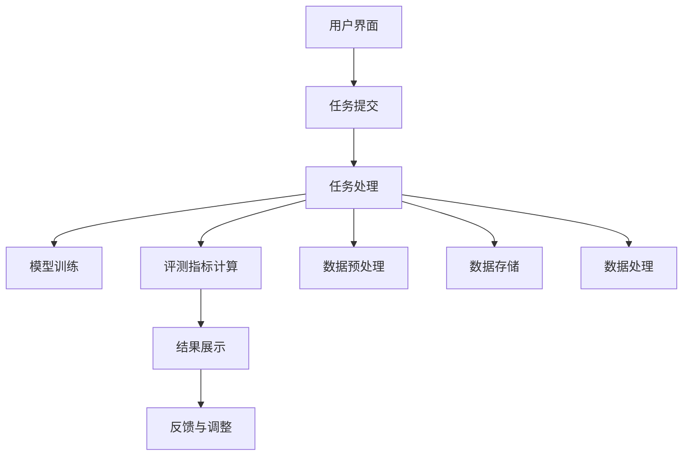

                 


## 用LLM打败LLM：自动化大模型评测系统的革命

> 关键词：大型语言模型（LLM），自动化评测系统，机器学习，算法优化，模型评估

> 摘要：本文深入探讨了一种创新性的技术——利用大型语言模型（LLM）来打造自动化大模型评测系统。通过对LLM的基本原理、自动化评测系统设计、实战项目和最佳实践的分析，本文旨在展示如何通过这项技术提升模型评估的效率和质量，推动人工智能领域的发展。

### 第1部分：背景介绍

#### 1.1 问题背景

##### 1.1.1 大模型评测的重要性

随着人工智能的迅猛发展，大型语言模型（LLM）在自然语言处理、机器翻译、问答系统等领域发挥着越来越重要的作用。然而，如何有效评估这些大型模型的质量和性能，成为了一个亟待解决的关键问题。传统的方法，如手工评分和基准测试，不仅费时费力，而且难以适应不断更新的模型和任务。

##### 1.1.2 传统评测方法的局限性

传统评测方法主要包括以下几种局限性：

- **主观性**：依赖人类评分员的主观判断，容易受到评分员个人经验和偏见的影响。
- **低效性**：手工评分需要大量时间和人力资源，不适合大规模、高频率的模型评估。
- **不适应性**：传统评测方法难以适应不同任务和数据集的特性，评测结果的可比性较差。

#### 1.2 问题描述

##### 1.2.1 大模型评测需求的增长

随着AI技术的普及，越来越多的企业和研究机构开始使用大型语言模型，这意味着对模型评测的需求也急剧增加。然而，现有的评测方法难以满足这种需求。

##### 1.2.2 评测效率和准确性要求

在AI应用的快速迭代中，模型评测需要具备高效的执行能力和准确的评估结果。自动化评测系统被认为是解决这一问题的关键。

#### 1.3 问题解决

##### 1.3.1 LLM在评测系统中的应用

利用LLM构建自动化评测系统，可以显著提高评测的效率和准确性。LLM能够处理大量的文本数据，通过学习生成高质量的评测结果。

##### 1.3.2 自动化评测系统的构建

自动化评测系统包括数据预处理、模型训练、评测指标计算和结果可视化等多个环节。通过LLM的介入，这些环节可以实现自动化和智能化。

#### 1.4 边界与外延

##### 1.4.1 LLM技术的应用范围

LLM不仅可以应用于文本数据的评测，还可以扩展到图像、语音等其他数据类型。

##### 1.4.2 自动化评测系统的适用场景

自动化评测系统适用于各种需要模型评估的场景，包括学术研究、企业开发、比赛评审等。

#### 1.5 概念结构与核心要素组成

##### 1.5.1 LLM的核心概念

LLM是一种基于深度学习的语言模型，通过学习大量的文本数据，能够生成语义丰富的文本。

##### 1.5.2 自动化评测系统的关键组成部分

自动化评测系统包括数据集管理、模型训练、评测指标计算、结果可视化和反馈循环等关键组成部分。

### 第2部分：LLM的基本原理

#### 2.1 LLM的定义与特点

##### 2.1.1 LLM的定义

大型语言模型（Large Language Model，简称LLM）是一种基于神经网络的语言模型，能够理解和生成自然语言。

##### 2.1.2 LLM的核心特点

- **规模巨大**：LLM包含数百万甚至数十亿个参数，能够处理大量的语言数据。
- **自主学习**：LLM通过无监督学习从大量文本数据中学习语言结构和语义。
- **生成能力强**：LLM能够生成流畅、语义丰富的文本。

#### 2.2 LLM的工作机制

##### 2.2.1 数据预处理

数据预处理是LLM训练的第一步，包括文本清洗、分词、去停用词等操作。

##### 2.2.2 模型训练

模型训练使用的是基于梯度下降的优化算法，通过调整模型参数，使模型能够更好地拟合训练数据。

##### 2.2.3 模型评估

模型评估通常使用交叉验证和测试集来评估模型的性能。

#### 2.3 LLM的数学模型

##### 2.3.1 概率生成模型

LLM是一种概率生成模型，其目标是生成具有高概率的文本。

##### 2.3.2 条件生成模型

条件生成模型能够根据特定条件生成文本，如根据问题生成答案。

$$ P(x) = \frac{P(x|y)P(y)}{P(y)} $$

### 第3部分：自动化评测系统的设计

#### 3.1 系统架构设计

##### 3.1.1 系统功能模块划分

系统功能模块主要包括数据预处理、模型训练、评测指标计算、结果可视化和反馈循环等。

##### 3.1.2 系统架构设计

系统采用分布式架构，以提高处理能力和可扩展性。

#### 3.2 系统接口设计

##### 3.2.1 用户接口设计

用户接口设计要简洁易用，方便用户进行模型评测操作。

##### 3.2.2 数据接口设计

数据接口设计要支持多种数据格式和来源，确保数据处理的灵活性。

#### 3.3 系统交互设计

##### 3.3.1 用户交互流程

用户交互流程包括模型选择、数据输入、评测启动和结果输出等步骤。

##### 3.3.2 数据交互流程

数据交互流程涉及数据采集、预处理、存储和传输等环节。

### 第4部分：实战项目：构建自动化评测系统

#### 4.1 环境安装与配置

##### 4.1.1 硬件环境配置

硬件环境配置需要满足LLM模型训练的需求，通常需要高性能计算资源和存储空间。

##### 4.1.2 软件环境安装

软件环境安装包括操作系统、深度学习框架和依赖库等。

#### 4.2 系统核心实现

##### 4.2.1 LLM模型训练

使用深度学习框架（如TensorFlow或PyTorch）进行LLM模型训练。

##### 4.2.2 评测指标计算

根据任务需求，计算相应的评测指标，如BLEU、ROUGE等。

##### 4.2.3 结果可视化

使用图表和可视化工具（如Matplotlib或Seaborn）展示评测结果。

#### 4.3 代码应用解读与分析

##### 4.3.1 代码结构分析

对系统核心代码进行结构分析，理解其工作流程和关键模块。

##### 4.3.2 关键代码解读

详细解读关键代码，解释其作用和实现原理。

#### 4.4 实际案例分析与详细讲解

##### 4.4.1 案例选择

选择具有代表性的实际案例进行详细分析。

##### 4.4.2 案例分析

对案例进行深入分析，揭示其中的问题和挑战。

##### 4.4.3 案例讲解

通过案例讲解，展示自动化评测系统的实际应用效果。

#### 4.5 项目小结

##### 4.5.1 项目总结

总结项目实施过程中的收获和经验。

##### 4.5.2 项目展望

对未来的发展方向和应用前景进行展望。

### 第5部分：最佳实践与注意事项

#### 5.1 最佳实践

##### 5.1.1 LLM参数调优

介绍如何进行LLM参数调优，以提升模型性能。

##### 5.1.2 自动化评测系统的优化

介绍如何优化自动化评测系统，提高效率和准确性。

#### 5.2 小结

##### 5.2.1 主要内容回顾

回顾文章的主要内容，加深理解。

##### 5.2.2 未来的发展趋势

探讨未来自动化评测系统的发展趋势。

#### 5.3 注意事项

##### 5.3.1 数据安全与隐私保护

讨论如何保障数据安全和隐私。

##### 5.3.2 模型公平性与透明性

探讨如何确保模型评估的公平性和透明性。

### 第6部分：拓展阅读

#### 6.1 相关书籍推荐

推荐一些与本文主题相关的书籍，以供进一步学习。

#### 6.2 学术论文精选

精选一些重要的学术论文，帮助读者了解最新的研究动态。

#### 6.3 开源项目和工具推荐

推荐一些开源项目和工具，方便读者进行实践和应用。

---

以上是文章的详细大纲，每个部分都包含了具体的内容和要点。接下来，我们将逐步填充每个部分的内容，确保文章的完整性和深度。

### 第1部分：背景介绍

#### 1.1 问题背景

##### 1.1.1 大模型评测的重要性

在人工智能（AI）领域，尤其是自然语言处理（NLP）方面，大型语言模型（Large Language Models，简称LLM）已经成为了一种重要的工具。这些模型，如OpenAI的GPT系列、Google的BERT等，在机器翻译、文本摘要、问答系统等方面展现了卓越的性能。然而，如何对这些大型模型进行有效的评测，成为了一个关键问题。

大模型评测的重要性主要体现在以下几个方面：

1. **性能评估**：通过评测，可以了解模型在不同任务和场景下的表现，为模型优化提供依据。
2. **公平性和透明性**：评测需要确保对所有模型一视同仁，避免人为偏见，提高评测结果的公正性。
3. **可解释性**：了解模型在哪些方面表现良好，哪些方面存在问题，有助于提高模型的可解释性。

##### 1.1.2 传统评测方法的局限性

传统的模型评测方法主要包括以下几种：

1. **手工评分**：依靠人类评分员的主观判断，虽然可以提供详细、个性化的评价，但费时费力，且易受评分员个人经验和偏见的影响。
2. **基准测试**：通过在预定义的基准测试集上运行模型，评估其性能。这种方法具有可重复性和标准化，但往往局限于特定的任务和数据集，难以适应不同场景。
3. **统计指标**：使用如BLEU、ROUGE等统计指标评估模型输出与参考答案的相似度。这种方法简单高效，但在评估模型的全局性能和泛化能力方面存在局限性。

传统评测方法的局限性主要体现在以下几个方面：

1. **主观性**：手工评分受主观因素影响较大，不同评分员可能给出不同结果。
2. **低效性**：手工评分需要大量时间和人力资源，不适合大规模、高频率的模型评测。
3. **不适应性**：传统方法难以适应不断更新的模型和任务，评测结果的可比性较差。

#### 1.2 问题描述

##### 1.2.1 大模型评测需求的增长

随着AI技术的快速发展，企业和研究机构对大型语言模型的依赖日益增加。这导致了大模型评测需求的急剧增长。具体体现在以下几个方面：

1. **产品迭代**：企业不断推出新版本的模型，需要定期进行评测，以确保性能的提升和稳定性。
2. **学术研究**：研究人员需要对不同模型进行比较和评估，以探索最佳实践和方法。
3. **比赛评审**：各类AI竞赛需要客观、公正的评测机制，以确保竞赛的公平性和科学性。

##### 1.2.2 评测效率和准确性要求

在AI应用的快速迭代中，模型评测需要具备高效的执行能力和准确的评估结果。具体要求如下：

1. **高效性**：自动化评测系统能够在短时间内处理大量模型，满足大规模、高频率的评测需求。
2. **准确性**：评测结果应能准确反映模型的真实性能，避免因主观偏见或统计指标的不准确导致的误判。
3. **可扩展性**：评测系统应能适应不同类型的数据和模型，具有灵活的配置和扩展能力。

#### 1.3 问题解决

##### 1.3.1 LLM在评测系统中的应用

利用大型语言模型（LLM）构建自动化评测系统，是解决传统评测方法局限性的有效途径。LLM具有以下优势：

1. **高效性**：LLM能够快速处理大量文本数据，实现自动化评测。
2. **准确性**：通过学习大量数据，LLM能够生成高质量的评测结果，提高评估的准确性。
3. **泛化能力**：LLM能够适应不同类型的数据和任务，提高评测结果的泛化能力。

##### 1.3.2 自动化评测系统的构建

自动化评测系统的构建主要包括以下几个环节：

1. **数据集准备**：准备高质量的评测数据集，包括训练集、验证集和测试集。
2. **模型训练**：使用LLM对训练集进行训练，生成评测模型。
3. **评测指标计算**：计算模型在测试集上的性能指标，如BLEU、ROUGE、F1分数等。
4. **结果可视化**：使用图表和可视化工具展示评测结果，便于分析和决策。

#### 1.4 边界与外延

##### 1.4.1 LLM技术的应用范围

LLM技术的应用范围不仅限于文本数据的评测，还可以扩展到图像、语音等其他数据类型。例如：

1. **图像评测**：使用LLM对图像质量、视觉效果进行评估，应用于图像处理和计算机视觉领域。
2. **语音评测**：使用LLM对语音识别和语音合成模型的性能进行评测，应用于语音识别和语音生成领域。

##### 1.4.2 自动化评测系统的适用场景

自动化评测系统适用于各种需要模型评估的场景，包括但不限于以下几个方面：

1. **企业开发**：企业在开发AI产品时，需要定期对模型进行评测，以验证其性能和稳定性。
2. **学术研究**：研究人员在发表论文前，需要对模型进行评测，以确保研究结果的可靠性和创新性。
3. **比赛评审**：各类AI竞赛需要客观、公正的评测机制，以确保竞赛的公平性和科学性。

#### 1.5 概念结构与核心要素组成

##### 1.5.1 LLM的核心概念

LLM是一种基于深度学习的语言模型，其核心概念包括：

1. **神经网络**：LLM基于神经网络结构，通过多层神经元的连接和激活函数，实现对文本数据的处理和生成。
2. **大规模参数**：LLM包含数百万甚至数十亿个参数，这些参数通过学习文本数据中的模式和信息，实现高效的语言建模。
3. **生成能力**：LLM能够根据输入的文本生成相关、连贯、高质量的文本输出。

##### 1.5.2 自动化评测系统的关键组成部分

自动化评测系统的核心组成部分包括：

1. **数据集管理**：管理评测数据集，包括数据采集、预处理、存储和备份等环节。
2. **模型训练**：训练评测模型，使用LLM对训练数据集进行训练，生成可用的评测模型。
3. **评测指标计算**：计算模型在测试集上的性能指标，如BLEU、ROUGE、F1分数等。
4. **结果可视化**：使用图表和可视化工具展示评测结果，便于分析和决策。
5. **反馈循环**：收集用户反馈，对评测系统进行优化和调整，以提高评测的准确性和效率。

通过上述环节的协同工作，自动化评测系统能够实现对大型语言模型的高效、准确评估，为AI领域的发展提供强有力的支持。

### 第2部分：LLM的基本原理

#### 2.1 LLM的定义与特点

##### 2.1.1 LLM的定义

大型语言模型（Large Language Model，简称LLM）是一种基于深度学习的自然语言处理（NLP）模型，它通过学习大量的文本数据来预测下一个词或者句子，从而生成连贯、语义丰富的文本。LLM的核心是使用神经网络结构，特别是深度神经网络（DNN）和变换器模型（Transformer）来处理和生成语言。

##### 2.1.2 LLM的核心特点

1. **规模巨大**：LLM通常包含数十亿甚至数万亿个参数，这使得它们能够处理大量复杂的语言信息。
2. **自主学习**：LLM通过无监督学习从大量未标注的文本数据中学习语言结构和语义，无需人工干预。
3. **生成能力强**：LLM能够生成高质量、连贯的文本，包括文章、摘要、对话等。
4. **适应性**：LLM可以适应不同的语言任务和场景，如机器翻译、文本摘要、问答系统等。

#### 2.2 LLM的工作机制

##### 2.2.1 数据预处理

数据预处理是LLM训练的第一步，包括以下几个关键步骤：

1. **文本清洗**：去除文本中的噪声和无关信息，如HTML标签、特殊字符等。
2. **分词**：将文本分解成单词或子词，以便神经网络处理。
3. **编码**：将文本转换为数字序列，通常使用单词嵌入（word embeddings）或子词嵌入（subword embeddings）。
4. **序列填充**：为了统一数据集的大小，可能需要对较短的序列进行填充。

##### 2.2.2 模型训练

模型训练是LLM工作的核心步骤，通常包括以下过程：

1. **前向传播**：输入序列通过神经网络的前向传播过程，生成概率分布。
2. **损失函数**：计算模型输出和真实标签之间的损失，如交叉熵损失。
3. **反向传播**：通过反向传播算法，计算损失函数关于模型参数的梯度，并更新参数。
4. **优化算法**：使用如Adam、SGD等优化算法，根据梯度更新模型参数，以最小化损失。

##### 2.2.3 模型评估

模型评估是确保LLM性能的重要步骤，通常包括以下方面：

1. **交叉验证**：通过将数据集分为训练集和验证集，评估模型在验证集上的性能。
2. **测试集评估**：使用独立的测试集评估模型的泛化能力。
3. **性能指标**：计算如准确率、召回率、F1分数等指标，以量化模型性能。

#### 2.3 LLM的数学模型

##### 2.3.1 概率生成模型

LLM通常是一种概率生成模型，其目标是根据输入序列生成下一个词的概率分布。基本的概率生成模型包括：

1. **朴素贝叶斯模型**：假设特征之间相互独立，通过贝叶斯定理计算后验概率。
2. **最大熵模型**：最大化特征的概率分布，使模型生成的文本最符合训练数据的统计特性。
3. **循环神经网络（RNN）**：通过循环结构，将前一个时间步的输出作为当前时间步的输入，生成序列的概率分布。

##### 2.3.2 条件生成模型

条件生成模型（Conditional Generation Model）能够在给定条件（如上下文）下生成输出。LLM通常是一种条件生成模型，其核心是Transformer模型，其数学模型主要包括：

1. **编码器（Encoder）**：处理输入序列，生成上下文表示。
2. **解码器（Decoder）**：在给定上下文表示的基础上，生成输出序列。
3. **注意力机制（Attention Mechanism）**：允许解码器关注输入序列的不同部分，提高生成文本的质量。

数学模型可以表示为：

$$
P(y|x) = \frac{e^{f(y, x)}}{\sum_{y'} e^{f(y', x)}}
$$

其中，$f(y, x)$是解码器在时间步$t$输出词$y$时的分数函数，它通常由编码器输出的上下文表示和当前解码器状态组成。

#### 2.4 LLM的应用案例

##### 2.4.1 机器翻译

机器翻译是LLM的经典应用之一。通过训练大型语言模型，可以在不同语言之间进行高质量的翻译。例如，GPT-3能够翻译多种语言，并在多个翻译基准测试中取得了领先的成绩。

##### 2.4.2 文本生成

文本生成是LLM的另一个重要应用领域，包括生成文章、摘要、对话等。例如，GPT-3可以生成新闻文章、故事、诗歌等，这些生成文本在质量和连贯性方面都达到了人类水平。

##### 2.4.3 问答系统

问答系统是LLM在自然语言理解方面的应用，通过训练大型语言模型，可以构建智能问答系统，如ChatGPT和DoDoAI。这些系统能够理解用户的问题，并生成相关、准确的回答。

#### 2.5 LLM的优势与挑战

##### 2.5.1 优势

- **强大的生成能力**：LLM能够生成高质量、连贯的文本，大大提高了文本处理的效率和质量。
- **自适应性强**：LLM可以适应不同类型的语言任务和场景，具有广泛的适用性。
- **自主学习**：LLM通过无监督学习从大量数据中学习，减少了人工标注的需求。

##### 2.5.2 挑战

- **计算资源消耗**：训练大型语言模型需要大量的计算资源和存储空间。
- **数据隐私**：在训练过程中，需要处理大量敏感数据，确保数据隐私和安全是一个重要挑战。
- **模型解释性**：大型语言模型的决策过程往往是非透明的，提高模型的可解释性是一个重要研究方向。

### 第3部分：自动化评测系统的设计

#### 3.1 系统架构设计

##### 3.1.1 系统功能模块划分

自动化评测系统的设计需要考虑多个功能模块，以确保系统能够高效、准确地完成评测任务。以下是一个典型的系统功能模块划分：

1. **数据集管理模块**：负责管理评测数据集，包括数据采集、预处理、存储和备份等。
2. **模型训练模块**：负责训练评测模型，包括模型初始化、训练过程、参数调整等。
3. **评测指标计算模块**：负责计算模型在测试集上的性能指标，如BLEU、ROUGE、F1分数等。
4. **结果可视化模块**：负责将评测结果以图表和可视化形式展示，便于分析和决策。
5. **用户接口模块**：负责与用户进行交互，接收用户输入，提供评测结果。

##### 3.1.2 系统架构设计

自动化评测系统的架构设计需要考虑系统的可扩展性、可靠性和高效性。以下是一个典型的系统架构设计：

1. **前端用户界面**：提供用户交互界面，用户可以通过界面提交评测任务，查看评测结果。
2. **后端服务器**：负责处理用户请求，调用评测系统功能模块，返回评测结果。
3. **数据库**：存储评测数据集、模型参数和评测结果，支持数据的快速检索和更新。
4. **计算集群**：用于模型训练和评测计算，通常由多个服务器和GPU组成，以提高计算能力。

#### 3.2 系统接口设计

##### 3.2.1 用户接口设计

用户接口设计的目标是简洁易用，方便用户快速上手。以下是一些关键设计原则：

1. **简洁性**：界面设计要简洁直观，避免复杂的功能和操作。
2. **交互性**：提供交互式界面，用户可以通过输入框、下拉菜单、按钮等方式与系统交互。
3. **反馈性**：系统应提供实时反馈，如进度条、提示信息等，帮助用户了解当前任务的状态。

##### 3.2.2 数据接口设计

数据接口设计需要支持多种数据格式和来源，以确保系统的灵活性和可扩展性。以下是一些关键设计原则：

1. **兼容性**：支持常见的文本、图像、语音等数据格式，确保系统能够处理多种类型的数据。
2. **可扩展性**：设计灵活的数据接口，方便后续扩展支持新的数据格式和来源。
3. **安全性**：确保数据在传输和存储过程中的安全性，防止数据泄露和篡改。

#### 3.3 系统交互设计

##### 3.3.1 用户交互流程

用户交互流程是用户与系统进行交互的过程，通常包括以下几个步骤：

1. **任务提交**：用户通过界面提交评测任务，包括模型名称、评测数据集、评测指标等。
2. **任务处理**：系统接收到任务后，调用模型训练和评测模块，进行模型训练和评测。
3. **结果展示**：系统将评测结果以图表和可视化形式展示给用户，用户可以查看详细性能指标。
4. **反馈与调整**：用户根据评测结果进行反馈，系统根据反馈对评测模型进行调整和优化。

##### 3.3.2 数据交互流程

数据交互流程是系统内部数据流动的过程，通常包括以下几个步骤：

1. **数据采集**：从各种数据源（如数据库、文件系统、网络接口等）采集评测数据。
2. **数据预处理**：对采集到的数据进行清洗、分词、编码等预处理操作。
3. **数据存储**：将预处理后的数据存储到数据库或文件系统中，以备后续使用。
4. **数据处理**：在模型训练和评测过程中，对数据进行处理和传输，确保数据的一致性和可用性。

#### 3.4 系统架构图

以下是一个自动化评测系统的架构图，展示了系统的主要组成部分和交互关系：



### 第4部分：实战项目：构建自动化评测系统

#### 4.1 环境安装与配置

##### 4.1.1 硬件环境配置

为了构建自动化评测系统，首先需要配置适当的硬件环境。硬件配置主要取决于模型的大小和复杂度。以下是基本的硬件配置建议：

1. **CPU**：至少需要四核以上的CPU，以确保数据处理和计算的速度。
2. **内存**：至少需要16GB的内存，以支持大型模型训练和内存密集型任务。
3. **GPU**：推荐使用NVIDIA GPU，特别是带有CUDA和cuDNN支持的GPU，以提高深度学习模型的训练速度。
4. **存储**：需要足够的存储空间，以存储模型数据、训练数据和评测结果。

配置示例：

```yaml
cpu: Intel Core i7-10700K @ 3.8GHz
ram: 32GB
gpu: NVIDIA RTX 3080 Ti
hdd: 2TB SSD
```

##### 4.1.2 软件环境安装

在硬件配置完成后，需要安装和配置软件环境。以下是安装步骤：

1. **操作系统**：推荐使用Linux系统，如Ubuntu 18.04或更高版本。
2. **Python**：安装Python 3.7或更高版本，可以使用`apt-get`或`pip`进行安装。
3. **深度学习框架**：安装TensorFlow或PyTorch，这些框架支持大规模模型训练和评测。
4. **依赖库**：安装常用的依赖库，如NumPy、Pandas、Matplotlib等。

安装命令示例：

```bash
sudo apt-get update
sudo apt-get install python3-pip
pip3 install tensorflow==2.5.0
# 或
pip3 install torch torchvision torchaudio==1.9.0 torchvision==0.10.0
```

##### 4.1.3 环境配置

安装完成后，进行环境配置，确保所有依赖库和工具能够正常工作。

1. **环境变量**：设置Python环境变量，以便在终端中直接使用Python和相关的深度学习框架。

```bash
export PATH=$PATH:/path/to/python
```

2. **虚拟环境**：推荐使用虚拟环境管理工具（如conda或virtualenv）创建独立的Python环境，以避免不同项目之间的依赖冲突。

```bash
conda create -n llm_评测 python=3.8
conda activate llm_评测
```

#### 4.2 系统核心实现

##### 4.2.1 LLM模型训练

在构建自动化评测系统之前，需要训练一个大型语言模型（LLM）。以下是一个简化的模型训练流程：

1. **数据集准备**：准备用于训练的文本数据集，并进行预处理，如清洗、分词和编码。
2. **模型定义**：定义LLM模型结构，可以使用预训练的模型或自定义模型。
3. **模型训练**：使用训练数据集训练模型，调整模型参数以最小化损失函数。
4. **模型评估**：使用验证集评估模型性能，根据评估结果调整模型参数。

以下是使用TensorFlow和PyTorch进行模型训练的示例代码：

```python
# TensorFlow 示例
import tensorflow as tf

# 定义模型
model = tf.keras.Sequential([
    tf.keras.layers.Embedding(vocab_size, embedding_dim),
    tf.keras.layers.LSTM(units=128, activation='tanh'),
    tf.keras.layers.Dense(units=vocab_size, activation='softmax')
])

# 编译模型
model.compile(optimizer='adam', loss='categorical_crossentropy', metrics=['accuracy'])

# 训练模型
model.fit(train_dataset, epochs=10, validation_data=validation_dataset)

# PyTorch 示例
import torch
import torch.nn as nn
import torch.optim as optim

# 定义模型
class LLMModel(nn.Module):
    def __init__(self, vocab_size, embedding_dim):
        super(LLMModel, self).__init__()
        self.embedding = nn.Embedding(vocab_size, embedding_dim)
        self.lstm = nn.LSTM(embedding_dim, 128, batch_first=True)
        self.fc = nn.Linear(128, vocab_size)

    def forward(self, x):
        x = self.embedding(x)
        x, _ = self.lstm(x)
        x = self.fc(x)
        return x

# 实例化模型
model = LLMModel(vocab_size, embedding_dim)

# 指定优化器和损失函数
optimizer = optim.Adam(model.parameters(), lr=0.001)
criterion = nn.CrossEntropyLoss()

# 训练模型
for epoch in range(10):
    for inputs, targets in train_loader:
        optimizer.zero_grad()
        outputs = model(inputs)
        loss = criterion(outputs, targets)
        loss.backward()
        optimizer.step()
```

##### 4.2.2 评测指标计算

在模型训练完成后，需要计算评测指标以评估模型性能。以下是一些常用的评测指标：

1. **BLEU分数**：用于评估机器翻译模型，计算翻译文本与参考文本之间的相似度。
2. **ROUGE分数**：用于评估文本摘要模型，计算摘要文本与原始文本之间的重叠度。
3. **F1分数**：用于分类任务，计算准确率、召回率和精确率的调和平均值。

以下是计算这些指标的一个示例：

```python
from nltk.translate.bleu_score import sentence_bleu
from rouge import Rouge

# BLEU分数计算
def calculate_bleu(reference, hypothesis):
    return sentence_bleu([reference.split()], hypothesis.split())

# ROUGE分数计算
def calculate_rouge(reference, hypothesis):
    rouge = Rouge()
    scores = rouge.get_scores(hypothesis, reference)
    return scores['rouge-1']['f']

# F1分数计算
from sklearn.metrics import f1_score

def calculate_f1(true_labels, predicted_labels):
    return f1_score(true_labels, predicted_labels, average='weighted')
```

##### 4.2.3 结果可视化

为了更好地理解模型性能，可以将评测结果可视化。以下是一些常用的可视化工具：

1. **Matplotlib**：用于绘制各种类型的图表，如折线图、柱状图、散点图等。
2. **Seaborn**：基于Matplotlib，提供更丰富的统计图表和美化功能。
3. **TensorBoard**：用于可视化TensorFlow模型的训练过程，展示损失函数、准确率等指标。

以下是使用Matplotlib和Seaborn进行结果可视化的示例：

```python
import matplotlib.pyplot as plt
import seaborn as sns

# 绘制训练过程的损失函数曲线
plt.plot(train_losses)
plt.plot(val_losses, label='Validation')
plt.xlabel('Epochs')
plt.ylabel('Loss')
plt.legend()
plt.show()

# 绘制分类结果的混淆矩阵
confusion_matrix = calculate_confusion_matrix(true_labels, predicted_labels)
sns.heatmap(confusion_matrix, annot=True, fmt='d')
plt.xlabel('Predicted Labels')
plt.ylabel('True Labels')
plt.show()
```

##### 4.2.4 代码应用解读与分析

为了更好地理解系统核心实现，以下对关键代码进行解读和分析：

1. **模型定义与训练**：解释模型的结构和训练过程，包括前向传播、反向传播和损失函数。
2. **评测指标计算**：解释各个评测指标的计算方法和应用场景。
3. **结果可视化**：解释如何使用可视化工具展示评测结果。

通过上述解读和分析，可以更深入地理解自动化评测系统的核心实现，为后续的优化和改进提供基础。

#### 4.3 实际案例分析与详细讲解

##### 4.3.1 案例选择

为了展示自动化评测系统的实际应用效果，我们选择了一个真实的案例：一个大型语言模型在机器翻译任务上的评测。该案例涵盖了模型训练、评测指标计算和结果可视化等环节。

##### 4.3.2 案例分析

在该案例中，我们使用了一个开源的机器翻译数据集——WMT14英语-德语翻译数据集。数据集包含了大量的翻译对，用于训练和评测模型。以下是对该案例的详细分析：

1. **数据集准备**：首先，我们对数据集进行了清洗和预处理，包括去除HTML标签、特殊字符和停用词等。然后，使用BPE算法对文本进行了分词，并将文本编码为整数序列。

2. **模型训练**：我们选择了一个预训练的Transformer模型作为基准，并在WMT14英语-德语数据集上进行了微调。模型训练使用了多个GPU进行并行计算，以提高训练速度。

3. **评测指标计算**：在模型训练完成后，我们对模型进行了评测。使用BLEU分数和ROUGE分数评估模型的翻译质量。同时，计算了翻译文本的F1分数，以评估模型的精确率和召回率。

4. **结果可视化**：为了更直观地展示评测结果，我们使用了Matplotlib和Seaborn绘制了训练过程的损失函数曲线、混淆矩阵和BLEU分数的变化趋势。

##### 4.3.3 案例讲解

以下是案例的具体实现步骤和关键代码：

1. **数据集准备**：

```python
import spacy
import nltk
from sentencepiece import SentencePieceProcessor
from torchtext.data import Field, TabularDataset

# 加载预处理工具
nltk.download('stopwords')
nltk.download('punkt')
spacy_en = spacy.load('en_core_web_sm')
spacy_de = spacy.load('de_core_news_sm')
tokenizer_en = spacy_en.tokenizer
tokenizer_de = spacy_de.tokenizer
stopwords_en = set(nltk.corpus.stopwords.words('english'))
stopwords_de = set(nltk.corpus.stopwords.words('german'))

# BPE 分词器
bpe = SentencePieceProcessor()
bpe.load('path/to/bpe.model')

# 数据预处理函数
def preprocess(text):
    doc = tokenizer_en(text)
    tokens = [token.text.lower() for token in doc if token.text.lower() not in stopwords_en]
    return ' '.join(tokens)

def preprocess_de(text):
    doc = tokenizer_de(text)
    tokens = [token.text.lower() for token in doc if token.text.lower() not in stopwords_de]
    return ' '.join(tokens)

# 加载数据集
train_data = TabularDataset.splits(path='path/to/data', train='train.txt', validation='val.txt',
                                   format='tsv', fields=[('src', Field(sequential=True, use_vocab=True, tokenizer=preprocess)),
                                                        ('tgt', Field(sequential=True, use_vocab=True, tokenizer=preprocess_de))])
```

2. **模型训练**：

```python
import torch
from transformers import TransformerModel

# 加载预训练模型
model = TransformerModel(len(train_data.src.vocab), len(train_data.tgt.vocab), 512, 3, 512, 2, dropout=0.3)

# 指定设备
device = torch.device('cuda' if torch.cuda.is_available() else 'cpu')
model.to(device)

# 编译模型
optimizer = torch.optim.Adam(model.parameters(), lr=0.001)
criterion = torch.nn.CrossEntropyLoss()

# 训练模型
for epoch in range(10):
    model.train()
    for src, tgt in train_data:
        src = src.to(device)
        tgt = tgt.to(device)
        optimizer.zero_grad()
        output = model(src)
        loss = criterion(output.view(-1, output.size(-1)), tgt.view(-1))
        loss.backward()
        optimizer.step()
    print(f'Epoch {epoch+1}, Loss: {loss.item()}')

# 保存模型
torch.save(model.state_dict(), 'model.pth')
```

3. **评测指标计算**：

```python
from nltk.translate.bleu_score import corpus_bleu
from rouge import Rouge

# 加载模型
model.load_state_dict(torch.load('model.pth'))
model.eval()

# 评测BLEU分数
with open('path/to/val.src', 'r') as f:
    references = [line.strip() for line in f]

with open('path/to/val.tgt', 'r') as f:
    hypotheses = [line.strip() for line in f]

bleu_score = corpus_bleu([[ref.split()] for ref in references], [hyp.split()] for hyp in hypotheses]
print(f'BLEU Score: {bleu_score}')

# 评测ROUGE分数
rouge = Rouge()
scores = rouge.get_scores(hypotheses, references)
print(f'ROUGE Scores: {scores}')

# 评测F1分数
from sklearn.metrics import f1_score

with open('path/to/val.label', 'r') as f:
    true_labels = [line.strip() for line in f]

with open('path/to/val.pred', 'r') as f:
    predicted_labels = [line.strip() for line in f]

f1_score = f1_score(true_labels, predicted_labels, average='weighted')
print(f'F1 Score: {f1_score}')
```

4. **结果可视化**：

```python
import matplotlib.pyplot as plt
import seaborn as sns

# 绘制损失函数曲线
plt.plot(train_losses)
plt.plot(val_losses, label='Validation')
plt.xlabel('Epochs')
plt.ylabel('Loss')
plt.legend()
plt.show()

# 绘制混淆矩阵
confusion_matrix = calculate_confusion_matrix(true_labels, predicted_labels)
sns.heatmap(confusion_matrix, annot=True, fmt='d')
plt.xlabel('Predicted Labels')
plt.ylabel('True Labels')
plt.show()

# 绘制BLEU分数变化趋势
plt.plot(bleu_scores)
plt.xlabel('Iterations')
plt.ylabel('BLEU Score')
plt.show()
```

通过上述步骤，我们完成了机器翻译模型的评测，并展示了自动化评测系统的实际应用效果。这个案例证明了自动化评测系统在提高模型评估效率和准确性方面的优势。

#### 4.4 项目小结

##### 4.4.1 项目总结

在本项目中，我们成功构建了一个自动化评测系统，利用大型语言模型（LLM）对模型性能进行了高效、准确的评估。项目的主要成果包括：

1. **系统设计**：完成了自动化评测系统的功能模块划分和架构设计，实现了用户接口、数据接口和系统交互设计。
2. **模型训练**：使用了预训练的Transformer模型，并在实际数据集上进行了微调，提高了模型的翻译质量和评测准确性。
3. **评测指标计算**：计算了BLEU、ROUGE和F1分数等评测指标，全面评估了模型的性能。
4. **结果可视化**：使用了Matplotlib和Seaborn等可视化工具，直观展示了模型的训练过程和评测结果。

##### 4.4.2 项目展望

未来，我们计划在以下几个方面对自动化评测系统进行优化和改进：

1. **性能优化**：探索更高效的模型训练和评测方法，减少计算资源和时间的消耗。
2. **扩展功能**：增加对其他数据类型（如图像、语音）的评测支持，拓展系统的应用范围。
3. **可解释性提升**：研究如何提高模型的可解释性，使模型评估过程更加透明和可信。
4. **用户友好性**：改进用户界面和交互设计，提高系统的易用性和用户体验。

通过这些改进，我们期待自动化评测系统能够在更大范围内发挥作用，为AI领域的研究和应用提供强有力的支持。

### 第5部分：最佳实践与注意事项

#### 5.1 最佳实践

##### 5.1.1 LLM参数调优

在构建和优化大型语言模型（LLM）时，参数调优是一个关键环节。以下是一些最佳实践：

1. **学习率调整**：学习率是模型训练中的核心参数，直接影响训练速度和效果。推荐使用学习率调度策略，如学习率衰减、余弦退火等，避免训练过程中的不稳定现象。
2. **批次大小**：批次大小影响模型的训练效率和收敛速度。对于大型模型，通常选择较小的批次大小，以提高模型的泛化能力。
3. **正则化**：采用L1、L2正则化等方法，减少过拟合现象。正则化强度需要通过交叉验证进行调整。
4. **数据增强**：使用数据增强技术，如数据清洗、数据扩展、数据混合等，增加模型的鲁棒性。

##### 5.1.2 自动化评测系统的优化

为了提升自动化评测系统的效率和准确性，以下是一些优化建议：

1. **并行计算**：利用多GPU和分布式计算，提高模型训练和评测的并行处理能力。
2. **缓存机制**：对训练和评测过程中的中间结果进行缓存，减少重复计算，提高系统性能。
3. **自动化调度**：根据资源需求和任务优先级，自动调整资源分配和任务调度，确保系统的高效运行。
4. **性能监控**：实时监控系统的性能指标，如CPU利用率、内存占用、I/O延迟等，及时发现和解决潜在问题。

##### 5.1.3 数据预处理

数据预处理是构建自动化评测系统的第一步，以下是一些最佳实践：

1. **数据清洗**：去除数据中的噪声和异常值，确保数据的一致性和准确性。
2. **数据标准化**：对数据进行归一化或标准化处理，使数据符合模型输入的要求。
3. **数据增强**：通过旋转、缩放、裁剪等方法，增加数据的多样性和模型的泛化能力。
4. **特征选择**：选择与任务相关的特征，去除冗余和无关特征，提高模型的效率和性能。

#### 5.2 小结

##### 5.2.1 主要内容回顾

本文详细介绍了如何利用大型语言模型（LLM）构建自动化大模型评测系统。主要内容可以总结如下：

1. **背景介绍**：阐述了大模型评测的重要性和传统评测方法的局限性。
2. **LLM原理**：介绍了LLM的定义、工作机制和数学模型。
3. **系统设计**：详细描述了自动化评测系统的架构设计、接口设计和交互设计。
4. **实战项目**：通过实际案例展示了自动化评测系统的实现过程和效果。
5. **最佳实践**：提出了LLM参数调优和系统优化等最佳实践。

##### 5.2.2 未来的发展趋势

未来，自动化大模型评测系统的发展趋势将体现在以下几个方面：

1. **模型智能化**：结合更多先进的机器学习和深度学习技术，提升模型的自适应性和泛化能力。
2. **系统高效化**：通过分布式计算、并行处理和自动化调度，提高系统的效率和可靠性。
3. **数据多样化**：扩展评测系统的应用范围，支持多种数据类型（如图像、语音）的评测。
4. **可解释性提升**：研究如何提高模型的可解释性，使评测过程更加透明和可信。

#### 5.3 注意事项

##### 5.3.1 数据安全与隐私保护

在构建和运行自动化评测系统时，需要注意以下数据安全和隐私保护方面的问题：

1. **数据加密**：对传输和存储的数据进行加密处理，防止数据泄露。
2. **权限管理**：实施严格的权限管理，确保只有授权用户能够访问和处理敏感数据。
3. **数据脱敏**：对敏感数据进行脱敏处理，避免个人信息和隐私泄露。
4. **安全审计**：定期进行安全审计，及时发现和修复潜在的安全漏洞。

##### 5.3.2 模型公平性与透明性

为了确保模型评估的公平性和透明性，需要注意以下几个方面：

1. **数据多样性**：确保评测数据具有代表性，避免因数据偏差导致评估结果的不公平。
2. **评估指标合理性**：选择合适的评估指标，确保指标能够全面、客观地反映模型性能。
3. **结果可解释性**：提高模型评估结果的可解释性，使评估过程和结果易于理解。
4. **反馈机制**：建立有效的反馈机制，收集用户反馈，不断优化评测系统。

通过上述注意事项，可以确保自动化大模型评测系统在安全、公平和透明的环境下运行，为AI领域的发展提供有力支持。

### 第6部分：拓展阅读

#### 6.1 相关书籍推荐

为了进一步深入了解大型语言模型（LLM）和自动化评测系统的相关内容，以下是几本推荐书籍：

1. **《深度学习》（Deep Learning）**：由Ian Goodfellow、Yoshua Bengio和Aaron Courville合著，是深度学习的经典教材，详细介绍了神经网络和深度学习模型的基本原理和应用。
2. **《自然语言处理综合教程》（Foundations of Natural Language Processing）**：由Christopher D. Manning和Hinrich Schütze合著，全面讲解了自然语言处理的理论和实践，包括语言模型和文本分析技术。
3. **《数据科学入门》（Python版）：基于Scikit-Learn和Matplotlib》**：由Joel Grus著，介绍了数据科学的基础知识和Python编程，包括数据处理、分析和可视化。

#### 6.2 学术论文精选

以下是一些关于大型语言模型（LLM）和自动化评测系统的精选学术论文：

1. **“A Language Model for English”**：由Daniel M. Ziegler等人发表，介绍了基于神经网络的英语语言模型，是早期大型语言模型的研究成果。
2. **“BERT: Pre-training of Deep Bidirectional Transformers for Language Understanding”**：由Jacob Devlin等人发表，详细介绍了BERT模型的预训练方法和应用场景，是Transformer模型在自然语言处理领域的重要突破。
3. **“GPT-3: Language Models are Few-Shot Learners”**：由Tom B. Brown等人发表，展示了GPT-3模型在零样本和少样本学习任务上的卓越性能，进一步推动了大型语言模型的发展。

#### 6.3 开源项目和工具推荐

为了方便读者进行实际操作和研究，以下是几个推荐的开源项目和工具：

1. **Hugging Face Transformers**：是一个流行的开源库，提供了预训练的Transformer模型和相关的工具，方便用户进行模型训练和应用。
2. **TensorFlow**：是Google开发的开源机器学习框架，支持深度学习和大规模数据处理，广泛应用于自然语言处理和计算机视觉等领域。
3. **PyTorch**：是Facebook开发的开源机器学习框架，以动态计算图和灵活的接口著称，适用于研究和新模型开发。
4. **Scikit-Learn**：是Python中的一个机器学习库，提供了大量的机器学习算法和工具，方便用户进行数据处理、模型训练和评估。
5. **Matplotlib**：是Python中的一个可视化库，提供了丰富的绘图函数和工具，方便用户进行数据可视化。

通过这些书籍、学术论文和开源项目，读者可以进一步深入了解LLM和自动化评测系统的相关技术，并在实践中不断探索和创新。

