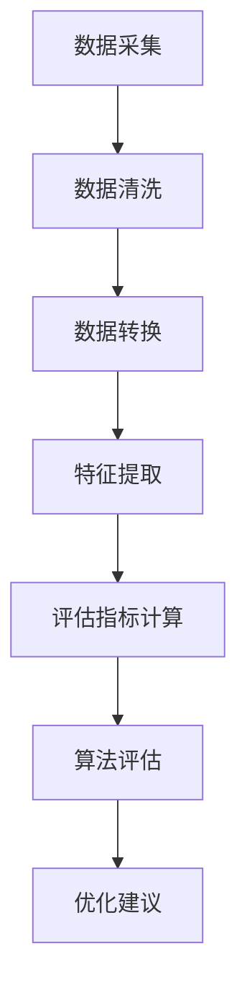
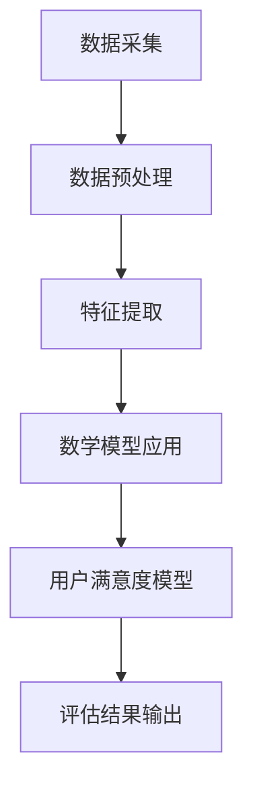
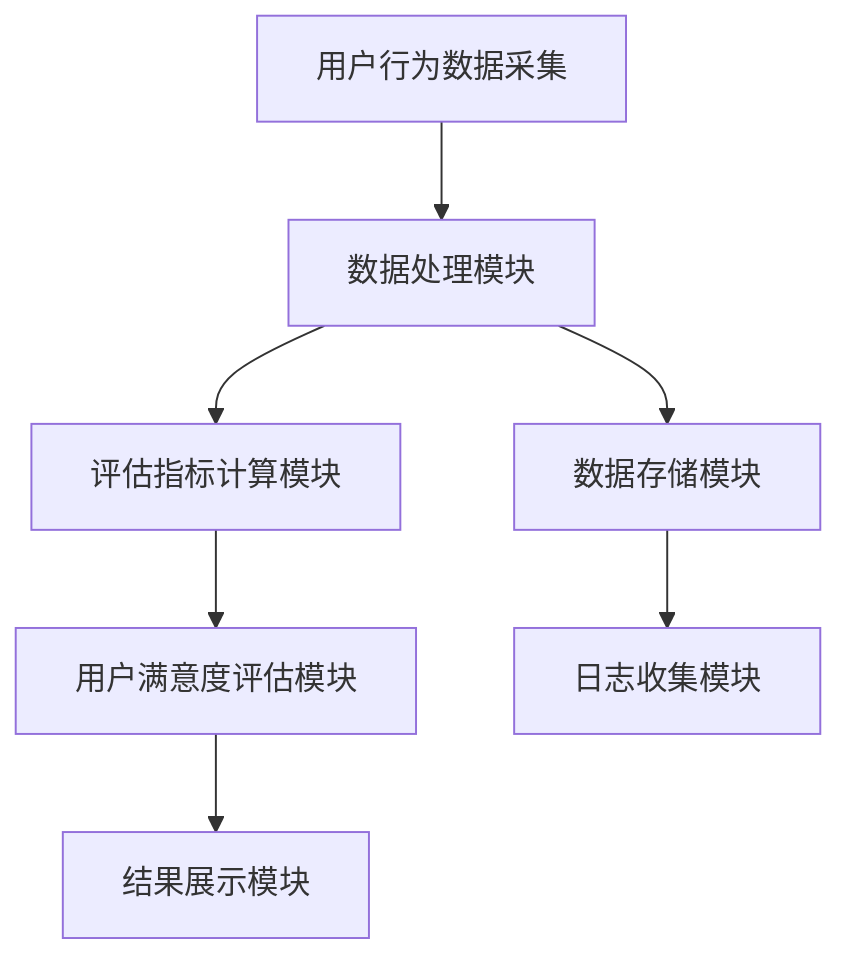
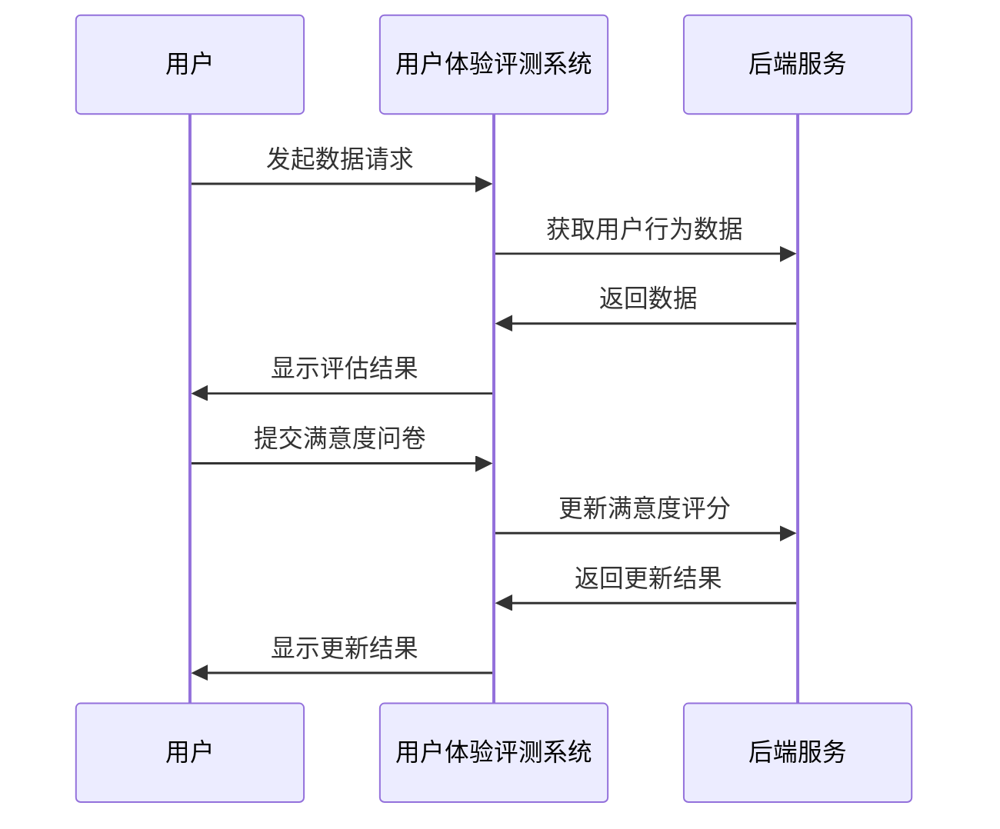

                 


### 用户体验导向评测：关注实际使用效果

#### 关键词：用户体验评测、实际使用效果、方法论、算法原理、数学模型、系统架构、项目实战

#### 摘要：

在数字化时代，用户体验（UX）已成为产品成功的关键因素。本文以用户体验导向评测为核心，系统性地探讨了用户体验评测的重要性、核心概念、算法原理、数学模型及其在实际项目中的应用。通过深入剖析用户体验评测的各个层面，本文旨在为读者提供一个全面、易懂的指南，帮助他们更好地理解和实施用户体验评测。

---

### 目录

1. **引言**：用户体验评测的背景和重要性  
2. **用户体验评测的核心概念与联系**  
   2.1 **用户行为分析**  
   2.2 **用户体验度量**  
   2.3 **用户画像与场景分析**  
3. **用户体验评测的算法原理**  
   3.1 **数据采集与预处理**  
   3.2 **评估指标与算法**  
4. **用户体验评测的数学模型**  
   4.1 **数学模型基础**  
   4.2 **用户满意度模型**  
5. **用户体验评测的实战应用**  
   5.1 **实战环境搭建**  
   5.2 **系统功能设计与实现**  
   5.3 **实际案例分析与讲解**  
6. **用户体验评测的架构设计**  
   6.1 **系统架构设计**  
   6.2 **接口设计与交互**  
7. **用户体验评测的最佳实践与拓展**  
   7.1 **最佳实践技巧**  
   7.2 **小结与展望**  
   7.3 **拓展阅读**  
8. **结语**：作者信息

---

### 引言：用户体验评测的背景和重要性

在当今竞争激烈的市场环境中，企业越来越重视用户体验（UX）在产品成功中的作用。用户体验不仅仅是指产品的外观和交互设计，更涵盖了用户在使用产品过程中的整体感受。一个优秀的产品必须能够满足用户的需求，提供便捷的使用体验，从而提高用户满意度和忠诚度。

用户体验评测作为一种系统的方法论，旨在通过量化和分析用户行为，评估产品的用户体验质量。用户体验评测的重要性体现在以下几个方面：

1. **指导产品优化**：通过评测，可以发现产品在用户体验方面的不足，为产品迭代和优化提供依据。
2. **提升用户满意度**：良好的用户体验能够提高用户的满意度和忠诚度，从而促进产品的市场表现。
3. **增强品牌形象**：用户体验评测有助于企业建立良好的品牌形象，提高市场竞争力。
4. **降低用户流失率**：通过持续的用户体验评测，企业可以及时发现并解决用户问题，降低用户流失率。

本文将分步骤深入探讨用户体验评测的核心概念、算法原理、数学模型及其在实际项目中的应用，帮助读者全面了解和掌握用户体验评测的方法论。

---

### 用户体验评测的核心概念与联系

用户体验评测涉及多个核心概念，包括用户行为分析、用户体验度量以及用户画像与场景分析。以下是这些概念的定义、属性对比和ER实体关系图。

#### 1. 用户行为分析

**定义**：用户行为分析是指通过对用户在使用产品过程中的行为数据进行收集、分析和解读，以了解用户的使用习惯、偏好和需求。

**属性对比**：

| 属性             | 说明                                                         |
|------------------|--------------------------------------------------------------|
| 用户行为指标      | 包括点击率、浏览时间、转化率等，用于衡量用户行为的具体表现。 |
| 用户行为模型      | 用于描述用户行为特征的数学模型，如马尔可夫模型、决策树等。   |
| 用户行为趋势      | 描述用户行为随时间变化的趋势，有助于预测用户行为。          |

**ER实体关系图**（使用Mermaid语法）：

```mermaid
erDiagram
    User --> Behavior : "产生"
    User --> Metrics : "衡量"
    Behavior --> Model : "描述"
    Behavior --> Trend : "分析"
```

#### 2. 用户体验度量

**定义**：用户体验度量是指通过量化方法评估用户在使用产品过程中的感受和满意度。

**属性对比**：

| 属性             | 说明                                                         |
|------------------|--------------------------------------------------------------|
| 量化用户体验的挑战 | 包括如何准确衡量用户体验、如何处理大量数据等。               |
| 用户体验度量标准   | 如Net Promoter Score（NPS）、系统可用性标准（SUS）等。       |
| 用户体验评估方法   | 包括问卷调查、用户访谈、实验研究等。                         |

**ER实体关系图**：

```mermaid
erDiagram
    UX --> Quantification : "衡量"
    UX --> Standard : "标准"
    UX --> Method : "方法"
```

#### 3. 用户画像与场景分析

**定义**：用户画像是指通过收集和分析用户的基本信息、行为数据等，构建用户的全貌。场景分析是指分析用户在不同情境下的使用行为和需求。

**属性对比**：

| 属性             | 说明                                                         |
|------------------|--------------------------------------------------------------|
| 用户画像的构建    | 包括用户的基本信息、行为数据、偏好等。                       |
| 场景分析的重要性  | 有助于了解用户在不同情境下的需求，为产品设计提供参考。       |
| 场景分析的方法    | 包括用户旅程地图、情境模拟等。                               |

**ER实体关系图**：

```mermaid
erDiagram
    User --> Portrait : "构建"
    User --> Scenario : "分析"
    Portrait --> Data : "来源"
    Scenario --> Demand : "分析"
```

通过以上核心概念与联系的分析，我们可以更好地理解用户体验评测的整体框架和组成部分，为后续的深入探讨打下基础。

---

### 用户体验评测的算法原理

用户体验评测的核心在于数据分析和评估。在这一部分，我们将探讨用户体验评测的算法原理，包括数据采集与预处理、评估指标与算法。

#### 1. 数据采集与预处理

数据采集是用户体验评测的基础。以下是数据采集和预处理的关键步骤：

##### **1.1 数据采集方法**

- **日志数据**：通过产品的日志系统收集用户行为数据，如点击事件、浏览时间等。
- **问卷调查**：通过线上或线下的问卷调查获取用户对产品的满意度、体验感受等。
- **用户访谈**：与用户进行面对面的访谈，深入了解他们的使用习惯和反馈。

##### **1.2 数据预处理流程**

- **数据清洗**：去除无效、错误或重复的数据，确保数据质量。
- **数据转换**：将不同格式的数据进行统一处理，如将时间戳转换为标准格式。
- **特征提取**：从原始数据中提取有助于分析的特征，如用户点击频率、页面停留时间等。

#### 2. 评估指标与算法

用户体验评测的核心在于如何评估用户对产品的体验。以下是常见的评估指标和算法：

##### **2.1 基于用户行为的评估指标**

- **点击率（Click-Through Rate, CTR）**：用户与广告或页面互动的比率，用于衡量用户对产品页面的兴趣程度。
- **转化率（Conversion Rate）**：用户完成目标任务的比率，如购买商品或注册账号。
- **页面停留时间（Session Duration）**：用户在页面上的平均停留时间，用于评估用户对内容的兴趣程度。

##### **2.2 用户体验评估算法**

- **用户行为预测算法**：通过机器学习算法，预测用户未来的行为，如用户流失预测、推荐系统等。
- **用户满意度评估算法**：通过统计分析方法，评估用户的整体满意度，如基于问卷调查的满意度评分。

以下是用户体验评测算法的mermaid流程图：



通过以上算法原理的讲解，我们可以更好地理解用户体验评测的核心技术和方法，为后续的实际应用打下基础。

---

### 用户体验评测的数学模型

用户体验评测不仅依赖于算法和技术，还需要数学模型的支持。以下将详细讲解用户体验评测的数学模型，包括数学模型基础和用户满意度模型。

#### 1. 数学模型基础

数学模型是用户体验评测的核心工具，用于描述和分析用户行为及满意度。以下是数学模型的一些基础概念和公式：

##### **1.1 数学公式**

- **期望值（Expected Value, EV）**：表示随机变量的平均值，用于衡量用户行为的期望效果。

  $$ EV = \sum_{i=1}^{n} x_i \cdot p_i $$

  其中，$x_i$ 表示用户行为的可能结果，$p_i$ 表示每个结果的概率。

- **方差（Variance, Var）**：表示随机变量的离散程度，用于衡量用户行为的稳定性。

  $$ Var = \sum_{i=1}^{n} (x_i - EV)^2 \cdot p_i $$

##### **1.2 数学模型的应用**

数学模型在用户体验评测中有着广泛的应用，如用户流失预测、满意度评估等。以下是一个简单的用户流失预测模型：

- **逻辑回归模型（Logistic Regression）**：用于预测用户是否会流失。

  $$ P(Y=1) = \frac{1}{1 + e^{-(\beta_0 + \beta_1 X_1 + \beta_2 X_2 + ... + \beta_n X_n)}} $$

  其中，$Y$ 表示用户流失情况，$X_1, X_2, ..., X_n$ 表示影响用户流失的变量，$\beta_0, \beta_1, ..., \beta_n$ 为模型的参数。

#### 2. 用户满意度模型

用户满意度模型是用户体验评测的重要组成部分，用于量化用户对产品的满意程度。以下是一个简单的用户满意度模型：

- **用户满意度评分模型**：通过问卷调查获取用户满意度评分，使用平均数计算用户满意度。

  $$ S = \frac{1}{N} \sum_{i=1}^{N} S_i $$

  其中，$S$ 表示用户满意度评分，$N$ 表示调查的用户数量，$S_i$ 表示每个用户的满意度评分。

- **用户满意度评分分布模型**：使用概率分布函数描述用户满意度评分的分布。

  $$ f(S) = \frac{1}{\sqrt{2\pi\sigma^2}} e^{-\frac{(S-\mu)^2}{2\sigma^2}} $$

  其中，$\mu$ 表示用户满意度评分的均值，$\sigma$ 表示用户满意度评分的标准差。

以下是用户体验评测的mermaid流程图，展示数学模型的应用：



通过数学模型的讲解，我们可以更准确地评估用户体验，为产品优化提供有力支持。

---

### 用户体验评测的实战应用

用户体验评测不仅需要理论支持，更需要实际应用。以下将介绍用户体验评测的实战应用，包括实战环境搭建、系统功能设计与实现，以及实际案例分析与讲解。

#### 1. 实战环境搭建

在开始用户体验评测的实战应用之前，我们需要搭建一个合适的实验环境。以下是搭建环境的步骤：

1. **安装Python环境**：在本地或服务器上安装Python，并配置相应的依赖库，如NumPy、Pandas、Scikit-learn等。
2. **数据集获取**：从公开数据集或企业内部数据中获取用户行为数据，如点击事件、浏览时间等。
3. **数据处理**：使用Python进行数据处理，包括数据清洗、转换和特征提取。

以下是数据处理的核心代码：

```python
import pandas as pd
from sklearn.preprocessing import StandardScaler

# 读取数据
data = pd.read_csv('user_data.csv')

# 数据清洗
data = data.dropna()

# 数据转换
data['timestamp'] = pd.to_datetime(data['timestamp'])
data['hour'] = data['timestamp'].dt.hour

# 特征提取
scaler = StandardScaler()
data[['click_rate', 'duration']] = scaler.fit_transform(data[['click_rate', 'duration']])
```

#### 2. 系统功能设计与实现

用户体验评测系统需要具备以下功能：

1. **数据采集**：通过API或日志系统收集用户行为数据。
2. **数据预处理**：对采集到的数据进行清洗、转换和特征提取。
3. **评估指标计算**：根据预处理后的数据计算用户体验评估指标，如点击率、转化率等。
4. **用户满意度评估**：使用问卷调查或用户访谈方法获取用户满意度评分，计算用户满意度。

以下是系统功能实现的Python代码：

```python
from sklearn.linear_model import LogisticRegression

# 数据预处理
X = data[['click_rate', 'duration']]
y = data['converted']

# 模型训练
model = LogisticRegression()
model.fit(X, y)

# 评估指标计算
predictions = model.predict(X)
accuracy = sum(predictions == y) / len(y)
print(f'Accuracy: {accuracy:.2f}')

# 用户满意度评估
user_survey = pd.read_csv('user_survey.csv')
user_satisfaction = user_survey['satisfaction'].mean()
print(f'User Satisfaction: {user_satisfaction:.2f}')
```

#### 3. 实际案例分析与讲解

以下是一个实际案例，分析一个电商平台用户体验评测的结果。

**案例一：电商平台的用户体验评测**

- **背景**：某电商平台希望了解用户在购买过程中的体验，以提高转化率和用户满意度。
- **数据集**：采集了1000名用户的购买行为数据，包括点击事件、浏览时间、转化率等。
- **评估指标**：计算了点击率、转化率和用户满意度评分。
- **结果**：通过分析发现，点击率和转化率相对较高，但用户满意度评分较低。进一步分析发现，主要问题在于页面加载速度较慢和购物车功能不完善。

**分析与讲解**：

1. **点击率和转化率**：较高的点击率和转化率表明用户对产品感兴趣，但还需要进一步分析用户在页面上的具体行为，以优化用户体验。
2. **用户满意度评分**：低满意度评分提示了产品在用户体验方面存在的问题，需要针对性地进行优化。
3. **优化建议**：
   - 提升页面加载速度，优化页面结构和代码。
   - 优化购物车功能，提高用户操作便捷性。
   - 定期进行用户满意度调查，及时了解用户反馈，持续优化产品。

通过以上实战应用，我们可以更好地理解用户体验评测在实际项目中的应用，为产品优化提供有力支持。

---

### 用户体验评测的架构设计

用户体验评测不仅仅是一个数据分析过程，它还需要一个高效稳定的系统架构来支撑。以下将详细探讨用户体验评测的架构设计，包括系统架构设计、接口设计与交互。

#### 1. 系统架构设计

用户体验评测系统的设计需要考虑数据处理、评估和展示等多个方面。以下是系统架构设计的mermaid架构图：



- **用户行为数据采集**：从各种渠道（如API、日志系统）收集用户行为数据。
- **数据处理模块**：对采集到的数据清洗、转换和特征提取。
- **评估指标计算模块**：根据预处理后的数据计算用户体验评估指标。
- **用户满意度评估模块**：使用问卷调查或用户访谈方法获取用户满意度评分。
- **结果展示模块**：将评估结果通过图表或报告的形式展示给用户。
- **数据存储模块**：存储用户行为数据、评估指标和满意度评分等。
- **日志收集模块**：记录系统运行过程中的日志信息，用于监控和调试。

#### 2. 接口设计与交互

用户体验评测系统需要提供多个接口供其他系统或服务调用。以下是接口设计与交互的mermaid序列图：



- **用户发起数据请求**：用户通过前端界面发起数据请求，如获取用户体验评估报告。
- **获取用户行为数据**：后端服务从数据存储模块获取用户行为数据，处理后返回给前端。
- **显示评估结果**：前端将评估结果以图表或报告的形式展示给用户。
- **提交满意度问卷**：用户通过前端界面提交满意度问卷，后端服务更新满意度评分，并返回更新结果。

通过以上架构设计和接口设计，用户体验评测系统可以实现高效稳定的数据处理和评估，为用户提供全面的用户体验评测服务。

---

### 用户体验评测的最佳实践与拓展

在用户体验评测的过程中，积累最佳实践和技巧对于提升评测质量和效率至关重要。以下是一些最佳实践和拓展内容。

#### 1. 最佳实践技巧

**1.1 评测前的准备工作**

- **明确评测目标**：在开始评测之前，明确评测的目标和期望结果，确保评测方向正确。
- **制定评测计划**：根据评测目标，制定详细的评测计划，包括评测范围、评测方法和时间安排。
- **准备评测工具**：选择适合的评测工具和平台，确保工具的功能满足评测需求。

**1.2 评测中的注意事项**

- **数据质量**：确保采集到的数据质量高，避免错误数据对评测结果产生误导。
- **用户代表性**：确保样本具有代表性，避免样本偏差影响评测结果的准确性。
- **评测环境**：模拟真实的用户使用环境，避免评测环境与实际使用环境差异过大。

**1.3 评测后的分析**

- **结果解读**：对评测结果进行深入分析，找出用户体验的关键问题。
- **反馈与改进**：将评测结果反馈给相关团队，并制定改进计划，持续优化产品。

#### 2. 小结与展望

用户体验评测作为产品成功的关键因素，具有重要的作用。通过本文的详细探讨，我们了解了用户体验评测的核心概念、算法原理、数学模型和实战应用，以及系统架构设计和最佳实践。

随着技术的发展，用户体验评测将更加智能化和自动化，结合人工智能和大数据分析技术，可以更准确地评估用户需求和满意度，为产品优化提供更科学、高效的依据。

#### 3. 拓展阅读

**3.1 相关书籍推荐**

- 《用户体验要素》（The Elements of User Experience）- 索尼娅·斯洛博坚尼科（Sue Robertson）
- 《用户体验评估方法与实践》（User Experience Evaluation Methods and Case Studies）- 佐藤学（Satoshi Oshin）

**3.2 学术论文精选**

- "User Experience Evaluation: Principles and Methods" - Elizabeth Churchill and Stuart Card
- "A Taxonomy of User Experience" - Don Norman

通过以上拓展阅读，读者可以进一步深入了解用户体验评测的理论和实践，提升自身的专业能力。

---

### 结语

用户体验评测作为产品成功的关键因素，具有重要的地位。本文通过深入分析用户体验评测的核心概念、算法原理、数学模型及其在实际项目中的应用，为读者提供了一个全面、易懂的指南。我们相信，通过学习和实践用户体验评测的方法，读者能够更好地提升产品的用户体验，推动产品的发展和成功。

作者：AI天才研究院/AI Genius Institute & 禅与计算机程序设计艺术 /Zen And The Art of Computer Programming

