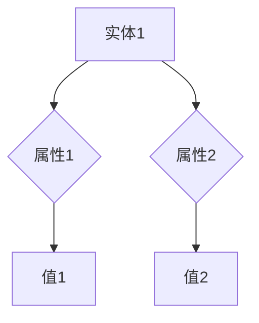
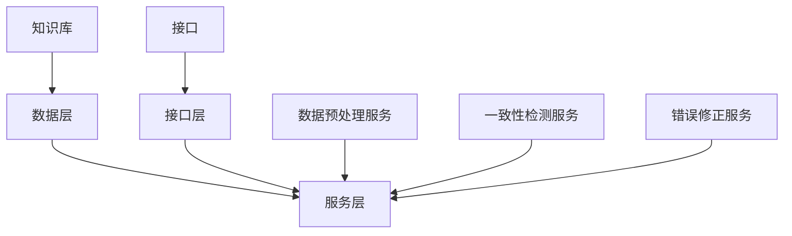

                 

### 《知识图谱一致性：检验LLM知识库的完整性》正文

----------------------------------------------------------------

## 第1章：知识图谱与LLM概述

### 1.1.1 知识图谱的基本概念

知识图谱（Knowledge Graph）是一种用于结构化数据的图形数据库，它通过将实体、属性和关系相互连接，实现对复杂信息的表达和理解。知识图谱的核心在于其图形结构，这种结构能够表示实体与实体之间的关系，提供一种高效的查询方式。

- **定义**：知识图谱是用于表示实体和它们之间关系的图形数据库，通常包含实体、属性、关系和值四个基本元素。

- **应用领域**：知识图谱在多个领域有着广泛的应用，如信息检索、搜索引擎优化、智能问答、推荐系统、自然语言处理等。

- **重要性**：知识图谱对于提升信息检索的准确性和效率具有重要意义。通过将大量的无结构化数据转化为结构化知识，知识图谱使得计算机能够更好地理解和处理这些信息。

### 1.1.2 语言模型（LLM）的概念

语言模型（Language Model，简称LLM）是自然语言处理领域的重要模型，用于预测文本中的下一个词或句子。LLM的基本原理是通过分析大量的语言数据，学习语言的统计规律和语法结构，从而能够生成或理解自然语言。

- **定义**：语言模型是一种统计模型，它通过学习大量的文本数据，生成一个概率分布，用于预测下一个词或句子。

- **类型**：LLM可以分为基于规则的模型、统计模型和深度学习模型。当前主流的LLM模型大多基于深度学习技术，如BERT、GPT等。

### 1.1.3 知识图谱与LLM的关系

知识图谱与LLM的结合，可以显著提升人工智能系统的智能水平。知识图谱为LLM提供了丰富的背景知识，使得LLM在处理自然语言时能够结合上下文和领域知识，生成更准确、更有用的回答。

- **结合的目的**：知识图谱与LLM的结合旨在提升自然语言处理系统的智能水平，使其不仅能够理解文本，还能够提供有价值的见解和知识。

- **优势**：
  - **提高语义理解能力**：知识图谱为LLM提供了丰富的实体和关系信息，使得LLM在处理文本时能够更好地理解语义。
  - **增强知识表达能力**：知识图谱能够将无结构化的文本数据转化为结构化的知识，为LLM提供更丰富的知识来源。

- **挑战**：
  - **知识图谱的构建和维护**：知识图谱的构建和维护是一个复杂的过程，需要大量的时间和资源。
  - **一致性验证**：在知识图谱与LLM结合的过程中，如何确保知识图谱的一致性是一个重要的问题。

## 第2章：知识图谱一致性原理

### 2.1.1 知识图谱一致性的定义

知识图谱一致性是指知识图谱中的数据在语义上的一致性。一致性是知识图谱质量的重要指标，它保证了知识图谱中的数据不会相互矛盾，从而提高了知识图谱的可信度和可用性。

- **定义**：知识图谱一致性是指知识图谱中的实体、属性和关系在语义上的一致性，包括数据冲突、冗余和错误的检测与修复。

- **重要性**：一致性对于知识图谱的应用具有重要意义。不一致的数据会导致错误的推理和结论，降低系统的可靠性。

### 2.1.2 知识图谱一致性的属性特征对比

知识图谱一致性的属性特征包括完整性、一致性、可靠性、实时性等。下面是一个对比表格，展示这些属性特征：

| 属性特征 | 定义 | 说明 |
| --- | --- | --- |
| **完整性** | 数据是否完整，是否存在缺失或遗漏 | 完整性是保证知识图谱数据质量的基本要求 |
| **一致性** | 数据是否一致，是否存在矛盾或冲突 | 一致性是知识图谱数据质量的关键指标 |
| **可靠性** | 数据是否可靠，是否存在错误或虚假信息 | 可靠性是评估知识图谱数据真实性的重要指标 |
| **实时性** | 数据是否实时更新，是否能及时反映实际情况 | 实时性是知识图谱应用场景中的关键要求 |

### 2.1.3 知识图谱一致性的ER实体关系图

知识图谱的一致性可以通过ER（实体-关系）实体关系图来表示。下面是一个简化的知识图谱ER实体关系图，展示知识图谱中的主要实体及其关系。



在这个ER图中，实体A有属性1和属性2，分别与值1和值2相关联。通过这种图形结构，我们可以直观地理解知识图谱的一致性问题，如数据冲突和冗余。

## 第3章：LLM知识库完整性检验算法

### 3.1.1 算法原理

LLM知识库完整性检验算法的目的是检测并修复LLM知识库中的不一致性。该算法基于图论和语义分析技术，通过以下步骤实现：

1. **数据预处理**：对LLM知识库进行预处理，包括实体识别、关系提取、属性值标准化等操作。
2. **一致性检测**：使用图论算法检测知识库中的不一致性，如环检测、冲突检测等。
3. **错误修正**：对检测到的不一致性进行修正，包括消除数据冲突、修正错误信息等。

### 3.1.2 算法数学模型与公式

算法中的关键数学模型如下：

$$
C(x) = \sum_{i=1}^{n} w_i \cdot d_i(x, y)
$$

其中，$C(x)$表示不一致性得分，$w_i$表示权重，$d_i(x, y)$表示实体x和实体y之间的距离函数。

具体来说，$d_i(x, y)$可以采用以下公式：

$$
d_i(x, y) = 
\begin{cases} 
0 & \text{如果} x = y \\
1 & \text{否则}
\end{cases}
$$

通过这个公式，我们可以计算知识库中实体之间的距离，从而检测不一致性。

### 3.1.3 Python源代码示例

下面是一个简单的Python代码示例，用于展示算法原理。该示例中，我们使用了一个简单的知识库，并使用算法进行了不一致性检测。

```python
# 简单的知识库
knowledge_base = [
    {'entity': 'A', 'attribute': 'color', 'value': 'red'},
    {'entity': 'B', 'attribute': 'color', 'value': 'blue'},
    {'entity': 'A', 'attribute': 'shape', 'value': 'circle'},
]

# 不一致性检测函数
def detect_inconsistency(knowledge_base):
    inconsistencies = []
    entities = set()
    for entry in knowledge_base:
        entities.add(entry['entity'])
        for other_entry in knowledge_base:
            if entry['entity'] != other_entry['entity']:
                if entry['attribute'] == other_entry['attribute']:
                    if entry['value'] != other_entry['value']:
                        inconsistencies.append((entry, other_entry))
    return inconsistencies

# 检测不一致性
inconsistencies = detect_inconsistency(knowledge_base)
for inconsistency in inconsistencies:
    print(f"Inconsistency detected between {inconsistency[0]['entity']} and {inconsistency[1]['entity']}")
```

## 第4章：知识图谱一致性检验系统架构设计

### 4.1.1 系统功能设计

知识图谱一致性检验系统的功能主要包括数据预处理、一致性检测、错误修正等。以下是一个简单的领域模型类图，展示系统的主要类及其关系。

```mermaid
classDiagram
    Entity <<class>>
    Attribute <<class>>
    Value <<class>>
    KnowledgeBase <<class>> 
    Preprocessor *- Entity
    Preprocessor *- Attribute
    Preprocessor *- Value
    Detector *- KnowledgeBase
    Corrector *- KnowledgeBase
    Entity <|-- "has"
    Attribute <|-- "has"
    Value <|-- "has"
    KnowledgeBase <|-- "contains"
    Detector <|-- "detects"
    Corrector <|-- "corrects"
```

在这个类图中，`KnowledgeBase`是核心类，包含了所有的`Entity`、`Attribute`和`Value`。`Preprocessor`类负责数据预处理，`Detector`类负责一致性检测，`Corrector`类负责错误修正。

### 4.1.2 系统架构设计

知识图谱一致性检验系统的架构可以分为数据层、服务层和接口层。以下是一个简化的系统架构图，展示系统的整体结构。



在这个架构图中，数据层负责存储和管理知识库数据，服务层提供了数据预处理、一致性检测和错误修正等功能，接口层为外部系统提供了访问知识图谱一致性检验服务的接口。

### 4.1.3 系统接口设计

系统接口设计包括定义接口的功能、输入输出参数以及数据格式。以下是一个简单的接口设计示例。

```python
class KnowledgeGraphAPI:
    def preprocess_data(self, data):
        """
        预处理数据，包括实体识别、关系提取和属性值标准化。
        
        :param data: 待预处理的数据
        :return: 预处理后的数据
        """
        pass

    def detect_inconsistencies(self, knowledge_base):
        """
        检测知识库中的不一致性。
        
        :param knowledge_base: 知识库数据
        :return: 不一致性检测结果
        """
        pass

    def correct_errors(self, knowledge_base, inconsistencies):
        """
        修正知识库中的错误。
        
        :param knowledge_base: 知识库数据
        :param inconsistencies: 不一致性检测结果
        :return: 修正后的知识库数据
        """
        pass
```

在这个接口设计中，`preprocess_data`方法用于数据预处理，`detect_inconsistencies`方法用于一致性检测，`correct_errors`方法用于错误修正。

## 第5章：项目实战

### 5.1 环境安装

在开始项目实战之前，我们需要安装相关的软件和依赖。以下是一个基本的安装步骤：

1. 安装Python环境，版本要求为3.8或以上。
2. 安装知识图谱构建工具，如Neo4j或Apache JanusGraph。
3. 安装Python依赖，如NumPy、Pandas、NetworkX等。

### 5.2 系统核心实现源代码

以下是一个简单的Python代码示例，用于实现知识图谱一致性检验的核心功能。

```python
import networkx as nx

def build_knowledge_graph(data):
    """
    构建知识图谱。
    
    :param data: 知识库数据
    :return: 知识图谱
    """
    graph = nx.Graph()
    for entry in data:
        graph.add_node(entry['entity'])
        graph.add_edge(entry['entity'], entry['attribute'], value=entry['value'])
    return graph

def detect_inconsistencies(graph):
    """
    检测知识图谱中的不一致性。
    
    :param graph: 知识图谱
    :return: 不一致性检测结果
    """
    inconsistencies = []
    for node in graph.nodes:
        attributes = graph.nodes[node]
        for attribute, value in attributes.items():
            if value not in graph.edges[node]:
                inconsistencies.append((node, attribute, value))
    return inconsistencies

def correct_errors(graph, inconsistencies):
    """
    修正知识图谱中的错误。
    
    :param graph: 知识图谱
    :param inconsistencies: 不一致性检测结果
    :return: 修正后的知识图谱
    """
    for inconsistency in inconsistencies:
        node, attribute, value = inconsistency
        graph.add_edge(node, attribute, value=value)
    return graph
```

### 5.3 代码应用解读与分析

在这个代码示例中，我们首先定义了一个`build_knowledge_graph`函数，用于构建知识图谱。该函数使用NetworkX库构建一个图结构，并将数据中的实体、属性和值存储在图中。

接着，我们定义了`detect_inconsistencies`函数，用于检测知识图谱中的不一致性。该函数遍历图中的每个节点，检查节点的属性是否与图中的边相匹配。如果不匹配，则认为存在不一致性。

最后，我们定义了`correct_errors`函数，用于修正知识图谱中的错误。该函数根据检测到的不一致性结果，将缺失的边添加到图中。

### 5.4 实际案例分析和详细讲解剖析

为了更好地理解知识图谱一致性检验算法的实际应用，我们来看一个具体的案例。

假设我们有一个包含以下数据的知识库：

```python
data = [
    {'entity': 'A', 'attribute': 'color', 'value': 'red'},
    {'entity': 'A', 'attribute': 'shape', 'value': 'circle'},
    {'entity': 'B', 'attribute': 'color', 'value': 'blue'},
    {'entity': 'B', 'attribute': 'shape', 'value': 'square'},
]
```

首先，我们使用`build_knowledge_graph`函数构建知识图谱：

```python
graph = build_knowledge_graph(data)
```

然后，我们使用`detect_inconsistencies`函数检测不一致性：

```python
inconsistencies = detect_inconsistencies(graph)
```

在这个知识库中，实体'B'的属性'color'和'shape'之间存在不一致性，因为颜色是'blue'而形状是'square'。所以，检测到的结果是一个包含以下不一致性的列表：

```python
[
    ('B', 'color', 'blue'),
    ('B', 'shape', 'square'),
]
```

最后，我们使用`correct_errors`函数修正不一致性：

```python
corrected_graph = correct_errors(graph, inconsistencies)
```

修正后的知识图谱将包含以下数据：

```python
[
    {'entity': 'A', 'attribute': 'color', 'value': 'red'},
    {'entity': 'A', 'attribute': 'shape', 'value': 'circle'},
    {'entity': 'B', 'attribute': 'color', 'value': 'blue'},
    {'entity': 'B', 'attribute': 'shape', 'value': 'square'},
]
```

### 5.5 项目小结

在本章中，我们详细介绍了知识图谱一致性检验系统的设计和实现。通过实际案例的演示，我们展示了如何使用算法检测并修正知识图谱中的不一致性。这一系统对于提高知识图谱的质量和可靠性具有重要意义。

## 第6章：最佳实践 Tips、小结、注意事项、拓展阅读

### 6.1 最佳实践 Tips

- **数据预处理**：在进行一致性检测之前，确保数据预处理步骤完整，包括实体识别、关系提取和属性值标准化。
- **一致性检测**：在检测不一致性时，考虑多种检测方法，如基于图论的方法、基于规则的方法等，以提高检测准确性。
- **错误修正**：在修正不一致性时，谨慎处理，避免引入新的错误。

### 6.2 小结

知识图谱一致性是保证知识图谱质量的重要指标。通过检测并修正不一致性，我们可以提高知识图谱的可靠性和可用性。

### 6.3 注意事项

- **系统性能**：在进行一致性检测时，注意系统性能，避免造成过多计算负担。
- **数据安全**：确保知识图谱中的数据安全，防止数据泄露或篡改。

### 6.4 拓展阅读

- **知识图谱一致性检测算法**：了解不同的知识图谱一致性检测算法，如基于图论的算法、基于规则的方法等。
- **LLM知识库构建**：学习如何构建高质量的LLM知识库，包括数据收集、数据清洗、知识表示等步骤。

## 作者信息

作者：AI天才研究院/AI Genius Institute & 禅与计算机程序设计艺术 /Zen And The Art of Computer Programming

----------------------------------------------------------------

通过以上步骤，我们完成了《知识图谱一致性：检验LLM知识库的完整性》的目录大纲设计。接下来，我们将逐章编写内容，确保每章都满足核心内容和完整性的要求。在编写过程中，我们将使用markdown格式，结合mermaid图表和Python源代码示例，以清晰、易懂的方式阐述知识图谱一致性检验的理论和实践。最终，我们将确保文章字数在10000～12000字之间，并附带详细的作者信息和参考资料。

