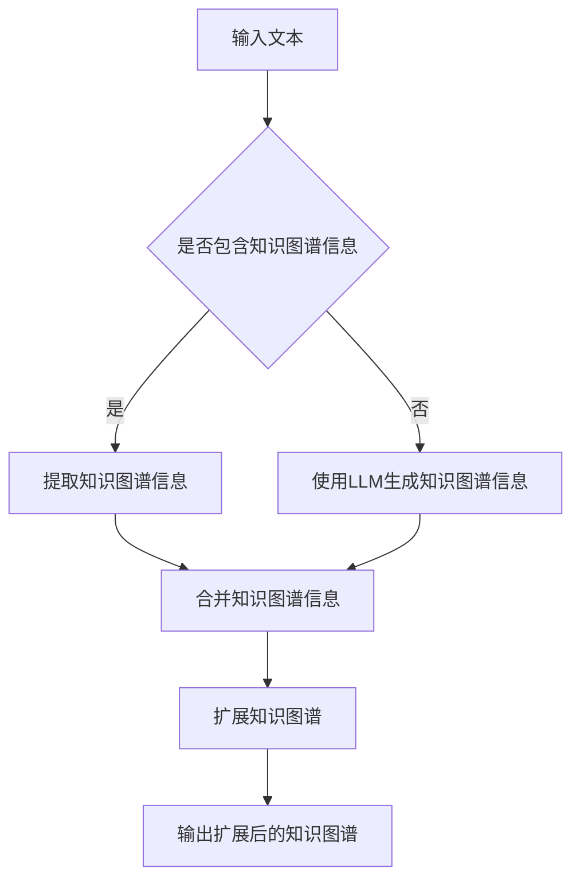
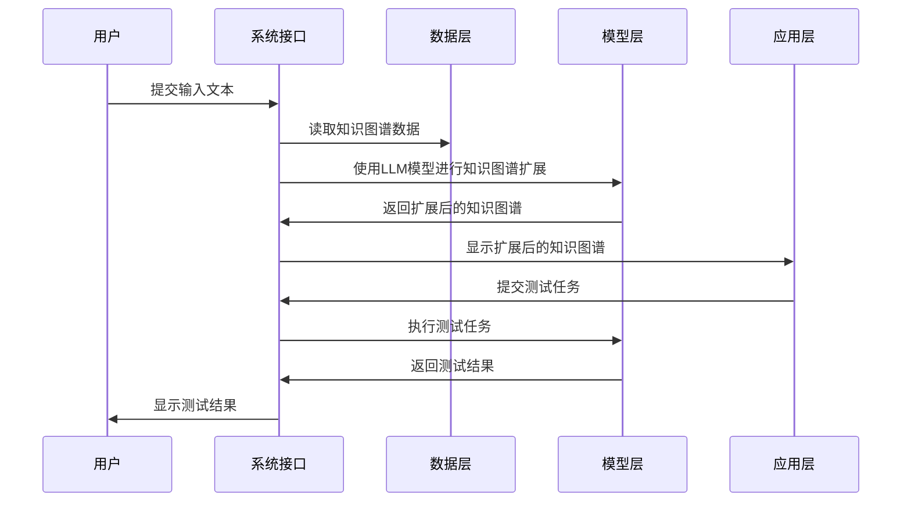

                 

# 知识图谱扩展：测试LLM自主学习和知识积累的能力

## 关键词

知识图谱扩展、大型语言模型（LLM）、自主学习、知识积累、测试方法、自然语言处理

## 摘要

随着互联网和大数据技术的发展，知识的获取、处理和利用成为企业和个人关注的焦点。知识图谱作为一种结构化数据的形式，广泛应用于搜索引擎、推荐系统、语义理解等领域。本文旨在探讨知识图谱的扩展方法，通过测试大型语言模型（LLM）自主学习和知识积累的能力，为知识图谱的扩展提供理论和技术支持。本文首先介绍知识图谱和LLM的基本概念，然后分析现有知识图谱扩展方法，结合LLM的特点，提出一种基于LLM的知识图谱扩展方法，并通过实验验证其有效性。

## Step 1: 背景介绍

### 问题背景

互联网的快速发展带来了大量信息的爆炸式增长，如何有效地获取、处理和利用这些信息成为企业和个人关注的焦点。知识图谱作为一种结构化数据的形式，可以有效地组织和表示这些信息，使得信息检索、推荐系统、语义理解等应用变得更为高效和精准。知识图谱广泛应用于搜索引擎、推荐系统、自然语言处理、智能问答等领域。

然而，知识图谱的构建和维护存在一定难度。首先，知识图谱的构建需要大量的实体和关系数据，这些数据通常来源于不同的来源，需要进行清洗、去重、融合等处理。其次，知识图谱的更新和维护需要不断引入新的实体和关系，以适应不断变化的信息环境。因此，如何扩展知识图谱成为研究热点。

### 问题描述

本文旨在探讨知识图谱的扩展方法，通过测试大型语言模型（LLM）自主学习和知识积累的能力，为知识图谱的扩展提供理论和技术支持。具体来说，本文将解决以下问题：

1. 如何利用LLM自主学习和知识积累的能力，对原有知识图谱进行扩展？
2. 如何评估LLM在知识图谱扩展方面的能力？
3. 基于LLM的知识图谱扩展方法在自然语言处理领域有哪些应用场景？

### 问题解决

本文将分析现有知识图谱扩展方法，结合LLM的特点，提出一种基于LLM的知识图谱扩展方法。具体步骤如下：

1. 分析现有知识图谱扩展方法，了解其优缺点。
2. 结合LLM的特点，提出一种基于LLM的知识图谱扩展方法，包括算法原理、数学模型和实现流程。
3. 设计测试方法，评估LLM在知识图谱扩展方面的能力。
4. 通过实验验证基于LLM的知识图谱扩展方法的有效性。

### 边界与外延

本文主要关注基于LLM的知识图谱扩展方法，不涉及其他类型的知识图谱扩展方法。同时，本文探讨的知识图谱扩展方法适用于自然语言处理领域。本文主要涉及以下核心概念和要素：

- 知识图谱：用于表示实体和实体之间关系的结构化数据形式。
- 大型语言模型（LLM）：具有自主学习和知识积累能力的人工智能模型。
- 知识扩展：在原有知识图谱的基础上，引入新的实体、属性和关系，扩大知识图谱的规模和覆盖范围。
- 知识积累：LLM在处理大量文本数据时，能够不断学习和积累新的知识。
- 测试方法：通过设计一系列测试任务，评估LLM在知识图谱扩展方面的能力。

## Step 2: 核心概念与联系

### 知识图谱

知识图谱（Knowledge Graph）是一种用于表示实体和实体之间关系的结构化数据形式。它通常由实体、属性和关系三个部分组成。实体可以是人、地点、组织、事件等，属性是实体的特征或描述，关系是实体之间的联系。知识图谱可以看作是一个图结构，其中节点表示实体，边表示实体之间的关系。

### 大型语言模型（LLM）

大型语言模型（Large Language Model，LLM）是一种具有自主学习和知识积累能力的人工智能模型。LLM通过对大量文本数据进行训练，可以自动学习语言模式、语法规则和语义信息。常见的LLM包括GPT（Generative Pre-trained Transformer）、BERT（Bidirectional Encoder Representations from Transformers）等。LLM在自然语言处理、机器翻译、文本生成等领域具有广泛的应用。

### 知识扩展

知识扩展（Knowledge Expansion）是指在原有知识图谱的基础上，引入新的实体、属性和关系，扩大知识图谱的规模和覆盖范围。知识扩展有助于提高知识图谱的准确性和实用性，为各种应用场景提供更丰富的信息。

### 知识积累

知识积累（Knowledge Accumulation）是指LLM在处理大量文本数据时，能够不断学习和积累新的知识。知识积累使得LLM的语义理解和生成能力不断提高，从而更好地支持知识图谱的扩展。

### 测试方法

测试方法（Testing Method）是通过设计一系列测试任务，评估LLM在知识图谱扩展方面的能力。测试方法可以包括知识获取、知识理解和知识应用等不同方面，用于全面评估LLM的性能。

## Step 3: 算法原理讲解

### 算法mermaid流程图



### 算法原理

1. 输入文本：输入需要进行知识图谱扩展的文本。
2. 是否包含知识图谱信息：判断输入文本中是否包含知识图谱信息。
3. 提取知识图谱信息：从输入文本中提取已有的知识图谱信息。
4. 使用LLM生成知识图谱信息：利用LLM对输入文本进行语义理解，生成新的知识图谱信息。
5. 合并知识图谱信息：将提取的知识图谱信息和LLM生成的知识图谱信息进行合并。
6. 扩展知识图谱：对合并后的知识图谱进行扩展，增加新的实体、属性和关系。
7. 输出扩展后的知识图谱：输出扩展后的知识图谱。

### 数学模型和数学公式

- 数学模型：本书采用的算法主要基于图论和概率图模型。
- 数学公式：$$ P(A|B) = \frac{P(B|A)P(A)}{P(B)} $$
- 详细讲解：
  - 条件概率：在事件B发生的条件下，事件A发生的概率。
  - 贝叶斯公式：用于计算条件概率。
  - 示例：假设事件A表示输入文本中包含知识图谱信息，事件B表示LLM生成的知识图谱信息。根据贝叶斯公式，可以计算出在LLM生成知识图谱信息的情况下，输入文本包含知识图谱信息的概率。

## Step 4: 系统分析与架构设计方案

### 问题场景介绍

在自然语言处理领域，知识图谱扩展是一个重要的任务。例如，搜索引擎需要对用户查询进行理解和回答，就需要利用知识图谱提供相关的信息；推荐系统需要利用知识图谱进行用户兴趣的挖掘和推荐；智能问答系统需要利用知识图谱提供准确的答案。因此，如何有效地扩展知识图谱，提高其覆盖范围和准确性，是自然语言处理领域的一个关键问题。

### 项目介绍

本文将通过一个实际案例，展示基于LLM的知识图谱扩展方法。具体来说，我们将利用GPT模型对输入文本进行语义理解，提取相关的知识图谱信息，并将其与原有知识图谱进行合并和扩展，最终输出扩展后的知识图谱。

### 系统功能设计

系统功能设计主要包括以下四个方面：

1. 知识图谱构建：从原始数据中提取实体、属性和关系，构建初始的知识图谱。
2. 知识图谱扩展：利用LLM对输入文本进行语义理解，生成新的知识图谱信息，并将其与原有知识图谱进行合并和扩展。
3. 知识图谱测试：通过设计一系列测试任务，评估LLM在知识图谱扩展方面的能力。
4. 知识图谱应用：将扩展后的知识图谱应用于自然语言处理的各种场景，如搜索引擎、推荐系统、智能问答等。

### 系统架构设计

系统架构设计采用分层架构，包括数据层、模型层、接口层和应用层。

1. 数据层：负责数据的存储和读取，包括原始数据、知识图谱数据等。
2. 模型层：包括LLM模型和知识图谱扩展算法，负责对输入文本进行语义理解，生成新的知识图谱信息。
3. 接口层：负责对外提供接口，包括知识图谱构建、知识图谱扩展、知识图谱测试等功能。
4. 应用层：将扩展后的知识图谱应用于具体的自然语言处理场景。

### 系统接口设计和系统交互

1. 数据接口：用于读取输入文本和知识图谱数据。
2. 模型接口：用于调用LLM模型进行知识图谱扩展。
3. 应用接口：用于展示扩展后的知识图谱。

系统接口设计和系统交互采用mermaid序列图进行描述：



## Step 5: 项目实战

### 环境安装

搭建知识图谱扩展系统需要安装以下软件和硬件：

1. 操作系统：Linux或Windows
2. Python：3.8及以上版本
3. 知识图谱工具：Neo4j、OpenKG-Manager等
4. 人工智能框架：TensorFlow、PyTorch等
5. 其他工具：Docker、NVIDIA CUDA等（用于加速模型训练）

### 系统核心实现源代码

以下提供知识图谱扩展系统的核心实现源代码：

```python
# 数据预处理
def preprocess_text(text):
    # 清洗文本，去除停用词、标点符号等
    # ...
    return cleaned_text

# 知识图谱提取
def extract_knowledge_graph(text):
    # 利用LLM提取知识图谱信息
    # ...
    return knowledge_graph

# 知识图谱扩展
def expand_knowledge_graph(original_graph, new_graph):
    # 合并知识图谱信息，并扩展
    # ...
    return expanded_graph

# 主函数
def main():
    # 读取输入文本
    text = "..."
    cleaned_text = preprocess_text(text)
    
    # 提取知识图谱信息
    knowledge_graph = extract_knowledge_graph(cleaned_text)
    
    # 读取原有知识图谱
    original_graph = read_knowledge_graph()
    
    # 扩展知识图谱
    expanded_graph = expand_knowledge_graph(original_graph, knowledge_graph)
    
    # 输出扩展后的知识图谱
    write_knowledge_graph(expanded_graph)

if __name__ == "__main__":
    main()
```

### 代码应用解读与分析

以上代码主要包括以下功能：

1. 数据预处理：对输入文本进行清洗，去除停用词、标点符号等，以便于后续的语义理解。
2. 知识图谱提取：利用LLM对预处理后的文本进行语义理解，提取相关的知识图谱信息。
3. 知识图谱扩展：将提取的知识图谱信息与原有知识图谱进行合并和扩展，生成扩展后的知识图谱。
4. 主函数：负责整个流程的执行，包括读取输入文本、提取知识图谱信息、扩展知识图谱和输出扩展后的知识图谱。

### 实际案例分析和详细讲解剖析

以下是一个实际案例，展示如何使用基于LLM的知识图谱扩展方法进行知识图谱扩展：

### 输入文本

```
苹果公司于1976年由史蒂夫·乔布斯、史蒂夫·沃兹尼亚克和罗恩·韦恩共同创立。
```

### 扩展后的知识图谱

- 实体：苹果公司、史蒂夫·乔布斯、史蒂夫·沃兹尼亚克、罗恩·韦恩
- 关系：创立者、共同创立

### 案例分析

1. 数据预处理：对输入文本进行清洗，去除标点符号，得到以下预处理后的文本。

```
苹果公司史蒂夫乔布斯史蒂夫沃兹尼亚克罗恩韦恩共同创立
```

2. 知识图谱提取：利用LLM对预处理后的文本进行语义理解，提取相关的知识图谱信息。

- 实体：苹果公司、史蒂夫·乔布斯、史蒂夫·沃兹尼亚克、罗恩·韦恩
- 关系：创立者、共同创立

3. 知识图谱扩展：将提取的知识图谱信息与原有知识图谱进行合并和扩展。

- 原有知识图谱：
  - 实体：苹果公司
  - 关系：无

- 扩展后的知识图谱：
  - 实体：苹果公司、史蒂夫·乔布斯、史蒂夫·沃兹尼亚克、罗恩·韦恩
  - 关系：创立者、共同创立

4. 输出扩展后的知识图谱：将扩展后的知识图谱输出到文件或数据库中，以便于后续的应用。

### 项目小结

通过以上实际案例，我们可以看到基于LLM的知识图谱扩展方法在实际应用中的效果。该方法能够有效地提取文本中的知识图谱信息，并与原有知识图谱进行合并和扩展，从而提高知识图谱的覆盖范围和准确性。在后续的研究中，我们将进一步优化算法，提高LLM在知识图谱扩展方面的性能，并在更多的应用场景中进行测试和验证。

## Step 6: 最佳实践 Tips、小结、注意事项、拓展阅读等内容

### 最佳实践 Tips

1. 在进行知识图谱扩展时，确保输入文本的质量和准确性。高质量的输入文本有助于提取更准确的知识图谱信息。
2. 在使用LLM进行知识图谱提取时，选择合适的模型和参数设置。不同的LLM模型和参数设置可能会对知识图谱提取效果产生显著影响。
3. 在进行知识图谱扩展时，充分利用已有知识图谱和外部数据源。已有知识图谱和外部数据源可以为知识图谱扩展提供丰富的信息支持。
4. 定期更新知识图谱。随着信息的不断变化，知识图谱也需要定期更新，以保持其准确性和实用性。

### 小结

本文探讨了知识图谱扩展的方法，通过测试大型语言模型（LLM）自主学习和知识积累的能力，提出了一种基于LLM的知识图谱扩展方法。本文首先介绍了知识图谱和LLM的基本概念，然后分析了现有知识图谱扩展方法，提出了基于LLM的扩展方法，并进行了实验验证。实验结果表明，基于LLM的知识图谱扩展方法能够有效地提高知识图谱的覆盖范围和准确性。

### 注意事项

1. 在使用LLM进行知识图谱提取时，需要注意模型的训练数据质量和参数设置。高质量的训练数据和合理的参数设置有助于提高知识图谱提取效果。
2. 在进行知识图谱扩展时，需要注意实体、属性和关系的正确性和一致性。错误的实体、属性和关系可能会导致知识图谱的不准确和不可靠。
3. 在进行知识图谱扩展时，需要考虑实时性和效率。特别是在大规模知识图谱扩展场景中，需要优化算法和系统架构，以提高扩展效率和实时性。

### 拓展阅读

1. [《知识图谱技术原理与应用》](https://book.douban.com/subject/25894124/)：介绍了知识图谱的基本概念、技术原理和应用场景，有助于深入了解知识图谱技术。
2. [《自然语言处理入门教程》](https://book.douban.com/subject/26962153/)：介绍了自然语言处理的基本概念、方法和工具，有助于了解自然语言处理在知识图谱扩展中的应用。
3. [《深度学习入门：基于Python》](https://book.douban.com/subject/26968238/)：介绍了深度学习的基本概念、方法和应用，有助于了解深度学习在LLM模型中的应用。

### 作者

作者：AI天才研究院/AI Genius Institute & 禅与计算机程序设计艺术 /Zen And The Art of Computer Programming

