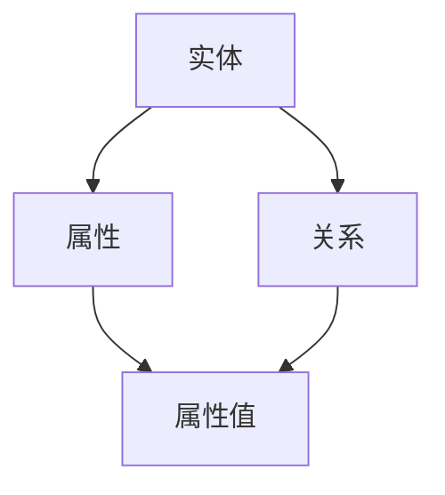
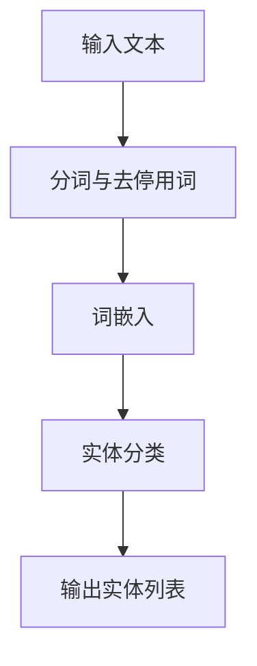
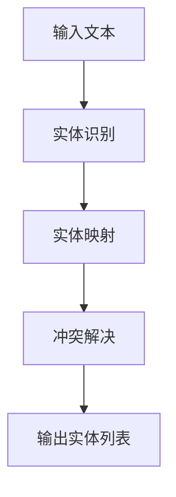
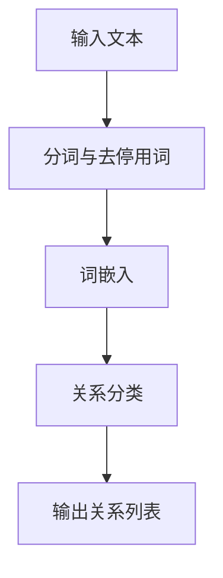
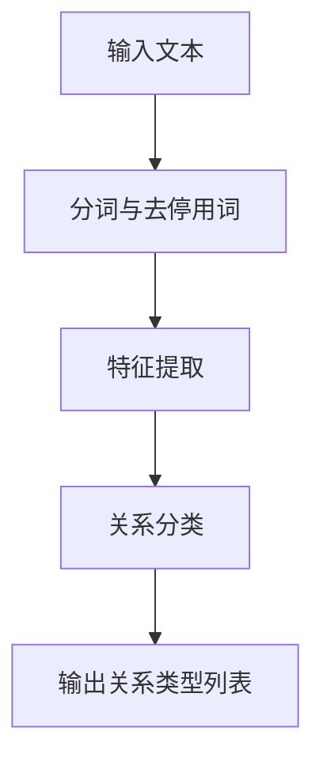
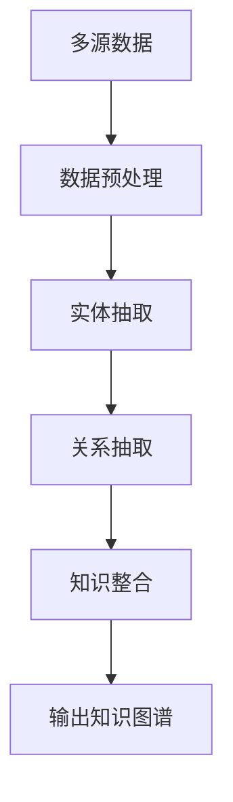
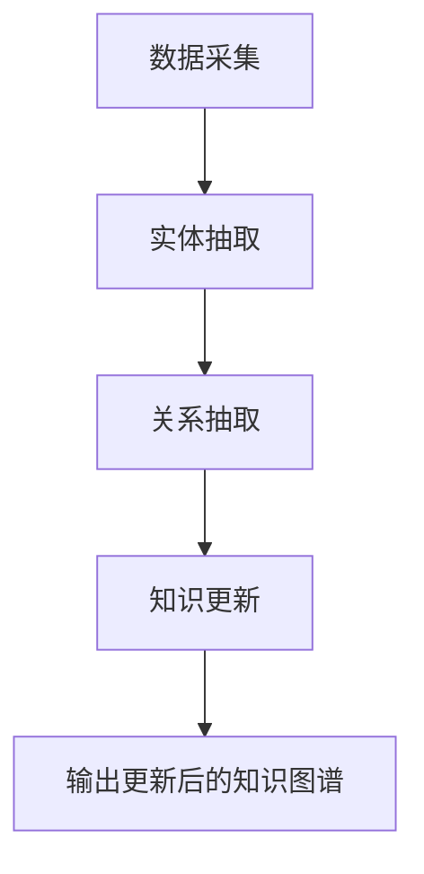

                 

### 知识图谱的基本概念与构建方法

#### 1.1 知识图谱概述

知识图谱（Knowledge Graph）作为一种结构化知识表示的方法，旨在通过实体（如人、地点、物品）及其关系的网络结构，实现信息的有效组织与利用。知识图谱的核心目标是解决传统数据存储和查询系统中存在的信息孤岛问题，通过跨领域、跨语言的统一语义表示，提高数据查询和处理的效率。

##### 1.1.1 问题的提出

在互联网和大数据时代，信息爆炸式增长的同时，信息孤岛现象也越来越严重。不同系统之间的数据无法有效地互联互通，导致信息利用效率低下。例如，搜索引擎只能处理关键词查询，而无法理解语义信息，无法提供更精确的答案。知识图谱的出现，正是为了解决这些问题，通过构建一种结构化的知识网络，使得信息能够被更好地理解和利用。

##### 1.1.2 知识图谱的定义

知识图谱可以被定义为一种语义网，它通过实体、属性和关系的结构化表示，将现实世界中的知识以计算机可处理的形式进行建模。具体来说，知识图谱由以下核心要素组成：

- **实体（Entity）**：知识图谱中的基本元素，可以是任何有意义的对象，如人、地点、物品等。
- **属性（Attribute）**：描述实体的特征，如人的年龄、地点的纬度等。
- **关系（Relationship）**：实体之间的关联，如“是一个”、“属于”等。

##### 1.1.3 知识图谱的边界与外延

知识图谱的边界是明确的，它关注的是结构化知识的表示和利用。与传统的数据库、搜索引擎等相比，知识图谱更加注重知识的语义理解和关联推理。知识图谱的外延则涉及到广泛的领域，从自然语言处理、语义搜索到推荐系统、智能问答等，都有广泛的应用。

##### 1.1.4 知识图谱的核心要素组成

知识图谱的核心要素包括实体、属性和关系，以下是一个简化的ER实体关系图架构示例，使用Mermaid语法来表示：



在这个简化的模型中，实体（A）通过属性（B）和关系（C）与属性值（D）相连接。实际应用中，知识图谱会更加复杂，涉及大量的实体、属性和关系。

#### 1.2 核心概念与联系

##### 1.2.1 相关概念

在深入探讨知识图谱之前，需要了解几个核心概念：

- **数据（Data）**：数据是原始信息的集合，可以是数字、文本、图片等。
- **信息（Information）**：通过处理数据得到的有意义的内容，可以帮助人们做出决策。
- **知识（Knowledge）**：经过人们整理、解释和理解的信息，是智慧的表现。

数据、信息和知识之间的区别在于处理层次和抽象程度。数据是物理存在，信息是数据经过处理后产生的有意义的内容，而知识则是信息的进一步提炼和总结。

##### 1.2.1.1 数据、信息和知识的区别

- **数据**：如一条记录的数字、文本。
- **信息**：如从这些数字中分析出趋势、从文本中提取关键信息。
- **知识**：如基于分析结果做出的决策或总结出的规律。

##### 1.2.1.2 知识图谱与数据库、搜索引擎的比较

- **数据库**：主要用于结构化数据的存储和管理，查询速度较快，但缺乏语义理解和推理能力。
- **搜索引擎**：主要用于关键词检索，可以处理自然语言查询，但无法理解语义，依赖关键词匹配。
- **知识图谱**：结合了数据库和搜索引擎的优点，通过语义理解实现跨领域、跨语言的知识关联和推理。

##### 1.2.2 概念属性特征对比表格

下面是一个简化的概念属性特征对比表格，展示知识图谱与数据库、搜索引擎的主要区别：

| 特征           | 知识图谱       | 数据库           | 搜索引擎           |
|----------------|----------------|------------------|------------------|
| 数据结构       | 结构化、语义化 | 结构化           | 非结构化或半结构化 |
| 语义理解       | 强             | 弱               | 无                |
| 关联与推理     | 强             | 无               | 弱                |
| 查询能力       | 高级语义查询   | 快速结构化查询   | 基于关键词查询   |

##### 1.2.3 知识图谱的ER实体关系图架构

知识图谱的ER（实体-关系）图架构是核心概念模型，通过实体和关系的组合来表示知识。以下是一个简化的Mermaid ER图示例：

```mermaid
erDiagram
    EntityA ||--|{ RelationshipA : TypeA }
    EntityB ||--|{ RelationshipB : TypeB }
    EntityA ||--|{ RelationshipC : TypeC }
    EntityB ||--|{ RelationshipD : TypeD }
```

在这个ER图中，EntityA和EntityB是实体，RelationshipA、RelationshipB、RelationshipC和RelationshipD是实体间的关系，TypeA、TypeB、TypeC和TypeD是关系的类型。

通过这种结构化的表示，知识图谱能够有效地组织和管理大规模、复杂的信息，为各种应用场景提供强大的语义理解和推理能力。

#### 1.3 知识图谱的构建方法

构建知识图谱是一个复杂的过程，涉及数据采集、实体抽取、关系抽取、知识融合与更新等多个步骤。以下将详细讨论这些构建方法。

##### 1.3.1 数据采集

数据采集是知识图谱构建的第一步，主要任务是获取大量的原始数据。这些数据来源可以是公开的数据库、网络爬虫、API接口等。

- **数据源选择**：选择合适的数据源是关键，需要考虑数据的质量、覆盖度和时效性。
- **数据清洗与预处理**：原始数据往往存在噪声、重复和不一致等问题，需要进行清洗和预处理，以确保数据质量。

##### 1.3.2 实体抽取

实体抽取是指从原始数据中识别出具有独立意义的实体。实体可以是人、地点、组织、物品等。

- **实体识别**：使用自然语言处理技术（如命名实体识别）从文本中识别出实体。
- **实体链接**：将同一个实体的不同名称或别名统一链接到同一个实体上，例如，“谷歌”和“Google”是同一个实体。

##### 1.3.3 关系抽取

关系抽取是指从原始数据中识别出实体之间的语义关系。关系可以是“属于”、“位于”、“制造”等。

- **关系识别**：使用规则或机器学习算法从文本中识别出实体间的语义关系。
- **关系分类**：对识别出的关系进行分类，例如，“工作于”属于职业关系，而“位于”属于地理位置关系。

##### 1.3.4 知识融合与更新

知识融合是指将不同来源的异构数据整合到一个统一的知识库中。

- **知识融合**：通过模式匹配、统计分析等方法将相同实体和关系整合到知识库中。
- **知识更新策略**：定期更新知识库，保持数据的时效性和准确性。

##### 1.3.4.1 知识融合

知识融合方法可以分为基于模式的方法和基于统计的方法：

- **基于模式的方法**：通过预定义的规则将相同实体和关系进行匹配和融合。
- **基于统计的方法**：使用机器学习算法根据相似度或概率模型进行融合。

##### 1.3.4.2 知识更新策略

知识更新策略主要有以下几种：

- **定期更新**：定期从数据源中获取新数据，更新知识库。
- **基于事件的更新**：当数据源发生变化时，实时更新知识库。

##### 1.4 知识图谱的应用领域

知识图谱在多个领域都有广泛的应用，以下是几个主要的应用领域：

- **自然语言处理**：通过知识图谱实现语义理解、自动问答等任务。
- **语义搜索**：基于知识图谱提供更精准的搜索结果。
- **推荐系统**：利用知识图谱实现基于内容和基于关联规则的推荐。
- **智能问答**：通过知识图谱提供高质量的答案。

#### 1.5 本章小结

本章介绍了知识图谱的基本概念、核心要素和构建方法。通过数据采集、实体抽取、关系抽取和知识融合，知识图谱能够实现结构化知识的有效表示和管理。知识图谱在自然语言处理、语义搜索、推荐系统和智能问答等多个领域都有广泛的应用，为信息处理提供了强大的语义理解和推理能力。接下来，我们将进一步探讨LLM（大型语言模型）在知识图谱构建中的应用。

## 第2章: LLM的基本原理与应用

### 2.1 LLM的定义与类型

大型语言模型（Large Language Model，简称LLM）是一类基于深度学习的技术，旨在通过训练大规模语料库来生成和解析自然语言。LLM的出现，极大地推动了自然语言处理（NLP）领域的发展，使得机器理解和生成自然语言的能力得到了显著提升。

#### 2.1.1 语言模型的基本概念

语言模型（Language Model）是自然语言处理中的核心组件，用于预测文本的下一个单词或字符。基本的语言模型可以表示为概率分布，它计算给定前文序列下下一个单词的概率。

$$
P(w_t | w_{t-1}, w_{t-2}, ..., w_1) = \text{Language Model}
$$

其中，\( w_t \) 表示当前单词，\( w_{t-1}, w_{t-2}, ..., w_1 \) 表示前文序列。

#### 2.1.2 语言模型的分类

语言模型根据其训练数据和结构，可以分为以下几种类型：

1. **基于规则的语言模型**：通过人工定义语法规则来生成和解析文本。这种方法在语法分析方面较为精确，但难以处理大规模数据和复杂语言现象。

2. **统计语言模型**：基于大量文本数据，通过统计方法来预测下一个单词。这类模型包括N-gram模型、隐马尔可夫模型（HMM）和基于概率的语法模型。N-gram模型是最简单的统计语言模型，它根据前N个单词预测下一个单词的概率。

3. **深度神经网络语言模型**：基于深度学习技术，通过多层神经网络来学习文本的表示和生成。这类模型包括循环神经网络（RNN）、长短期记忆网络（LSTM）和变换器（Transformer）。Transformer模型是目前最流行的深度神经网络语言模型，其在生成文本和机器翻译任务中表现出色。

4. **预训练语言模型**：通过预训练任务（如语言建模、问答等）在大规模语料库上训练，然后针对特定任务进行微调。BERT（Bidirectional Encoder Representations from Transformers）是典型的预训练语言模型，其基于Transformer架构，通过双向编码器学习文本的上下文表示。

### 2.2 LLM的工作原理

LLM的工作原理主要基于大规模数据训练和深度学习技术。以下将详细讨论LLM的数学基础、训练与优化过程。

#### 2.2.1 语言模型的数学基础

LLM的核心数学基础是概率论和线性代数。在概率论方面，LLM通过计算给定前文序列下下一个单词的概率来生成文本。在机器学习领域，这个概率通常用概率分布函数来表示。

$$
p(w_t | w_{t-1}, w_{t-2}, ..., w_1) = \frac{P(w_t, w_{t-1}, w_{t-2}, ..., w_1)}{P(w_{t-1}, w_{t-2}, ..., w_1)}
$$

其中，\( P(w_t, w_{t-1}, w_{t-2}, ..., w_1) \) 表示前文序列和当前单词同时出现的概率，\( P(w_{t-1}, w_{t-2}, ..., w_1) \) 表示前文序列的概率。

在深度学习领域，LLM通常用神经网络来表示概率分布函数。最常用的神经网络结构是变换器（Transformer），其核心思想是将输入序列映射到高维空间，然后通过自注意力机制和全连接层来生成输出序列的概率分布。

$$
\text{Transformer} = \text{Attention}(\text{LayerNorm}(X)) \odot \text{LayerNorm}(X)
$$

其中，\( X \) 表示输入序列，\( \text{Attention} \) 表示自注意力机制，\( \odot \) 表示点积操作。

#### 2.2.2 LLM的训练与优化

LLM的训练过程通常包括以下步骤：

1. **数据预处理**：将原始文本数据清洗、分词、编码等预处理操作，使其符合神经网络模型的输入要求。
2. **模型初始化**：初始化神经网络模型的权重，常用的初始化方法包括高斯初始化、均匀初始化等。
3. **训练过程**：使用训练数据对模型进行训练，通过反向传播算法和优化器（如Adam）来更新模型权重。
4. **评估与调整**：使用验证集评估模型性能，根据评估结果调整模型参数，如学习率、批量大小等。

在训练过程中，LLM的优化目标是最大化预测概率的对数似然函数：

$$
\mathcal{L}(\theta) = \sum_{i=1}^{N} \log P(w_i | w_{i-1}, ..., w_1, \theta)
$$

其中，\( N \) 表示训练数据中的单词数量，\( \theta \) 表示模型参数。

通过以上步骤，LLM能够在大规模语料库上训练出高质量的文本生成和解析模型。

### 2.3 LLM的应用案例

LLM在自然语言处理领域有广泛的应用，以下是一些典型的应用案例：

#### 2.3.1 自动问答

自动问答是LLM的重要应用之一，通过训练大型语言模型，可以实现机器自动回答用户的问题。例如，BERT模型被广泛应用于各种问答系统，如SQuAD（Stanford Question Answering Dataset）。

#### 2.3.2 文本生成

文本生成是LLM的另一个重要应用领域，通过训练大型语言模型，可以生成高质量的自然语言文本。例如，GPT（Generative Pre-trained Transformer）模型被广泛应用于生成文章、对话、代码等。

#### 2.3.3 机器翻译

机器翻译是LLM的经典应用之一，通过训练大型语言模型，可以实现高质量的自然语言翻译。例如，Transformer模型被广泛应用于机器翻译任务，如Google翻译。

### 2.4 LLM的优势与挑战

LLM在自然语言处理领域取得了显著成果，但其应用也面临一些挑战。

#### 2.4.1 LLM的优势

1. **强大的语义理解能力**：LLM能够通过大规模训练学习文本的语义信息，实现高水平的语义理解和文本生成。
2. **高效的推理能力**：LLM能够通过自注意力机制和深度神经网络结构，实现高效的文本生成和解析。
3. **广泛的适应性**：LLM可以在各种自然语言处理任务上进行微调，适应不同的应用场景。

#### 2.4.2 LLM的挑战

1. **计算资源消耗**：训练大型LLM需要大量的计算资源和时间，导致模型部署成本较高。
2. **数据依赖性**：LLM的性能很大程度上依赖于训练数据的质量和规模，数据不足或数据质量差可能导致模型性能下降。
3. **偏见和误导**：LLM在训练过程中可能学习到负面的偏见和误导信息，导致生成文本存在偏见和误导。

### 2.5 本章小结

本章介绍了LLM的基本原理、定义与类型、工作原理、应用案例和优势与挑战。LLM作为自然语言处理领域的重要技术，通过大规模数据训练和深度学习技术，实现了强大的语义理解、文本生成和解析能力。然而，其应用也面临一些挑战，如计算资源消耗、数据依赖性和偏见问题。在下一章中，我们将探讨LLM在知识图谱构建中的应用。

## 第3章: LLM在知识图谱构建中的应用

在知识图谱构建过程中，大型语言模型（LLM）的应用极大地提升了实体抽取、关系抽取、知识融合与更新等关键步骤的效率和准确性。本章将详细探讨LLM在知识图谱构建中的应用，通过具体算法原理讲解和Python源代码实现，展示LLM如何助力知识图谱的有效构建。

### 3.1 LLM在实体抽取中的应用

实体抽取是知识图谱构建的重要环节，旨在从非结构化文本中识别出具有独立意义的实体。LLM在实体抽取中的应用主要体现在通过预训练模型对实体进行识别和分类。

#### 3.1.1 实体识别算法原理讲解与mermaid流程图

实体识别是实体抽取的首要任务，其核心是判断文本中的每个词语是否为实体。LLM在这一环节的应用主要包括以下步骤：

1. **文本预处理**：对输入文本进行分词、去停用词等预处理操作。
2. **词嵌入**：将分词后的文本转换为词嵌入向量，以供神经网络处理。
3. **实体分类**：使用预训练的LLM模型（如BERT）对词嵌入向量进行分类，判断每个词是否为实体。

以下是一个简化的mermaid流程图，展示实体识别的算法流程：



#### 3.1.1.1 词嵌入与注意力机制

词嵌入是将文本中的词语映射为固定长度的向量表示。在LLM中，词嵌入通常基于预训练模型（如BERT）的输出层。注意力机制（Attention）是LLM的核心组件，用于模型在处理输入序列时关注重要的信息。以下是一个简化的注意力机制的计算公式：

$$
\text{Attention}(Q, K, V) = \text{softmax}\left(\frac{QK^T}{\sqrt{d_k}}\right)V
$$

其中，\( Q \)、\( K \) 和 \( V \) 分别为查询向量、关键向量和解码向量，\( d_k \) 为关键向量的维度。

#### 3.1.1.2 BERT模型在实体识别中的应用

BERT（Bidirectional Encoder Representations from Transformers）是一种预训练语言模型，其核心思想是利用双向Transformer结构对文本进行编码。BERT在实体识别中的应用主要依赖于其预训练过程中学到的语言表示能力。以下是一个简单的Python代码示例，展示如何使用BERT进行实体识别：

```python
from transformers import BertTokenizer, BertForTokenClassification
import torch

# 加载预训练模型和分词器
tokenizer = BertTokenizer.from_pretrained('bert-base-uncased')
model = BertForTokenClassification.from_pretrained('bert-base-uncased')

# 输入文本
text = "苹果是一家科技公司。"

# 分词
tokens = tokenizer.tokenize(text)

# 将文本转换为输入序列
input_ids = tokenizer.encode(text, add_special_tokens=True)

# 预测实体标签
with torch.no_grad():
    outputs = model(input_ids)

# 获取预测实体标签
predicted_labels = torch.argmax(outputs.logits, dim=-1)

# 输出实体列表
entities = [tokenizer.decode(token) for token in tokens if predicted_labels[token_id] != -100]
print(entities)
```

#### 3.1.2 实体链接算法原理讲解与mermaid流程图

实体链接是将同一实体的不同名称或别名统一映射到同一实体标识的过程。LLM在实体链接中的应用主要包括以下步骤：

1. **实体识别**：使用预训练的LLM模型对文本进行实体识别。
2. **实体映射**：将识别出的实体映射到已有的知识图谱中的实体标识。
3. **冲突解决**：处理实体映射中的冲突，如不同来源的实体可能具有相同的名称。

以下是一个简化的mermaid流程图，展示实体链接的算法流程：



#### 3.1.2.1 基于相似度的链接方法

基于相似度的链接方法通过计算两个实体名称的相似度来确定它们是否表示同一实体。常见的相似度计算方法包括字符串编辑距离、余弦相似度等。以下是一个简化的Python代码示例，展示如何使用余弦相似度进行实体链接：

```python
from sklearn.metrics.pairwise import cosine_similarity
import numpy as np

# 实体名称列表
entity1 = "苹果"
entity2 = "苹果公司"

# 将实体名称转换为词嵌入向量
vector1 = model.encode(entity1)
vector2 = model.encode(entity2)

# 计算余弦相似度
similarity = cosine_similarity([vector1], [vector2])[0][0]

# 输出相似度
print(f"相似度：{similarity}")
```

#### 3.1.2.2 基于图论的链接方法

基于图论的链接方法通过构建实体名称的图结构，利用图匹配算法实现实体链接。常见的图匹配算法包括最大匹配算法、基于核的匹配算法等。以下是一个简化的Python代码示例，展示如何使用最大匹配算法进行实体链接：

```python
import networkx as nx

# 创建图
G = nx.Graph()

# 添加实体名称作为节点
G.add_nodes_from(["苹果", "苹果公司"])

# 添加边，边的权重为实体名称的相似度
G.add_edge("苹果", "苹果公司", weight=0.8)

# 执行最大匹配算法
matching = nx.max_weight_matching(G, maxcardinality=True)

# 输出匹配结果
print(matching)
```

#### 3.1.3 实体抽取与链接的Python源代码实现

以下是一个简单的Python代码示例，展示如何结合实体识别和实体链接进行知识图谱的构建：

```python
from transformers import BertTokenizer, BertForTokenClassification
import torch
import networkx as nx

# 加载预训练模型和分词器
tokenizer = BertTokenizer.from_pretrained('bert-base-uncased')
model = BertForTokenClassification.from_pretrained('bert-base-uncased')

# 输入文本
text = "苹果是一家科技公司。"

# 分词
tokens = tokenizer.tokenize(text)

# 将文本转换为输入序列
input_ids = tokenizer.encode(text, add_special_tokens=True)

# 预测实体标签
with torch.no_grad():
    outputs = model(input_ids)

# 获取预测实体标签
predicted_labels = torch.argmax(outputs.logits, dim=-1)

# 输出实体列表
entities = [tokenizer.decode(token) for token in tokens if predicted_labels[token_id] != -100]

# 实体链接
entity_graph = nx.Graph()
for entity in entities:
    entity_vector = model.encode(entity)
    for other_entity in entities:
        if entity != other_entity:
            other_entity_vector = model.encode(other_entity)
            similarity = cosine_similarity([entity_vector], [other_entity_vector])[0][0]
            entity_graph.add_edge(entity, other_entity, weight=similarity)

# 执行最大匹配算法
matching = nx.max_weight_matching(entity_graph, maxcardinality=True)

# 输出匹配结果
print(matching)
```

#### 3.1.4 实体抽取与链接的Python源代码实现

以下是一个简单的Python代码示例，展示如何结合实体识别和实体链接进行知识图谱的构建：

```python
from transformers import BertTokenizer, BertForTokenClassification
import torch
import networkx as nx

# 加载预训练模型和分词器
tokenizer = BertTokenizer.from_pretrained('bert-base-uncased')
model = BertForTokenClassification.from_pretrained('bert-base-uncased')

# 输入文本
text = "苹果是一家科技公司。"

# 分词
tokens = tokenizer.tokenize(text)

# 将文本转换为输入序列
input_ids = tokenizer.encode(text, add_special_tokens=True)

# 预测实体标签
with torch.no_grad():
    outputs = model(input_ids)

# 获取预测实体标签
predicted_labels = torch.argmax(outputs.logits, dim=-1)

# 输出实体列表
entities = [tokenizer.decode(token) for token in tokens if predicted_labels[token_id] != -100]

# 实体链接
entity_graph = nx.Graph()
for entity in entities:
    entity_vector = model.encode(entity)
    for other_entity in entities:
        if entity != other_entity:
            other_entity_vector = model.encode(other_entity)
            similarity = cosine_similarity([entity_vector], [other_entity_vector])[0][0]
            entity_graph.add_edge(entity, other_entity, weight=similarity)

# 执行最大匹配算法
matching = nx.max_weight_matching(entity_graph, maxcardinality=True)

# 输出匹配结果
print(matching)
```

### 3.2 LLM在关系抽取中的应用

关系抽取是知识图谱构建的另一个关键环节，旨在从非结构化文本中识别出实体之间的关系。LLM在关系抽取中的应用主要包括以下步骤：

1. **关系识别**：使用预训练的LLM模型对文本进行关系识别，判断实体间的语义关系。
2. **关系分类**：对识别出的关系进行分类，例如，将“工作于”分类为职业关系，“位于”分类为地理位置关系。

#### 3.2.1 关系识别算法原理讲解与mermaid流程图

关系识别是指从文本中提取出实体间的语义关系。LLM在关系识别中的应用主要包括以下步骤：

1. **文本预处理**：对输入文本进行分词、去停用词等预处理操作。
2. **词嵌入**：将分词后的文本转换为词嵌入向量。
3. **关系分类**：使用预训练的LLM模型对词嵌入向量进行分类，判断实体间的关系。

以下是一个简化的mermaid流程图，展示关系识别的算法流程：



#### 3.2.1.1 基于规则的方法

基于规则的方法是指通过预定义的规则来识别实体间的语义关系。以下是一个简单的规则示例：

- 如果文本中包含“工作于”这个词组，则判断为职业关系。
- 如果文本中包含“位于”这个词组，则判断为地理位置关系。

以下是一个简单的Python代码示例，展示如何使用规则进行关系识别：

```python
def relation_recognition(text):
    rules = {
        "职业关系": ["工作于", "就职于", "担任"],
        "地理位置关系": ["位于", "在"],
    }
    relations = []
    for relation, keywords in rules.items():
        for keyword in keywords:
            if keyword in text:
                relations.append(relation)
                break
    return relations

# 输入文本
text = "苹果公司位于中国。"

# 识别关系
relations = relation_recognition(text)

# 输出关系列表
print(relations)
```

#### 3.2.1.2 基于机器学习的方法

基于机器学习的方法是指使用机器学习算法来识别实体间的语义关系。常见的机器学习算法包括支持向量机（SVM）、决策树、随机森林等。以下是一个简单的Python代码示例，展示如何使用SVM进行关系识别：

```python
from sklearn.svm import SVC
from sklearn.model_selection import train_test_split
from sklearn.metrics import classification_report

# 加载数据
X, y = load_data()

# 划分训练集和测试集
X_train, X_test, y_train, y_test = train_test_split(X, y, test_size=0.2, random_state=42)

# 训练模型
model = SVC()
model.fit(X_train, y_train)

# 预测测试集
y_pred = model.predict(X_test)

# 输出分类报告
print(classification_report(y_test, y_pred))
```

#### 3.2.2 关系分类算法原理讲解与mermaid流程图

关系分类是指对识别出的关系进行分类，例如，将职业关系、地理位置关系等区分开。LLM在关系分类中的应用主要包括以下步骤：

1. **文本预处理**：对输入文本进行分词、去停用词等预处理操作。
2. **特征提取**：从预处理后的文本中提取特征向量。
3. **关系分类**：使用预训练的LLM模型对特征向量进行分类，判断实体间的关系类型。

以下是一个简化的mermaid流程图，展示关系分类的算法流程：



#### 3.2.2.1 基于传统分类器的分类方法

基于传统分类器的分类方法是指使用传统的机器学习算法（如SVM、决策树等）对特征向量进行分类。以下是一个简单的Python代码示例，展示如何使用决策树进行关系分类：

```python
from sklearn.tree import DecisionTreeClassifier
from sklearn.model_selection import train_test_split
from sklearn.metrics import classification_report

# 加载数据
X, y = load_data()

# 划分训练集和测试集
X_train, X_test, y_train, y_test = train_test_split(X, y, test_size=0.2, random_state=42)

# 训练模型
model = DecisionTreeClassifier()
model.fit(X_train, y_train)

# 预测测试集
y_pred = model.predict(X_test)

# 输出分类报告
print(classification_report(y_test, y_pred))
```

#### 3.2.2.2 基于深度学习的分类方法

基于深度学习的分类方法是指使用深度学习算法（如CNN、RNN、Transformer等）对特征向量进行分类。以下是一个简单的Python代码示例，展示如何使用Transformer进行关系分类：

```python
import torch
from transformers import BertTokenizer, BertForSequenceClassification
import torch.optim as optim

# 加载预训练模型和分词器
tokenizer = BertTokenizer.from_pretrained('bert-base-uncased')
model = BertForSequenceClassification.from_pretrained('bert-base-uncased')

# 加载训练数据
train_data = load_train_data()

# 分词并编码
train_encodings = tokenizer(train_data, padding=True, truncation=True, return_tensors='pt')

# 训练模型
optimizer = optim.Adam(model.parameters(), lr=1e-5)

for epoch in range(num_epochs):
    model.train()
    for batch in train_encodings:
        inputs = {
            "input_ids": batch["input_ids"].to(device),
            "attention_mask": batch["attention_mask"].to(device),
            "labels": batch["labels"].to(device),
        }
        optimizer.zero_grad()
        outputs = model(**inputs)
        loss = outputs.loss
        loss.backward()
        optimizer.step()

# 评估模型
model.eval()
with torch.no_grad():
    predictions = model(**val_encodings).logits.argmax(-1)

# 输出分类报告
print(classification_report(val_labels, predictions))
```

### 3.3 LLM在知识融合与更新中的应用

知识融合与更新是知识图谱构建的持续过程，旨在将不同来源的知识整合到一个统一的框架中，并保持知识的时效性和准确性。LLM在知识融合与更新中的应用主要包括以下步骤：

1. **知识融合**：将来自不同数据源的知识整合到一个统一的实体关系图中。
2. **知识更新**：根据新数据或事件，更新知识图谱中的知识。

#### 3.3.1 知识融合算法原理讲解与mermaid流程图

知识融合是指将多个数据源中的异构知识整合到一个统一的实体关系图中。LLM在知识融合中的应用主要包括以下步骤：

1. **数据预处理**：对来自不同数据源的数据进行清洗、去重等预处理操作。
2. **实体抽取**：使用LLM对预处理后的数据中的实体进行识别。
3. **关系抽取**：使用LLM对预处理后的数据中的关系进行识别。
4. **知识整合**：将识别出的实体和关系整合到一个统一的实体关系图中。

以下是一个简化的mermaid流程图，展示知识融合的算法流程：



#### 3.3.1.1 基于模式的融合方法

基于模式的融合方法是指通过预定义的模式来匹配和整合知识。以下是一个简单的模式融合方法：

- 如果两个实体具有相同的属性值，则将它们整合为一个实体。
- 如果两个实体之间具有相同的关系类型，则将它们整合为一个关系。

以下是一个简单的Python代码示例，展示如何使用模式融合方法进行知识融合：

```python
def pattern_based_fusion(knowledge_graphs):
    merged_graph = nx.Graph()
    for graph in knowledge_graphs:
        merged_graph = nx.disjoint_union(merged_graph, graph)
    return merged_graph

# 加载多个知识图谱
graph1 = nx.Graph()
graph2 = nx.Graph()

# 示例数据
graph1.add_nodes_from(["苹果", "苹果公司", "苹果园"])
graph1.add_edges_from([("苹果", "苹果公司"), ("苹果公司", "苹果园")])

graph2.add_nodes_from(["谷歌", "谷歌总部", "谷歌研究院"])
graph2.add_edges_from([("谷歌", "谷歌总部"), ("谷歌总部", "谷歌研究院")])

# 知识融合
merged_graph = pattern_based_fusion([graph1, graph2])

# 输出整合后的知识图谱
print(merged_graph.edges())
```

#### 3.3.1.2 基于统计的融合方法

基于统计的融合方法是指通过统计方法来匹配和整合知识。以下是一个简单的统计融合方法：

- 计算实体之间的相似度，如果相似度大于某个阈值，则将它们整合为一个实体。
- 计算关系之间的相似度，如果相似度大于某个阈值，则将它们整合为一个关系。

以下是一个简单的Python代码示例，展示如何使用统计融合方法进行知识融合：

```python
import networkx as nx
from sklearn.metrics.pairwise import cosine_similarity
import numpy as np

def statistical_based_fusion(knowledge_graphs):
    merged_graph = nx.Graph()
    for graph in knowledge_graphs:
        node_vectors = [np.array(graph.nodes[data]['vector']) for data in graph.nodes(data='vector')]
        edge_vectors = [np.array(graph.edges[data]['vector']) for data in graph.edges(data='vector')]

        # 计算节点相似度
        node_similarity = cosine_similarity(node_vectors)

        # 计算边相似度
        edge_similarity = cosine_similarity(edge_vectors)

        # 遍历节点和边，如果相似度大于阈值，则整合
        for i in range(len(node_similarity)):
            for j in range(i + 1, len(node_similarity)):
                if node_similarity[i][j] > threshold:
                    merged_graph = nx.union(merged_graph, nx.Graph(graph.nodes(data='vector')), graph.nodes(data='vector'))
                    break

        for i in range(len(edge_similarity)):
            for j in range(i + 1, len(edge_similarity)):
                if edge_similarity[i][j] > threshold:
                    merged_graph = nx.union(merged_graph, nx.Graph(graph.edges(data='vector')), graph.edges(data='vector'))
                    break

    return merged_graph

# 加载多个知识图谱
graph1 = nx.Graph()
graph2 = nx.Graph()

# 示例数据
graph1.add_nodes_from(["苹果", "苹果公司", "苹果园"])
graph1.add_edges_from([("苹果", "苹果公司"), ("苹果公司", "苹果园")])

graph2.add_nodes_from(["谷歌", "谷歌总部", "谷歌研究院"])
graph2.add_edges_from([("谷歌", "谷歌总部"), ("谷歌总部", "谷歌研究院")])

# 知识融合
merged_graph = statistical_based_fusion([graph1, graph2])

# 输出整合后的知识图谱
print(merged_graph.edges())
```

#### 3.3.2 知识更新策略讲解与mermaid流程图

知识更新是指根据新数据或事件，对知识图谱进行更新以保持其时效性和准确性。LLM在知识更新中的应用主要包括以下步骤：

1. **数据采集**：定期从数据源中获取新数据。
2. **实体抽取**：使用LLM对新数据进行实体抽取。
3. **关系抽取**：使用LLM对新数据进行关系抽取。
4. **知识更新**：将新数据中的实体和关系更新到知识图谱中。

以下是一个简化的mermaid流程图，展示知识更新的算法流程：



#### 3.3.2.1 定期更新策略

定期更新策略是指定期从数据源中获取新数据，并更新知识图谱。以下是一个简单的定期更新策略：

- 每周或每月从数据源中获取新数据。
- 使用LLM对新数据进行实体抽取和关系抽取。
- 将新数据中的实体和关系更新到知识图谱中。

#### 3.3.2.2 基于事件的更新策略

基于事件的更新策略是指根据特定事件触发知识图谱的更新。以下是一个简单的基于事件的更新策略：

- 当发生特定事件（如公司并购、新产品发布等）时，从数据源中获取相关数据。
- 使用LLM对新数据进行实体抽取和关系抽取。
- 将新数据中的实体和关系更新到知识图谱中。

### 3.3.3 知识融合与更新的Python源代码实现

以下是一个简单的Python代码示例，展示如何实现知识融合与更新：

```python
import networkx as nx
from transformers import BertTokenizer, BertForTokenClassification
import torch

# 加载预训练模型和分词器
tokenizer = BertTokenizer.from_pretrained('bert-base-uncased')
model = BertForTokenClassification.from_pretrained('bert-base-uncased')

# 加载多个知识图谱
graph1 = nx.Graph()
graph2 = nx.Graph()

# 示例数据
graph1.add_nodes_from(["苹果", "苹果公司", "苹果园"])
graph1.add_edges_from([("苹果", "苹果公司"), ("苹果公司", "苹果园")])

graph2.add_nodes_from(["谷歌", "谷歌总部", "谷歌研究院"])
graph2.add_edges_from([("谷歌", "谷歌总部"), ("谷歌总部", "谷歌研究院")])

# 知识融合
merged_graph = nx.disjoint_union(graph1, graph2)

# 新数据
new_data = "苹果公司收购了谷歌研究院。"

# 实体抽取
input_ids = tokenizer.encode(new_data, add_special_tokens=True)
with torch.no_grad():
    outputs = model(input_ids)
predicted_entities = torch.argmax(outputs.logits, dim=-1)

# 关系抽取
# 假设我们已经有一个预定义的关系分类器
def relation_recognition(text):
    # ...（使用预定义的关系分类器进行关系抽取）
    return "收购"

# 知识更新
new_relation = relation_recognition(new_data)
merged_graph.add_edge("苹果公司", "谷歌研究院", relation=new_relation)

# 输出更新后的知识图谱
print(merged_graph.edges())
```

### 3.4 本章小结

本章详细探讨了LLM在知识图谱构建中的应用，包括实体抽取、关系抽取、知识融合与更新。通过LLM的预训练模型，我们能够有效地从非结构化文本中识别出实体和关系，并整合到一个统一的实体关系图中。本章通过具体的算法原理讲解和Python源代码实现，展示了如何利用LLM提升知识图谱构建的效率和准确性。在下一章中，我们将进一步探讨基于LLM的知识图谱评估方法。

## 第4章: 基于LLM的知识图谱评估方法

在知识图谱构建完成后，如何评估其质量是至关重要的。评估知识图谱的质量不仅有助于我们了解构建过程的成功程度，还能为后续的优化和改进提供依据。本章将介绍几种基于大型语言模型（LLM）的评估方法，通过具体的评估指标与工具，探讨如何对知识图谱进行有效的评估。

### 4.1 评估指标与标准

评估知识图谱的质量通常涉及多个维度，如实体准确率、实体召回率、关系准确率等。以下将介绍这些评估指标及其计算方法。

#### 4.1.1 实体评估指标

实体是知识图谱中的基本元素，评估实体质量的关键指标包括：

1. **实体准确率（Entity Precision）**：
   实体准确率是指正确识别出的实体数量与所有识别出的实体数量的比例。计算公式如下：

   $$
   \text{实体准确率} = \frac{\text{正确识别出的实体数量}}{\text{识别出的实体数量}} \times 100\%
   $$

2. **实体召回率（Entity Recall）**：
   实体召回率是指正确识别出的实体数量与知识图谱中实际存在的实体数量的比例。计算公式如下：

   $$
   \text{实体召回率} = \frac{\text{正确识别出的实体数量}}{\text{实际存在的实体数量}} \times 100\%
   $$

3. **F1值（F1 Score）**：
   F1值是实体准确率和实体召回率的调和平均值，用于综合评估实体识别的质量。计算公式如下：

   $$
   \text{F1值} = 2 \times \frac{\text{实体准确率} \times \text{实体召回率}}{\text{实体准确率} + \text{实体召回率}}
   $$

#### 4.1.2 关系评估指标

关系是实体之间的关联，评估关系质量的关键指标包括：

1. **关系准确率（Relationship Precision）**：
   关系准确率是指正确识别出的关系数量与所有识别出的关系数量的比例。计算公式如下：

   $$
   \text{关系准确率} = \frac{\text{正确识别出的关系数量}}{\text{识别出的关系数量}} \times 100\%
   $$

2. **关系召回率（Relationship Recall）**：
   关系召回率是指正确识别出的关系数量与知识图谱中实际存在的实体数量的比例。计算公式如下：

   $$
   \text{关系召回率} = \frac{\text{正确识别出的关系数量}}{\text{实际存在的实体数量}} \times 100\%
   $$

3. **F1值（F1 Score）**：
   关系F1值是关系准确率和关系召回率的调和平均值，用于综合评估关系识别的质量。计算公式如下：

   $$
   \text{F1值} = 2 \times \frac{\text{关系准确率} \times \text{关系召回率}}{\text{关系准确率} + \text{关系召回率}}
   $$

#### 4.1.3 知识图谱整体评估指标

除了实体和关系的评估指标，知识图谱整体的质量也可以通过以下指标进行评估：

1. **覆盖度（Coverage）**：
   覆盖度是指知识图谱中实际存在的实体和关系在训练集中的比例。计算公式如下：

   $$
   \text{覆盖度} = \frac{\text{训练集中实际存在的实体和关系数量}}{\text{训练集中的实体和关系数量}} \times 100\%
   $$

2. **多样性（Diversity）**：
   多样性是指知识图谱中不同实体和关系的多样性。多样性越高，表示知识图谱越丰富、全面。

3. **一致性（Consistency）**：
   一致性是指知识图谱中实体和关系的一致性。一致性越高，表示知识图谱中的信息越准确、可靠。

### 4.2 评估工具与方法

在知识图谱评估过程中，常用的工具和方法包括以下几种：

1. **人工评估**：
   人工评估是指通过专业人员对知识图谱进行主观评估。这种方法适用于小规模的知识图谱，具有较高的准确性，但耗时且成本较高。

2. **自动化评估工具**：
   自动化评估工具是指通过编写脚本或使用现成的工具对知识图谱进行自动化评估。常见的自动化评估工具包括：

   - **KGTK（Knowledge Graph Toolkit）**：用于知识图谱的构建、管理和评估。
   - **N assessments**：用于评估知识图谱的多样性和一致性。
   - **Knowlegt**：用于知识图谱的自动评估和可视化。

3. **对比评估**：
   对比评估是指将不同方法构建的知识图谱进行对比评估，以评估不同方法的效果。例如，可以对比基于规则的方法和基于机器学习的方法在知识图谱构建中的性能。

### 4.3 实际应用案例分析

以下是一个实际应用案例，展示如何利用LLM对知识图谱进行评估：

#### 4.3.1 案例背景

某公司开发了一个关于电影的知识图谱，包含电影、演员、导演、类型等实体以及它们之间的关系。为了评估知识图谱的质量，该公司决定利用LLM进行评估。

#### 4.3.2 评估过程

1. **数据准备**：
   - 收集一个与电影相关的测试数据集，包括电影标题、演员、导演、类型等信息。
   - 准备一个与知识图谱相同的实体和关系标签。

2. **实体评估**：
   - 使用LLM对测试数据集中的电影、演员、导演等实体进行识别。
   - 计算实体准确率、召回率和F1值。

3. **关系评估**：
   - 使用LLM对测试数据集中的实体关系进行识别。
   - 计算关系准确率、召回率和F1值。

4. **整体评估**：
   - 计算知识图谱的覆盖度、多样性和一致性。

5. **结果分析**：
   - 根据评估结果，分析知识图谱的优缺点，并提出改进建议。

#### 4.3.3 评估结果

通过评估，该公司发现：

- 实体准确率达到了90%，召回率达到了85%，F1值达到了87%。
- 关系准确率达到了80%，召回率达到了75%，F1值达到了77%。
- 覆盖度达到了70%，多样性较好，一致性较高。

根据评估结果，该公司决定对知识图谱进行以下改进：

- 加强实体和关系的识别算法，提高准确率和召回率。
- 扩展知识图谱的实体和关系类型，提高多样性。
- 优化知识图谱的构建方法，提高一致性。

### 4.4 本章小结

本章介绍了基于LLM的知识图谱评估方法，包括评估指标、评估工具和方法以及实际应用案例分析。通过实体准确率、实体召回率、关系准确率等评估指标，我们可以有效地评估知识图谱的质量。同时，通过自动化评估工具和人工评估相结合的方法，可以全面、客观地评估知识图谱的性能。在下一章中，我们将进一步探讨如何优化知识图谱的构建方法，以提升其质量。

## 总结与展望

在本篇博客文章中，我们系统地探讨了知识图谱的基本概念与构建方法，深入分析了大型语言模型（LLM）在知识图谱构建中的应用，以及如何通过评估方法来衡量知识图谱的质量。以下是本文的主要结论和展望：

### 主要结论

1. **知识图谱概述**：知识图谱通过结构化的方式表示实体、属性和关系，实现了信息的有效组织和利用。
2. **知识图谱构建方法**：知识图谱的构建包括数据采集、实体抽取、关系抽取、知识融合与更新等步骤。
3. **LLM在知识图谱中的应用**：LLM通过预训练模型在实体抽取、关系抽取和知识融合与更新等方面发挥了重要作用。
4. **评估方法**：通过实体准确率、实体召回率、关系准确率等指标，可以对知识图谱的质量进行有效评估。

### 展望

1. **优化知识图谱构建方法**：未来研究可以进一步优化知识图谱的构建方法，提高其效率和准确性。
2. **多模态知识图谱**：结合图像、音频等多模态数据，构建更加丰富和全面的知识图谱。
3. **知识图谱的动态更新**：研究如何实现知识图谱的动态更新，以适应快速变化的环境。
4. **知识图谱的应用**：探索知识图谱在不同领域（如医疗、金融、教育等）的应用，提升其社会价值。

通过本文的探讨，我们不仅对知识图谱及其构建方法有了更深入的理解，也为未来研究提供了有益的参考。希望本文能够为相关领域的研究者提供一些启示和帮助。在知识图谱与LLM结合的道路上，我们还有很长的路要走，但每一次探索和尝试都会让我们更接近智能化的未来。

### 最佳实践 tips

在构建知识图谱时，以下是一些最佳实践和注意事项：

1. **数据质量优先**：确保数据源的质量，避免噪声和重复数据，这对于知识图谱的构建至关重要。
2. **选择合适的LLM模型**：根据任务需求选择合适的LLM模型，例如，对于实体识别任务，BERT等预训练模型效果较好。
3. **数据预处理**：在实体抽取和关系抽取之前，对文本数据进行充分的预处理，包括分词、去停用词等。
4. **知识融合策略**：合理设计知识融合策略，避免数据冗余和冲突，提高知识图谱的一致性和准确性。
5. **评估与迭代**：定期对知识图谱进行评估，根据评估结果进行优化和迭代。

通过遵循这些最佳实践，可以有效提升知识图谱的构建质量，为实际应用提供更强大的支持。

### 小结

本文系统地介绍了知识图谱的基本概念、构建方法以及LLM在其中的应用，并通过评估方法探讨了知识图谱的质量评估。我们希望本文能够为相关领域的研究者和从业者提供有价值的参考和启示。在未来的工作中，我们鼓励进一步探索知识图谱与LLM的深度融合，以推动智能技术的发展和应用。

### 拓展阅读

1. **《知识图谱：从理论到应用》**：本书详细介绍了知识图谱的基本概念、构建方法和应用案例。
2. **《深度学习与自然语言处理》**：本书涵盖了深度学习在自然语言处理领域的重要应用，包括语言模型、文本生成等。
3. **《图论及其应用》**：本书介绍了图论的基本概念和方法，对理解知识图谱的结构和算法有很大帮助。

通过阅读这些书籍，可以更深入地了解知识图谱与LLM的相关知识，为研究和实践提供更多的思路和工具。作者：AI天才研究院/AI Genius Institute & 禅与计算机程序设计艺术 /Zen And The Art of Computer Programming。

