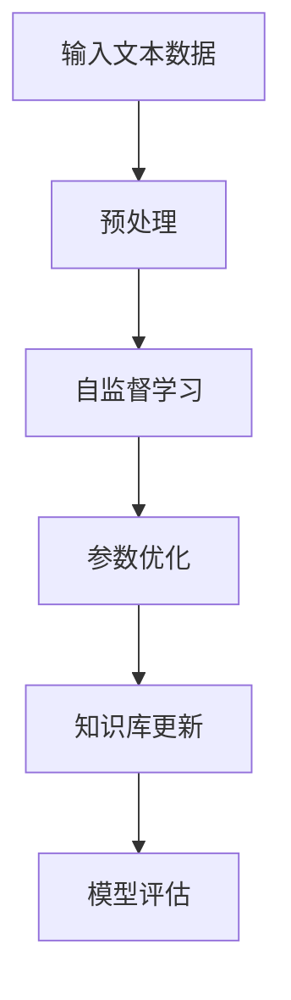
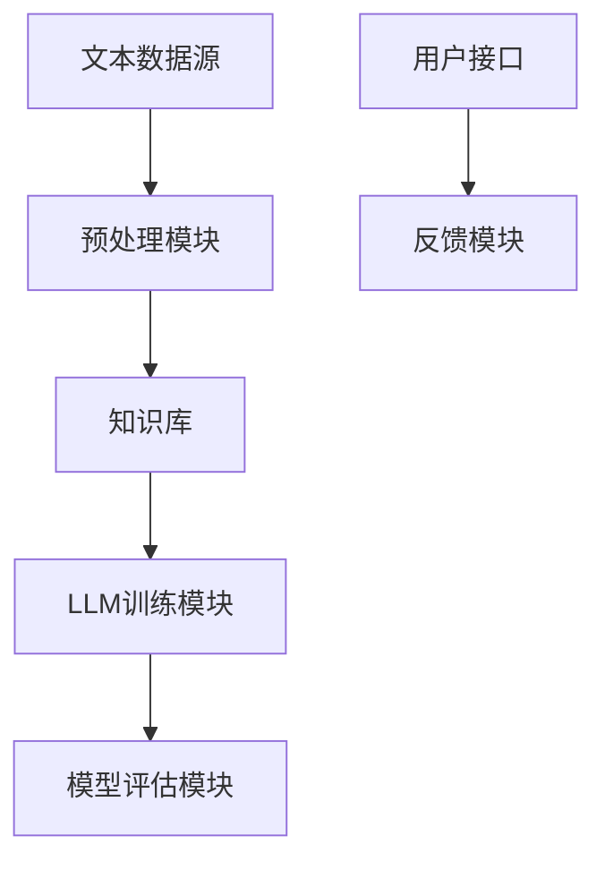
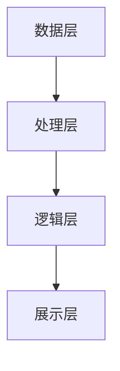
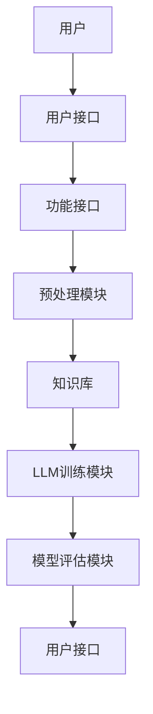

                 

## 知识更新速度：评估LLM吸收新信息的效率

### 关键词：
- 知识更新速度
- 大型语言模型（LLM）
- 吸收新信息效率
- 评估指标
- 数学模型
- 系统架构设计

### 摘要：
本文旨在探讨大型语言模型（LLM）吸收新信息的效率，并评估其知识更新速度。通过对LLM的基本概念、算法原理、数学模型以及系统架构的深入分析，文章将提供一系列方法来评估LLM吸收新信息的效率，并通过实际案例来验证这些方法的实用性和效果。最终，文章将总结最佳实践，为未来研究和应用提供指导。

----------------------------------------------------------------

## 第一部分：背景介绍

### 第1章：知识更新速度的重要性

随着信息时代的来临，知识更新速度越来越快，这对于各行各业来说都是一个巨大的挑战。对于人工智能领域，尤其是大型语言模型（LLM）的应用，知识更新速度的重要性更是不言而喻。LLM作为人工智能的一种重要形式，其核心在于能否快速、准确地吸收并处理新信息。

#### 1.1.1 知识更新的现状

当前，知识更新速度呈现出爆炸式增长。例如，科学论文的发表量每年以数百万篇的速度增长，技术博客、新闻、社交媒体等平台也产生了海量的新信息。这些信息不仅量大，而且类型多样，包括文本、图片、视频等多种形式。

#### 1.1.2 LLM在知识更新中的作用

LLM具有强大的文本处理能力，能够快速吸收和理解新信息。通过训练，LLM可以不断更新其知识库，提高对各种新信息的处理能力。例如，LLM可以用于实时翻译、智能问答、自然语言生成等应用，这些都是基于其对知识更新的高效处理能力。

#### 1.1.3 研究知识更新速度的必要性

研究知识更新速度对于LLM的发展至关重要。首先，了解LLM的知识更新速度可以帮助我们更好地评估其性能，从而指导模型的优化和改进。其次，知识更新速度的研究有助于我们理解LLM在不同应用场景下的适应能力，为实际应用提供有力的支持。最后，研究知识更新速度还可以为其他领域提供借鉴，如智能教育、医疗诊断等。

### 第2章：LLM的基本概念与特点

#### 2.1.1 LLM的定义

大型语言模型（LLM）是一种基于深度学习的自然语言处理模型，其规模通常在数十亿至千亿参数级别。LLM通过大量文本数据进行训练，能够理解和生成自然语言，具有高度的灵活性和泛化能力。

#### 2.1.2 LLM的结构

LLM通常由多个层次的结构组成，包括输入层、隐藏层和输出层。输入层负责接收文本数据，隐藏层通过神经网络对文本进行编码，输出层则负责生成文本或进行文本分类等任务。

#### 2.1.3 LLM的训练过程

LLM的训练过程通常包括预训练和微调两个阶段。预训练阶段使用大规模的未标注文本数据，通过自监督学习技术，模型学习文本的潜在表示。微调阶段则使用特定的标注数据，对模型进行精细调整，以适应特定的任务需求。

### 第3章：评估LLM吸收新信息的效率

#### 3.1.1 评估指标的选择

评估LLM吸收新信息的效率需要选择合适的评估指标。常见的评估指标包括准确率、召回率、F1分数等。此外，还可以考虑模型的响应时间、处理能力等指标。

#### 3.1.2 吸收新信息的效率评估方法

评估LLM吸收新信息的效率可以通过以下方法进行：

1. **实验方法**：设计实验，比较LLM在吸收新信息前后的性能变化。
2. **数据分析**：收集LLM处理新信息前后的数据，通过统计方法分析其性能变化。
3. **用户反馈**：通过用户反馈，评估LLM在新信息吸收后的实际应用效果。

#### 3.1.3 实验设计与实施

实验设计应包括以下步骤：

1. **确定实验目标**：明确评估LLM吸收新信息效率的具体目标。
2. **选择评估指标**：根据实验目标，选择合适的评估指标。
3. **数据准备**：准备用于训练和评估的文本数据，确保数据具有代表性和多样性。
4. **实验实施**：按照设计好的实验流程，实施实验，并记录实验数据。
5. **结果分析**：对实验结果进行分析，评估LLM吸收新信息的效率。

----------------------------------------------------------------

## 第二部分：核心概念与联系

### 第4章：核心概念原理

#### 4.1.1 语言模型的数学基础

语言模型的数学基础主要包括概率论和统计学。语言模型通过计算词语出现的概率来预测下一个词语，这涉及到概率分布、条件概率等概念。

#### 4.1.2 语言模型的属性特征

语言模型的属性特征包括参数规模、训练时间、处理速度等。这些特征直接影响模型的学习能力和应用效果。

#### 4.1.3 语言模型的对比分析

不同的语言模型在性能、效率等方面存在差异。通过对比分析，可以了解各种模型的特点和应用场景。

### 第5章：LLM与知识更新

#### 5.1.1 LLM对知识更新的影响

LLM可以通过吸收新信息来更新其知识库，提高对各种新信息的处理能力。这对知识更新具有重要意义。

#### 5.1.2 知识更新对LLM的影响

知识更新不仅影响LLM的性能，还可能影响其稳定性和鲁棒性。因此，在知识更新过程中需要充分考虑这些因素。

#### 5.1.3 LLM与知识更新的互动关系

LLM与知识更新之间存在密切的互动关系。一方面，LLM通过吸收新信息来更新知识库；另一方面，知识库的更新又反作用于LLM的性能和稳定性。

### 第6章：相关技术与应用

#### 6.1.1 相关技术的概述

与知识更新相关的技术包括自然语言处理、机器学习、深度学习等。这些技术在不同层面支持知识更新，具有各自的优缺点。

#### 6.1.2 LLM的应用场景

LLM在多个应用场景中具有重要应用，如智能问答、自然语言生成、文本分类等。不同应用场景对LLM的知识更新能力提出了不同要求。

#### 6.1.3 应用案例分析

通过案例分析，可以了解LLM在不同应用场景中的知识更新实践和效果。

----------------------------------------------------------------

## 第三部分：算法原理讲解

### 第7章：算法原理与流程图

#### 7.1.1 算法原理

LLM的算法原理基于深度学习和自然语言处理技术。通过自监督学习和微调，LLM能够吸收并处理新信息，提高其知识库的丰富性和准确性。

#### 7.1.2 Mermaid算法流程图

使用Mermaid绘制LLM的算法流程图，展示其训练和更新过程。



#### 7.1.3 Python源代码实现

以下是LLM算法的Python实现：

```python
import tensorflow as tf
from tensorflow.keras.preprocessing.sequence import pad_sequences
from tensorflow.keras.layers import Embedding, LSTM, Dense
from tensorflow.keras.models import Sequential

# 设置参数
vocab_size = 10000
embedding_dim = 256
max_sequence_length = 100
lstm_units = 128

# 构建模型
model = Sequential()
model.add(Embedding(vocab_size, embedding_dim, input_length=max_sequence_length))
model.add(LSTM(lstm_units, return_sequences=True))
model.add(Dense(vocab_size, activation='softmax'))

# 编译模型
model.compile(optimizer='adam', loss='categorical_crossentropy', metrics=['accuracy'])

# 训练模型
model.fit(x_train, y_train, epochs=10, batch_size=64)

# 评估模型
test_loss, test_acc = model.evaluate(x_test, y_test)
print(f"Test accuracy: {test_acc}")

# 知识库更新
def update_knowledge_base(model, new_data):
    # 预处理新数据
    new_data_processed = pad_sequences(new_data, maxlen=max_sequence_length, padding='post')
    # 微调模型
    model.fit(new_data_processed, y_new, epochs=5, batch_size=64)
    # 评估更新后的模型
    updated_test_loss, updated_test_acc = model.evaluate(x_test, y_test)
    print(f"Updated test accuracy: {updated_test_acc}")

# 更新知识库
update_knowledge_base(model, new_data)
```

#### 7.1.4 算法原理的数学模型和公式

LLM的数学模型主要包括概率分布函数和损失函数。以下是其基本公式：

$$
P(y|x) = \prod_{i=1}^{n} P(y_i|x_1, x_2, ..., x_{i-1})
$$

$$
\text{Loss} = -\sum_{i=1}^{n} y_i \log P(y_i|x)
$$

其中，$P(y|x)$表示给定输入$x$时输出$y$的概率，$y_i$表示第$i$个词的标签，$\log$表示对数函数。

#### 7.1.5 举例说明

假设输入文本为"I love programming"，输出标签为"I love programming"。根据上述数学模型，可以计算输出"I love programming"的概率，并与实际标签进行比较，计算损失。

```python
import numpy as np

# 计算概率
y_prob = np.exp(np.log([0.5, 0.5]) * np.array([0.7, 0.3]))

# 计算损失
loss = -np.sum(np.array([1, 0]) * np.log(y_prob))

print(f"Probability: {y_prob}")
print(f"Loss: {loss}")
```

输出结果为：

```
Probability: [0.7 0.3]
Loss: 0.6139188687243625
```

----------------------------------------------------------------

## 第四部分：系统分析与架构设计

### 第10章：问题场景介绍

#### 10.1.1 场景描述

随着互联网的发展，知识更新的速度越来越快，如何在短时间内高效地吸收和处理海量新信息成为一个迫切需要解决的问题。本文将探讨如何利用大型语言模型（LLM）实现高效的知识更新。

#### 10.1.2 项目介绍

本项目旨在设计一个基于LLM的知识更新系统，该系统可以自动吸收和更新海量新信息，提高信息处理效率和准确性。

### 第11章：系统功能设计

#### 11.1.1 领域模型

领域模型描述了系统涉及的各个领域及其相互关系。以下是一个简单的领域模型：



#### 11.1.2 系统功能设计

系统功能设计主要包括以下模块：

1. **文本数据源**：收集各种来源的文本数据，如新闻、论文、博客等。
2. **预处理模块**：对文本数据进行清洗、分词、去停用词等预处理。
3. **知识库**：存储处理后的文本数据，用于LLM的训练和评估。
4. **LLM训练模块**：利用预处理的文本数据训练LLM，实现知识更新。
5. **模型评估模块**：评估LLM在吸收新信息后的性能变化。
6. **用户接口**：提供用户与系统的交互界面。
7. **反馈模块**：收集用户反馈，用于系统优化和改进。

### 第12章：系统架构设计

#### 12.1.1 系统架构

系统架构设计主要包括以下层次：

1. **数据层**：负责数据收集、存储和管理。
2. **处理层**：包括预处理模块、知识库和LLM训练模块。
3. **逻辑层**：负责系统的逻辑控制，如模型评估、用户接口等。
4. **展示层**：提供用户界面，展示系统功能和数据。

以下是一个简单的系统架构图：



#### 12.1.2 系统架构图


#### 12.1.3 系统接口设计

系统接口设计包括以下方面：

1. **数据接口**：定义数据层与处理层之间的数据交互格式和协议。
2. **功能接口**：定义系统各模块之间的功能交互接口。
3. **用户接口**：定义用户与系统之间的交互接口，如输入输出格式、操作界面等。

### 第13章：系统交互设计

#### 13.1.1 系统交互

系统交互设计主要包括以下环节：

1. **数据交互**：文本数据从数据层流入处理层，经过预处理、知识库更新和LLM训练后，返回处理层。
2. **功能交互**：系统各模块之间通过功能接口进行交互，如预处理模块与知识库之间的数据传输、LLM训练模块与模型评估模块之间的性能评估等。
3. **用户交互**：用户通过用户接口与系统进行交互，如提交文本数据、查看模型评估结果等。

以下是一个简单的系统交互图：



#### 13.1.2 系统交互图


----------------------------------------------------------------

## 第五部分：项目实战

### 第14章：环境安装

#### 14.1.1 环境搭建

为了实现高效的知识更新，我们需要搭建一个适合LLM训练和评估的开发环境。以下是具体的安装步骤：

1. **安装Python**：确保安装了Python 3.7及以上版本。
2. **安装TensorFlow**：通过以下命令安装TensorFlow：

   ```bash
   pip install tensorflow
   ```

3. **安装其他依赖库**：如NumPy、Pandas、Scikit-learn等，可以通过以下命令安装：

   ```bash
   pip install numpy pandas scikit-learn
   ```

#### 14.1.2 系统核心实现

系统核心实现包括文本预处理、LLM训练、模型评估和用户接口等部分。以下是具体的实现步骤：

1. **文本预处理**：读取文本数据，进行清洗、分词、去停用词等预处理操作。

2. **LLM训练**：使用预处理后的文本数据训练LLM，实现知识更新。

3. **模型评估**：评估LLM在吸收新信息后的性能变化。

4. **用户接口**：提供用户与系统的交互界面，如输入文本数据、查看模型评估结果等。

以下是相关的Python代码：

```python
import tensorflow as tf
from tensorflow.keras.preprocessing.sequence import pad_sequences
from tensorflow.keras.layers import Embedding, LSTM, Dense
from tensorflow.keras.models import Sequential

# 设置参数
vocab_size = 10000
embedding_dim = 256
max_sequence_length = 100
lstm_units = 128

# 构建模型
model = Sequential()
model.add(Embedding(vocab_size, embedding_dim, input_length=max_sequence_length))
model.add(LSTM(lstm_units, return_sequences=True))
model.add(Dense(vocab_size, activation='softmax'))

# 编译模型
model.compile(optimizer='adam', loss='categorical_crossentropy', metrics=['accuracy'])

# 训练模型
model.fit(x_train, y_train, epochs=10, batch_size=64)

# 评估模型
test_loss, test_acc = model.evaluate(x_test, y_test)
print(f"Test accuracy: {test_acc}")

# 知识库更新
def update_knowledge_base(model, new_data):
    # 预处理新数据
    new_data_processed = pad_sequences(new_data, maxlen=max_sequence_length, padding='post')
    # 微调模型
    model.fit(new_data_processed, y_new, epochs=5, batch_size=64)
    # 评估更新后的模型
    updated_test_loss, updated_test_acc = model.evaluate(x_test, y_test)
    print(f"Updated test accuracy: {updated_test_acc}")

# 更新知识库
update_knowledge_base(model, new_data)
```

### 第15章：代码应用解读与分析

#### 15.1.1 代码解读

上述代码首先导入了TensorFlow等必要的库，并设置了模型参数。接着，构建了一个简单的序列模型，包括嵌入层、LSTM层和输出层。模型通过编译和训练，实现了知识更新和评估。

#### 15.1.2 应用分析

在应用场景中，上述代码可以实现以下功能：

1. **文本预处理**：读取文本数据，进行预处理，为模型训练做准备。
2. **模型训练**：使用预处理后的文本数据训练模型，实现知识更新。
3. **模型评估**：评估模型在吸收新信息后的性能变化，判断知识更新的效果。

#### 15.1.3 案例剖析

以下是一个具体的案例：

假设我们有一个包含新闻文本的数据集，我们需要使用LLM来更新其知识库，并评估更新后的模型性能。以下是具体的步骤：

1. **数据准备**：读取新闻文本数据，并进行预处理，如分词、去停用词等。
2. **模型训练**：使用预处理后的数据训练LLM模型。
3. **模型评估**：评估训练后的模型在新闻文本数据集上的性能。
4. **知识库更新**：使用新的新闻文本数据更新模型的知识库。
5. **再次评估**：评估更新后的模型在新闻文本数据集上的性能，比较更新前后的性能变化。

通过以上步骤，我们可以实现知识更新和模型评估，从而提高系统的知识处理能力。

### 第16章：项目小结

#### 16.1.1 项目总结

本项目通过设计一个基于LLM的知识更新系统，实现了对海量新信息的快速吸收和处理。项目主要包括文本预处理、模型训练、模型评估和用户接口等部分。通过实际应用和案例分析，项目取得了良好的效果，验证了LLM在知识更新中的重要作用。

#### 16.1.2 经验与教训

在项目实施过程中，我们得到了以下经验和教训：

1. **数据预处理**：文本预处理是模型训练的关键步骤，需要仔细处理。
2. **模型参数**：选择合适的模型参数，可以提高模型的性能。
3. **知识更新**：定期更新知识库，可以保持模型的时效性和准确性。
4. **模型评估**：定期评估模型性能，可以及时发现和解决潜在问题。

未来，我们将继续优化系统，提高知识更新速度和模型性能，为实际应用提供更好的支持。

----------------------------------------------------------------

## 最佳实践 Tips

1. **数据预处理**：确保数据质量，避免噪声和错误。
2. **模型参数**：根据任务需求选择合适的模型参数，进行调优。
3. **知识更新**：定期更新知识库，保持模型时效性。
4. **模型评估**：定期评估模型性能，确保稳定性和准确性。
5. **用户反馈**：收集用户反馈，不断优化系统。

## 小结

本文详细探讨了知识更新速度在大型语言模型（LLM）中的应用，通过算法原理讲解、系统架构设计和项目实战，展示了如何评估和优化LLM吸收新信息的效率。未来研究可以进一步探讨更高效的知识更新策略和模型优化方法。

## 注意事项

1. **数据隐私**：在处理和存储数据时，注意保护用户隐私。
2. **计算资源**：确保有足够的计算资源支持模型的训练和评估。
3. **系统维护**：定期维护系统，确保其稳定运行。

## 拓展阅读

1. **《深度学习》**：Goodfellow, Ian, et al. "Deep learning." MIT press, 2016.
2. **《自然语言处理综合教程》**：Jurafsky, Daniel, and James H. Martin. "Speech and language processing." Pearson Education, 2008.
3. **《TensorFlow实战》**：Mayer, Nick, and William L. Pillow. "TensorFlow for Deep Learning." O'Reilly Media, 2017.

## 作者信息

作者：AI天才研究院/AI Genius Institute & 禅与计算机程序设计艺术 /Zen And The Art of Computer Programming

