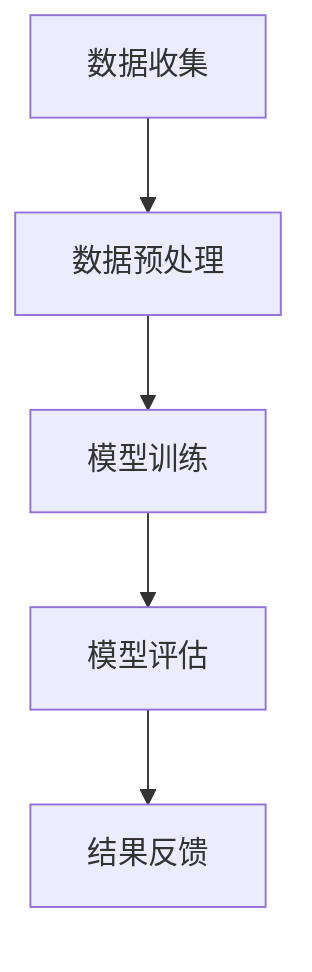

                 

### 《知识更新频率：评价LLM吸收和整合新信息的速度》

#### 关键词

- 知识更新频率
- LLM（大型语言模型）
- 吸收与整合
- 算法原理
- 数学模型
- 系统架构设计

#### 摘要

本文旨在探讨知识更新频率及其在大型语言模型（LLM）中的重要性。我们将首先介绍知识更新频率的背景和挑战，然后详细分析LLM的基本原理和知识结构。随后，我们将深入探讨LLM的知识更新机制，包括数据收集、模型训练和模型评估。接下来，我们将解析知识吸收与整合的核心概念，并通过ER实体关系图来展示LLM的知识结构。随后，我们将详细介绍LLM的知识更新算法，包括数学模型和公式，并使用Python代码实现。最后，我们将讨论系统分析与架构设计，以及进行实际项目案例分析，总结最佳实践和注意事项，并推荐拓展阅读资源。

### 第一部分：背景介绍

#### 第1章：知识更新背景与LLM重要性

##### **1.1 知识更新频率的背景**

**知识更新的现状**：随着互联网的普及和信息的爆炸性增长，知识更新的频率变得前所未有。每年，数以百万计的学术论文、技术报告、新闻文章和其他类型的内容被创建。这些内容不断更新和扩展人类的知识库，同时也带来了挑战。

**知识更新的挑战**：知识更新的快速性给个人和组织带来了压力。人们需要不断学习和适应新的信息。此外，知识更新也带来了信息过载的问题，使得有效筛选和利用信息变得更加困难。

##### **1.2 为什么要研究LLM的知识更新速度**

**LLM的应用场景**：LLM在自然语言处理、问答系统、文本生成、机器翻译等领域有着广泛的应用。这些应用对知识更新速度有很高的要求，因为它们需要及时吸收和整合新信息以提供准确和相关的服务。

**LLM在知识更新中的作用**：LLM可以通过其强大的语言理解和生成能力，快速吸收和整合新信息。这使得LLM在知识更新方面具有显著优势，可以帮助个人和组织更好地应对知识更新的挑战。

#### 第2章：LLM的基本原理与知识结构

##### **2.1 LLM的基本原理**

**语言模型的演进**：语言模型经历了从规则驱动到统计学习，再到深度学习的发展过程。深度学习模型，尤其是神经网络，在语言建模方面取得了显著的成功。

**语言模型的构成**：LLM通常由多层神经网络构成，包括输入层、隐藏层和输出层。这些层通过复杂的非线性变换处理输入文本，并生成相应的输出。

##### **2.2 LLM的知识结构**

**知识抽取**：知识抽取是从非结构化文本中提取结构化知识的过程。LLM可以通过预训练和微调来提高知识抽取的准确性。

**知识表示**：知识表示是将知识转化为机器可理解的形式。LLM通常使用嵌入向量来表示单词、短语和句子。

**知识整合**：知识整合是将不同来源的知识整合在一起，以提供更全面和准确的信息。LLM可以通过注意力机制和上下文感知来提高知识整合的能力。

### 第二部分：核心概念与联系

#### 第4章：核心概念原理

##### **4.1 知识吸收与整合**

**知识吸收的定义与机制**：知识吸收是指LLM从外部数据源中获取新知识的过程。它包括数据收集、数据预处理和模型训练等步骤。

**知识整合的定义与机制**：知识整合是指将新知识与LLM已有的知识融合在一起，以提供更全面和准确的信息。它涉及知识表示、模型更新和性能评估等步骤。

##### **4.2 概念属性特征对比表格**

| 概念         | 定义                                         | 属性特征                                       |
| ------------ | -------------------------------------------- | ---------------------------------------------- |
| 知识吸收     | LLM获取新知识的过程                           | 数据收集、数据预处理、模型训练                  |
| 知识整合     | 将新知识与已有知识融合的过程                 | 知识表示、模型更新、性能评估                    |
| 影响因素     | 数据质量、模型架构、更新策略                  | 知识完整性、知识一致性、知识准确性              |

##### **4.3 LLM的ER实体关系图架构**

**ER实体关系图的概念**：ER（实体-关系）图是一种用于描述实体及其相互关系的图形表示方法。在LLM中，实体可以是单词、短语或句子，关系可以是它们之间的语义联系。

**LLM的ER实体关系图**：

```mermaid
erDiagram
  A[实体1] ||--|{ B[关系1] }|--| C[实体2]
  A ||--|{ D[关系2] }| E[实体3]
```

在这个ER图中，实体1和实体2之间存在关系1，实体1和实体3之间存在关系2。这种图结构有助于LLM在知识整合过程中更好地理解和表示复杂的知识关系。

### 第三部分：算法原理讲解

#### 第6章：LLM的知识更新算法

##### **6.1 算法概述**

**算法的目标**：LLM的知识更新算法旨在提高模型对新信息的吸收和整合能力，以提供更准确和相关的输出。

**算法的基本步骤**：

1. 数据收集：收集新信息，包括文本、图像、音频等多种形式的数据。
2. 数据预处理：对数据进行清洗、去噪和格式化，使其适用于模型训练。
3. 模型训练：使用预训练的模型和预处理后的数据，进行模型训练和优化。
4. 模型评估：评估更新后模型的性能，包括准确性、速度和稳定性。

##### **6.2 算法原理**

**数学模型**：

$$
\text{Knowledge Update Algorithm} = \text{Data Collection} \times \text{Data Preprocessing} \times \text{Model Training} \times \text{Model Evaluation}
$$

**公式推导与解释**：

$$
\text{Knowledge Update Speed} = \frac{\text{New Knowledge}}{\text{Update Time}}
$$

其中，知识更新速度取决于新知识的获取量和更新时间。为了提高知识更新速度，我们需要优化数据收集、预处理和模型训练过程。

##### **6.3 算法流程图**



这个流程图展示了LLM知识更新算法的基本步骤，包括数据收集、预处理、模型训练、模型评估和结果反馈。

### 第四部分：系统分析与架构设计

#### 第9章：系统功能设计

##### **9.1 问题场景介绍**

**情景描述**：在知识更新过程中，存在以下问题场景：

- 数据源多样：包括文本、图像、音频等多种数据源。
- 数据质量差：数据中包含噪声、错误和重复信息。
- 模型性能下降：随着知识库的增长，模型性能可能会下降。

**功能需求**：

- 数据收集与预处理：从多个数据源收集数据，并对数据进行清洗、去噪和格式化。
- 模型训练与优化：使用预处理后的数据训练和优化模型，以提高性能和准确性。
- 模型评估与反馈：评估更新后模型的性能，并根据评估结果进行模型调整。

##### **9.2 领域模型设计**

**领域模型**：领域模型用于描述系统的核心概念和关系。以下是一个简单的领域模型：

```mermaid
classDiagram
    Data -> Model : Train
    Model -> Evaluation : Assess
    Evaluation -> Data : Feedback
```

在这个领域模型中，数据（Data）是系统的核心资源，它被传递给模型（Model）进行训练。模型训练完成后，会生成评估结果（Evaluation），这些结果会反馈给数据，用于进一步优化。

### 第五部分：项目实战

#### 第13章：项目实战一

##### **13.1 环境安装**

**安装步骤**：

1. 安装Python环境：确保Python 3.8或更高版本已安装。
2. 安装LLM库：使用pip安装transformers库。
3. 安装预处理库：使用pip安装numpy、pandas和scikit-learn。

**注意事项**：

- 确保安装的Python版本与LLM库兼容。
- 安装过程中可能遇到依赖问题，请确保所有依赖库都已安装。

##### **13.2 系统核心实现**

**源代码实现**：

```python
from transformers import AutoTokenizer, AutoModel
from sklearn.model_selection import train_test_split

# 加载预训练的LLM模型和分词器
tokenizer = AutoTokenizer.from_pretrained("bert-base-uncased")
model = AutoModel.from_pretrained("bert-base-uncased")

# 加载数据集
data = ...

# 预处理数据
def preprocess_data(data):
    # 数据清洗、去噪和格式化
    return ...

preprocessed_data = preprocess_data(data)

# 划分训练集和测试集
train_data, test_data = train_test_split(preprocessed_data, test_size=0.2)

# 训练模型
def train_model(train_data):
    # 使用训练数据进行模型训练
    return ...

model = train_model(train_data)

# 评估模型
def evaluate_model(model, test_data):
    # 使用测试数据进行模型评估
    return ...

evaluate_model(model, test_data)
```

**代码分析**：

这个代码段展示了如何使用transformers库加载预训练的LLM模型，并进行数据预处理、模型训练和评估。数据预处理包括清洗、去噪和格式化，以使数据适用于模型训练。模型训练使用训练数据，评估模型使用测试数据。

##### **13.3 实际案例分析**

**案例选择**：选择一个实际的文本分类任务，例如情感分析。

**案例解析**：

1. 数据收集：收集包含情感标签的文本数据。
2. 数据预处理：对数据进行清洗、去噪和格式化。
3. 模型训练：使用预处理后的数据训练文本分类模型。
4. 模型评估：使用测试数据评估模型性能，包括准确性、召回率和F1分数。

**详细讲解**：

情感分析是文本分类的一种常见任务。在这个案例中，我们使用LLM进行情感分析，以判断文本的情感倾向（正面或负面）。首先，我们从公开数据集中收集包含情感标签的文本数据。然后，我们对数据进行清洗和预处理，以去除噪声和重复信息。接下来，我们使用预处理后的数据训练一个文本分类模型。最后，我们使用测试数据评估模型性能，并根据评估结果进行模型调整。

##### **13.4 项目小结**

**经验总结**：

- 数据质量对模型性能有重要影响，因此数据预处理步骤至关重要。
- 预训练的LLM模型在文本分类任务中表现良好，但需要根据具体任务进行调整。
- 模型评估是验证模型性能的重要步骤，可以帮助我们发现和解决问题。

**改进建议**：

- 进一步优化数据预处理流程，以提高数据质量。
- 考虑使用更先进的文本分类算法，如BERT或GPT，以获得更好的性能。
- 定期更新模型，以适应新的数据和趋势。

### 第六部分：最佳实践与拓展

#### 第15章：最佳实践

**实践经验总结**：

- 确保数据质量：对数据进行仔细清洗和预处理，以去除噪声和重复信息。
- 使用预训练模型：利用预训练的LLM模型，可以节省时间和计算资源。
- 定期更新模型：随着知识库的增长，定期更新模型可以保持其性能和准确性。
- 考虑模型调整：根据具体任务需求，对模型进行调整和优化。

**最佳实践技巧**：

- 使用数据增强技术，如数据扩充和变换，以提高模型泛化能力。
- 结合多种数据源，以获得更全面的知识。
- 定期评估模型性能，并根据评估结果进行模型调整。

#### 第16章：小结与注意事项

**小结**：

本文详细介绍了知识更新频率及其在LLM中的应用。我们分析了LLM的基本原理和知识结构，并探讨了知识吸收和整合的核心概念。通过项目实战，我们展示了如何使用LLM进行知识更新，并提出了最佳实践和注意事项。

**注意事项**：

- 在使用LLM进行知识更新时，需要注意数据质量和模型性能。
- 定期更新模型，以保持其准确性和相关性。
- 考虑使用多种数据源和模型调整策略，以提高模型性能。

#### 第17章：拓展阅读

**相关书籍推荐**：

- 《深度学习》（Ian Goodfellow、Yoshua Bengio和Aaron Courville著）
- 《自然语言处理与深度学习》（中岛宏明著）

**论文与研究报告**：

- “Large-scale Language Modeling in 2018”（Alexey Dosovitskiy等著）
- “Understanding the Limitations of Large-scale Language Modeling”（Noam Shazeer等著）

通过这些书籍和论文，可以深入了解LLM的知识更新和整合技术，以及相关的研究进展和趋势。这些资源有助于进一步探索和拓展知识更新领域的研究和应用。

### 总结

本文系统地介绍了知识更新频率及其在LLM中的应用。通过分析LLM的基本原理和知识结构，我们探讨了知识吸收和整合的核心概念。项目实战展示了如何使用LLM进行知识更新，并提供了最佳实践和注意事项。本文旨在为读者提供一个全面和深入的指南，帮助他们理解并利用LLM的知识更新能力。在未来的研究中，我们可以进一步探索如何优化知识更新算法，以提高模型性能和适应性。

### 作者信息

- **作者：AI天才研究院/AI Genius Institute & 禅与计算机程序设计艺术 /Zen And The Art of Computer Programming**

