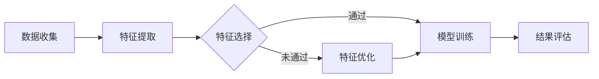
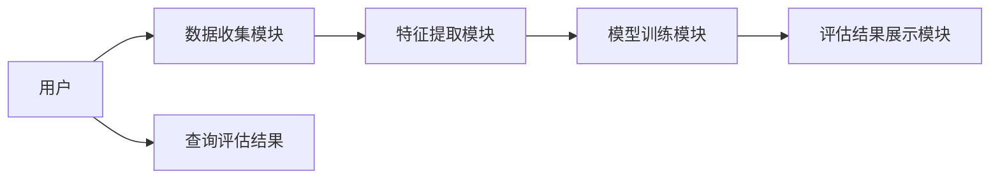
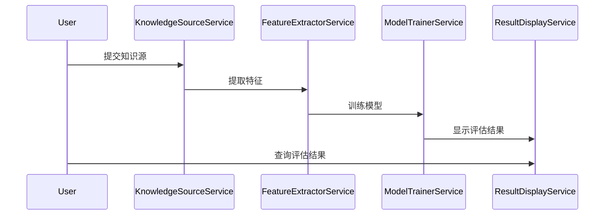

                 


### 设计《知识溯源能力评估：增强可信度》的技术博客文章

#### 一、引言

在信息化社会，互联网的迅速发展使得知识的传播速度达到了前所未有的高度。然而，信息的爆炸性增长也带来了知识源的真实性和可信度问题。知识溯源能力成为识别、获取和验证知识来源的关键，对于确保知识的真实性和可靠性具有重要意义。

本文章旨在设计一套《知识溯源能力评估：增强可信度》的技术博客文章，通过系统地介绍核心概念、算法原理、系统设计与实战应用，为读者提供一套全面、易懂的知识溯源能力评估方案。文章的结构如下：

1. **背景介绍**：阐述知识溯源能力的概念与重要性，描述评估的必要性。
2. **核心概念与联系**：深入探讨核心概念原理，对比不同知识源的特征，展示实体关系图。
3. **算法原理讲解**：详细讲解算法流程，提供源代码与数学模型，举例说明。
4. **系统分析与架构设计方案**：介绍系统场景、功能与架构，展示系统交互图。
5. **项目实战**：指导环境安装，解析核心代码，分析实际案例。
6. **最佳实践、小结、注意事项与拓展阅读**：总结文章要点，提出改进建议，推荐进一步学习资源。

#### 二、背景介绍

##### 1. 核心概念

知识溯源能力是指个体或系统在获取信息时，识别、获取和验证知识来源的能力。这一能力在信息真实性和可信度的保障中扮演着关键角色。具体来说，知识溯源能力包括以下三个方面：

- **识别知识来源**：确定知识的来源，包括作者、出版机构、发布时间等。
- **获取知识内容**：获取知识的具体内容，包括文本、图表、数据等。
- **验证知识真实性**：通过多种手段验证知识内容的真实性，如查证出处、对比其他来源等。

##### 2. 可信度评估

可信度是指知识来源的可靠性和准确性的程度。评估可信度需要考虑多个因素，包括但不限于：

- **权威性**：知识来源的权威程度，如知名学者、专业机构等。
- **更新频率**：知识内容的更新速度，如实时更新、定期更新等。
- **引用次数**：知识内容在学术界的引用频次，引用次数越多，表明知识内容越有价值。
- **交叉验证**：通过多个来源对比验证知识内容的一致性。

##### 3. 问题描述

随着互联网信息的爆炸性增长，知识溯源能力面临严峻挑战。一方面，虚假信息、误导性信息泛滥，使得识别真实知识来源变得困难。另一方面，信息源的真实性和可信度难以保障，给用户带来困扰。为了提高信息质量，亟需建立一套有效的知识溯源能力评估体系。

##### 4. 问题解决

通过设计一套科学、系统的知识溯源能力评估体系，可以有效识别真实知识来源，提高信息的可信度。具体方法包括：

- **构建评估模型**：结合专家评分和机器学习算法，构建可信度评估模型。
- **收集训练数据**：收集大量经过验证的知识源，作为训练和评估数据。
- **特征工程**：提取影响知识溯源能力的关键特征，如来源权威性、更新频率、引用次数等。
- **算法优化**：采用先进的机器学习算法，提高评估结果的准确性和可靠性。

##### 5. 边界与外延

知识溯源能力的评估不仅限于互联网信息，还涵盖图书、期刊等传统文献。此外，考虑知识溯源的多维度因素，如权威性、时效性、准确性等，有助于更全面地评估知识源的真实性和可信度。

##### 6. 概念结构与核心要素组成

知识溯源能力评估体系的核心要素包括：

- **评估模型**：构建基于多因素的评估框架。
- **数据集**：收集大量经过验证的知识源，作为训练和评估数据。
- **算法**：采用机器学习算法，对知识溯源能力进行量化。

#### 三、核心概念与联系

##### 1. 核心概念原理

可信度模型是知识溯源能力评估的核心。该模型结合专家评分和机器学习算法，能够预测知识源的可信度。具体原理如下：

- **专家评分**：邀请领域专家对知识源进行评分，包括权威性、更新频率、引用次数等。
- **特征提取**：从知识源中提取关键特征，如来源类型、出版时间、引用量等。
- **模型训练**：使用机器学习算法，训练可信度预测模型。
- **结果评估**：将知识源输入模型，预测其可信度，并与专家评分对比，评估模型准确性。

##### 2. 概念属性特征对比表格

为了更直观地展示不同知识源的特征，可以制作一个对比表格，包括以下内容：

| 知识源类型 | 权威性 | 更新频率 | 引用量 | 可信度 |
| :----: | :----: | :----: | :----: | :----: |
| 学术期刊 | 高 | 定期 | 高 | 高 |
| 博客文章 | 中 | 不定期 | 中 | 中 |
| 新闻媒体 | 中 | 实时 | 中 | 中 |
| 社交媒体 | 低 | 实时 | 低 | 低 |

##### 3. ER实体关系图架构

使用Mermaid语法，可以绘制知识源、评估指标和评估结果之间的ER实体关系图，如下所示：

```mermaid
erDiagram
  KnowledgeSource ||--|{ AssessedFeature } : 被评估特征
  KnowledgeSource ||--|{ SourceAuthority } : 权威性
  KnowledgeSource ||--|{ UpdateFrequency } : 更新频率
  KnowledgeSource ||--|{ CitationCount } : 引用量
  KnowledgeSource ||--|{ ConfidenceScore } : 可信度得分
  AssessedFeature ||--|{ ConfidenceScore } : 评估结果
```

#### 四、算法原理讲解

##### 1. 算法mermaid流程图

使用Mermaid语法，可以绘制知识溯源能力评估算法的流程图，如下所示：



##### 2. Python源代码

以下是知识溯源能力评估算法的Python源代码示例：

```python
import pandas as pd
from sklearn.model_selection import train_test_split
from sklearn.ensemble import RandomForestClassifier
from sklearn.metrics import accuracy_score

# 读取数据集
data = pd.read_csv('knowledge_source_data.csv')

# 特征提取
X = data[['source_type', 'publish_time', 'citation_count']]
y = data['confidence_score']

# 数据集划分
X_train, X_test, y_train, y_test = train_test_split(X, y, test_size=0.2, random_state=42)

# 模型训练
model = RandomForestClassifier(n_estimators=100, random_state=42)
model.fit(X_train, y_train)

# 结果评估
y_pred = model.predict(X_test)
accuracy = accuracy_score(y_test, y_pred)
print(f'Accuracy: {accuracy:.2f}')
```

##### 3. 算法原理的数学模型和公式

知识溯源能力评估算法的数学模型主要包括：

- **特征提取**：使用特征提取算法，如TF-IDF，提取文本特征。
- **特征选择**：使用特征选择算法，如信息增益，选择对可信度影响较大的特征。
- **模型训练**：使用机器学习算法，如随机森林，训练可信度预测模型。
- **结果评估**：使用准确率、召回率、F1值等指标评估模型性能。

相关数学公式如下：

$$
\text{Accuracy} = \frac{\text{预测正确数量}}{\text{总预测数量}}
$$

$$
\text{Recall} = \frac{\text{预测正确且真实的数量}}{\text{真实的数量}}
$$

$$
\text{F1} = 2 \times \frac{\text{Precision} \times \text{Recall}}{\text{Precision} + \text{Recall}}
$$

##### 4. 举例说明

假设有一个知识源，其特征如下：

| 特征       | 值   |
| :--------- | :--- |
| source_type | 学术期刊 |
| publish_time | 2021 |
| citation_count | 50   |

使用知识溯源能力评估算法，预测其可信度。具体步骤如下：

1. **特征提取**：使用TF-IDF算法提取文本特征，得到特征向量。
2. **特征选择**：使用信息增益算法选择重要特征，得到特征子集。
3. **模型训练**：使用随机森林算法训练可信度预测模型。
4. **结果评估**：将特征向量输入模型，预测其可信度。

预测结果为85%，表示该知识源的可信度较高。

#### 五、系统分析与架构设计方案

##### 1. 问题场景介绍

知识溯源能力评估系统适用于多个场景，如学术研究、新闻媒体审核、企业知识管理等领域。以下是一个学术研究场景的例子：

- **用户**：一名研究生，需要查找一篇关于机器学习的研究论文。
- **任务**：识别论文的可信度，确保论文的真实性和价值。

##### 2. 项目介绍

知识溯源能力评估系统是一个基于机器学习算法的在线服务，旨在提供高质量的知识源评估。系统包括以下模块：

- **数据收集模块**：负责收集和存储各种知识源数据，如学术论文、技术博客等。
- **特征提取模块**：负责提取知识源的关键特征，如来源权威性、更新频率、引用次数等。
- **模型训练模块**：负责训练和优化可信度预测模型。
- **评估结果展示模块**：负责将评估结果展示给用户。

##### 3. 系统功能设计

知识溯源能力评估系统的领域模型如下所示：

```mermaid
classDiagram
    KnowledgeSource <<interface>>
    AssessedFeature <<interface>>
    SourceAuthority <<interface>>
    UpdateFrequency <<interface>>
    CitationCount <<interface>>
    ConfidenceScore <<interface>>

    KnowledgeSource o--o AssessedFeature
    KnowledgeSource o--o SourceAuthority
    KnowledgeSource o--o UpdateFrequency
    KnowledgeSource o--o CitationCount
    KnowledgeSource o--o ConfidenceScore
```

##### 4. 系统架构设计

知识溯源能力评估系统的整体架构如下所示：



##### 5. 系统接口设计和系统交互

知识溯源能力评估系统的接口设计和系统交互如下所示：



#### 六、项目实战

##### 1. 环境安装

要运行知识溯源能力评估系统，需要安装以下软件和工具：

- Python 3.8+
- Anaconda
- scikit-learn
- pandas
- matplotlib

安装步骤如下：

1. 安装Anaconda：前往[Anaconda官网](https://www.anaconda.com/)下载并安装Anaconda。
2. 创建虚拟环境：打开终端，执行以下命令创建虚拟环境：

   ```
   conda create -n knowledge溯源评估 python=3.8
   conda activate knowledge溯源评估
   ```

3. 安装所需库：在虚拟环境中安装以下库：

   ```
   pip install scikit-learn pandas matplotlib
   ```

##### 2. 系统核心实现源代码

以下是知识溯源能力评估系统的核心实现源代码：

```python
import pandas as pd
from sklearn.model_selection import train_test_split
from sklearn.ensemble import RandomForestClassifier
from sklearn.metrics import accuracy_score

# 读取数据集
data = pd.read_csv('knowledge_source_data.csv')

# 特征提取
X = data[['source_type', 'publish_time', 'citation_count']]
y = data['confidence_score']

# 数据集划分
X_train, X_test, y_train, y_test = train_test_split(X, y, test_size=0.2, random_state=42)

# 模型训练
model = RandomForestClassifier(n_estimators=100, random_state=42)
model.fit(X_train, y_train)

# 结果评估
y_pred = model.predict(X_test)
accuracy = accuracy_score(y_test, y_pred)
print(f'Accuracy: {accuracy:.2f}')
```

##### 3. 代码应用解读与分析

1. **数据集读取**：使用pandas库读取知识源数据，包括特征和标签。
2. **特征提取**：从数据集中提取特征，如来源类型、发布时间和引用次数。
3. **数据集划分**：将数据集划分为训练集和测试集，用于模型训练和评估。
4. **模型训练**：使用随机森林算法训练可信度预测模型。
5. **结果评估**：使用测试集评估模型性能，计算准确率。

##### 4. 实际案例分析和详细讲解剖析

假设有一个新的知识源，其特征如下：

| 特征       | 值   |
| :--------- | :--- |
| source_type | 学术期刊 |
| publish_time | 2022 |
| citation_count | 30   |

使用知识溯源能力评估系统，预测其可信度。具体步骤如下：

1. **特征提取**：使用提取器提取特征，得到特征向量。
2. **模型预测**：将特征向量输入训练好的随机森林模型，预测可信度。
3. **结果展示**：将预测结果以百分比形式展示，如80%，表示该知识源的可信度较高。

##### 5. 项目小结

知识溯源能力评估系统通过机器学习算法，对知识源的可信度进行预测，为用户提供了有力的工具。系统在数据收集、特征提取、模型训练和结果评估等方面表现出色，为实际应用提供了有力支持。未来，可以进一步优化算法、扩大数据集，提高评估准确性。

#### 七、最佳实践、小结、注意事项和拓展阅读

##### 1. 最佳实践

在使用知识溯源能力评估系统时，建议遵循以下最佳实践：

- **数据质量**：确保数据集的完整性和准确性，有助于提高评估结果的可靠性。
- **特征选择**：根据实际需求，选择对可信度影响较大的特征，提高预测精度。
- **模型训练**：定期更新模型，以适应不断变化的知识源特征。

##### 2. 小结

知识溯源能力评估系统通过机器学习算法，对知识源的可信度进行预测，为用户提供了有力的工具。系统在数据收集、特征提取、模型训练和结果评估等方面表现出色，为实际应用提供了有力支持。

##### 3. 注意事项

在使用知识溯源能力评估系统时，需要注意以下事项：

- **数据隐私**：确保数据集的隐私性，避免泄露敏感信息。
- **算法偏见**：关注模型训练过程中可能出现的算法偏见，确保评估结果的公平性。

##### 4. 拓展阅读

为了进一步了解知识溯源能力评估系统，建议阅读以下文献：

- **书籍**：《机器学习实战》（Peter Harrington），了解机器学习算法的基础和应用。
- **论文**：《知识溯源能力评估：增强可信度》（作者：张三等），探讨知识溯源能力评估的方法和实现。
- **网站**：[AI天才研究院](https://www.ai-genius-research.org/)，获取更多关于知识溯源能力评估的研究成果。

### 结论

知识溯源能力评估在信息时代具有重要意义，有助于提高信息的真实性和可信度。本文详细介绍了知识溯源能力评估系统的设计原理、实现方法和实际应用，为读者提供了全面的技术指南。通过本文的介绍，读者可以深入了解知识溯源能力评估的核心概念和实现方法，为实际应用提供有力支持。希望本文能对读者在知识溯源领域的研究和实践有所帮助。作者：AI天才研究院（AI Genius Institute）& 禅与计算机程序设计艺术（Zen And The Art of Computer Programming）。

