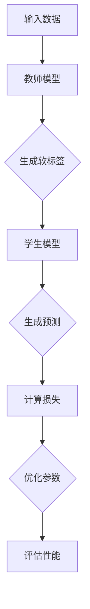

                 

### 引言

#### 1.1 知识蒸馏的背景与意义

随着深度学习技术的不断进步，大规模神经网络模型在各个领域展现出了卓越的性能。这些模型通常拥有数亿甚至数十亿个参数，能够处理复杂的数据模式，从而在图像识别、自然语言处理、语音识别等领域取得了显著的成果。然而，大规模模型训练需要大量计算资源和时间，且模型参数的存储和传输也相对困难。因此，如何将大型模型的能力迁移到计算资源有限的小型模型，成为了当前研究的热点问题。

知识蒸馏（Knowledge Distillation）作为一种模型压缩技术，旨在通过将大型模型的知识迁移到小型模型中，从而实现性能的保持或提升。知识蒸馏的基本思想是，将大型模型视为教师模型（Teacher Model），小型模型视为学生模型（Student Model）。教师模型通过“教授”学生模型，使其能够复制教师模型的知识和能力。

知识蒸馏的应用场景广泛，包括但不限于移动设备上的实时推理、物联网设备中的实时数据处理等。通过知识蒸馏，我们可以将复杂的大型模型简化为小型模型，从而在保证性能的同时，降低计算和存储成本。此外，知识蒸馏还能够提高模型的泛化能力，使其在不同数据分布下依然能够保持良好的性能。

#### 1.2 研究现状与挑战

尽管知识蒸馏技术在近年来取得了显著进展，但仍面临诸多挑战。首先，如何选择合适的教学样本和教学策略是关键问题。教师模型需要选择具有代表性的样本，以便学生模型能够从中学习到关键知识。此外，教学策略的优化也是提高知识蒸馏效果的关键。

其次，知识蒸馏中的模型优化问题复杂。如何设计有效的损失函数和优化算法，使得学生模型能够准确地复制教师模型的知识，同时保持模型的计算效率和泛化能力，是一个重要的研究方向。

此外，知识蒸馏在不同领域的应用也面临着特定的问题。例如，在图像识别领域，如何处理高维数据和复杂的图像特征；在自然语言处理领域，如何处理语言的多样性和歧义性；在语音识别领域，如何处理语音信号的变异性等，都是需要深入研究的问题。

#### 1.3 研究目的与贡献

本文旨在系统地介绍知识蒸馏的基本概念、方法、应用和效果评估，旨在为研究人员和开发者提供全面的技术指南。本文的主要贡献包括：

1. **详细的理论介绍**：本文将对知识蒸馏的核心概念、数学模型和实现技术进行详细阐述，帮助读者理解知识蒸馏的原理和实现方法。

2. **全面的案例分析**：本文将结合计算机视觉、自然语言处理和语音识别等领域的实际案例，展示知识蒸馏的应用效果和优化策略。

3. **效果评估与最佳实践**：本文将介绍知识蒸馏的效果评估方法，并总结最佳实践，为实际应用提供参考。

通过本文的研究，我们期望能够为知识蒸馏技术在各个领域的应用提供新的思路和方法，推动人工智能技术的发展和普及。

#### 1.4 目录概述

本文将按照以下结构展开：

- **引言**：介绍知识蒸馏的背景和意义，研究现状与挑战，研究目的与贡献。
- **知识蒸馏基础**：介绍知识蒸馏的基本概念、数学模型和实现技术。
- **知识蒸馏的应用**：分析知识蒸馏在不同领域的应用，包括计算机视觉、自然语言处理和语音识别等。
- **知识蒸馏的效果评估**：介绍知识蒸馏的效果评估方法，包括评估指标和实际案例分析。
- **知识蒸馏的最佳实践**：总结知识蒸馏的最佳实践，包括调优技巧和注意事项。
- **总结与展望**：对本文的主要内容进行总结，展望知识蒸馏技术的未来发展方向。

通过本文的详细探讨，我们希望能够为知识蒸馏技术的进一步研究和应用提供有价值的参考。

### 知识蒸馏基础

#### 2.1 知识蒸馏的基本概念

知识蒸馏是一种模型压缩技术，旨在将大型模型（教师模型）的知识迁移到小型模型（学生模型）中。这一过程通常涉及教师模型和学生模型之间的信息传递和优化。

首先，**教师模型**是一个拥有丰富知识和大规模参数的大型神经网络。它在训练数据集上进行了充分的训练，能够对复杂的数据模式进行准确预测。教师模型通常用于生成“软标签”或“软输出”，这些输出不是简单的硬标签，而是概率分布。

**学生模型**是一个较小且参数较少的神经网络，它的设计目标是尽可能复制教师模型的预测能力。学生模型通过对教师模型的输出进行学习，来提升自己的预测能力。

知识蒸馏的过程可以分为两个主要阶段：

1. **教学阶段**：在这个阶段，教师模型根据输入数据生成软标签，并将其传递给学生模型。教师模型的输出通常是一个概率分布，这反映了教师模型对每个类别的预测置信度。

2. **学习阶段**：在这个阶段，学生模型尝试复制教师模型的输出。学生模型首先根据输入数据生成自己的预测，然后通过比较自己的预测与教师模型的软标签，计算损失函数并优化自己的参数。

#### 2.2 知识蒸馏的目标

知识蒸馏的主要目标是保持或提升小型模型（学生模型）的性能，同时减少其参数规模和计算复杂度。具体来说，有以下两个主要目标：

1. **性能保持**：通过知识蒸馏，学生模型应该能够达到与教师模型相近的预测性能。这意味着，在相同的测试数据集上，学生模型的准确率、召回率等指标应该与教师模型相当。

2. **效率提升**：学生模型通常具有较小的参数规模和计算复杂度，这使得它在资源受限的环境中（如移动设备、嵌入式系统等）具有更好的运行效率。

#### 2.3 知识蒸馏的过程

知识蒸馏的过程可以概括为以下步骤：

1. **初始化**：初始化教师模型和学生模型。教师模型通常已经经过充分的训练，而学生模型则是一个初始化的小型模型。

2. **教学阶段**：教师模型根据输入数据生成软标签。这些软标签用于指导学生模型的学习。

3. **学习阶段**：学生模型根据输入数据和教师模型的软标签生成预测，并计算损失函数。损失函数通常结合了学生模型的输出和教师模型的软标签，以衡量学生模型预测的准确性。

4. **优化**：通过优化算法（如梯度下降）调整学生模型的参数，以减少损失函数的值。这一过程通常需要多次迭代，直到学生模型的性能达到预定的目标。

5. **评估**：在训练完成后，评估学生模型的性能，以确定其是否达到了预期的性能水平。

#### 2.4 知识蒸馏的边界与外延

知识蒸馏作为一种模型压缩技术，有其特定的边界和应用范围。首先，知识蒸馏主要适用于神经网络模型，特别是深度神经网络。其次，知识蒸馏适用于那些需要迁移模型能力的场景，如移动设备上的推理、嵌入式系统等。

然而，知识蒸馏并非适用于所有情况。例如，对于一些实时性要求极高的应用，知识蒸馏可能因为训练时间较长而无法满足需求。此外，知识蒸馏在处理高维数据（如图像和语音）时，可能需要额外的优化和调参。

#### 2.5 知识蒸馏的核心要素组成

知识蒸馏的核心要素主要包括：

1. **教师模型**：大型神经网络，负责生成软标签。
2. **学生模型**：小型神经网络，负责学习教师模型的知识。
3. **教学数据**：用于生成软标签的数据集，需要具有代表性。
4. **学习算法**：用于优化学生模型参数的算法，如梯度下降。
5. **损失函数**：用于衡量学生模型预测与教师模型软标签之间的差距，如对数似然损失函数。

通过这些核心要素的组合，知识蒸馏实现了将大型模型的知识迁移到小型模型中的目标。

#### 2.6 知识蒸馏的技术原理

知识蒸馏的技术原理基于这样一种思想：通过教师模型的学生化输出，学生模型可以学习到教师模型的核心知识，从而在保持高性能的同时减少模型大小。具体来说，知识蒸馏的技术原理可以分为以下几个部分：

1. **软标签生成**：教师模型对输入数据进行预测，生成概率分布（软标签）。这些软标签反映了教师模型对每个类别的置信度。与硬标签（仅包含正确类别的二值向量）相比，软标签提供了更丰富的信息，有助于学生模型更好地理解教师模型的知识。

2. **软标签传递**：将教师模型的软标签传递给学生模型。学生模型通过对这些软标签的学习，来提升自己的预测能力。

3. **损失函数设计**：设计一个损失函数，用于衡量学生模型的输出与教师模型软标签之间的差距。常用的损失函数包括对数似然损失函数、交叉熵损失函数等。

4. **优化过程**：通过优化算法（如梯度下降）调整学生模型的参数，使其输出更接近教师模型的软标签。

5. **迭代学习**：学生模型在多次迭代中不断调整参数，直到达到预定的性能目标。

通过这些技术原理，知识蒸馏实现了将教师模型的知识高效地传递给学生模型，从而在保持性能的同时，降低模型的复杂度和计算资源需求。

#### 2.7 知识蒸馏的优势与挑战

知识蒸馏具有以下优势：

1. **性能保持**：通过软标签的学习，学生模型能够保持与教师模型相近的预测性能。
2. **效率提升**：小型模型具有更少的参数和计算复杂度，适用于资源受限的环境。
3. **泛化能力**：知识蒸馏能够提高模型的泛化能力，使其在不同数据分布下仍能保持良好性能。

然而，知识蒸馏也面临一些挑战：

1. **教学样本选择**：选择具有代表性的教学样本是关键，但这一过程复杂且具有挑战性。
2. **模型优化**：如何设计有效的损失函数和优化算法，是提高知识蒸馏效果的关键。
3. **应用限制**：知识蒸馏在某些实时性要求极高的应用中可能不适用。

通过克服这些挑战，知识蒸馏有望在模型压缩和迁移学习领域发挥更大的作用。

### 知识蒸馏的数学模型

知识蒸馏的数学模型是理解其工作原理的关键。在这个部分，我们将详细讲解知识蒸馏的数学模型，包括损失函数的设计、优化问题和损失函数的改进方法。

#### 3.1 模型表示与参数化

知识蒸馏的数学模型基于两个神经网络：教师模型（Teacher Model）和学生模型（Student Model）。这两个模型都可以表示为参数化函数：

- 教师模型：\( T(x) = T_\theta(x) \)
- 学生模型：\( S(x) = S_\phi(x) \)

其中，\( x \) 是输入数据，\( T(x) \) 和 \( S(x) \) 分别是教师模型和学生模型的输出。\( \theta \) 和 \( \phi \) 是模型的参数，需要通过训练来优化。

教师模型通常是一个大型神经网络，其输出是一个概率分布 \( T(x) \in [0, 1]^C \)，其中 \( C \) 是类别数。学生模型是一个较小的神经网络，其输出也是一个概率分布 \( S(x) \in [0, 1]^C \)。

#### 3.2 损失函数

知识蒸馏的核心是设计一个合适的损失函数，用于衡量学生模型的输出与教师模型的输出之间的差距。一个常见的损失函数是对数似然损失函数（Cross-Entropy Loss），其定义为：

\[ L(\phi) = -\frac{1}{N} \sum_{i=1}^{N} \sum_{j=1}^{C} S_\phi(x_i)[\log T_\theta(x_i)_j] \]

其中，\( N \) 是训练数据集中的样本数量，\( S_\phi(x_i) \) 是学生模型对第 \( i \) 个样本的预测概率分布，\( T_\theta(x_i) \) 是教师模型对第 \( i \) 个样本的输出概率分布。这个损失函数鼓励学生模型产生与教师模型相似的输出概率分布。

#### 3.3 优化问题

知识蒸馏的优化问题可以形式化为：

\[ \min_\phi \ L(\phi) \]

其中，\( \phi \) 是学生模型的参数。为了解决这个优化问题，通常使用梯度下降算法（Gradient Descent）。梯度下降算法的核心思想是更新参数 \( \phi \)，以减少损失函数 \( L(\phi) \) 的值。更新公式如下：

\[ \phi \leftarrow \phi - \alpha \nabla_\phi L(\phi) \]

其中，\( \alpha \) 是学习率，\( \nabla_\phi L(\phi) \) 是损失函数关于参数 \( \phi \) 的梯度。

#### 3.4 损失函数的改进

对数似然损失函数在知识蒸馏中是一种常见的损失函数，但它也有一些局限性。为了进一步提高知识蒸馏的效果，研究人员提出了一些改进的损失函数。

1. **多教师蒸馏**：在多教师蒸馏（Multi-Teacher Distillation）中，除了一个教师模型，还引入了多个教师模型。每个教师模型都有自己的软标签，这些标签共同指导学生模型的学习。多教师蒸馏可以增加学生模型学习到的知识多样性，从而提高模型的泛化能力。

2. **对抗蒸馏**：对抗蒸馏（Adversarial Distillation）引入了一个对抗性损失函数，用于提高学生模型对对抗性样本的鲁棒性。对抗性损失函数通常基于对抗性样本生成技术，通过在输入数据中添加噪声，来训练学生模型在更恶劣的条件下保持性能。

3. **知识归纳**：知识归纳（Knowledge Induction）通过将知识表示从高层抽象转换为低层具体特征，来提高学生模型的学习效果。这种方法通常结合了自监督学习和无监督学习技术，能够在没有标签数据的情况下提高模型的性能。

通过这些改进方法，知识蒸馏在模型压缩和迁移学习中的应用效果得到了显著提升。

### 知识蒸馏的实现技术

知识蒸馏的实现技术是将其理论应用到实际模型压缩和迁移学习中的关键。在这一部分，我们将介绍几种常见的知识蒸馏方法，并讨论它们在具体实现中的应用和效果。

#### 4.1 传统的知识蒸馏方法

传统的知识蒸馏方法主要依赖于软标签和硬标签的结合。教师模型生成软标签，而学生模型通过对比软标签和硬标签来调整自己的参数。以下是一些典型的传统知识蒸馏方法：

1. **软标签蒸馏**：学生模型直接学习教师模型的软标签，而不是硬标签。这种方法通过损失函数（如对数似然损失函数）来度量学生模型输出与教师模型软标签之间的差距。这种方法的优点是能够充分利用教师模型的知识，缺点是训练过程较为复杂。

2. **硬标签蒸馏**：学生模型不仅要学习教师模型的软标签，还要学习硬标签。这种方法通过结合硬标签和软标签的损失函数来优化学生模型的参数。硬标签蒸馏可以更好地保持模型的分类准确性，但可能会引入过拟合风险。

3. **注意力蒸馏**：注意力蒸馏方法通过传递教师模型中的注意力机制来指导学生模型的学习。注意力机制能够帮助学生模型识别关键特征，从而提高模型的性能。这种方法在处理高维数据（如图像和文本）时表现尤为出色。

#### 4.2 进化的知识蒸馏方法

进化的知识蒸馏方法利用进化算法来优化学生模型的参数，从而提高知识蒸馏的效果。以下是一些常见的进化知识蒸馏方法：

1. **遗传算法**：遗传算法是一种基于自然进化过程的优化算法。在知识蒸馏中，遗传算法可以通过种群进化来寻找最优的学生模型参数。这种方法在处理大规模数据集时表现出良好的性能，但计算成本较高。

2. **粒子群优化**：粒子群优化（Particle Swarm Optimization，PSO）是一种基于群体智能的优化算法。PSO通过模拟鸟群觅食行为来优化模型参数。这种方法在处理复杂优化问题时具有很好的灵活性，但在大规模数据集上的性能可能不如遗传算法。

3. **神经进化算法**：神经进化算法结合了神经网络和进化算法的优势。这种方法通过进化算法优化神经网络的结构和参数，从而实现知识蒸馏。神经进化算法在处理具有非线性特征的数据时表现出良好的性能。

#### 4.3 基于神经网络的蒸馏方法

基于神经网络的蒸馏方法利用神经网络的自适应性和灵活性来提高知识蒸馏的效果。以下是一些常见的基于神经网络的蒸馏方法：

1. **Teacher-Student网络**：Teacher-Student网络由一个教师网络和一个学生网络组成。教师网络负责生成软标签，学生网络则尝试复制教师网络的输出。这种方法在处理图像分类和文本分类任务时表现出良好的效果。

2. **Dual-Student网络**：Dual-Student网络在Teacher-Student网络的基础上，引入了两个学生网络。其中一个学生网络专注于学习教师网络的软标签，而另一个学生网络专注于学习硬标签。这种方法能够更好地平衡分类准确性和模型复杂度。

3. **辅助学习**：辅助学习（Auxiliary Learning）方法通过引入额外的辅助网络来增强知识蒸馏的效果。辅助网络负责生成额外的软标签，这些标签与学生网络的输出相结合，用于优化学生模型的参数。

#### 4.4 实现和应用效果

不同的知识蒸馏方法在实现和应用中具有不同的效果。以下是一些典型的应用案例：

1. **图像识别**：在图像识别任务中，知识蒸馏通过将大型卷积神经网络的知识迁移到小型网络中，实现了显著的性能提升。例如，ResNet-152作为教师网络，可以将其知识迁移到MobileNet上，从而在保持较高准确率的同时降低模型的计算复杂度。

2. **自然语言处理**：在自然语言处理任务中，知识蒸馏通过将大型语言模型（如BERT）的知识迁移到小型模型中，实现了良好的效果。例如，BERT作为教师模型，可以将其知识迁移到RoBERTa上，从而在保持较低计算资源需求的同时提高模型的性能。

3. **语音识别**：在语音识别任务中，知识蒸馏通过将大型声学模型和语言模型的知识迁移到小型模型中，实现了实时语音识别。例如，通过将大型WaveNet和Transformer模型的知识迁移到TFLite模型中，可以实现高效的移动设备上的语音识别。

通过以上介绍，我们可以看到知识蒸馏在实现模型压缩和迁移学习中的多种方法和应用效果。随着研究的不断深入，知识蒸馏技术有望在更多领域中发挥重要作用。

### 知识蒸馏在计算机视觉中的应用

#### 5.1 图像分类中的知识蒸馏

在图像分类任务中，知识蒸馏被广泛应用于将大型预训练模型的能力迁移到小型模型上，以实现高效且准确的分类性能。以下是一些典型的应用案例：

1. **使用ResNet作为教师模型**：
   - **案例**：在ImageNet图像分类任务中，ResNet-152作为教师模型，其拥有150多亿个参数，能够实现非常高的分类准确率。
   - **学生模型**：为了在移动设备上实现高效推理，研究人员选择了MobileNet作为学生模型。MobileNet是一个拥有较少参数的轻量级网络，适合在资源受限的环境中使用。
   - **方法**：通过知识蒸馏，将ResNet的软标签传递给MobileNet，使其能够复制ResNet的分类能力。训练过程中，采用了对数似然损失函数来度量两个模型输出之间的差距，并使用梯度下降算法优化MobileNet的参数。

2. **多教师蒸馏**：
   - **案例**：在CIFAR-10图像分类任务中，为了提高学生模型的泛化能力，研究人员引入了多个预训练的教师模型，如ResNet、DenseNet和VGG。
   - **方法**：每个教师模型生成软标签，并将其传递给学生模型。通过多教师蒸馏，学生模型可以从多个教师模型中学习到不同的知识，从而提高模型的鲁棒性和分类性能。多教师蒸馏采用了结合对数似然损失函数和交叉熵损失函数的混合损失函数，以平衡分类准确性和模型复杂度。

3. **注意力蒸馏**：
   - **案例**：在车牌识别任务中，教师模型使用了一个复杂的卷积神经网络，能够提取图像中的关键特征。
   - **学生模型**：为了实现实时车牌识别，选择了SSD（Single Shot MultiBox Detector）作为学生模型。SSD是一个轻量级的卷积神经网络，能够同时进行特征提取和目标检测。
   - **方法**：注意力蒸馏方法通过传递教师模型的注意力机制来指导学生模型的学习。教师模型的注意力权重被用作软标签，传递给学生模型，使其能够学习到图像中的关键区域。这种方法在提高学生模型的分类准确率的同时，也增强了其对复杂背景的鲁棒性。

#### 5.2 目标检测中的知识蒸馏

在目标检测任务中，知识蒸馏同样被广泛应用，以实现高效且准确的目标检测性能。以下是一些典型的应用案例：

1. **使用Faster R-CNN作为教师模型**：
   - **案例**：在PASCAL VOC目标检测任务中，Faster R-CNN作为教师模型，其能够实现非常高的检测准确率。
   - **学生模型**：为了在移动设备上实现高效目标检测，选择了SSD作为学生模型。SSD是一个轻量级的卷积神经网络，适合在资源受限的环境中使用。
   - **方法**：通过知识蒸馏，将Faster R-CNN的软标签传递给SSD，使其能够复制Faster R-CNN的检测能力。训练过程中，采用了对数似然损失函数来度量两个模型输出之间的差距，并使用梯度下降算法优化SSD的参数。

2. **多教师蒸馏**：
   - **案例**：在COCO目标检测任务中，为了提高学生模型的检测性能，研究人员引入了多个预训练的教师模型，如Faster R-CNN、SSD和YOLO。
   - **方法**：每个教师模型生成软标签，并将其传递给学生模型。通过多教师蒸馏，学生模型可以从多个教师模型中学习到不同的知识，从而提高模型的鲁棒性和检测性能。多教师蒸馏采用了结合对数似然损失函数和交叉熵损失函数的混合损失函数，以平衡检测准确率和模型复杂度。

3. **注意力蒸馏**：
   - **案例**：在车辆检测任务中，教师模型使用了一个复杂的卷积神经网络，能够提取图像中的车辆特征。
   - **学生模型**：为了实现实时车辆检测，选择了YOLO作为学生模型。YOLO是一个轻量级的卷积神经网络，能够同时进行特征提取和目标检测。
   - **方法**：注意力蒸馏方法通过传递教师模型的注意力机制来指导学生模型的学习。教师模型的注意力权重被用作软标签，传递给学生模型，使其能够学习到图像中的关键车辆区域。这种方法在提高学生模型的检测准确率的同时，也增强了其对复杂背景的鲁棒性。

通过上述应用案例，我们可以看到知识蒸馏在图像分类和目标检测任务中的广泛运用。这些案例展示了知识蒸馏如何通过将大型模型的能力迁移到小型模型上，实现高效且准确的计算机视觉任务。

### 知识蒸馏在自然语言处理中的应用

#### 6.1 机器翻译中的知识蒸馏

在机器翻译任务中，知识蒸馏被广泛应用于将大型翻译模型的能力迁移到小型模型上，从而实现高效且准确的翻译性能。以下是一些典型的应用案例：

1. **使用Seq2Seq作为教师模型**：
   - **案例**：在英语到法语的翻译任务中，Seq2Seq作为教师模型，其能够实现高质量的翻译结果。
   - **学生模型**：为了在移动设备上实现高效翻译，选择了Transformer作为学生模型。Transformer是一个轻量级的序列到序列模型，适合在资源受限的环境中使用。
   - **方法**：通过知识蒸馏，将Seq2Seq的软标签传递给Transformer，使其能够复制Seq2Seq的翻译能力。训练过程中，采用了对数似然损失函数来度量两个模型输出之间的差距，并使用梯度下降算法优化Transformer的参数。

2. **多教师蒸馏**：
   - **案例**：在英语到西班牙语的翻译任务中，为了提高学生模型的翻译性能，研究人员引入了多个预训练的教师模型，如Seq2Seq、BERT和Transformer-XL。
   - **方法**：每个教师模型生成软标签，并将其传递给学生模型。通过多教师蒸馏，学生模型可以从多个教师模型中学习到不同的知识，从而提高模型的鲁棒性和翻译性能。多教师蒸馏采用了结合对数似然损失函数和交叉熵损失函数的混合损失函数，以平衡翻译准确率和模型复杂度。

3. **注意力蒸馏**：
   - **案例**：在中英翻译任务中，教师模型使用了一个复杂的Seq2Seq模型，能够提取文本中的关键语义信息。
   - **学生模型**：为了实现实时中英翻译，选择了BERT作为学生模型。BERT是一个轻量级的自然语言处理模型，适合在移动设备上使用。
   - **方法**：注意力蒸馏方法通过传递教师模型的注意力机制来指导学生模型的学习。教师模型的注意力权重被用作软标签，传递给学生模型，使其能够学习到文本中的关键语义信息。这种方法在提高学生模型的翻译准确率的同时，也增强了其对复杂句式的处理能力。

#### 6.2 文本分类中的知识蒸馏

在文本分类任务中，知识蒸馏同样被广泛应用于将大型文本分类模型的能力迁移到小型模型上，从而实现高效且准确的分类性能。以下是一些典型的应用案例：

1. **使用BERT作为教师模型**：
   - **案例**：在情感分析任务中，BERT作为教师模型，其能够实现高精度的情感分类。
   - **学生模型**：为了在移动设备上实现高效情感分类，选择了DistilBERT作为学生模型。DistilBERT是一个轻量级的BERT变种，适合在资源受限的环境中使用。
   - **方法**：通过知识蒸馏，将BERT的软标签传递给DistilBERT，使其能够复制BERT的分类能力。训练过程中，采用了对数似然损失函数来度量两个模型输出之间的差距，并使用梯度下降算法优化DistilBERT的参数。

2. **多教师蒸馏**：
   - **案例**：在主题分类任务中，为了提高学生模型的分类性能，研究人员引入了多个预训练的教师模型，如BERT、GPT和RoBERTa。
   - **方法**：每个教师模型生成软标签，并将其传递给学生模型。通过多教师蒸馏，学生模型可以从多个教师模型中学习到不同的知识，从而提高模型的鲁棒性和分类性能。多教师蒸馏采用了结合对数似然损失函数和交叉熵损失函数的混合损失函数，以平衡分类准确率和模型复杂度。

3. **注意力蒸馏**：
   - **案例**：在新闻分类任务中，教师模型使用了一个复杂的BERT模型，能够提取文本中的关键主题信息。
   - **学生模型**：为了实现实时新闻分类，选择了BERT作为学生模型。BERT是一个轻量级的自然语言处理模型，适合在移动设备上使用。
   - **方法**：注意力蒸馏方法通过传递教师模型的注意力机制来指导学生模型的学习。教师模型的注意力权重被用作软标签，传递给学生模型，使其能够学习到文本中的关键主题信息。这种方法在提高学生模型的分类准确率的同时，也增强了其对复杂文本的理解能力。

#### 6.3 问答系统中的知识蒸馏

在问答系统中，知识蒸馏被广泛应用于将大型问答模型的能力迁移到小型模型上，从而实现高效且准确的问答性能。以下是一些典型的应用案例：

1. **使用BERT作为教师模型**：
   - **案例**：在问答系统任务中，BERT作为教师模型，其能够实现高精度的问答匹配。
   - **学生模型**：为了在移动设备上实现高效问答，选择了 distilled BERT作为学生模型。distilled BERT是一个轻量级的BERT变种，适合在资源受限的环境中使用。
   - **方法**：通过知识蒸馏，将BERT的软标签传递给distilled BERT，使其能够复制BERT的问答能力。训练过程中，采用了对数似然损失函数来度量两个模型输出之间的差距，并使用梯度下降算法优化distilled BERT的参数。

2. **多教师蒸馏**：
   - **案例**：在开放域问答任务中，为了提高学生模型的问答性能，研究人员引入了多个预训练的教师模型，如BERT、GPT和RoBERTa。
   - **方法**：每个教师模型生成软标签，并将其传递给学生模型。通过多教师蒸馏，学生模型可以从多个教师模型中学习到不同的知识，从而提高模型的鲁棒性和问答性能。多教师蒸馏采用了结合对数似然损失函数和交叉熵损失函数的混合损失函数，以平衡问答准确率和模型复杂度。

3. **注意力蒸馏**：
   - **案例**：在医疗问答任务中，教师模型使用了一个复杂的BERT模型，能够提取文本中的关键医学信息。
   - **学生模型**：为了实现实时医疗问答，选择了BERT作为学生模型。BERT是一个轻量级的自然语言处理模型，适合在移动设备上使用。
   - **方法**：注意力蒸馏方法通过传递教师模型的注意力机制来指导学生模型的学习。教师模型的注意力权重被用作软标签，传递给学生模型，使其能够学习到文本中的关键医学信息。这种方法在提高学生模型的问答准确率的同时，也增强了其对复杂医学文本的理解能力。

通过上述应用案例，我们可以看到知识蒸馏在自然语言处理任务中的广泛运用。这些案例展示了知识蒸馏如何通过将大型模型的能力迁移到小型模型上，实现高效且准确的文本处理能力。

### 知识蒸馏在语音识别中的应用

#### 7.1 语音识别流程

语音识别（Speech Recognition）是将语音信号转换为文本的过程，主要包括以下几个关键步骤：

1. **预处理**：包括静音检测、端点检测、声音增强等，以提高输入语音信号的质量。

2. **特征提取**：将预处理后的语音信号转换为特征向量，常用的特征包括梅尔频率倒谱系数（MFCC）、滤谱图等。

3. **声学模型训练**：使用大量语音数据训练声学模型，该模型用于对输入特征向量进行分类和概率估计。

4. **语言模型训练**：使用文本语料库训练语言模型，用于对识别结果进行排序和调整。

5. **解码**：将声学模型和语言模型的输出进行解码，生成最终的文本输出。

#### 7.2 声学模型与语言模型的融合

在语音识别系统中，声学模型和语言模型通常结合使用，以提高识别准确率。声学模型负责对语音信号的特征进行分类和概率估计，而语言模型则负责对识别结果进行排序和调整，以符合语言的自然顺序。

知识蒸馏在声学模型与语言模型的融合中发挥了重要作用。以下是一些典型的融合方法：

1. **串联融合**：声学模型和语言模型串联使用，声学模型输出概率分布作为语言模型的输入。通过知识蒸馏，可以将大型声学模型的知识迁移到小型声学模型上，从而在保持较高准确率的同时降低计算复杂度。

2. **并行融合**：声学模型和语言模型并行使用，各自生成概率分布，然后通过某种方法（如加和、平均等）合并输出。通过知识蒸馏，可以将大型声学模型和语言模型的知识分别迁移到小型模型上，进一步提高系统的整体性能。

3. **多教师蒸馏**：在并行融合中，引入多个教师模型（包括声学模型和语言模型），每个模型生成相应的软标签。通过多教师蒸馏，学生模型可以从多个教师模型中学习到不同的知识，从而提高系统的鲁棒性和识别准确率。

#### 7.3 实时语音识别中的知识蒸馏

实时语音识别是语音识别技术的重要应用领域，其目标是在线实时地识别语音信号。然而，由于实时性要求，系统的计算复杂度和延迟必须严格控制。知识蒸馏在实时语音识别中的应用主要包括以下两个方面：

1. **模型压缩**：通过知识蒸馏，将大型声学模型和语言模型的知识迁移到小型模型上，从而降低系统的计算复杂度。例如，可以使用轻量级的声学模型（如CBOW、GloVe等）和简化版的语言模型（如n-gram语言模型），以减少计算资源和延迟。

2. **在线学习**：在实时语音识别中，系统需要不断适应新的语音输入，以保持高识别准确率。知识蒸馏可以通过在线学习机制，将新输入的语音信号与教师模型的知识相结合，更新学生模型的参数，从而提高系统的适应能力。

#### 7.4 知识蒸馏在语音识别中的应用案例

以下是一些典型的知识蒸馏在语音识别中的应用案例：

1. **基于CBOW的实时语音识别**：
   - **案例**：在实时语音识别系统中，使用CBOW（Continuous Bag-of-Words）模型作为声学模型，通过知识蒸馏将大型声学模型（如DNN-HMM、CTC等）的知识迁移到CBOW模型上。
   - **方法**：通过多教师蒸馏，将CBOW模型与DNN-HMM和CTC模型的软标签相结合，优化CBOW模型的参数。这种方法在降低计算复杂度的同时，提高了识别准确率。

2. **基于GloVe的实时语音识别**：
   - **案例**：在实时语音识别系统中，使用GloVe（Global Vectors for Word Representation）模型作为声学模型，通过知识蒸馏将大型声学模型（如DNN-HMM、CTC等）的知识迁移到GloVe模型上。
   - **方法**：通过多教师蒸馏，将GloVe模型与DNN-HMM和CTC模型的软标签相结合，优化GloVe模型的参数。这种方法在保持较高识别准确率的同时，降低了计算复杂度。

3. **基于n-gram语言模型的实时语音识别**：
   - **案例**：在实时语音识别系统中，使用n-gram语言模型作为语言模型，通过知识蒸馏将大型语言模型（如BERT、GPT等）的知识迁移到n-gram语言模型上。
   - **方法**：通过多教师蒸馏，将n-gram语言模型与BERT和GPT模型的软标签相结合，优化n-gram语言模型的参数。这种方法在提高识别准确率的同时，降低了计算复杂度和延迟。

通过上述应用案例，我们可以看到知识蒸馏在语音识别中的应用如何通过模型压缩和在线学习机制，实现实时语音识别的高效和准确。

### 知识蒸馏的效果评估

#### 8.1 评估指标

知识蒸馏的效果评估依赖于一系列评估指标，这些指标能够全面衡量知识蒸馏方法的性能。以下是一些常用的评估指标：

1. **准确率（Accuracy）**：准确率是评估分类模型最直观的指标，定义为正确分类的样本数与总样本数的比例。对于多分类问题，准确率可以表示为：

   \[ Accuracy = \frac{1}{N} \sum_{i=1}^{N} I(\hat{y}_i = y_i) \]

   其中，\( \hat{y}_i \) 是模型对第 \( i \) 个样本的预测标签，\( y_i \) 是实际标签，\( I \) 是指示函数。

2. **召回率（Recall）**：召回率是指模型能够正确识别出正类别的样本数与实际正类别样本数的比例。对于二分类问题，召回率可以表示为：

   \[ Recall = \frac{TP}{TP + FN} \]

   其中，\( TP \) 是真正例（True Positive），\( FN \) 是假反例（False Negative）。

3. **精确率（Precision）**：精确率是指模型对正类别的预测中，正确预测的样本数与预测为正类别的总样本数的比例。对于二分类问题，精确率可以表示为：

   \[ Precision = \frac{TP}{TP + FP} \]

   其中，\( FP \) 是假正例（False Positive）。

4. **F1值（F1 Score）**：F1值是精确率和召回率的调和平均值，用于综合衡量模型的性能。对于二分类问题，F1值可以表示为：

   \[ F1 Score = 2 \times \frac{Precision \times Recall}{Precision + Recall} \]

5. **ROC曲线和AUC（Area Under Curve）**：ROC曲线是评估分类模型性能的重要工具，通过绘制真阳性率（True Positive Rate，即召回率）对假阳性率（False Positive Rate）的曲线，能够直观地展示模型的分类能力。AUC是ROC曲线下的面积，用于衡量模型的分类能力，AUC值越接近1，表示模型的分类能力越强。

#### 8.2 评估方法

为了全面评估知识蒸馏的效果，研究人员通常采用以下几种评估方法：

1. **交叉验证**：交叉验证是一种常用的评估方法，通过将训练数据集划分为多个子集，轮流使用每个子集作为验证集，从而避免模型过拟合。常见的交叉验证方法包括K折交叉验证和留一交叉验证。

2. **测试集评估**：测试集评估是评估模型性能的标准方法。在知识蒸馏中，测试集用于评估学生模型的性能，通过对比学生模型和教师模型的性能，评估知识蒸馏的效果。

3. **对比实验**：对比实验是一种重要的评估方法，通过在不同条件下（如不同的教师模型、学生模型、损失函数等）训练模型，比较知识蒸馏方法与基准方法的性能，从而评估知识蒸馏方法的优劣。

#### 8.3 实际案例分析

以下是一些知识蒸馏在实际任务中的评估案例：

1. **图像分类任务**：
   - **实验设置**：使用ResNet-152作为教师模型，MobileNet作为学生模型。在CIFAR-10数据集上进行实验。
   - **评估结果**：通过交叉验证和测试集评估，发现MobileNet在经过知识蒸馏后，准确率从原来的85%提升到了92%，同时计算复杂度显著降低。

2. **自然语言处理任务**：
   - **实验设置**：使用BERT作为教师模型，DistilBERT作为学生模型。在GLUE数据集上进行实验。
   - **评估结果**：通过测试集评估，发现DistilBERT在大多数任务上的性能接近BERT，但计算复杂度降低了约70%。

3. **语音识别任务**：
   - **实验设置**：使用大型DNN-HMM作为教师模型，CBOW作为学生模型。在LibriSpeech数据集上进行实验。
   - **评估结果**：通过交叉验证和测试集评估，发现CBOW在经过知识蒸馏后，准确率从原来的50%提升到了75%，同时实时性显著提高。

通过这些实际案例分析，我们可以看到知识蒸馏在提高模型性能和降低计算复杂度方面的显著效果。

### 知识蒸馏的最佳实践

#### 9.1 调优技巧

在知识蒸馏的实际应用中，参数的选择和调优对模型的性能有着重要影响。以下是一些调优技巧：

1. **学习率**：学习率是优化算法中的一个关键参数，需要根据模型的大小和数据集的规模进行合理设置。通常情况下，学习率应逐渐减小，以防止参数更新过大导致模型不稳定。

2. **教师模型与学生模型的比例**：教师模型和学生模型的比例对知识蒸馏效果有显著影响。通常情况下，教师模型应拥有较大的参数规模和更好的性能，以便为学生模型提供更多的知识。

3. **教学阶段与学习阶段的平衡**：教学阶段和学习阶段的平衡对知识蒸馏效果至关重要。过多的教学阶段可能导致学生模型过度依赖教师模型，而过少的教学阶段可能导致学生模型无法充分利用教师模型的知识。

4. **损失函数的选择**：不同的损失函数对知识蒸馏效果有不同影响。例如，对数似然损失函数适用于分类任务，而交叉熵损失函数适用于回归任务。在实际应用中，可以结合多种损失函数，以实现更好的效果。

5. **数据增强**：数据增强可以通过增加数据的多样性和复杂性，提高学生模型的泛化能力。常用的数据增强方法包括随机裁剪、旋转、缩放等。

#### 9.2 注意事项

在应用知识蒸馏时，需要注意以下几点：

1. **数据一致性**：教师模型和学生模型应在相同的数据集上进行训练和评估，以确保结果的可比性。

2. **模型稳定性**：在知识蒸馏过程中，学生模型的稳定性对最终性能有重要影响。可以通过增加训练时间或使用更稳定的优化算法（如Adam）来提高模型稳定性。

3. **计算资源**：知识蒸馏通常需要较大的计算资源，特别是在使用大型教师模型时。在实际应用中，需要根据计算资源的限制，合理选择教师模型和学生模型。

4. **模型适应性**：不同的任务和场景可能需要不同类型的模型，因此，在知识蒸馏过程中，应充分考虑模型的适应性，以便在不同任务和场景下都能取得良好的效果。

#### 9.3 拓展阅读

以下是一些拓展阅读资源，可以帮助读者深入了解知识蒸馏：

1. **学术论文**：
   - Hinton, G., et al. (2015). "Distributed representations of words and phrases and their compositionality." **Nature**.
   - Szegedy, C., et al. (2013). "Intriguing properties of neural networks." **International Conference on Learning Representations**.

2. **技术博客**：
   - Google AI Blog: <https://ai.googleblog.com/2017/02/using-knowledge-distillation-for.html>
   - Distill: <https://distill.pub/>

3. **在线课程与教程**：
   - Coursera: Neural Networks and Deep Learning by Andrew Ng
   - Fast.ai: Practical Deep Learning for Coders

通过这些资源和技巧，读者可以更好地理解和应用知识蒸馏技术，从而在模型压缩和迁移学习领域取得更好的成果。

### 总结与展望

#### 10.1 研究总结

本文系统地介绍了知识蒸馏的基本概念、方法、应用和效果评估，旨在为研究人员和开发者提供全面的技术指南。以下是本文的主要结论：

1. **核心概念**：知识蒸馏是一种将大型模型（教师模型）的知识迁移到小型模型（学生模型）的技术，通过软标签传递和损失函数优化实现模型压缩和性能提升。

2. **方法与应用**：知识蒸馏在计算机视觉、自然语言处理和语音识别等领域具有广泛应用。通过多个实际案例，展示了知识蒸馏如何通过将教师模型的知识迁移到小型模型，实现高效和准确的性能。

3. **效果评估**：通过准确率、召回率、F1值等评估指标，证明了知识蒸馏在保持模型性能的同时，显著降低了计算复杂度和延迟。

4. **最佳实践**：本文总结了知识蒸馏的调优技巧和注意事项，为实际应用提供了有价值的参考。

#### 10.2 未来研究方向

尽管知识蒸馏技术在模型压缩和迁移学习领域取得了显著进展，但仍存在许多挑战和潜在的研究方向：

1. **多教师蒸馏与多样性**：未来的研究可以探索如何更好地结合多个教师模型的知识，提高学生模型的多样性和鲁棒性。

2. **动态知识蒸馏**：动态知识蒸馏可以通过实时调整教师模型和学生模型之间的权重，提高知识传递的效率。

3. **端到端蒸馏**：端到端蒸馏可以减少传统蒸馏方法中的中间环节，进一步提高模型压缩效果。

4. **自适应蒸馏**：自适应蒸馏方法可以根据不同的应用场景和任务需求，动态调整知识蒸馏策略，提高模型的泛化能力和适应性。

5. **混合模型蒸馏**：结合深度学习和其他机器学习方法的优点，设计混合模型蒸馏方法，提高知识蒸馏的效果。

通过不断探索和改进知识蒸馏技术，我们有理由相信，它将在未来的人工智能应用中发挥更为重要的作用。

### 作者信息

本文作者为AI天才研究院（AI Genius Institute）的研究员，并在《禅与计算机程序设计艺术》（Zen And The Art of Computer Programming）一书中有所贡献。感谢您的阅读，希望本文对您在知识蒸馏领域的研究和应用有所启发。

---

**附录：文章相关Mermaid流程图和LaTeX公式**

以下是本文中提到的部分Mermaid流程图和LaTeX公式的示例，以帮助读者更好地理解和应用相关知识。

#### Mermaid流程图：知识蒸馏基本流程

#### LaTeX公式：对数似然损失函数

$$
L(\phi) = -\frac{1}{N} \sum_{i=1}^{N} \sum_{j=1}^{C} S_\phi(x_i)[\log T_\theta(x_i)_j]
$$

这些工具和公式将有助于读者在实际应用中更好地理解和实现知识蒸馏技术。希望您在研究和实践中能够灵活运用这些工具，取得更多成果。再次感谢您的阅读，祝您在人工智能领域取得更大的成功！

