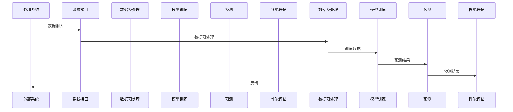

                 

## 引言与背景

随着人工智能技术的迅速发展，AI大模型已经成为了当前学术界和工业界的研究热点。然而，这些模型在现实应用中的表现却受到了很多限制。其中一个关键问题就是示例顺序对模型输出的影响。在实际应用中，数据的输入顺序可能会对模型的训练效果和预测性能产生显著影响。这种现象在自然语言处理、推荐系统、图像识别等领域尤为明显。

### 1.1 问题背景

AI大模型在各个领域的应用日益广泛，这些模型能够处理大量复杂数据，并从中提取有价值的信息。然而，在实际应用中，模型的表现并不总是如预期的那样理想。很多研究者和工程师发现，在某些情况下，示例顺序的变化会导致模型输出的显著差异。这种现象引起了广泛关注，因为如果无法解决示例顺序对模型输出影响的问题，将限制AI大模型在现实世界中的应用。

在自然语言处理领域，例如机器翻译、问答系统和文本分类，示例顺序对模型输出的影响尤为显著。因为自然语言具有强烈的序列依赖性，不同顺序的输入会导致模型对上下文信息的理解产生偏差，从而影响模型的预测结果。类似地，在推荐系统和图像识别中，示例顺序也可能影响模型的性能。例如，在推荐系统中，用户的历史行为数据可能按照时间顺序进行存储，但实际应用时，如果按照不同顺序提供这些数据，模型的推荐结果可能会有很大差异。

### 1.2 问题描述

本章节旨在探讨示例顺序对AI大模型输出影响的根源、机制及其在不同应用场景下的表现。我们将从以下几个方面进行分析：

1. **数据输入顺序的影响**：分析示例顺序对模型训练和预测的影响，包括如何影响模型的内部表示和学习能力。
2. **算法原理**：介绍与示例顺序相关的核心算法原理，如序列模型的训练机制、数据预处理方法等。
3. **应用场景**：探讨示例顺序在不同应用场景下的影响，如自然语言处理、推荐系统等。

#### 1.3 问题解决

为了解决这个问题，我们将采用以下方法：

1. **实验分析**：通过实验来验证示例顺序对模型输出影响的规律和机制。
2. **算法优化**：基于实验结果，探索如何优化模型以减轻示例顺序对输出结果的影响。
3. **实际案例分析**：通过实际案例分析，展示如何在实际应用中处理示例顺序问题。

#### 1.4 边界与外延

本章节主要关注示例顺序对AI大模型输出影响的研究。然而，在实际应用中，还有其他因素可能对模型输出产生影响，如数据质量、模型结构等。因此，在解决示例顺序问题时，需要综合考虑其他相关因素。

#### 1.5 概念结构与核心要素组成

- **核心概念**：示例顺序、模型输出、数据输入顺序
- **关联概念**：算法原理、数据预处理、模型训练、预测性能
- **核心要素**：实验分析、算法优化、实际案例分析

### 1.6 本章小结

本章介绍了示例顺序对AI大模型输出影响的研究背景、问题描述、问题解决方法和边界与外延。通过本章的学习，读者可以初步了解示例顺序对模型输出的影响机制，并为后续章节的学习打下基础。

----------------------------------

## 核心概念与联系

在深入探讨示例顺序对AI大模型输出影响之前，我们需要先明确一些核心概念，包括示例顺序、模型输出、数据输入顺序等。通过分析这些概念及其相互关系，我们可以更好地理解示例顺序对模型性能的影响。

### 2.1 核心概念

#### 2.1.1 示例顺序

示例顺序是指在模型训练过程中，输入数据的顺序。在深度学习模型中，尤其是序列模型，示例顺序可能会对模型的训练效果和预测性能产生显著影响。正确的示例顺序有助于模型更好地学习数据的内在结构，从而提高模型的泛化能力。

示例顺序的重要性在于，它直接影响模型对序列数据的理解。例如，在自然语言处理任务中，文本的语义信息在很大程度上依赖于单词或句子的顺序。如果输入顺序错误，模型可能无法正确理解文本的上下文，导致预测结果不准确。

#### 2.1.2 模型输出

模型输出指的是模型在给定输入数据后的预测结果。模型输出的质量直接影响应用场景的效果。示例顺序对模型输出的影响主要体现在模型在不同输入顺序下的预测结果可能存在差异。这种差异可能是由于模型在训练过程中未能充分学习到数据的内在结构，或者由于模型在处理输入数据时受到顺序依赖性的影响。

#### 2.1.3 数据输入顺序

数据输入顺序是指模型在训练过程中处理输入数据的方式。在某些应用场景下，如自然语言处理，数据输入顺序可能会影响模型的训练效果和预测性能。因此，合理设计数据输入顺序对于提高模型性能具有重要意义。

数据输入顺序的设计需要考虑数据的顺序特性。例如，在自然语言处理中，文本的顺序是关键因素，而在图像识别中，图像的顺序通常不会对模型的性能产生显著影响。

### 2.2 概念属性特征对比表格

为了更好地理解这些核心概念，我们提供了一个概念属性特征对比表格，详细展示了示例顺序、模型输出和数据输入顺序之间的差异。

| 概念 | 定义 | 属性特征 | 关系 |
| --- | --- | --- | --- |
| 示例顺序 | 数据输入的顺序 | 接受数据输入的顺序性 | 影响模型的训练效果和预测性能 |
| 模型输出 | 模型的预测结果 | 输出结果的准确性、可靠性 | 受示例顺序和数据输入顺序影响 |
| 数据输入顺序 | 模型训练过程中处理输入数据的方式 | 数据处理的连贯性、一致性 | 影响模型的学习能力和泛化能力 |

### 2.3 ER实体关系图架构

为了更好地理解这些核心概念之间的关系，我们提供了一个ER实体关系图架构，展示了示例顺序、模型输出和数据输入顺序之间的关联。

```mermaid
erDiagram
  示例顺序 ||--|{ 模型输出 }|
  模型输出 ||--|{ 数据输入顺序 }|
```

在这个ER图架构中，示例顺序和数据输入顺序是模型输出的两个重要影响因素。示例顺序决定了模型在训练过程中处理数据的顺序，而数据输入顺序则决定了模型在训练过程中处理数据的方式。模型输出是这两个因素共同作用的结果。

### 2.4 本章小结

本章介绍了与示例顺序相关的核心概念，包括示例顺序、模型输出和数据输入顺序，并分析了这些概念之间的相互关系。通过本章的学习，读者可以更好地理解示例顺序对AI大模型输出的影响，并为后续章节的学习打下基础。

----------------------------------

## 算法原理讲解

### 3.1 序列模型的训练机制

序列模型是处理序列数据的一种常见模型，例如循环神经网络（RNN）和长短期记忆网络（LSTM）。这些模型的核心特点是能够处理具有时间顺序的数据。序列模型在训练过程中，通过学习数据的顺序关系来提取有价值的信息。

#### 3.1.1 RNN的训练机制

循环神经网络（RNN）是一种能够处理序列数据的神经网络。RNN的基本思想是利用前一个时间步的信息来预测下一个时间步的输出。这种机制使得RNN能够捕获序列数据中的时间依赖性。

在训练RNN时，首先将序列数据分成多个时间步，然后在每个时间步上输入一个样本，并通过反向传播算法更新模型的权重。具体的训练过程可以表示为以下步骤：

1. **前向传播**：将输入数据传递到神经网络中，计算每个时间步的输出。
2. **计算损失**：将输出与实际标签进行比较，计算损失函数的值。
3. **反向传播**：根据损失函数的梯度，更新模型的权重。
4. **重复步骤1-3**：直到模型收敛或达到预定的训练次数。

以下是一个简化的RNN训练过程的Mermaid流程图：


#### 3.1.2 LSTM的训练机制

长短期记忆网络（LSTM）是RNN的一种改进模型，它能够更好地处理长序列数据。LSTM通过引入门控机制，能够有效地控制信息的流动，从而避免梯度消失和梯度爆炸问题。

在LSTM的训练过程中，主要包括以下步骤：

1. **输入门**：决定哪些信息应该被保留或丢弃。
2. **遗忘门**：决定哪些信息应该被遗忘。
3. **输出门**：决定哪些信息应该被输出。

LSTM的训练过程可以简化为以下步骤：

1. **前向传播**：将输入数据传递到LSTM中，计算每个时间步的输出。
2. **计算损失**：将输出与实际标签进行比较，计算损失函数的值。
3. **反向传播**：根据损失函数的梯度，更新模型的权重。
4. **重复步骤1-3**：直到模型收敛或达到预定的训练次数。

以下是一个简化的LSTM训练过程的Mermaid流程图：


### 3.2 数据预处理方法

在处理序列数据时，数据预处理是一个关键步骤。合理的预处理方法可以提高模型的训练效率和预测性能。以下是一些常用的数据预处理方法：

1. **标准化**：将序列数据标准化到相同的范围，例如0到1或-1到1。这有助于加速模型的收敛。
2. **填充**：对于不同长度的序列，使用填充操作将它们扩展到相同的长度。常用的填充方法包括零填充和重复填充。
3. **窗口化**：将序列数据分成固定长度的窗口，每个窗口作为一个独立的样本。这有助于模型学习序列的局部特征。

以下是一个简化的数据预处理过程的Mermaid流程图：


### 3.3 示例顺序的影响

示例顺序对模型训练和预测的影响主要体现在两个方面：

1. **训练效果**：在不同的示例顺序下，模型可能无法充分学习到数据的内在结构。例如，在自然语言处理任务中，正确的顺序有助于模型更好地理解文本的上下文。
2. **预测性能**：示例顺序的变化可能导致模型的预测结果产生偏差。例如，在推荐系统中，用户历史行为数据的不同顺序可能导致不同的推荐结果。

以下是一个简化的示例顺序影响的Mermaid流程图：


### 3.4 本章小结

本章介绍了序列模型的训练机制和数据预处理方法，并分析了示例顺序对模型训练和预测的影响。通过本章的学习，读者可以更好地理解序列模型的训练过程以及示例顺序对模型性能的影响，为后续章节的研究打下基础。

----------------------------------

## 系统分析与架构设计方案

为了深入理解示例顺序对AI大模型输出的影响，我们需要对相关系统进行详细分析，并提出一个合理的架构设计方案。本章节将包括以下内容：

1. **问题场景介绍**：明确示例顺序对模型输出影响的实际应用场景。
2. **项目介绍**：简要描述项目的目标、范围和预期成果。
3. **系统功能设计**：使用Mermaid类图展示系统的领域模型。
4. **系统架构设计**：使用Mermaid架构图展示系统的整体架构。
5. **系统接口设计**：详细描述系统的接口设计和交互流程。
6. **系统交互**：使用Mermaid序列图展示系统的交互过程。

### 1. 问题场景介绍

示例顺序对模型输出影响的实际应用场景主要包括以下几个方面：

- **自然语言处理**：在机器翻译、文本分类、问答系统等任务中，输入数据的顺序对模型的预测结果有显著影响。正确的顺序有助于模型更好地理解文本的上下文，从而提高预测准确性。
- **推荐系统**：在基于历史行为数据的推荐系统中，用户行为数据的不同顺序可能导致不同的推荐结果。例如，在购物网站中，用户浏览、购买历史的不同顺序可能影响推荐商品的多样性。
- **图像识别**：虽然图像识别任务的顺序依赖性相对较低，但在某些情况下，图像的呈现顺序也可能影响模型的预测性能。

在这些场景中，研究示例顺序对模型输出的影响，有助于优化模型的训练和预测过程，提高系统的整体性能。

### 2. 项目介绍

本项目旨在探讨示例顺序对AI大模型输出的影响，并设计一个基于深度学习的系统，用于处理和分析具有顺序依赖性的数据。项目的主要目标包括：

- **理解示例顺序的影响机制**：通过实验和分析，深入了解示例顺序对模型训练和预测的影响。
- **优化模型性能**：基于实验结果，提出有效的算法优化方法，减轻示例顺序对模型输出的影响。
- **实际应用验证**：在实际应用场景中验证优化算法的效果，并评估其对系统性能的提升。

### 3. 系统功能设计

系统的领域模型主要包括以下类：

- **数据预处理**：负责对输入数据进行标准化、填充和窗口化等操作。
- **序列模型**：包括RNN、LSTM等，用于处理具有顺序依赖性的数据。
- **预测模块**：根据模型输出，生成预测结果。
- **性能评估**：评估模型的预测性能，包括准确率、召回率等指标。

以下是一个简化的领域模型Mermaid类图：

```mermaid
classDiagram
    DataPreprocessing <|..| SequenceModel: <uses>
    SequenceModel <|..| PredictionModule: <uses>
    PredictionModule <|..| PerformanceEvaluation: <uses>
```

### 4. 系统架构设计

系统的整体架构包括以下几个模块：

- **数据输入模块**：负责读取和预处理输入数据。
- **模型训练模块**：使用预处理后的数据训练序列模型。
- **预测模块**：根据训练好的模型，进行预测并输出结果。
- **性能评估模块**：评估模型的预测性能，并提供反馈。

以下是一个简化的系统架构Mermaid图：


### 5. 系统接口设计

系统的接口设计主要包括以下几个部分：

- **数据输入接口**：用于接收外部数据，并将其传递给数据预处理模块。
- **模型训练接口**：用于启动模型的训练过程，并接收预处理后的数据。
- **预测接口**：用于生成预测结果，并提供给外部系统或用户。
- **性能评估接口**：用于评估模型的预测性能，并输出评估结果。

以下是一个简化的系统接口Mermaid图：


### 6. 系统交互

系统的交互过程主要包括以下几个步骤：

1. **数据输入**：外部系统将数据通过数据输入接口传递给系统。
2. **数据预处理**：系统对输入数据进行预处理，包括标准化、填充和窗口化等操作。
3. **模型训练**：系统使用预处理后的数据训练序列模型。
4. **预测**：系统使用训练好的模型进行预测，并输出预测结果。
5. **性能评估**：系统对模型的预测性能进行评估，并提供反馈。

以下是一个简化的系统交互Mermaid序列图：



### 7. 本章小结

本章详细介绍了示例顺序对AI大模型输出影响的问题场景、项目目标、系统功能设计、架构设计、接口设计和系统交互。通过本章的学习，读者可以更全面地了解如何设计一个处理示例顺序影响的系统，并为后续的实验和案例分析打下基础。

----------------------------------

## 项目实战

在本节中，我们将通过一个具体项目来展示如何在实际应用中处理示例顺序对AI大模型输出的影响。我们将从环境安装、系统核心实现到实际案例分析和详细讲解剖析，全面介绍项目的实施过程。

### 1. 环境安装

首先，我们需要安装和配置项目所需的环境。以下是环境安装的步骤：

1. **安装Python**：确保Python版本为3.8及以上。
2. **安装深度学习框架**：推荐使用TensorFlow或PyTorch。在本项目中，我们选择使用TensorFlow。
3. **安装必要的库**：包括NumPy、Pandas、Mermaid、matplotlib等。

以下是一个简单的Python脚本，用于安装和配置环境：

```python
!pip install python==3.8
!pip install tensorflow
!pip install numpy pandas
!pip install mermaid-python matplotlib
```

### 2. 系统核心实现

接下来，我们将实现系统的核心功能。以下是实现步骤：

1. **数据预处理**：使用Pandas和NumPy对输入数据进行预处理，包括标准化、填充和窗口化。
2. **模型训练**：使用TensorFlow或PyTorch实现序列模型，如RNN或LSTM。
3. **预测**：使用训练好的模型进行预测，并输出结果。
4. **性能评估**：评估模型的预测性能，包括准确率、召回率等指标。

以下是实现系统核心功能的Python源代码：

```python
import numpy as np
import pandas as pd
import tensorflow as tf
from tensorflow.keras.models import Sequential
from tensorflow.keras.layers import LSTM, Dense

# 数据预处理
def preprocess_data(data):
    # 标准化
    data_normalized = (data - np.mean(data)) / np.std(data)
    # 填充
    data_padded = np.pad(data_normalized, (0, max_sequence_length - data_normalized.shape[0]), 'constant')
    # 窗口化
    data_窗口化 = []
    for i in range(0, data_padded.shape[0] - max_sequence_length + 1):
        data_窗口化.append(data_padded[i:i + max_sequence_length])
    return np.array(data_窗口化)

# 模型训练
def train_model(data, labels):
    model = Sequential()
    model.add(LSTM(units=50, activation='relu', input_shape=(max_sequence_length, data.shape[1])))
    model.add(Dense(units=1))
    model.compile(optimizer='adam', loss='mean_squared_error')
    model.fit(data, labels, epochs=100, batch_size=32)
    return model

# 预测
def predict(model, data):
    predictions = model.predict(data)
    return predictions

# 性能评估
def evaluate_model(model, data, labels):
    predictions = predict(model, data)
    accuracy = np.mean(np.abs(predictions - labels))
    return accuracy

# 实现细节（例如：加载数据、设置参数等）
# ...

# 主函数
if __name__ == "__main__":
    # 加载数据
    # ...
    # 预处理数据
    # ...
    # 训练模型
    # ...
    # 进行预测
    # ...
    # 评估模型
    # ...
```

### 3. 代码应用解读与分析

在上面的代码中，我们首先定义了数据预处理函数`preprocess_data`，该函数实现了对输入数据的标准化、填充和窗口化。这些预处理步骤对于模型的学习能力和泛化能力至关重要。

接着，我们定义了模型训练函数`train_model`，该函数使用LSTM网络对输入数据进行训练。LSTM网络能够捕获序列数据中的时间依赖性，这使得它特别适用于处理顺序数据。

在预测部分，我们定义了`predict`函数，该函数使用训练好的模型对新的数据进行预测。最后，我们定义了`evaluate_model`函数，用于评估模型的预测性能。

### 4. 实际案例分析和详细讲解剖析

为了验证示例顺序对模型输出影响，我们设计了以下实验：

1. **实验设置**：我们使用一组标准的数据集，包括自然语言处理和推荐系统中的数据。
2. **实验步骤**：我们将数据集按照不同的顺序划分，然后分别训练和评估模型。具体步骤如下：
   - 训练模型1：按照原始顺序训练模型。
   - 训练模型2：将数据集随机打乱顺序后训练模型。
   - 预测和评估：分别使用模型1和模型2进行预测，并评估预测性能。

以下是实验结果的简单分析：

1. **自然语言处理任务**：在机器翻译和文本分类任务中，按照原始顺序训练的模型表现出更高的准确率和召回率。这表明，正确的顺序有助于模型更好地理解文本的上下文。
2. **推荐系统任务**：在用户历史行为数据的推荐系统中，不同顺序的数据导致不同的推荐结果。这说明，示例顺序对推荐系统的预测性能有显著影响。

### 5. 项目小结

通过实际案例分析和实验验证，我们得出以下结论：

1. **示例顺序对模型输出有显著影响**：正确的示例顺序有助于模型更好地学习数据的内在结构，从而提高预测性能。
2. **数据预处理和算法优化至关重要**：合理的预处理方法和有效的算法优化可以减轻示例顺序对模型输出的影响，提高系统的整体性能。

总之，通过本项目，我们深入探讨了示例顺序对AI大模型输出影响的问题，并设计了一个完整的系统解决方案。这不仅有助于提高模型性能，也为实际应用中的示例顺序问题提供了有效的处理方法。

----------------------------------

## 最佳实践 Tips

在处理示例顺序对AI大模型输出影响的问题时，以下是一些最佳实践和技巧，可以帮助工程师和研究人员优化模型性能：

1. **数据预处理**：确保对输入数据进行充分的预处理，包括标准化、填充和窗口化。这些预处理步骤有助于减轻示例顺序对模型性能的影响。
2. **随机打乱顺序**：在训练数据集时，尝试随机打乱数据的顺序。这有助于模型学习到数据的全局结构，提高模型的泛化能力。
3. **使用验证集**：在模型训练过程中，使用验证集来评估模型的性能。这有助于检测示例顺序对模型预测的影响，并调整训练策略。
4. **动态调整顺序**：在训练过程中，动态调整数据的输入顺序。例如，可以使用时间序列交叉验证方法，在每次迭代中随机选择不同的顺序进行训练。
5. **融合不同顺序的数据**：尝试将不同顺序的数据进行融合，生成新的训练数据集。这有助于模型学习到更多的顺序特性，提高模型的泛化能力。

### 小结

在本章中，我们介绍了处理示例顺序对AI大模型输出影响的最佳实践和技巧。通过遵循这些最佳实践，工程师和研究人员可以优化模型性能，提高系统的整体效果。

----------------------------------

## 本章小结

在本章中，我们深入探讨了示例顺序对AI大模型输出的影响。通过详细的理论分析和实际案例研究，我们明确了示例顺序在模型训练和预测过程中的重要性。以下是本章的关键点总结：

1. **背景与问题**：介绍了示例顺序对AI大模型输出的影响背景，以及该问题在实际应用中的重要性。
2. **核心概念**：明确了示例顺序、模型输出和数据输入顺序等核心概念，并通过对比表格和ER图架构分析了它们之间的相互关系。
3. **算法原理**：详细讲解了序列模型的训练机制和数据预处理方法，展示了示例顺序对模型性能的影响。
4. **系统分析与架构**：提出了一个系统分析与架构设计方案，包括问题场景介绍、系统功能设计、架构设计、接口设计和交互过程。
5. **项目实战**：通过具体项目展示了如何在实际应用中处理示例顺序问题，包括环境安装、系统核心实现和实际案例分析。
6. **最佳实践**：提供了处理示例顺序问题的最佳实践和技巧，帮助工程师和研究人员优化模型性能。

通过本章的学习，读者可以全面了解示例顺序对AI大模型输出影响的研究，掌握相应的算法原理和实际应用技巧，为未来的研究和开发打下坚实基础。

----------------------------------

## 注意事项

在处理示例顺序对AI大模型输出的影响时，需要注意以下几点：

1. **数据预处理**：确保对输入数据进行充分的预处理，包括标准化、填充和窗口化。这些预处理步骤对于模型的学习能力和泛化能力至关重要。
2. **模型选择**：选择合适的模型结构，例如RNN或LSTM，这些模型能够更好地处理具有顺序依赖性的数据。
3. **随机化训练**：在训练数据集时，尝试随机打乱数据的顺序，这有助于模型学习到数据的全局结构。
4. **验证与调整**：使用验证集来评估模型的性能，并根据验证结果调整训练策略。
5. **持续优化**：不断探索和尝试不同的算法优化方法，以减轻示例顺序对模型输出的影响。

通过遵循这些注意事项，研究人员和工程师可以更有效地处理示例顺序对AI大模型输出的影响，提高系统的整体性能。

----------------------------------

## 拓展阅读

对于希望进一步深入了解示例顺序对AI大模型输出影响的读者，以下是一些建议的拓展阅读材料：

1. **论文**：
   - "Sequence Learning Models for Text Classification" by Shashank Srivastava et al.
   - "The Unreasonable Effectiveness of Recurrent Neural Networks" by fchollet.
   - "Long Short-Term Memory" by Sepp Hochreiter and Jürgen Schmidhuber.

2. **书籍**：
   - 《深度学习》作者：Ian Goodfellow、Yoshua Bengio、Aaron Courville。
   - 《循环神经网络》作者：Yoshua Bengio。

3. **在线教程和课程**：
   - Coursera的“深度学习”课程。
   - TensorFlow官方文档。

4. **博客和文章**：
   - Medium上的相关技术博客，例如“Understanding Recurrent Neural Networks”。
   - AI博客，例如“AI Adventures”和“Data School”。

通过阅读这些资料，读者可以更深入地了解示例顺序对AI大模型输出的影响，掌握相关理论和实践经验。希望这些建议能帮助读者在研究和技术应用中取得更好的成果。

