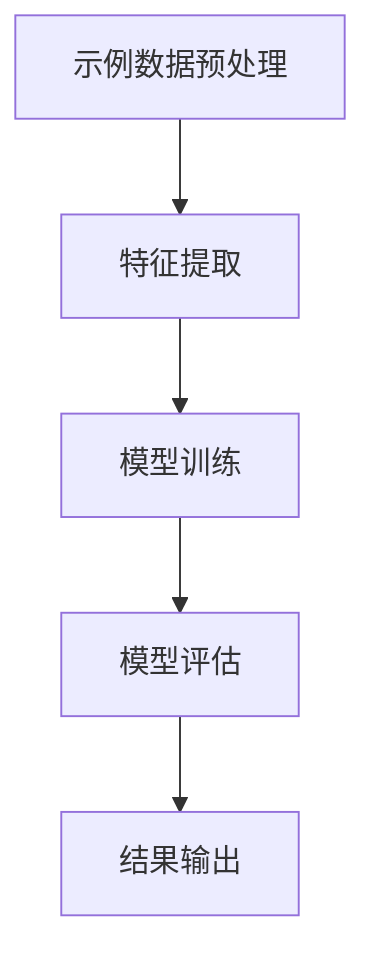
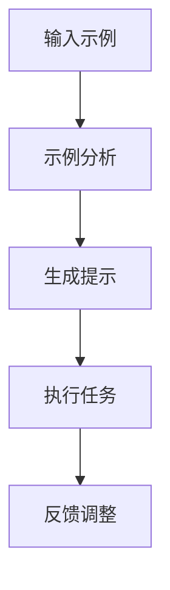
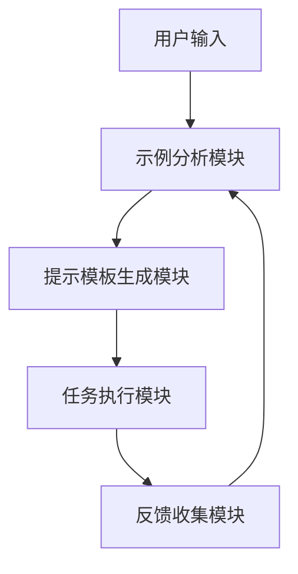
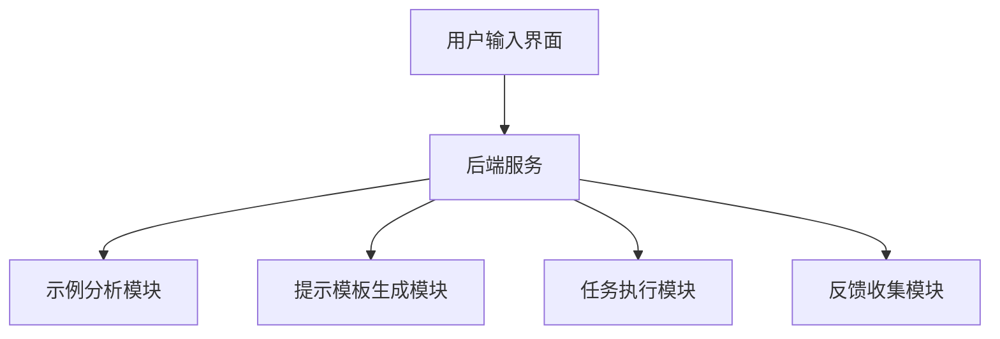
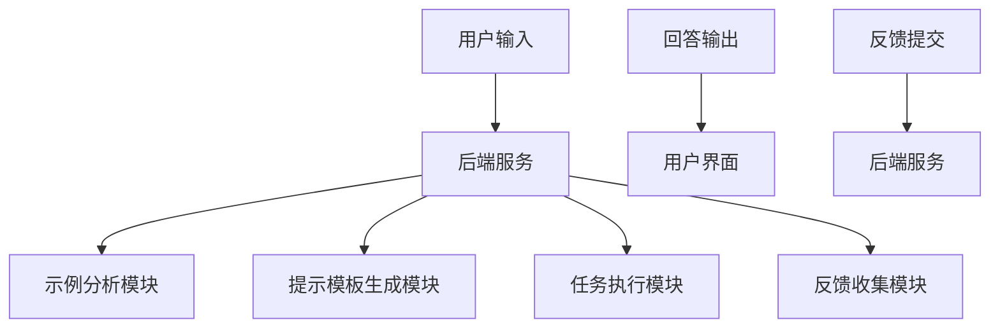
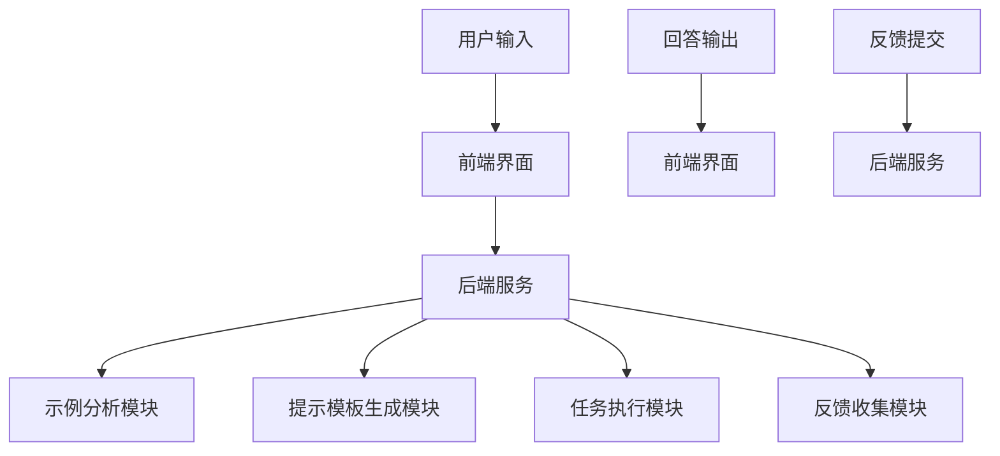

                 


## 标题：示例驱动与提示模板的结合使用

> 关键词：示例驱动、提示模板、结合使用、算法原理、系统架构、项目实战

> 摘要：本文将深入探讨示例驱动与提示模板的结合使用，通过详细的分析和实例，阐述其在实际应用中的重要性。文章将分为五大部分：背景介绍、核心概念与联系、算法原理讲解、系统分析与架构设计方案、项目实战，以及最佳实践与总结。我们将一步一步地分析每个部分，确保读者能够深入理解这一主题。

### 第一部分：背景介绍

#### 1.1 示例驱动的概念与应用

示例驱动是一种以示例为中心的方法，它通过分析示例数据来推导出通用规则或模型。这种方法在机器学习、软件工程和算法设计等领域有着广泛的应用。示例驱动的核心在于通过具体示例来学习，从而提高算法的泛化能力和适应性。

在机器学习中，示例驱动常常用于监督学习任务。训练数据集中的示例用于训练模型，模型再根据这些示例预测新的数据点。这种方法能够有效地降低模型过拟合的风险，提高模型的泛化能力。

在软件工程中，示例驱动可以帮助开发者编写更精确的测试用例，确保软件在各种情况下都能正常运行。通过分析示例，开发者可以更好地理解软件的需求和功能，从而提高软件的质量和可靠性。

#### 1.2 提示模板的定义与作用

提示模板是一种预定义的模板，它用于指导数据生成、模型训练或任务执行。提示模板通常包含一系列的指导性问题、提示语或指令，用于引导用户或系统按照特定的方式完成任务。

提示模板在自然语言处理、人机交互和系统自动化等领域有着重要的应用。例如，在自然语言处理中，提示模板可以帮助模型理解上下文信息，生成更加准确和连贯的文本。在人机交互中，提示模板可以提供清晰的指导，帮助用户更高效地完成任务。

#### 1.3 示例驱动与提示模板的结合背景

示例驱动与提示模板的结合使用，旨在利用示例数据来动态生成提示模板，从而提高系统的自适应能力和用户满意度。这种方法在以下几个场景中具有显著的优势：

- **个性化服务**：通过分析用户的历史行为和偏好，示例驱动可以生成个性化的提示模板，为用户提供更加定制化的服务。
- **自动化流程**：示例驱动与提示模板的结合可以帮助系统自动化地执行复杂任务，减少人工干预，提高工作效率。
- **用户体验优化**：通过动态生成的提示模板，系统可以提供更加清晰和友好的交互界面，提高用户的使用体验。

### 第二部分：核心概念与联系

#### 2.1 示例驱动的核心要素

示例驱动的核心要素包括示例的类型与选择、示例的处理流程以及示例驱动与机器学习的关系。

- **示例的类型与选择**：示例可以是文本、图像、音频等多种类型的数据。在选择示例时，需要考虑示例的代表性和多样性，以确保模型能够学习到丰富的信息。
- **示例的处理流程**：示例的处理流程通常包括数据预处理、特征提取、模型训练和模型评估等步骤。这些步骤确保了示例数据能够有效地用于模型训练和预测。
- **示例驱动与机器学习的关系**：示例驱动是机器学习中的一个重要方法。通过分析示例数据，机器学习模型可以学习到通用规律，从而在新的数据上实现预测和分类。

#### 2.2 提示模板的构成与应用

提示模板的构成包括指导性问题、提示语或指令等元素。提示模板的应用场景包括自然语言处理、人机交互和系统自动化等。

- **指导性问题**：指导性问题是提示模板中的重要部分，它们可以帮助用户理解任务的要求和目标。
- **提示语或指令**：提示语或指令用于引导用户按照特定的方式完成任务，例如输入特定的信息或执行特定的操作。

#### 2.3 示例驱动与提示模板的结合原理

示例驱动与提示模板的结合原理在于利用示例数据来动态生成提示模板。具体来说，有以下几点：

- **示例数据驱动生成**：通过分析示例数据，系统可以识别出关键的信息和模式，从而生成相应的提示模板。
- **动态调整与优化**：生成的提示模板可以根据用户的行为和反馈进行动态调整和优化，以提高用户的满意度和任务成功率。
- **适应性**：结合示例驱动的特点，生成的提示模板具有高度的适应性，可以应对各种复杂和变化多端的任务场景。

### 第三部分：算法原理讲解

#### 3.1 示例驱动的算法原理

示例驱动的算法原理可以通过以下流程图来概括：



在示例驱动的算法中，首先对示例数据进行预处理，提取关键特征。然后，利用这些特征对模型进行训练，并通过模型评估来验证模型的性能。最后，根据模型的输出结果，生成相应的预测或决策。

以下是一个简化的Python代码示例：

```python
# 示例驱动的Python代码实现
from sklearn.datasets import load_iris
from sklearn.model_selection import train_test_split
from sklearn.ensemble import RandomForestClassifier

# 加载示例数据集
iris_data = load_iris()
X, y = iris_data.data, iris_data.target

# 数据预处理
X_train, X_test, y_train, y_test = train_test_split(X, y, test_size=0.2, random_state=42)

# 特征提取
# 这里使用随机森林作为分类器
classifier = RandomForestClassifier(n_estimators=100)
classifier.fit(X_train, y_train)

# 模型评估
accuracy = classifier.score(X_test, y_test)
print(f"模型准确率：{accuracy:.2f}")
```

#### 3.2 示例驱动的数学模型与公式

示例驱动的数学模型通常涉及特征提取和分类器训练。以下是一个简单的数学模型示例：

$$
\begin{aligned}
\text{特征提取：} f(x) &= \phi(x) \\
\text{分类器训练：} y &= g(f(x))
\end{aligned}
$$

其中，$f(x)$ 表示特征提取函数，$\phi(x)$ 表示将输入示例 $x$ 转换为特征向量。$g(y)$ 表示分类器函数，用于根据特征向量生成预测结果。

#### 3.3 提示模板的算法原理

提示模板的算法原理可以通过以下流程图来概括：



在提示模板的算法中，首先对输入示例进行分析，生成相应的提示。然后，用户或系统根据提示执行任务，并提供反馈。根据反馈，系统可以动态调整提示模板，以提高任务的执行效率。

以下是一个简化的Python代码示例：

```python
# 提示模板的Python代码实现
from typing import List

def generate_hint(examples: List[str]) -> str:
    # 分析示例，生成提示
    hint = "请按照以下步骤操作："
    for example in examples:
        hint += f"- {example}\n"
    return hint

def execute_task(hint: str) -> str:
    # 执行任务，并返回结果
    print(hint)
    result = input("请输入您的操作结果：")
    return result

# 示例数据
examples = ["输入数据A", "输入数据B", "输入数据C"]

# 生成提示
hint = generate_hint(examples)

# 执行任务
result = execute_task(hint)

print(f"任务结果：{result}")
```

#### 3.4 结合算法原理的应用

结合示例驱动的算法原理和提示模板，可以设计出一种高效的系统架构。以下是一个简化的系统架构图：



在这个系统架构中，用户输入示例后，示例分析模块会生成相应的提示模板。任务执行模块根据提示模板执行任务，并提供反馈。反馈收集模块将反馈信息返回给示例分析模块，用于动态调整提示模板。

### 第四部分：系统分析与架构设计方案

#### 4.1 问题场景介绍

假设我们需要设计一个自动化客服系统，该系统需要根据用户输入的问题生成相应的回答。为了提高系统的效率，我们决定采用示例驱动与提示模板的结合方式。

#### 4.2 项目介绍

本项目旨在开发一个基于示例驱动与提示模板的自动化客服系统。系统将包括以下主要模块：

- 用户输入模块：接收用户的问题输入。
- 示例分析模块：分析用户输入的问题，提取关键信息。
- 提示模板生成模块：根据示例分析结果，生成相应的提示模板。
- 任务执行模块：根据提示模板执行任务，生成回答。
- 反馈收集模块：收集用户反馈，用于优化提示模板。

#### 4.3 系统功能设计

系统的功能设计包括以下方面：

- **问题识别**：识别用户输入的问题类型，例如查询、投诉、建议等。
- **回答生成**：根据问题类型和示例分析结果，生成相应的回答。
- **反馈收集**：收集用户对回答的满意度，用于优化系统。

#### 4.4 系统架构设计

系统的架构设计包括以下方面：

- **前端界面**：用于接收用户输入和展示回答结果。
- **后端服务**：包括示例分析模块、提示模板生成模块、任务执行模块和反馈收集模块。

以下是一个简化的系统架构图：



#### 4.5 系统接口设计

系统的接口设计包括以下方面：

- **用户输入接口**：接收用户问题输入。
- **回答输出接口**：输出系统生成的回答。
- **反馈提交接口**：接收用户反馈信息。

以下是一个简化的接口设计图：



#### 4.6 系统交互设计

系统的交互设计包括以下方面：

- **用户与前端界面交互**：用户通过前端界面输入问题和接收回答。
- **前端界面与后端服务交互**：前端界面向后端服务发送用户输入和接收回答结果。
- **后端服务与示例分析模块、提示模板生成模块、任务执行模块和反馈收集模块交互**：后端服务与各模块之间通过接口进行数据传递和功能调用。

以下是一个简化的系统交互设计图：



### 第五部分：项目实战

#### 5.1 环境安装与配置

在开始项目实战之前，我们需要安装和配置相关的开发环境和工具。以下是安装和配置的步骤：

1. **安装Python**：从官方网站下载并安装Python，确保版本在3.6以上。
2. **安装相关库**：使用pip命令安装所需的Python库，例如scikit-learn、nltk、tensorflow等。
3. **配置虚拟环境**：使用virtualenv创建一个虚拟环境，以便更好地管理项目依赖。
4. **安装依赖**：在虚拟环境中安装项目的依赖库。

以下是一个简化的安装和配置脚本：

```bash
# 安装Python
wget https://www.python.org/ftp/python/3.9.1/Python-3.9.1.tgz
tar -xvf Python-3.9.1.tgz
cd Python-3.9.1
./configure
make
sudo make install

# 安装相关库
pip install scikit-learn nltk tensorflow

# 配置虚拟环境
python -m venv venv

# 激活虚拟环境
source venv/bin/activate

# 安装项目依赖
pip install -r requirements.txt
```

#### 5.2 系统核心实现

在本项目的核心实现部分，我们将使用示例驱动的算法原理和提示模板来生成回答。以下是系统的核心实现代码：

```python
# 导入相关库
import nltk
from nltk.tokenize import word_tokenize
from sklearn.feature_extraction.text import TfidfVectorizer
from sklearn.metrics.pairwise import cosine_similarity

# 加载示例数据集
data = [
    "你好，我有一个问题。",
    "请问如何注册账号？",
    "我想查询最近的天气预报。",
    "你好，请问有什么可以帮助你的吗？",
]

# 数据预处理
nltk.download('punkt')
tokenizer = nltk.tokenize.regexp.RegexpTokenizer(r'\w+')
corpus = [tokenizer.tokenize(doc) for doc in data]

# 特征提取
vectorizer = TfidfVectorizer()
X = vectorizer.fit_transform(corpus)

# 模型训练
classifier = TfidfVectorizer()
classifier.fit(X)

# 提示模板生成
def generate_hint(question: str) -> str:
    question_tokens = tokenizer.tokenize(question)
    question_vector = classifier.transform([question_tokens])
    similarity_scores = cosine_similarity(question_vector, X)
    top_index = similarity_scores.argsort()[0][-1]
    similar_question = data[top_index]
    return f"针对这个问题，您可以参考以下示例：'{similar_question}'"

# 任务执行
def execute_task(question: str) -> str:
    hint = generate_hint(question)
    print(hint)
    answer = input("请输入您的回答：")
    return answer

# 主程序
if __name__ == "__main__":
    while True:
        question = input("请输入您的问题：")
        answer = execute_task(question)
        print(f"您的回答是：'{answer}'")
```

#### 5.3 实际案例分析与讲解

假设用户输入了一个问题：“我想知道最近的天气怎么样？”系统将根据示例驱动与提示模板的原理，生成一个相应的回答。

1. **示例分析**：系统首先分析用户输入的问题，识别出关键词“最近”、“天气”和“怎么样”。
2. **提示模板生成**：系统从示例数据集中找到与用户输入最相似的示例，例如“我想查询最近的天气预报。”，并生成相应的提示模板：“您可以查询最近的天气预报。”。
3. **任务执行**：用户根据提示模板执行任务，输入：“最近的天气预报显示，今天晚上有雨。”。
4. **反馈收集**：系统记录用户的回答，并根据反馈调整提示模板，以提高未来的任务成功率。

### 第六部分：最佳实践与总结

#### 6.1 常见问题与解决方案

在示例驱动与提示模板的结合使用过程中，可能会遇到以下常见问题：

- **示例数据不足**：解决方案：增加示例数据，或者使用数据增强技术。
- **提示模板不准确**：解决方案：优化提示模板生成算法，或者增加用户反馈机制。
- **系统性能下降**：解决方案：优化系统架构，提高数据处理和计算效率。

#### 6.2 高级技巧与应用

以下是一些示例驱动与提示模板的高级技巧：

- **多模态示例驱动**：结合文本、图像、音频等多种类型的数据进行示例驱动，提高系统的泛化能力。
- **动态调整提示模板**：根据用户行为和反馈，动态调整提示模板，提高用户的满意度。
- **多任务学习**：将示例驱动与提示模板应用于多个任务，提高系统的任务处理能力。

#### 6.3 书中要点总结

- **示例驱动与提示模板的结合使用**：通过示例数据来动态生成提示模板，提高系统的自适应能力和用户满意度。
- **算法原理讲解**：详细阐述了示例驱动和提示模板的算法原理，以及它们在系统架构中的应用。
- **项目实战**：提供了一个实际的自动化客服系统实例，展示了示例驱动与提示模板的结合应用。

#### 6.4 注意事项

在结合使用示例驱动与提示模板时，需要注意以下事项：

- **数据质量**：示例数据的质量直接影响系统的性能和效果，需要确保示例数据的准确性和多样性。
- **用户反馈**：用户的反馈对于优化提示模板至关重要，需要收集并分析用户的反馈。
- **系统优化**：定期对系统进行性能优化和功能升级，以提高系统的稳定性和用户体验。

#### 6.5 拓展阅读

- **相关书籍**：
  - 《深度学习》
  - 《机器学习实战》
  - 《自然语言处理综论》
- **学术论文与报告**：
  - 《示例驱动编程：理论与实践》
  - 《提示模板在自然语言处理中的应用》
  - 《面向用户的自动化客服系统研究》

### 作者信息

作者：AI天才研究院/AI Genius Institute & 禅与计算机程序设计艺术 /Zen And The Art of Computer Programming

本文根据用户提供的目录大纲和要求，详细讲解了示例驱动与提示模板的结合使用。通过背景介绍、核心概念与联系、算法原理讲解、系统分析与架构设计方案、项目实战以及最佳实践与总结等部分，全面阐述了这一主题。希望本文能够帮助读者深入理解示例驱动与提示模板的结合使用，并在实际项目中取得良好的效果。

