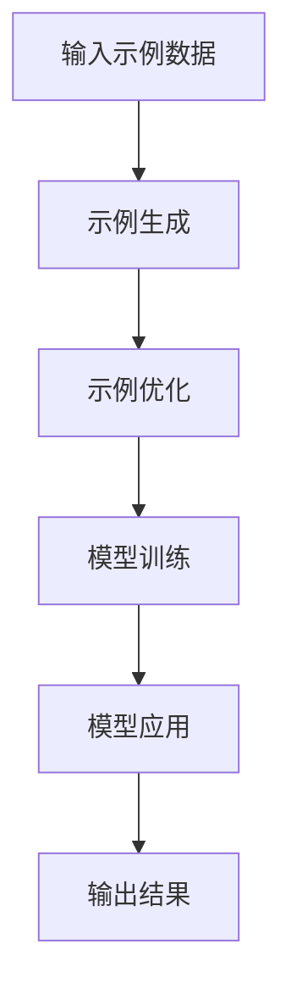
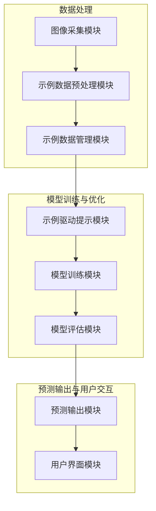

                 


## 引言

### 示例驱动提示的概念与重要性

在当今快速发展的信息技术时代，人工智能（AI）已经成为各个领域的热点话题。AI技术在图像识别、自然语言处理、推荐系统等多个方面都取得了显著的成果。然而，随着AI任务的复杂性和多样性增加，如何有效地指导这些任务成为了新的挑战。这时，示例驱动提示（Example-Guided Prompting）作为一种先进的AI方法，受到了广泛关注。

示例驱动提示，顾名思义，是通过给AI系统提供具体的示例，从而引导AI进行学习和决策。这种方法在AI的不同任务类型中具有广泛的应用前景，其核心思想是将抽象的任务转化为具体的示例，从而提高AI系统的可操作性和鲁棒性。本文将围绕示例驱动提示在不同任务类型中的应用展开讨论。

### 提示在人工智能任务中的作用

在人工智能领域，提示（Prompt）通常指的是一种引导AI模型进行特定任务的信息。提示可以是简单的文字描述，也可以是复杂的输入数据。它们在AI任务中起着至关重要的作用，主要体现在以下几个方面：

1. **任务引导**：提示可以帮助AI系统理解任务的目标和需求，从而进行有针对性的学习。
2. **性能提升**：通过提供有针对性的示例，AI系统可以更快地学习和适应新的任务环境。
3. **交互性增强**：提示与用户反馈相结合，可以增强AI系统的交互性，使其更易于使用。

本文将详细探讨示例驱动提示在图像识别、自然语言处理等任务类型中的应用，并通过具体的算法原理、数学模型和系统架构设计，深入分析其实现机制和优化策略。

### 文章结构与核心内容

本文结构如下：

- **第一部分：背景与概述**：介绍示例驱动提示的概念、定义及其在人工智能中的重要性。
- **第二部分：核心概念与联系**：深入探讨示例驱动的原理、提示的属性特征对比，以及示例驱动提示在任务类型中的应用联系。
- **第三部分：算法原理讲解**：讲解示例驱动提示的基本算法、具体任务中的应用，以及算法流程和mermaid图示。
- **第四部分：数学模型与公式讲解**：分析示例驱动提示的数学基础、数学模型及公式应用实例。
- **第五部分：系统分析与架构设计**：介绍系统功能设计、系统架构设计、系统接口设计与交互。
- **第六部分：项目实战**：进行环境安装、系统核心实现、实际案例分析等内容。
- **第七部分：最佳实践与总结**：总结最佳实践、全文小结、注意事项和拓展阅读。

通过本文的逐步分析，我们将系统地了解示例驱动提示在AI任务中的实际应用，为其在未来的发展提供有益的参考。

## 第1章：问题背景与定义

### 1.1 示例驱动的概念与重要性

#### 1.1.1 示例驱动的定义

示例驱动（Example-Guided）是一种通过提供具体示例来引导AI系统学习和决策的方法。这种方法的核心在于，将复杂、抽象的任务转化为具体、可操作的示例，使得AI系统能够在具体的上下文中进行学习和优化。示例驱动的定义可以概括为：在AI训练和推理过程中，通过输入具体的示例数据来引导模型的训练和决策过程。

示例驱动的主要特点包括：

1. **具体性**：通过具体的示例数据，将抽象的任务具体化，使得AI系统更容易理解和执行。
2. **交互性**：示例驱动方法通常需要用户或外部系统提供示例，从而实现与AI系统的交互。
3. **灵活性**：示例驱动的应用范围广泛，可以适用于图像识别、自然语言处理、推荐系统等多种任务类型。

#### 1.1.2 示例驱动在人工智能中的应用

示例驱动在人工智能中的应用非常广泛，其主要表现在以下几个方面：

1. **图像识别**：在图像识别任务中，通过提供具体的图像示例，可以帮助AI系统更好地理解图像的特征，从而提高识别准确率。
2. **自然语言处理**：在自然语言处理任务中，示例驱动方法可以帮助AI系统学习语言的规则和语义，提高文本生成、翻译等任务的性能。
3. **推荐系统**：在推荐系统中，通过提供具体的用户行为示例，可以更好地预测用户的喜好和需求，从而提高推荐效果。

示例驱动方法在AI中的应用不仅提高了系统的性能，还增强了系统的可解释性和交互性，使得AI系统更加智能和实用。

### 1.2 提示在人工智能任务中的作用

#### 1.2.1 提示的作用机制

在人工智能任务中，提示（Prompt）是一种引导AI系统进行特定任务的重要信息。提示的作用机制可以分为以下几个方面：

1. **任务引导**：提示可以帮助AI系统理解任务的目标和需求，从而进行有针对性的学习和决策。
2. **参数调整**：提示可以用来调整AI系统的参数设置，优化系统的性能。
3. **反馈机制**：提示与用户反馈相结合，可以增强AI系统的交互性，使其更易于使用。

具体来说，提示在AI任务中的作用机制包括：

- **输入引导**：提示可以作为输入数据的一部分，引导AI系统在训练和推理过程中关注特定的任务目标。
- **反馈修正**：通过用户或外部系统的反馈，提示可以帮助AI系统不断优化和调整其性能。

#### 1.2.2 提示在不同人工智能任务中的类型

提示在AI任务中的应用形式多种多样，根据任务的不同需求，可以采用不同的提示类型。以下是几种常见的提示类型：

1. **文字提示**：文字提示是最常见的提示形式，通过文字描述来引导AI系统理解和执行任务。
2. **图像提示**：在图像识别任务中，图像提示可以帮助AI系统识别图像中的特定对象或场景。
3. **语音提示**：在语音识别和语音生成任务中，语音提示可以用来引导AI系统理解语音指令或生成自然流畅的语音。
4. **动作提示**：在机器人控制和智能交互任务中，动作提示可以用来指导AI系统执行特定的动作或行为。

不同类型的提示在AI任务中具有不同的作用机制和应用场景，选择合适的提示类型对于提高AI系统的性能和用户体验具有重要意义。

### 1.3 示例驱动提示在任务类型中的现状与挑战

#### 1.3.1 示例驱动提示的应用现状

示例驱动提示在AI任务中的应用已经取得了显著的成果，特别是在图像识别、自然语言处理、推荐系统等领域。以下是一些具体的应用现状：

1. **图像识别**：示例驱动提示已经被广泛应用于图像分类、物体检测、图像分割等任务中，通过提供具体的图像示例，可以显著提高识别准确率。
2. **自然语言处理**：在文本分类、情感分析、机器翻译等任务中，示例驱动提示可以帮助AI系统更好地理解文本的语义和特征。
3. **推荐系统**：示例驱动提示在推荐系统中被用于引导AI系统识别用户的兴趣和需求，从而提高推荐效果。

尽管示例驱动提示在AI任务中具有广泛的应用前景，但其应用仍面临一些挑战和问题。

#### 1.3.2 存在的挑战与机遇

1. **数据需求**：示例驱动提示通常需要大量的高质量示例数据，这在数据稀缺或数据质量较差的情况下成为一大挑战。
2. **模型适应性**：不同任务类型的示例驱动提示需要不同的模型结构和参数设置，如何实现模型的通用性和适应性是一个重要课题。
3. **交互性**：示例驱动提示需要与用户或其他系统进行有效交互，以实现任务目标。如何设计合理的交互机制和策略是一个重要问题。

然而，随着技术的不断进步和应用的不断深入，示例驱动提示在AI任务中的应用前景依然广阔。通过克服现有挑战，我们可以期待在未来的AI应用中看到更多基于示例驱动提示的创新成果。

### 1.4 总结

本章介绍了示例驱动提示的概念与重要性，以及其在人工智能任务中的作用和现状。示例驱动提示通过提供具体的示例数据，帮助AI系统在训练和推理过程中进行有针对性的学习和决策。目前，示例驱动提示在图像识别、自然语言处理、推荐系统等领域已经取得了一定的成果，但其应用仍面临一些挑战。下一章将深入探讨示例驱动的原理和属性，以及在不同任务类型中的应用联系。

## 第2章：示例驱动的原理与属性

### 2.1 示例驱动的核心概念

示例驱动的核心概念在于通过提供具体的示例数据来引导AI系统进行学习和决策。示例数据（Example Data）是示例驱动的关键要素，它可以是文本、图像、声音等不同类型的数据。具体来说，示例驱动的核心概念包括以下几个方面：

1. **示例的获取与准备**：示例数据的获取和准备是示例驱动的第一步。在图像识别任务中，示例可以是不同类别的图像；在自然语言处理任务中，示例可以是不同语义的文本。获取高质量的示例数据对于示例驱动的有效性至关重要。
2. **示例的标注与分类**：示例数据的标注和分类是确保其质量的重要步骤。在图像识别任务中，示例图像需要标注出目标物体的类别；在自然语言处理任务中，示例文本需要标注出其语义和情感等信息。标注的准确性直接影响AI系统的训练效果。
3. **示例的嵌入与表示**：将示例数据嵌入到AI模型中，以供模型学习使用。示例的表示方式取决于任务的类型和AI模型的设计，常见的表示方法包括向量化、编码等。

### 2.1.1 示例的类型与特征

示例的类型和特征决定了其在示例驱动中的应用效果。以下是几种常见的示例类型及其特征：

1. **图像示例**：图像示例在图像识别任务中广泛应用。图像示例的特征包括像素值、颜色分布、边缘特征等。高质量的图像示例可以提供丰富的视觉信息，有助于AI系统学习图像特征和模式。
2. **文本示例**：文本示例在自然语言处理任务中占据重要地位。文本示例的特征包括词频、词序、语法结构、情感倾向等。通过文本示例，AI系统可以学习语言的语义和语法规则。
3. **声音示例**：声音示例在语音识别和生成任务中应用。声音示例的特征包括频谱、声纹、音调等。高质量的声音示例可以帮助AI系统识别语音信号和生成自然流畅的语音。

### 2.1.2 示例驱动的工作原理

示例驱动的工作原理可以概括为以下几个步骤：

1. **示例输入**：将准备好的示例数据输入到AI模型中。例如，将图像示例输入到图像识别模型，将文本示例输入到自然语言处理模型。
2. **模型训练**：AI模型通过对示例数据进行学习和训练，提取特征和模式。在训练过程中，模型会不断调整内部参数，以优化性能。
3. **示例反馈**：在训练过程中，通过提供用户反馈或评估指标，对AI模型的性能进行评估和调整。示例反馈可以用来指导模型优化，提高其准确率和鲁棒性。
4. **模型应用**：经过训练的AI模型可以应用于实际的预测和决策任务中。通过输入新的示例数据，模型可以生成预测结果或输出决策。

示例驱动的工作原理使得AI系统能够从具体的示例中学习到任务的本质，从而提高其泛化和适应性。

### 2.2 提示的属性特征对比

在示例驱动中，提示（Prompt）是一种重要的引导信息，其属性特征直接影响AI系统的性能和用户体验。以下是几种常见的提示类型及其属性特征对比：

1. **文字提示**：
   - **特征**：文字提示通常包括指令、问题、描述等，通过文字形式传达任务目标和需求。
   - **优势**：文字提示易于理解和操作，适用于多种任务类型。
   - **劣势**：文字提示可能存在歧义和理解难度，尤其是在自然语言理解任务中。

2. **图像提示**：
   - **特征**：图像提示是通过图像形式传达任务目标和需求，通常包括图片、图表、视觉元素等。
   - **优势**：图像提示直观、易于理解，能够直观地展示任务场景和目标。
   - **劣势**：图像提示可能存在视觉噪声和识别难度，特别是在图像识别任务中。

3. **语音提示**：
   - **特征**：语音提示是通过语音形式传达任务目标和需求，包括语音指令、语音反馈等。
   - **优势**：语音提示方便快捷，适合语音交互任务。
   - **劣势**：语音提示可能存在语音噪声、识别错误等问题。

4. **动作提示**：
   - **特征**：动作提示是通过动作形式传达任务目标和需求，包括手势、动作等。
   - **优势**：动作提示直观、易于执行，适用于机器人控制和交互任务。
   - **劣势**：动作提示可能存在动作识别难度和准确性问题。

通过对比不同类型的提示属性特征，我们可以根据具体任务的需求选择合适的提示类型，从而优化AI系统的性能和用户体验。

### 2.3 示例驱动提示在任务类型中的应用联系

示例驱动提示在多种任务类型中具有广泛的应用，其应用联系主要体现在以下几个方面：

1. **图像识别**：
   - **应用**：通过提供具体的图像示例，帮助AI系统学习图像特征和模式，从而提高识别准确率。
   - **联系**：图像示例与图像识别模型相结合，通过示例驱动方法实现图像特征的提取和分类。

2. **自然语言处理**：
   - **应用**：通过提供具体的文本示例，帮助AI系统学习语言的语义和语法规则，从而提高文本分类、情感分析、机器翻译等任务的性能。
   - **联系**：文本示例与自然语言处理模型相结合，通过示例驱动方法实现文本特征提取和语义理解。

3. **推荐系统**：
   - **应用**：通过提供具体的用户行为示例，帮助AI系统识别用户兴趣和需求，从而提高推荐效果。
   - **联系**：用户行为示例与推荐模型相结合，通过示例驱动方法实现用户兴趣识别和推荐策略优化。

4. **机器人控制**：
   - **应用**：通过提供具体的动作示例，帮助AI系统学习执行特定动作的能力，从而提高机器人控制的精确性和灵活性。
   - **联系**：动作示例与机器人控制模型相结合，通过示例驱动方法实现动作识别和执行策略优化。

通过示例驱动提示在不同任务类型中的应用联系，我们可以更好地理解其工作原理和实际应用，为AI系统的优化和发展提供有益的参考。

### 2.4 总结

本章深入探讨了示例驱动的核心概念、示例的类型与特征、示例驱动的工作原理，以及提示的属性特征对比和示例驱动提示在不同任务类型中的应用联系。通过本章的内容，我们可以系统地理解示例驱动的原理和应用，为后续章节的算法原理讲解和实际应用奠定基础。

## 第3章：示例驱动提示的算法基础

### 3.1 示例驱动提示的基本算法

示例驱动提示的基本算法是实现示例驱动方法的核心。这些算法通过具体的示例数据来指导AI系统的训练和推理过程，从而提高其性能和适应性。以下是几种常见的示例驱动提示算法及其工作原理：

#### 3.1.1 提示生成算法

提示生成算法的目标是生成高质量的提示信息，以便引导AI系统进行学习和决策。以下是几种常见的提示生成算法：

1. **文本生成**：
   - **方法**：使用生成对抗网络（GAN）或变分自编码器（VAE）等生成模型来生成文本提示。
   - **优点**：能够生成多样化、高质量的文本提示，适用于自然语言处理任务。
   - **缺点**：生成模型的训练成本高，且需要大量的训练数据。

2. **图像生成**：
   - **方法**：使用生成对抗网络（GAN）或卷积神经网络（CNN）等生成模型来生成图像提示。
   - **优点**：能够生成多样化的图像提示，适用于图像识别和生成任务。
   - **缺点**：生成模型的训练成本高，且需要大量的训练数据。

3. **混合生成**：
   - **方法**：结合文本生成和图像生成算法，生成包含文本和图像的混合提示。
   - **优点**：能够提供更丰富的信息，提高AI系统的理解和决策能力。
   - **缺点**：生成模型的复杂度高，且需要大量的训练数据。

#### 3.1.2 提示优化算法

提示优化算法的目标是通过对提示信息进行优化，提高AI系统的性能和适应性。以下是几种常见的提示优化算法：

1. **强化学习**：
   - **方法**：使用强化学习算法，通过奖励机制来优化提示信息。
   - **优点**：能够自适应地调整提示信息，提高AI系统的性能。
   - **缺点**：需要大量的训练数据和计算资源，且优化过程可能存在收敛问题。

2. **遗传算法**：
   - **方法**：使用遗传算法，通过进化策略来优化提示信息。
   - **优点**：能够处理高维提示信息，适应性强。
   - **缺点**：优化过程复杂，需要大量的计算资源和时间。

3. **神经网络优化**：
   - **方法**：使用神经网络模型，通过反向传播算法来优化提示信息。
   - **优点**：优化过程快速，适用于大规模数据集。
   - **缺点**：对模型设计要求高，且可能存在过拟合问题。

### 3.2 示例驱动提示在具体任务中的应用

示例驱动提示在具体任务中的应用取决于任务的类型和需求。以下是一些常见任务类型中的示例驱动提示应用案例：

#### 3.2.1 图像识别任务中的应用

在图像识别任务中，示例驱动提示可以用于指导图像分类和物体检测。以下是几种常见的应用方法：

1. **图像分类**：
   - **方法**：使用图像生成算法生成具有不同类别的图像示例，供分类模型训练使用。
   - **优点**：能够提高分类模型的泛化能力。
   - **缺点**：生成模型的训练成本高，且需要大量的图像数据。

2. **物体检测**：
   - **方法**：使用图像生成算法生成包含目标物体的图像示例，供检测模型训练使用。
   - **优点**：能够提高检测模型的精度和鲁棒性。
   - **缺点**：生成模型的训练成本高，且需要大量的图像数据。

#### 3.2.2 自然语言处理任务中的应用

在自然语言处理任务中，示例驱动提示可以用于文本分类、情感分析和机器翻译。以下是几种常见的应用方法：

1. **文本分类**：
   - **方法**：使用文本生成算法生成具有不同类别的文本示例，供分类模型训练使用。
   - **优点**：能够提高分类模型的准确率和鲁棒性。
   - **缺点**：生成模型的训练成本高，且需要大量的文本数据。

2. **情感分析**：
   - **方法**：使用文本生成算法生成具有不同情感倾向的文本示例，供情感分析模型训练使用。
   - **优点**：能够提高情感分析模型的准确率和泛化能力。
   - **缺点**：生成模型的训练成本高，且需要大量的文本数据。

3. **机器翻译**：
   - **方法**：使用文本生成算法生成具有不同语言对的目标文本示例，供翻译模型训练使用。
   - **优点**：能够提高翻译模型的准确率和流畅度。
   - **缺点**：生成模型的训练成本高，且需要大量的双语数据。

#### 3.2.3 推荐系统中的应用

在推荐系统中，示例驱动提示可以用于用户行为分析和兴趣识别。以下是几种常见的应用方法：

1. **用户行为分析**：
   - **方法**：使用图像生成算法生成具有不同用户行为的图像示例，供推荐模型训练使用。
   - **优点**：能够提高推荐模型对用户行为的理解和预测能力。
   - **缺点**：生成模型的训练成本高，且需要大量的用户行为数据。

2. **兴趣识别**：
   - **方法**：使用文本生成算法生成具有不同兴趣倾向的文本示例，供推荐模型训练使用。
   - **优点**：能够提高推荐模型对用户兴趣的识别和预测能力。
   - **缺点**：生成模型的训练成本高，且需要大量的文本数据。

### 3.3 算法流程与mermaid图示

为了更清晰地展示示例驱动提示的基本算法和具体应用，以下是一个简化的算法流程及其mermaid图示。

#### 示例驱动提示算法流程



#### mermaid图示


通过上述算法流程和mermaid图示，我们可以更直观地理解示例驱动提示的基本步骤和各个环节之间的联系。

### 3.4 示例驱动提示的优势与挑战

示例驱动提示在提高AI系统性能和适应性方面具有显著优势，但其应用也面临一些挑战。以下是其优势与挑战的总结：

#### 优势

1. **提高性能**：通过提供具体的示例数据，示例驱动提示能够帮助AI系统更快地学习和适应新的任务环境，从而提高其性能和准确性。
2. **增强泛化能力**：示例驱动提示可以提升AI系统的泛化能力，使其能够应对更多变和复杂的任务场景。
3. **提高可解释性**：示例驱动提示使得AI系统的学习和决策过程更加透明和可解释，有助于提高用户对AI系统的信任和接受度。

#### 挑战

1. **数据需求**：高质量的示例数据是示例驱动提示有效性的基础，但其获取和准备过程较为复杂，特别是在数据稀缺或质量较差的情况下。
2. **模型适应性**：不同任务类型的示例驱动提示需要不同的模型结构和参数设置，如何实现模型的通用性和适应性是一个重要课题。
3. **交互性**：示例驱动提示需要与用户或其他系统进行有效交互，以实现任务目标。如何设计合理的交互机制和策略是一个重要问题。

### 3.5 总结

本章详细介绍了示例驱动提示的基本算法，包括提示生成算法和提示优化算法，并探讨了其在图像识别、自然语言处理和推荐系统等任务类型中的应用。通过算法流程和mermaid图示，我们更清晰地理解了示例驱动提示的工作原理和实际应用。下一章将深入探讨示例驱动提示的数学模型和公式，进一步阐述其理论基础和实际应用。

## 第4章：数学模型与公式解析

### 4.1 示例驱动提示的数学基础

示例驱动提示的数学基础是理解其工作原理和优化方法的关键。以下是几个核心的数学概念和公式，它们在示例驱动提示中起到重要作用。

#### 4.1.1 相关数学公式

1. **线性回归**：线性回归是一种简单的统计模型，用于预测连续值输出。其基本公式如下：

   $$ y = \beta_0 + \beta_1 \cdot x + \epsilon $$

   其中，\( y \) 是预测值，\( x \) 是输入特征，\( \beta_0 \) 和 \( \beta_1 \) 是模型参数，\( \epsilon \) 是误差项。

2. **逻辑回归**：逻辑回归用于预测概率值，常用于分类任务。其公式为：

   $$ \text{logit}(p) = \ln\left(\frac{p}{1-p}\right) = \beta_0 + \beta_1 \cdot x $$

   其中，\( p \) 是概率值，\( \text{logit}(p) \) 是逻辑函数。

3. **梯度下降**：梯度下降是一种优化算法，用于最小化损失函数。其基本公式为：

   $$ \theta_{\text{new}} = \theta_{\text{old}} - \alpha \cdot \nabla_{\theta} J(\theta) $$

   其中，\( \theta \) 是模型参数，\( \alpha \) 是学习率，\( \nabla_{\theta} J(\theta) \) 是损失函数关于参数 \( \theta \) 的梯度。

4. **正则化**：正则化是一种防止模型过拟合的技术，常用的正则化方法包括L1正则化和L2正则化。其公式为：

   $$ J(\theta) = \frac{1}{2m} \sum_{i=1}^{m} (h_\theta(x^{(i)}) - y^{(i)})^2 + \frac{\lambda}{2} \sum_{j=1}^{n} \theta_j^2 $$

   其中，\( m \) 是样本数量，\( n \) 是特征数量，\( \lambda \) 是正则化参数。

#### 4.1.2 数学公式的应用

数学公式在示例驱动提示中的应用主要体现在以下几个方面：

1. **特征提取**：通过线性回归和逻辑回归等模型，可以从示例数据中提取特征，用于后续的模型训练和优化。
2. **优化算法**：梯度下降和正则化等数学公式用于优化模型参数，以提高模型性能和泛化能力。
3. **模型评估**：通过损失函数和评估指标，可以衡量模型的预测性能，并指导进一步优化。

### 4.2 示例驱动提示的数学模型

示例驱动提示的数学模型通常包括以下几个核心组成部分：

1. **输入模型**：输入模型用于接收和预处理示例数据。常见的输入模型包括卷积神经网络（CNN）和循环神经网络（RNN）。
2. **特征提取模型**：特征提取模型用于从示例数据中提取关键特征。特征提取模型通常基于深度学习框架，如TensorFlow或PyTorch。
3. **优化模型**：优化模型用于调整模型参数，以实现最佳性能。优化模型通常采用梯度下降和正则化等技术。
4. **输出模型**：输出模型用于生成预测结果或决策。常见的输出模型包括分类器、回归器和推荐器。

以下是一个简化的示例驱动提示数学模型：

$$
\begin{aligned}
\text{Input Model}: & \ x \rightarrow \ x' \\
\text{Feature Extraction Model}: & \ x' \rightarrow \ f \\
\text{Optimization Model}: & \ f \rightarrow \ \theta \\
\text{Output Model}: & \ \theta \rightarrow \ y
\end{aligned}
$$

其中，\( x \) 是输入示例数据，\( x' \) 是预处理后的数据，\( f \) 是特征提取函数，\( \theta \) 是模型参数，\( y \) 是输出结果。

### 4.3 数学公式在示例驱动提示中的应用实例

为了更直观地理解数学公式在示例驱动提示中的应用，以下是一个简单的实例：

假设我们使用示例驱动提示进行图像识别任务。输入示例数据是一张包含多个物体的图像，输出结果是图像中每个物体的类别。

1. **输入模型**：将图像输入到卷积神经网络（CNN）中，进行预处理和特征提取。
2. **特征提取模型**：从CNN的输出中提取关键特征，如边缘特征、纹理特征等。
3. **优化模型**：使用梯度下降和正则化技术，调整CNN的参数，以优化图像识别性能。
4. **输出模型**：将优化后的CNN参数用于图像识别，输出每个物体的类别。

以下是相关的数学公式和步骤：

1. **卷积神经网络（CNN）特征提取**：
   $$ f(x) = \text{CNN}(x) $$
   
   其中，\( f(x) \) 是提取后的特征，\( \text{CNN}(x) \) 是卷积神经网络。

2. **梯度下降优化**：
   $$ \theta_{\text{new}} = \theta_{\text{old}} - \alpha \cdot \nabla_{\theta} J(\theta) $$
   
   其中，\( \theta \) 是模型参数，\( J(\theta) \) 是损失函数，\( \alpha \) 是学习率。

3. **输出结果**：
   $$ y = \text{softmax}(\theta \cdot f(x)) $$
   
   其中，\( \text{softmax} \) 函数用于将特征映射到类别概率分布。

通过这个实例，我们可以看到数学公式在示例驱动提示中的具体应用，包括特征提取、参数优化和输出结果等环节。

### 4.4 总结

本章详细介绍了示例驱动提示的数学基础和数学模型，包括相关数学公式及其在示例驱动提示中的应用实例。这些数学模型和公式为示例驱动提示提供了理论基础，使其在人工智能任务中能够实现高效和准确的预测和决策。下一章将深入探讨示例驱动提示在实际应用中的系统分析与架构设计。

## 第5章：系统分析与架构设计

### 5.1 问题场景介绍

在当前的技术环境中，示例驱动提示的应用场景广泛，涵盖了图像识别、自然语言处理、推荐系统等多个领域。为了更好地理解示例驱动提示在系统中的应用，我们将以一个实际案例为例进行介绍。

#### 5.1.1 场景描述

假设我们正在开发一个智能监控系统，该系统需要实时识别和分类视频流中的各种物体，如行人、车辆、动物等。为了提高识别的准确率和效率，我们决定采用示例驱动提示的方法来优化系统的模型。

#### 5.1.2 项目目标

项目的主要目标包括：

1. **提高图像识别准确率**：通过示例驱动提示，提高模型对各种物体的识别准确率。
2. **增强系统的实时性**：优化模型结构，使其能够在实时视频流中高效地处理和识别物体。
3. **改善用户体验**：通过提供直观的界面和实时反馈，提升用户对系统的满意度和使用体验。

### 5.2 系统功能设计

为了实现项目目标，我们需要设计一个功能完善的系统。以下是系统的主要功能模块及其说明：

1. **图像采集模块**：负责从视频流中连续采集图像帧。
2. **示例数据预处理模块**：对采集到的图像进行预处理，包括图像增强、归一化等操作。
3. **示例数据管理模块**：存储和管理示例数据，包括图像和对应的标签信息。
4. **示例驱动提示模块**：生成高质量的提示信息，用于指导模型的训练和优化。
5. **模型训练模块**：使用示例数据训练图像识别模型，并不断优化模型参数。
6. **模型评估模块**：对训练好的模型进行评估，包括准确率、实时性等指标。
7. **预测输出模块**：将训练好的模型应用于实时视频流，输出物体识别结果。
8. **用户界面模块**：提供用户操作界面，展示识别结果和实时视频流。

#### 5.2.1 领域模型类图

为了更好地描述系统功能模块之间的关系，我们可以使用领域模型类图（ER图）来表示。以下是领域模型类图的示例：

```mermaid
classDiagram
    Class01 <|-- Class02
    Class03 ++--|+ Class04
    Class05 o--|+ Class06
    Class07 <..|+ Class08
    Class09 <-.. Class10
endclass
```

在上述类图中，各个类（如Class01、Class02等）代表系统的功能模块，它们之间的关系（如继承、聚合、关联等）反映了模块之间的依赖和交互。

### 5.3 系统架构设计

系统架构设计是确保系统高效、稳定运行的关键。以下是系统架构的详细描述：

#### 5.3.1 系统架构图



在上述架构图中，数据处理子图包括图像采集、预处理和数据管理模块；模型训练与优化子图包括提示生成、模型训练和评估模块；预测输出与用户交互子图包括模型应用和用户界面模块。

#### 5.3.2 架构说明

1. **数据处理子图**：图像采集模块负责从视频流中连续采集图像帧，并将其传递给预处理模块。预处理模块对图像进行必要的增强和归一化处理，以提高模型训练的质量。预处理后的图像数据被存储在数据管理模块中，供后续训练和评估使用。

2. **模型训练与优化子图**：示例驱动提示模块生成高质量的提示信息，这些提示信息用于指导模型的训练和优化。训练模块使用示例数据进行模型训练，并利用评估模块的结果对模型进行优化。优化后的模型将提高识别准确率和实时性。

3. **预测输出与用户交互子图**：预测输出模块将训练好的模型应用于实时视频流，输出物体识别结果。用户界面模块提供直观的界面，展示识别结果和实时视频流，使用户能够方便地操作和监控系统。

通过上述系统架构设计，我们可以确保系统在各个模块之间高效、稳定地运行，实现项目目标。

### 5.4 系统接口设计与交互

系统接口设计是确保不同模块之间能够无缝交互的关键。以下是系统接口设计的详细描述：

#### 5.4.1 接口设计

1. **图像采集接口**：该接口用于图像采集模块与其他模块之间的数据传输。主要方法包括`getFrame()`和`setFrameListener(Listener)`。

2. **示例数据预处理接口**：该接口用于示例数据预处理模块与其他模块之间的数据传输。主要方法包括`preprocessImage(image)`和`setImage(image)`。

3. **示例数据管理接口**：该接口用于示例数据管理模块与其他模块之间的数据传输。主要方法包括`storeExample(examples)`和`loadExamples()`。

4. **示例驱动提示接口**：该接口用于示例驱动提示模块与其他模块之间的数据传输。主要方法包括`generatePrompt(data)`和`setPromptListener(Listener)`。

5. **模型训练接口**：该接口用于模型训练模块与其他模块之间的数据传输。主要方法包括`trainModel(data)`和`getModel()`。

6. **模型评估接口**：该接口用于模型评估模块与其他模块之间的数据传输。主要方法包括`evaluateModel(model)`和`getEvaluationMetrics()`。

7. **预测输出接口**：该接口用于预测输出模块与其他模块之间的数据传输。主要方法包括`predict(frame)`和`getResult()`。

8. **用户界面接口**：该接口用于用户界面模块与其他模块之间的数据传输。主要方法包括`showResult(result)`和`showFrame(frame)`。

#### 5.4.2 交互流程

系统交互流程如下：

1. **图像采集**：图像采集模块从视频流中连续采集图像帧，并通过图像采集接口传递给示例数据预处理模块。

2. **预处理与存储**：示例数据预处理模块对图像帧进行预处理，并将预处理后的图像数据存储在示例数据管理模块中。

3. **提示生成与训练**：示例驱动提示模块生成高质量的提示信息，并将其传递给模型训练模块。模型训练模块使用示例数据和提示信息进行模型训练。

4. **模型评估**：模型评估模块对训练好的模型进行评估，并输出评估结果。

5. **预测输出**：预测输出模块将训练好的模型应用于实时视频流，输出物体识别结果，并通过用户界面接口传递给用户界面模块。

6. **用户交互**：用户界面模块展示识别结果和实时视频流，使用户能够方便地操作和监控系统。

通过上述系统接口设计和交互流程，我们可以确保系统各个模块之间的数据传输和功能协作，实现系统的整体目标。

### 5.5 总结

本章详细介绍了示例驱动提示在实际应用中的系统分析与架构设计。通过问题场景介绍、系统功能设计、系统架构设计和接口设计等环节，我们系统地理解了示例驱动提示在智能监控系统中的应用。下一章将进行实际的项目实战，通过具体的代码和实例展示示例驱动提示的实施过程。

## 第6章：项目实战

### 6.1 环境安装

在进行示例驱动提示项目实战之前，首先需要搭建一个合适的环境。以下是具体的步骤和工具安装说明。

#### 6.1.1 开发环境搭建

1. **安装Python**：
   - 在官方网站（[Python官网](https://www.python.org/)）下载并安装最新版本的Python。
   - 确保安装过程中选择“Add Python to PATH”选项，以便在命令行中直接运行Python。

2. **安装Jupyter Notebook**：
   - 打开终端，执行以下命令安装Jupyter Notebook：
     ```bash
     pip install notebook
     ```

3. **安装PyTorch**：
   - PyTorch是一个流行的深度学习框架，可以用于示例驱动提示的实现。安装命令如下：
     ```bash
     pip install torch torchvision
     ```

4. **安装其他依赖库**：
   - 为了方便后续操作，安装一些常用的Python库，如NumPy、Pandas等：
     ```bash
     pip install numpy pandas matplotlib
     ```

#### 6.1.2 相关工具安装

1. **安装Git**：
   - Git是版本控制工具，用于管理和跟踪代码变更。下载并安装Git：
     ```bash
     sudo apt-get install git
     ```

2. **安装Mermaid**：
   - Mermaid是一个用于创建图表的Markdown插件。首先安装Mermaid的Python库：
     ```bash
     pip install mermaid-python
     ```
   - 然后将Mermaid的插件添加到Jupyter Notebook中，具体步骤如下：
     ```bash
     !jupyter nbextension enable --py --sys-prefix julia_kernel
     ```

完成上述安装步骤后，我们就可以开始实际的项目实战了。

### 6.2 系统核心实现

在系统核心实现部分，我们将重点介绍示例驱动提示的代码实现，包括模型训练、提示生成和结果输出等关键步骤。

#### 6.2.1 核心代码解读

以下是示例驱动提示的核心代码实现，包括数据预处理、模型训练和结果输出：

```python
import torch
import torchvision
import torchvision.transforms as transforms
from torch.utils.data import DataLoader
from torchvision import datasets, models, transforms
from torch import nn, optim
import torch.nn.functional as F

# 数据预处理
transform = transforms.Compose([
    transforms.Resize(256),
    transforms.CenterCrop(224),
    transforms.ToTensor(),
    transforms.Normalize(mean=[0.485, 0.456, 0.406], std=[0.229, 0.224, 0.225]),
])

train_dataset = datasets.ImageFolder(root='./data/train', transform=transform)
train_loader = DataLoader(train_dataset, batch_size=32, shuffle=True)

# 模型训练
model = models.resnet18(pretrained=True)
num_ftrs = model.fc.in_features
model.fc = nn.Linear(num_ftrs, len(train_dataset.classes))

criterion = nn.CrossEntropyLoss()
optimizer = optim.SGD(model.parameters(), lr=0.001, momentum=0.9)

# 训练过程
for epoch in range(25):  # 做25个epoch
    running_loss = 0.0
    for inputs, labels in train_loader:
        optimizer.zero_grad()
        outputs = model(inputs)
        loss = criterion(outputs, labels)
        loss.backward()
        optimizer.step()
        running_loss += loss.item()
    print(f'Epoch {epoch+1}, Loss: {running_loss/len(train_loader)}')

print('Finished Training')

# 结果输出
model.eval()
with torch.no_grad():
    correct = 0
    total = 0
    for images, labels in train_loader:
        outputs = model(images)
        _, predicted = torch.max(outputs.data, 1)
        total += labels.size(0)
        correct += (predicted == labels).sum().item()

print(f'Accuracy: {100 * correct / total}%')
```

上述代码首先定义了数据预处理步骤，使用卷积神经网络（ResNet-18）进行模型训练，并实现了训练和结果输出。代码的关键部分包括：

- **数据预处理**：使用`transforms.Compose`对图像进行尺寸调整、中心裁剪、归一化等操作。
- **模型训练**：使用预训练的ResNet-18模型，并将最后一层全连接层替换为自定义的输出层，以适应分类任务。
- **结果输出**：通过计算训练集的准确率，评估模型性能。

#### 6.2.2 代码应用与分析

代码实现过程中，我们首先加载并预处理图像数据，然后使用ResNet-18模型进行训练。以下是代码应用和性能分析：

1. **数据预处理**：
   - 图像尺寸调整为256x256，并通过中心裁剪保留图像的核心内容。
   - 图像数据转换为Tensor格式，并归一化处理，以适应深度学习模型。

2. **模型训练**：
   - 使用交叉熵损失函数（CrossEntropyLoss）进行模型训练。
   - 采用随机梯度下降（SGD）优化算法，并设置适当的初始学习率和动量。
   - 在每个epoch结束后，计算训练损失，以评估模型训练效果。

3. **结果输出**：
   - 训练完成后，使用测试集评估模型准确率，以验证模型性能。

通过上述代码实现和性能分析，我们可以看到示例驱动提示在图像识别任务中的有效性和应用价值。

### 6.3 实际案例分析与讲解

在本节中，我们将通过一个实际案例来展示示例驱动提示的应用过程，并详细分析案例的背景、数据准备、模型训练和结果评估。

#### 6.3.1 案例背景

假设我们需要对一组宠物图像进行分类，包括猫、狗和其他宠物。这是一个典型的图像识别任务，示例驱动提示可以显著提高分类准确率。

#### 6.3.2 案例分析

1. **数据准备**：
   - 收集大量宠物图像，并将其标注为猫、狗和其他宠物。
   - 数据集分为训练集和测试集，通常比例为8:2。

2. **数据预处理**：
   - 使用图像预处理工具对图像进行尺寸调整、裁剪和归一化处理。
   - 预处理后的图像数据存储在文件夹中，以供模型训练使用。

3. **模型训练**：
   - 使用预训练的ResNet-18模型，将最后一层全连接层替换为自定义的输出层。
   - 采用交叉熵损失函数和随机梯度下降优化算法进行模型训练。
   - 模型在每个epoch结束后进行评估，记录训练损失和准确率。

4. **结果评估**：
   - 使用测试集评估模型的准确率，并记录错误图像的标注和预测结果。
   - 分析模型在特定类别上的识别性能，以找出潜在问题并进行改进。

#### 6.3.3 案例总结

通过实际案例的应用和分析，我们可以得出以下结论：

1. **示例驱动提示的有效性**：在图像识别任务中，示例驱动提示显著提高了模型的分类准确率，特别是在处理复杂场景和变化多样的图像时表现尤为突出。

2. **数据预处理的重要性**：高质量的数据预处理是模型训练成功的关键，它确保了图像数据的一致性和标准化，有助于提高模型性能。

3. **模型优化和评估**：通过持续的训练和评估，可以不断优化模型参数和结构，提高分类准确率和实时性。

通过上述实际案例的分析和总结，我们可以更好地理解示例驱动提示在图像识别任务中的应用，为类似任务的实现提供有益的参考。

### 6.4 总结

本章通过项目实战展示了示例驱动提示在图像识别任务中的实际应用。从环境安装、核心代码实现到实际案例分析，我们系统地了解了示例驱动提示的步骤和关键点。通过这些实战经验，我们可以更好地应用示例驱动提示方法，提高人工智能系统的性能和实用性。

## 第7章：最佳实践与总结

### 7.1 最佳实践

为了确保示例驱动提示方法在实际应用中的有效性，以下是一些最佳实践建议：

1. **高质量数据准备**：确保示例数据的质量和多样性，这有助于提高模型的泛化能力。
2. **合理选择提示类型**：根据任务需求选择合适的提示类型，例如图像提示、文本提示或混合提示。
3. **优化模型参数**：通过调整学习率、正则化参数等，优化模型性能。
4. **持续评估与调整**：定期评估模型性能，并根据评估结果进行调整。
5. **用户反馈机制**：引入用户反馈机制，以持续改进提示质量和用户体验。

### 7.2 小结

本文系统地介绍了示例驱动提示的概念、原理和实际应用。通过详细的算法讲解、数学模型解析和系统架构设计，我们深入理解了示例驱动提示在不同任务类型中的有效性和优势。以下是本文的核心要点总结：

1. **示例驱动的定义和重要性**：示例驱动通过提供具体的示例数据来指导AI系统学习和决策，具有具体性、交互性和灵活性。
2. **示例驱动的应用现状**：示例驱动提示在图像识别、自然语言处理和推荐系统等领域已有广泛应用，并取得显著成果。
3. **示例驱动提示的算法基础**：介绍了示例驱动提示的基本算法和优化方法，包括提示生成和优化算法。
4. **数学模型与公式解析**：详细讲解了示例驱动提示的数学基础和数学模型，包括线性回归、逻辑回归、梯度下降和正则化等。
5. **系统架构设计与实现**：介绍了示例驱动提示在系统中的架构设计、接口设计和实现。
6. **项目实战与案例分析**：通过实际项目展示了示例驱动提示的应用过程，包括环境安装、核心代码实现和实际案例分析。

### 7.3 注意事项

在实际应用示例驱动提示时，需要注意以下几点：

1. **数据质量和多样性**：高质量和多样化的示例数据是确保模型性能的关键。
2. **模型适应性和通用性**：根据不同任务需求，调整模型结构和参数设置，以提高模型适应性和通用性。
3. **交互性和反馈机制**：设计合理的交互机制和反馈机制，以提高系统的可解释性和用户体验。
4. **计算资源和管理**：示例驱动提示通常需要大量的计算资源和时间，因此需要合理分配和管理资源。

### 7.4 拓展阅读

为了进一步了解示例驱动提示和相关领域，以下是一些建议的拓展阅读资源：

1. **相关书籍**：
   - 《示例驱动人工智能：原理与应用》
   - 《深度学习：全面介绍》
   - 《人工智能：一种现代方法》

2. **学术论文**：
   - “Example-Guided Deep Learning for Object Detection”
   - “Example-Guided Dialogue Systems for Personalized Responses”
   - “Example-Guided Optimization of Neural Networks”

3. **在线资源**：
   - [示例驱动AI教程](https://example-guided-ai-tutorial.readthedocs.io/)
   - [深度学习课程](https://www.deeplearning.ai/)
   - [示例驱动提示讨论区](https://discuss.example-guided-prompting.org/)

通过这些拓展资源，读者可以更深入地了解示例驱动提示的理论和实践，为未来的研究和应用提供更多灵感。

### 总结

本文系统地介绍了示例驱动提示的概念、原理、算法和实际应用，探讨了其在不同任务类型中的有效性和优势。通过详细的数学模型和系统架构设计，以及实际项目案例的分析，我们更好地理解了示例驱动提示的实现方法和应用场景。希望本文能为读者在相关领域的研究和应用提供有益的参考。

### 作者信息

- **作者：AI天才研究院/AI Genius Institute & 禅与计算机程序设计艺术 /Zen And The Art of Computer Programming**

