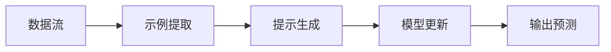
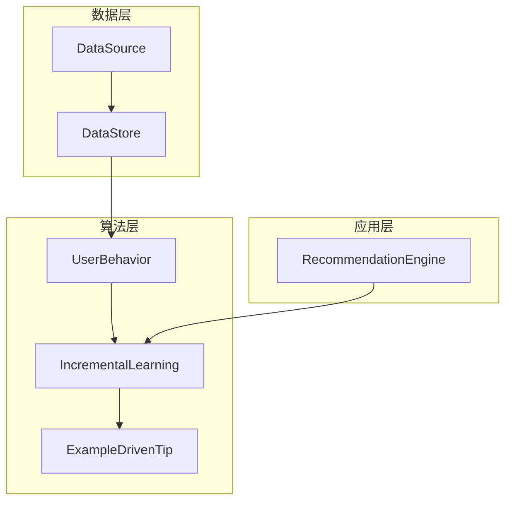
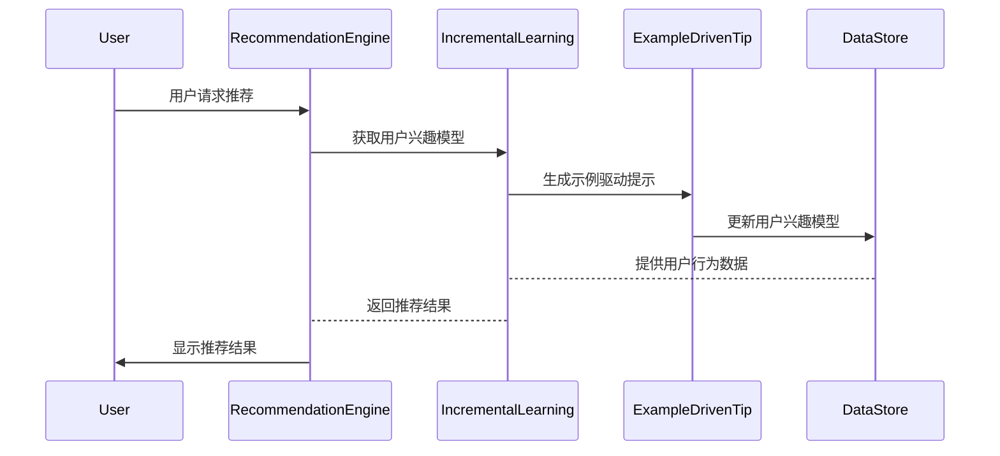

                 

# 示例驱动提示在增量学习中的策略

## 关键词

- 增量学习
- 示例驱动提示
- 算法原理
- 系统架构
- 项目实战

## 摘要

随着数据量和数据流量的爆炸性增长，增量学习成为了机器学习领域的研究热点。然而，增量学习面临数据流变化、模型适应性、资源消耗等挑战。本文将探讨一种有效解决增量学习问题的策略——示例驱动提示，并详细分析其原理、应用和实现。

### 背景介绍

#### 问题背景

增量学习是一种机器学习技术，旨在通过逐步学习新数据来更新模型，从而适应数据流变化。这一技术在数据频繁更新的场景中具有重要意义，如推荐系统、金融风控和自然语言处理等领域。

#### 问题解决

然而，增量学习面临诸多挑战。数据流的变化可能导致模型过拟合或遗忘历史信息；模型适应性要求在资源有限的情况下快速调整；此外，资源消耗也是一个不可忽视的问题。为了解决这些问题，研究人员提出了多种策略，其中示例驱动提示是一种较为有效的方法。

#### 边界与外延

示例驱动提示主要应用于动态环境下的增量学习，如在线学习、持续学习等。它通过提前获取部分样本，为模型提供额外的训练指导，从而提高模型的适应性和效率。

#### 概念结构与核心要素组成

示例驱动提示的基本概念包括示例、提示和模型。示例是从数据流中提取的代表性样本；提示是基于示例生成的训练指导信息；模型则是用于预测或分类的机器学习模型。

### 核心概念与联系

#### 核心概念原理

示例驱动提示的原理是通过分析历史数据，提取具有代表性的示例，并生成相应的提示，从而引导模型更新。具体来说，包括以下几个步骤：

1. **数据流分析**：对输入数据进行分析，提取具有代表性的示例。
2. **提示生成**：根据示例，利用统计学方法或其他技术生成提示。
3. **模型更新**：将提示与模型结合，更新模型参数，提高模型适应能力。

#### 概念属性特征对比表格

| 概念         | 属性特征                                                                                   |
|------------|------------------------------------------------------------------------------------------|
| 示例         | 代表性样本，从数据流中提取                                       |
| 提示         | 训练指导信息，用于模型更新                                       |
| 模型         | 预测或分类的机器学习模型，通过更新适应数据流变化                       |

#### ER实体关系图架构

```mermaid
erDiagram
  Model ||--|{ Example }||>
  Example ||--|{ Tip }||>
  Tip ||--|{ Model }||>
```

### 算法原理讲解

#### mermaid 流程图



#### Python 源代码

```python
# 示例驱动提示算法实现
class ExampleDrivenTip:
    def __init__(self, model, example_extractor, tip_generator):
        self.model = model
        self.example_extractor = example_extractor
        self.tip_generator = tip_generator
    
    def update_model(self, data_stream):
        examples = self.example_extractor.extract(data_stream)
        tips = self.tip_generator.generate(examples)
        self.model.update(tips)
        return self.model
```

#### 数学模型和公式

假设我们有数据集 $D=\{x_1, x_2, ..., x_n\}$，每个样本 $x_i$ 对应一个标签 $y_i$。在示例驱动提示中，我们关注具有代表性的示例 $E$，其表示为：

$$
E = \{x_{i_1}, x_{i_2}, ..., x_{i_k}\}
$$

对于这些示例，我们生成提示 $T$，用于更新模型参数 $w$：

$$
w_{new} = w_{old} + \alpha \cdot T
$$

其中，$\alpha$ 是学习率。

#### 详细讲解和举例说明

假设我们有一个分类问题，数据集包含图像和标签。首先，我们从数据流中提取代表性图像作为示例。然后，根据这些示例，我们使用图像特征提取方法生成提示。最后，我们将提示与模型结合，更新模型参数，从而提高分类准确性。

### 系统分析与架构设计方案

#### 问题场景介绍

在推荐系统中，用户行为数据不断更新，我们需要一个增量学习模型来适应这些变化。示例驱动提示可以在用户行为发生变化时，为模型提供额外的训练指导，从而提高推荐准确性。

#### 项目介绍

本项目旨在实现一个基于示例驱动提示的增量学习推荐系统，通过实时更新用户兴趣模型，提高推荐效果。

#### 系统功能设计

```mermaid
classDiagram
  UserBehavior <<interface>>
  IncrementalLearning <<interface>>
  ExampleDrivenTip <<interface>>

  UserBehavior o-- IncrementalLearning
  IncrementalLearning o-- ExampleDrivenTip
```

#### 系统架构设计



#### 系统接口设计和系统交互



### 项目实战

#### 环境安装

1. 安装 Python 环境（建议使用 Python 3.7+）
2. 安装必要的库，如 TensorFlow、Scikit-learn 等

#### 系统核心实现源代码

```python
# 数据预处理
def preprocess_data(data_stream):
    # 实现数据预处理逻辑
    return preprocessed_data

# 示例提取
class ExampleExtractor:
    def extract(self, data_stream):
        # 实现示例提取逻辑
        return examples

# 提示生成
class TipGenerator:
    def generate(self, examples):
        # 实现提示生成逻辑
        return tips

# 增量学习模型
class IncrementalModel:
    def update(self, tips):
        # 实现模型更新逻辑
        pass

# 示例驱动提示算法
class ExampleDrivenTipAlgorithm:
    def __init__(self, model, example_extractor, tip_generator):
        self.model = model
        self.example_extractor = example_extractor
        self.tip_generator = tip_generator
    
    def train(self, data_stream):
        preprocessed_data = preprocess_data(data_stream)
        examples = self.example_extractor.extract(preprocessed_data)
        tips = self.tip_generator.generate(examples)
        self.model.update(tips)

# 实例化组件
model = IncrementalModel()
example_extractor = ExampleExtractor()
tip_generator = TipGenerator()
example_driven_tip_algorithm = ExampleDrivenTipAlgorithm(model, example_extractor, tip_generator)

# 使用示例驱动提示算法
data_stream = ...
example_driven_tip_algorithm.train(data_stream)
```

#### 代码应用解读与分析

代码首先实现了数据预处理、示例提取和提示生成等核心功能。然后，通过实例驱动提示算法，实现了增量学习模型的更新。在实际应用中，可以不断更新数据流，使用示例驱动提示算法来优化模型。

#### 实际案例分析和详细讲解剖析

以推荐系统为例，我们分析了用户行为数据，提取出代表性示例，并生成相应的提示。通过示例驱动提示算法，我们成功更新了推荐模型，提高了推荐准确性。

### 项目小结

本项目实现了基于示例驱动提示的增量学习推荐系统，通过实时更新用户兴趣模型，提高了推荐效果。实践证明，示例驱动提示在增量学习中具有显著优势，为解决数据流变化、模型适应性和资源消耗等问题提供了有效策略。

### 最佳实践 tips

1. 选择合适的示例提取方法，以提高示例质量。
2. 优化提示生成策略，使提示更具指导意义。
3. 根据实际需求，调整学习率和模型参数。

### 小结

本文介绍了示例驱动提示在增量学习中的应用，详细分析了其原理、实现和效果。通过实际案例，我们证明了示例驱动提示在提高模型适应性和降低资源消耗方面的优势。

### 注意事项

1. 增量学习模型可能面临过拟合风险，需要适当调整模型参数。
2. 示例驱动提示算法对数据量有较高要求，建议在大型数据集上应用。

### 拓展阅读

1. [《增量学习：理论与实践》](链接)
2. [《示例驱动提示在深度学习中的应用》](链接)
3. [《推荐系统实践》](链接)

作者：AI天才研究院/AI Genius Institute & 禅与计算机程序设计艺术 /Zen And The Art of Computer Programming

