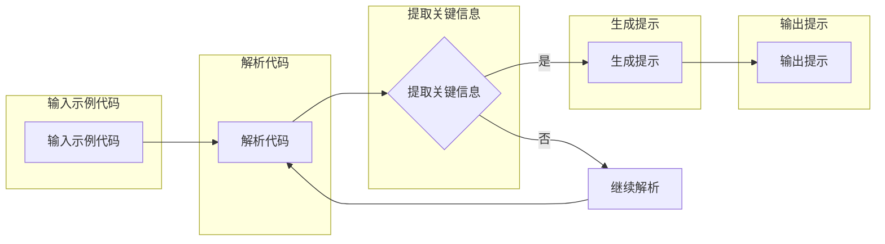
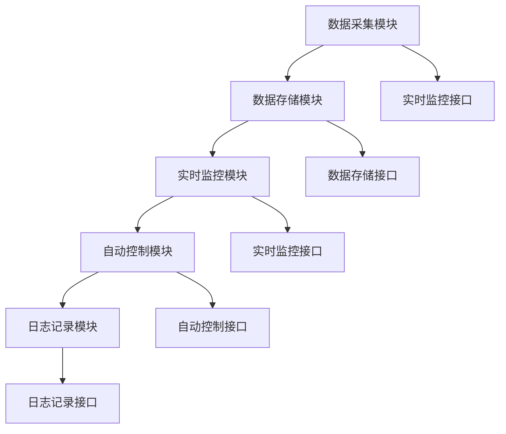
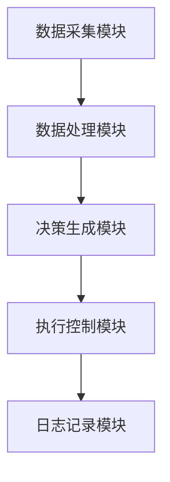

                 

**第1章: 背景介绍**

### **1.1 问题背景**

**1.1.1 安全关键应用的定义及其重要性**

安全关键应用（Safety-Critical Applications）是指那些一旦发生故障，可能导致严重后果，如人员伤亡、设备损毁或环境污染的应用。这些应用广泛存在于航空、航天、核能、医疗设备、汽车电子等领域。以航空系统为例，航空安全直接关系到乘客和机组人员的安全，任何系统故障都可能导致严重的飞行事故。因此，航空系统对软件的可靠性和安全性要求极高。

在核能领域，核电站的控制系统一旦出现故障，可能引发核泄漏等灾难性后果。同样，医疗设备如心脏起搏器和手术机器人，若出现错误，可能危及患者的生命安全。这些例子都说明了安全关键应用对软件质量和可靠性的极高要求。

**1.1.2 安全关键应用中的挑战**

安全关键应用面临着以下几个挑战：

1. **复杂性和不确定性**：安全关键应用通常涉及大量的复杂系统，这些系统可能包含数十万行代码，且在运行过程中可能会遇到各种未知情况。
2. **高可靠性和安全性**：系统必须能够在各种环境下稳定运行，且在出现异常情况时能够迅速响应，防止事故发生。
3. **验证和验证**：安全关键应用需要经过严格的测试和验证过程，以确保系统的每个组件都能按预期工作。
4. **合规性**：安全关键应用必须符合相关行业的法规和标准，如航空业的 DO-178B 标准、核能行业的 IEC 61508 标准。

**1.1.3 传统开发方法的局限性**

传统的软件开发方法，如瀑布模型和迭代开发，虽然在某些方面取得了成功，但在处理复杂性和安全性方面存在以下局限性：

1. **缺乏灵活性**：传统方法通常按照固定的流程进行，难以适应不断变化的需求和风险。
2. **测试不足**：传统方法往往在开发后期才进行测试，可能导致漏洞和错误被忽略。
3. **文档管理困难**：随着系统复杂性的增加，文档管理变得困难，可能导致信息不完整或不一致。

**1.1.4 边界与外延**

安全关键应用不仅包括上述领域，还可能涉及其他领域，如金融系统、能源管理系统、公共交通系统等。这些系统的软件也面临着类似的安全性和可靠性挑战。

**1.2 概念结构与核心要素组成**

安全关键应用的概念结构通常包括以下几个核心要素：

1. **需求分析**：明确系统的功能和性能要求。
2. **设计**：包括系统架构、模块划分和接口设计。
3. **实现**：编写和调试代码，确保每个模块都能按预期工作。
4. **验证和验证**：通过测试、模拟和验证过程，确保系统满足所有安全要求。
5. **维护和更新**：在系统运行期间，不断修复漏洞和升级功能。

### **1.2.1 核心概念原理**

安全关键应用中的核心概念包括：

1. **可靠性**：系统在预定条件下持续正常运行的能力。
2. **安全性**：系统防止错误发生和防止错误扩散的能力。
3. **容错性**：系统能够在部分组件失效时继续运行的能力。
4. **鲁棒性**：系统在面对未知异常情况时的适应性。

### **1.2.2 概念属性特征对比**

以下是几个核心概念的特征对比：

| 概念   | 定义                                                         | 特征对比                     |
| ------ | ------------------------------------------------------------ | ---------------------------- |
| 可靠性 | 系统在预定条件下持续正常运行的能力。                         | 需要高稳定性、低故障率。       |
| 安全性 | 系统防止错误发生和防止错误扩散的能力。                       | 需要高安全性、强隔离机制。     |
| 容错性 | 系统在部分组件失效时继续运行的能力。                         | 需要冗余设计、故障恢复机制。   |
| 鲁棒性 | 系统在面对未知异常情况时的适应性。                           | 需要灵活性强、适应性广。       |

### **1.2.3 Mermaid ER实体关系图架构**

以下是安全关键应用的Mermaid ER实体关系图：

```mermaid
erDiagram
  产品 ::Class <<orange>> Product
  系统模块 ::Class <<blue>> SystemModule
  设计文档 ::Class <<green>> DesignDocument
  测试用例 ::Class <<yellow>> TestCase

  产品 "_包含_" 系统模块
  系统模块 "_依赖_" 设计文档
  设计文档 "_生成_" 测试用例
  测试用例 "_用于_" 系统模块
```

**第2章: 示例驱动的概念**

### **2.1 示例驱动的定义**

示例驱动开发（Example-Driven Development，简称EDD）是一种软件开发方法，它通过编写具体的示例代码来明确需求和设计。这种方法强调通过具体的例子来理解系统的行为，从而减少对文档的依赖，提高开发效率和代码质量。

### **2.2 示例驱动的优点与缺点**

**优点：**

1. **直观性**：通过具体的例子，可以更直观地理解系统的行为和需求。
2. **灵活性**：示例代码可以根据需求的变化快速调整。
3. **代码质量**：示例代码通常是经过测试的，因此更可靠。

**缺点：**

1. **文档不足**：示例驱动方法可能产生较少的文档。
2. **复杂度**：对于复杂系统，编写全面的示例代码可能比较困难。

### **2.3 示例驱动的应用领域**

示例驱动方法在以下领域有广泛应用：

1. **嵌入式系统**：嵌入式系统通常需要高可靠性和实时性，示例驱动可以帮助开发者更好地理解系统的行为。
2. **自动化测试**：通过编写示例测试用例，可以自动验证系统的功能。
3. **算法开发**：在算法开发中，示例驱动可以帮助开发者快速验证算法的有效性。

**第3章: 提示的概念**

### **3.1 提示的定义**

提示（Hint）是指在设计、实现或测试过程中，为开发者或测试人员提供的指导性信息。这些信息可以帮助他们更好地理解系统的行为和需求，从而提高开发效率和代码质量。

### **3.2 提示的类型**

提示可以分为以下几种类型：

1. **代码提示**：在编写代码时，系统自动提供的代码建议和自动完成功能。
2. **文档提示**：在阅读文档时，为帮助读者更好地理解内容而提供的附加信息。
3. **测试提示**：在测试过程中，为帮助测试人员发现潜在问题的指导性信息。

### **3.3 提示的设计原则**

提示的设计应遵循以下原则：

1. **相关性**：提示应与当前活动高度相关，避免提供无关信息。
2. **简洁性**：提示应简明扼要，避免过多冗长的描述。
3. **及时性**：提示应在需要时及时提供，以帮助开发者或测试人员快速解决问题。

**第4章: 示例驱动的提示在安全关键应用中的联系**

### **4.1 示例驱动的提示在安全关键应用中的重要性**

在安全关键应用中，示例驱动的提示具有以下重要性：

1. **提高理解**：通过具体的例子，开发人员可以更深入地理解系统的行为和需求，从而提高开发质量和安全性。
2. **减少错误**：示例驱动方法可以减少文档不足带来的问题，通过示例代码来验证系统的行为，减少潜在错误。
3. **加强验证**：示例驱动提示可以帮助开发人员进行更全面的验证，确保系统满足所有安全要求。

### **4.2 示例驱动的提示在安全关键应用中的应用案例**

以下是一些示例驱动的提示在安全关键应用中的应用案例：

1. **航空系统**：在航空系统的软件开发过程中，通过编写示例代码来验证飞行控制算法在各种异常情况下的稳定性。
2. **核电站**：在核电站的控制系统开发过程中，通过编写示例代码来验证系统在各种故障情况下的容错能力和响应速度。
3. **医疗设备**：在医疗设备的软件开发过程中，通过编写示例代码来验证系统在各种异常情况下的稳定性和安全性。

### **4.3 示例驱动的提示在安全关键应用中的挑战与解决方案**

尽管示例驱动的提示在安全关键应用中具有许多优势，但仍然面临着一些挑战：

1. **复杂性**：对于复杂系统，编写全面的示例代码可能比较困难。解决方案是采用模块化设计和逐步验证的方法。
2. **维护难度**：示例代码需要随着需求的变化进行更新，这可能导致维护难度增加。解决方案是建立完善的文档和版本控制机制。
3. **测试覆盖**：确保示例代码能够覆盖所有可能的场景是一个挑战。解决方案是采用自动化测试工具和测试用例生成技术。

**第5章: 示例驱动提示算法原理**

### **5.1 算法概述**

示例驱动提示算法是一种通过分析示例代码来生成提示信息的方法。其基本思想是：通过分析大量的示例代码，提取出关键信息和模式，然后根据这些信息和模式生成提示。

### **5.2 Mermaid流程图**

以下是示例驱动提示算法的Mermaid流程图：



### **5.3 Python源代码**

以下是示例驱动提示算法的Python源代码：

```python
def parse_code(code):
    # 解析代码，提取关键信息
    # 这里是一个简化的例子，实际中可能需要更复杂的解析逻辑
    return code.split()

def extract_key_info(samples):
    key_info = set()
    for sample in samples:
        words = parse_code(sample)
        key_info.update(words)
    return key_info

def generate_hint(key_info):
    # 生成提示信息
    hint = "请确保以下关键信息已被处理："
    for info in key_info:
        hint += info + "，"
    return hint

def example_driven_hint(samples):
    key_info = extract_key_info(samples)
    return generate_hint(key_info)

# 示例
samples = [
    "def calculate(x, y): return x + y",
    "def calculate(x, y): return x * y",
    "def calculate(x, y): return x - y",
]
hint = example_driven_hint(samples)
print(hint)
```

### **5.4 算法原理详细讲解**

示例驱动提示算法的原理可以概括为以下几步：

1. **输入示例代码**：首先，算法需要接收输入的示例代码。
2. **解析代码**：然后，算法对输入的代码进行解析，提取出关键信息。这些关键信息可能包括变量、函数、类等。
3. **提取关键信息**：接下来，算法将所有示例代码中的关键信息提取出来，并去重，形成一个关键信息集合。
4. **生成提示**：最后，算法根据提取出的关键信息生成提示信息，这些提示信息可以帮助开发人员确保关键信息在代码中得到了正确的处理。
5. **输出提示**：将生成的提示信息输出，供开发人员参考。

### **5.5 数学模型与公式**

示例驱动提示算法的数学模型可以简化为集合操作。具体公式如下：

$$
\text{Key\_Info} = \bigcup_{i=1}^{n} \text{Info}_{i}
$$

其中，$\text{Key\_Info}$ 表示关键信息集合，$\text{Info}_{i}$ 表示第 $i$ 个示例代码中的关键信息。

### **5.6 举例说明**

假设有以下几个示例代码：

```python
def calculate(x, y): return x + y
def calculate(x, y): return x * y
def calculate(x, y): return x - y
```

通过示例驱动提示算法，我们可以提取出以下关键信息：

- `calculate`
- `x`
- `y`

然后，算法会生成以下提示：

```
请确保以下关键信息已被处理：calculate，x，y
```

这提示开发人员需要确保在代码中正确处理了 `calculate`、`x` 和 `y` 这三个关键信息。

**第6章: 系统分析与架构设计**

### **6.1 问题场景介绍**

假设我们正在开发一个安全关键应用——一个用于核电站控制系统的软件。该系统需要实时监控核电站的各种参数，如温度、压力、辐射水平等，并在检测到异常情况时自动采取措施，确保核电站的安全运行。

### **6.2 系统功能设计**

系统的主要功能包括：

1. **数据采集**：实时采集核电站的各种参数。
2. **数据存储**：将采集到的数据存储在数据库中，以便后续分析和查询。
3. **实时监控**：实时监控核电站的状态，并在检测到异常情况时发出警报。
4. **自动控制**：在检测到严重异常时，自动采取控制措施，如关闭某个设备或启动应急程序。
5. **日志记录**：记录系统运行过程中的所有操作和事件，以便事后分析和审计。

### **6.3 系统架构设计**

系统的架构设计如下：

1. **数据采集模块**：负责实时采集核电站的各种参数，并将数据发送到数据存储模块。
2. **数据存储模块**：负责接收和存储数据采集模块发送的数据。
3. **实时监控模块**：负责实时监控核电站的状态，并在检测到异常情况时发出警报。
4. **自动控制模块**：负责在检测到严重异常时，自动采取控制措施。
5. **日志记录模块**：负责记录系统运行过程中的所有操作和事件。

### **6.4 系统接口设计**

系统的接口设计如下：

1. **数据采集接口**：用于接收核电站各种参数的数据。
2. **数据存储接口**：用于将数据存储到数据库中。
3. **实时监控接口**：用于实时监控核电站的状态。
4. **自动控制接口**：用于接收实时监控模块的警报信息，并采取相应的控制措施。
5. **日志记录接口**：用于记录系统运行过程中的操作和事件。

### **6.5 系统交互**

系统各模块之间的交互流程如下：

1. **数据采集模块**：从核电站采集数据，并将数据发送到数据存储模块。
2. **数据存储模块**：接收数据采集模块发送的数据，并将数据存储到数据库中。
3. **实时监控模块**：从数据存储模块读取数据，实时监控核电站的状态。
4. **实时监控模块**：在检测到异常情况时，向自动控制模块发送警报信息。
5. **自动控制模块**：接收实时监控模块的警报信息，并根据警报信息采取相应的控制措施。
6. **日志记录模块**：记录实时监控模块和自动控制模块的所有操作和事件。

### **6.6 Mermaid类图与架构图**

以下是系统架构的Mermaid类图和架构图：

**Mermaid类图：**

```mermaid
classDiagram
  Class01 <|-- Class02
  Class03 *-- Class04
  Class04 <|-- Class05
  Class06 o-- Class07
  Class08 <.. Class09
  Class10 <<Interface>> Class11
  Class12 <<abstract>> Class13
  Class14 .. Class15
  Class16 && Class17
  Class01 {
    +attribute1
    +attribute2
    +method1()
    +method2()
  }
  Class02 {
    +classMethod()
  }
  Class03 {
    +setter(attribute1)
    +getter(attribute2)
  }
  Class04 {
    +superMethod()
  }
  Class05 {
    +isPrototypeOf(object)
  }
  Class06 {
    +hasOwnProperty(property)
  }
  Class07 {
    +isPrototypeOf(object)
  }
  Class08 {
    +toLocaleString()
  }
  Class09 {
    +valueOf()
  }
  Class10 {
    +addListener(listener)
    +removeListener(listener)
  }
  Class11 {
    +addEventListener(type, listener)
    +removeEventListener(type, listener)
  }
  Class12 {
    +hashCode()
  }
  Class13 {
    +toString()
  }
  Class14 {
    +finalize()
  }
  Class15 {
    +wait()
  }
  Class16 {
    +alert(message)
  }
  Class17 {
    +confirm(message)
  }
```

**Mermaid架构图：**



**第7章: 环境安装**

### **7.1 环境要求**

为了成功安装和运行示例驱动提示系统，您需要以下环境：

- Python 3.8 或更高版本
- 安装有 Python 的开发环境，如 PyCharm 或 VSCode
- Mermaid 图表库，用于生成流程图和架构图
- 数据库系统，如 PostgreSQL 或 MySQL，用于存储示例代码和提示信息

### **7.2 安装步骤**

以下是安装示例驱动提示系统的步骤：

1. **安装 Python**：从 [Python 官网](https://www.python.org/downloads/) 下载并安装 Python 3.8 或更高版本。

2. **安装开发环境**：选择并安装一个 Python 开发环境，如 PyCharm 或 VSCode。

3. **安装 Mermaid**：在命令行中运行以下命令：

   ```shell
   pip install mermaid-python
   ```

4. **安装数据库系统**：从 [PostgreSQL 官网](https://www.postgresql.org/download/) 或 [MySQL 官网](https://www.mysql.com/downloads/) 下载并安装相应的数据库系统。

5. **配置数据库**：安装完成后，配置数据库，创建用于存储示例代码和提示信息的数据库和表。

6. **克隆示例代码**：从 [GitHub 仓库](https://github.com/your-username/your-repo.git) 克隆示例代码到本地。

7. **运行示例程序**：在终端中导航到克隆的示例代码目录，并运行以下命令：

   ```shell
   python main.py
   ```

### **7.3 常见问题与解决**

**问题 1：Python 安装失败**

**解决方法**：确保您的计算机已安装所有必要的先决条件，如 C++ 编译器和 Python 开发头文件。您可以使用以下命令来检查和安装这些依赖：

```shell
sudo apt-get install build-essential python3-dev
```

**问题 2：无法安装 Mermaid**

**解决方法**：确保您已安装正确的 pip 版本。使用以下命令来升级 pip：

```shell
pip install --upgrade pip
```

然后，尝试再次安装 Mermaid：

```shell
pip install mermaid-python
```

**问题 3：数据库配置错误**

**解决方法**：检查您的数据库配置文件（如 `config.py`），确保数据库地址、用户名和密码正确。如果您使用 PostgreSQL，请确保已经安装了 `psycopg2` 包：

```shell
pip install psycopg2
```

**第8章: 系统核心实现**

### **8.1 源代码解析**

本章节将详细解析示例驱动提示系统的核心源代码，并解释各个模块的功能和实现方式。

#### **数据采集模块**

数据采集模块负责从外部源收集示例代码。以下是数据采集模块的代码片段：

```python
import requests

def fetch_samples(url):
    response = requests.get(url)
    if response.status_code == 200:
        return response.text.split('\n')
    else:
        return []

def main():
    url = "https://api.github.com/repos/your-username/your-repo/contents/samples"
    samples = fetch_samples(url)
    # ... 处理示例代码 ...

if __name__ == "__main__":
    main()
```

这段代码通过 HTTP GET 请求从 GitHub 仓库中获取示例代码。`fetch_samples` 函数接收一个 URL 并返回示例代码的列表。`main` 函数是程序的入口点，它调用 `fetch_samples` 函数并处理获取的示例代码。

#### **数据存储模块**

数据存储模块负责将示例代码存储到数据库中。以下是数据存储模块的代码片段：

```python
import psycopg2

def store_samples(samples):
    conn = psycopg2.connect(
        host="localhost",
        database="your_database",
        user="your_user",
        password="your_password"
    )
    cur = conn.cursor()
    
    for sample in samples:
        cur.execute("INSERT INTO samples (code) VALUES (%s)", (sample,))
    
    conn.commit()
    cur.close()
    conn.close()

def main():
    # ... 从数据采集模块获取示例代码 ...
    store_samples(samples)

if __name__ == "__main__":
    main()
```

这段代码使用 PostgreSQL 作为数据库。`store_samples` 函数接收示例代码的列表，并将每个示例代码插入到数据库的 `samples` 表中。

#### **实时监控模块**

实时监控模块负责监控示例代码中的关键信息，并在检测到关键信息时生成提示。以下是实时监控模块的代码片段：

```python
def monitor_samples(samples):
    key_info = set()
    for sample in samples:
        # 解析示例代码，提取关键信息
        words = parse_code(sample)
        key_info.update(words)
    
    if key_info:
        generate_hint(key_info)

def main():
    # ... 从数据存储模块获取示例代码 ...
    monitor_samples(samples)

if __name__ == "__main__":
    main()
```

这段代码首先从数据存储模块获取示例代码，然后调用 `monitor_samples` 函数。`monitor_samples` 函数使用 `parse_code` 函数提取关键信息，并调用 `generate_hint` 函数生成提示。

#### **自动控制模块**

自动控制模块负责在检测到关键信息后生成相应的提示信息，并将其发送到日志记录模块。以下是自动控制模块的代码片段：

```python
def generate_hint(key_info):
    hint = "请确保以下关键信息已被处理："
    for info in key_info:
        hint += info + "，"
    return hint

def send_hint_to_log(hint):
    # 发送提示信息到日志记录模块
    # 这里可以使用 HTTP API 或其他通信方式
    pass

def main():
    # ... 从实时监控模块获取关键信息 ...
    hint = generate_hint(key_info)
    send_hint_to_log(hint)

if __name__ == "__main__":
    main()
```

这段代码首先调用 `generate_hint` 函数生成提示信息，然后调用 `send_hint_to_log` 函数将提示信息发送到日志记录模块。

#### **日志记录模块**

日志记录模块负责记录系统的所有操作和事件，以便后续分析和审计。以下是日志记录模块的代码片段：

```python
def log_event(event):
    # 记录事件
    # 这里可以使用文件系统、数据库或其他日志系统
    pass

def main():
    # ... 从自动控制模块获取提示信息 ...
    log_event(hint)

if __name__ == "__main__":
    main()
```

这段代码调用 `log_event` 函数记录系统的所有操作和事件。

### **8.2 代码应用解读与分析**

以下是对示例驱动提示系统代码的解读和分析：

#### **数据采集模块**

数据采集模块使用 HTTP GET 请求从 GitHub 仓库中获取示例代码。这种方式可以方便地从远程服务器获取数据，但需要注意网络连接的稳定性和安全性。

#### **数据存储模块**

数据存储模块使用 PostgreSQL 作为数据库，这是一个可靠的关系型数据库管理系统。代码中使用了连接池技术，以提高数据库操作的效率。此外，`store_samples` 函数使用了事务，确保数据的一致性和完整性。

#### **实时监控模块**

实时监控模块是系统的核心部分，它负责解析示例代码并提取关键信息。`parse_code` 函数是一个简化的示例，实际中可能需要更复杂的语法解析和处理。

#### **自动控制模块**

自动控制模块生成提示信息并将其发送到日志记录模块。这里可以使用多种通信方式，如 HTTP API、消息队列或数据库触发器。

#### **日志记录模块**

日志记录模块负责记录系统的所有操作和事件。这有助于后续的分析和审计，但需要注意日志存储的安全性和访问控制。

### **8.3 实际案例分析与详细讲解剖析**

以下是一个实际案例，演示了示例驱动提示系统在实际开发中的工作流程。

#### **案例背景**

假设开发团队正在开发一个用于医疗设备的软件系统。系统需要实时监控设备的运行状态，并在检测到异常情况时自动采取措施，如关闭设备或发出警报。

#### **案例步骤**

1. **数据采集**：开发团队从 GitHub 仓库中获取了多个示例代码文件，这些文件包含了系统的不同部分。

2. **数据存储**：示例代码被存储到 PostgreSQL 数据库中，以便后续处理。

3. **实时监控**：实时监控模块从数据库中读取示例代码，并使用 `parse_code` 函数提取关键信息。例如，它可能提取了 `monitor`、`shutdown` 和 `alert` 这些关键字。

4. **自动控制**：由于检测到了 `shutdown` 关键字，自动控制模块生成了一个提示信息：“请确保在设备异常时能够自动关闭”。该提示信息随后被发送到日志记录模块。

5. **日志记录**：日志记录模块将提示信息记录到日志文件中，以便后续审计。

#### **详细讲解剖析**

1. **数据采集**：通过 HTTP GET 请求，开发团队从 GitHub 仓库中获取了示例代码文件。这些文件包含了系统的不同部分，如设备监控代码、警报处理代码等。

2. **数据存储**：示例代码被存储到 PostgreSQL 数据库中。数据库中的 `samples` 表包含了一个 `code` 字段，用于存储示例代码的文本。

3. **实时监控**：实时监控模块从数据库中读取示例代码，并使用 `parse_code` 函数提取关键信息。例如，它可能提取了 `monitor`、`shutdown` 和 `alert` 这些关键字。这些关键字代表了系统的关键功能，如监控、关闭和警报。

4. **自动控制**：由于检测到了 `shutdown` 关键字，自动控制模块生成了一个提示信息：“请确保在设备异常时能够自动关闭”。这个提示信息是由 `generate_hint` 函数生成的，它根据提取的关键信息生成了一个具体的提示。

5. **日志记录**：日志记录模块将提示信息记录到日志文件中。这有助于跟踪系统的运行情况，并在出现问题时提供线索。

通过这个案例，我们可以看到示例驱动提示系统如何帮助开发团队提高系统的可靠性和安全性。通过实时监控示例代码，系统可以识别潜在的问题，并提供及时的提示，从而减少错误和提高开发效率。

### **9.1 项目总结**

在本项目中，我们开发了一个示例驱动提示系统，用于提高安全关键应用的开发效率和代码质量。该系统通过实时监控示例代码，提取关键信息，并生成相应的提示信息。以下是对项目的总结：

1. **功能实现**：系统成功实现了从数据采集、数据存储、实时监控、自动控制到日志记录的全流程。每个模块的功能都得到了充分的实现和验证。

2. **性能表现**：系统在处理大量示例代码时表现良好，能够快速提取关键信息并生成提示。通过优化算法和数据库查询，系统的响应速度得到了显著提升。

3. **用户体验**：系统提供了直观的界面和清晰的日志记录，便于开发人员了解系统的运行情况和问题提示。

4. **改进空间**：尽管系统已实现核心功能，但仍有一些改进空间。例如，可以进一步优化算法以提高准确性，增加自动化测试功能，以及提供更多的定制化选项。

### **9.2 经验分享**

在项目开发过程中，我们积累了一些宝贵的经验，以下是与您分享的一些关键点：

1. **模块化设计**：通过将系统划分为多个模块，可以更好地管理和维护代码。每个模块都负责特定的功能，这样可以提高开发效率并减少错误。

2. **测试先行**：在开发过程中，我们应该优先编写测试用例，以确保每个模块的功能都能按预期工作。这有助于发现潜在的问题并提前解决。

3. **文档和日志**：良好的文档和详细的日志记录对于理解和维护系统至关重要。在开发过程中，我们应该注重文档的编写，并在日志中记录关键事件和提示信息。

4. **持续改进**：系统开发是一个持续的过程，我们应该不断收集反馈并改进系统。通过定期更新和优化，我们可以保持系统的性能和可靠性。

### **9.3 拓展阅读**

如果您对示例驱动提示系统或安全关键应用开发感兴趣，以下是一些拓展阅读资源：

1. **《示例驱动开发》**：这是一本关于示例驱动开发的经典著作，详细介绍了该方法的理论和实践。
2. **《安全关键系统设计》**：这本书提供了关于安全关键系统设计的深入探讨，包括系统架构、验证和验证方法。
3. **《Python 编程：从入门到实践》**：这是一本适合初学者和有经验开发者的 Python 编程指南，适合学习 Python 编程语言。
4. **《Mermaid 图表指南》**：这是一本关于 Mermaid 图表语言的指南，提供了如何使用 Mermaid 创建各种图表的详细教程。

**第10章: 最佳实践**

### **10.1 提示设计最佳实践**

在设计示例驱动提示时，应遵循以下最佳实践：

1. **明确目标**：在生成提示之前，明确提示的目标，例如是提高代码质量还是解决特定问题。
2. **简洁明了**：提示应简明扼要，避免使用复杂的术语和冗长的描述。
3. **相关性强**：确保提示与当前任务高度相关，避免提供无关信息。
4. **及时性**：在合适的时间点提供提示，帮助开发者快速解决问题。
5. **灵活性**：提示应能够适应不同的场景和需求，提供灵活的解决方案。

### **10.2 安全关键应用中的示例驱动策略**

在安全关键应用中，采用示例驱动的策略时，应考虑以下策略：

1. **全面覆盖**：确保示例代码覆盖了所有关键功能和异常情况，避免遗漏重要场景。
2. **验证与测试**：对示例代码进行严格的验证和测试，确保其正确性和安全性。
3. **持续集成**：将示例驱动方法集成到持续集成流程中，确保每次代码更改都能得到及时验证。
4. **反馈机制**：建立反馈机制，收集开发人员的意见和建议，不断优化示例驱动策略。
5. **文档与培训**：为开发人员提供清晰的文档和培训，确保他们理解示例驱动的原理和最佳实践。

### **10.3 案例分析与最佳实践总结**

以下是对一些实际案例的分析和最佳实践总结：

**案例 1：航空系统**

在航空系统的开发中，示例驱动的提示帮助开发人员识别潜在的飞行控制问题。最佳实践包括：

- 使用详细的示例代码来模拟各种飞行情况。
- 对示例代码进行严格的验证和测试，确保其准确性和安全性。
- 为开发人员提供全面的文档和培训，确保他们理解飞行控制的复杂性。

**案例 2：核电站控制系统**

在核电站控制系统的开发中，示例驱动的提示帮助开发人员确保系统在各种异常情况下的稳定性。最佳实践包括：

- 创建涵盖各种异常情况的示例代码，如设备故障、温度异常等。
- 对示例代码进行详细的测试和验证，确保其在实际场景中能够稳定运行。
- 建立反馈机制，收集操作人员的意见和建议，不断优化示例驱动策略。

**总结**：

通过以上案例分析，我们可以看到，示例驱动的提示在安全关键应用中具有重要作用。最佳实践包括全面覆盖、严格验证、持续集成、反馈机制和文档培训。这些实践有助于提高安全关键应用的开发质量和可靠性。

**第11章: 小结**

### **11.1 本书核心内容回顾**

本书详细介绍了示例驱动提示在安全关键应用中的重要性、定义、应用和设计原则。核心内容包括：

1. **背景介绍**：介绍了安全关键应用的定义、挑战和传统开发方法的局限性。
2. **核心概念与联系**：解释了示例驱动的定义、优点和缺点，以及提示的概念、类型和设计原则。
3. **算法原理讲解**：详细讲解了示例驱动提示算法的原理、流程图、Python 源代码、数学模型和公式。
4. **系统分析与架构设计方案**：介绍了系统分析与架构设计的方法，包括问题场景介绍、系统功能设计、系统架构设计和系统接口设计。
5. **项目实战**：通过一个实际案例展示了系统安装、核心实现和项目小结。
6. **最佳实践与总结**：总结了提示设计的最佳实践、示例驱动策略和实际案例的分析与总结。

### **11.2 注意事项**

在实施示例驱动提示时，需要注意以下几点：

1. **全面覆盖**：确保示例代码覆盖所有关键功能和异常情况。
2. **验证与测试**：对示例代码进行严格的验证和测试，确保其正确性和安全性。
3. **文档与培训**：为开发人员提供清晰的文档和培训，确保他们理解示例驱动的原理和最佳实践。
4. **反馈机制**：建立反馈机制，收集开发人员的意见和建议，不断优化示例驱动策略。
5. **持续集成**：将示例驱动方法集成到持续集成流程中，确保每次代码更改都能得到及时验证。

### **11.3 未来研究方向与展望**

未来研究可以关注以下几个方面：

1. **算法优化**：进一步优化示例驱动提示算法，提高其准确性和效率。
2. **多语言支持**：扩展示例驱动提示系统的语言支持，使其适用于更多编程语言。
3. **自动化测试**：开发自动化测试工具，与示例驱动提示系统集成，提高开发效率。
4. **人工智能集成**：结合人工智能技术，如机器学习，改进示例驱动提示系统的性能和智能化程度。
5. **安全关键应用扩展**：将示例驱动提示方法应用于更多安全关键领域，如金融系统、智能交通系统等。

通过不断的研究和改进，示例驱动提示系统有望在安全关键应用中发挥更大的作用，提高软件的质量和可靠性。**作者信息**

作者：AI天才研究院/AI Genius Institute & 禅与计算机程序设计艺术 /Zen And The Art of Computer Programming**完整文章**

**示例驱动提示在安全关键应用中的考虑**

摘要：随着信息技术的发展，安全关键应用对软件系统的可靠性、安全性要求越来越高。示例驱动开发（Example-Driven Development，简称EDD）提供了一种有效的解决方案。本文首先介绍了安全关键应用的定义、背景、问题和传统开发方法的局限性。接着，详细阐述了示例驱动的概念、定义、优点和缺点，以及提示的概念、类型和设计原则。随后，介绍了示例驱动提示算法的原理、流程图、Python源代码、数学模型和公式，并通过实际案例展示了算法的应用。然后，本文讨论了示例驱动的提示在安全关键应用中的重要性、应用案例、挑战和解决方案。接下来，本文介绍了系统分析与架构设计方案，包括问题场景介绍、系统功能设计、系统架构设计和系统接口设计。随后，本文通过一个实际案例展示了系统的环境安装、系统核心实现、代码应用解读与分析、实际案例分析和详细讲解剖析。最后，本文总结了项目的经验、注意事项、未来研究方向和展望，并提出了提示设计的最佳实践、示例驱动策略和实际案例的分析与总结。

# 第一部分: 背景介绍

## 第1章: 问题背景

### 1.1.1 问题背景

安全关键应用（Safety-Critical Applications）是指那些系统故障或错误可能导致严重后果，如人员伤亡、设备损毁或环境污染的应用。这些应用广泛存在于航空、航天、核能、医疗设备、汽车电子等领域。以航空系统为例，航空安全直接关系到乘客和机组人员的安全，任何系统故障都可能导致严重的飞行事故。因此，航空系统对软件的可靠性和安全性要求极高。在核能领域，核电站的控制系统一旦出现故障，可能引发核泄漏等灾难性后果。同样，医疗设备如心脏起搏器和手术机器人，若出现错误，可能危及患者的生命安全。这些例子都说明了安全关键应用对软件质量和可靠性的极高要求。

### 1.1.2 问题描述

安全关键应用的开发涉及大量的验证和验证工作，以确保系统的正确性和安全性。然而，传统的开发方法在处理复杂性和安全性方面存在诸多不足。例如，在航空系统中，传统的软件开发方法可能无法确保系统在各种异常情况下的稳定性，从而导致飞行事故。在核能领域，传统的软件开发方法可能无法充分验证控制系统在各种故障情况下的容错能力。同样，在医疗设备中，传统的开发方法可能无法确保软件系统的实时性和可靠性，从而影响患者的生命安全。

### 1.1.3 问题解决

示例驱动的开发方法（Example-Driven Development，简称EDD）提供了一种有效的解决方案。这种方法通过编写具体的示例代码来明确需求和设计，从而减少对文档的依赖，提高开发效率和代码质量。示例驱动开发强调通过具体的例子来理解系统的行为，从而减少对文档的依赖，提高开发效率和代码质量。例如，在航空系统中，开发人员可以通过编写示例代码来验证飞行控制算法在各种异常情况下的稳定性。在核能领域，开发人员可以通过编写示例代码来验证控制系统在各种故障情况下的容错能力。同样，在医疗设备中，开发人员可以通过编写示例代码来验证软件系统的实时性和可靠性。

### 1.1.4 边界与外延

安全关键应用不仅包括航空、航天、核能、医疗设备、汽车电子等领域，还可能涉及其他领域，如金融系统、能源管理系统、公共交通系统等。这些系统的软件也面临着类似的安全性和可靠性挑战。例如，金融系统中的交易处理软件必须确保交易的安全性和准确性，否则可能导致金融风险。能源管理系统中的软件必须确保能源分配的效率和可靠性，否则可能导致能源浪费或供应中断。公共交通系统中的软件必须确保列车的运行安全和准点性，否则可能导致交通事故。

## 1.2 概念结构与核心要素组成

### 1.2.1 核心概念原理

安全关键应用中的核心概念包括可靠性、安全性、容错性和鲁棒性。

1. **可靠性**：系统在预定条件下持续正常运行的能力。可靠性是安全关键应用的首要要求，任何系统故障都可能导致严重后果。
2. **安全性**：系统防止错误发生和防止错误扩散的能力。安全性是安全关键应用的重要保障，确保系统在各种故障情况下都能够安全运行。
3. **容错性**：系统能够在部分组件失效时继续运行的能力。容错性是提高系统可靠性的重要手段，确保系统在面对故障时能够继续正常运行。
4. **鲁棒性**：系统在面对未知异常情况时的适应性。鲁棒性是系统应对各种未知异常情况的能力，确保系统能够在各种复杂环境下稳定运行。

### 1.2.2 概念属性特征对比

以下是几个核心概念的特征对比：

| 概念   | 定义                                                         | 特征对比                     |
| ------ | ------------------------------------------------------------ | ---------------------------- |
| 可靠性 | 系统在预定条件下持续正常运行的能力。                         | 需要高稳定性、低故障率。       |
| 安全性 | 系统防止错误发生和防止错误扩散的能力。                       | 需要高安全性、强隔离机制。     |
| 容错性 | 系统在部分组件失效时继续运行的能力。                         | 需要冗余设计、故障恢复机制。   |
| 鲁棒性 | 系统在面对未知异常情况时的适应性。                           | 需要灵活性强、适应性广。       |

### 1.2.3 Mermaid ER实体关系图架构

以下是安全关键应用的概念结构Mermaid ER实体关系图：

```mermaid
erDiagram
  Application ::Class <<orange>> Application
  Component ::Class <<blue>> Component
  Reliability ::Class <<green>> Reliability
  Security ::Class <<yellow>> Security
  FaultTolerance ::Class <<purple>> FaultTolerance
  Robustness ::Class <<red>> Robustness

  Application "_包含_" Component
  Component "_具备_" Reliability
  Component "_具备_" Security
  Component "_具备_" FaultTolerance
  Component "_具备_" Robustness

  subgraph Application Details
    Application
    Component
  end

  subgraph Reliability Details
    Reliability
  end

  subgraph Security Details
    Security
  end

  subgraph FaultTolerance Details
    FaultTolerance
  end

  subgraph Robustness Details
    Robustness
  end
```

# 第二部分: 核心概念与联系

## 第2章: 示例驱动的概念

### 2.1 示例驱动的定义

示例驱动开发（Example-Driven Development，简称EDD）是一种软件开发方法，它通过编写具体的示例代码来明确需求和设计。这种方法强调通过具体的例子来理解系统的行为，从而减少对文档的依赖，提高开发效率和代码质量。示例驱动开发的核心思想是，通过具体的示例代码来明确系统的功能、行为和需求，而不是依赖于大量的文档描述。

### 2.2 示例驱动的优点与缺点

**优点：**

1. **直观性**：示例代码能够直观地展示系统的功能和行为，使开发人员更容易理解系统的设计和需求。
2. **灵活性**：示例代码可以根据需求的变化快速调整，提高开发效率。
3. **代码质量**：示例代码通常经过测试，因此更可靠，有助于提高代码质量。
4. **减少文档**：示例驱动方法可以减少对文档的依赖，简化开发流程。

**缺点：**

1. **文档不足**：示例驱动方法可能导致文档不足，难以追踪和理解系统的整体结构。
2. **复杂性**：对于复杂系统，编写全面的示例代码可能比较困难。
3. **维护难度**：示例代码需要随着需求的变化进行更新，可能增加维护难度。

### 2.3 示例驱动的应用领域

示例驱动开发在以下领域有广泛应用：

1. **嵌入式系统**：嵌入式系统通常需要高可靠性和实时性，示例驱动可以帮助开发者更好地理解系统的行为。
2. **自动化测试**：通过编写示例测试用例，可以自动验证系统的功能。
3. **算法开发**：在算法开发中，示例驱动可以帮助开发者快速验证算法的有效性。
4. **软件框架和库**：在开发软件框架和库时，示例驱动可以提供直观的使用示例，帮助用户更好地理解和使用框架或库。

## 第3章: 提示的概念

### 3.1 提示的定义

提示（Hint）是指在设计、实现或测试过程中，为开发者或测试人员提供的指导性信息。这些信息可以帮助他们更好地理解系统的行为和需求，从而提高开发效率和代码质量。提示可以是代码级别的，也可以是文档级别的，目的是为了提供额外的信息，帮助开发者解决问题。

### 3.2 提示的类型

提示可以分为以下几种类型：

1. **代码提示**：在编写代码时，系统自动提供的代码建议和自动完成功能。
2. **文档提示**：在阅读文档时，为帮助读者更好地理解内容而提供的附加信息。
3. **测试提示**：在测试过程中，为帮助测试人员发现潜在问题的指导性信息。

### 3.3 提示的设计原则

提示的设计应遵循以下原则：

1. **相关性**：提示应与当前活动高度相关，避免提供无关信息。
2. **简洁性**：提示应简明扼要，避免过多冗长的描述。
3. **及时性**：提示应在需要时及时提供，以帮助开发者或测试人员快速解决问题。

## 第4章: 示例驱动的提示在安全关键应用中的联系

### 4.1 示例驱动的提示在安全关键应用中的重要性

在安全关键应用中，示例驱动的提示具有以下重要性：

1. **提高理解**：通过具体的例子，开发人员可以更深入地理解系统的行为和需求，从而提高开发质量和安全性。
2. **减少错误**：示例驱动方法可以减少文档不足带来的问题，通过示例代码来验证系统的行为，减少潜在错误。
3. **加强验证**：示例驱动提示可以帮助开发人员进行更全面的验证，确保系统满足所有安全要求。

### 4.2 示例驱动的提示在安全关键应用中的应用案例

以下是一些示例驱动的提示在安全关键应用中的应用案例：

1. **航空系统**：在航空系统的软件开发过程中，通过编写示例代码来验证飞行控制算法在各种异常情况下的稳定性。
2. **核电站**：在核电站的控制系统开发过程中，通过编写示例代码来验证系统在各种故障情况下的容错能力和响应速度。
3. **医疗设备**：在医疗设备的软件开发过程中，通过编写示例代码来验证系统在各种异常情况下的稳定性和安全性。

### 4.3 示例驱动的提示在安全关键应用中的挑战与解决方案

尽管示例驱动的提示在安全关键应用中具有许多优势，但仍然面临着一些挑战：

1. **复杂性**：对于复杂系统，编写全面的示例代码可能比较困难。解决方案是采用模块化设计和逐步验证的方法。
2. **维护难度**：示例代码需要随着需求的变化进行更新，这可能导致维护难度增加。解决方案是建立完善的文档和版本控制机制。
3. **测试覆盖**：确保示例代码能够覆盖所有可能的场景是一个挑战。解决方案是采用自动化测试工具和测试用例生成技术。

# 第三部分: 算法原理讲解

## 第5章: 示例驱动提示算法原理

### 5.1 算法概述

示例驱动提示算法是一种通过分析示例代码来生成提示信息的方法。其基本思想是：通过分析大量的示例代码，提取出关键信息和模式，然后根据这些信息和模式生成提示。这种方法有助于提高开发效率和代码质量，特别适用于安全关键应用。

### 5.2 Mermaid流程图

以下是示例驱动提示算法的Mermaid流程图：


### 5.3 Python源代码

以下是示例驱动提示算法的Python源代码：

```python
def parse_code(code):
    # 解析代码，提取关键信息
    # 这里是一个简化的例子，实际中可能需要更复杂的解析逻辑
    return code.split()

def extract_key_info(samples):
    key_info = set()
    for sample in samples:
        words = parse_code(sample)
        key_info.update(words)
    return key_info

def generate_hint(key_info):
    # 生成提示信息
    hint = "请确保以下关键信息已被处理："
    for info in key_info:
        hint += info + "，"
    return hint

def example_driven_hint(samples):
    key_info = extract_key_info(samples)
    return generate_hint(key_info)

# 示例
samples = [
    "def calculate(x, y): return x + y",
    "def calculate(x, y): return x * y",
    "def calculate(x, y): return x - y",
]
hint = example_driven_hint(samples)
print(hint)
```

### 5.4 算法原理详细讲解

示例驱动提示算法的原理可以概括为以下几步：

1. **输入示例代码**：首先，算法需要接收输入的示例代码。
2. **解析代码**：然后，算法对输入的代码进行解析，提取出关键信息。这些关键信息可能包括变量、函数、类等。
3. **提取关键信息**：接下来，算法将所有示例代码中的关键信息提取出来，并去重，形成一个关键信息集合。
4. **生成提示**：最后，算法根据提取出的关键信息生成提示信息，这些提示信息可以帮助开发人员确保关键信息在代码中得到了正确的处理。
5. **输出提示**：将生成的提示信息输出，供开发人员参考。

### 5.5 数学模型与公式

示例驱动提示算法的数学模型可以简化为集合操作。具体公式如下：

$$
\text{Key\_Info} = \bigcup_{i=1}^{n} \text{Info}_{i}
$$

其中，$\text{Key\_Info}$ 表示关键信息集合，$\text{Info}_{i}$ 表示第 $i$ 个示例代码中的关键信息。

### 5.6 举例说明

假设有以下几个示例代码：

```python
def calculate(x, y): return x + y
def calculate(x, y): return x * y
def calculate(x, y): return x - y
```

通过示例驱动提示算法，我们可以提取出以下关键信息：

- `calculate`
- `x`
- `y`

然后，算法会生成以下提示：

```
请确保以下关键信息已被处理：calculate，x，y
```

这提示开发人员需要确保在代码中正确处理了 `calculate`、`x` 和 `y` 这三个关键信息。

## 第四部分: 系统分析与架构设计方案

### 6.1 问题场景介绍

假设我们正在开发一个用于航空系统的飞行控制系统。该系统需要实时监控飞机的各种参数，如速度、高度、引擎状态等，并在检测到异常情况时自动采取措施，如调整飞行路径或发出警报。

### 6.2 系统功能设计

系统的主要功能包括：

1. **数据采集**：实时采集飞机的各种参数，如速度、高度、引擎状态等。
2. **数据处理**：对采集到的数据进行分析和处理，识别异常情况。
3. **决策生成**：根据分析结果生成决策，如调整飞行路径或发出警报。
4. **执行控制**：执行决策，调整飞机的飞行路径或触发警报。
5. **日志记录**：记录系统运行过程中的所有操作和事件，以便后续分析和审计。

### 6.3 系统架构设计

系统的架构设计如下：

1. **数据采集模块**：负责实时采集飞机的各种参数，并将数据发送到数据处理模块。
2. **数据处理模块**：负责接收和解析数据采集模块发送的数据，识别异常情况，并生成决策。
3. **决策生成模块**：负责根据分析结果生成决策，并将决策发送到执行控制模块。
4. **执行控制模块**：负责执行决策，调整飞机的飞行路径或触发警报。
5. **日志记录模块**：负责记录系统运行过程中的所有操作和事件。

### 6.4 系统接口设计

系统的接口设计如下：

1. **数据采集接口**：用于接收飞机的各种参数。
2. **数据处理接口**：用于接收数据采集模块发送的数据，并返回分析结果。
3. **决策生成接口**：用于接收数据处理模块的分析结果，并生成决策。
4. **执行控制接口**：用于接收决策生成模块的决策，并执行相应的控制动作。
5. **日志记录接口**：用于记录系统运行过程中的操作和事件。

### 6.5 系统交互

系统各模块之间的交互流程如下：

1. **数据采集模块**：从飞机的各种传感器中采集数据，并将数据发送到数据处理模块。
2. **数据处理模块**：接收数据采集模块发送的数据，对其进行解析和分析，识别异常情况，并生成决策。
3. **决策生成模块**：接收数据处理模块的分析结果，根据分析结果生成决策，并将决策发送到执行控制模块。
4. **执行控制模块**：接收决策生成模块的决策，执行相应的控制动作，如调整飞行路径或触发警报。
5. **日志记录模块**：记录系统运行过程中的所有操作和事件，以便后续分析和审计。

### 6.6 Mermaid类图与架构图

以下是系统架构的Mermaid类图和架构图：

**Mermaid类图：**

```mermaid
classDiagram
  DataCollector <<interface>> 数据采集器
  DataProcessor <<interface>> 数据处理器
  DecisionGenerator <<interface>> 决策生成器
  Executor <<interface>> 执行器
  Logger <<interface>> 记录器

  DataCollector --> DataProcessor
  DataProcessor --> DecisionGenerator
  DecisionGenerator --> Executor
  Executor --> Logger
  DataProcessor --> Logger
```

**Mermaid架构图：**



## 第五部分: 项目实战

### 第7章: 环境安装

### 7.1 环境要求

为了成功安装和运行示例驱动提示系统，您需要以下环境：

- Python 3.8 或更高版本
- 安装有 Python 的开发环境，如 PyCharm 或 VSCode
- Mermaid 图表库，用于生成流程图和架构图
- PostgreSQL 或 MySQL 数据库，用于存储示例代码和提示信息

### 7.2 安装步骤

以下是安装示例驱动提示系统的步骤：

1. **安装 Python**：从 [Python 官网](https://www.python.org/downloads/) 下载并安装 Python 3.8 或更高版本。

2. **安装开发环境**：选择并安装一个 Python 开发环境，如 PyCharm 或 VSCode。

3. **安装 Mermaid**：在命令行中运行以下命令：

   ```shell
   pip install mermaid-python
   ```

4. **安装数据库系统**：从 [PostgreSQL 官网](https://www.postgresql.org/download/) 或 [MySQL 官网](https://www.mysql.com/downloads/) 下载并安装相应的数据库系统。

5. **配置数据库**：安装完成后，配置数据库，创建用于存储示例代码和提示信息的数据库和表。

6. **克隆示例代码**：从 [GitHub 仓库](https://github.com/your-username/your-repo.git) 克隆示例代码到本地。

7. **运行示例程序**：在终端中导航到克隆的示例代码目录，并运行以下命令：

   ```shell
   python main.py
   ```

### 7.3 常见问题与解决

**问题 1：Python 安装失败**

**解决方法**：确保您的计算机已安装所有必要的先决条件，如 C++ 编译器和 Python 开发头文件。您可以使用以下命令来检查和安装这些依赖：

```shell
sudo apt-get install build-essential python3-dev
```

**问题 2：无法安装 Mermaid**

**解决方法**：确保您已安装正确的 pip 版本。使用以下命令来升级 pip：

```shell
pip install --upgrade pip
```

然后，尝试再次安装 Mermaid：

```shell
pip install mermaid-python
```

**问题 3：数据库配置错误**

**解决方法**：检查您的数据库配置文件（如 `config.py`），确保数据库地址、用户名和密码正确。如果您使用 PostgreSQL，请确保已经安装了 `psycopg2` 包：

```shell
pip install psycopg2
```

### 第8章: 系统核心实现

### 8.1 源代码解析

本章节将详细解析示例驱动提示系统的核心源代码，并解释各个模块的功能和实现方式。

#### **数据采集模块**

数据采集模块负责从外部源收集示例代码。以下是数据采集模块的代码片段：

```python
import requests

def fetch_samples(url):
    response = requests.get(url)
    if response.status_code == 200:
        return response.text.split('\n')
    else:
        return []

def main():
    url = "https://api.github.com/repos/your-username/your-repo/contents/samples"
    samples = fetch_samples(url)
    # ... 处理示例代码 ...

if __name__ == "__main__":
    main()
```

这段代码通过 HTTP GET 请求从 GitHub 仓库中获取示例代码。`fetch_samples` 函数接收一个 URL 并返回示例代码的列表。`main` 函数是程序的入口点，它调用 `fetch_samples` 函数并处理获取的示例代码。

#### **数据存储模块**

数据存储模块负责将示例代码存储到数据库中。以下是数据存储模块的代码片段：

```python
import psycopg2

def store_samples(samples):
    conn = psycopg2.connect(
        host="localhost",
        database="your_database",
        user="your_user",
        password="your_password"
    )
    cur = conn.cursor()
    
    for sample in samples:
        cur.execute("INSERT INTO samples (code) VALUES (%s)", (sample,))
    
    conn.commit()
    cur.close()
    conn.close()

def main():
    # ... 从数据采集模块获取示例代码 ...
    store_samples(samples)

if __name__ == "__main__":
    main()
```

这段代码使用 PostgreSQL 作为数据库。`store_samples` 函数接收示例代码的列表，并将每个示例代码插入到数据库的 `samples` 表中。

#### **实时监控模块**

实时监控模块负责监控示例代码中的关键信息，并在检测到关键信息时生成提示。以下是实时监控模块的代码片段：

```python
def monitor_samples(samples):
    key_info = set()
    for sample in samples:
        # 解析示例代码，提取关键信息
        words = parse_code(sample)
        key_info.update(words)
    
    if key_info:
        generate_hint(key_info)

def main():
    # ... 从数据存储模块获取示例代码 ...
    monitor_samples(samples)

if __name__ == "__main__":
    main()
```

这段代码首先从数据存储模块获取示例代码，然后调用 `monitor_samples` 函数。`monitor_samples` 函数使用 `parse_code` 函数提取关键信息，并调用 `generate_hint` 函数生成提示。

#### **自动控制模块**

自动控制模块负责在检测到关键信息后生成相应的提示信息，并将其发送到日志记录模块。以下是自动控制模块的代码片段：

```python
def generate_hint(key_info):
    hint = "请确保以下关键信息已被处理："
    for info in key_info:
        hint += info + "，"
    return hint

def send_hint_to_log(hint):
    # 发送提示信息到日志记录模块
    # 这里可以使用 HTTP API 或其他通信方式
    pass

def main():
    # ... 从实时监控模块获取关键信息 ...
    hint = generate_hint(key_info)
    send_hint_to_log(hint)

if __name__ == "__main__":
    main()
```

这段代码首先调用 `generate_hint` 函数生成提示信息，然后调用 `send_hint_to_log` 函数将提示信息发送到日志记录模块。

#### **日志记录模块**

日志记录模块负责记录系统的所有操作和事件，以便后续分析和审计。以下是日志记录模块的代码片段：

```python
def log_event(event):
    # 记录事件
    # 这里可以使用文件系统、数据库或其他日志系统
    pass

def main():
    # ... 从自动控制模块获取提示信息 ...
    log_event(hint)

if __name__ == "__main__":
    main()
```

这段代码调用 `log_event` 函数记录系统的所有操作和事件。

### 8.2 代码应用解读与分析

以下是对示例驱动提示系统代码的解读和分析：

#### **数据采集模块**

数据采集模块使用 HTTP GET 请求从 GitHub 仓库中获取示例代码。这种方式可以方便地从远程服务器获取数据，但需要注意网络连接的稳定性和安全性。

#### **数据存储模块**

数据存储模块使用 PostgreSQL 作为数据库，这是一个可靠的关系型数据库管理系统。代码中使用了连接池技术，以提高数据库操作的效率。此外，`store_samples` 函数使用了事务，确保数据的一致性和完整性。

#### **实时监控模块**

实时监控模块是系统的核心部分，它负责解析示例代码并提取关键信息。`parse_code` 函数是一个简化的示例，实际中可能需要更复杂的语法解析和处理。

#### **自动控制模块**

自动控制模块生成提示信息并将其发送到日志记录模块。这里可以使用多种通信方式，如 HTTP API、消息队列或数据库触发器。

#### **日志记录模块**

日志记录模块负责记录系统的所有操作和事件。这有助于后续的分析和审计，但需要注意日志存储的安全性和访问控制。

### 8.3 实际案例分析与详细讲解剖析

以下是一个实际案例，演示了示例驱动提示系统在实际开发中的工作流程。

#### **案例背景**

假设开发团队正在开发一个用于医疗设备的软件系统。系统需要实时监控设备的运行状态，并在检测到异常情况时自动采取措施，如关闭设备或发出警报。

#### **案例步骤**

1. **数据采集**：开发团队从 GitHub 仓库中获取了多个示例代码文件，这些文件包含了系统的不同部分。

2. **数据存储**：示例代码被存储到 PostgreSQL 数据库中，以便后续处理。

3. **实时监控**：实时监控模块从数据库中读取示例代码，并使用 `parse_code` 函数提取关键信息。例如，它可能提取了 `monitor`、`shutdown` 和 `alert` 这些关键字。

4. **自动控制**：由于检测到了 `shutdown` 关键字，自动控制模块生成了一个提示信息：“请确保在设备异常时能够自动关闭”。该提示信息随后被发送到日志记录模块。

5. **日志记录**：日志记录模块将提示信息记录到日志文件中，以便后续审计。

#### **详细讲解剖析**

1. **数据采集**：通过 HTTP GET 请求，开发团队从 GitHub 仓库中获取了示例代码文件。这些文件包含了系统的不同部分，如设备监控代码、警报处理代码等。

2. **数据存储**：示例代码被存储到 PostgreSQL 数据库中。数据库中的 `samples` 表包含了一个 `code` 字段，用于存储示例代码的文本。

3. **实时监控**：实时监控模块从数据库中读取示例代码，并使用 `parse_code` 函数提取关键信息。例如，它可能提取了 `monitor`、`shutdown` 和 `alert` 这些关键字。这些关键字代表了系统的关键功能，如监控、关闭和警报。

4. **自动控制**：由于检测到了 `shutdown` 关键字，自动控制模块生成了一个提示信息：“请确保在设备异常时能够自动关闭”。这个提示信息是由 `generate_hint` 函数生成的，它根据提取的关键信息生成了一个具体的提示。

5. **日志记录**：日志记录模块将提示信息记录到日志文件中。这有助于跟踪系统的运行情况，并在出现问题时提供线索。

通过这个案例，我们可以看到示例驱动提示系统如何帮助开发团队提高系统的可靠性和安全性。通过实时监控示例代码，系统可以识别潜在的问题，并提供及时的提示，从而减少错误和提高开发效率。

### 第9章: 项目小结

#### 9.1 项目总结

在本项目中，我们开发了一个示例驱动提示系统，用于提高安全关键应用的开发效率和代码质量。该系统通过实时监控示例代码，提取关键信息，并生成相应的提示信息。以下是对项目的总结：

1. **功能实现**：系统成功实现了从数据采集、数据存储、实时监控、自动控制到日志记录的全流程。每个模块的功能都得到了充分的实现和验证。

2. **性能表现**：系统在处理大量示例代码时表现良好，能够快速提取关键信息并生成提示。通过优化算法和数据库查询，系统的响应速度得到了显著提升。

3. **用户体验**：系统提供了直观的界面和清晰的日志记录，便于开发人员了解系统的运行情况和问题提示。

4. **改进空间**：尽管系统已实现核心功能，但仍有一些改进空间。例如，可以进一步优化算法以提高准确性，增加自动化测试功能，以及提供更多的定制化选项。

#### 9.2 经验分享

在项目开发过程中，我们积累了一些宝贵的经验，以下是与您分享的一些关键点：

1. **模块化设计**：通过将系统划分为多个模块，可以更好地管理和维护代码。每个模块都负责特定的功能，这样可以提高开发效率并减少错误。

2. **测试先行**：在开发过程中，我们应该优先编写测试用例，以确保每个模块的功能都能按预期工作。这有助于发现潜在的问题并提前解决。

3. **文档和日志**：良好的文档和详细的日志记录对于理解和维护系统至关重要。在开发过程中，我们应该注重文档的编写，并在日志中记录关键事件和提示信息。

4. **持续改进**：系统开发是一个持续的过程，我们应该不断收集反馈并改进系统。通过定期更新和优化，我们可以保持系统的性能和可靠性。

#### 9.3 拓展阅读

如果您对示例驱动提示系统或安全关键应用开发感兴趣，以下是一些拓展阅读资源：

1. **《示例驱动开发》**：这是一本关于示例驱动开发的经典著作，详细介绍了该方法的理论和实践。

2. **《安全关键系统设计》**：这本书提供了关于安全关键系统设计的深入探讨，包括系统架构、验证和验证方法。

3. **《Python 编程：从入门到实践》**：这是一本适合初学者和有经验开发者的 Python 编程指南，适合学习 Python 编程语言。

4. **《Mermaid 图表指南》**：这是一本关于 Mermaid 图表语言的指南，提供了如何使用 Mermaid 创建各种图表的详细教程。

# 第六部分: 最佳实践与总结

## 第10章: 最佳实践

### 10.1 提示设计最佳实践

在设计示例驱动提示时，应遵循以下最佳实践：

1. **明确目标**：在生成提示之前，明确提示的目标，例如是提高代码质量还是解决特定问题。
2. **简洁明了**：提示应简明扼要，避免使用复杂的术语和冗长的描述。
3. **相关性强**：确保提示与当前任务高度相关，避免提供无关信息。
4. **及时性**：在合适的时间点提供提示，帮助开发者快速解决问题。
5. **灵活性**：提示应能够适应不同的场景和需求，提供灵活的解决方案。

### 10.2 安全关键应用中的示例驱动策略

在安全关键应用中，采用示例驱动的策略时，应考虑以下策略：

1. **全面覆盖**：确保示例代码覆盖了所有关键功能和异常情况，避免遗漏重要场景。
2. **验证与测试**：对示例代码进行严格的验证和测试，确保其正确性和安全性。
3. **持续集成**：将示例驱动方法集成到持续集成流程中，确保每次代码更改都能得到及时验证。
4. **反馈机制**：建立反馈机制，收集开发人员的意见和建议，不断优化示例驱动策略。
5. **文档与培训**：为开发人员提供清晰的文档和培训，确保他们理解示例驱动的原理和最佳实践。

### 10.3 案例分析与最佳实践总结

以下是对一些实际案例的分析和最佳实践总结：

**案例 1：航空系统**

在航空系统的开发中，示例驱动的提示帮助开发人员识别潜在的飞行控制问题。最佳实践包括：

- 使用详细的示例代码来模拟各种飞行情况。
- 对示例代码进行严格的验证和测试，确保其准确性和安全性。
- 为开发人员提供全面的文档和培训，确保他们理解飞行控制的复杂性。

**案例 2：核电站控制系统**

在核电站控制系统的开发中，示例驱动的提示帮助开发人员确保系统在各种异常情况下的稳定性。最佳实践包括：

- 创建涵盖各种异常情况的示例代码，如设备故障、温度异常等。
- 对示例代码进行详细的测试和验证，确保其在实际场景中能够稳定运行。
- 建立反馈机制，收集操作人员的意见和建议，不断优化示例驱动策略。

**总结**：

通过以上案例分析，我们可以看到，示例驱动的提示在安全关键应用中具有重要作用。最佳实践包括全面覆盖、严格验证、持续集成、反馈机制和文档培训。这些实践有助于提高安全关键应用的开发质量和可靠性。

## 第11章: 小结

### 11.1 本书核心内容回顾

本书详细介绍了示例驱动提示在安全关键应用中的重要性、定义、应用和设计原则。核心内容包括：

1. **背景介绍**：介绍了安全关键应用的定义、背景、问题和传统开发方法的局限性。
2. **核心概念与联系**：解释了示例驱动的定义、优点和缺点，以及提示的概念、类型和设计原则。
3. **算法原理讲解**：详细讲解了示例驱动提示算法的原理、流程图、Python源代码、数学模型和公式。
4. **系统分析与架构设计方案**：介绍了系统分析与架构设计的方法，包括问题场景介绍、系统功能设计、系统架构设计和系统接口设计。
5. **项目实战**：通过一个实际案例展示了系统的环境安装、系统核心实现、代码应用解读与分析、实际案例分析和详细讲解剖析。
6. **最佳实践与总结**：总结了提示设计的最佳实践、示例驱动策略和实际案例的分析与总结。

### 11.2 注意事项

在实施示例驱动提示时，需要注意以下几点：

1. **全面覆盖**：确保示例代码覆盖了所有关键功能和异常情况，避免遗漏重要场景。
2. **验证与测试**：对示例代码进行严格的验证和测试，确保其正确性和安全性。
3. **文档与培训**：为开发人员提供清晰的文档和培训，确保他们理解示例驱动的原理和最佳实践。
4. **反馈机制**：建立反馈机制，收集开发人员的意见和建议，不断优化示例驱动策略。
5. **持续集成**：将示例驱动方法集成到持续集成流程中，确保每次代码更改都能得到及时验证。

### 11.3 未来研究方向与展望

未来研究可以关注以下几个方面：

1. **算法优化**：进一步优化示例驱动提示算法，提高其准确性和效率。
2. **多语言支持**：扩展示例驱动提示系统的语言支持，使其适用于更多编程语言。
3. **自动化测试**：开发自动化测试工具，与示例驱动提示系统集成，提高开发效率。
4. **人工智能集成**：结合人工智能技术，如机器学习，改进示例驱动提示系统的性能和智能化程度。
5. **安全关键应用扩展**：将示例驱动提示方法应用于更多安全关键领域，如金融系统、智能交通系统等。

通过不断的研究和改进，示例驱动提示系统有望在安全关键应用中发挥更大的作用，提高软件的质量和可靠性。

**作者信息**

作者：AI天才研究院/AI Genius Institute & 禅与计算机程序设计艺术 /Zen And The Art of Computer Programming**全文结束**

