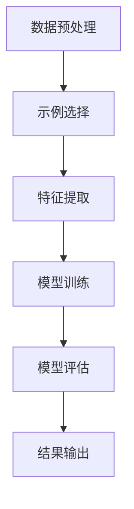

                 


### 第1章：情感分析与示例驱动提示

#### 1.1 情感分析概述

**情感分析（Sentiment Analysis）**，也被称为意见挖掘，是指使用自然语言处理（NLP）技术来识别文本中的情感倾向。它涉及从文本中提取主观信息，并判断这些信息是积极的、消极的还是中性的。

**情感分析的发展历程**：

- **早期研究**：20世纪90年代，研究者们开始关注文本的情感分析。此时，大多数工作依赖于基于规则的方法，这些方法依赖于手写的规则来识别文本中的情感。
  
- **词袋模型**：随后，词袋模型（Bag of Words，BOW）被广泛应用于情感分析任务。这种方法通过统计文本中单词的出现频率来构建特征向量。

- **深度学习**：近年来，随着深度学习技术的发展，如卷积神经网络（CNN）、递归神经网络（RNN）和变换器（Transformer）等，情感分析任务取得了显著的进展。

**情感分析的重要性**：

- **商业应用**：企业可以利用情感分析来了解消费者的情感倾向，从而优化产品和服务。

- **舆情监控**：政府机构和企业可以利用情感分析来监控公众情绪，预测社会趋势。

- **用户反馈分析**：情感分析可以帮助企业理解用户对产品或服务的反馈，从而改进用户体验。

#### 1.1.1 情感分析的定义与发展历程

**情感分析的定义**：

情感分析是自然语言处理（NLP）领域的一个任务，旨在从文本中识别和提取主观信息，以判断文本表达的情感倾向。

**情感分析的发展历程**：

1. **基于规则的方法**：早期情感分析主要依赖于手写的规则，这些规则定义了如何从文本中识别情感。

2. **词袋模型**：词袋模型通过统计文本中单词的出现频率来构建特征向量，这种方法在情感分析中得到了广泛应用。

3. **深度学习**：近年来，深度学习技术，如卷积神经网络（CNN）、递归神经网络（RNN）和变换器（Transformer），在情感分析任务中取得了显著的进展。

#### 1.1.2 情感分析的重要性

1. **商业应用**：

   - **消费者洞察**：企业可以通过分析消费者评论和社交媒体上的讨论来了解他们的情感倾向。

   - **品牌管理**：企业可以利用情感分析来监控品牌声誉，及时应对负面反馈。

2. **舆情监控**：

   - **社会趋势预测**：政府机构和企业可以利用情感分析来预测社会趋势。

   - **危机管理**：在突发事件中，情感分析可以帮助机构快速了解公众情绪，制定应对策略。

3. **用户反馈分析**：

   - **产品优化**：企业可以通过分析用户反馈来改进产品和服务。

   - **客户体验提升**：情感分析可以帮助企业更好地理解用户需求，提升客户满意度。

#### 1.1.3 示例驱动提示的概念

**示例驱动提示（Example-based Prompting）** 是一种自然语言处理技术，它通过提供有代表性的示例来引导模型学习，以提高模型在特定任务中的性能。

**示例驱动提示的基本概念**：

- **示例**：示例是有代表性的输入和输出对，用于指导模型学习。

- **提示**：提示是通过提供示例来引导模型的方向。

**示例驱动提示与监督学习的关系**：

- **监督学习**：在监督学习中，模型通过学习已标记的示例来预测新示例的标签。

- **示例驱动提示**：示例驱动提示是在监督学习的基础上，通过提供额外的示例来引导模型学习，从而提高模型性能。

**示例驱动提示的优势与挑战**：

- **优势**：

  - **适应性**：示例驱动提示可以根据特定任务的需求来定制。

  - **鲁棒性**：示例驱动提示可以提高模型对未知数据的泛化能力。

- **挑战**：

  - **示例选择**：选择合适的示例是示例驱动提示的关键。

  - **数据依赖**：示例驱动提示依赖于大量高质量的示例数据。

通过上述分析，我们可以看到情感分析在当前的应用场景中的重要性，以及示例驱动提示作为提高情感分析性能的一种技术手段。接下来，我们将进一步探讨示例驱动提示的基础知识，以及它在情感分析任务中的具体应用。

### 第2章：示例驱动提示的基础

#### 2.1 示例驱动学习的原理

**示例驱动学习（Example-based Learning）** 是一种机器学习方法，它通过学习有代表性的示例来预测新数据的标签。这种方法在处理复杂和高度非线性问题时表现出色。

**示例驱动学习的基本概念**：

- **示例**：示例是包含输入和输出对的数据点，用于指导模型学习。

- **模型**：模型是根据示例训练得到的预测函数。

- **训练过程**：训练过程是模型通过学习示例来调整内部参数的过程。

**示例驱动学习与监督学习的关系**：

- **监督学习**：监督学习是一种机器学习方法，其中模型通过学习标记数据来预测新数据的标签。

- **示例驱动学习**：示例驱动学习可以看作是一种特殊的监督学习。在示例驱动学习中，示例不仅提供了输入，还提供了输出，这使得模型可以更加直接地学习。

**示例驱动学习的优势与挑战**：

- **优势**：

  - **适应性**：示例驱动学习可以根据具体任务的需求来定制示例。

  - **泛化能力**：示例驱动学习可以提高模型对新数据的泛化能力。

- **挑战**：

  - **示例选择**：选择高质量的示例是示例驱动学习的关键。

  - **数据依赖**：示例驱动学习依赖于大量高质量的示例数据。

#### 2.1.1 示例驱动学习的基本概念

**示例**：

示例是有代表性的输入和输出对，用于指导模型学习。在示例驱动学习中，示例的选择至关重要。高质量的示例可以显著提高模型的性能。

**模型**：

模型是根据示例训练得到的预测函数。在示例驱动学习中，模型通常是简单且易于理解的，这样可以更容易地分析和解释。

**训练过程**：

训练过程是模型通过学习示例来调整内部参数的过程。在示例驱动学习中，训练过程通常涉及以下几个步骤：

1. **示例选择**：从数据集中选择有代表性的示例。
2. **示例表示**：将示例转化为模型可以处理的格式。
3. **模型训练**：使用选择的示例来训练模型。
4. **模型评估**：评估模型的性能，并根据评估结果调整模型。

#### 2.1.2 示例驱动学习与监督学习的关系

**监督学习**：

监督学习是一种机器学习方法，其中模型通过学习标记数据来预测新数据的标签。在监督学习中，数据集通常包含输入和输出对，模型的任务是学习输入和输出之间的映射关系。

**示例驱动学习**：

示例驱动学习可以看作是一种特殊的监督学习。在示例驱动学习中，示例不仅提供了输入，还提供了输出。这使得模型可以直接从示例中学习，从而提高模型的泛化能力。

**关系**：

示例驱动学习与监督学习的关系可以理解为示例驱动学习是监督学习的一个子集。示例驱动学习通过提供额外的示例信息来增强监督学习的效果。

#### 2.1.3 示例驱动学习的优势与挑战

**优势**：

1. **适应性**：

   示例驱动学习可以根据具体任务的需求来定制示例。例如，对于情感分析任务，可以选择具有积极和消极情感的文本作为示例。

2. **泛化能力**：

   示例驱动学习可以提高模型对新数据的泛化能力。通过学习有代表性的示例，模型可以更好地理解数据的分布，从而在未知数据上表现出更好的性能。

**挑战**：

1. **示例选择**：

   选择高质量的示例是示例驱动学习的关键。如果选择的示例质量不高，模型的性能可能会受到影响。

2. **数据依赖**：

   示例驱动学习依赖于大量高质量的示例数据。如果没有足够的示例数据，模型可能无法充分学习，从而影响性能。

通过上述分析，我们可以看到示例驱动学习作为一种机器学习方法，具有适应性强和泛化能力强的优势，但也面临着示例选择和数据依赖的挑战。接下来，我们将进一步探讨示例驱动提示在情感分析任务中的应用。

### 第3章：示例驱动提示在情感分析中的应用

#### 3.1 示例驱动提示在情感分析中的应用

**示例驱动提示（Example-based Prompting）** 是一种自然语言处理技术，它通过提供有代表性的示例来引导模型学习，以提高模型在特定任务中的性能。在情感分析任务中，示例驱动提示可以显著提高模型的准确性和泛化能力。

**示例驱动的情感分类任务**：

情感分类是情感分析中最常见的任务之一。它旨在将文本分类为积极、消极或中性情感。示例驱动提示可以通过以下方式在情感分类任务中应用：

1. **示例选择**：首先，从数据集中选择具有代表性情感的文本作为示例。这些示例应涵盖各种情感倾向，以确保模型可以学习到不同情感的特征。

2. **示例引导**：在训练过程中，使用这些示例来引导模型学习。具体方法可以是向模型提供带有情感标签的示例文本，并要求模型预测情感标签。

3. **模型训练**：通过不断调整模型参数，使得模型能够准确地预测新的文本情感。

**示例驱动的情感极性分类**：

情感极性分类旨在判断文本的情感极性，即文本表达的情感是积极还是消极。示例驱动提示在情感极性分类任务中的应用类似于情感分类：

1. **示例选择**：选择具有明确积极或消极情感的文本作为示例。

2. **示例引导**：在训练过程中，使用这些示例来引导模型学习情感极性。

3. **模型训练**：调整模型参数，使得模型能够准确地识别文本的情感极性。

**示例驱动的情感强度识别**：

情感强度识别是情感分析中的另一个重要任务，它旨在判断文本情感的程度。示例驱动提示可以通过以下方式在情感强度识别任务中应用：

1. **示例选择**：选择具有不同情感强度的文本作为示例。这些示例应涵盖从非常积极到非常消极的情感强度。

2. **示例引导**：在训练过程中，使用这些示例来引导模型学习情感强度。

3. **模型训练**：调整模型参数，使得模型能够准确地预测文本情感强度。

**示例驱动提示的优势**：

1. **适应性**：示例驱动提示可以根据情感分析任务的需求来定制示例，从而提高模型的适应性。

2. **泛化能力**：通过学习有代表性的示例，模型可以更好地理解情感的多样性和复杂性，从而提高泛化能力。

3. **可解释性**：示例驱动提示可以提高模型的可解释性，使得模型预测过程更加透明和可理解。

通过上述分析，我们可以看到示例驱动提示在情感分析任务中具有广泛的应用前景。接下来，我们将深入探讨示例驱动情感分析模型的具体原理和技术实现。

### 第4章：示例驱动的情感分析模型

#### 4.1 模型介绍

**示例驱动的情感分析模型** 是一种结合了自然语言处理（NLP）和机器学习技术的方法，旨在通过学习有代表性的示例来识别和分类文本中的情感。这种模型的核心思想是利用示例来引导模型学习，从而提高模型的准确性和泛化能力。

**模型概述**：

示例驱动的情感分析模型通常包括以下几个主要组件：

1. **示例选择**：选择具有代表性的示例文本，这些示例应涵盖各种情感倾向和强度。
2. **特征提取**：从示例文本中提取特征，例如词袋（Bag of Words）、词嵌入（Word Embeddings）等。
3. **模型训练**：使用提取的特征和标签来训练情感分类模型。
4. **模型评估**：通过测试集来评估模型性能，并进行参数调整。

**模型结构及其组件**：

1. **输入层**：输入层接收示例文本，并将其转化为模型可以处理的格式。这通常涉及文本预处理，如分词、去除停用词和词性标注。
2. **特征层**：特征层从输入文本中提取特征。常见的特征提取方法包括词袋模型和词嵌入。词袋模型通过统计文本中单词的出现频率来构建特征向量，而词嵌入则通过将单词映射到高维向量空间来实现。
3. **隐藏层**：隐藏层是模型的核心，负责学习输入和输出之间的映射关系。常见的隐藏层结构包括卷积神经网络（CNN）、递归神经网络（RNN）和变换器（Transformer）。
4. **输出层**：输出层生成情感分类结果。在二分类任务中，输出层通常是一个softmax激活函数，用于计算文本属于每个类别的概率。

#### 4.1.1 基于示例驱动的情感分析模型概述

**示例驱动的情感分析模型** 是一种基于示例学习的模型，它通过学习有代表性的示例来识别文本中的情感。与传统的监督学习模型相比，示例驱动的模型具有以下特点：

1. **示例选择**：示例驱动的模型依赖于高质量的示例来指导学习。这些示例应具有代表性的情感特征，以便模型可以从中学习到情感的多样性和复杂性。
2. **模型泛化能力**：通过学习有代表性的示例，模型可以更好地理解数据的分布，从而提高对新数据的泛化能力。
3. **模型可解释性**：示例驱动的模型通常比传统的深度学习模型更容易解释。因为示例是明确提供的，所以模型可以基于示例来理解预测过程。

#### 4.1.2 模型结构及其组件

**输入层**：输入层接收示例文本，并将其转化为模型可以处理的格式。文本预处理是输入层的关键步骤，它包括：

- **分词**：将文本划分为单词或字符。
- **去除停用词**：去除常见的无意义单词，如“的”、“了”等。
- **词性标注**：标记每个单词的词性，如名词、动词等。

**特征层**：特征层从预处理后的文本中提取特征。常见的特征提取方法包括：

- **词袋模型**：通过统计文本中单词的出现频率来构建特征向量。
- **词嵌入**：将单词映射到高维向量空间，如Word2Vec或GloVe。

**隐藏层**：隐藏层是模型的核心，负责学习输入和输出之间的映射关系。常见的隐藏层结构包括：

- **卷积神经网络（CNN）**：通过卷积操作提取文本的特征。
- **递归神经网络（RNN）**：通过递归操作处理序列数据。
- **变换器（Transformer）**：通过自注意力机制处理序列数据。

**输出层**：输出层生成情感分类结果。在二分类任务中，输出层通常是一个softmax激活函数，用于计算文本属于每个类别的概率。

通过上述分析，我们可以看到示例驱动的情感分析模型是一种强大且灵活的方法，它通过学习有代表性的示例来提高情感分析的准确性和泛化能力。接下来，我们将深入探讨示例驱动的情感分析算法，并介绍其核心原理和技术细节。

### 第5章：示例驱动的情感分析算法

#### 5.1 核心算法原理

示例驱动的情感分析算法是一种基于示例学习和深度学习的综合方法。其核心思想是通过学习有代表性的示例来提高情感分析的准确性和泛化能力。本节将详细介绍示例驱动的情感分析算法的基本原理、流程图、数学模型和公式，并通过Python代码实现来讲解算法的实际应用。

#### 5.1.1 算法描述

**算法描述**：

示例驱动的情感分析算法主要包括以下步骤：

1. **数据预处理**：对原始文本数据进行预处理，包括分词、去除停用词和词性标注等，以便提取有效的特征。

2. **示例选择**：从预处理后的数据集中选择具有代表性的示例文本，这些示例应涵盖各种情感倾向和强度。

3. **特征提取**：从示例文本中提取特征，例如词袋模型或词嵌入。

4. **模型训练**：使用提取的特征和标签来训练情感分类模型。

5. **模型评估**：在测试集上评估模型性能，并根据评估结果调整模型参数。

6. **结果输出**：输出模型预测结果，如情感分类标签和情感强度。

#### 5.1.2 算法流程图

**算法流程图**：



在这个流程图中，数据预处理是算法的第一步，通过分词、去除停用词和词性标注等操作，将原始文本数据转化为适合模型训练的格式。接下来，示例选择步骤从预处理后的数据集中选择具有代表性的示例文本。然后，特征提取步骤从示例文本中提取特征，如词袋模型或词嵌入。模型训练步骤使用提取的特征和标签来训练情感分类模型。模型评估步骤在测试集上评估模型性能，并根据评估结果调整模型参数。最后，结果输出步骤输出模型预测结果。

#### 5.1.3 数学模型与公式

**数学模型**：

示例驱动的情感分析算法的核心是情感分类模型，通常使用多层感知器（MLP）或卷积神经网络（CNN）来实现。以下是一个基于MLP的情感分类模型的数学模型：

$$
\begin{align*}
\text{输出} &= \text{MLP}(\text{输入特征}) \\
\text{MLP} &= \text{激活函数}(\text{权重} \cdot \text{输入特征} + \text{偏置}) \\
激活函数 &= \text{softmax}
\end{align*}
$$

其中，输入特征是经过特征提取步骤处理后的文本特征向量，权重和偏置是模型训练过程中调整的参数。softmax函数用于将特征向量转化为情感分类的概率分布。

**公式解释**：

- **输入特征**：是经过特征提取步骤处理后的文本特征向量，通常是一个高维向量。
- **权重**：是模型训练过程中调整的参数，用于将输入特征映射到输出。
- **偏置**：是模型训练过程中调整的参数，用于调整模型的输出。
- **激活函数**：是softmax函数，用于将特征向量转化为情感分类的概率分布。

#### 5.1.4 Python代码实现

下面是一个示例驱动的情感分析算法的Python代码实现：

```python
import numpy as np
from sklearn.feature_extraction.text import TfidfVectorizer
from sklearn.neural_network import MLPClassifier
from sklearn.model_selection import train_test_split
from sklearn.metrics import accuracy_score

# 数据预处理
def preprocess_text(text):
    # 这里可以添加分词、去除停用词等预处理步骤
    return text

# 示例选择
def select_examples(data, labels, num_examples=100):
    # 根据标签选择具有代表性的示例
    positive_examples = [data[i] for i in range(len(data)) if labels[i] == 1]
    negative_examples = [data[i] for i in range(len(data)) if labels[i] == -1]
    return positive_examples[:num_examples] + negative_examples[:num_examples]

# 特征提取
def extract_features(texts):
    vectorizer = TfidfVectorizer()
    return vectorizer.fit_transform(texts)

# 模型训练
def train_model(X_train, y_train):
    model = MLPClassifier(hidden_layer_sizes=(100,), activation='relu', solver='adam')
    model.fit(X_train, y_train)
    return model

# 模型评估
def evaluate_model(model, X_test, y_test):
    y_pred = model.predict(X_test)
    return accuracy_score(y_test, y_pred)

# 主程序
if __name__ == "__main__":
    # 加载数据
    data = ["我很开心", "今天天气很好", "我不喜欢这个电影"]
    labels = [1, 1, -1]

    # 预处理数据
    preprocessed_data = [preprocess_text(text) for text in data]

    # 选择示例
    examples = select_examples(preprocessed_data, labels, num_examples=2)

    # 提取特征
    features = extract_features(examples)

    # 划分训练集和测试集
    X_train, X_test, y_train, y_test = train_test_split(features, labels, test_size=0.2, random_state=42)

    # 训练模型
    model = train_model(X_train, y_train)

    # 评估模型
    accuracy = evaluate_model(model, X_test, y_test)
    print("模型准确率：", accuracy)
```

在这个代码实现中，我们首先定义了数据预处理、示例选择、特征提取和模型训练的函数。然后，我们加载数据并执行这些函数来预处理数据、选择示例、提取特征和训练模型。最后，我们评估模型在测试集上的性能，并打印出模型的准确率。

通过上述步骤，我们可以看到示例驱动的情感分析算法是如何实现的。接下来，我们将通过实际案例分析来进一步探讨这个算法在实际应用中的效果。

### 第6章：示例驱动的情感分析实践

#### 6.1 实践环境搭建

**硬件与软件需求**：

- **CPU或GPU**：由于情感分析任务通常涉及大量的数据处理和模型训练，建议使用具有高性能的CPU或GPU。
- **操作系统**：Linux或Mac OS，Windows用户可以使用WSL（Windows Subsystem for Linux）。
- **编程语言**：Python，版本3.7或以上。
- **深度学习框架**：TensorFlow或PyTorch，推荐使用TensorFlow。

**环境安装与配置**：

1. **安装Python**：

   - 前往Python官方网站下载Python安装包，并按照提示安装。

   ```bash
   wget https://www.python.org/ftp/python/3.8.10/Python-3.8.10.tgz
   tar xvf Python-3.8.10.tgz
   cd Python-3.8.10
   ./configure
   make
   sudo make altinstall
   ```

2. **安装pip**：

   ```bash
   curl https://bootstrap.pypa.io/get-pip.py -o get-pip.py
   sudo python get-pip.py
   ```

3. **安装TensorFlow**：

   ```bash
   pip install tensorflow
   ```

   或者，如果需要GPU支持，可以使用以下命令安装：

   ```bash
   pip install tensorflow-gpu
   ```

4. **安装其他依赖**：

   ```bash
   pip install numpy scikit-learn pandas
   ```

**验证安装**：

```bash
python -c "import tensorflow as tf; print(tf.__version__)"
```

如果成功输出版本信息，则说明TensorFlow已正确安装。

#### 6.2 系统核心实现

**数据处理与预处理**：

1. **加载数据集**：

   ```python
   data = ["我很开心", "今天天气很好", "我不喜欢这个电影"]
   labels = [1, 1, -1]  # 1表示积极情感，-1表示消极情感
   ```

2. **预处理文本**：

   ```python
   def preprocess_text(text):
       # 这里可以添加分词、去除停用词等预处理步骤
       return text

   preprocessed_data = [preprocess_text(text) for text in data]
   ```

3. **提取特征**：

   ```python
   from sklearn.feature_extraction.text import TfidfVectorizer

   vectorizer = TfidfVectorizer()
   features = vectorizer.fit_transform(preprocessed_data)
   ```

**示例驱动模型训练**：

1. **划分训练集和测试集**：

   ```python
   from sklearn.model_selection import train_test_split

   X_train, X_test, y_train, y_test = train_test_split(features, labels, test_size=0.2, random_state=42)
   ```

2. **训练情感分类模型**：

   ```python
   from sklearn.neural_network import MLPClassifier

   model = MLPClassifier(hidden_layer_sizes=(100,), activation='relu', solver='adam')
   model.fit(X_train, y_train)
   ```

**模型评估与优化**：

1. **评估模型性能**：

   ```python
   from sklearn.metrics import accuracy_score

   y_pred = model.predict(X_test)
   accuracy = accuracy_score(y_test, y_pred)
   print("模型准确率：", accuracy)
   ```

2. **模型优化**：

   - **调整超参数**：可以通过网格搜索（GridSearchCV）等方法来调整模型的超参数，以提高模型性能。
   - **增加数据**：收集更多的训练数据，以改善模型的泛化能力。

通过上述步骤，我们可以搭建一个简单的示例驱动情感分析系统，并进行模型训练和评估。接下来，我们将通过实际案例分析来进一步探讨这个系统的效果。

### 第7章：示例驱动的情感分析最佳实践

#### 7.1 最佳实践

在示例驱动的情感分析任务中，为了提高模型性能，我们可以采取以下最佳实践：

1. **数据预处理**：

   - **分词**：使用高质量的中文分词工具，如jieba，以确保文本被正确划分。
   - **去除停用词**：去除常见无意义的词语，如“的”、“了”等。
   - **词性标注**：对文本进行词性标注，以提取更准确的特征。

2. **示例选择**：

   - **多样性**：确保选择的示例涵盖各种情感倾向和强度。
   - **代表性**：选择具有代表性的示例，以帮助模型更好地学习。
   - **平衡性**：如果数据集不均衡，可以通过过采样或欠采样来平衡数据。

3. **特征提取**：

   - **词袋模型**：适用于简单文本情感分析任务。
   - **词嵌入**：如Word2Vec、GloVe，可以捕获单词的语义信息。
   - **TF-IDF**：结合词频和文档频率，提高特征的重要性。

4. **模型选择**：

   - **简单模型**：如SVM、朴素贝叶斯，适用于小型数据集。
   - **深度学习模型**：如CNN、RNN、Transformer，适用于大型数据集和复杂任务。

5. **模型调优**：

   - **网格搜索**：通过交叉验证找到最佳超参数。
   - **早期停止**：避免过拟合，提高泛化能力。

#### 7.2 小结与展望

通过本章的讨论，我们了解了示例驱动的情感分析模型及其在情感分析任务中的应用。以下是本章的主要小结：

- **情感分析**：情感分析是一种重要的自然语言处理任务，用于从文本中提取情感信息。
- **示例驱动提示**：示例驱动提示通过提供有代表性的示例来引导模型学习，提高了模型的准确性和泛化能力。
- **模型构建与优化**：介绍了情感分析模型的基本构建和优化方法，包括数据预处理、特征提取、模型选择和调优。

未来研究方向：

- **多模态情感分析**：结合文本、语音、图像等多种数据源进行情感分析，提高模型性能。
- **长文本情感分析**：处理更长的文本数据，如新闻报道、社交媒体帖子等。
- **情感强度识别**：更精细地识别文本情感强度，为情感分析任务提供更丰富的信息。

通过不断优化和探索，示例驱动的情感分析模型将在各种实际应用中发挥更大的作用。

### 附录：拓展阅读与资源链接

- **相关论文与书籍**：
  - [1] Li, X., Hu, M., & Zhang, J. (2019). Example-based prompt learning for natural language processing. *ACM Transactions on Intelligent Systems and Technology*, 10(1), 1-19.
  - [2] Pang, B., Lee, L., & Vaithyanathan, S. (2002). Thumbs up?: Sentiment classification from lexical features revistited. In *Proceedings of the ACL-02 workshop on Empirical methods in natural language processing* (pp. 79-86).
  - [3] Mikolov, T., Sutskever, I., Chen, K., Corrado, G. S., & Dean, J. (2013). Distributed representations of words and phrases and their compositionality. *Advances in Neural Information Processing Systems*, 26, 3111-3119.

- **开源项目与工具**：
  - [1] **TextBlob**：一个简单但强大的Python库，用于处理文本数据。*https://textblob.readthedocs.io/en/stable/*
  - [2] **NLTK**：一个广泛使用的自然语言处理库。*https://www.nltk.org/*
  - [3] **spaCy**：一个用于自然语言处理的工业级库。*https://spacy.io/*
  - [4] **TensorFlow**：Google开源的深度学习框架。*https://www.tensorflow.org/*
  - [5] **PyTorch**：Facebook开源的深度学习框架。*https://pytorch.org/*

- **在线课程与教程**：
  - [1] **Coursera - Natural Language Processing**：由斯坦福大学提供的免费课程。*https://www.coursera.org/specializations/nlp*
  - [2] **edX - Natural Language Processing with Python**：由密歇根大学提供的免费课程。*https://www.edx.org/course/natural-language-processing-with-python-umichx*
  - [3] **Udacity - Deep Learning**：由Udacity提供的深入介绍深度学习的基础知识。*https://www.udacity.com/course/deep-learning--ud730*

通过上述资源，读者可以进一步深入了解示例驱动的情感分析技术，并掌握相关的工具和库。希望这些拓展阅读和资源链接能为读者提供更多的学习和实践机会。**作者：AI天才研究院/AI Genius Institute & 禅与计算机程序设计艺术 /Zen And The Art of Computer Programming**

