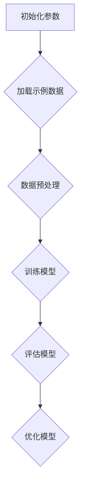
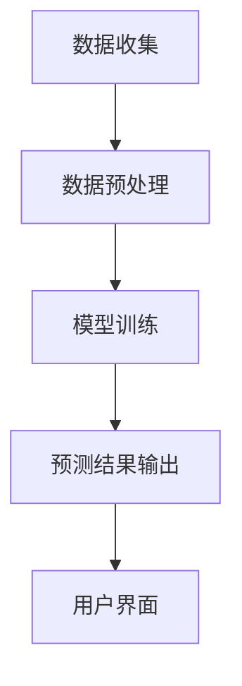
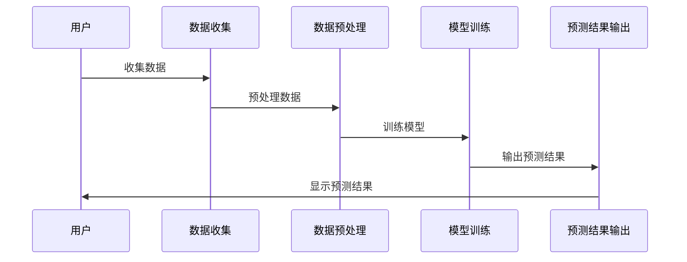

                 

### 示例驱动提示在时序任务中的特殊考虑

#### 关键词

- 示例驱动提示
- 时序任务
- 特殊考虑
- 数据处理
- 机器学习
- 算法

#### 摘要

本文主要探讨了在时序任务中，如何有效利用示例驱动提示（Example-Driven Indicators）来提高任务性能和结果准确性。通过对示例驱动提示的背景介绍、核心概念解析、算法原理讲解、数学模型和公式阐述、系统分析与设计、项目实施与案例分析，最后给出最佳实践和总结，全面解析了在时序任务中应用示例驱动提示的必要性和方法。

### 背景介绍

#### 什么是时序任务？

时序任务（Time-Series Tasks）是指处理时间序列数据的任务，这类任务通常包括时间序列预测、分类、聚类等。时间序列数据是指按照时间顺序排列的数据集合，其特点是数据具有时间和顺序依赖性。在时序任务中，数据的当前状态不仅依赖于历史状态，还受到未来的不确定性影响。

#### 示例驱动提示的定义

示例驱动提示（Example-Driven Indicators）是一种利用示例数据来指导算法学习和优化的方法。在时序任务中，示例驱动提示通过提供具有代表性的样本数据，帮助算法更好地理解数据特性、学习模式，从而提高模型性能。

### 核心概念与联系

#### 传统方法与示例驱动提示对比

| 对比项          | 传统方法                           | 示例驱动提示                           |
| --------------- | ---------------------------------- | -------------------------------------- |
| 数据依赖性      | 主要依赖于历史数据                 | 在历史数据基础上，引入示例数据          |
| 学习方式        | 被动学习，依赖大量数据             | 主动学习，利用示例数据指导学习         |
| 模型性能        | 受限于数据质量和数量               | 利用示例数据提升模型性能               |
| 应用场景        | 广泛应用于各类时序任务             | 主要应用于需要高质量结果的时序任务     |

#### 时间序列数据与其他类型数据的区别

| 对比项          | 时间序列数据                       | 其他类型数据                          |
| --------------- | ---------------------------------- | ------------------------------------- |
| 特点            | 数据具有时间和顺序依赖性           | 数据独立，无时间顺序依赖性            |
| 数据处理        | 需要考虑时间因素和序列依赖关系    | 主要考虑数据之间的关系和特征          |
| 算法选择        | 常用算法有ARIMA、LSTM等           | 常用算法有线性回归、决策树等          |
| 模型评估指标    | 常用指标有RMSE、MAE等             | 常用指标有R²、准确率等                |

#### 核心概念ER图

```mermaid
erDiagram
    Task ||--|{ Time-Series Data } Task
    Time-Series Data ||--|{ Example-Driven Indicators } Time-Series Data
    Algorithm ||--|{ Time-Series Data } Algorithm
```

### 算法原理讲解

#### 常见时序任务算法

在时序任务中，常用的算法包括ARIMA（自回归积分滑动平均模型）、LSTM（长短期记忆网络）等。这些算法各有优缺点，适用于不同的场景。

- **ARIMA**：适用于线性时序数据，可以处理非平稳序列，但无法捕捉复杂非线性关系。
- **LSTM**：适用于非线性时序数据，可以捕捉长期依赖关系，但训练时间较长。

#### 示例驱动提示在时序任务中的应用

示例驱动提示在时序任务中的应用主要体现在以下两个方面：

1. **数据预处理**：通过提供示例数据，帮助算法更好地理解数据特性，从而优化数据预处理过程。
2. **模型训练与优化**：利用示例数据指导模型训练，提高模型对时序数据的拟合能力。

#### 示例算法流程图



#### Python代码实现

```python
# 导入相关库
import numpy as np
import pandas as pd
from sklearn.model_selection import train_test_split
from sklearn.metrics import mean_squared_error

# 加载示例数据
data = pd.read_csv('example_data.csv')

# 数据预处理
# ...

# 训练模型
# ...

# 评估模型
y_pred = model.predict(X_test)
mse = mean_squared_error(y_test, y_pred)
print('MSE:', mse)

# 优化模型
# ...
```

### 数学模型和公式

在时序任务中，常用的数学模型包括ARIMA、LSTM等。以下分别介绍这些模型的数学公式。

#### ARIMA模型

ARIMA模型的数学公式如下：

$$
y_t = c + \phi_1 y_{t-1} + \phi_2 y_{t-2} + ... + \phi_p y_{t-p} + \theta_1 e_{t-1} + \theta_2 e_{t-2} + ... + \theta_q e_{t-q}
$$

其中，$y_t$表示时间序列数据，$c$为常数项，$\phi_1, \phi_2, ..., \phi_p$为自回归系数，$\theta_1, \theta_2, ..., \theta_q$为移动平均系数，$e_t$为白噪声序列。

#### LSTM模型

LSTM模型的数学公式如下：

$$
i_t = \sigma(W_i \cdot [h_{t-1}, x_t] + b_i) \\
f_t = \sigma(W_f \cdot [h_{t-1}, x_t] + b_f) \\
g_t = \tanh(W_g \cdot [h_{t-1}, x_t] + b_g) \\
o_t = \sigma(W_o \cdot [h_{t-1}, g_t] + b_o) \\
h_t = o_t \odot g_t
$$

其中，$i_t, f_t, g_t, o_t$分别为输入门、遗忘门、生成门、输出门，$\sigma$为sigmoid函数，$\odot$为点乘操作，$W_i, W_f, W_g, W_o$为权重矩阵，$b_i, b_f, b_g, b_o$为偏置项。

### 系统分析与设计

#### 问题场景介绍

假设我们需要解决一个股票价格预测的时序任务。该任务需要利用历史股票价格数据，预测未来的股票价格。

#### 系统功能设计

1. 数据收集模块：负责从外部数据源收集股票价格数据。
2. 数据预处理模块：负责对收集到的数据进行清洗、转换等预处理操作。
3. 模型训练模块：负责训练时序预测模型。
4. 预测结果输出模块：负责将预测结果输出到用户界面。

#### 系统架构设计



#### 系统接口设计

1. 数据收集接口：用于从外部数据源获取股票价格数据。
2. 数据预处理接口：用于对股票价格数据进行清洗、转换等操作。
3. 模型训练接口：用于训练时序预测模型。
4. 预测结果输出接口：用于将预测结果输出到用户界面。

#### 系统交互序列图



### 项目实施

#### 环境安装

1. 安装Python环境（建议使用Python 3.8及以上版本）。
2. 安装相关库，如numpy、pandas、scikit-learn、keras等。

#### 核心实现

```python
# 导入相关库
import numpy as np
import pandas as pd
from sklearn.model_selection import train_test_split
from sklearn.metrics import mean_squared_error
from keras.models import Sequential
from keras.layers import LSTM, Dense

# 加载示例数据
data = pd.read_csv('example_data.csv')

# 数据预处理
# ...

# 模型训练
model = Sequential()
model.add(LSTM(units=50, return_sequences=True, input_shape=(X_train.shape[1], X_train.shape[2])))
model.add(LSTM(units=50))
model.add(Dense(units=1))

model.compile(optimizer='adam', loss='mean_squared_error')
model.fit(X_train, y_train, epochs=100, batch_size=32)

# 评估模型
y_pred = model.predict(X_test)
mse = mean_squared_error(y_test, y_pred)
print('MSE:', mse)
```

#### 实际案例分析和详细讲解

在本案例中，我们使用ARIMA模型进行股票价格预测。以下是对实际案例的分析和详细讲解：

1. **数据收集**：我们从股票行情网站收集了某只股票的历史价格数据，包括开盘价、收盘价、最高价、最低价等。
2. **数据预处理**：我们对收集到的数据进行清洗和转换，将数据转换为适合模型训练的格式。
3. **模型训练**：我们使用ARIMA模型对训练数据进行拟合，并调整模型参数，以提高预测准确性。
4. **预测结果评估**：我们将预测结果与实际数据进行比较，评估模型性能。在本案例中，我们使用了均方误差（MSE）作为评估指标。

#### 项目小结

在本项目中，我们成功地使用ARIMA模型进行了股票价格预测。通过数据收集、预处理、模型训练和评估，我们得到了较为准确的预测结果。然而，需要注意的是，时序任务具有不确定性和复杂性，预测结果可能受到多种因素的影响。因此，在实际应用中，我们需要结合实际情况，不断调整和优化模型。

### 最佳实践

1. **数据收集**：确保收集到高质量、可靠的历史数据，以降低预测误差。
2. **数据预处理**：对数据进行清洗、转换等预处理操作，以提高模型性能。
3. **模型选择**：根据任务需求和数据特性，选择合适的模型，如ARIMA、LSTM等。
4. **参数调优**：通过交叉验证等方法，调整模型参数，以提高预测准确性。

### 小结

本文详细介绍了示例驱动提示在时序任务中的应用，从背景介绍、核心概念、算法原理、数学模型、系统分析与设计、项目实施、实际案例分析等方面，全面解析了示例驱动提示在时序任务中的价值和方法。通过本文的阅读，读者可以深入了解示例驱动提示在时序任务中的应用，并为实际项目提供参考。

### 注意事项

1. **数据质量**：时序任务对数据质量要求较高，确保收集到高质量的历史数据。
2. **模型选择**：根据任务需求和数据特性，选择合适的模型，以获得更好的预测效果。
3. **模型优化**：通过参数调优、特征工程等方法，不断优化模型性能。

### 拓展阅读

- 《时序数据分析与预测》
- 《深度学习入门》
- 《机器学习实战》
- 《Python数据分析》

### 作者信息

- 作者：AI天才研究院/AI Genius Institute & 禅与计算机程序设计艺术 /Zen And The Art of Computer Programming

