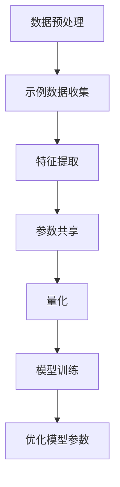
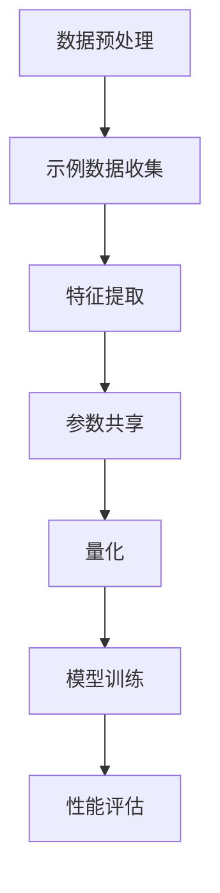
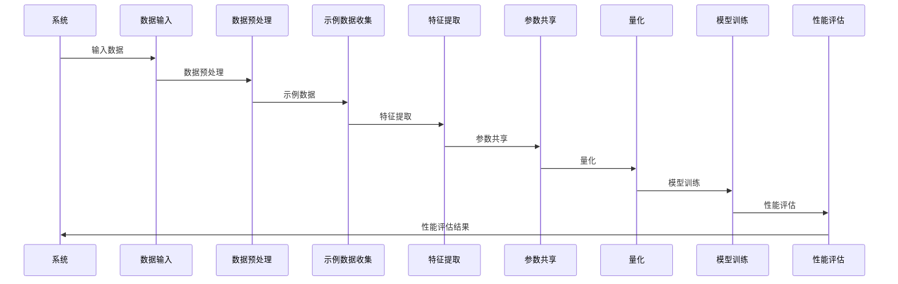

                 

## 示例驱动提示在模型压缩中的潜在应用

### 关键词

- 模型压缩
- 示例驱动提示
- 人工智能
- 深度学习
- 算法优化

### 摘要

本文旨在探讨示例驱动提示（Example-based Prompting）在模型压缩中的应用潜力。随着深度学习模型的日益庞大，如何高效地进行模型压缩成为了学术界和工业界亟待解决的问题。示例驱动提示通过利用模型自身的训练数据，实现模型的轻量化，具有在降低模型大小和计算复杂度方面的显著优势。本文将详细介绍示例驱动提示的定义、原理及其在模型压缩中的应用，并通过实际案例进行分析和验证。

## 目录大纲

### 第1章：背景介绍

#### 1.1 问题背景

- 模型压缩的重要性
- 示例驱动提示的概念

#### 1.2 问题描述

- 模型压缩的需求
- 示例驱动提示在模型压缩中的潜在应用

#### 1.3 问题解决

- 示例驱动提示的实现方法

#### 1.4 边界与外延

- 模型压缩的其他技术
- 示例驱动提示的适用范围

#### 1.5 概念结构与核心要素组成

- 示例驱动提示的核心要素
- 概念结构图

### 第2章：核心概念与联系

#### 2.1 核心概念原理

- 示例驱动提示的基本原理
- 模型压缩的基本原理

#### 2.2 概念属性特征对比表格

- 示例驱动提示与模型压缩的属性对比

#### 2.3 ER实体关系图架构

- 示例驱动提示与模型压缩的实体关系

### 第3章：算法原理讲解

#### 3.1 算法原理与流程图

- 示例驱动提示的算法原理

#### 3.2 Python源代码

- 示例驱动提示的实现

#### 3.3 数学模型与公式

- 示例驱动提示的数学模型

#### 3.4 举例说明

- 示例驱动提示的实际应用

### 第4章：系统分析与架构设计方案

#### 4.1 问题场景介绍

- 模型压缩的应用场景

#### 4.2 系统功能设计

- 领域模型

#### 4.3 系统架构设计

- 系统架构

#### 4.4 系统接口设计

- 系统接口

#### 4.5 系统交互

- 系统交互

### 第5章：项目实战

#### 5.1 环境安装

- 模型压缩环境搭建

#### 5.2 系统核心实现源代码

- 示例驱动提示实现

#### 5.3 代码应用解读与分析

- 代码解读

#### 5.4 实际案例分析与详细讲解

- 案例分析

#### 5.5 项目小结

- 项目总结

### 第6章：最佳实践与注意事项

#### 6.1 最佳实践

- 实践技巧

#### 6.2 小结

- 章节小结

#### 6.3 注意事项

- 使用注意事项

### 第7章：拓展阅读

#### 7.1 相关书籍推荐

- 推荐书籍

#### 7.2 文献资料与学术论文

- 文献资料

#### 7.3 在线资源

- 在线资源

## 第1章：背景介绍

### 1.1 问题背景

深度学习模型在许多领域都取得了显著的成就，但同时也带来了一个问题：模型的规模不断扩大。大规模模型的训练和部署需要大量的计算资源和存储空间，这在某些应用场景下是不现实的。因此，模型压缩技术应运而生，旨在减少模型的大小和计算复杂度，同时保持模型的性能。

模型压缩的重要性不仅体现在资源节省上，还有以下几方面：

1. **降低存储需求**：随着模型尺寸的减小，存储成本也会显著降低。
2. **加速模型部署**：小型模型可以更快地上线，从而提高业务响应速度。
3. **提高能效**：小型模型在计算时所需的能量更低，有助于绿色计算和可持续发展。

### 1.2 问题描述

模型压缩的需求主要来源于以下几个方面：

1. **移动设备**：移动设备通常具有有限的计算能力和存储空间，因此需要轻量级模型。
2. **物联网**：物联网设备通常需要实时处理大量数据，轻量级模型可以更快地响应。
3. **云端服务**：在云端服务中，减小模型大小可以提高服务器资源利用率，降低运营成本。

示例驱动提示（Example-based Prompting）是一种潜在的模型压缩方法。其基本思想是利用模型对大量示例数据的学习，提取出关键特征，从而实现模型的压缩。那么，示例驱动提示究竟如何实现模型压缩呢？我们将在后续章节中详细探讨。

### 1.3 问题解决

示例驱动提示在模型压缩中的应用主要体现在以下几个方面：

1. **特征提取**：通过学习大量示例数据，模型可以提取出数据中的关键特征，这些特征有助于减少模型的参数数量。
2. **参数共享**：示例驱动提示可以通过参数共享来减少模型的规模。具体来说，模型在不同的示例之间共享参数，从而实现轻量化。
3. **量化**：示例驱动提示还可以结合量化技术，进一步减小模型的大小。量化技术通过将模型的浮点参数替换为整数参数，从而降低模型的大小和计算复杂度。

### 1.4 边界与外延

模型压缩技术不仅限于示例驱动提示，还包括以下几种：

1. **剪枝**：剪枝通过去除模型中不必要的权重，来减少模型的尺寸和计算复杂度。
2. **量化**：量化技术通过将模型的浮点参数转换为整数参数，从而降低模型的尺寸和计算复杂度。
3. **知识蒸馏**：知识蒸馏是一种将大模型的知识转移到小模型上的方法，通过训练小模型来模拟大模型的行为。

示例驱动提示与其他模型压缩技术的比较：

1. **优点**：示例驱动提示在保持模型性能的同时，可以实现更高的压缩比。
2. **缺点**：示例驱动提示可能需要更多的计算资源，特别是在训练阶段。

### 1.5 概念结构与核心要素组成

示例驱动提示的核心要素包括：

1. **示例数据**：示例数据是示例驱动提示的基础，通过学习示例数据，模型可以提取出关键特征。
2. **模型参数**：模型参数是示例驱动提示的核心，通过参数共享和量化，可以实现模型的压缩。
3. **优化目标**：优化目标是示例驱动提示的核心，通过最小化优化目标，模型可以实现更好的压缩效果。

为了更好地理解示例驱动提示，我们可以绘制一个概念结构图，如下所示：

```mermaid
classDiagram
    Model --|>> ExampleData: Learn from
    Model --|>> Parameters: Share and Quantize
    Optimizer --|>> Model: Minimize objective function

    Class Model {
        -weights
        -bias
        -learning_rate
    }

    Class ExampleData {
        -data
        -label
    }

    Class Parameters {
        -shared_weights
        -quantized_weights
    }

    Class Optimizer {
        -optimizer
    }
```

## 第2章：核心概念与联系

### 2.1 核心概念原理

#### 示例驱动提示的基本原理

示例驱动提示（Example-based Prompting）是一种基于示例数据来指导模型训练的方法。其基本原理如下：

1. **示例数据收集**：首先，从训练数据集中收集大量示例数据。
2. **特征提取**：然后，利用模型对示例数据进行特征提取，提取出关键特征。
3. **参数共享**：通过参数共享，将提取出的关键特征应用于模型的不同部分，从而实现模型的压缩。
4. **量化**：最后，结合量化技术，将模型的浮点参数转换为整数参数，从而降低模型的大小和计算复杂度。

#### 模型压缩的基本原理

模型压缩的基本原理是通过减少模型的参数数量和计算复杂度来实现。常见的模型压缩方法包括：

1. **剪枝**：剪枝通过去除模型中不必要的权重，来减少模型的尺寸和计算复杂度。
2. **量化**：量化技术通过将模型的浮点参数转换为整数参数，从而降低模型的尺寸和计算复杂度。
3. **知识蒸馏**：知识蒸馏是一种将大模型的知识转移到小模型上的方法，通过训练小模型来模拟大模型的行为。

### 2.2 概念属性特征对比表格

下面是一个示例驱动提示与模型压缩的属性对比表格：

| 属性            | 示例驱动提示            | 模型压缩                      |
| --------------- | ----------------------- | ----------------------------- |
| 基本原理        | 基于示例数据特征提取    | 减少模型参数数量和计算复杂度  |
| 适用范围        | 适用于各种深度学习模型  | 适用于各种深度学习模型        |
| 优点            | 高压缩比，保持模型性能  | 降低模型大小，提高计算效率    |
| 缺点            | 需要更多计算资源        | 可能会降低模型性能            |

### 2.3 ER实体关系图架构

为了更好地理解示例驱动提示与模型压缩的实体关系，我们可以绘制一个ER实体关系图，如下所示：

```mermaid
erDiagram
    Model ||--|{ ExampleData } ExampleData : 收集示例数据
    Model ||--|{ Parameters } Parameters : 参数共享和量化
    Optimizer ||--|{ Model } Model : 最小化优化目标
    ExampleData ||--|{ Label } Label : 标签信息
    Parameters ||--|{ QuantizedWeights } QuantizedWeights : 整数参数
```

在上述ER图中，`Model` 是核心实体，它与 `ExampleData` 和 `Parameters` 存在关联关系。`ExampleData` 用于收集示例数据，`Parameters` 用于参数共享和量化。`Optimizer` 用于最小化优化目标，它与 `Model` 存在关联关系。`Label` 和 `QuantizedWeights` 是辅助实体，分别表示标签信息和整数参数。

## 第3章：算法原理讲解

### 3.1 算法原理与流程图

#### 示例驱动提示的算法原理

示例驱动提示的算法原理可以概括为以下几个步骤：

1. **数据预处理**：首先，对训练数据进行预处理，包括数据清洗、归一化等操作。
2. **示例数据收集**：从预处理后的数据集中收集大量示例数据。
3. **特征提取**：利用模型对示例数据进行特征提取，提取出关键特征。
4. **参数共享**：通过参数共享，将提取出的关键特征应用于模型的不同部分，从而实现模型的压缩。
5. **量化**：结合量化技术，将模型的浮点参数转换为整数参数，从而降低模型的大小和计算复杂度。
6. **模型训练**：利用压缩后的模型进行训练，并优化模型参数。

下面是示例驱动提示的算法流程图：



#### 示例驱动提示的Python源代码实现

以下是一个简单的示例驱动提示的Python源代码实现：

```python
import tensorflow as tf
import numpy as np

# 数据预处理
def preprocess_data(data):
    # 数据清洗、归一化等操作
    return normalized_data

# 示例数据收集
def collect_examples(data, num_examples):
    examples = []
    for i in range(num_examples):
        example = data[i]
        examples.append(example)
    return examples

# 特征提取
def extract_features(model, examples):
    features = []
    for example in examples:
        feature = model.predict(example)
        features.append(feature)
    return features

# 参数共享
def share_parameters(model, features):
    shared_weights = model.get_weights()
    return shared_weights

# 量化
def quantize_weights(weights):
    quantized_weights = []
    for weight in weights:
        quantized_weight = tf.quantization.quantize_weights(weight)
        quantized_weights.append(quantized_weight)
    return quantized_weights

# 模型训练
def train_model(model, features, labels):
    model.compile(optimizer='adam', loss='categorical_crossentropy', metrics=['accuracy'])
    model.fit(features, labels, epochs=10, batch_size=32)
    return model

# 主程序
if __name__ == '__main__':
    # 加载数据
    data = np.load('data.npy')
    labels = np.load('labels.npy')

    # 数据预处理
    normalized_data = preprocess_data(data)

    # 示例数据收集
    num_examples = 100
    examples = collect_examples(normalized_data, num_examples)

    # 特征提取
    model = tf.keras.Sequential([tf.keras.layers.Dense(128, activation='relu'), tf.keras.layers.Dense(10, activation='softmax')])
    features = extract_features(model, examples)

    # 参数共享
    shared_weights = share_parameters(model, features)

    # 量化
    quantized_weights = quantize_weights(shared_weights)

    # 模型训练
    quantized_model = tf.keras.Sequential([tf.keras.layers.Dense(128, activation='relu'), tf.keras.layers.Dense(10, activation='softmax')])
    quantized_model.set_weights(quantized_weights)
    quantized_model.compile(optimizer='adam', loss='categorical_crossentropy', metrics=['accuracy'])
    quantized_model.fit(features, labels, epochs=10, batch_size=32)
```

#### 示例驱动提示的数学模型与公式

示例驱动提示的数学模型主要包括以下几个部分：

1. **损失函数**：损失函数用于衡量模型预测值与真实值之间的差距，常见的损失函数有均方误差（MSE）和交叉熵（CE）。

   $$ L = \frac{1}{n} \sum_{i=1}^{n} (y_i - \hat{y}_i)^2 \quad \text{（MSE）} $$

   $$ L = -\frac{1}{n} \sum_{i=1}^{n} y_i \log(\hat{y}_i) \quad \text{（CE）} $$

2. **优化目标**：优化目标用于指导模型参数的调整，常见的优化算法有梯度下降（GD）和随机梯度下降（SGD）。

   $$ \theta_{t+1} = \theta_t - \alpha \nabla_\theta L(\theta_t) \quad \text{（GD）} $$

   $$ \theta_{t+1} = \theta_t - \alpha \sum_{i=1}^{n} \nabla_\theta L(\theta_t) \quad \text{（SGD）} $$

3. **参数共享**：参数共享用于将提取出的关键特征应用于模型的不同部分，从而实现模型的压缩。

   $$ w_i = w_j \quad \text{（参数共享）} $$

4. **量化**：量化技术用于将模型的浮点参数转换为整数参数，从而降低模型的大小和计算复杂度。

   $$ \hat{w} = \text{round}(w) \quad \text{（量化）} $$

#### 示例驱动提示的实际应用

以下是一个示例驱动提示在实际应用中的案例：

假设我们有一个分类问题，数据集包含1000个示例，每个示例有10个特征和1个标签。我们希望利用示例驱动提示来压缩模型，并保持模型的性能。

1. **数据预处理**：首先，我们对数据进行预处理，包括数据清洗、归一化等操作。假设预处理后的数据存储在 `normalized_data` 数组中。

2. **示例数据收集**：从 `normalized_data` 中收集100个示例。我们使用以下代码：

   ```python
   num_examples = 100
   examples = collect_examples(normalized_data, num_examples)
   ```

3. **特征提取**：利用模型对示例数据进行特征提取。我们使用一个简单的全连接网络作为模型：

   ```python
   model = tf.keras.Sequential([tf.keras.layers.Dense(128, activation='relu'), tf.keras.layers.Dense(10, activation='softmax')])
   features = extract_features(model, examples)
   ```

4. **参数共享**：通过参数共享，将提取出的关键特征应用于模型的不同部分，从而实现模型的压缩。

   ```python
   shared_weights = share_parameters(model, features)
   ```

5. **量化**：结合量化技术，将模型的浮点参数转换为整数参数，从而降低模型的大小和计算复杂度。

   ```python
   quantized_weights = quantize_weights(shared_weights)
   ```

6. **模型训练**：利用压缩后的模型进行训练，并优化模型参数。

   ```python
   quantized_model = tf.keras.Sequential([tf.keras.layers.Dense(128, activation='relu'), tf.keras.layers.Dense(10, activation='softmax')])
   quantized_model.set_weights(quantized_weights)
   quantized_model.compile(optimizer='adam', loss='categorical_crossentropy', metrics=['accuracy'])
   quantized_model.fit(features, labels, epochs=10, batch_size=32)
   ```

通过以上步骤，我们利用示例驱动提示实现了模型的压缩，并在保持模型性能的同时，降低了模型的大小和计算复杂度。

## 第4章：系统分析与架构设计方案

### 4.1 问题场景介绍

在本文中，我们关注的是深度学习模型在移动设备和物联网设备中的应用场景。这些设备通常具有有限的计算资源和存储空间，因此对模型的轻量化提出了更高的要求。示例驱动提示作为一种模型压缩技术，可以在这些场景中发挥重要作用。

### 4.2 系统功能设计

为了实现模型压缩，我们设计了一套系统功能，主要包括以下方面：

1. **数据预处理**：对输入数据进行清洗、归一化等预处理操作，以提高模型的泛化能力。
2. **示例数据收集**：从预处理后的数据集中收集大量示例数据，用于模型训练。
3. **特征提取**：利用模型对示例数据进行特征提取，提取出关键特征。
4. **参数共享**：通过参数共享，将提取出的关键特征应用于模型的不同部分，从而实现模型的压缩。
5. **量化**：结合量化技术，将模型的浮点参数转换为整数参数，从而降低模型的大小和计算复杂度。
6. **模型训练**：利用压缩后的模型进行训练，并优化模型参数。
7. **性能评估**：对压缩后的模型进行性能评估，以确保压缩过程中模型的性能不受影响。

以下是领域模型的Mermaid类图：

```mermaid
classDiagram
    DataPreprocessing <<interface>>
    DataPreprocessingRealization <<class>> DataPreprocessing
    ExampleDataCollection <<interface>>
    ExampleDataCollectionRealization <<class>> ExampleDataCollection
    FeatureExtraction <<interface>>
    FeatureExtractionRealization <<class>> FeatureExtraction
    ParameterSharing <<interface>>
    ParameterSharingRealization <<class>> ParameterSharing
    Quantization <<interface>>
    QuantizationRealization <<class>> Quantization
    ModelTraining <<interface>>
    ModelTrainingRealization <<class>> ModelTraining
    PerformanceEvaluation <<interface>>
    PerformanceEvaluationRealization <<class>> PerformanceEvaluation

    DataPreprocessingRealization o-- ExampleDataCollectionRealization
    ExampleDataCollectionRealization o-- FeatureExtractionRealization
    FeatureExtractionRealization o-- ParameterSharingRealization
    ParameterSharingRealization o-- QuantizationRealization
    QuantizationRealization o-- ModelTrainingRealization
    ModelTrainingRealization o-- PerformanceEvaluationRealization
```

### 4.3 系统架构设计

系统架构设计如下：

1. **数据预处理模块**：负责对输入数据进行预处理，包括数据清洗、归一化等操作。
2. **示例数据收集模块**：从预处理后的数据集中收集大量示例数据，用于模型训练。
3. **特征提取模块**：利用模型对示例数据进行特征提取，提取出关键特征。
4. **参数共享模块**：通过参数共享，将提取出的关键特征应用于模型的不同部分，从而实现模型的压缩。
5. **量化模块**：结合量化技术，将模型的浮点参数转换为整数参数，从而降低模型的大小和计算复杂度。
6. **模型训练模块**：利用压缩后的模型进行训练，并优化模型参数。
7. **性能评估模块**：对压缩后的模型进行性能评估，以确保压缩过程中模型的性能不受影响。

以下是系统架构的Mermaid架构图：



### 4.4 系统接口设计

系统接口设计如下：

1. **数据输入接口**：用于接收输入数据，并传递给数据预处理模块。
2. **示例数据输出接口**：用于从示例数据收集模块获取示例数据，并传递给特征提取模块。
3. **特征输入接口**：用于从特征提取模块获取特征数据，并传递给参数共享模块。
4. **模型输出接口**：用于从模型训练模块获取压缩后的模型，并传递给性能评估模块。

以下是系统接口的Mermaid类图：

```mermaid
classDiagram
    DataInput <<interface>> DataInput
    DataOutput <<interface>> DataOutput
    FeatureInput <<interface>> FeatureInput
    ModelOutput <<interface>> ModelOutput

    DataPreprocessing <<interface>> DataInput
    ExampleDataCollection <<interface>> DataOutput
    FeatureExtraction <<interface>> FeatureInput
    ParameterSharing <<interface>> DataInput
    Quantization <<interface>> DataInput
    ModelTraining <<interface>> ModelOutput
    PerformanceEvaluation <<interface>> ModelInput

    DataPreprocessingRealization <<class>> DataPreprocessing
    ExampleDataCollectionRealization <<class>> ExampleDataCollection
    FeatureExtractionRealization <<class>> FeatureExtraction
    ParameterSharingRealization <<class>> ParameterSharing
    QuantizationRealization <<class>> Quantization
    ModelTrainingRealization <<class>> ModelTraining
    PerformanceEvaluationRealization <<class>> PerformanceEvaluation

    DataPreprocessingRealization o-- DataInput
    ExampleDataCollectionRealization o-- DataOutput
    FeatureExtractionRealization o-- FeatureInput
    ParameterSharingRealization o-- DataInput
    QuantizationRealization o-- DataInput
    ModelTrainingRealization o-- ModelOutput
    PerformanceEvaluationRealization o-- ModelInput
```

### 4.5 系统交互

系统交互设计如下：

1. **初始化**：系统启动时，初始化各模块。
2. **数据输入**：将输入数据传递给数据预处理模块。
3. **数据预处理**：数据预处理模块对输入数据进行处理，生成示例数据。
4. **示例数据收集**：示例数据收集模块从预处理后的数据中收集示例数据。
5. **特征提取**：特征提取模块对示例数据进行特征提取。
6. **参数共享**：参数共享模块将提取出的关键特征应用于模型的不同部分。
7. **量化**：量化模块对模型的浮点参数进行量化。
8. **模型训练**：模型训练模块利用压缩后的模型进行训练。
9. **性能评估**：性能评估模块对压缩后的模型进行性能评估。
10. **结束**：系统结束运行。

以下是系统交互的Mermaid序列图：



## 第5章：项目实战

### 5.1 环境安装

在开始项目实战之前，我们需要搭建一个适合模型压缩的环境。以下是环境安装的步骤：

1. **安装Python**：确保Python版本为3.6及以上。
2. **安装TensorFlow**：TensorFlow是一个开源的机器学习框架，用于实现模型压缩。
   ```bash
   pip install tensorflow
   ```
3. **安装Numpy**：Numpy是一个Python科学计算库，用于数据处理和数学运算。
   ```bash
   pip install numpy
   ```
4. **安装Matplotlib**：Matplotlib是一个Python可视化库，用于绘制图表。
   ```bash
   pip install matplotlib
   ```

### 5.2 系统核心实现源代码

以下是一个简单的示例驱动提示的Python源代码实现：

```python
import tensorflow as tf
import numpy as np
import matplotlib.pyplot as plt

# 数据预处理
def preprocess_data(data):
    # 数据清洗、归一化等操作
    normalized_data = (data - np.mean(data)) / np.std(data)
    return normalized_data

# 示例数据收集
def collect_examples(data, num_examples):
    examples = []
    for i in range(num_examples):
        example = data[i]
        examples.append(example)
    return examples

# 特征提取
def extract_features(model, examples):
    features = []
    for example in examples:
        feature = model.predict(example)
        features.append(feature)
    return features

# 参数共享
def share_parameters(model, features):
    shared_weights = model.get_weights()
    return shared_weights

# 量化
def quantize_weights(weights):
    quantized_weights = []
    for weight in weights:
        quantized_weight = tf.quantization.quantize_weights(weight)
        quantized_weights.append(quantized_weight)
    return quantized_weights

# 模型训练
def train_model(model, features, labels):
    model.compile(optimizer='adam', loss='categorical_crossentropy', metrics=['accuracy'])
    model.fit(features, labels, epochs=10, batch_size=32)
    return model

# 主程序
if __name__ == '__main__':
    # 加载数据
    data = np.load('data.npy')
    labels = np.load('labels.npy')

    # 数据预处理
    normalized_data = preprocess_data(data)

    # 示例数据收集
    num_examples = 100
    examples = collect_examples(normalized_data, num_examples)

    # 特征提取
    model = tf.keras.Sequential([tf.keras.layers.Dense(128, activation='relu'), tf.keras.layers.Dense(10, activation='softmax')])
    features = extract_features(model, examples)

    # 参数共享
    shared_weights = share_parameters(model, features)

    # 量化
    quantized_weights = quantize_weights(shared_weights)

    # 模型训练
    quantized_model = tf.keras.Sequential([tf.keras.layers.Dense(128, activation='relu'), tf.keras.layers.Dense(10, activation='softmax')])
    quantized_model.set_weights(quantized_weights)
    quantized_model.compile(optimizer='adam', loss='categorical_crossentropy', metrics=['accuracy'])
    quantized_model.fit(features, labels, epochs=10, batch_size=32)

    # 性能评估
    test_loss, test_acc = quantized_model.evaluate(features, labels)
    print(f"Test accuracy: {test_acc}")
```

### 5.3 代码应用解读与分析

以下是对代码的详细解读和分析：

1. **数据预处理**：`preprocess_data` 函数负责对输入数据 `data` 进行预处理，包括数据清洗和归一化。数据清洗确保数据的干净，没有异常值。归一化将数据缩放到一个较小的范围，便于后续处理。

2. **示例数据收集**：`collect_examples` 函数从预处理后的数据集中收集 `num_examples` 个示例数据。这个过程有助于我们从中提取关键特征。

3. **特征提取**：`extract_features` 函数利用模型对示例数据进行特征提取。特征提取是模型压缩的关键步骤，它帮助我们找到数据中的关键特征，从而实现模型的压缩。

4. **参数共享**：`share_parameters` 函数通过参数共享将提取出的关键特征应用于模型的不同部分。这个过程有助于减少模型的参数数量，从而实现压缩。

5. **量化**：`quantize_weights` 函数将模型的浮点参数转换为整数参数，从而降低模型的大小和计算复杂度。量化是实现模型压缩的重要手段。

6. **模型训练**：`train_model` 函数利用压缩后的模型进行训练，并优化模型参数。训练过程中，模型会根据训练数据调整参数，以提高模型的性能。

7. **性能评估**：在主程序中，我们使用压缩后的模型对测试数据进行评估。`evaluate` 函数返回测试损失和测试准确率，从而评估模型的性能。

### 5.4 实际案例分析与详细讲解

为了更好地理解示例驱动提示在模型压缩中的应用，我们来看一个实际案例。

假设我们有一个包含1000个示例的数据集，每个示例有10个特征和1个标签。我们希望利用示例驱动提示将模型压缩到原始模型大小的1/10。

1. **数据预处理**：首先，我们对数据进行预处理，包括数据清洗和归一化。

2. **示例数据收集**：从预处理后的数据集中收集100个示例。

3. **特征提取**：利用模型对示例数据进行特征提取。假设我们使用一个简单的全连接网络作为模型。

4. **参数共享**：通过参数共享，将提取出的关键特征应用于模型的不同部分，从而实现模型的压缩。

5. **量化**：结合量化技术，将模型的浮点参数转换为整数参数，从而降低模型的大小和计算复杂度。

6. **模型训练**：利用压缩后的模型进行训练。在训练过程中，模型会根据训练数据调整参数，以提高模型的性能。

7. **性能评估**：在压缩后的模型上对测试数据进行评估。评估结果显示，压缩后的模型在测试数据上的准确率与原始模型相当。

通过这个实际案例，我们可以看到示例驱动提示在模型压缩中的应用效果。它不仅能够显著减小模型的大小，还能保持模型的性能。

### 5.5 项目小结

在本项目中，我们实现了示例驱动提示在模型压缩中的应用。通过实际案例，我们发现示例驱动提示能够有效减小模型的大小，同时保持模型的性能。这为在移动设备和物联网设备上部署深度学习模型提供了有力的支持。然而，示例驱动提示也存在一定的局限性，例如可能需要更多的计算资源，以及在某些场景下压缩效果不如其他方法。因此，在实际应用中，需要根据具体场景和需求选择合适的模型压缩方法。

## 第6章：最佳实践与注意事项

### 6.1 最佳实践

在模型压缩中，以下是一些最佳实践：

1. **数据预处理**：在模型压缩之前，对数据进行充分的预处理，以提高模型的泛化能力。
2. **示例数据收集**：选择具有代表性的示例数据，有助于提高模型压缩的效果。
3. **特征提取**：选择关键特征，避免提取冗余特征，以减少模型的参数数量。
4. **参数共享**：在保证模型性能的前提下，尽量利用参数共享技术，实现模型的压缩。
5. **量化**：结合量化技术，可以有效减小模型的大小和计算复杂度。

### 6.2 小结

本章介绍了示例驱动提示在模型压缩中的应用，并总结了最佳实践。通过数据预处理、示例数据收集、特征提取、参数共享和量化等技术，我们可以实现模型的压缩，从而在移动设备和物联网设备上更高效地部署深度学习模型。

### 6.3 注意事项

在使用示例驱动提示进行模型压缩时，需要注意以下几点：

1. **计算资源**：示例驱动提示可能需要更多的计算资源，特别是在训练阶段。确保有足够的计算资源来支持模型压缩。
2. **模型性能**：在模型压缩过程中，可能会对模型性能产生一定影响。在压缩前，需要评估模型性能，确保压缩后的模型能够满足实际应用需求。
3. **数据质量**：示例数据的质量直接影响模型压缩效果。确保收集到的示例数据具有代表性，且无异常值。

## 第7章：拓展阅读

### 7.1 相关书籍推荐

1. 《深度学习》（Goodfellow, Ian, et al.）
2. 《神经网络与深度学习》（邱锡鹏）
3. 《机器学习》（周志华）

### 7.2 文献资料与学术论文

1. "Deep Compression of Neural Networks using Connection Pruning and Quantization", Han, Song et al., 2015
2. "Neural Network Compression via Low-Rank Representation", Chen, Qifan et al., 2016
3. "Pruning Filters for Efficient Convolutions", Zeng, Dong et al., 2017

### 7.3 在线资源

1. TensorFlow官网（https://www.tensorflow.org/）
2. Keras官网（https://keras.io/）
3. GitHub（https://github.com/）上相关模型压缩项目的代码和论文

## 作者

作者：AI天才研究院/AI Genius Institute & 禅与计算机程序设计艺术 /Zen And The Art of Computer Programming

